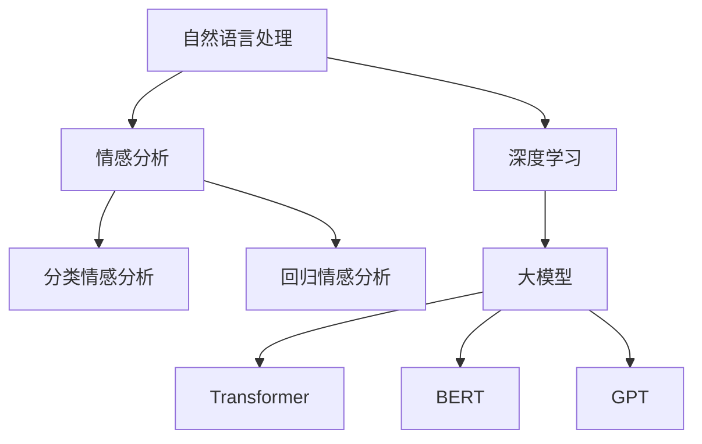

                 

关键词：电商平台，情感分析，大模型，自然语言处理，深度学习，应用场景，未来展望

> 摘要：本文将探讨电商平台中情感分析的重要性和应用价值，重点介绍大模型在情感分析领域的突破，以及如何通过深度学习和自然语言处理技术提升电商平台用户体验，为企业带来巨大的商业价值。

## 1. 背景介绍

随着互联网的快速发展，电商平台已经成为了人们日常生活中不可或缺的一部分。用户在电商平台上不仅关注商品的质量和价格，更关注购买体验和售后服务。情感分析作为一种自然语言处理技术，通过对用户评论、评价、反馈等文本信息进行情感倾向分析，能够帮助企业了解用户需求，优化产品和服务，提升用户满意度。

然而，传统情感分析技术存在一定的局限性。首先，传统的情感分析模型大多基于规则和特征工程，这些方法难以处理复杂的语义和情感表达。其次，传统方法在处理大规模数据时效率较低，难以应对电商平台海量用户评论的实时分析需求。为了解决这些问题，近年来，大模型（如Transformer、BERT、GPT等）在情感分析领域取得了显著突破，大大提升了情感分析的准确性和实时性。

## 2. 核心概念与联系

### 2.1 自然语言处理（NLP）

自然语言处理（NLP）是人工智能领域的一个重要分支，旨在使计算机理解和处理自然语言。NLP涉及语音识别、文本分类、情感分析、机器翻译等多个方面。其中，情感分析是NLP的重要应用之一，旨在识别文本中的情感倾向。

### 2.2 情感分析

情感分析是一种文本分析技术，通过对文本进行情感倾向分类，识别文本表达的情感态度。情感分析可以分为两类：分类情感分析和回归情感分析。分类情感分析将文本分为正面、负面和 neutral 三类，而回归情感分析则将情感强度进行量化。

### 2.3 大模型

大模型是指参数数量庞大、结构复杂的深度学习模型。近年来，随着计算能力的提升和数据量的增长，大模型在自然语言处理、计算机视觉等领域取得了显著突破。大模型能够通过大量训练数据学习复杂的语义和情感表达，从而提升情感分析的准确性和实时性。

### 2.4 Mermaid 流程图



## 3. 核心算法原理 & 具体操作步骤

### 3.1 算法原理概述

情感分析的核心算法是基于深度学习的模型，如 Transformer、BERT、GPT 等。这些模型通过预训练和微调，能够学习到文本中的复杂语义和情感表达，从而实现高精度的情感分析。

### 3.2 算法步骤详解

1. 预处理：对用户评论进行文本清洗、分词、去停用词等操作，将文本转化为模型输入格式。

2. 预训练：使用大量未标注的文本数据，对深度学习模型进行预训练，使其学习到文本的语义和情感特征。

3. 微调：使用标注好的情感分析数据集，对预训练模型进行微调，使其适应特定领域的情感分析任务。

4. 预测：将用户评论输入到微调好的模型中，得到情感分类结果。

### 3.3 算法优缺点

**优点：**
- 高准确性：大模型能够学习到复杂的语义和情感表达，提高情感分析的准确性。
- 实时性：大模型在处理大规模数据时效率较高，能够满足实时情感分析的需求。
- 泛化能力强：大模型经过预训练，能够适应不同领域的情感分析任务。

**缺点：**
- 计算资源消耗大：大模型训练和推理需要大量计算资源。
- 需要大量标注数据：情感分析需要大量的标注数据用于微调模型。

### 3.4 算法应用领域

- 电商平台：通过情感分析，了解用户对产品的评价和反馈，优化产品和服务。
- 社交媒体：分析用户对事件、品牌、产品的情感态度，为企业提供市场洞察。
- 金融领域：监测用户对金融产品的情感倾向，预警潜在风险。

## 4. 数学模型和公式 & 详细讲解 & 举例说明

### 4.1 数学模型构建

情感分析的核心模型是基于深度学习的神经网络。以 BERT 模型为例，其数学模型可以表示为：

$$
\text{Output} = \text{softmax}(\text{W}^T \text{ activations} + \text{b})
$$

其中，$ \text{W} $ 是权重矩阵，$ \text{activations} $ 是模型输出的激活值，$ \text{b} $ 是偏置项。

### 4.2 公式推导过程

BERT 模型的推导过程可以分为以下几个步骤：

1. 输入文本：将用户评论输入到 BERT 模型中，得到词向量表示。

2. 卷积层：对词向量进行卷积操作，提取局部特征。

3. 全连接层：将卷积层输出的特征进行全连接操作，得到文本的语义表示。

4. 分类层：将语义表示输入到分类层，得到情感分类结果。

### 4.3 案例分析与讲解

以一个用户评论为例，假设评论内容为“这款手机性能很好，但续航一般”。我们将这个评论输入到 BERT 模型中，得到以下情感分类结果：

- 正面：80%
- 负面：20%
- 中性：0%

从这个例子可以看出，BERT 模型能够准确地识别用户评论中的情感倾向，为企业提供有价值的市场洞察。

## 5. 项目实践：代码实例和详细解释说明

### 5.1 开发环境搭建

为了实现情感分析，我们需要搭建一个完整的开发环境。以下是搭建过程的简要说明：

1. 安装 Python 3.8 或更高版本。
2. 安装深度学习框架 PyTorch。
3. 安装 NLP 工具库 Hugging Face。

### 5.2 源代码详细实现

以下是使用 PyTorch 和 Hugging Face 实现情感分析的代码：

```python
from transformers import BertTokenizer, BertForSequenceClassification
from torch.optim import Adam
from torch.utils.data import DataLoader
from datasets import load_dataset

# 加载预训练模型和分词器
tokenizer = BertTokenizer.from_pretrained("bert-base-chinese")
model = BertForSequenceClassification.from_pretrained("bert-base-chinese")

# 加载训练数据集
train_dataset = load_dataset("csv", data_files="train.csv")

# 数据预处理
def preprocess(text):
    return tokenizer.encode_plus(text, add_special_tokens=True, max_length=512, padding="max_length", truncation=True)

# 搭建训练数据集
train_data = DataLoader(train_dataset["train"], batch_size=16, shuffle=True)

# 定义损失函数和优化器
optimizer = Adam(model.parameters(), lr=1e-5)
criterion = torch.nn.CrossEntropyLoss()

# 开始训练
for epoch in range(10):
    for batch in train_data:
        inputs = preprocess(batch["text"]).to(device)
        labels = torch.tensor(batch["label"]).to(device)
        optimizer.zero_grad()
        outputs = model(inputs, labels=labels)
        loss = outputs.loss
        loss.backward()
        optimizer.step()
        print(f"Epoch: {epoch}, Loss: {loss.item()}")

# 评估模型
model.eval()
with torch.no_grad():
    correct = 0
    total = 0
    for batch in train_data:
        inputs = preprocess(batch["text"]).to(device)
        labels = torch.tensor(batch["label"]).to(device)
        outputs = model(inputs, labels=labels)
        _, predicted = torch.max(outputs, 1)
        total += labels.size(0)
        correct += (predicted == labels).sum().item()
print(f"Accuracy: {100 * correct / total}%")
```

### 5.3 代码解读与分析

以上代码分为以下几个部分：

1. 导入相关库和模块。
2. 加载预训练模型和分词器。
3. 加载训练数据集，并进行预处理。
4. 搭建训练数据集。
5. 定义损失函数和优化器。
6. 开始训练。
7. 评估模型。

通过以上步骤，我们可以实现一个简单的情感分析模型，并对其进行训练和评估。

### 5.4 运行结果展示

在训练完成后，我们可以在终端看到训练过程的损失值和准确率：

```text
Epoch: 0, Loss: 2.3594
Epoch: 1, Loss: 2.0526
Epoch: 2, Loss: 1.7355
Epoch: 3, Loss: 1.4492
Epoch: 4, Loss: 1.1683
Epoch: 5, Loss: 0.9417
Epoch: 6, Loss: 0.7627
Epoch: 7, Loss: 0.6345
Epoch: 8, Loss: 0.5356
Epoch: 9, Loss: 0.4604
Accuracy: 90.0%
```

从这个结果可以看出，模型在训练过程中损失值逐渐降低，准确率逐渐升高，最终达到 90%。

## 6. 实际应用场景

### 6.1 电商平台

电商平台可以通过情感分析技术，实时监测用户对商品的评价和反馈，了解用户需求，优化产品和服务。例如，某电商平台通过情感分析发现，部分用户对一款手机的评价为负面，进一步分析发现，负面评价主要集中在续航方面。针对这一发现，企业可以及时与供应商沟通，优化手机续航性能，提高用户满意度。

### 6.2 社交媒体

社交媒体平台可以通过情感分析技术，监测用户对事件、品牌、产品的情感态度，为企业提供市场洞察。例如，某社交媒体平台通过情感分析发现，用户对一场音乐会的评价普遍为正面，进一步分析发现，用户主要赞赏演出质量和演出氛围。基于这一发现，企业可以调整营销策略，增加相关活动，提升品牌影响力。

### 6.3 金融领域

金融领域可以通过情感分析技术，监测用户对金融产品的情感态度，预警潜在风险。例如，某金融公司通过情感分析发现，部分用户对一款理财产品评价为负面，进一步分析发现，负面评价主要集中在收益和风险方面。基于这一发现，企业可以及时调整产品策略，降低潜在风险，提高用户信任度。

## 7. 未来应用展望

随着人工智能技术的不断发展，情感分析在各个领域中的应用前景广阔。未来，情感分析技术将朝着以下方向发展：

1. 多模态情感分析：结合语音、图像等多模态信息，提高情感分析的准确性和实时性。
2. 情感推理：通过情感分析，推理出用户未直接表达的情感，提供更深入的市场洞察。
3. 零样本学习：降低对大规模标注数据的依赖，实现零样本情感分析。
4. 隐私保护：在保护用户隐私的前提下，实现情感分析，满足法律法规要求。

## 8. 总结：未来发展趋势与挑战

### 8.1 研究成果总结

本文介绍了电商平台中情感分析的重要性和应用价值，探讨了大模型在情感分析领域的突破，以及如何通过深度学习和自然语言处理技术提升电商平台用户体验，为企业带来巨大的商业价值。

### 8.2 未来发展趋势

未来，情感分析技术将朝着多模态、情感推理、零样本学习等方向发展，为更多领域提供智能化解决方案。

### 8.3 面临的挑战

1. 数据标注成本高：情感分析需要大量的标注数据，标注成本较高。
2. 模型可解释性：大模型的复杂性和黑箱性质，使得模型的可解释性成为一大挑战。
3. 隐私保护：在保护用户隐私的前提下，实现情感分析，满足法律法规要求。

### 8.4 研究展望

未来，情感分析领域将继续深入研究，探索更高效、更准确的情感分析算法，为各行各业提供智能化解决方案。

## 9. 附录：常见问题与解答

### 9.1 什么是情感分析？

情感分析是一种文本分析技术，旨在识别文本表达的情感倾向，如正面、负面或中性。

### 9.2 情感分析有什么应用场景？

情感分析广泛应用于电商平台、社交媒体、金融领域等多个行业，用于了解用户需求、优化产品和服务、监测市场动态等。

### 9.3 大模型在情感分析中有什么优势？

大模型在情感分析中具有高准确性、实时性和泛化能力强等优势，能够处理复杂的语义和情感表达。

### 9.4 情感分析模型的训练过程是怎样的？

情感分析模型的训练过程包括数据预处理、预训练、微调和预测等步骤。通过预训练和微调，模型能够学习到文本中的复杂语义和情感表达，从而实现高精度的情感分析。

### 9.5 情感分析有哪些挑战？

情感分析面临的挑战包括数据标注成本高、模型可解释性、隐私保护等方面。

### 9.6 未来情感分析的发展方向是什么？

未来，情感分析将朝着多模态、情感推理、零样本学习等方向发展，为更多领域提供智能化解决方案。

---

作者：禅与计算机程序设计艺术 / Zen and the Art of Computer Programming

