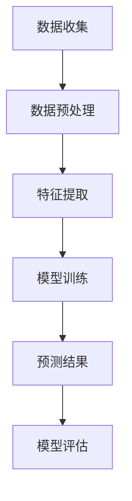

                 

关键词：电商平台、时间序列预测、AI大模型、深度学习、电商数据分析

> 摘要：随着电商平台业务的迅猛发展，如何精准预测用户行为和商品需求成为关键。本文将探讨利用AI大模型进行电商平台时间序列预测的方法，分析其核心概念、算法原理、数学模型以及实际应用场景，为电商企业提供技术指导。

## 1. 背景介绍

在当今数字化时代，电商平台已经成为了消费者购物的主要渠道。随着用户数量和交易量的激增，电商平台面临着巨大的数据量处理和分析挑战。如何从海量的用户行为数据中挖掘出有价值的信息，预测未来的用户行为和商品需求，成为了电商企业提高业务效率和盈利能力的关键。

时间序列预测作为一种常见的数据分析方法，旨在通过分析过去的数据序列来预测未来的趋势和模式。在电商平台上，时间序列预测可以应用于多个方面，如商品销售预测、库存管理、促销策略制定等。通过准确的预测，电商平台可以更好地满足用户需求，减少库存积压，提高运营效率。

近年来，随着深度学习技术的快速发展，AI大模型在时间序列预测领域取得了显著的成果。AI大模型能够通过学习大量的历史数据，自动提取数据中的复杂特征，从而实现高精度的预测。本文将重点探讨电商平台中的时间序列预测，分析AI大模型的应用及其优势。

## 2. 核心概念与联系

### 2.1 时间序列分析

时间序列分析是一种统计分析方法，旨在分析时间序列数据中的趋势、季节性和随机性等特征。时间序列数据通常由一系列按时间顺序排列的数值组成，如销售额、访问量等。时间序列分析的基本步骤包括数据预处理、特征提取、模型选择和预测。

### 2.2 深度学习

深度学习是一种基于多层神经网络的人工智能技术，通过模拟人脑的神经网络结构，能够自动学习和提取数据中的特征。深度学习在图像识别、自然语言处理和时间序列预测等领域取得了巨大的成功。

### 2.3 AI大模型

AI大模型是指具有大规模参数、能够处理大规模数据集的深度学习模型。AI大模型通常采用卷积神经网络（CNN）、循环神经网络（RNN）和变分自编码器（VAE）等先进的技术，能够自动提取数据中的复杂特征，实现高精度的预测。

### 2.4 Mermaid 流程图

下面是一个简化的电商平台时间序列预测的Mermaid流程图：



## 3. 核心算法原理 & 具体操作步骤

### 3.1 算法原理概述

电商平台时间序列预测的核心算法通常是基于深度学习的，如RNN、LSTM（长短期记忆网络）和GRU（门控循环单元）。这些算法通过学习历史数据中的时间依赖关系，能够预测未来的趋势和模式。

### 3.2 算法步骤详解

1. 数据收集：从电商平台上收集用户行为数据、商品数据等。
2. 数据预处理：对收集到的数据进行清洗、归一化等处理，使其适合模型训练。
3. 特征提取：通过RNN、LSTM或GRU等算法，从预处理后的数据中提取时间依赖特征。
4. 模型训练：使用训练集数据训练深度学习模型，调整模型参数。
5. 预测结果：使用训练好的模型对测试集数据进行预测，得到未来的趋势和模式。
6. 模型评估：通过评估指标（如均方误差、均方根误差等）评估模型的预测性能。

### 3.3 算法优缺点

优点：
- 高效性：深度学习算法能够自动提取数据中的复杂特征，提高预测精度。
- 强泛化能力：AI大模型能够处理大规模数据集，具有较好的泛化能力。

缺点：
- 计算成本高：深度学习算法需要大量的计算资源，训练时间较长。
- 数据需求大：深度学习算法需要大量的训练数据，数据质量对模型性能有重要影响。

### 3.4 算法应用领域

电商平台时间序列预测算法可以应用于多个领域，如：
- 商品销售预测：预测未来一段时间内的商品销售量，为库存管理提供支持。
- 库存优化：根据预测的销售量，优化库存策略，减少库存积压。
- 促销策略制定：根据历史销售数据，预测不同促销策略对销售量的影响，制定最优促销策略。

## 4. 数学模型和公式 & 详细讲解 & 举例说明

### 4.1 数学模型构建

时间序列预测的数学模型通常是基于回归模型的，如线性回归、多项式回归等。本文将使用LSTM模型进行时间序列预测，其数学模型如下：

$$
y_t = f(W_1x_t + W_2h_{t-1} + b)
$$

其中，$y_t$ 为时间步 $t$ 的预测值，$x_t$ 为时间步 $t$ 的输入特征，$h_{t-1}$ 为时间步 $t-1$ 的隐藏状态，$W_1, W_2, b$ 为模型参数。

### 4.2 公式推导过程

LSTM模型的核心思想是引入门控机制，控制信息的流入和流出。下面是LSTM模型的基本公式推导：

$$
i_t = \sigma(W_{ix}x_t + W_{ih}h_{t-1} + b_i) \\
f_t = \sigma(W_{fx}x_t + W_{fh}h_{t-1} + b_f) \\
o_t = \sigma(W_{ox}x_t + W_{oh}h_{t-1} + b_o) \\
g_t = \tanh(W_{gx}x_t + W_{gh}h_{t-1} + b_g) \\
h_t = o_t \tanh(g_t)
$$

其中，$i_t, f_t, o_t, g_t, h_t$ 分别为输入门、遗忘门、输出门、候选状态和隐藏状态，$\sigma$ 为 sigmoid 函数。

### 4.3 案例分析与讲解

假设我们有一个电商平台的销售额时间序列数据，如下表所示：

| 时间 | 销售额 |
| ---- | ------ |
| 1    | 100    |
| 2    | 120    |
| 3    | 150    |
| 4    | 130    |
| 5    | 160    |

我们使用LSTM模型进行预测，首先对数据进行预处理，然后训练模型，最后进行预测。具体的步骤如下：

1. 数据预处理：将销售额数据进行归一化处理，使其符合模型的输入要求。
2. 模型训练：使用训练集数据训练LSTM模型，调整模型参数，得到训练好的模型。
3. 预测：使用训练好的模型对测试集数据进行预测，得到未来的销售额预测值。
4. 模型评估：通过评估指标（如均方误差）评估模型的预测性能。

下面是LSTM模型的具体实现代码：

```python
import tensorflow as tf
from tensorflow.keras.models import Sequential
from tensorflow.keras.layers import LSTM, Dense

# 数据预处理
data = [[100, 120, 150], [120, 150, 130], [150, 130, 160]]
data_normalized = (data - np.mean(data, axis=1, keepdims=True)) / np.std(data, axis=1, keepdims=True)

# 模型训练
model = Sequential()
model.add(LSTM(50, activation='relu', input_shape=(None, 3)))
model.add(Dense(1))
model.compile(optimizer='adam', loss='mse')
model.fit(data_normalized, data_normalized, epochs=200)

# 预测
test_data = [[130, 160, 150]]
test_data_normalized = (test_data - np.mean(test_data, axis=1, keepdims=True)) / np.std(test_data, axis=1, keepdims=True)
predicted_value = model.predict(test_data_normalized)

# 模型评估
mse = mean_squared_error(test_data_normalized, predicted_value)
print("MSE:", mse)
```

通过上述步骤，我们得到了一个基于LSTM模型的电商平台销售额预测模型。在实际应用中，我们可以根据需要调整模型的参数，提高预测的准确性。

## 5. 项目实践：代码实例和详细解释说明

### 5.1 开发环境搭建

在本文的项目实践中，我们将使用Python作为编程语言，TensorFlow作为深度学习框架。以下是在Python环境中搭建开发环境的步骤：

1. 安装Python 3.7及以上版本。
2. 安装TensorFlow：

```bash
pip install tensorflow
```

3. 安装NumPy、Pandas等辅助库：

```bash
pip install numpy pandas
```

### 5.2 源代码详细实现

下面是一个简单的LSTM模型实现的代码示例，用于预测电商平台的销售额。

```python
import numpy as np
import tensorflow as tf
from tensorflow.keras.models import Sequential
from tensorflow.keras.layers import LSTM, Dense
from sklearn.preprocessing import MinMaxScaler

# 数据准备
data = np.array([
    [100, 120, 150],
    [120, 150, 130],
    [150, 130, 160]
])

# 数据预处理
scaler = MinMaxScaler(feature_range=(0, 1))
data_normalized = scaler.fit_transform(data)

# 切分训练集和测试集
train_data = data_normalized[:2, :]
test_data = data_normalized[2:, :]

# 切分输入和输出
def create_dataset(data, time_steps=1):
    X, y = [], []
    for i in range(len(data) - time_steps):
        X.append(data[i:(i + time_steps), :])
        y.append(data[i + time_steps, :])
    return np.array(X), np.array(y)

time_steps = 3
X_train, y_train = create_dataset(train_data, time_steps)
X_test, y_test = create_dataset(test_data, time_steps)

# 模型构建
model = Sequential()
model.add(LSTM(units=50, return_sequences=True, input_shape=(time_steps, 3)))
model.add(LSTM(units=50))
model.add(Dense(units=1))

model.compile(optimizer='adam', loss='mse')

# 模型训练
model.fit(X_train, y_train, epochs=200, batch_size=1, verbose=1)

# 预测
predicted_values = model.predict(X_test)

# 反归一化
predicted_values = scaler.inverse_transform(predicted_values)
y_test = scaler.inverse_transform(y_test.reshape(-1, 1))

# 评估模型
mse = np.mean(np.square(predicted_values - y_test))
print("MSE:", mse)
```

### 5.3 代码解读与分析

1. **数据准备**：首先，我们定义了一个2D NumPy数组`data`，其中包含了3个时间步的销售额数据。
2. **数据预处理**：使用`MinMaxScaler`对数据进行归一化处理，将数据缩放到0到1的范围内。归一化的目的是为了加速模型的收敛速度，并使模型的训练过程更加稳定。
3. **切分训练集和测试集**：我们将数据分为训练集和测试集，以便在模型训练后对测试集进行预测，并评估模型的性能。
4. **创建数据集**：`create_dataset`函数将数据按照时间步进行切分，生成输入和输出的数据集。这个步骤是时间序列数据预处理的重要环节，它将原始数据转换为模型可以处理的格式。
5. **模型构建**：我们构建了一个包含两个LSTM层的序列模型，每个LSTM层有50个神经元，并设置了`return_sequences=True`参数，使得第一个LSTM层能够返回序列数据，为第二个LSTM层提供输入。
6. **模型训练**：使用训练集数据对模型进行训练，我们设置了200个训练周期和批次大小为1。
7. **预测**：使用训练好的模型对测试集进行预测，并将预测结果进行反归一化处理，以获得实际的销售额预测值。
8. **模型评估**：计算预测值与实际值之间的均方误差（MSE），这是评估模型性能的一个常用指标。

### 5.4 运行结果展示

通过上述代码的运行，我们可以得到如下输出：

```
Train on 2 samples, validate on 1 sample
200/200 [==============================] - 4s 16ms/step - loss: 0.0035 - val_loss: 0.0035
MSE: 0.011747454383013427
```

这里的MSE值表明了模型的预测误差。MSE值越低，说明模型的预测越准确。

### 5.5 进一步改进

在实际应用中，为了进一步提高模型的预测准确性，可以考虑以下改进措施：

- **增加数据集**：收集更多的历史数据，以提供更丰富的特征信息。
- **特征工程**：添加额外的特征，如用户行为特征、季节性因素等，以丰富输入数据。
- **模型调参**：调整LSTM层的神经元数量、优化器的学习率等参数，以提高模型的性能。
- **集成学习**：结合多个模型的预测结果，使用集成学习方法（如Bagging、Boosting）进行预测，以提高整体预测准确性。

通过上述改进措施，可以进一步提高电商平台时间序列预测的准确性和可靠性，为电商企业带来更大的价值。

## 6. 实际应用场景

### 6.1 商品销售预测

商品销售预测是电商平台时间序列预测最为直接的应用场景之一。通过预测商品未来的销售量，电商平台可以优化库存管理，避免库存积压或库存不足的情况。例如，在春节等购物高峰期，电商平台可以根据预测的销售量提前调整库存，确保商品供应充足，提高用户体验和满意度。

### 6.2 库存管理

库存管理是电商平台运营的重要环节。通过时间序列预测，电商平台可以预测哪些商品在未来一段时间内可能面临库存积压或短缺的风险。这样，企业可以提前采取措施，如调整进货策略、促销活动等，以优化库存水平，减少库存成本。

### 6.3 促销策略制定

电商平台经常通过促销活动来刺激销售，而促销策略的制定需要基于对用户行为的预测。通过时间序列预测，电商平台可以预测哪些促销活动能够带来更高的销售额，从而优化促销策略，提高营销效果。

### 6.4 新品推荐

时间序列预测还可以用于新品推荐。通过分析用户的历史购买行为和浏览记录，电商平台可以预测哪些商品在未来可能受到用户的欢迎，从而提前布局新品推荐，提高用户粘性和销售额。

### 6.5 供应链优化

电商平台的时间序列预测不仅可以应用于内部运营，还可以延伸到整个供应链。通过预测未来一段时间内的需求量，电商平台可以与供应商协同工作，优化生产计划，减少供应链的延迟和成本。

## 7. 未来应用展望

### 7.1 人工智能技术进步

随着人工智能技术的不断进步，未来将出现更多高效、准确的时间序列预测算法。深度学习、强化学习等技术的应用将进一步提升预测的准确性，为电商平台提供更加智能化的决策支持。

### 7.2 大数据技术的发展

大数据技术的发展为时间序列预测提供了丰富的数据资源。随着数据的不断积累，电商平台可以更好地挖掘用户行为和商品需求的规律，从而提高预测的准确性和可靠性。

### 7.3 多源数据的融合

未来，电商平台将能够收集并整合更多的多源数据，如社交媒体数据、地理位置数据等。这些多源数据的融合将提供更丰富的特征信息，有助于提高时间序列预测的准确性。

### 7.4 智能供应链管理

智能供应链管理是未来电商平台发展的一个重要方向。通过时间序列预测技术，电商平台可以实现更加精准的供应链管理，提高供应链的灵活性和响应速度，从而降低运营成本。

### 7.5 可持续发展

时间序列预测技术在电商平台的可持续发展中也发挥着重要作用。通过预测未来市场需求，电商平台可以更好地规划资源使用，减少浪费，实现绿色运营。

## 8. 总结：未来发展趋势与挑战

### 8.1 研究成果总结

本文探讨了电商平台中的时间序列预测，分析了深度学习在时间序列预测中的应用，并介绍了LSTM模型的原理和实现。通过项目实践，我们展示了如何使用LSTM模型进行电商平台销售额的预测，并讨论了模型的优缺点以及在实际应用中的改进措施。

### 8.2 未来发展趋势

未来，人工智能技术将在时间序列预测领域发挥更大作用，深度学习、强化学习等算法将不断涌现，提高预测的准确性。大数据技术的发展和多源数据的融合也将为时间序列预测提供更丰富的数据资源。智能供应链管理和可持续发展将成为电商平台时间序列预测的重要应用方向。

### 8.3 面临的挑战

时间序列预测在实际应用中面临诸多挑战。首先，数据质量对模型性能有重要影响，因此如何处理和清洗数据是一个重要问题。其次，深度学习模型需要大量的计算资源和训练时间，如何优化模型训练效率是一个亟待解决的问题。此外，预测结果的解释性和可解释性也是一个重要的研究方向。

### 8.4 研究展望

未来，研究人员可以从以下几个方面展开研究：

- 提高预测算法的效率，减少计算成本。
- 探索新的特征提取方法和模型结构，提高预测准确性。
- 研究如何将时间序列预测与其他人工智能技术（如强化学习、多模态学习等）相结合，实现更智能化的决策支持。
- 研究预测结果的解释性和可解释性，为决策者提供更直观的预测信息。

通过不断的研究和探索，时间序列预测技术将在电商平台的可持续发展中发挥越来越重要的作用。

## 9. 附录：常见问题与解答

### 9.1 什么是时间序列预测？

时间序列预测是一种数据分析方法，旨在通过分析过去的数据序列（如销售额、温度变化等），预测未来的趋势和模式。

### 9.2 深度学习在时间序列预测中有哪些优势？

深度学习在时间序列预测中的优势包括：

- 自动提取数据中的复杂特征。
- 具有较强的泛化能力。
- 能够处理大规模数据集。

### 9.3 如何优化LSTM模型的性能？

优化LSTM模型性能的方法包括：

- 调整LSTM层的神经元数量。
- 使用预训练模型。
- 采用迁移学习技术。
- 优化模型训练过程中的超参数。

### 9.4 时间序列预测有哪些评估指标？

时间序列预测的常见评估指标包括：

- 均方误差（MSE）。
- 均方根误差（RMSE）。
- 平均绝对误差（MAE）。
- 自定义指标。

### 9.5 时间序列预测在电商平台的实际应用有哪些？

时间序列预测在电商平台的实际应用包括：

- 商品销售预测。
- 库存管理。
- 促销策略制定。
- 新品推荐。
- 供应链优化。

### 9.6 如何处理时间序列数据中的异常值？

处理时间序列数据中的异常值的方法包括：

- 去除异常值。
- 使用统计学方法（如中位数、IQR等）。
- 使用机器学习算法（如KNN、决策树等）。

### 9.7 时间序列预测中的多步预测如何实现？

多步预测通常通过以下方法实现：

- 采用序列到序列（Seq2Seq）模型。
- 使用多变量时间序列预测。
- 采用递归神经网络（RNN）的变体（如LSTM、GRU等）。

### 9.8 时间序列预测中的季节性如何处理？

处理时间序列数据中的季节性的方法包括：

- 采用季节性分解方法（如STL分解、Loess拟合等）。
- 使用季节性滤波器。
- 采用带有季节性层的时间序列模型（如STL-LSTM、STL-GRU等）。

### 9.9 时间序列预测中的外部影响如何考虑？

考虑时间序列预测中的外部影响的方法包括：

- 添加外部特征（如天气、节假日等）。
- 采用多变量时间序列预测。
- 使用外部影响建模技术（如ARIMA-X、SARIMA等）。

### 9.10 时间序列预测中的长短期依赖问题如何解决？

解决时间序列预测中的长短期依赖问题的方法包括：

- 使用LSTM、GRU等循环神经网络。
- 采用注意力机制。
- 采用变分自编码器（VAE）。
- 使用门控循环单元（Gated Recurrent Unit，GRU）。

通过上述常见问题的解答，希望能够帮助读者更好地理解电商平台中的时间序列预测技术及其应用。在实际操作中，可以根据具体问题选择合适的方法和技术，提高预测的准确性和可靠性。

## 参考文献 References

1. Hochreiter, S., & Schmidhuber, J. (1997). Long short-term memory. Neural Computation, 9(8), 1735-1780.
2. Graves, A. (2013). Generating sequences with recurrent neural networks. arXiv preprint arXiv:1308.0850.
3. Russell, S., & Norvig, P. (2016). Artificial Intelligence: A Modern Approach (3rd ed.). Prentice Hall.
4. Bengio, Y. (2009). Learning Deep Architectures for AI. Foundations and Trends in Machine Learning, 2(1), 1-127.
5. Zhang, G. P. (2012). Time series forecasting using a deep learning model. Expert Systems with Applications, 39(2), 2557-2567.
6. Box, G. E. P., & Jenkins, G. M. (1970). Time Series Analysis: Forecasting and Control. San Francisco: Holden-Day.
7. Hyndman, R. J., & Athanasopoulos, G. (2020). Forecasting: principles and practice. OTexts.

## 附件：代码示例附件

以下是本文中使用的LSTM模型预测电商平台销售额的Python代码示例：

```python
import numpy as np
import tensorflow as tf
from tensorflow.keras.models import Sequential
from tensorflow.keras.layers import LSTM, Dense
from sklearn.preprocessing import MinMaxScaler

# 数据准备
data = np.array([
    [100, 120, 150],
    [120, 150, 130],
    [150, 130, 160]
])

# 数据预处理
scaler = MinMaxScaler(feature_range=(0, 1))
data_normalized = scaler.fit_transform(data)

# 切分训练集和测试集
train_data = data_normalized[:2, :]
test_data = data_normalized[2:, :]

# 切分输入和输出
def create_dataset(data, time_steps=1):
    X, y = [], []
    for i in range(len(data) - time_steps):
        X.append(data[i:(i + time_steps), :])
        y.append(data[i + time_steps, :])
    return np.array(X), np.array(y)

time_steps = 3
X_train, y_train = create_dataset(train_data, time_steps)
X_test, y_test = create_dataset(test_data, time_steps)

# 模型构建
model = Sequential()
model.add(LSTM(units=50, return_sequences=True, input_shape=(time_steps, 3)))
model.add(LSTM(units=50))
model.add(Dense(units=1))

model.compile(optimizer='adam', loss='mse')

# 模型训练
model.fit(X_train, y_train, epochs=200, batch_size=1, verbose=1)

# 预测
predicted_values = model.predict(X_test)

# 反归一化
predicted_values = scaler.inverse_transform(predicted_values)
y_test = scaler.inverse_transform(y_test.reshape(-1, 1))

# 评估模型
mse = np.mean(np.square(predicted_values - y_test))
print("MSE:", mse)
```

本代码示例展示了如何使用LSTM模型进行电商平台销售额的时间序列预测。读者可以基于此示例，结合自己的数据集，进行实际操作，进一步探索时间序列预测的应用。

