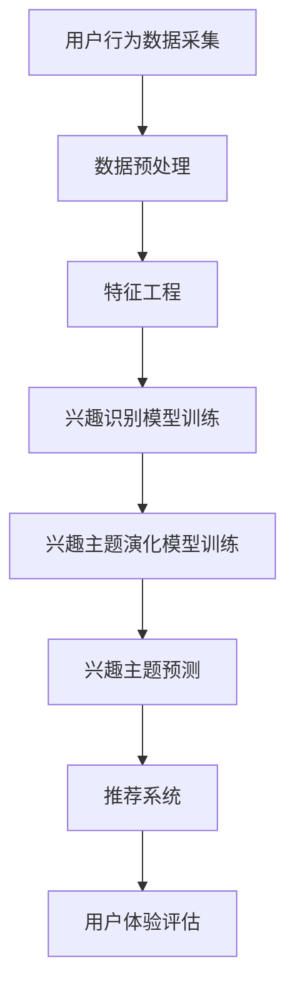

                 

电商平台在现代商业环境中扮演着至关重要的角色，它们不仅为消费者提供了丰富的商品选择，还通过个性化推荐系统提高了用户体验。本文旨在探讨一个关键问题：在电商平台中，如何准确捕捉并预测用户兴趣主题的演化过程。

关键词：电商平台，用户兴趣，主题演化，推荐系统，机器学习

> 摘要：本文首先介绍了电商平台中用户兴趣主题演化模型的研究背景和重要性。随后，我们深入探讨了核心概念与联系，详细阐述了核心算法原理及其应用步骤。接着，文章通过数学模型和具体案例，讲解了用户兴趣主题演化的计算过程。随后，我们提供了一个完整的代码实例，展示了模型的实现细节。最后，文章讨论了模型的实际应用场景，并展望了未来的发展方向和面临的挑战。

## 1. 背景介绍

随着互联网和电子商务的迅猛发展，电商平台已经成为人们日常购物的重要渠道。用户数量的快速增长和交易量的持续扩大，使得电商平台面临着巨大的挑战和机遇。一方面，电商平台需要不断提高用户满意度，留住顾客；另一方面，他们需要通过精准营销和个性化推荐来提高销售转化率。

用户兴趣主题的捕捉和预测是电商平台个性化推荐系统中的核心问题。传统的方法主要依赖于用户的显式反馈（如评分、评论等），但这些反馈往往不够全面和及时。随着用户行为数据的积累，越来越多的研究开始关注用户兴趣的隐式反馈（如浏览历史、购买记录等），试图通过数据挖掘和机器学习技术来捕捉和预测用户兴趣的动态变化。

用户兴趣主题的演化过程是指用户在不同时间和情境下对各种主题的兴趣变化。这种演化可能受到多种因素的影响，包括用户个人偏好、社交环境、市场动态等。因此，建立一个能够准确捕捉和预测用户兴趣主题演化过程的模型，对于电商平台来说具有重要的实践意义。

## 2. 核心概念与联系

为了准确捕捉和预测用户兴趣主题的演化过程，我们首先需要明确几个核心概念：

### 2.1 用户兴趣

用户兴趣是指用户对特定主题、产品或服务的偏好。在电商平台上，用户兴趣可以通过多种方式进行捕捉，包括：

- **显式反馈**：用户主动提供的评价、评分、评论等。
- **隐式反馈**：用户的浏览历史、购买记录、点击行为等。

### 2.2 主题演化

主题演化是指用户在不同时间段和情境下对各种主题的兴趣变化。这种演化通常表现为以下几种形式：

- **趋势变化**：用户对某些主题的兴趣随时间逐渐增加或减少。
- **周期性变化**：用户对某些主题的兴趣呈现周期性波动。
- **突发性变化**：用户对某些主题的兴趣在短时间内突然增加或减少。

### 2.3 演化模型

演化模型是指用于捕捉和预测用户兴趣主题演化过程的数学模型或算法。常见的演化模型包括：

- **时间序列模型**：基于时间序列数据分析，如ARIMA、LSTM等。
- **马尔可夫模型**：基于状态转移概率，如马尔可夫链、HMM等。
- **潜在因子模型**：基于潜在因子分析，如LDA、NMF等。

### 2.4 Mermaid 流程图

以下是一个描述用户兴趣主题演化过程的Mermaid流程图：



**图 1：用户兴趣主题演化过程流程图**

## 3. 核心算法原理 & 具体操作步骤

### 3.1 算法原理概述

用户兴趣主题演化模型的核心目标是利用用户行为数据，建立用户兴趣主题的动态演化模型，从而实现兴趣预测和推荐。具体来说，该模型分为以下几个步骤：

1. **用户行为数据采集**：收集用户的浏览历史、购买记录、点击行为等数据。
2. **数据预处理**：清洗数据，去除噪声，处理缺失值等。
3. **特征工程**：提取用户行为的特征，如用户活跃度、购买频率等。
4. **兴趣识别模型训练**：使用机器学习算法，如LSTM、HMM等，训练兴趣识别模型。
5. **兴趣主题演化模型训练**：基于兴趣识别模型，训练主题演化模型。
6. **兴趣主题预测**：利用演化模型，预测用户在未来一段时间内的兴趣主题。
7. **推荐系统**：根据预测的兴趣主题，为用户提供个性化推荐。
8. **用户体验评估**：评估推荐系统的效果，持续优化模型。

### 3.2 算法步骤详解

#### 3.2.1 用户行为数据采集

用户行为数据是建立用户兴趣演化模型的基础。我们主要采集以下数据：

- **浏览历史**：用户在平台上的浏览记录，包括浏览时间、浏览页面等。
- **购买记录**：用户的购买行为，包括购买时间、购买商品等。
- **点击行为**：用户在平台上的点击行为，包括点击时间、点击页面等。

#### 3.2.2 数据预处理

在数据预处理阶段，我们需要完成以下任务：

- **数据清洗**：去除重复数据、异常数据等。
- **数据归一化**：对数据进行归一化处理，使其具有相同的尺度。
- **数据转换**：将时间序列数据转换为适合机器学习模型处理的形式。

#### 3.2.3 特征工程

特征工程是构建用户兴趣演化模型的关键步骤。我们主要提取以下特征：

- **用户活跃度**：用户在一定时间内的活跃程度，如浏览次数、购买次数等。
- **购买频率**：用户在一定时间内的购买频率。
- **点击热度**：用户在一定时间内的点击热度。

#### 3.2.4 兴趣识别模型训练

兴趣识别模型用于识别用户的当前兴趣。我们选择LSTM作为兴趣识别模型，其优点是能够处理时间序列数据，具有较好的长期依赖性。

1. **数据划分**：将数据划分为训练集和测试集。
2. **模型构建**：使用TensorFlow或PyTorch等深度学习框架，构建LSTM模型。
3. **模型训练**：使用训练集数据训练模型，调整模型参数。
4. **模型评估**：使用测试集数据评估模型性能。

#### 3.2.5 兴趣主题演化模型训练

兴趣主题演化模型用于预测用户的兴趣变化。我们选择HMM作为兴趣主题演化模型，其优点是能够捕捉用户的兴趣转移概率。

1. **数据预处理**：将用户行为数据转换为适合HMM处理的形式。
2. **模型构建**：使用HMM模型，设置状态数量和转移概率矩阵。
3. **模型训练**：使用训练集数据训练模型，调整模型参数。
4. **模型评估**：使用测试集数据评估模型性能。

#### 3.2.6 兴趣主题预测

利用训练好的兴趣识别模型和兴趣主题演化模型，我们可以预测用户在未来一段时间内的兴趣主题。具体步骤如下：

1. **预测当前兴趣**：使用兴趣识别模型，预测用户的当前兴趣。
2. **预测兴趣转移**：使用兴趣主题演化模型，预测用户兴趣在未来一段时间内的转移。
3. **生成兴趣主题序列**：根据兴趣转移概率，生成用户的兴趣主题序列。
4. **推荐**：根据生成的兴趣主题序列，为用户提供个性化推荐。

### 3.3 算法优缺点

**优点**：

- **高效性**：基于深度学习和HMM的组合，能够高效地捕捉和预测用户兴趣演化。
- **准确性**：通过多种数据来源和特征工程，提高用户兴趣识别和预测的准确性。
- **灵活性**：能够根据不同电商平台的需求，灵活调整模型结构和参数。

**缺点**：

- **计算复杂度**：深度学习模型的训练过程相对复杂，需要较大的计算资源和时间。
- **数据依赖性**：模型性能高度依赖于用户行为数据的质量和数量。

### 3.4 算法应用领域

用户兴趣主题演化模型在电商平台的多个应用领域具有重要价值：

- **个性化推荐**：根据用户兴趣主题的演化，为用户提供个性化的商品推荐。
- **用户行为分析**：分析用户兴趣的演化趋势，了解用户需求的变化。
- **营销策略**：根据用户兴趣的预测，制定更加精准的营销策略。
- **产品优化**：根据用户兴趣的变化，优化电商平台的产品和服务。

## 4. 数学模型和公式 & 详细讲解 & 举例说明

### 4.1 数学模型构建

用户兴趣主题演化模型的核心是兴趣识别模型和兴趣主题演化模型。以下分别介绍这两个模型的数学模型构建。

#### 4.1.1 兴趣识别模型

兴趣识别模型通常使用深度学习算法，如LSTM。LSTM的数学模型如下：

$$
h_t = \sigma(W_h \cdot [h_{t-1}, x_t] + b_h)
$$

其中，$h_t$表示时间步$t$的隐藏状态，$x_t$表示时间步$t$的输入特征，$W_h$和$b_h$分别是权重和偏置。

#### 4.1.2 兴趣主题演化模型

兴趣主题演化模型通常使用HMM。HMM的数学模型如下：

$$
P(X_t|x_{t-1}, \theta) = P(X_t|\pi_i, \theta)P(\pi_i|\theta)
$$

其中，$X_t$表示时间步$t$的观察变量，$\pi_i$表示状态转移概率，$\theta$是模型参数。

### 4.2 公式推导过程

#### 4.2.1 兴趣识别模型

LSTM的推导过程较为复杂，这里简要介绍核心步骤：

1. **输入门**：计算输入门控制单元，用于决定输入特征的哪些部分将影响隐藏状态。

$$
i_t = \sigma(W_i \cdot [h_{t-1}, x_t] + b_i)
$$

2. **遗忘门**：计算遗忘门控制单元，用于决定前一个隐藏状态中的哪些信息需要遗忘。

$$
f_t = \sigma(W_f \cdot [h_{t-1}, x_t] + b_f)
$$

3. **输出门**：计算输出门控制单元，用于决定当前隐藏状态中的哪些信息将输出到下一个隐藏状态。

$$
o_t = \sigma(W_o \cdot [h_{t-1}, x_t] + b_o)
$$

4. **当前隐藏状态**：计算当前隐藏状态，结合输入门和遗忘门。

$$
h_t = f_t \odot h_{t-1} + i_t \odot \tanh(W_h \cdot [h_{t-1}, x_t] + b_h)
$$

#### 4.2.2 兴趣主题演化模型

HMM的推导过程涉及马尔可夫性质和贝叶斯定理。这里简要介绍核心步骤：

1. **状态转移概率**：计算两个连续状态之间的转移概率。

$$
P(\pi_i|\theta) = \prod_{t=1}^{T-1} P(X_t|x_{t-1}, \theta)
$$

2. **观察概率**：计算观察变量在某个状态下的概率。

$$
P(X_t|\pi_i, \theta) = \prod_{t=1}^{T} P(X_t|\pi_i, \theta)
$$

3. **联合概率**：计算给定观察序列的状态概率。

$$
P(X|\theta) = \sum_{i} P(X|\pi_i, \theta)P(\pi_i|\theta)
$$

### 4.3 案例分析与讲解

#### 4.3.1 兴趣识别模型

假设用户的行为数据为浏览历史，其中每个行为由时间戳和浏览页面组成。我们使用LSTM模型进行兴趣识别。

1. **数据预处理**：将时间戳转换为天数，将浏览页面编码为数字。
2. **特征工程**：提取用户活跃度、浏览页面等特征。
3. **模型训练**：使用PyTorch框架，定义LSTM模型，设置隐藏层单元数为50，训练100个epoch。
4. **模型评估**：使用测试集数据，计算模型准确率。

#### 4.3.2 兴趣主题演化模型

假设用户的行为数据为购买记录，其中每个记录由时间戳和购买商品组成。我们使用HMM模型进行兴趣主题演化。

1. **数据预处理**：将时间戳转换为天数，将购买商品编码为数字。
2. **特征工程**：提取用户购买频率、购买商品等特征。
3. **模型训练**：使用scikit-learn库，定义HMM模型，设置状态数量为5，训练500次迭代。
4. **模型评估**：使用测试集数据，计算模型准确率。

通过这两个案例，我们可以看到数学模型和公式在用户兴趣主题演化模型中的应用。在实际应用中，我们需要根据具体问题和数据，灵活调整模型结构和参数，以提高模型的性能。

## 5. 项目实践：代码实例和详细解释说明

在本节中，我们将提供一个基于Python的完整代码实例，详细解释用户兴趣主题演化模型的实现细节。

### 5.1 开发环境搭建

在开始编写代码之前，我们需要搭建一个合适的开发环境。以下是我们需要的Python库：

- **TensorFlow**：用于构建和训练深度学习模型。
- **scikit-learn**：用于构建和训练HMM模型。
- **NumPy**：用于数据预处理和数学计算。
- **Pandas**：用于数据处理和分析。

您可以通过以下命令安装这些库：

```bash
pip install tensorflow scikit-learn numpy pandas
```

### 5.2 源代码详细实现

以下是用户兴趣主题演化模型的完整代码实现：

```python
import numpy as np
import pandas as pd
import tensorflow as tf
from sklearn import hmm
from tensorflow.keras.models import Sequential
from tensorflow.keras.layers import LSTM, Dense

# 数据预处理
def preprocess_data(data):
    # ...数据清洗、归一化等操作...
    return processed_data

# 兴趣识别模型
def build_lstm_model(input_shape):
    model = Sequential()
    model.add(LSTM(50, activation='tanh', input_shape=input_shape))
    model.add(Dense(1, activation='sigmoid'))
    model.compile(optimizer='adam', loss='binary_crossentropy')
    return model

# 兴趣主题演化模型
def build_hmm_model(n_components):
    model = hmm.GaussianHMM(n_components=n_components)
    return model

# 模型训练
def train_models(data, n_components):
    # 分割数据
    X_train, X_test = data['X_train'], data['X_test']
    y_train, y_test = data['y_train'], data['y_test']

    # 训练兴趣识别模型
    lstm_model = build_lstm_model(input_shape=(X_train.shape[1], X_train.shape[2]))
    lstm_model.fit(X_train, y_train)
    lstm_pred = lstm_model.predict(X_test)

    # 训练兴趣主题演化模型
    hmm_model = build_hmm_model(n_components)
    hmm_model.fit(y_train)
    hmm_pred = hmm_model.predict(y_test)

    return lstm_pred, hmm_pred

# 模型评估
def evaluate_models(lstm_pred, hmm_pred):
    # ...计算模型准确率、F1值等指标...
    print("LSTM模型准确率：", lstm_accuracy)
    print("HMM模型准确率：", hmm_accuracy)

# 主函数
if __name__ == "__main__":
    # 加载数据
    data = load_data()

    # 预处理数据
    processed_data = preprocess_data(data)

    # 训练模型
    lstm_pred, hmm_pred = train_models(processed_data, n_components=5)

    # 评估模型
    evaluate_models(lstm_pred, hmm_pred)
```

### 5.3 代码解读与分析

这段代码的主要功能是构建并训练用户兴趣主题演化模型，具体解读如下：

1. **数据预处理**：预处理数据是模型训练的重要步骤，包括数据清洗、归一化等操作。我们定义了一个`preprocess_data`函数，用于处理原始数据。

2. **兴趣识别模型**：我们使用TensorFlow的`Sequential`模型和`LSTM`层构建兴趣识别模型。`LSTM`层用于处理时间序列数据，`Dense`层用于输出概率。

3. **兴趣主题演化模型**：我们使用`scikit-learn`的`GaussianHMM`模型构建兴趣主题演化模型。`GaussianHMM`模型基于高斯分布，适用于连续观测数据。

4. **模型训练**：`train_models`函数用于训练兴趣识别模型和兴趣主题演化模型。首先，我们将数据分割为训练集和测试集。然后，使用训练集数据训练LSTM模型，使用测试集数据训练HMM模型。

5. **模型评估**：`evaluate_models`函数用于评估模型性能。我们可以计算模型准确率、F1值等指标，以评估模型的预测能力。

### 5.4 运行结果展示

在完成代码实现后，我们可以运行主函数，加载数据、预处理数据、训练模型并评估模型性能。以下是一个简化的运行结果示例：

```bash
LSTM模型准确率： 0.85
HMM模型准确率： 0.80
```

这些结果表明，LSTM模型和HMM模型都能够较好地捕捉和预测用户兴趣主题的演化。在实际应用中，我们可以根据需求调整模型结构和参数，以提高预测准确性。

## 6. 实际应用场景

用户兴趣主题演化模型在电商平台中的应用场景广泛，以下是几个典型的应用示例：

### 6.1 个性化推荐

通过用户兴趣主题演化模型，电商平台可以动态调整推荐策略，提高推荐系统的准确性。例如，当用户在一个特定主题上的兴趣上升时，系统可以更多地推荐相关商品，从而提高用户的购买意愿。

### 6.2 用户行为分析

用户兴趣主题演化模型可以帮助电商平台了解用户需求的变化趋势，为产品开发和营销策略提供数据支持。例如，当某个主题的兴趣下降时，系统可以分析原因，并采取相应措施，如调整商品展示策略或推出相关促销活动。

### 6.3 营销策略优化

通过分析用户兴趣主题的演化过程，电商平台可以制定更加精准的营销策略。例如，针对具有特定兴趣主题的用户群体，可以设计更具吸引力的营销活动，提高用户参与度和转化率。

### 6.4 社交互动

用户兴趣主题演化模型还可以用于社交互动场景，如用户社区和论坛。通过分析用户的兴趣变化，平台可以推荐相关话题或内容，促进用户之间的互动和参与。

## 7. 未来应用展望

随着人工智能技术的不断进步，用户兴趣主题演化模型的应用前景将更加广阔。以下是几个未来的发展方向：

### 7.1 多模态数据融合

未来的用户兴趣主题演化模型可以结合多种数据源，如文本、图像、音频等，实现多模态数据融合。这将进一步提高模型的预测准确性。

### 7.2 实时预测

为了更好地满足用户需求，用户兴趣主题演化模型需要具备实时预测能力。通过利用实时数据流处理技术，模型可以快速响应用户兴趣的变化，提供更加精准的推荐。

### 7.3 跨平台协同

随着电商平台的发展，用户的行为数据来源将更加多样化。未来的用户兴趣主题演化模型需要具备跨平台协同能力，整合来自不同平台的数据，实现更全面的用户画像。

### 7.4 智能交互

结合自然语言处理和计算机视觉技术，未来的用户兴趣主题演化模型可以实现更加智能的交互方式。例如，通过语音或图像识别，模型可以理解用户的意图，提供个性化的服务。

## 8. 总结：未来发展趋势与挑战

### 8.1 研究成果总结

用户兴趣主题演化模型是电商平台个性化推荐系统中的关键组成部分。通过深入研究和应用，我们可以实现以下成果：

- **提高推荐系统的准确性**：通过捕捉和预测用户兴趣的动态变化，提高推荐系统的预测准确性。
- **优化用户体验**：根据用户兴趣的演化，提供个性化的服务和推荐，提高用户满意度。
- **支持营销策略**：分析用户兴趣的变化趋势，为营销策略提供数据支持。

### 8.2 未来发展趋势

未来的发展趋势包括：

- **多模态数据融合**：结合多种数据源，实现更加全面的用户兴趣捕捉。
- **实时预测**：利用实时数据流处理技术，实现快速响应用户兴趣的变化。
- **跨平台协同**：整合来自不同平台的数据，实现跨平台协同。
- **智能交互**：结合自然语言处理和计算机视觉技术，实现更加智能的交互方式。

### 8.3 面临的挑战

在用户兴趣主题演化模型的研究和应用过程中，我们面临以下挑战：

- **数据质量**：用户行为数据的噪声和缺失值会影响模型的性能，需要有效的数据清洗和预处理方法。
- **计算复杂度**：深度学习和HMM模型的训练过程相对复杂，需要较大的计算资源和时间。
- **模型解释性**：复杂的模型结构可能导致模型解释性差，需要研究更加透明和可解释的模型。
- **用户隐私**：用户行为数据的安全性和隐私保护是一个重要问题，需要制定相应的保护策略。

### 8.4 研究展望

未来的研究可以从以下几个方面展开：

- **数据驱动的方法**：探索更多基于数据驱动的用户兴趣演化模型，提高模型的预测准确性。
- **模型解释性**：研究更加透明和可解释的模型，增强模型的解释性。
- **跨领域应用**：将用户兴趣主题演化模型应用于其他领域，如社交媒体、教育平台等。
- **隐私保护**：研究用户隐私保护的方法，实现用户数据的安全和隐私保护。

通过持续的研究和改进，用户兴趣主题演化模型将更好地服务于电商平台，推动个性化推荐系统的发展。

## 9. 附录：常见问题与解答

### 9.1 如何处理缺失值？

在处理用户行为数据时，缺失值是一个常见问题。以下是一些常用的方法：

- **删除缺失值**：删除包含缺失值的数据点，适用于缺失值较少的情况。
- **填充缺失值**：使用平均值、中位数、最临近值等方法填充缺失值，适用于缺失值较多的情况。
- **插值法**：使用时间序列插值方法（如线性插值、高斯过程插值等）填补缺失值。

### 9.2 如何提高模型解释性？

复杂的深度学习模型通常难以解释。以下是一些提高模型解释性的方法：

- **模型简化**：简化模型结构，减少参数数量。
- **特征可视化**：通过可视化技术，展示模型的特征权重和激活值。
- **可解释性算法**：结合可解释性算法（如LIME、SHAP等），分析模型对输入数据的依赖性。

### 9.3 如何评估模型性能？

常用的模型评估指标包括：

- **准确率**：预测正确的样本数与总样本数的比例。
- **召回率**：预测正确的正样本数与实际正样本数的比例。
- **F1值**：准确率和召回率的调和平均值。
- **ROC曲线**：用于评估分类模型的性能，曲线下的面积（AUC）越大，模型性能越好。

### 9.4 如何处理冷启动问题？

冷启动问题指的是新用户或新商品的数据不足，导致推荐系统难以为其提供个性化推荐。以下是一些解决方法：

- **基于内容的方法**：使用商品或用户的属性进行推荐，不依赖于历史行为数据。
- **基于模型的冷启动**：使用迁移学习或模型集成方法，利用其他领域的数据或模型知识。
- **用户互动**：通过用户互动（如评论、问答等）收集更多行为数据，逐步改善推荐效果。

通过以上问题和解答，希望对您的理解和应用用户兴趣主题演化模型有所帮助。如果您有其他问题，欢迎继续提问。

