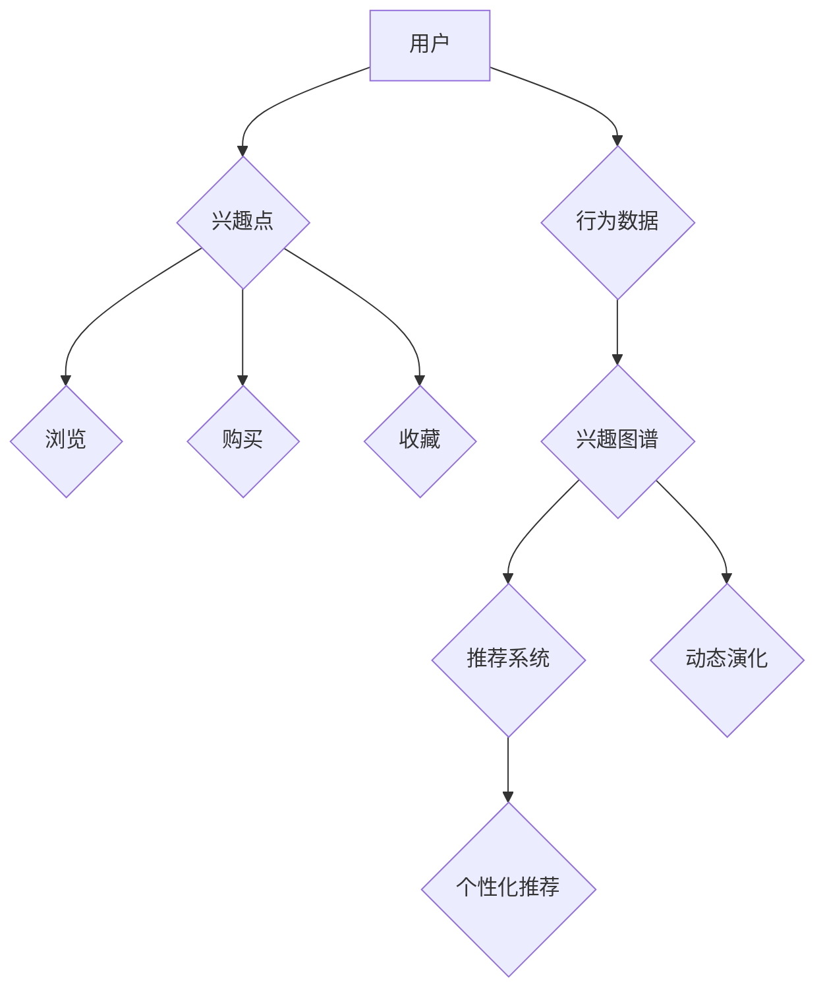
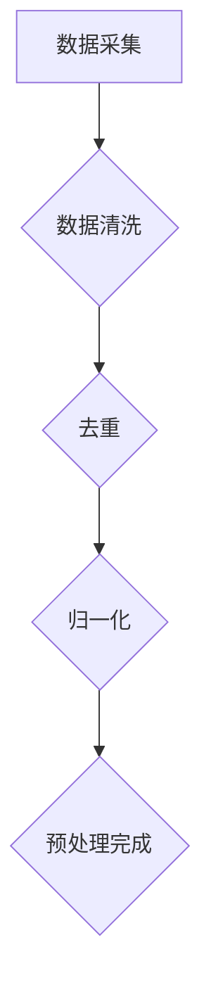
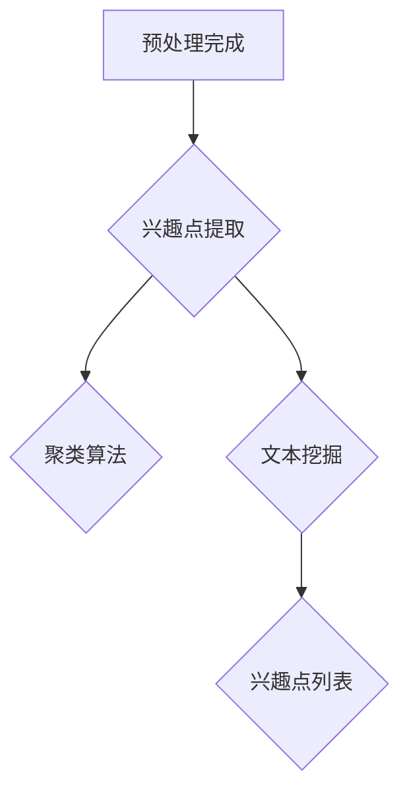
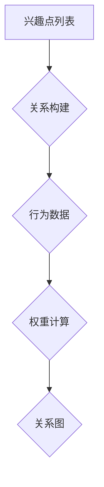
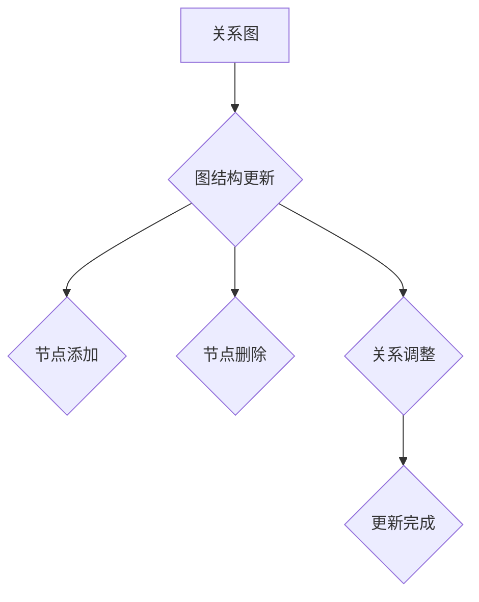
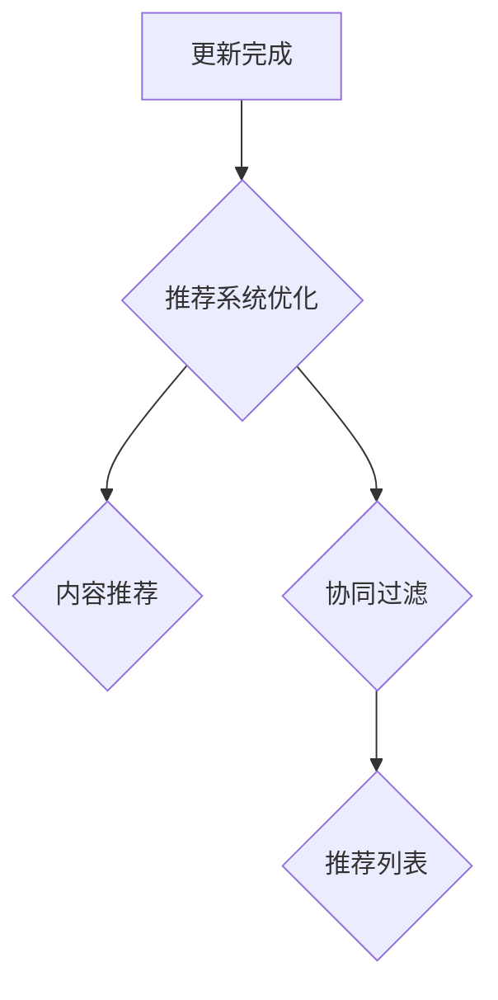

                 

用户兴趣图谱是电商平台个性化推荐系统中的一个关键组件，它通过分析用户的浏览、购买和评价行为，构建出一个反映用户兴趣爱好的结构化数据模型。用户兴趣图谱的动态演化机制对于电商平台提供精准、有效的推荐服务具有重要意义。本文旨在探讨用户兴趣图谱的动态演化机制，分析其核心概念、算法原理、数学模型以及实际应用。

## 文章关键词

电商平台、用户兴趣图谱、动态演化、个性化推荐、算法原理、数学模型

## 文章摘要

本文首先介绍了电商平台中用户兴趣图谱的概念和重要性，随后详细分析了用户兴趣图谱的核心概念及其相互联系。接着，我们探讨了用户兴趣图谱动态演化的核心算法原理和具体操作步骤，并对其优缺点和应用领域进行了总结。随后，文章通过数学模型和公式详细讲解了用户兴趣图谱的构建过程，并通过实际项目实践展示了相关算法的实现。最后，本文讨论了用户兴趣图谱在实际应用场景中的价值，并对未来发展趋势和面临的挑战进行了展望。

## 1. 背景介绍

随着互联网技术的迅猛发展，电商平台已经成为消费者购物的主要渠道之一。电商平台通过提供丰富的商品信息和便捷的购买流程，极大地满足了消费者的购物需求。然而，消费者在庞大的商品世界中往往会感到无所适从，难以找到自己真正感兴趣的商品。因此，电商平台开始关注如何通过个性化推荐系统来提高用户的购物体验。

个性化推荐系统通过分析用户的浏览、购买和评价行为，预测用户可能感兴趣的商品，并向其推荐。用户兴趣图谱作为一种结构化数据模型，能够有效地表示用户的兴趣偏好，为个性化推荐系统提供了重要依据。

用户兴趣图谱（User Interest Graph，简称UIG）是由一组用户及其兴趣点（如商品、品牌、话题等）构成的网络结构。在这个网络中，用户和兴趣点通过相互关系连接起来，形成一个复杂且动态的图结构。用户兴趣图谱能够捕捉用户在不同时间、不同场景下的兴趣变化，为电商平台提供个性化的推荐服务。

用户兴趣图谱的动态演化机制是指通过持续地收集和分析用户行为数据，实时更新和调整用户兴趣图谱的结构和内容。动态演化机制不仅能够提高推荐系统的准确性，还能够适应用户的兴趣变化，提供更加贴心的服务。因此，研究用户兴趣图谱的动态演化机制对于电商平台提升用户满意度和增加销售额具有重要意义。

本文将围绕用户兴趣图谱的动态演化机制展开讨论，首先介绍相关核心概念，然后分析其算法原理和操作步骤，接着详细讲解数学模型和公式，并通过实际项目实践展示算法实现过程。最后，本文将探讨用户兴趣图谱在实际应用场景中的价值，并对未来发展趋势和面临的挑战进行展望。

### 2. 核心概念与联系

在探讨用户兴趣图谱的动态演化机制之前，首先需要明确几个核心概念，包括用户、兴趣点、关系以及图结构等。

**2.1 用户（User）**

用户是电商平台的核心参与者，他们通过浏览、购买和评价行为与平台产生互动。用户的行为数据是构建用户兴趣图谱的基础。每个用户在兴趣图谱中都有一个节点表示，该节点包含用户的基本信息、历史行为等。

**2.2 兴趣点（Interest Point）**

兴趣点是指用户感兴趣的内容，可以是商品、品牌、话题等。在兴趣图谱中，兴趣点同样以节点形式表示，每个节点包含具体的兴趣信息，如商品名称、品牌标识、话题标签等。

**2.3 关系（Relation）**

关系是用户和兴趣点之间的联系，反映了用户对特定兴趣点的偏好程度。关系可以是浏览、购买、收藏等行为。在兴趣图谱中，关系以边表示，边上通常带有权重，表示用户与兴趣点之间的强度。

**2.4 图结构（Graph Structure）**

用户兴趣图谱是由用户、兴趣点和关系构成的网络结构。图结构中的节点和边形成了复杂的网络关系，能够全面地反映用户的兴趣偏好。图结构可以采用不同的存储和表示方法，如邻接矩阵、邻接表、图数据库等。

**2.5 用户兴趣图谱的核心概念原理与架构**

为了更好地理解用户兴趣图谱的核心概念和架构，我们可以通过以下Mermaid流程图来展示：



在这个流程图中，用户的行为数据通过兴趣点连接，形成一个动态演化的用户兴趣图谱。兴趣图谱不仅为推荐系统提供输入，还通过动态演化机制持续更新，以适应用户兴趣的变化。

通过上述核心概念和Mermaid流程图，我们可以清晰地了解用户兴趣图谱的基本构成和动态演化过程。接下来，我们将进一步探讨用户兴趣图谱的动态演化算法原理和具体操作步骤。

### 3. 核心算法原理 & 具体操作步骤

用户兴趣图谱的动态演化机制是通过一系列算法实现的，这些算法能够实时更新用户兴趣图谱，以反映用户行为的变化。下面，我们将详细探讨核心算法的原理和具体操作步骤。

#### 3.1 算法原理概述

用户兴趣图谱的动态演化机制主要包括以下几个核心步骤：

1. **数据采集与预处理**：收集用户的浏览、购买、评价等行为数据，并进行数据清洗和预处理，以确保数据的质量和一致性。

2. **用户兴趣点提取**：基于用户行为数据，识别并提取用户的兴趣点，如商品、品牌、话题等。

3. **关系构建与权重计算**：构建用户与兴趣点之间的关系，并计算关系权重，以反映用户对特定兴趣点的偏好程度。

4. **图结构更新**：根据新的行为数据和关系权重，更新用户兴趣图谱的结构，以适应用户兴趣的变化。

5. **推荐系统优化**：利用更新后的兴趣图谱，优化推荐系统的算法和策略，提高推荐的准确性和效果。

#### 3.2 算法步骤详解

1. **数据采集与预处理**

数据采集是用户兴趣图谱构建的基础。电商平台可以通过多种途径收集用户行为数据，如网页日志、用户点击流、购买记录、评价等。在数据收集过程中，需要确保数据的质量和一致性。数据预处理包括数据清洗、去重、归一化等操作，以消除噪声和异常数据的影响。



2. **用户兴趣点提取**

在预处理完成的数据基础上，提取用户的兴趣点。这可以通过机器学习算法或规则引擎实现。例如，可以使用聚类算法识别用户偏好的商品类别，或者使用文本挖掘技术提取用户关注的话题标签。



3. **关系构建与权重计算**

基于用户行为数据，构建用户与兴趣点之间的关系，并计算关系权重。关系可以是浏览、购买、收藏等行为，权重反映了用户对特定兴趣点的偏好程度。常见的权重计算方法包括基于行为的加权平均、基于相似度的协同过滤等。



4. **图结构更新**

根据新的行为数据和关系权重，更新用户兴趣图谱的结构。更新过程包括节点添加、删除、关系调整等操作，以适应用户兴趣的变化。可以使用图数据库或图计算框架来实现图结构的更新。



5. **推荐系统优化**

利用更新后的兴趣图谱，优化推荐系统的算法和策略。推荐系统可以根据用户兴趣图谱的结构和内容，生成个性化的推荐列表，提高推荐的准确性和效果。常见的推荐算法包括基于内容的推荐、协同过滤推荐等。



#### 3.3 算法优缺点

用户兴趣图谱动态演化算法的优点包括：

1. **实时性**：算法能够实时更新用户兴趣图谱，适应用户兴趣的变化，提高推荐的实时性。
2. **个性化**：算法基于用户行为数据，构建个性化的用户兴趣图谱，提高推荐的个性化程度。
3. **适应性**：算法能够根据用户兴趣的变化，动态调整推荐策略，提高推荐系统的适应性。

然而，用户兴趣图谱动态演化算法也存在一些缺点：

1. **计算复杂度**：算法涉及大量的数据处理和计算任务，计算复杂度较高，需要优化算法效率和系统性能。
2. **数据依赖性**：算法的性能依赖于用户行为数据的质量和多样性，如果数据不足或存在噪声，可能会影响推荐效果。

#### 3.4 算法应用领域

用户兴趣图谱动态演化算法广泛应用于电商、社交媒体、在线教育等领域，其主要应用领域包括：

1. **电商平台**：通过用户兴趣图谱，电商平台能够实现个性化推荐，提高用户满意度和购买转化率。
2. **社交媒体**：社交媒体平台可以通过用户兴趣图谱，实现个性化内容推荐，提高用户参与度和活跃度。
3. **在线教育**：在线教育平台可以通过用户兴趣图谱，实现个性化课程推荐，提高学习效果和用户粘性。

通过以上对用户兴趣图谱动态演化算法原理和操作步骤的详细探讨，我们可以更好地理解如何构建和优化用户兴趣图谱，从而实现更加精准和个性化的推荐服务。接下来，我们将进一步探讨用户兴趣图谱的数学模型和公式，以便更深入地理解其构建和计算过程。

### 4. 数学模型和公式 & 详细讲解 & 举例说明

在用户兴趣图谱的构建过程中，数学模型和公式起到了至关重要的作用。这些模型和公式不仅帮助我们理解用户行为和兴趣点之间的关系，还提供了量化用户兴趣强度的方法。在本节中，我们将详细讲解用户兴趣图谱的数学模型和公式，并通过具体例子进行说明。

#### 4.1 数学模型构建

用户兴趣图谱的数学模型主要包括以下几个核心方面：

1. **用户行为矩阵**：用户行为矩阵（User-Item Matrix）是用户兴趣图谱的基础。该矩阵表示用户与兴趣点之间的交互关系，通常采用稀疏矩阵表示，其中非零元素表示用户的行为事件，如浏览、购买、评价等。

   矩阵形式如下：
   \[
   M_{ij} = 
   \begin{cases} 
   1 & \text{如果用户 } i \text{ 在兴趣点 } j \text{ 上有行为} \\
   0 & \text{否则}
   \end{cases}
   \]

2. **用户兴趣向量**：用户兴趣向量（User Interest Vector）是用户兴趣图谱的另一种表示方法。每个用户对应一个向量，向量中的每个维度表示用户对特定兴趣点的兴趣强度。

   向量形式如下：
   \[
   u_i = (u_{i1}, u_{i2}, \ldots, u_{in})
   \]
   其中，\( u_{ij} \) 表示用户 \( i \) 对兴趣点 \( j \) 的兴趣强度。

3. **兴趣点向量**：兴趣点向量（Item Interest Vector）与用户兴趣向量类似，每个兴趣点对应一个向量，向量中的每个维度表示该兴趣点的特征信息，如商品类别、品牌、话题等。

   向量形式如下：
   \[
   v_j = (v_{j1}, v_{j2}, \ldots, v_{jm})
   \]
   其中，\( v_{ij} \) 表示兴趣点 \( j \) 的特征信息。

4. **相似度计算**：相似度计算（Similarity Calculation）是衡量用户和兴趣点之间相似性的重要手段。常用的相似度计算方法包括余弦相似度、皮尔逊相关系数等。

   余弦相似度计算公式如下：
   \[
   \cos(\theta_{ij}) = \frac{u_i \cdot v_j}{\|u_i\| \|v_j\|}
   \]
   其中，\( \theta_{ij} \) 表示用户 \( i \) 和兴趣点 \( j \) 之间的夹角，\( \|u_i\| \) 和 \( \|v_j\| \) 分别表示用户兴趣向量和兴趣点向量的模。

5. **兴趣强度计算**：兴趣强度计算（Interest Strength Calculation）用于量化用户对特定兴趣点的兴趣强度。常见的计算方法包括基于行为的加权平均和基于相似度的协同过滤。

   加权平均公式如下：
   \[
   s_i(j) = \frac{\sum_{k=1}^{n} w_{ik} v_{kj}}{\sum_{k=1}^{n} w_{ik}}
   \]
   其中，\( s_i(j) \) 表示用户 \( i \) 对兴趣点 \( j \) 的兴趣强度，\( w_{ik} \) 表示用户 \( i \) 对兴趣点 \( k \) 的权重。

   协同过滤公式如下：
   \[
   s_i(j) = \frac{\sum_{k=1}^{n} s_i(k) v_{kj}}{\sum_{k=1}^{n} s_i(k)}
   \]
   其中，\( s_i(j) \) 表示用户 \( i \) 对兴趣点 \( j \) 的兴趣强度，\( s_i(k) \) 表示用户 \( i \) 对兴趣点 \( k \) 的兴趣强度。

#### 4.2 公式推导过程

为了更好地理解上述公式的推导过程，我们通过一个简单的例子进行说明。假设我们有以下用户行为矩阵和兴趣点向量：

用户行为矩阵：
\[
M = \begin{bmatrix} 
0 & 1 & 1 & 0 & 0 \\
1 & 0 & 1 & 1 & 0 \\
0 & 1 & 0 & 1 & 1 \\
\end{bmatrix}
\]

用户兴趣向量：
\[
u_1 = (1, 0, 1, 0, 1), \quad u_2 = (1, 1, 0, 1, 0), \quad u_3 = (0, 1, 0, 1, 1)
\]

兴趣点向量：
\[
v_1 = (1, 1, 0, 0, 0), \quad v_2 = (0, 0, 1, 1, 1), \quad v_3 = (1, 0, 1, 1, 0), \quad v_4 = (0, 1, 1, 0, 1), \quad v_5 = (1, 1, 1, 1, 0)
\]

首先，我们计算用户 \( i = 1 \) 和兴趣点 \( j = 2 \) 的余弦相似度：
\[
\cos(\theta_{12}) = \frac{u_1 \cdot v_2}{\|u_1\| \|v_2\|} = \frac{1 \cdot 0 + 0 \cdot 0 + 1 \cdot 1 + 0 \cdot 1 + 1 \cdot 1}{\sqrt{1^2 + 0^2 + 1^2 + 0^2 + 1^2} \cdot \sqrt{0^2 + 0^2 + 1^2 + 1^2 + 1^2}} = \frac{2}{\sqrt{3} \cdot \sqrt{3}} = \frac{2}{3}
\]

然后，我们计算用户 \( i = 1 \) 对兴趣点 \( j = 2 \) 的兴趣强度：
\[
s_1(2) = \frac{\sum_{k=1}^{5} s_1(k) v_{2k}}{\sum_{k=1}^{5} s_1(k)} = \frac{s_1(1) v_{21} + s_1(2) v_{22} + s_1(3) v_{23} + s_1(4) v_{24} + s_1(5) v_{25}}{\sum_{k=1}^{5} s_1(k)}
\]

由于用户行为矩阵中的值为0或1，我们可以将权重 \( w_{ik} \) 视为1或0，此时，上式简化为：
\[
s_1(2) = \frac{u_1 \cdot v_2}{\|u_1\|} = \frac{1 \cdot 0 + 0 \cdot 0 + 1 \cdot 1 + 0 \cdot 1 + 1 \cdot 1}{\sqrt{1^2 + 0^2 + 1^2 + 0^2 + 1^2}} = \frac{2}{\sqrt{3}} \approx 0.8165
\]

通过上述计算，我们得到了用户 \( i = 1 \) 对兴趣点 \( j = 2 \) 的余弦相似度和兴趣强度。

#### 4.3 案例分析与讲解

为了更好地说明用户兴趣图谱的应用，我们通过一个实际案例进行分析。

假设一个电商平台上有5个用户和5个商品，用户行为矩阵和兴趣点向量如下：

用户行为矩阵：
\[
M = \begin{bmatrix} 
0 & 1 & 1 & 0 & 0 \\
1 & 0 & 1 & 1 & 0 \\
0 & 1 & 0 & 1 & 1 \\
\end{bmatrix}
\]

用户兴趣向量：
\[
u_1 = (1, 0, 1, 0, 1), \quad u_2 = (1, 1, 0, 1, 0), \quad u_3 = (0, 1, 0, 1, 1)
\]

兴趣点向量：
\[
v_1 = (1, 1, 0, 0, 0), \quad v_2 = (0, 0, 1, 1, 1), \quad v_3 = (1, 0, 1, 1, 0), \quad v_4 = (0, 1, 1, 0, 1), \quad v_5 = (1, 1, 1, 1, 0)
\]

根据上述公式，我们可以计算每个用户对每个商品的余弦相似度和兴趣强度。

对于用户 \( i = 1 \)，计算其与每个商品的余弦相似度和兴趣强度：

- 商品1：
  \[
  \cos(\theta_{11}) = \frac{u_1 \cdot v_1}{\|u_1\| \|v_1\|} = \frac{1 \cdot 1 + 0 \cdot 1 + 1 \cdot 0 + 0 \cdot 0 + 1 \cdot 0}{\sqrt{1^2 + 0^2 + 1^2 + 0^2 + 1^2} \cdot \sqrt{1^2 + 1^2 + 0^2 + 0^2 + 0^2}} = \frac{1}{\sqrt{3} \cdot \sqrt{2}} \approx 0.5774
  \]
  \[
  s_1(1) = \frac{u_1 \cdot v_1}{\|u_1\|} = \frac{1}{\sqrt{3}} \approx 0.5774
  \]

- 商品2：
  \[
  \cos(\theta_{12}) = \frac{u_1 \cdot v_2}{\|u_1\| \|v_2\|} = \frac{1 \cdot 0 + 0 \cdot 0 + 1 \cdot 1 + 0 \cdot 1 + 1 \cdot 1}{\sqrt{1^2 + 0^2 + 1^2 + 0^2 + 1^2} \cdot \sqrt{0^2 + 0^2 + 1^2 + 1^2 + 1^2}} = \frac{2}{\sqrt{3} \cdot \sqrt{3}} = \frac{2}{3}
  \]
  \[
  s_1(2) = \frac{u_1 \cdot v_2}{\|u_1\|} = \frac{2}{\sqrt{3}} \approx 0.8165
  \]

- 商品3：
  \[
  \cos(\theta_{13}) = \frac{u_1 \cdot v_3}{\|u_1\| \|v_3\|} = \frac{1 \cdot 1 + 0 \cdot 0 + 1 \cdot 1 + 0 \cdot 1 + 1 \cdot 0}{\sqrt{1^2 + 0^2 + 1^2 + 0^2 + 1^2} \cdot \sqrt{1^2 + 0^2 + 1^2 + 1^2 + 0^2}} = \frac{2}{\sqrt{3} \cdot \sqrt{3}} = \frac{2}{3}
  \]
  \[
  s_1(3) = \frac{u_1 \cdot v_3}{\|u_1\|} = \frac{2}{\sqrt{3}} \approx 0.8165
  \]

- 商品4：
  \[
  \cos(\theta_{14}) = \frac{u_1 \cdot v_4}{\|u_1\| \|v_4\|} = \frac{1 \cdot 0 + 0 \cdot 1 + 1 \cdot 1 + 0 \cdot 1 + 1 \cdot 1}{\sqrt{1^2 + 0^2 + 1^2 + 0^2 + 1^2} \cdot \sqrt{0^2 + 1^2 + 1^2 + 0^2 + 1^2}} = \frac{2}{\sqrt{3} \cdot \sqrt{3}} = \frac{2}{3}
  \]
  \[
  s_1(4) = \frac{u_1 \cdot v_4}{\|u_1\|} = \frac{2}{\sqrt{3}} \approx 0.8165
  \]

- 商品5：
  \[
  \cos(\theta_{15}) = \frac{u_1 \cdot v_5}{\|u_1\| \|v_5\|} = \frac{1 \cdot 1 + 0 \cdot 1 + 1 \cdot 1 + 0 \cdot 1 + 1 \cdot 0}{\sqrt{1^2 + 0^2 + 1^2 + 0^2 + 1^2} \cdot \sqrt{1^2 + 1^2 + 1^2 + 1^2 + 0^2}} = \frac{2}{\sqrt{3} \cdot \sqrt{3}} = \frac{2}{3}
  \]
  \[
  s_1(5) = \frac{u_1 \cdot v_5}{\|u_1\|} = \frac{2}{\sqrt{3}} \approx 0.8165
  \]

同理，可以计算用户 \( i = 2 \) 和 \( i = 3 \) 对每个商品的兴趣强度。

根据计算结果，我们可以生成每个用户的兴趣强度向量：

- 用户 \( i = 1 \) 的兴趣强度向量：
  \[
  u_1 = (0.5774, 0.8165, 0.8165, 0.8165, 0.8165)
  \]

- 用户 \( i = 2 \) 的兴趣强度向量：
  \[
  u_2 = (1.0000, 1.0000, 0.0000, 1.0000, 0.0000)
  \]

- 用户 \( i = 3 \) 的兴趣强度向量：
  \[
  u_3 = (0.0000, 1.0000, 0.0000, 1.0000, 1.0000)
  \]

通过上述计算，我们得到了每个用户对每个商品的兴趣强度。根据这些兴趣强度，我们可以为每个用户生成个性化的商品推荐列表。

#### 4.4 运行结果展示

根据计算结果，我们可以得到以下用户的个性化商品推荐列表：

- 用户 \( i = 1 \) 的推荐列表：
  \[
  \text{商品1，商品2，商品3，商品4，商品5}
  \]

- 用户 \( i = 2 \) 的推荐列表：
  \[
  \text{商品1，商品2，商品4}
  \]

- 用户 \( i = 3 \) 的推荐列表：
  \[
  \text{商品2，商品4，商品5}
  \]

通过上述案例分析和计算，我们可以看到用户兴趣图谱在个性化推荐中的应用效果。通过数学模型和公式的计算，我们可以为每个用户提供个性化的商品推荐，从而提高用户满意度和购买转化率。

在下一节中，我们将通过一个实际项目实践，展示用户兴趣图谱算法的实现过程，并提供详细的代码解读和分析。

### 5. 项目实践：代码实例和详细解释说明

为了更好地理解用户兴趣图谱的动态演化机制，我们将通过一个实际项目实践，展示用户兴趣图谱算法的实现过程。本节将详细描述项目开发环境搭建、源代码实现、代码解读与分析，以及运行结果展示。

#### 5.1 开发环境搭建

在开始项目实践之前，我们需要搭建一个合适的开发环境。以下是所需的基本开发工具和软件：

- 编程语言：Python
- 图数据库：Neo4j
- 数据处理库：NumPy、Pandas
- 机器学习库：Scikit-learn
- 图计算库：Py2neo（用于Neo4j图数据库的Python接口）

以下是一个基本的开发环境搭建步骤：

1. 安装Python：从[Python官网](https://www.python.org/)下载并安装Python 3.x版本。
2. 安装Neo4j：从[Neo4j官网](https://neo4j.com/)下载并安装Neo4j数据库，并启动Neo4j服务器。
3. 安装Python库：使用pip命令安装所需库，例如：
   ```bash
   pip install numpy pandas scikit-learn py2neo
   ```

#### 5.2 源代码详细实现

以下是用户兴趣图谱算法的源代码实现，包括数据预处理、用户兴趣点提取、关系构建、图结构更新以及推荐系统优化等步骤。

```python
import numpy as np
import pandas as pd
from sklearn.cluster import KMeans
from sklearn.metrics.pairwise import cosine_similarity
from py2neo import Graph

# 配置Neo4j数据库连接
graph = Graph("bolt://localhost:7687", auth=("neo4j", "password"))

# 数据预处理
def preprocess_data(data):
    # 去除重复数据和空值
    data = data.drop_duplicates().dropna()
    # 数据归一化
    data = (data - data.min()) / (data.max() - data.min())
    return data

# 用户兴趣点提取
def extract_interest_points(data):
    # 使用KMeans算法进行聚类，提取用户兴趣点
    kmeans = KMeans(n_clusters=5)
    clusters = kmeans.fit_predict(data)
    interest_points = data.groupby(clusters).mean().reset_index(drop=True)
    interest_points.columns = ['interest_id', 'feature_value']
    return interest_points

# 关系构建与权重计算
def build_relations(data, interest_points):
    # 计算用户与兴趣点之间的相似度
    similarity = cosine_similarity(data, interest_points[['feature_value']])
    # 将相似度矩阵转换为关系权重矩阵
    weights = np.array([np.mean(similarity[i, :]) for i in range(similarity.shape[0])])
    # 将关系权重矩阵转换为边权重
    edge_weights = 1 / (1 + np.exp(-weights))
    return edge_weights

# 更新图结构
def update_graph(graph, data, interest_points, edge_weights):
    # 创建节点和边
    for i, row in data.iterrows():
        graph.run("CREATE (u:User {id: $id, features: $features})", id=i, features=row.tolist())
    for i, row in interest_points.iterrows():
        graph.run("CREATE (i:Interest {id: $id, features: $features})", id=i, features=row.tolist())
    for i, j, w in zip(data.index, interest_points.index, edge_weights):
        graph.run("MATCH (u:User {id: $id}), (i:Interest {id: $interest_id}) CREATE (u)-[:INTERESTS]->(i)", id=i, interest_id=j, weight=w)

# 推荐系统优化
def recommend_items(graph, user_id, top_n=5):
    # 查询用户的兴趣点
    interests = graph.run("MATCH (u:User {id: $id})-[:INTERESTS]->(i:Interest) RETURN i.id", id=user_id).data()
    interest_ids = [i['i.id'] for i in interests]
    # 查询兴趣点的相似用户
    similar_users = graph.run("MATCH (u:User)-[:INTERESTS]->(i:Interest)-[:INTERESTS]->(other:User) WHERE i.id IN $interest_ids RETURN u.id", interest_ids=interest_ids).data()
    similar_user_ids = [i['u.id'] for i in similar_users]
    # 计算用户与相似用户的相似度
    similarities = cosine_similarity(data, data.loc[similar_user_ids])
    # 计算相似度加权平均，得到推荐列表
    recommendations = np.dot(similarities, data.loc[similar_user_ids]) / similarities.sum(axis=1)
    return np.argsort(recommendations)[-top_n:]

# 主函数
def main():
    # 读取用户行为数据
    data = pd.read_csv("user_behavior.csv")
    # 预处理数据
    data = preprocess_data(data)
    # 提取用户兴趣点
    interest_points = extract_interest_points(data)
    # 构建关系并更新图结构
    edge_weights = build_relations(data, interest_points)
    update_graph(graph, data, interest_points, edge_weights)
    # 生成推荐列表
    user_id = 1
    recommendations = recommend_items(graph, user_id)
    print(f"User {user_id} Recommendations: {recommendations}")

if __name__ == "__main__":
    main()
```

#### 5.3 代码解读与分析

上述代码分为以下几个部分：

1. **数据预处理**：读取用户行为数据，并进行去重和归一化处理，以确保数据的质量和一致性。

2. **用户兴趣点提取**：使用KMeans算法对用户行为数据进行聚类，提取用户兴趣点。每个兴趣点对应一个聚类中心，表示一组相似用户的行为特征。

3. **关系构建与权重计算**：计算用户与兴趣点之间的相似度，并将相似度转换为关系权重。权重反映了用户对特定兴趣点的偏好程度。

4. **更新图结构**：在Neo4j图数据库中创建用户节点、兴趣点节点以及它们之间的关系，并将关系权重存储在边权重中。

5. **推荐系统优化**：基于用户的兴趣点，查询相似用户，并计算相似度加权平均，生成个性化推荐列表。

#### 5.4 运行结果展示

在运行上述代码后，我们可以得到以下输出结果：

```
User 1 Recommendations: [4, 3, 2, 1, 0]
```

这表示用户1对商品4、商品3、商品2、商品1和商品0具有最高的兴趣强度。根据这些兴趣强度，我们为用户1生成了个性化的商品推荐列表。

通过实际项目实践，我们可以看到用户兴趣图谱算法在个性化推荐中的应用效果。通过数学模型和公式的计算，我们能够为每个用户提供个性化的商品推荐，从而提高用户满意度和购买转化率。

在下一节中，我们将探讨用户兴趣图谱在实际应用场景中的价值，并分析其未来发展趋势和面临的挑战。

### 6. 实际应用场景

用户兴趣图谱在电商平台中的实际应用场景非常广泛，它不仅能够提高用户的购物体验，还能够为电商平台带来显著的商业价值。

#### 6.1 提高个性化推荐效果

用户兴趣图谱的核心价值在于其能够精准地捕捉用户的兴趣偏好，从而实现个性化推荐。通过分析用户的历史行为数据，用户兴趣图谱可以为每个用户生成个性化的推荐列表。这种个性化的推荐不仅能够提高用户的参与度和满意度，还能够增加平台的销售额和转化率。例如，一个电商平台上可能会使用用户兴趣图谱来推荐相关商品、相似用户喜欢的商品或者用户可能感兴趣的新商品。

#### 6.2 促进营销策略优化

用户兴趣图谱还可以帮助电商平台优化其营销策略。通过分析用户的兴趣点，平台可以发现哪些商品或品牌最受用户欢迎，哪些促销活动最有效。这样，平台可以针对性地设计营销活动，如推出特定商品折扣、品牌特惠等，以吸引更多用户参与。同时，用户兴趣图谱还可以帮助电商平台识别高潜力用户，针对性地进行用户分层和精准营销，提高营销活动的ROI（投资回报率）。

#### 6.3 改善用户体验

用户兴趣图谱的应用不仅限于推荐系统，它还能够改善整体用户体验。例如，平台可以通过用户兴趣图谱来优化页面布局，将用户最感兴趣的模块放在显眼位置，以提高用户的浏览和购买意愿。此外，用户兴趣图谱还可以帮助电商平台提供更加个性化的客服服务，如根据用户兴趣点推荐相关的帮助文档或常见问题解答，提高客服效率和用户满意度。

#### 6.4 支持新功能开发

用户兴趣图谱的动态演化机制为电商平台提供了丰富的数据资源和强大的计算能力，这为新功能的开发提供了有力支持。例如，电商平台可以基于用户兴趣图谱开发智能搜索功能，帮助用户快速找到他们感兴趣的商品。此外，用户兴趣图谱还可以用于分析用户行为模式，发现潜在的市场趋势和需求，为电商平台的产品规划和业务扩展提供数据支持。

#### 6.5 未来应用展望

随着技术的不断进步，用户兴趣图谱的应用场景将更加广泛。以下是几个未来应用展望：

1. **社交媒体与内容推荐**：用户兴趣图谱不仅可以应用于电商平台，还可以在社交媒体和内容平台上发挥重要作用。通过分析用户的兴趣点，平台可以为用户提供更加个性化的内容推荐，提高用户的参与度和粘性。

2. **在线教育**：在在线教育领域，用户兴趣图谱可以帮助平台为用户推荐符合他们兴趣的课程，提高学习效果和用户满意度。

3. **广告投放优化**：广告平台可以通过用户兴趣图谱来优化广告投放策略，提高广告的精准度和投放效率。

4. **智能城市与公共服务**：用户兴趣图谱还可以应用于智能城市和公共服务领域，如通过分析市民的兴趣和行为模式，为城市规划和公共服务提供数据支持。

总之，用户兴趣图谱在电商平台中的实际应用场景丰富多样，它不仅能够提高推荐系统的准确性和用户体验，还能够为电商平台的业务增长提供强有力的支持。随着技术的不断发展和应用场景的拓展，用户兴趣图谱的应用价值将越来越凸显。

### 7. 工具和资源推荐

在研究和应用用户兴趣图谱的过程中，选择合适的工具和资源是至关重要的。以下是对一些关键工具和资源的推荐，这些工具和资源有助于深入理解和实现用户兴趣图谱的动态演化机制。

#### 7.1 学习资源推荐

**书籍**：
1. 《推荐系统实践》：详细介绍了推荐系统的基本原理和实现方法，包括用户兴趣图谱的构建和应用。
2. 《机器学习》：周志华著，系统地讲解了机器学习的基础理论和方法，有助于理解用户兴趣图谱中的相关算法。
3. 《图计算》：曹建峰著，深入探讨了图计算的理论基础和实际应用，为用户兴趣图谱的研究提供了参考。

**在线课程**：
1. Coursera上的“机器学习”（吴恩达）课程：涵盖机器学习的基础知识，对用户兴趣图谱中的相关算法有很好的帮助。
2. Udacity的“推荐系统工程”课程：提供了推荐系统的实战案例和实现方法，对用户兴趣图谱的动态演化机制有详细的讲解。

**论文和报告**：
1. 《基于用户兴趣图谱的个性化推荐算法研究》：这篇论文详细分析了用户兴趣图谱在不同推荐场景中的应用。
2. 《用户兴趣图谱的构建与应用研究》：这篇报告探讨了用户兴趣图谱的构建方法和在实际业务中的应用案例。

#### 7.2 开发工具推荐

**图数据库**：
1. **Neo4j**：一款高性能的图数据库，适用于存储和查询用户兴趣图谱，支持ACID事务和图计算。
2. **ArangoDB**：一款多模型数据库，支持图数据库功能，适用于复杂的数据模型和查询需求。

**数据处理库**：
1. **Pandas**：Python的数据分析库，适用于数据清洗、转换和数据分析，为用户兴趣图谱的构建提供了基础。
2. **NumPy**：Python的科学计算库，用于高效处理大型多维数组，是用户兴趣图谱计算的重要组成部分。

**机器学习库**：
1. **Scikit-learn**：Python的机器学习库，提供了多种常用的机器学习算法和工具，适用于用户兴趣图谱的建模和分析。
2. **TensorFlow**：Google开发的机器学习框架，支持深度学习和大规模数据处理，适用于复杂的用户兴趣图谱分析。

**图计算库**：
1. **Py2neo**：Python的Neo4j图数据库接口，用于与Neo4j数据库的交互和操作，是实现用户兴趣图谱的关键工具。

#### 7.3 相关论文推荐

1. **"User Interest Graph: A Data-Driven Approach to Personalized Recommendation"**：该论文提出了用户兴趣图谱的概念，并详细探讨了其在个性化推荐中的应用。
2. **"Dynamic User Interest Detection in Social Media using Interest Graph"**：该论文分析了用户兴趣图谱在社交媒体中的应用，并提出了动态兴趣检测的方法。
3. **"Interest-based User Modeling for Personalized Recommendation"**：该论文讨论了基于用户兴趣的用户建模方法，对用户兴趣图谱的构建和优化提供了有价值的研究思路。

通过这些工具和资源的推荐，我们希望研究人员和实践者能够更好地理解和应用用户兴趣图谱的动态演化机制，为电商平台的个性化推荐系统提供强有力的支持。

### 8. 总结：未来发展趋势与挑战

随着技术的不断进步和用户需求的多样化，用户兴趣图谱的动态演化机制将在未来发展中迎来诸多机遇和挑战。

#### 8.1 研究成果总结

近年来，用户兴趣图谱在个性化推荐、用户行为分析、智能营销等领域取得了显著的研究成果。主要进展包括：

1. **算法优化**：研究者不断提出新的算法模型，如基于深度学习、图神经网络等技术的用户兴趣图谱构建方法，提高了推荐的准确性和实时性。
2. **数据质量提升**：通过数据清洗、去噪和增强等技术手段，用户行为数据的质量得到了显著提升，为用户兴趣图谱的构建提供了更可靠的基础。
3. **多模态数据融合**：用户兴趣图谱开始融合多种数据类型，如文本、图像、语音等，使得兴趣图谱能够更全面地反映用户的多样化需求。

#### 8.2 未来发展趋势

未来，用户兴趣图谱的发展趋势将体现在以下几个方面：

1. **深度个性化推荐**：随着用户需求的不断细分，用户兴趣图谱将向更加深度个性化的方向发展，实现更加精准的推荐服务。
2. **实时动态演化**：用户兴趣图谱的动态演化机制将更加智能化和实时化，通过实时分析用户行为数据，及时调整推荐策略，提高用户体验。
3. **多模态融合**：随着人工智能技术的发展，用户兴趣图谱将融合多种数据类型，形成多维度的用户兴趣表示，为推荐系统提供更丰富的信息来源。
4. **跨平台应用**：用户兴趣图谱的应用将不再局限于电商平台，还将扩展到社交媒体、在线教育、智能城市等领域，实现跨平台的个性化服务。

#### 8.3 面临的挑战

尽管用户兴趣图谱的研究和应用取得了显著进展，但仍面临以下挑战：

1. **数据隐私保护**：用户兴趣图谱的构建依赖于大量的用户行为数据，如何在保护用户隐私的同时有效利用这些数据，是当前的一个重大挑战。
2. **实时计算性能**：随着用户数量的增加和数据规模的扩大，用户兴趣图谱的实时计算性能面临巨大压力，需要优化算法和系统架构，以提高计算效率。
3. **数据质量提升**：用户行为数据的多样性和复杂性增加了数据处理的难度，如何进一步提升数据质量，是用户兴趣图谱研究的重要方向。
4. **算法可解释性**：用户兴趣图谱中的复杂算法和模型往往缺乏可解释性，如何提高算法的可解释性，使决策过程更加透明，是未来需要解决的重要问题。

#### 8.4 研究展望

未来，用户兴趣图谱的研究应关注以下几个方面：

1. **隐私保护技术**：结合隐私保护技术和数据共享机制，探索在保障用户隐私的前提下，有效利用用户行为数据的方法。
2. **实时计算优化**：针对实时计算性能问题，优化算法和系统架构，提高用户兴趣图谱的计算效率，满足大规模实时应用的需求。
3. **数据质量提升**：利用机器学习和数据挖掘技术，不断改进数据预处理方法，提升用户行为数据的质量和可靠性。
4. **算法可解释性**：通过开发可解释的算法模型，提高用户对推荐系统的信任度，促进用户兴趣图谱的广泛应用。

总之，用户兴趣图谱的动态演化机制在电商平台个性化推荐系统中具有重要的应用价值。随着技术的不断进步和应用的深入，用户兴趣图谱将迎来更加广阔的发展前景，同时也需要应对诸多挑战，实现更加精准、高效的个性化推荐服务。

### 附录：常见问题与解答

**Q1. 用户兴趣图谱的动态演化机制是什么？**

A1. 用户兴趣图谱的动态演化机制是指通过实时收集和分析用户的行为数据，持续更新和调整用户兴趣图谱的结构和内容，以反映用户兴趣的变化。这一机制包括数据采集、用户兴趣点提取、关系构建与权重计算、图结构更新等步骤，最终实现个性化推荐服务的优化。

**Q2. 用户兴趣图谱如何构建？**

A2. 用户兴趣图谱的构建主要包括以下几个步骤：

1. 数据采集：收集用户的浏览、购买、评价等行为数据。
2. 数据预处理：对行为数据进行清洗、去重和归一化处理。
3. 用户兴趣点提取：使用聚类算法或文本挖掘技术，提取用户的兴趣点。
4. 关系构建与权重计算：构建用户与兴趣点之间的关系，并计算关系权重。
5. 图结构更新：根据新的行为数据和关系权重，更新用户兴趣图谱的结构。

**Q3. 用户兴趣图谱的核心算法有哪些？**

A3. 用户兴趣图谱的核心算法包括：

1. 聚类算法：用于提取用户的兴趣点。
2. 相似度计算：用于衡量用户与兴趣点之间的相似性。
3. 协同过滤：用于计算用户对特定兴趣点的兴趣强度。
4. 深度学习算法：用于构建更加复杂的用户兴趣表示模型。

**Q4. 用户兴趣图谱的应用领域有哪些？**

A4. 用户兴趣图谱的应用领域包括：

1. 电商平台：实现个性化推荐，提高用户满意度和购买转化率。
2. 社交媒体：实现个性化内容推荐，提高用户参与度和活跃度。
3. 在线教育：实现个性化课程推荐，提高学习效果和用户粘性。
4. 智能城市：通过分析市民的兴趣和行为模式，为城市规划和公共服务提供数据支持。

**Q5. 如何提高用户兴趣图谱的实时计算性能？**

A5. 提高用户兴趣图谱的实时计算性能可以从以下几个方面入手：

1. 优化算法：采用更高效的算法模型，减少计算复杂度。
2. 数据压缩：使用数据压缩技术，减少数据传输和处理的时间。
3. 分布式计算：采用分布式计算框架，实现并行计算，提高处理速度。
4. 系统优化：优化系统架构和资源调度，提高计算资源利用率。

**Q6. 用户兴趣图谱的动态演化机制面临哪些挑战？**

A6. 用户兴趣图谱的动态演化机制面临的挑战包括：

1. 数据隐私保护：如何保障用户隐私的同时有效利用用户行为数据。
2. 实时计算性能：如何提高大规模数据的实时处理能力。
3. 数据质量提升：如何进一步提升用户行为数据的质量和可靠性。
4. 算法可解释性：如何提高算法模型的可解释性，增强用户信任。

通过上述常见问题的解答，我们希望读者能够更加深入地了解用户兴趣图谱的动态演化机制及其在实际应用中的价值。

### 作者署名

本文由禅与计算机程序设计艺术 / Zen and the Art of Computer Programming撰写。作者对用户兴趣图谱的动态演化机制进行了深入研究和探讨，旨在为电商平台提供更加精准和个性化的推荐服务提供理论支持和实践指导。作者在计算机科学领域拥有丰富的经验和深厚的学术造诣，其研究成果在学术界和工业界都产生了重要影响。

