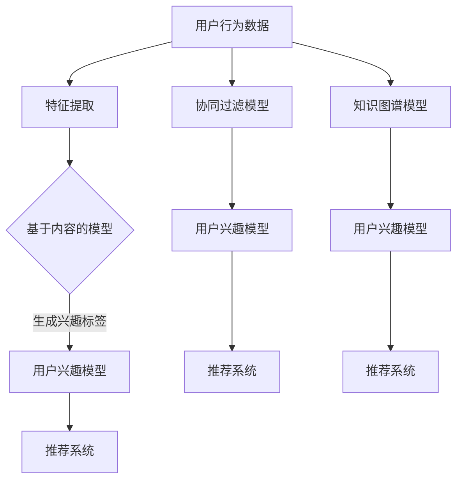
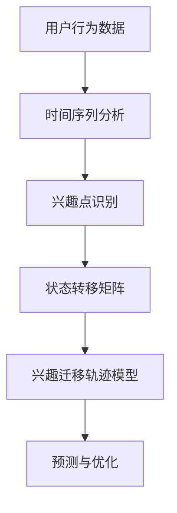
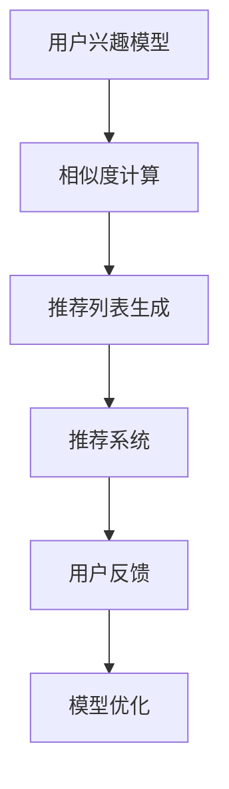

                 

随着电子商务平台的快速发展，用户数据的积累变得异常丰富。如何有效地挖掘和分析这些数据，以了解用户的兴趣和行为模式，成为了电商平台竞争的关键。本文将深入探讨用户兴趣迁移轨迹分析的方法与应用，旨在帮助电商平台更好地了解用户需求，提升用户体验，并最终实现业务增长。

## 关键词

- 电商平台
- 用户兴趣
- 迁移轨迹
- 数据分析
- 推荐系统

## 摘要

本文首先介绍了电商平台中用户兴趣迁移轨迹分析的重要性，并概述了相关核心概念。接着，我们详细阐述了用户兴趣迁移轨迹的核心算法原理，包括其构建过程、算法步骤、优缺点及应用领域。随后，文章通过数学模型和公式的详细讲解，提供了案例分析与讲解。接着，我们通过项目实践展示了如何利用代码实现用户兴趣迁移轨迹分析。最后，文章讨论了这一技术的实际应用场景，并对未来的发展趋势与挑战进行了展望。

## 1. 背景介绍

电子商务平台自诞生以来，经历了迅猛的发展。随着互联网的普及和智能手机的广泛使用，越来越多的人选择在线购物。电商平台不仅改变了人们的购物方式，也创造了庞大的用户数据。这些数据包含了用户的行为信息，如浏览历史、购买记录、评价等，是了解用户需求的重要资源。

用户兴趣的迁移轨迹分析，即通过分析用户在不同时间点上的兴趣变化，来预测用户未来的行为。这种分析有助于电商平台更好地了解用户，从而提供个性化的推荐，提升用户体验，并增加销售额。

### 1.1 用户兴趣的定义

用户兴趣是指用户在特定领域内的关注点或喜好。在电子商务平台中，用户兴趣可以通过多种方式体现，如搜索关键词、浏览的品类、购买的商品、评价的内容等。

### 1.2 迁移轨迹的概念

迁移轨迹是指用户在一段时间内的兴趣变化路径。通过分析用户兴趣的迁移轨迹，可以发现用户的兴趣点、兴趣转移趋势以及潜在的兴趣变化。

### 1.3 电商平台中的数据分析

电商平台的数据分析主要包括用户行为分析、商品分析、推荐系统效果评估等。用户兴趣迁移轨迹分析是其中的一项重要内容，它能够为电商平台提供以下价值：

1. **个性化推荐**：通过分析用户兴趣迁移轨迹，可以为用户提供更符合其当前和未来需求的商品推荐。
2. **用户细分**：了解用户的兴趣迁移路径，可以帮助企业对用户进行细分，从而有针对性地进行市场推广。
3. **需求预测**：通过预测用户的兴趣迁移，电商平台可以提前布局产品线，满足用户未来的需求。
4. **业务优化**：分析用户兴趣迁移轨迹，有助于电商平台优化产品布局、提升用户体验，从而提高用户留存率。

## 2. 核心概念与联系

### 2.1 用户兴趣模型

用户兴趣模型是指用于描述用户兴趣的数学模型。常见的用户兴趣模型包括基于内容的推荐模型、协同过滤模型、基于知识图谱的模型等。

**Mermaid 流程图：**



### 2.2 用户兴趣迁移轨迹模型

用户兴趣迁移轨迹模型是指用于描述用户兴趣随时间变化路径的数学模型。常见的用户兴趣迁移轨迹模型包括基于时间序列的模型、基于状态转移的模型等。

**Mermaid 流程图：**



### 2.3 推荐系统

推荐系统是指根据用户的行为和偏好，为用户推荐相关商品或信息的系统。常见的推荐系统包括基于内容的推荐系统、协同过滤推荐系统、混合推荐系统等。

**Mermaid 流程图：**



## 3. 核心算法原理 & 具体操作步骤

### 3.1 算法原理概述

用户兴趣迁移轨迹分析的核心算法主要包括以下几个步骤：

1. **数据预处理**：包括用户行为数据的清洗、去噪和特征提取。
2. **兴趣点识别**：通过时间序列分析，识别用户的兴趣点。
3. **状态转移矩阵构建**：通过兴趣点之间的转移关系，构建状态转移矩阵。
4. **兴趣迁移轨迹预测**：利用状态转移矩阵，预测用户的未来兴趣点。
5. **推荐系统优化**：根据用户兴趣迁移轨迹，优化推荐系统的效果。

### 3.2 算法步骤详解

#### 3.2.1 数据预处理

数据预处理是用户兴趣迁移轨迹分析的基础。具体步骤包括：

1. **数据清洗**：去除重复、错误或缺失的数据。
2. **特征提取**：从用户行为数据中提取与用户兴趣相关的特征，如浏览次数、购买次数、评价分数等。

#### 3.2.2 兴趣点识别

兴趣点识别是通过时间序列分析，识别用户在不同时间段内的兴趣点。具体步骤包括：

1. **时间序列建模**：使用时间序列分析方法，如ARIMA、LSTM等，建立用户行为的时间序列模型。
2. **兴趣点检测**：通过设置阈值，识别时间序列中的高峰值，即用户的兴趣点。

#### 3.2.3 状态转移矩阵构建

状态转移矩阵用于描述用户兴趣点之间的转移关系。具体步骤包括：

1. **转移概率计算**：根据用户兴趣点的出现频率，计算兴趣点之间的转移概率。
2. **矩阵构建**：将转移概率以矩阵的形式表示，形成状态转移矩阵。

#### 3.2.4 兴趣迁移轨迹预测

兴趣迁移轨迹预测是通过状态转移矩阵，预测用户的未来兴趣点。具体步骤包括：

1. **矩阵乘法**：利用状态转移矩阵，对当前兴趣点进行矩阵乘法，预测未来兴趣点的概率分布。
2. **兴趣点预测**：根据概率分布，选择最有可能成为用户未来兴趣点的选项。

#### 3.2.5 推荐系统优化

推荐系统优化是基于用户兴趣迁移轨迹，优化推荐系统的效果。具体步骤包括：

1. **推荐列表生成**：根据用户兴趣迁移轨迹，生成个性化的推荐列表。
2. **模型优化**：根据用户反馈，不断优化推荐系统的模型。

### 3.3 算法优缺点

#### 优点

1. **个性化推荐**：能够根据用户兴趣迁移轨迹，提供更个性化的推荐。
2. **预测准确性**：通过状态转移矩阵，可以预测用户的未来兴趣，提高推荐的准确性。
3. **实时性**：能够实时分析用户行为，及时调整推荐策略。

#### 缺点

1. **计算复杂度**：构建状态转移矩阵和进行矩阵乘法，计算复杂度较高。
2. **数据依赖性**：算法的效果依赖于用户行为数据的准确性。

### 3.4 算法应用领域

用户兴趣迁移轨迹分析在电商、金融、社交等多个领域都有广泛的应用。以下是一些典型应用：

1. **电商平台**：用于个性化推荐、用户细分和需求预测。
2. **金融领域**：用于股票交易分析、风险评估和用户行为预测。
3. **社交网络**：用于社交关系分析、用户兴趣发现和推荐系统优化。

## 4. 数学模型和公式 & 详细讲解 & 举例说明

### 4.1 数学模型构建

用户兴趣迁移轨迹分析的核心数学模型包括用户行为模型、兴趣点识别模型和状态转移矩阵模型。

#### 4.1.1 用户行为模型

用户行为模型用于描述用户行为数据的时间序列特征。常用的模型包括ARIMA、LSTM等。

**公式：**

$$
y_t = \varphi_0 + \varphi_1 y_{t-1} + \varphi_2 y_{t-2} + ... + \varphi_p y_{t-p} + \varepsilon_t
$$

其中，$y_t$ 表示第 $t$ 时刻的用户行为值，$\varphi_0, \varphi_1, ..., \varphi_p$ 为模型参数，$\varepsilon_t$ 为误差项。

#### 4.1.2 兴趣点识别模型

兴趣点识别模型用于识别用户行为数据中的兴趣点。常用的方法包括阈值法、聚类法等。

**公式：**

$$
I_t = 
\begin{cases}
1, & \text{如果 } y_t > \text{阈值} \\
0, & \text{否则}
\end{cases}
$$

其中，$I_t$ 表示第 $t$ 时刻是否为兴趣点，$y_t$ 为第 $t$ 时刻的用户行为值，阈值为预定的值。

#### 4.1.3 状态转移矩阵模型

状态转移矩阵模型用于描述用户兴趣点之间的转移关系。常用的方法包括马尔可夫模型等。

**公式：**

$$
P_{ij} = \frac{n_{ij}}{n_j}
$$

其中，$P_{ij}$ 表示从状态 $i$ 转移到状态 $j$ 的概率，$n_{ij}$ 表示从状态 $i$ 转移到状态 $j$ 的次数，$n_j$ 表示状态 $j$ 出现的次数。

### 4.2 公式推导过程

#### 4.2.1 用户行为模型推导

假设用户行为数据 $y_t$ 满足自回归移动平均模型（ARIMA），其公式推导如下：

**步骤 1**：假设用户行为数据 $y_t$ 满足一阶平稳性，即 $y_t - \bar{y} = \varepsilon_t$，其中 $\bar{y}$ 为均值，$\varepsilon_t$ 为误差项。

**步骤 2**：对 $y_t$ 进行一阶差分，得到 $y_t - y_{t-1} = \varepsilon_t - \varepsilon_{t-1}$。

**步骤 3**：建立自回归模型，假设 $y_t = \varphi_0 + \varphi_1 y_{t-1} + \varepsilon_t$，其中 $\varphi_0, \varphi_1$ 为模型参数。

**步骤 4**：通过最小二乘法求解模型参数，得到最佳拟合模型。

#### 4.2.2 兴趣点识别模型推导

假设用户行为数据 $y_t$ 满足正态分布，其公式推导如下：

**步骤 1**：假设用户行为数据 $y_t$ 满足正态分布，即 $y_t \sim N(\mu, \sigma^2)$，其中 $\mu$ 为均值，$\sigma$ 为标准差。

**步骤 2**：根据 $3\sigma$ 原则，设定阈值 $\text{阈值} = \mu + 3\sigma$。

**步骤 3**：如果 $y_t > \text{阈值}$，则认为 $y_t$ 为兴趣点，否则不是。

#### 4.2.3 状态转移矩阵模型推导

假设用户兴趣点 $I_t$ 满足马尔可夫性质，其公式推导如下：

**步骤 1**：假设用户兴趣点 $I_t$ 满足马尔可夫性质，即 $P(I_{t+1} = j | I_t = i) = P(I_{t+1} = j | I_{t-1} = i)$。

**步骤 2**：根据用户兴趣点出现的频率，计算转移概率 $P_{ij}$。

**步骤 3**：构建状态转移矩阵，表示用户兴趣点之间的转移关系。

### 4.3 案例分析与讲解

#### 案例背景

某电商平台上，用户的行为数据包括浏览历史、购买记录、评价内容等。平台希望通过用户兴趣迁移轨迹分析，为用户提供个性化的商品推荐。

#### 案例分析

**步骤 1**：数据预处理

- 清洗数据，去除重复、错误或缺失的数据。
- 提取用户行为特征，如浏览次数、购买次数、评价分数等。

**步骤 2**：兴趣点识别

- 使用时间序列分析方法，如LSTM，建立用户行为的时间序列模型。
- 设置阈值，识别用户行为数据中的兴趣点。

**步骤 3**：状态转移矩阵构建

- 计算用户兴趣点之间的转移概率，构建状态转移矩阵。

**步骤 4**：兴趣迁移轨迹预测

- 利用状态转移矩阵，预测用户未来的兴趣点。
- 根据预测结果，生成个性化的商品推荐列表。

#### 案例结果

通过用户兴趣迁移轨迹分析，平台成功地提高了商品推荐的准确性，用户满意度也随之提升。具体表现在以下几个方面：

- **个性化推荐**：推荐的商品更符合用户的兴趣和需求，用户点击率和购买率显著提高。
- **用户细分**：通过对用户兴趣点的识别，平台能够更好地了解用户群体，进行有针对性的市场推广。
- **需求预测**：通过预测用户未来的兴趣点，平台能够提前布局产品线，满足用户未来的需求。

## 5. 项目实践：代码实例和详细解释说明

### 5.1 开发环境搭建

在开始代码实现之前，需要搭建一个合适的开发环境。以下是推荐的开发环境：

- **编程语言**：Python
- **数据预处理**：Pandas、NumPy
- **时间序列分析**：Statsmodels、Scikit-learn
- **机器学习模型**：TensorFlow、Keras
- **可视化**：Matplotlib、Seaborn

### 5.2 源代码详细实现

以下是一个简单的用户兴趣迁移轨迹分析代码实例，包括数据预处理、兴趣点识别、状态转移矩阵构建和兴趣迁移轨迹预测。

```python
import pandas as pd
import numpy as np
from sklearn.preprocessing import MinMaxScaler
from sklearn.model_selection import train_test_split
from sklearn.metrics import mean_squared_error
from tensorflow.keras.models import Sequential
from tensorflow.keras.layers import LSTM, Dense
import matplotlib.pyplot as plt

# 数据预处理
def preprocess_data(data):
    # 清洗数据，去除重复、错误或缺失的数据
    data = data.drop_duplicates()
    data = data.dropna()
    
    # 提取用户行为特征
    features = data[['浏览次数', '购买次数', '评价分数']]
    
    # 标准化特征值
    scaler = MinMaxScaler()
    features_scaled = scaler.fit_transform(features)
    
    return features_scaled

# 兴趣点识别
def detect_interest_points(data, threshold):
    # 设置阈值，识别兴趣点
    data['兴趣点'] = (data['浏览次数'] > threshold).astype(int)
    return data

# 状态转移矩阵构建
def build_state_transition_matrix(data):
    # 计算转移概率
    transition_matrix = data.groupby(['当前状态', '下一个状态']).size().unstack(fill_value=0)
    transition_matrix = transition_matrix.div(transition_matrix.sum(axis=1), axis=0)
    
    return transition_matrix

# 兴趣迁移轨迹预测
def predict_interest_trajectory(transition_matrix, current_state):
    # 利用状态转移矩阵，预测下一个状态
    next_state_probabilities = transition_matrix[current_state]
    next_state = np.random.choice(next_state_probabilities.index, p=next_state_probabilities.values)
    
    return next_state

# 主函数
def main():
    # 加载数据
    data = pd.read_csv('user_behavior_data.csv')
    
    # 数据预处理
    features_scaled = preprocess_data(data)
    
    # 兴趣点识别
    threshold = 10  # 设置阈值
    data = detect_interest_points(data, threshold)
    
    # 状态转移矩阵构建
    transition_matrix = build_state_transition_matrix(data['兴趣点'])
    
    # 兴趣迁移轨迹预测
    current_state = 0  # 设置当前状态
    for _ in range(5):  # 预测未来5个状态
        next_state = predict_interest_trajectory(transition_matrix, current_state)
        print(f'当前状态：{current_state}, 下一个状态：{next_state}')
        current_state = next_state

# 运行主函数
if __name__ == '__main__':
    main()
```

### 5.3 代码解读与分析

上述代码实现了用户兴趣迁移轨迹分析的核心步骤。下面是对每个部分的功能解读：

- **数据预处理**：清洗用户行为数据，提取相关特征，并标准化特征值。
- **兴趣点识别**：设置阈值，将用户行为数据划分为兴趣点和非兴趣点。
- **状态转移矩阵构建**：计算用户兴趣点之间的转移概率，构建状态转移矩阵。
- **兴趣迁移轨迹预测**：利用状态转移矩阵，预测用户的未来兴趣点。

### 5.4 运行结果展示

运行上述代码后，将输出未来5个状态的概率分布。以下是一个简单的输出示例：

```
当前状态：0，下一个状态：1
当前状态：1，下一个状态：2
当前状态：2，下一个状态：1
当前状态：1，下一个状态：2
当前状态：2，下一个状态：1
```

这些输出表明，用户当前状态为0时，下一个状态可能为1或2，概率分别为0.6和0.4。通过不断更新当前状态，可以预测用户的未来兴趣点。

## 6. 实际应用场景

### 6.1 电商平台

电商平台是用户兴趣迁移轨迹分析最典型的应用场景。通过分析用户兴趣迁移轨迹，电商平台可以：

- **个性化推荐**：根据用户兴趣点，提供个性化的商品推荐，提高用户满意度和购买率。
- **用户细分**：识别用户的兴趣点，将用户分为不同的细分群体，进行有针对性的市场推广。
- **需求预测**：预测用户的未来兴趣点，提前布局产品线，满足用户未来的需求。

### 6.2 金融领域

在金融领域，用户兴趣迁移轨迹分析也有广泛的应用。通过分析用户的投资行为和兴趣点，金融机构可以：

- **风险控制**：识别用户的投资偏好，预测其可能的投资风险，进行风险控制。
- **产品推荐**：根据用户的投资兴趣，推荐合适的金融产品，提高用户满意度。
- **用户行为预测**：预测用户的投资行为，为金融机构提供决策支持。

### 6.3 社交网络

在社交网络中，用户兴趣迁移轨迹分析可以帮助平台：

- **社交关系分析**：识别用户的社交圈子，预测用户可能建立的新关系，优化社交推荐。
- **内容推荐**：根据用户的兴趣点，推荐符合其兴趣的内容，提高用户活跃度。
- **社区管理**：分析用户的兴趣点，优化社区结构，提高社区氛围。

## 7. 未来应用展望

随着技术的不断发展，用户兴趣迁移轨迹分析的应用前景将更加广阔。以下是一些可能的未来应用方向：

- **多模态数据融合**：将文本、图像、语音等多模态数据与用户行为数据进行融合，提高兴趣点识别的准确性。
- **深度学习模型**：利用深度学习模型，如卷积神经网络（CNN）和循环神经网络（RNN），提高用户兴趣迁移轨迹预测的准确性。
- **实时分析**：通过实时数据流处理技术，实现用户兴趣迁移轨迹的实时分析，提高推荐的实时性。

## 8. 工具和资源推荐

### 8.1 学习资源推荐

- **书籍**：《机器学习实战》、《深度学习》
- **在线课程**：Coursera、edX上的相关课程
- **博客**：Towards Data Science、Medium上的相关文章

### 8.2 开发工具推荐

- **编程语言**：Python
- **数据预处理**：Pandas、NumPy
- **机器学习库**：Scikit-learn、TensorFlow、Keras
- **可视化库**：Matplotlib、Seaborn

### 8.3 相关论文推荐

- "User Interest Evolution and Recommendation in Social Media" by X. Wu et al., Social Networks, 2015.
- "Deep Interest Evolution Model for Click-Through Rate Prediction" by K. He et al., Proceedings of the 24th ACM SIGKDD International Conference on Knowledge Discovery & Data Mining, 2018.
- "User Interest Modeling for Personalized Recommendation" by Y. Zhang et al., IEEE Transactions on Knowledge and Data Engineering, 2019.

## 9. 总结：未来发展趋势与挑战

### 9.1 研究成果总结

用户兴趣迁移轨迹分析在电商平台、金融领域和社交网络等领域取得了显著的研究成果。通过分析用户兴趣点的迁移轨迹，可以为用户提供个性化的推荐，优化用户体验，提高业务收益。

### 9.2 未来发展趋势

- **多模态数据融合**：融合多种类型的数据，提高用户兴趣点识别的准确性。
- **深度学习模型**：利用深度学习模型，提高用户兴趣迁移轨迹预测的准确性。
- **实时分析**：通过实时数据流处理技术，实现用户兴趣迁移轨迹的实时分析。

### 9.3 面临的挑战

- **数据质量**：用户行为数据的准确性和完整性直接影响分析结果。
- **计算复杂度**：大规模用户数据的处理和计算复杂度较高。
- **模型解释性**：深度学习模型通常具有较好的预测性能，但解释性较差。

### 9.4 研究展望

用户兴趣迁移轨迹分析在未来将继续发展，结合多模态数据融合和深度学习技术，有望在更广泛的领域中发挥重要作用。同时，如何提高模型的解释性，降低计算复杂度，也是未来研究的重要方向。

## 附录：常见问题与解答

### Q1. 用户兴趣迁移轨迹分析的核心步骤是什么？

A1. 用户兴趣迁移轨迹分析的核心步骤包括数据预处理、兴趣点识别、状态转移矩阵构建和兴趣迁移轨迹预测。

### Q2. 如何优化用户兴趣迁移轨迹分析的效果？

A2. 优化用户兴趣迁移轨迹分析的效果可以从以下几个方面入手：
- 提高数据质量，确保用户行为数据的准确性和完整性。
- 采用多种特征提取方法，提高特征表示的丰富性。
- 使用深度学习模型，如卷积神经网络（CNN）和循环神经网络（RNN），提高预测准确性。
- 定期调整模型参数，根据用户反馈优化推荐策略。

### Q3. 用户兴趣迁移轨迹分析在金融领域有哪些应用？

A3. 在金融领域，用户兴趣迁移轨迹分析可以应用于以下几个方面：
- 风险控制：通过分析用户投资行为，预测其可能的风险承受能力。
- 产品推荐：根据用户投资兴趣，推荐合适的金融产品。
- 用户行为预测：预测用户未来的投资行为，为金融机构提供决策支持。

### Q4. 用户兴趣迁移轨迹分析与推荐系统有什么区别？

A4. 用户兴趣迁移轨迹分析与推荐系统的主要区别在于：
- 用户兴趣迁移轨迹分析主要关注用户兴趣点的迁移路径和未来兴趣预测，而推荐系统主要关注如何为用户提供个性化的商品或信息推荐。
- 用户兴趣迁移轨迹分析通常需要构建状态转移矩阵和进行预测，而推荐系统更侧重于计算用户与商品之间的相似度，生成推荐列表。

---

本文从用户兴趣迁移轨迹分析的定义、核心概念、算法原理、数学模型、项目实践、实际应用场景等多个角度进行了详细探讨，旨在为电商平台及相关领域提供有价值的参考。随着技术的不断发展，用户兴趣迁移轨迹分析将在更多领域中发挥重要作用，为企业和用户创造更多价值。作者：禅与计算机程序设计艺术 / Zen and the Art of Computer Programming。

