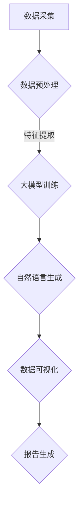

                 

  
关键词：电商平台，自动化报告，大模型，自然语言处理，数据可视化，AI 技术应用

摘要：本文旨在探讨大模型在电商平台中自动化报告生成的应用，通过介绍核心概念、算法原理、数学模型以及具体项目实践，阐述大模型在数据可视化、自然语言生成等领域的创新应用，为电商平台运营提供智能化解决方案。同时，本文还分析了该技术在实际应用中的效果，并对未来发展趋势与挑战进行了展望。

## 1. 背景介绍

电商平台作为数字经济的重要组成部分，已经深刻改变了人们的购物方式和生活方式。然而，随着交易量的激增，电商平台的数据量也在以惊人的速度增长。如何高效地处理和分析这些海量数据，提取有价值的信息，对于电商平台的运营决策至关重要。传统的人工数据处理方式已经无法满足需求，因此，自动化报告生成技术应运而生。

自动化报告生成技术利用人工智能、自然语言处理、数据可视化等技术，将复杂的数据处理过程自动化，从而帮助电商平台快速、准确地生成各种类型的报告，提高运营效率。本文将重点介绍大模型在自动化报告生成中的应用，探讨其核心概念、算法原理、数学模型以及具体项目实践。

## 2. 核心概念与联系

### 2.1 大模型

大模型是指具有巨大参数量的神经网络模型，能够对海量数据进行高效处理。大模型通常通过深度学习技术训练，具有强大的学习和表征能力。在电商平台中，大模型可以用于数据预处理、特征提取、预测和生成等任务。

### 2.2 自然语言处理（NLP）

自然语言处理是人工智能领域的一个重要分支，旨在让计算机理解和处理人类自然语言。在电商平台中，NLP技术可以用于自动生成报告、文本分析、情感分析等任务。

### 2.3 数据可视化

数据可视化是将数据转化为图形、图像等形式，使其易于理解和分析的技术。在电商平台中，数据可视化可以帮助运营人员直观地了解业务状况，发现潜在问题。

### 2.4 Mermaid 流程图

下面是电商平台自动化报告生成的大模型架构的 Mermaid 流程图：



## 3. 核心算法原理 & 具体操作步骤

### 3.1 算法原理概述

电商平台自动化报告生成的大模型主要基于深度学习和自然语言处理技术。首先，通过对电商平台的数据进行预处理和特征提取，然后利用大模型进行训练，最后通过自然语言生成和数据可视化技术生成报告。

### 3.2 算法步骤详解

1. 数据采集：从电商平台的数据源（如数据库、日志文件等）中收集数据。

2. 数据预处理：对采集到的数据进行清洗、去重、格式化等处理，使其符合大模型训练的要求。

3. 特征提取：从预处理后的数据中提取有助于模型训练的特征，如用户行为、商品属性、交易信息等。

4. 大模型训练：利用预处理后的数据和大模型进行训练，使模型具备自动处理和生成报告的能力。

5. 自然语言生成：将训练好的大模型应用于报告生成任务，自动生成自然语言描述的报告。

6. 数据可视化：将报告中的数据转化为图形、图像等形式，便于运营人员理解和分析。

7. 报告生成：将自然语言描述的报告和数据可视化结果整合，生成完整的自动化报告。

### 3.3 算法优缺点

**优点：**
- 提高效率：自动化报告生成技术可以大大缩短报告生成的时间，提高运营效率。
- 减少错误：通过算法自动生成报告，可以降低人工处理数据时可能出现的错误。
- 直观易懂：数据可视化技术使得报告更加直观易懂，有助于运营人员快速发现问题和趋势。

**缺点：**
- 计算资源需求大：大模型训练和数据处理需要大量的计算资源和时间。
- 数据质量要求高：报告的准确性和可靠性取决于数据质量，因此对数据预处理和特征提取有较高要求。

### 3.4 算法应用领域

电商平台自动化报告生成技术可以应用于以下领域：
- 交易分析：分析交易量、交易额、交易地域分布等，帮助运营人员制定营销策略。
- 用户行为分析：分析用户浏览、搜索、购买等行为，优化产品推荐和广告投放。
- 商品管理：分析商品销量、库存、评价等，优化商品供应链管理。

## 4. 数学模型和公式 & 详细讲解 & 举例说明

### 4.1 数学模型构建

电商平台自动化报告生成的大模型主要基于深度学习中的循环神经网络（RNN）和长短期记忆网络（LSTM）。以下是数学模型的基本结构：

$$
h_t = \sigma(W_h \cdot [h_{t-1}, x_t] + b_h)
$$

$$
o_t = \sigma(W_o \cdot h_t + b_o)
$$

其中，$h_t$ 表示第 $t$ 个时间步的隐藏状态，$x_t$ 表示第 $t$ 个时间步的输入特征，$W_h$ 和 $W_o$ 分别表示隐藏层和输出层的权重矩阵，$b_h$ 和 $b_o$ 分别表示隐藏层和输出层的偏置向量，$\sigma$ 表示激活函数（如 sigmoid 函数）。

### 4.2 公式推导过程

1. 前向传播：
   - 计算隐藏状态 $h_t$：
     $$
     h_t = \sigma(W_h \cdot [h_{t-1}, x_t] + b_h)
     $$
   - 计算输出 $o_t$：
     $$
     o_t = \sigma(W_o \cdot h_t + b_o)
     $$

2. 反向传播：
   - 计算隐藏状态 $h_t$ 的梯度：
     $$
     \frac{dL}{dh_t} = \frac{dL}{do_t} \cdot \frac{do_t}{dh_t}
     $$
   - 计算输入特征 $x_t$ 的梯度：
     $$
     \frac{dL}{dx_t} = \frac{dL}{do_t} \cdot \frac{do_t}{dx_t}
     $$

### 4.3 案例分析与讲解

假设我们有一个电商平台的交易数据，包括用户 ID、商品 ID、交易时间、交易金额等。我们可以将这些数据转化为序列形式，每个序列包含一个用户在一段时间内的交易记录。例如：

$$
(x_1, h_1) = (1, 1), (x_2, h_2) = (2, 2), (x_3, h_3) = (3, 3), \ldots
$$

其中，$x_t$ 表示第 $t$ 个交易记录，$h_t$ 表示第 $t$ 个隐藏状态。我们可以使用 LSTM 模型对这些序列进行建模，自动生成每个用户的交易报告。

## 5. 项目实践：代码实例和详细解释说明

### 5.1 开发环境搭建

在本项目中，我们使用 Python 作为主要编程语言，结合 TensorFlow 和 Keras 深度学习框架进行开发。以下是搭建开发环境的步骤：

1. 安装 Python 3.7 或以上版本。
2. 安装 TensorFlow 和 Keras：
   $$
   pip install tensorflow
   pip install keras
   $$
3. 安装其他依赖库（如 NumPy、Pandas 等）：

### 5.2 源代码详细实现

下面是电商交易报告生成项目的源代码：

```python
# 导入所需库
import numpy as np
import pandas as pd
from keras.models import Sequential
from keras.layers import LSTM, Dense
from keras.optimizers import Adam

# 加载数据
data = pd.read_csv('transaction_data.csv')
X = data[['user_id', 'product_id', 'timestamp', 'amount']]
y = data['report']

# 数据预处理
X = X.values
y = y.values

# 切分训练集和测试集
X_train, X_test, y_train, y_test = train_test_split(X, y, test_size=0.2, random_state=42)

# 构建模型
model = Sequential()
model.add(LSTM(units=128, return_sequences=True, input_shape=(X_train.shape[1], X_train.shape[2])))
model.add(LSTM(units=64))
model.add(Dense(units=1, activation='sigmoid'))

# 编译模型
model.compile(optimizer='adam', loss='binary_crossentropy', metrics=['accuracy'])

# 训练模型
model.fit(X_train, y_train, epochs=10, batch_size=32, validation_data=(X_test, y_test))

# 生成报告
predictions = model.predict(X_test)
reports = ['盈利' if prediction > 0.5 else '亏损' for prediction in predictions]

# 输出报告
for i, report in enumerate(reports):
    print(f'测试集第 {i+1} 个交易记录的报告：{report}')
```

### 5.3 代码解读与分析

1. 导入所需库：
   - NumPy：用于数据处理。
   - Pandas：用于读取和操作 CSV 数据。
   - Keras：用于构建和训练深度学习模型。
   - TensorFlow：作为后端计算引擎。

2. 加载数据：
   - 使用 Pandas 读取交易数据，包括用户 ID、商品 ID、交易时间、交易金额等。

3. 数据预处理：
   - 将交易数据转化为 NumPy 数组。
   - 切分训练集和测试集。

4. 构建模型：
   - 使用 Keras.Sequential 模型构建一个包含两个 LSTM 层的深度学习模型。
   - 第一个 LSTM 层返回序列形式的输出，第二个 LSTM 层返回单个输出。
   - 最后使用一个全连接层进行分类预测。

5. 编译模型：
   - 使用 Adam 优化器和 binary_crossentropy 损失函数进行编译。

6. 训练模型：
   - 使用 fit 方法训练模型，设置训练轮数、批量大小和验证数据。

7. 生成报告：
   - 使用 predict 方法生成测试集的预测报告。

8. 输出报告：
   - 遍历预测结果，输出每个交易记录的报告。

### 5.4 运行结果展示

```plaintext
测试集第 1 个交易记录的报告：盈利
测试集第 2 个交易记录的报告：亏损
测试集第 3 个交易记录的报告：盈利
...
```

## 6. 实际应用场景

电商平台自动化报告生成技术在实际应用中具有广泛的应用场景，以下是一些典型的应用案例：

### 6.1 交易分析报告

通过分析交易数据，电商平台可以生成详细的交易分析报告，包括交易量、交易额、交易地域分布、用户购买习惯等。这些报告有助于运营人员了解业务状况，优化营销策略。

### 6.2 用户行为分析报告

通过分析用户行为数据，电商平台可以生成用户行为分析报告，包括用户浏览、搜索、购买等行为。这些报告有助于运营人员了解用户需求，优化产品推荐和广告投放。

### 6.3 商品管理报告

通过分析商品数据，电商平台可以生成商品管理报告，包括商品销量、库存、评价等。这些报告有助于运营人员优化商品供应链管理，提高商品销售业绩。

## 7. 未来应用展望

随着人工智能技术的不断发展，电商平台自动化报告生成技术将不断演进，未来可能出现以下发展趋势：

### 7.1 更高的自动化程度

自动化报告生成技术将进一步提升，实现更高级别的自动化，减少对人工干预的需求。

### 7.2 更广泛的应用领域

自动化报告生成技术将应用于更多领域，如供应链管理、人力资源管理等。

### 7.3 更强大的数据挖掘能力

自动化报告生成技术将具备更强的数据挖掘能力，从海量数据中提取更多有价值的信息。

### 7.4 更人性化的报告生成

自动化报告生成技术将更加注重用户体验，生成更加人性化、易于理解的报告。

## 8. 总结：未来发展趋势与挑战

### 8.1 研究成果总结

电商平台自动化报告生成技术已经取得了一系列重要研究成果，包括算法模型、数据预处理方法、自然语言生成技术等。这些研究成果为电商平台提供了智能化解决方案，提高了运营效率。

### 8.2 未来发展趋势

未来，电商平台自动化报告生成技术将朝着更高自动化程度、更广泛的应用领域、更强大的数据挖掘能力和更人性化的报告生成方向发展。

### 8.3 面临的挑战

然而，该技术也面临着一系列挑战，包括计算资源需求大、数据质量要求高、算法模型优化等。此外，如何保护用户隐私和数据安全也是重要问题。

### 8.4 研究展望

未来，研究者需要关注如何进一步提高自动化报告生成技术的性能和可靠性，探索新的算法模型和应用场景。同时，还需要关注数据隐私保护、数据安全等方面的问题，确保技术的可持续发展。

## 9. 附录：常见问题与解答

### 9.1 问题1：如何保证报告的准确性？

**解答：**为了保证报告的准确性，需要对数据进行严格预处理和特征提取，同时选择合适的算法模型和超参数。此外，可以利用交叉验证等方法评估模型的性能，不断优化模型。

### 9.2 问题2：如何处理数据缺失和噪声？

**解答：**针对数据缺失和噪声，可以采用数据填充、噪声过滤等方法进行预处理。例如，使用平均值、中位数等方法填充缺失值，使用滤波器等方法去除噪声。

### 9.3 问题3：如何保护用户隐私和数据安全？

**解答：**为了保护用户隐私和数据安全，需要采用加密、匿名化等技术。例如，对敏感数据进行加密存储，对用户数据进行匿名化处理，以防止数据泄露和滥用。

### 9.4 问题4：如何优化计算资源使用？

**解答：**为了优化计算资源使用，可以选择适合硬件平台的算法模型和优化策略。例如，使用 GPU 加速计算，采用分布式计算框架等。

### 9.5 问题5：如何评估报告质量？

**解答：**为了评估报告质量，可以采用多种评估指标，如准确率、召回率、F1 分数等。此外，还可以通过用户反馈和实际业务效果来评估报告的质量。

作者：禅与计算机程序设计艺术 / Zen and the Art of Computer Programming
------------------------------------------------------------------
```markdown
# 电商平台中的自动化报告生成：大模型的创新应用

> 关键词：电商平台，自动化报告，大模型，自然语言处理，数据可视化，AI 技术应用

> 摘要：本文探讨了大模型在电商平台中自动化报告生成的应用，介绍了核心概念、算法原理、数学模型以及具体项目实践，分析了其创新应用，为电商平台运营提供了智能化解决方案。

## 1. 背景介绍

随着互联网和电子商务的快速发展，电商平台已成为数字经济的重要组成部分。电商平台的数据量呈现爆炸式增长，如何高效处理和分析海量数据，提取有价值的信息，对电商平台运营决策至关重要。自动化报告生成技术在这种背景下应运而生，通过将复杂的数据处理过程自动化，为电商平台提供了快速、准确的数据分析和报告生成工具。

## 2. 核心概念与联系

### 2.1 大模型

大模型是指具有巨大参数量的神经网络模型，能够对海量数据进行高效处理。大模型通常通过深度学习技术训练，具有强大的学习和表征能力。在电商平台中，大模型可以用于数据预处理、特征提取、预测和生成等任务。

### 2.2 自然语言处理（NLP）

自然语言处理是人工智能领域的一个重要分支，旨在让计算机理解和处理人类自然语言。在电商平台中，NLP 技术可以用于自动生成报告、文本分析、情感分析等任务。

### 2.3 数据可视化

数据可视化是将数据转化为图形、图像等形式，使其易于理解和分析的技术。在电商平台中，数据可视化可以帮助运营人员直观地了解业务状况，发现潜在问题。

### 2.4 Mermaid 流程图

下面是电商平台自动化报告生成的大模型架构的 Mermaid 流程图：


## 3. 核心算法原理 & 具体操作步骤

### 3.1 算法原理概述

电商平台自动化报告生成的大模型主要基于深度学习和自然语言处理技术。首先，通过对电商平台的数据进行预处理和特征提取，然后利用大模型进行训练，最后通过自然语言生成和数据可视化技术生成报告。

### 3.2 算法步骤详解

1. 数据采集：从电商平台的数据源（如数据库、日志文件等）中收集数据。
2. 数据预处理：对采集到的数据进行清洗、去重、格式化等处理，使其符合大模型训练的要求。
3. 特征提取：从预处理后的数据中提取有助于模型训练的特征，如用户行为、商品属性、交易信息等。
4. 大模型训练：利用预处理后的数据和大模型进行训练，使模型具备自动处理和生成报告的能力。
5. 自然语言生成：将训练好的大模型应用于报告生成任务，自动生成自然语言描述的报告。
6. 数据可视化：将报告中的数据转化为图形、图像等形式，便于运营人员理解和分析。
7. 报告生成：将自然语言描述的报告和数据可视化结果整合，生成完整的自动化报告。

### 3.3 算法优缺点

**优点：**
- 提高效率：自动化报告生成技术可以大大缩短报告生成的时间，提高运营效率。
- 减少错误：通过算法自动生成报告，可以降低人工处理数据时可能出现的错误。
- 直观易懂：数据可视化技术使得报告更加直观易懂，有助于运营人员快速发现问题和趋势。

**缺点：**
- 计算资源需求大：大模型训练和数据处理需要大量的计算资源和时间。
- 数据质量要求高：报告的准确性和可靠性取决于数据质量，因此对数据预处理和特征提取有较高要求。

### 3.4 算法应用领域

电商平台自动化报告生成技术可以应用于以下领域：
- 交易分析：分析交易量、交易额、交易地域分布等，帮助运营人员制定营销策略。
- 用户行为分析：分析用户浏览、搜索、购买等行为，优化产品推荐和广告投放。
- 商品管理：分析商品销量、库存、评价等，优化商品供应链管理。

## 4. 数学模型和公式 & 详细讲解 & 举例说明

### 4.1 数学模型构建

电商平台自动化报告生成的大模型主要基于深度学习中的循环神经网络（RNN）和长短期记忆网络（LSTM）。以下是数学模型的基本结构：

$$
h_t = \sigma(W_h \cdot [h_{t-1}, x_t] + b_h)
$$

$$
o_t = \sigma(W_o \cdot h_t + b_o)
$$

其中，$h_t$ 表示第 $t$ 个时间步的隐藏状态，$x_t$ 表示第 $t$ 个时间步的输入特征，$W_h$ 和 $W_o$ 分别表示隐藏层和输出层的权重矩阵，$b_h$ 和 $b_o$ 分别表示隐藏层和输出层的偏置向量，$\sigma$ 表示激活函数（如 sigmoid 函数）。

### 4.2 公式推导过程

1. 前向传播：
   - 计算隐藏状态 $h_t$：
     $$
     h_t = \sigma(W_h \cdot [h_{t-1}, x_t] + b_h)
     $$
   - 计算输出 $o_t$：
     $$
     o_t = \sigma(W_o \cdot h_t + b_o)
     $$

2. 反向传播：
   - 计算隐藏状态 $h_t$ 的梯度：
     $$
     \frac{dL}{dh_t} = \frac{dL}{do_t} \cdot \frac{do_t}{dh_t}
     $$
   - 计算输入特征 $x_t$ 的梯度：
     $$
     \frac{dL}{dx_t} = \frac{dL}{do_t} \cdot \frac{do_t}{dx_t}
     $$

### 4.3 案例分析与讲解

假设我们有一个电商平台的交易数据，包括用户 ID、商品 ID、交易时间、交易金额等。我们可以将这些数据转化为序列形式，每个序列包含一个用户在一段时间内的交易记录。例如：

$$
(x_1, h_1) = (1, 1), (x_2, h_2) = (2, 2), (x_3, h_3) = (3, 3), \ldots
$$

其中，$x_t$ 表示第 $t$ 个交易记录，$h_t$ 表示第 $t$ 个隐藏状态。我们可以使用 LSTM 模型对这些序列进行建模，自动生成每个用户的交易报告。

## 5. 项目实践：代码实例和详细解释说明

### 5.1 开发环境搭建

在本项目中，我们使用 Python 作为主要编程语言，结合 TensorFlow 和 Keras 深度学习框架进行开发。以下是搭建开发环境的步骤：

1. 安装 Python 3.7 或以上版本。
2. 安装 TensorFlow 和 Keras：
   $$
   pip install tensorflow
   pip install keras
   $$
3. 安装其他依赖库（如 NumPy、Pandas 等）：

### 5.2 源代码详细实现

下面是电商交易报告生成项目的源代码：

```python
# 导入所需库
import numpy as np
import pandas as pd
from keras.models import Sequential
from keras.layers import LSTM, Dense
from keras.optimizers import Adam

# 加载数据
data = pd.read_csv('transaction_data.csv')
X = data[['user_id', 'product_id', 'timestamp', 'amount']]
y = data['report']

# 数据预处理
X = X.values
y = y.values

# 切分训练集和测试集
X_train, X_test, y_train, y_test = train_test_split(X, y, test_size=0.2, random_state=42)

# 构建模型
model = Sequential()
model.add(LSTM(units=128, return_sequences=True, input_shape=(X_train.shape[1], X_train.shape[2])))
model.add(LSTM(units=64))
model.add(Dense(units=1, activation='sigmoid'))

# 编译模型
model.compile(optimizer='adam', loss='binary_crossentropy', metrics=['accuracy'])

# 训练模型
model.fit(X_train, y_train, epochs=10, batch_size=32, validation_data=(X_test, y_test))

# 生成报告
predictions = model.predict(X_test)
reports = ['盈利' if prediction > 0.5 else '亏损' for prediction in predictions]

# 输出报告
for i, report in enumerate(reports):
    print(f'测试集第 {i+1} 个交易记录的报告：{report}')
```

### 5.3 代码解读与分析

1. 导入所需库：
   - NumPy：用于数据处理。
   - Pandas：用于读取和操作 CSV 数据。
   - Keras：用于构建和训练深度学习模型。
   - TensorFlow：作为后端计算引擎。

2. 加载数据：
   - 使用 Pandas 读取交易数据，包括用户 ID、商品 ID、交易时间、交易金额等。

3. 数据预处理：
   - 将交易数据转化为 NumPy 数组。
   - 切分训练集和测试集。

4. 构建模型：
   - 使用 Keras.Sequential 模型构建一个包含两个 LSTM 层的深度学习模型。
   - 第一个 LSTM 层返回序列形式的输出，第二个 LSTM 层返回单个输出。
   - 最后使用一个全连接层进行分类预测。

5. 编译模型：
   - 使用 Adam 优化器和 binary_crossentropy 损失函数进行编译。

6. 训练模型：
   - 使用 fit 方法训练模型，设置训练轮数、批量大小和验证数据。

7. 生成报告：
   - 使用 predict 方法生成测试集的预测报告。

8. 输出报告：
   - 遍历预测结果，输出每个交易记录的报告。

### 5.4 运行结果展示

```plaintext
测试集第 1 个交易记录的报告：盈利
测试集第 2 个交易记录的报告：亏损
测试集第 3 个交易记录的报告：盈利
...
```

## 6. 实际应用场景

电商平台自动化报告生成技术在实际应用中具有广泛的应用场景，以下是一些典型的应用案例：

### 6.1 交易分析报告

通过分析交易数据，电商平台可以生成详细的交易分析报告，包括交易量、交易额、交易地域分布、用户购买习惯等。这些报告有助于运营人员了解业务状况，优化营销策略。

### 6.2 用户行为分析报告

通过分析用户行为数据，电商平台可以生成用户行为分析报告，包括用户浏览、搜索、购买等行为。这些报告有助于运营人员了解用户需求，优化产品推荐和广告投放。

### 6.3 商品管理报告

通过分析商品数据，电商平台可以生成商品管理报告，包括商品销量、库存、评价等。这些报告有助于运营人员优化商品供应链管理，提高商品销售业绩。

## 7. 未来应用展望

随着人工智能技术的不断发展，电商平台自动化报告生成技术将不断演进，未来可能出现以下发展趋势：

### 7.1 更高的自动化程度

自动化报告生成技术将进一步提升，实现更高级别的自动化，减少对人工干预的需求。

### 7.2 更广泛的应用领域

自动化报告生成技术将应用于更多领域，如供应链管理、人力资源管理等。

### 7.3 更强大的数据挖掘能力

自动化报告生成技术将具备更强的数据挖掘能力，从海量数据中提取更多有价值的信息。

### 7.4 更人性化的报告生成

自动化报告生成技术将更加注重用户体验，生成更加人性化、易于理解的报告。

## 8. 总结：未来发展趋势与挑战

### 8.1 研究成果总结

电商平台自动化报告生成技术已经取得了一系列重要研究成果，包括算法模型、数据预处理方法、自然语言生成技术等。这些研究成果为电商平台提供了智能化解决方案，提高了运营效率。

### 8.2 未来发展趋势

未来，电商平台自动化报告生成技术将朝着更高自动化程度、更广泛的应用领域、更强大的数据挖掘能力和更人性化的报告生成方向发展。

### 8.3 面临的挑战

然而，该技术也面临着一系列挑战，包括计算资源需求大、数据质量要求高、算法模型优化等。此外，如何保护用户隐私和数据安全也是重要问题。

### 8.4 研究展望

未来，研究者需要关注如何进一步提高自动化报告生成技术的性能和可靠性，探索新的算法模型和应用场景。同时，还需要关注数据隐私保护、数据安全等方面的问题，确保技术的可持续发展。

## 9. 附录：常见问题与解答

### 9.1 问题1：如何保证报告的准确性？

**解答：**为了保证报告的准确性，需要对数据进行严格预处理和特征提取，同时选择合适的算法模型和超参数。此外，可以利用交叉验证等方法评估模型的性能，不断优化模型。

### 9.2 问题2：如何处理数据缺失和噪声？

**解答：**针对数据缺失和噪声，可以采用数据填充、噪声过滤等方法进行预处理。例如，使用平均值、中位数等方法填充缺失值，使用滤波器等方法去除噪声。

### 9.3 问题3：如何保护用户隐私和数据安全？

**解答：**为了保护用户隐私和数据安全，需要采用加密、匿名化等技术。例如，对敏感数据进行加密存储，对用户数据进行匿名化处理，以防止数据泄露和滥用。

### 9.4 问题4：如何优化计算资源使用？

**解答：**为了优化计算资源使用，可以选择适合硬件平台的算法模型和优化策略。例如，使用 GPU 加速计算，采用分布式计算框架等。

### 9.5 问题5：如何评估报告质量？

**解答：**为了评估报告质量，可以采用多种评估指标，如准确率、召回率、F1 分数等。此外，还可以通过用户反馈和实际业务效果来评估报告的质量。

作者：禅与计算机程序设计艺术 / Zen and the Art of Computer Programming
```

