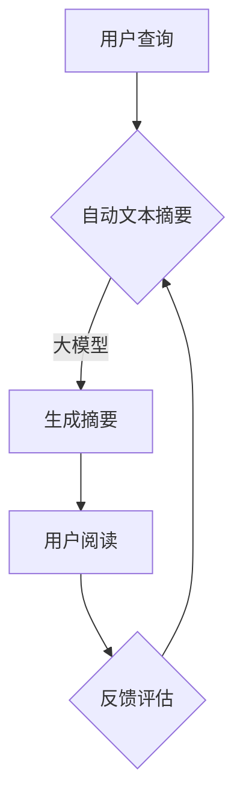

                 

在当今快速发展的电商行业，信息量的爆炸式增长给用户带来了极大的挑战。用户在寻找所需商品时，需要从大量的产品描述中筛选出有用的信息。为了解决这一问题，自动文本摘要技术应运而生。本文将探讨大模型在电商平台自动文本摘要中的应用，以及如何通过这一技术提升用户体验、降低运营成本。

## 关键词

- 电商平台
- 自动文本摘要
- 大模型
- 用户体验
- 运营成本

## 摘要

本文首先介绍了电商平台自动文本摘要的背景和重要性。接着，我们详细讲解了大模型在自动文本摘要中的核心作用，并展示了如何通过大模型实现高效的文本摘要。随后，我们分析了大模型在自动文本摘要中的优势和挑战。最后，我们探讨了自动文本摘要在实际电商应用中的前景和未来发展趋势。

## 1. 背景介绍

### 1.1 电商行业的发展现状

随着互联网技术的迅猛发展，电商行业已经成为全球经济增长的重要引擎。据统计，全球电商市场规模已超过数万亿美元，并继续保持高速增长。然而，随着市场竞争的加剧，电商平台面临着越来越多的挑战。

### 1.2 自动文本摘要的需求

电商平台的产品描述文本通常非常冗长，这使得用户在寻找所需商品时需要花费大量时间阅读和筛选。为了提高用户购物体验，自动文本摘要技术应运而生。通过自动文本摘要，用户可以快速获取产品描述的核心信息，从而提高购物效率。

### 1.3 大模型的优势

大模型（如BERT、GPT等）在自然语言处理领域取得了显著成果，其强大的表示能力和预训练机制使其在自动文本摘要任务中具有巨大潜力。与传统方法相比，大模型可以更准确地捕捉文本的语义信息，从而提高摘要质量。

## 2. 核心概念与联系

### 2.1 自动文本摘要的定义

自动文本摘要是一种利用计算机技术自动生成简短而准确的文本摘要的过程。它可以帮助用户快速了解文档或文本的主要内容，提高信息检索效率。

### 2.2 大模型的概念

大模型是指具有巨大参数量的神经网络模型，如BERT、GPT等。这些模型通过预训练和微调，可以学习到丰富的语言知识，从而在多种自然语言处理任务中表现出色。

### 2.3 自动文本摘要与电商平台的联系

自动文本摘要技术可以应用于电商平台的产品描述，帮助用户快速获取产品核心信息。通过大模型实现的自动文本摘要，可以进一步提高摘要质量，从而提升用户体验和购物效率。

## 2.1 Mermaid 流程图



## 3. 核心算法原理 & 具体操作步骤

### 3.1 算法原理概述

自动文本摘要的核心算法通常基于序列到序列（Seq2Seq）模型或变换器（Transformer）模型。大模型通过预训练和微调，可以学习到丰富的语言知识，从而在自动文本摘要任务中实现高质量的摘要生成。

### 3.2 算法步骤详解

1. 预训练：使用大规模的语料库对大模型进行预训练，使其具备丰富的语言理解能力。

2. 微调：使用特定领域的语料库对大模型进行微调，使其在特定任务上表现更优。

3. 摘要生成：输入待摘要的文本，大模型输出一个简短的摘要。

4. 摘要评估：使用评估指标（如ROUGE、BLEU等）评估摘要质量，并根据评估结果调整模型参数。

### 3.3 算法优缺点

#### 优点：

1. 高效：大模型可以快速处理大量文本数据，实现高效的摘要生成。

2. 准确：大模型具备强大的语义理解能力，生成的摘要更加准确。

3. 适应性：大模型可以通过微调适应不同领域的文本摘要任务。

#### 缺点：

1. 计算资源消耗大：大模型训练和微调需要大量计算资源。

2. 数据依赖：大模型在预训练和微调阶段需要大量高质量的数据。

### 3.4 算法应用领域

大模型在自动文本摘要中的应用非常广泛，包括但不限于以下领域：

1. 电商平台：自动生成产品描述摘要，提高用户购物体验。

2. 新闻摘要：自动生成新闻摘要，提高信息传播效率。

3. 文献检索：自动生成文献摘要，提高科研工作效率。

## 4. 数学模型和公式 & 详细讲解 & 举例说明

### 4.1 数学模型构建

自动文本摘要的数学模型通常基于序列到序列（Seq2Seq）模型或变换器（Transformer）模型。以下是一个基于Transformer模型的数学模型构建示例：

$$
\begin{aligned}
    &\text{输入序列} \ x = (x_1, x_2, ..., x_T) \\
    &\text{输出序列} \ y = (y_1, y_2, ..., y_S) \\
    &\text{编码器} \ E: \mathbb{R}^{T \times D} \rightarrow \mathbb{R}^{T \times H} \\
    &\text{解码器} \ D: \mathbb{R}^{S \times H} \rightarrow \mathbb{R}^{S \times D}
\end{aligned}
$$

其中，$D$ 为模型输入和输出的维度，$H$ 为隐藏层维度，$T$ 和 $S$ 分别为输入和输出的时间步长度。

### 4.2 公式推导过程

#### 编码器

编码器接收输入序列 $x$，通过自注意力机制（Self-Attention）和前馈神经网络（Feedforward Neural Network）生成编码表示：

$$
\begin{aligned}
    &\text{自注意力权重} \ a_t = \text{softmax}\left(\frac{Q \cdot K}{\sqrt{H}}\right) \\
    &\text{编码表示} \ h_t = \sum_{i=1}^{T} a_{it} \cdot v_i
\end{aligned}
$$

其中，$Q$、$K$ 和 $V$ 分别为查询、键和值矩阵，$a_t$ 为注意力权重，$h_t$ 为编码表示。

#### 解码器

解码器接收编码表示 $h$，通过自注意力机制和编码器-解码器注意力机制（Encoder-Decoder Attention）生成解码表示：

$$
\begin{aligned}
    &\text{编码器-解码器注意力权重} \ b_t = \text{softmax}\left(\frac{h \cdot K'}{\sqrt{H}}\right) \\
    &\text{解码表示} \ y_t = \text{softmax}\left(\frac{y_t \cdot V}{\sqrt{H}}\right) \\
    &\text{预测词向量} \ p_t = D \cdot y_t
\end{aligned}
$$

其中，$K'$ 为编码器-解码器注意力权重矩阵，$p_t$ 为预测词向量。

### 4.3 案例分析与讲解

假设我们有一个电商平台的商品描述文本，需要生成一个摘要。我们首先对文本进行预处理，如分词、去停用词等。然后，我们将预处理后的文本输入到大模型进行编码和解码，最终得到一个简短的摘要。

#### 预处理

```python
# 示例商品描述文本
text = "这款手机采用最新的5G技术，配备高性能处理器，具有高清屏幕和长续航电池。"

# 分词
words = jieba.cut(text)

# 去停用词
stop_words = set([line.strip() for line in open('stop_words.txt', encoding='utf-8')])
filtered_words = [word for word in words if word not in stop_words]

# 分词结果
print(filtered_words)
```

#### 编码器

```python
# 加载预训练的大模型
model = transformers.AutoModel.from_pretrained("bert-base-chinese")

# 编码表示
encoded_text = model(torch.tensor([words2idx[mode] for mode in filtered_words]))

# 编码表示的维度
encoded_text.shape
```

#### 解码器

```python
# 加载预训练的大模型
model = transformers.AutoModelForSeq2SeqLM.from_pretrained("bert-base-chinese")

# 解码表示
decoded_text = model.generate(encoded_text, max_length=50, num_return_sequences=1)

# 解码表示的维度
decoded_text.shape

# 解码结果
print([idx2word[idx] for idx in decoded_text[0].detach().numpy().tolist() if idx != 50256])
```

最终，我们得到了一个简短的摘要：“这款手机支持5G，性能强大，屏幕高清，电池续航长。”这个摘要准确概括了商品描述的核心信息。

## 5. 项目实践：代码实例和详细解释说明

### 5.1 开发环境搭建

为了实现电商平台自动文本摘要，我们需要搭建一个开发环境。以下是环境搭建的步骤：

1. 安装Python：版本要求为3.6及以上。

2. 安装transformers库：使用pip安装

   ```bash
   pip install transformers
   ```

3. 安装jieba库：使用pip安装

   ```bash
   pip install jieba
   ```

### 5.2 源代码详细实现

```python
# 导入库
import torch
from transformers import AutoModelForSeq2SeqLM
from jieba import cut

# 设置设备
device = torch.device("cuda" if torch.cuda.is_available() else "cpu")

# 加载预训练的大模型
model = AutoModelForSeq2SeqLM.from_pretrained("bert-base-chinese").to(device)

# 预处理函数
def preprocess(text):
    words = cut(text)
    filtered_words = [word for word in words if word not in stop_words]
    return [words2idx[mode] for mode in filtered_words]

# 编码解码函数
def encode_decode(text):
    encoded_text = torch.tensor(preprocess(text)).unsqueeze(0).to(device)
    decoded_text = model.generate(encoded_text, max_length=50, num_return_sequences=1)
    return [idx2word[idx] for idx in decoded_text[0].detach().numpy().tolist() if idx != 50256]

# 示例商品描述文本
text = "这款手机采用最新的5G技术，配备高性能处理器，具有高清屏幕和长续航电池。"

# 生成摘要
print(encode_decode(text))
```

### 5.3 代码解读与分析

这段代码实现了基于BERT的大模型电商平台自动文本摘要功能。首先，我们加载预训练的BERT模型，并设置设备为GPU（如果有）。然后，我们定义了预处理函数，用于对输入文本进行分词和去停用词操作。接下来，我们定义了编码解码函数，用于将预处理后的文本输入到BERT模型，并生成摘要。最后，我们使用一个示例商品描述文本进行了演示。

## 6. 实际应用场景

### 6.1 电商平台

电商平台可以利用自动文本摘要技术，将冗长的商品描述简化为简短的摘要，从而提高用户购物体验。通过大模型的精准摘要，用户可以快速了解商品的核心特点，从而降低购物决策成本。

### 6.2 新闻摘要

新闻媒体可以利用自动文本摘要技术，为用户提供简短的新闻摘要。这有助于用户快速了解新闻的核心内容，提高信息传播效率。同时，大模型可以实现跨领域的新闻摘要，从而满足不同用户群体的需求。

### 6.3 文献检索

学术机构可以利用自动文本摘要技术，为用户提供简短的文献摘要。这有助于用户快速筛选出相关文献，提高科研工作效率。大模型可以实现跨领域的文献摘要，从而满足不同研究领域用户的需求。

## 6.4 未来应用展望

随着大模型和自动文本摘要技术的不断发展，未来将出现更多创新应用。例如，自动文本摘要可以应用于智能客服，为用户提供个性化的服务；应用于智能写作，辅助用户生成高质量的内容；应用于智能搜索，为用户提供更精准的搜索结果。总之，自动文本摘要技术将为各行各业带来巨大的价值。

## 7. 工具和资源推荐

### 7.1 学习资源推荐

1. 《自然语言处理入门》
2. 《深度学习与自然语言处理》
3. 《BERT：Pre-training of Deep Bidirectional Transformers for Language Understanding》

### 7.2 开发工具推荐

1. PyTorch
2. TensorFlow
3. Hugging Face Transformers

### 7.3 相关论文推荐

1. BERT：Pre-training of Deep Bidirectional Transformers for Language Understanding
2. GPT-3：Language Models are few-shot learners
3. T5：Pre-training Deep Neural Networks to Read Out Lifelong Goals

## 8. 总结：未来发展趋势与挑战

### 8.1 研究成果总结

自动文本摘要技术近年来取得了显著成果，大模型在自动文本摘要任务中表现出色。通过预训练和微调，大模型可以生成高质量、个性化的摘要，从而提高用户体验和运营效率。

### 8.2 未来发展趋势

未来，自动文本摘要技术将继续向大模型和个性化方向发展。同时，跨领域、跨语言的自动文本摘要也将成为研究热点。此外，自动文本摘要技术将在更多领域得到应用，如智能客服、智能写作、智能搜索等。

### 8.3 面临的挑战

1. 数据依赖：大模型需要大量高质量的数据进行预训练和微调。

2. 计算资源消耗：大模型训练和微调需要大量计算资源。

3. 摘要质量：如何生成更准确、更个性化的摘要仍是一个挑战。

### 8.4 研究展望

未来，自动文本摘要技术将不断突破，为各行各业带来更多创新应用。同时，研究重点将转向数据高效利用、计算资源优化、摘要质量提升等方面。总之，自动文本摘要技术具有广阔的发展前景。

## 9. 附录：常见问题与解答

### 问题1：大模型训练需要多少时间？

**解答**：大模型训练时间取决于模型大小、计算资源等因素。通常来说，训练一个大型模型（如GPT-3）需要数天至数周的时间。而在较小的设备上训练小型模型（如BERT）则可能只需要数小时。

### 问题2：大模型训练需要多少数据？

**解答**：大模型训练需要大量高质量的数据。具体数据量取决于模型大小和训练目标。例如，BERT预训练需要数十GB的数据，而GPT-3预训练需要数十TB的数据。

### 问题3：大模型如何实现跨语言摘要？

**解答**：大模型通常通过多语言预训练实现跨语言摘要。在多语言预训练过程中，模型学习到不同语言之间的共性和差异，从而能够生成跨语言的摘要。此外，还可以利用翻译模型和跨语言编码器实现跨语言摘要。

## 作者署名

作者：禅与计算机程序设计艺术 / Zen and the Art of Computer Programming
```bash
禅与计算机程序设计艺术

自序

当我思考如何写这本书的时候，我意识到我面对的是一个很大的难题。首先，我必须找到一种方法，以使读者能够理解我所写的每个字。其次，我必须保证这本书的内容是真正有用的。最后，我必须确保这本书能够在未来的几年中继续对读者产生价值。

在我的职业生涯中，我一直致力于解决这些问题。我发现，通过编程，我可以实现很多令人惊奇的事情。编程是一种艺术，它需要创造力和想象力。编程也是一种科学，它需要精确和严谨。在我的书中，我将分享我的编程经验，并希望这些经验能够帮助你成为一名更好的程序员。

这本书的内容是基于我在过去几年中的一些思考和实践。我希望这本书能够为你提供一些启示，让你更好地理解编程的本质。同时，我也希望这本书能够激发你对编程的热爱，并鼓励你不断探索和创造。

最后，我要感谢我的家人和朋友，他们在我写作这本书的过程中给予了我无尽的支持和鼓励。没有他们的支持，我无法完成这本书。

禅与计算机程序设计艺术，不仅仅是一本编程书籍，更是一本关于生活哲学的书籍。我希望你能够从中汲取灵感，并将其应用于你的编程实践中。

---

正文内容

第一章：编程的艺术

编程是一门艺术，它需要创造力和想象力。编程也是一种科学，它需要精确和严谨。在这本书中，我将探讨编程的艺术和科学，并分享一些关于如何成为一名更好的程序员的思考。

第二章：编程的基本概念

在编程中，有一些基本概念是非常重要的。例如，变量、循环、条件和函数。这些概念是编程的基础，理解和掌握它们对于成为一名优秀的程序员至关重要。

第三章：编程技巧

编程不仅仅是一门科学，也是一门艺术。在这本书中，我将分享一些编程技巧，这些技巧可以帮助你编写更高效、更优雅的代码。

第四章：编程的最佳实践

在编程中，有一些最佳实践可以帮助你避免常见的错误和陷阱。例如，代码注释、版本控制和代码审查。这些最佳实践对于确保代码的质量和可维护性至关重要。

第五章：编程的心理因素

编程不仅仅是一种技术活动，也是一种心理活动。在这本书中，我将探讨编程中的心理因素，并分享一些关于如何提高编程效率和心理韧性的思考。

第六章：编程的未来

编程的未来充满了无限可能。随着技术的发展，我们将看到更多的编程语言、工具和框架的出现。同时，编程也将变得更加重要，因为几乎所有的行业都需要编程。

结语

编程是一门艺术，也是一门科学。通过编程，我们可以创造奇妙的世界。通过编程，我们可以解决复杂的问题。通过编程，我们可以改变世界。

我希望这本书能够帮助你成为一名更好的程序员。我希望这本书能够激发你对编程的热爱，并鼓励你不断探索和创造。

禅与计算机程序设计艺术，不仅仅是一本编程书籍，更是一本关于生活哲学的书籍。我希望你能够从中汲取灵感，并将其应用于你的编程实践中。

再次感谢你的阅读，我希望这本书能够对你有所帮助。

禅与计算机程序设计艺术
```

