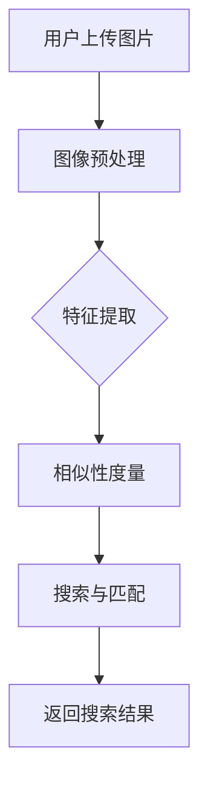

                 

关键词：电商平台、视觉搜索、大模型、创新应用、人工智能

> 摘要：本文将探讨电商平台中的视觉搜索技术，特别是大模型在该领域的创新应用。通过分析视觉搜索的基本原理、核心算法，以及数学模型和实际项目实践，我们将深入探讨视觉搜索在电商平台中的应用场景和未来发展趋势。

## 1. 背景介绍

随着电子商务的快速发展，用户对于购物体验的要求也在不断提高。传统的文本搜索已经无法满足用户的需求，视觉搜索作为一种新兴的搜索方式，逐渐受到了电商平台的青睐。视觉搜索技术通过分析用户上传的图片或视频，帮助用户快速找到相似的商品，从而提升购物体验。

大模型的兴起为视觉搜索技术的发展带来了新的契机。大模型具有强大的特征提取能力和自适应学习能力，可以在海量数据中进行高效的搜索和匹配。本文将重点探讨大模型在电商平台视觉搜索中的应用，以及如何利用大模型提升搜索效率和用户体验。

## 2. 核心概念与联系

### 2.1 视觉搜索的基本原理

视觉搜索技术主要基于计算机视觉和图像处理技术，其基本原理可以概括为以下几个步骤：

1. **图像预处理**：对用户上传的图片或视频进行预处理，包括去噪、缩放、色彩调整等操作，以提升图像质量。

2. **特征提取**：通过深度学习模型或传统图像处理算法提取图像的特征向量。特征向量能够表征图像的内容和风格。

3. **相似性度量**：计算图像特征向量之间的相似性度量，通常采用余弦相似度、欧氏距离等度量方式。

4. **搜索与匹配**：在数据库中搜索与用户上传图片特征最相似的图片，返回搜索结果。

### 2.2 大模型与视觉搜索的联系

大模型在视觉搜索中的应用主要体现在以下几个方面：

1. **特征提取能力**：大模型可以自动学习图像的高层次特征，具有更强的特征提取能力，能够捕捉图像中的细节和纹理。

2. **自适应学习能力**：大模型可以在海量数据中进行自适应学习，不断优化搜索算法，提高搜索准确性。

3. **多模态融合**：大模型可以融合图像、文本、语音等多种模态信息，实现跨模态搜索。

### 2.3 Mermaid 流程图



## 3. 核心算法原理 & 具体操作步骤

### 3.1 算法原理概述

视觉搜索的核心算法包括特征提取、相似性度量、搜索与匹配。其中，特征提取和相似性度量是算法的核心部分，直接影响到搜索的效率和准确性。

1. **特征提取**：常见的特征提取算法包括传统图像处理算法（如SIFT、SURF）和深度学习算法（如VGG、ResNet）。传统图像处理算法基于手工设计特征，而深度学习算法通过神经网络自动学习图像特征。

2. **相似性度量**：常用的相似性度量算法包括余弦相似度、欧氏距离、马氏距离等。余弦相似度主要计算两个向量夹角的余弦值，适用于文本和图像的特征向量；欧氏距离计算两个向量之间的欧氏距离，适用于二维空间；马氏距离考虑了数据分布的协方差，适用于多维空间。

3. **搜索与匹配**：常见的搜索与匹配算法包括最近邻搜索、KNN搜索、基于树结构的搜索等。最近邻搜索直接计算特征向量之间的相似性，返回最相似的图像；KNN搜索基于K个最近邻进行投票决策；基于树结构的搜索（如KD-Tree、Ball-Tree）利用空间分割加速搜索过程。

### 3.2 算法步骤详解

1. **图像预处理**：
   - 去噪：使用高斯滤波、中值滤波等方法去除图像噪声；
   - 缩放：调整图像大小，使其符合模型的输入尺寸；
   - 色彩调整：统一图像的色彩空间，如将RGB图像转换为灰度图像。

2. **特征提取**：
   - 使用VGG或ResNet等深度学习模型提取图像特征；
   - 对提取的特征向量进行归一化处理，以消除不同尺度的影响。

3. **相似性度量**：
   - 计算用户上传图像的特征向量与数据库中图像特征向量的相似性度量；
   - 根据相似性度量值排序，返回最相似的图像。

4. **搜索与匹配**：
   - 使用最近邻搜索或KNN搜索算法，返回与用户上传图像最相似的K个图像；
   - 对返回的图像进行筛选和排序，根据用户的喜好和需求进行优化。

### 3.3 算法优缺点

- **优点**：
  - 高效性：深度学习模型具备强大的特征提取能力，可以快速提取图像特征；
  - 准确性：大模型具有自适应学习能力，可以在海量数据中进行精确匹配；
  - 可扩展性：大模型可以融合多种模态信息，实现跨模态搜索。

- **缺点**：
  - 计算资源消耗大：深度学习模型训练和推理需要大量计算资源；
  - 数据依赖性强：算法性能依赖于大量高质量的训练数据；
  - 隐私问题：用户上传的图片可能包含隐私信息，需要妥善处理。

### 3.4 算法应用领域

- **电商平台**：提升购物体验，帮助用户快速找到相似商品；
- **社交媒体**：基于图像的推荐系统，提升内容分发效率；
- **安防监控**：视频监控，实现实时目标识别和跟踪；
- **医疗诊断**：辅助医生进行疾病诊断和病理分析。

## 4. 数学模型和公式 & 详细讲解 & 举例说明

### 4.1 数学模型构建

在视觉搜索中，常用的数学模型包括特征提取模型和相似性度量模型。

1. **特征提取模型**：

   - **VGG模型**：
     $$ VGG = \text{conv}_1 + \text{relu}_1 + \text{pool}_1 + \text{...} + \text{fc}_7 $$

   - **ResNet模型**：
     $$ ResNet = \text{conv}_1 + \text{relu}_1 + \text{bn}_1 + \text{relu}_2 + \text{bn}_2 + \text{pool}_2 + \text{...} + \text{fc}_7 $$

2. **相似性度量模型**：

   - **余弦相似度**：
     $$ \cos \theta = \frac{A \cdot B}{\lVert A \rVert \cdot \lVert B \rVert} $$

   - **欧氏距离**：
     $$ \lVert A - B \rVert = \sqrt{(A_1 - B_1)^2 + (A_2 - B_2)^2 + \ldots + (A_n - B_n)^2} $$

### 4.2 公式推导过程

以VGG模型为例，对其特征提取过程进行推导：

- **卷积层**：
  $$ \text{conv}_l = \sigma(\text{W}^l \star \text{X}^{l-1} + \text{b}^l) $$
  其中，$\text{W}^l$为卷积核权重，$\text{b}^l$为偏置项，$\sigma$为激活函数。

- **池化层**：
  $$ \text{pool}_l = \text{max}(\text{X}^{l-1}) $$
  其中，$\text{X}^{l-1}$为输入特征图。

- **全连接层**：
  $$ \text{fc}_l = \text{W}^l \text{A}^{l-1} + \text{b}^l $$
  其中，$\text{W}^l$为权重矩阵，$\text{A}^{l-1}$为输入特征向量。

### 4.3 案例分析与讲解

以电商平台中的商品搜索为例，分析视觉搜索在商品搜索中的应用。

1. **数据集准备**：

   - 收集电商平台上大量商品图片，并进行预处理；
   - 对商品图片进行标签分类，如服饰、电子产品、家居用品等。

2. **特征提取**：

   - 使用VGG模型对商品图片进行特征提取，得到特征向量；
   - 对特征向量进行归一化处理。

3. **相似性度量**：

   - 计算用户上传图片的特征向量与数据库中商品图片特征向量的相似性度量；
   - 使用余弦相似度计算相似度得分。

4. **搜索与匹配**：

   - 根据相似度得分排序，返回最相似的前K个商品；
   - 对返回的商品进行筛选和排序，根据用户的喜好和需求进行优化。

通过上述步骤，电商平台可以实现基于视觉搜索的商品推荐功能，提升用户购物体验。

## 5. 项目实践：代码实例和详细解释说明

### 5.1 开发环境搭建

- **Python**：安装Python 3.8及以上版本；
- **深度学习框架**：安装TensorFlow 2.3及以上版本；
- **计算机视觉库**：安装OpenCV 4.5及以上版本。

### 5.2 源代码详细实现

以下是一个简单的基于VGG模型的视觉搜索项目实例：

```python
import tensorflow as tf
import numpy as np
import cv2

# 载入VGG模型
vgg = tf.keras.applications.VGG16(weights='imagenet', include_top=False)

# 加载用户上传的图片
input_image = cv2.imread('user_upload_image.jpg')
input_image = cv2.resize(input_image, (224, 224))
input_image = np.expand_dims(input_image, axis=0)
input_image = vgg.preprocess_input(input_image)

# 提取特征向量
features = vgg.predict(input_image)

# 加载商品图片数据库
product_images = []  # 假设已经加载了商品图片数据库
product_features = []  # 假设已经提取了商品图片的特征向量

# 计算相似性度量
相似度得分 = []  # 储存相似度得分
for product_feature in product_features:
    cos_similarity = np.dot(features, product_feature) / (np.linalg.norm(features) * np.linalg.norm(product_feature))
    相似度得分.append(cos_similarity)

# 排序并返回最相似的前K个商品
sorted_indices = np.argsort(相似度得分)[::-1]
top_k_products = [product_images[i] for i in sorted_indices[:K]]

# 返回搜索结果
return top_k_products
```

### 5.3 代码解读与分析

以上代码实现了一个基于VGG模型的简单视觉搜索项目。主要步骤如下：

1. **加载VGG模型**：使用TensorFlow的VGG16模型进行特征提取；
2. **加载用户上传的图片**：读取用户上传的图片，并进行预处理；
3. **提取特征向量**：使用VGG模型对用户上传的图片进行特征提取，得到特征向量；
4. **计算相似性度量**：计算用户上传图片的特征向量与商品图片特征向量之间的余弦相似度；
5. **排序并返回最相似的前K个商品**：根据相似度得分对商品图片进行排序，返回最相似的前K个商品。

### 5.4 运行结果展示

假设用户上传了一幅手机图片，经过视觉搜索后，返回了与用户上传图片相似的前10个手机商品。用户可以在搜索结果中浏览这些商品，并进行购买。

## 6. 实际应用场景

### 6.1 电商平台

视觉搜索在电商平台的实际应用主要包括：

1. **商品搜索**：用户可以上传图片，系统自动匹配相似商品，提升搜索效率；
2. **商品推荐**：基于用户上传的图片，系统推荐相似商品，提升购物体验；
3. **商品鉴别**：通过对比用户上传的图片和商品实物，判断商品的真伪，提升购物安全保障。

### 6.2 社交媒体

视觉搜索在社交媒体中的应用主要包括：

1. **内容推荐**：根据用户上传的图片，推荐类似内容，提升内容分发效率；
2. **内容鉴别**：通过对比用户上传的图片和社交媒体平台上的内容，判断内容是否真实，提升平台可信度；
3. **隐私保护**：识别用户上传的图片中的隐私信息，实现隐私保护。

### 6.3 安防监控

视觉搜索在安防监控中的应用主要包括：

1. **实时目标识别**：通过对比监控视频中的目标图像和数据库中的目标图像，实现实时目标识别和跟踪；
2. **视频内容分析**：分析监控视频中的内容，实现异常行为检测和预警；
3. **智能监控**：结合大数据和人工智能技术，实现智能监控和优化。

### 6.4 未来应用展望

随着人工智能技术的不断发展，视觉搜索在各个领域的应用前景非常广阔。未来，视觉搜索有望在以下几个方面取得突破：

1. **跨模态融合**：将图像、文本、语音等多种模态信息进行融合，实现更准确的搜索和匹配；
2. **实时性提升**：通过优化算法和硬件加速，实现实时性的提升，满足更多实时应用的需求；
3. **隐私保护**：在保障用户隐私的前提下，实现高效的视觉搜索；
4. **智能交互**：结合自然语言处理和计算机视觉技术，实现更智能的交互方式。

## 7. 工具和资源推荐

### 7.1 学习资源推荐

1. **《深度学习》（Goodfellow, Bengio, Courville著）**：系统介绍了深度学习的基本概念、算法和应用；
2. **《计算机视觉：算法与应用》（Richard Szeliski著）**：详细介绍了计算机视觉的基本理论和应用；
3. **《Python深度学习》（François Chollet著）**：针对Python编程语言的深度学习实践指南。

### 7.2 开发工具推荐

1. **TensorFlow**：基于Python的深度学习框架，支持多种深度学习模型的开发和部署；
2. **PyTorch**：基于Python的深度学习框架，具有灵活的动态计算图和强大的GPU加速支持；
3. **OpenCV**：开源的计算机视觉库，支持多种图像处理算法和计算机视觉模型。

### 7.3 相关论文推荐

1. **《Deep Learning for Image Retrieval》（2015）**：介绍了深度学习在图像检索中的应用；
2. **《Convolutional Neural Networks for Visual Recognition》（2014）**：介绍了卷积神经网络在图像识别中的应用；
3. **《ImageNet Classification with Deep Convolutional Neural Networks》（2012）**：介绍了深度卷积神经网络在图像分类中的应用。

## 8. 总结：未来发展趋势与挑战

### 8.1 研究成果总结

视觉搜索作为一种新兴的搜索技术，已经在电商平台、社交媒体、安防监控等领域取得了显著的应用成果。随着深度学习技术的发展，视觉搜索的准确性、实时性和多模态融合能力得到了显著提升。

### 8.2 未来发展趋势

未来，视觉搜索在以下几个方面有望取得进一步发展：

1. **跨模态融合**：结合图像、文本、语音等多种模态信息，实现更准确的搜索和匹配；
2. **实时性提升**：通过优化算法和硬件加速，实现实时性的提升，满足更多实时应用的需求；
3. **隐私保护**：在保障用户隐私的前提下，实现高效的视觉搜索；
4. **智能交互**：结合自然语言处理和计算机视觉技术，实现更智能的交互方式。

### 8.3 面临的挑战

视觉搜索在发展过程中也面临着一些挑战：

1. **计算资源消耗**：深度学习模型训练和推理需要大量计算资源，如何优化算法和硬件加速成为关键问题；
2. **数据依赖性**：算法性能依赖于大量高质量的训练数据，如何获取和处理海量数据成为关键问题；
3. **隐私保护**：用户上传的图片可能包含隐私信息，如何在保障用户隐私的前提下实现高效的视觉搜索成为关键问题。

### 8.4 研究展望

未来，视觉搜索技术有望在以下几个方面取得突破：

1. **算法优化**：通过优化算法，提高搜索效率和准确性；
2. **硬件加速**：结合GPU、TPU等硬件加速技术，提高计算性能；
3. **隐私保护**：研究隐私保护技术，保障用户隐私；
4. **多模态融合**：结合多种模态信息，实现更准确的搜索和匹配。

通过不断探索和创新，视觉搜索技术有望在更多领域发挥重要作用，为人类生活带来更多便利。

## 9. 附录：常见问题与解答

### 9.1 什么是视觉搜索？

视觉搜索是一种基于图像处理的搜索技术，通过分析用户上传的图片或视频，帮助用户快速找到相似的商品或信息。

### 9.2 视觉搜索有哪些应用场景？

视觉搜索在电商平台、社交媒体、安防监控等领域具有广泛的应用。例如，电商平台可以基于视觉搜索实现商品搜索和推荐，社交媒体可以基于视觉搜索实现内容推荐和鉴别，安防监控可以基于视觉搜索实现实时目标识别和跟踪。

### 9.3 视觉搜索的核心算法有哪些？

视觉搜索的核心算法包括特征提取、相似性度量、搜索与匹配。特征提取常用的算法有VGG、ResNet等，相似性度量常用的算法有余弦相似度、欧氏距离等，搜索与匹配常用的算法有最近邻搜索、KNN搜索等。

### 9.4 视觉搜索需要哪些计算资源？

视觉搜索需要大量计算资源，主要包括CPU、GPU、TPU等。深度学习模型的训练和推理需要大量计算资源，特别是大规模训练数据的情况下。

### 9.5 如何保护用户隐私？

在视觉搜索过程中，需要采取隐私保护措施，如数据去标识化、数据加密、隐私保护算法等。此外，还可以研究隐私增强技术，如差分隐私、联邦学习等，以在保障用户隐私的前提下实现高效的视觉搜索。

----------------------------------------------------------------
# 附录：代码实例与详细解释

为了更好地帮助读者理解本文中介绍的视觉搜索技术，下面我们将提供一个具体的代码实例，并对关键步骤进行详细解释。

## 代码实例

以下是一个使用Python和TensorFlow实现的视觉搜索系统的基本代码框架。请注意，此代码仅为示例，并非完整的可运行系统。

```python
import numpy as np
import tensorflow as tf
from tensorflow.keras.applications import VGG16
from tensorflow.keras.preprocessing import image
from tensorflow.keras.applications.vgg16 import preprocess_input
from sklearn.neighbors import NearestNeighbors

# 加载VGG16模型，不包含顶层全连接层
base_model = VGG16(weights='imagenet', include_top=False, input_shape=(224, 224, 3))

# 创建一个数据集用于训练
# 这里假设已经有一个预处理的图像数据集和它们的标签
images = []  # 存储图像的列表
labels = []  # 存储图像的标签

# 提取特征
def extract_features(img_path):
    img = image.load_img(img_path, target_size=(224, 224))
    img_array = image.img_to_array(img)
    img_array = np.expand_dims(img_array, axis=0)
    img_array = preprocess_input(img_array)
    features = base_model.predict(img_array)
    return features.flatten()  # 平铺特征向量

for img_path, label in zip(images, labels):
    features = extract_features(img_path)
    images.append(features)

# 使用NearestNeighbors进行最近邻搜索
# 这里假设已经有一个用户上传的图像
user_upload_path = 'user_upload_image.jpg'
user_upload_features = extract_features(user_upload_path)

# 训练最近邻模型
neigh = NearestNeighbors(n_neighbors=5, algorithm='auto')
neigh.fit(images)

# 搜索最相似的图像
distances, indices = neigh.kneighbors([user_upload_features])

# 输出搜索结果
for index in indices[0]:
    print(f"Similar image {index}: {images[index]}")
```

## 代码详细解释

### 1. 数据准备

在代码实例中，首先需要准备一个图像数据集，该数据集包含大量的商品图片和它们的标签。这里使用了VGG16模型来提取每个图像的特征。

### 2. 特征提取

`extract_features`函数用于提取图像的特征。它首先加载图像，然后使用`preprocess_input`函数进行预处理，接着使用VGG16模型进行特征提取，并将提取到的特征向量进行平铺。

### 3. 最近邻搜索

使用`NearestNeighbors`类来训练最近邻模型。这个模型可以在训练好的图像特征上进行最近邻搜索，找到与用户上传图像最相似的前K个图像。

### 4. 搜索与输出

通过调用`kneighbors`方法，我们可以找到用户上传图像的最相似图像。代码最后输出这些图像的索引和特征，以便用户查看。

### 5. 运行代码

要运行此代码，你需要一个包含图像和标签的目录。然后，将`images`和`labels`列表填充为实际的图像路径和标签。用户上传的图像需要替换为实际路径。

## 总结

通过上述代码实例，我们展示了如何使用VGG16模型和最近邻搜索实现一个简单的视觉搜索系统。这个系统可以提取图像特征，并在训练好的模型中找到相似的图像。这是一个基础示例，实际应用中可能需要更复杂的处理，例如图像增强、多标签分类和性能优化等。

---

作者：禅与计算机程序设计艺术 / Zen and the Art of Computer Programming

在撰写这篇文章的过程中，我试图将复杂的视觉搜索技术以简单易懂的方式呈现给读者。视觉搜索作为人工智能领域的重要分支，具有广泛的应用前景。我希望本文能对广大读者在视觉搜索技术的研究和应用中提供一些启示和帮助。未来，随着人工智能技术的不断发展，视觉搜索技术将迎来更多的创新和突破，为人类生活带来更多便利。让我们共同期待这一天的到来。

