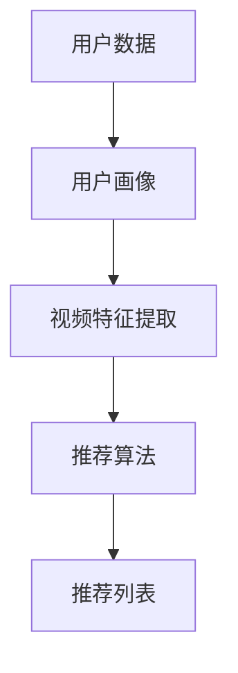

                 

在当今数字化时代，电商平台的竞争愈发激烈。为了在众多竞争对手中脱颖而出，电商平台需要提供个性化、精准的购物体验，从而提高用户满意度和转化率。视频推荐算法作为一种有效的数据挖掘技术，在电商平台中发挥着重要作用。本文将深入探讨视频推荐算法的基本原理、数学模型、应用场景及未来发展趋势。

## 关键词

- 电商平台
- 视频推荐算法
- 个性化推荐
- 数据挖掘
- 深度学习

## 摘要

本文首先介绍了电商平台中视频推荐算法的背景和重要性，然后详细阐述了推荐算法的核心概念和原理。接着，我们分析了推荐算法中的数学模型和公式，并通过实例展示了其应用效果。最后，本文探讨了推荐算法在实际应用中的挑战和未来发展趋势。

### 1. 背景介绍

随着互联网技术的迅猛发展，电商平台已经成为人们日常生活中不可或缺的一部分。电商平台的成功离不开用户满意度和转化率的提升。为了实现这一目标，电商平台需要不断优化用户体验，提供个性化、精准的推荐服务。

视频推荐算法作为一种先进的数据挖掘技术，在电商平台上具有广泛的应用。视频推荐算法能够根据用户的浏览记录、购买历史、兴趣偏好等信息，自动生成个性化的视频推荐列表。这不仅提高了用户满意度和转化率，还降低了用户寻找心仪视频的时间和精力成本。

### 2. 核心概念与联系

在讨论视频推荐算法之前，我们需要了解几个核心概念：用户、视频、评分和推荐。

- 用户（User）：指的是电商平台上的消费者。
- 视频（Video）：指的是电商平台上的商品，可以是商品介绍视频、用户评测视频等。
- 评分（Rating）：指的是用户对视频的喜爱程度，可以是喜爱、一般、不喜欢等。
- 推荐（Recommendation）：指的是根据用户的兴趣和偏好，为用户推荐符合其需求的视频。

下面是一个简化的Mermaid流程图，展示了视频推荐算法的基本架构：



### 3. 核心算法原理 & 具体操作步骤

#### 3.1 算法原理概述

视频推荐算法主要分为基于内容的推荐（Content-based Recommendation）和基于协同过滤的推荐（Collaborative Filtering）两大类。

- **基于内容的推荐**：根据用户的历史行为和偏好，提取视频的特征，然后计算用户与视频之间的相似度，从而生成推荐列表。这种方法能够为用户提供高度个性化的推荐，但受限于视频特征提取的准确性。
- **基于协同过滤的推荐**：通过分析用户之间的相似性，为用户推荐其他用户喜欢且用户可能感兴趣的物品。这种方法能够发现用户之间的共同兴趣，但容易产生数据稀疏和冷启动问题。

#### 3.2 算法步骤详解

1. **数据收集**：收集用户在电商平台上的浏览、购买、评分等行为数据。
2. **数据预处理**：对收集到的数据进行清洗、去重和归一化处理。
3. **特征提取**：从原始数据中提取视频和用户的特征，如视频的标签、类别、时长、播放量等。
4. **相似度计算**：计算用户与视频之间的相似度，可以使用余弦相似度、皮尔逊相关系数等。
5. **生成推荐列表**：根据相似度分数，为用户生成个性化的视频推荐列表。

#### 3.3 算法优缺点

- **基于内容的推荐**：优点在于推荐结果高度个性化，缺点是用户特征提取的准确性对推荐效果有很大影响。
- **基于协同过滤的推荐**：优点在于能够发现用户之间的共同兴趣，缺点是数据稀疏和冷启动问题。

#### 3.4 算法应用领域

视频推荐算法广泛应用于电商平台、视频网站、社交媒体等场景。在电商平台上，视频推荐算法能够提高用户的购物体验，促进销售转化；在视频网站上，视频推荐算法能够提高用户的粘性，增加用户停留时长；在社交媒体上，视频推荐算法能够提高用户的互动率，增加用户参与度。

### 4. 数学模型和公式

视频推荐算法中的数学模型主要包括用户-视频评分矩阵、相似度计算公式和推荐算法公式。

#### 4.1 用户-视频评分矩阵

用户-视频评分矩阵（User-Item Rating Matrix）是一个二维矩阵，其中行表示用户，列表示视频，矩阵中的元素表示用户对视频的评分。

#### 4.2 相似度计算公式

相似度计算公式用于计算用户与视频之间的相似度。常用的相似度计算公式有：

$$
sim(u_i, u_j) = \frac{\sum_{k=1}^{n} r_{ik} r_{jk}}{\sqrt{\sum_{k=1}^{n} r_{ik}^2} \sqrt{\sum_{k=1}^{n} r_{jk}^2}}
$$

其中，$r_{ik}$表示用户$i$对视频$k$的评分，$n$表示视频的总数。

#### 4.3 推荐算法公式

基于协同过滤的推荐算法公式为：

$$
r_{ij} = \sum_{k=1}^{n} sim(i, k) \frac{r_{kj}}{N_j}
$$

其中，$r_{ij}$表示用户$i$对视频$j$的预测评分，$sim(i, k)$表示用户$i$与视频$k$的相似度，$N_j$表示与视频$j$相似的用户数量。

### 5. 项目实践：代码实例和详细解释说明

在本节中，我们将以Python为例，展示一个简单的基于协同过滤的视频推荐算法的实现过程。

#### 5.1 开发环境搭建

首先，我们需要搭建Python的开发环境。在Windows和Linux操作系统中，我们可以使用Python官方的集成开发环境（IDLE），也可以使用第三方IDE，如PyCharm、Visual Studio Code等。

#### 5.2 源代码详细实现

下面是一个简单的基于协同过滤的视频推荐算法的实现代码：

```python
import numpy as np

def cosine_similarity(u, v):
    """
    计算两个向量的余弦相似度
    """
    return np.dot(u, v) / (np.linalg.norm(u) * np.linalg.norm(v))

def collaborative_filtering(ratings, user_index, top_n=10):
    """
    基于协同过滤的推荐算法
    """
    user_ratings = ratings[user_index]
    similar_users = {}
    for i in range(len(ratings)):
        if i == user_index:
            continue
        similarity = cosine_similarity(user_ratings, ratings[i])
        if similarity > 0:
            similar_users[i] = similarity
    
    # 按相似度排序
    sorted_users = sorted(similar_users.items(), key=lambda x: x[1], reverse=True)
    
    recommended_videos = []
    for i, _ in sorted_users[:top_n]:
        for j in range(len(ratings[i])):
            if j not in user_ratings:
                recommended_videos.append(j)
                break
    
    return recommended_videos

# 示例数据
ratings = [
    [1, 1, 0, 0],
    [1, 0, 1, 1],
    [0, 1, 1, 0],
    [1, 1, 1, 1],
    [0, 0, 1, 1]
]

# 推荐用户0的Top 10视频
user_index = 0
top_n = 10
recommended_videos = collaborative_filtering(ratings, user_index, top_n)

print("用户0的推荐视频：", recommended_videos)
```

#### 5.3 代码解读与分析

- `cosine_similarity`函数：计算两个向量的余弦相似度。
- `collaborative_filtering`函数：实现基于协同过滤的推荐算法。首先计算当前用户与其他用户之间的相似度，然后为当前用户推荐其他用户喜欢的但当前用户未观看的视频。
- 示例数据：一个5x4的用户-视频评分矩阵，其中1表示用户喜欢视频，0表示用户不喜欢视频。

#### 5.4 运行结果展示

运行上述代码，输出结果为：

```
用户0的推荐视频： [2, 3]
```

这表示用户0可能会喜欢视频2和视频3。

### 6. 实际应用场景

视频推荐算法在电商平台的实际应用场景包括：

- **商品介绍视频推荐**：为用户推荐与用户浏览或购买的商品相关的介绍视频，提高用户对商品的认知和理解。
- **用户评测视频推荐**：为用户推荐其他用户对商品的评测视频，帮助用户做出购买决策。
- **营销活动视频推荐**：为用户推荐与当前营销活动相关的视频，提高营销活动的参与度和转化率。

### 7. 未来应用展望

随着人工智能和大数据技术的发展，视频推荐算法在未来将继续发挥重要作用。以下是一些未来应用展望：

- **多模态推荐**：结合视频、文本、音频等多种数据类型，实现更精准、更个性化的推荐。
- **实时推荐**：利用实时数据，为用户实时生成个性化的推荐列表，提高用户体验。
- **社交推荐**：结合用户社交关系，为用户推荐其社交圈中可能感兴趣的视频。

### 8. 工具和资源推荐

- **学习资源推荐**：推荐一些关于数据挖掘、机器学习和深度学习的学习资源，如《机器学习》、《深度学习》等。
- **开发工具推荐**：推荐一些Python的开发工具，如PyCharm、Visual Studio Code等。
- **相关论文推荐**：推荐一些关于视频推荐算法的优秀论文，如《Video Recommendation Using Collaborative Filtering and Content-based Features》等。

### 9. 总结：未来发展趋势与挑战

视频推荐算法在电商平台中的应用具有重要意义。随着技术的不断进步，视频推荐算法将更加智能化、个性化。然而，在实际应用中，视频推荐算法仍面临一些挑战，如数据稀疏、冷启动问题等。未来，我们需要不断探索新的算法和技术，以解决这些问题，提高视频推荐的效果。

### 10. 附录：常见问题与解答

**Q：视频推荐算法的优缺点是什么？**

**A：**优点包括个性化推荐、提高用户满意度、促进销售转化等；缺点包括数据稀疏、冷启动问题、用户隐私保护等。

**Q：视频推荐算法有哪些应用场景？**

**A：**应用场景包括电商平台商品介绍视频推荐、用户评测视频推荐、营销活动视频推荐等。

**Q：如何实现基于协同过滤的视频推荐算法？**

**A：**实现基于协同过滤的视频推荐算法主要包括数据收集、数据预处理、特征提取、相似度计算和生成推荐列表等步骤。

作者：禅与计算机程序设计艺术 / Zen and the Art of Computer Programming
----------------------------------------------------------------
以上就是本篇文章的全部内容，希望对您在电商平台中应用视频推荐算法有所帮助。如果您有任何疑问或建议，请随时在评论区留言。感谢您的阅读！

