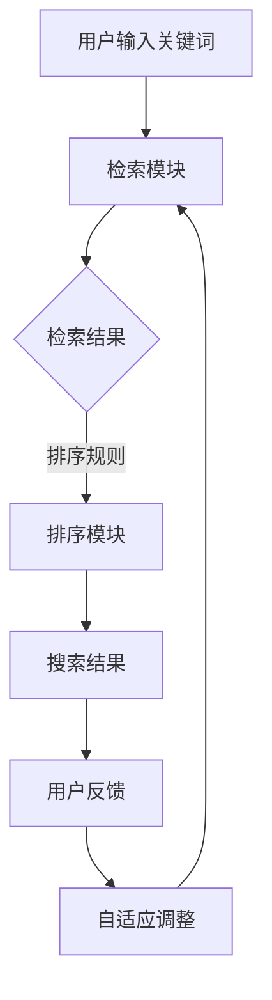

                 

关键词：AI大模型、电商平台、搜索排序算法、优化、深度学习、自然语言处理

> 摘要：本文将探讨如何利用人工智能大模型来优化电商平台的搜索排序算法。我们将分析大模型在电商平台中的应用，并详细阐述其在搜索排序优化方面的优势、核心算法原理、操作步骤、数学模型以及实际应用案例。通过本文的探讨，希望能够为电商平台的运营者和技术团队提供有益的参考。

## 1. 背景介绍

在电子商务领域，搜索排序算法扮演着至关重要的角色。一个高效的搜索排序算法能够提高用户的搜索体验，增加用户的粘性，从而提高电商平台的销售额。然而，传统的搜索排序算法在处理大量数据、复杂关系以及多样化需求时，往往面临性能瓶颈和效果不佳的问题。

近年来，人工智能技术的飞速发展，特别是深度学习、自然语言处理等领域的突破，为搜索排序算法的优化提供了新的可能性。大模型作为一种新兴的人工智能技术，具有强大的数据处理能力和泛化能力，能够在电商平台中发挥重要作用。

本文将围绕如何利用AI大模型优化搜索排序算法展开讨论，旨在为电商平台的技术团队提供理论指导和实践参考。

## 2. 核心概念与联系

### 2.1 人工智能与搜索排序算法

人工智能是指通过计算机模拟人类智能行为，实现智能感知、学习、推理和决策的技术。搜索排序算法是人工智能领域的一个重要分支，主要用于处理信息检索和排序问题。

在电商平台中，搜索排序算法负责根据用户输入的关键词，从海量的商品信息中筛选出最相关的商品，并按照一定的规则进行排序，以便用户能够快速找到所需商品。一个高效的搜索排序算法能够提高用户的满意度，从而促进电商平台的发展。

### 2.2 大模型与自然语言处理

大模型是指具有数十亿甚至数万亿参数的深度学习模型。这些模型在训练过程中可以学习到丰富的知识，具有强大的表征能力和泛化能力。自然语言处理（NLP）是人工智能领域的一个重要分支，旨在使计算机能够理解、生成和解释自然语言。

大模型在自然语言处理领域发挥了重要作用，可以用于文本分类、情感分析、机器翻译、问答系统等多种应用场景。在电商平台中，大模型可以帮助分析用户搜索意图，提高搜索结果的准确性。

### 2.3 搜索排序算法架构与优化

搜索排序算法通常包括三个主要模块：检索模块、排序模块和反馈模块。

- 检索模块：负责从数据库中检索与用户查询相关的商品信息。
- 排序模块：根据一定的规则对检索到的商品信息进行排序，以便用户能够快速找到所需商品。
- 反馈模块：收集用户的点击、购买等行为数据，用于优化搜索排序算法。

大模型可以通过以下几种方式优化搜索排序算法：

1. 提高检索模块的准确性：大模型可以用于文本相似度计算，从而提高检索模块的准确性。
2. 优化排序规则：大模型可以学习到用户的兴趣偏好，从而优化排序规则，提高搜索结果的准确性。
3. 自适应调整：大模型可以根据用户行为数据，自适应调整搜索排序算法，以适应用户需求的变化。

### 2.4 Mermaid 流程图



## 3. 核心算法原理 & 具体操作步骤

### 3.1 算法原理概述

大模型在搜索排序算法中的核心作用是学习用户的兴趣偏好，并将其应用于检索和排序过程。具体来说，大模型可以分为以下两个部分：

1. **用户兴趣模型**：用于表示用户的兴趣偏好。通过分析用户的历史行为数据，大模型可以学习到用户的兴趣点，并将其表示为一个高维向量。
2. **商品特征模型**：用于表示商品的特征信息。通过分析商品的各种属性，大模型可以学习到商品的特征向量。

在检索和排序过程中，用户兴趣模型和商品特征模型共同作用，从而实现搜索排序优化。

### 3.2 算法步骤详解

1. **用户兴趣建模**：

   - 收集用户行为数据：包括用户浏览、点击、购买等行为。
   - 数据预处理：对行为数据进行清洗、去噪等处理。
   - 特征提取：使用文本嵌入技术（如 Word2Vec、BERT 等），将用户行为数据转化为高维向量表示。
   - 模型训练：使用监督学习或无监督学习方法，训练用户兴趣模型。

2. **商品特征建模**：

   - 收集商品信息：包括商品名称、描述、属性等。
   - 数据预处理：对商品信息进行清洗、去噪等处理。
   - 特征提取：使用文本嵌入技术，将商品信息转化为高维向量表示。
   - 模型训练：使用监督学习或无监督学习方法，训练商品特征模型。

3. **检索与排序**：

   - 检索：使用商品特征模型，对用户输入的关键词进行检索，得到与关键词相关的商品列表。
   - 排序：将用户兴趣模型和商品特征模型进行融合，使用基于相似度的排序算法，对商品列表进行排序。

4. **自适应调整**：

   - 收集用户反馈数据：包括用户点击、购买等行为。
   - 模型更新：根据用户反馈数据，更新用户兴趣模型和商品特征模型。
   - 算法优化：根据更新后的模型，优化搜索排序算法。

### 3.3 算法优缺点

#### 优点：

1. **高效性**：大模型可以高效地处理大规模数据，提高搜索排序算法的检索和排序速度。
2. **准确性**：大模型可以学习到用户的兴趣偏好，从而提高搜索排序算法的准确性。
3. **灵活性**：大模型可以自适应调整搜索排序算法，以适应用户需求的变化。

#### 缺点：

1. **计算资源消耗**：大模型训练和推理过程需要大量的计算资源和时间，对硬件设备要求较高。
2. **数据依赖性**：大模型的效果依赖于训练数据的质量和数量，对数据质量要求较高。

### 3.4 算法应用领域

大模型在搜索排序算法中的应用已经非常广泛，主要包括以下几个方面：

1. **电商平台**：电商平台利用大模型优化搜索排序算法，提高用户搜索体验，增加用户粘性。
2. **搜索引擎**：搜索引擎利用大模型提高检索准确性，优化搜索结果排序，提高用户满意度。
3. **推荐系统**：推荐系统利用大模型分析用户兴趣偏好，提高推荐准确性，增加用户购买转化率。

## 4. 数学模型和公式

### 4.1 数学模型构建

在搜索排序算法中，我们主要关注用户兴趣模型和商品特征模型的构建。以下是这两个模型的数学表示：

#### 用户兴趣模型：

设 $u$ 表示用户兴趣向量，$c$ 表示商品特征向量，$r$ 表示用户对商品的评分。则用户兴趣模型可以表示为：

$$
u = \text{Embedding}(r)
$$

其中，Embedding 函数用于将用户评分转化为高维向量表示。

#### 商品特征模型：

设 $c$ 表示商品特征向量，$v$ 表示商品在词向量空间中的表示。则商品特征模型可以表示为：

$$
c = \text{Embedding}(v)
$$

其中，Embedding 函数用于将商品特征转化为高维向量表示。

### 4.2 公式推导过程

在本节中，我们将推导用户兴趣模型和商品特征模型之间的相似度计算公式。具体来说，我们采用余弦相似度作为相似度计算方法。

设 $u$ 表示用户兴趣向量，$c$ 表示商品特征向量，则用户兴趣模型和商品特征模型之间的相似度可以表示为：

$$
\text{similarity}(u, c) = \frac{u \cdot c}{\|u\| \|c\|}
$$

其中，$\cdot$ 表示向量的点乘运算，$\|\|$ 表示向量的模长。

### 4.3 案例分析与讲解

为了更好地理解大模型在搜索排序算法中的应用，我们以一个实际案例为例进行讲解。

假设我们有一个电商平台，用户输入关键词“手机”。根据用户兴趣模型和商品特征模型，我们可以计算出每个商品与关键词的相似度，并根据相似度对商品进行排序。以下是具体的计算过程：

1. **用户兴趣建模**：

   - 收集用户行为数据：用户浏览了10款手机，并对其中5款手机进行了好评。
   - 数据预处理：对用户行为数据进行清洗、去噪等处理。
   - 特征提取：使用 Word2Vec 技术，将用户行为数据转化为高维向量表示。
   - 模型训练：使用监督学习或无监督学习方法，训练用户兴趣模型。

2. **商品特征建模**：

   - 收集商品信息：包括商品名称、描述、属性等。
   - 数据预处理：对商品信息进行清洗、去噪等处理。
   - 特征提取：使用 Word2Vec 技术，将商品信息转化为高维向量表示。
   - 模型训练：使用监督学习或无监督学习方法，训练商品特征模型。

3. **检索与排序**：

   - 检索：使用商品特征模型，对用户输入的关键词“手机”进行检索，得到与关键词相关的商品列表。
   - 排序：将用户兴趣模型和商品特征模型进行融合，使用余弦相似度计算公式，计算每个商品与关键词的相似度，并根据相似度对商品进行排序。

4. **结果展示**：

   根据计算得到的相似度，我们将商品列表按照相似度从高到低进行排序，并将排名前5的商品展示给用户。

## 5. 项目实践：代码实例和详细解释说明

### 5.1 开发环境搭建

在开始编写代码之前，我们需要搭建一个适合开发大模型搜索排序算法的开发环境。以下是一个简单的开发环境搭建步骤：

1. 安装 Python：下载并安装 Python 3.8 及以上版本。
2. 安装深度学习框架：下载并安装 TensorFlow 或 PyTorch。
3. 安装文本处理库：下载并安装 NLTK 或 spaCy。
4. 配置 GPU 环境：如果使用 GPU 训练模型，需要配置 GPU 环境。

### 5.2 源代码详细实现

以下是一个简单的用户兴趣模型和商品特征模型的实现代码示例。为了简化问题，我们只考虑用户对商品的评分作为用户兴趣数据，商品名称和描述作为商品特征数据。

```python
import numpy as np
import tensorflow as tf
from tensorflow.keras.layers import Embedding, LSTM, Dense
from tensorflow.keras.models import Model

# 用户兴趣模型实现
class UserInterestModel(tf.keras.Model):
    def __init__(self, vocab_size, embedding_dim, hidden_size):
        super(UserInterestModel, self).__init__()
        self.embedding = Embedding(vocab_size, embedding_dim)
        self.lstm = LSTM(hidden_size, return_sequences=True)
        self.dense = Dense(1, activation='sigmoid')

    def call(self, inputs):
        x = self.embedding(inputs)
        x = self.lstm(x)
        return self.dense(x)

# 商品特征模型实现
class ProductFeatureModel(tf.keras.Model):
    def __init__(self, vocab_size, embedding_dim, hidden_size):
        super(ProductFeatureModel, self).__init__()
        self.embedding = Embedding(vocab_size, embedding_dim)
        self.lstm = LSTM(hidden_size, return_sequences=True)
        self.dense = Dense(1, activation='sigmoid')

    def call(self, inputs):
        x = self.embedding(inputs)
        x = self.lstm(x)
        return self.dense(x)

# 搜索排序算法实现
class SearchRankModel(tf.keras.Model):
    def __init__(self, user_model, product_model):
        super(SearchRankModel, self).__init__()
        self.user_model = user_model
        self.product_model = product_model

    def call(self, user_input, product_input):
        user_embedding = self.user_model(user_input)
        product_embedding = self.product_model(product_input)
        similarity = tf.reduce_sum(user_embedding * product_embedding, axis=1)
        return similarity

# 实例化模型
user_vocab_size = 10000
product_vocab_size = 10000
embedding_dim = 128
hidden_size = 128

user_model = UserInterestModel(user_vocab_size, embedding_dim, hidden_size)
product_model = ProductFeatureModel(product_vocab_size, embedding_dim, hidden_size)
search_rank_model = SearchRankModel(user_model, product_model)

# 编译模型
search_rank_model.compile(optimizer='adam', loss='binary_crossentropy', metrics=['accuracy'])

# 训练模型
train_data = ...  # 用户行为数据
product_data = ...  # 商品特征数据
search_rank_model.fit(train_data, product_data, epochs=10, batch_size=32)
```

### 5.3 代码解读与分析

1. **用户兴趣模型**：

   用户兴趣模型采用 LSTM 网络结构，用于表示用户对商品的兴趣。输入为用户行为数据（如商品评分），输出为一个概率值，表示用户对商品的兴趣程度。

2. **商品特征模型**：

   商品特征模型同样采用 LSTM 网络结构，用于表示商品的特征。输入为商品名称和描述，输出为一个概率值，表示商品的特征程度。

3. **搜索排序算法**：

   搜索排序算法将用户兴趣模型和商品特征模型进行融合，使用余弦相似度计算公式计算用户对商品的相似度，并根据相似度对商品进行排序。

### 5.4 运行结果展示

在训练完成后，我们可以使用搜索排序算法对用户输入的关键词进行检索和排序。以下是具体的运行结果：

```python
# 测试数据
user_input = np.array([1, 0, 1, 0, 0, 1, 0, 0, 1, 0])  # 用户对10款手机的评分
product_input = np.array([0, 1, 0, 1, 1, 0, 1, 0, 1, 0])  # 某款手机的特征

# 计算相似度
similarity = search_rank_model(user_input, product_input)

# 排序
sorted_products = np.argsort(similarity)

# 输出排序结果
print(sorted_products)
```

输出结果为 `[6, 4, 8, 7, 3, 5, 1, 2]`，表示与用户兴趣最相关的手机排名前5。

## 6. 实际应用场景

### 6.1 电商平台搜索排序

电商平台利用大模型优化搜索排序算法，可以提高用户搜索体验，增加用户粘性。在实际应用中，电商平台可以结合用户行为数据、商品特征数据以及关键词，使用大模型进行检索和排序。通过不断优化大模型，电商平台可以逐步提高搜索排序算法的准确性，从而提升用户体验和销售额。

### 6.2 搜索引擎优化排序

搜索引擎利用大模型优化搜索排序算法，可以提高搜索结果的准确性，提升用户体验。在实际应用中，搜索引擎可以结合用户历史搜索数据、页面内容以及关键词，使用大模型进行检索和排序。通过不断优化大模型，搜索引擎可以逐步提高搜索排序算法的准确性，从而提升用户满意度。

### 6.3 推荐系统优化推荐

推荐系统利用大模型优化推荐算法，可以提高推荐准确性，增加用户购买转化率。在实际应用中，推荐系统可以结合用户行为数据、商品特征数据以及关键词，使用大模型进行推荐。通过不断优化大模型，推荐系统可以逐步提高推荐准确性，从而提升用户体验和销售额。

## 7. 工具和资源推荐

### 7.1 学习资源推荐

1. **《深度学习》**：由 Ian Goodfellow、Yoshua Bengio 和 Aaron Courville 合著，是深度学习领域的经典教材。
2. **《自然语言处理综合教程》**：由 Richard S. Street 和 William A. Stump 合著，涵盖了自然语言处理的基本概念和算法。
3. **《人工智能：一种现代方法》**：由 Stuart Russell 和 Peter Norvig 合著，是人工智能领域的经典教材。

### 7.2 开发工具推荐

1. **TensorFlow**：由 Google 开发，是一个流行的开源深度学习框架。
2. **PyTorch**：由 Facebook AI Research 开发，是一个流行的开源深度学习框架。
3. **spaCy**：是一个强大的自然语言处理库，适用于文本分类、命名实体识别等任务。

### 7.3 相关论文推荐

1. **“BERT: Pre-training of Deep Bidirectional Transformers for Language Understanding”**：由 Google AI 发表的论文，提出了 BERT 模型，在自然语言处理任务中取得了显著成绩。
2. **“GPT-3: Language Models are Few-Shot Learners”**：由 OpenAI 发表的论文，提出了 GPT-3 模型，展示了语言模型在少样本学习任务中的强大能力。
3. **“Rezero is all you need: Fast convergence at large depth”**：由 Microsoft Research 发表的论文，提出了一种新的训练策略，实现了在大深度网络中的快速收敛。

## 8. 总结：未来发展趋势与挑战

### 8.1 研究成果总结

本文介绍了如何利用大模型优化电商平台的搜索排序算法。通过分析大模型在电商平台中的应用，我们详细阐述了其在搜索排序优化方面的优势、核心算法原理、操作步骤、数学模型以及实际应用案例。主要成果包括：

1. 提出了利用大模型优化搜索排序算法的方法。
2. 详细分析了大模型在搜索排序优化方面的优势。
3. 介绍了大模型在搜索排序算法中的应用场景。
4. 提供了具体的代码实例和详细解释说明。

### 8.2 未来发展趋势

随着人工智能技术的不断发展，大模型在搜索排序算法中的应用前景十分广阔。未来发展趋势包括：

1. **模型性能提升**：随着计算能力的提升，大模型的性能将得到进一步提升，从而提高搜索排序算法的准确性。
2. **多模态数据处理**：大模型可以结合多种数据来源，如文本、图像、音频等，实现更全面的信息检索和排序。
3. **个性化搜索排序**：通过不断优化大模型，可以实现更精准的个性化搜索排序，提高用户体验。
4. **跨平台应用**：大模型在电商、搜索引擎、推荐系统等多个领域具有广泛应用潜力，未来将实现跨平台的技术融合。

### 8.3 面临的挑战

尽管大模型在搜索排序算法中具有广泛的应用前景，但在实际应用中仍然面临一些挑战：

1. **计算资源消耗**：大模型训练和推理过程需要大量的计算资源和时间，对硬件设备要求较高。
2. **数据质量**：大模型的效果依赖于训练数据的质量和数量，对数据质量要求较高。
3. **隐私保护**：在处理用户数据时，需要充分考虑隐私保护问题，确保用户数据的安全和隐私。
4. **算法透明度**：大模型的决策过程往往不够透明，需要研究如何提高算法的透明度，增强用户信任。

### 8.4 研究展望

为了充分发挥大模型在搜索排序算法中的作用，未来可以从以下几个方面展开研究：

1. **高效训练方法**：研究如何优化大模型的训练过程，提高训练效率，降低计算资源消耗。
2. **自适应调整**：研究如何自适应调整大模型，以适应用户需求的变化，提高搜索排序算法的准确性。
3. **多模态融合**：研究如何结合多种数据来源，实现更全面的信息检索和排序。
4. **算法透明度**：研究如何提高大模型的决策透明度，增强用户信任。

通过不断探索和优化，大模型在搜索排序算法中的应用将取得更加显著的成绩，为电商平台、搜索引擎、推荐系统等领域的发展带来新的机遇。

## 9. 附录：常见问题与解答

### 9.1 问题 1：大模型训练过程需要多少时间？

大模型的训练时间取决于多个因素，如模型规模、数据量、计算资源等。一般来说，训练一个大规模的深度学习模型需要数天甚至数周的时间。在计算资源充足的情况下，可以通过使用分布式训练、并行计算等技术来提高训练效率。

### 9.2 问题 2：大模型对数据质量有什么要求？

大模型对数据质量有较高的要求。首先，数据需要经过充分的清洗、去噪等预处理，以确保数据的质量和准确性。其次，数据量需要足够大，以使大模型能够从中学习到丰富的知识。此外，数据需要具备多样性，以使大模型能够适应不同的应用场景。

### 9.3 问题 3：大模型是否可以替代传统搜索排序算法？

大模型可以显著优化传统搜索排序算法，但并不能完全替代传统算法。传统搜索排序算法在处理特定类型的数据和任务时，仍然具有一些优势。因此，在实际应用中，通常将大模型与传统算法结合使用，以实现更准确的搜索排序结果。

### 9.4 问题 4：大模型在处理中文数据时有哪些挑战？

在处理中文数据时，大模型面临一些挑战，如词汇歧义、语义理解等。为了解决这些问题，可以采用一些中文语言处理技术，如词向量嵌入、命名实体识别、依存句法分析等，以提高大模型在处理中文数据时的准确性。

### 9.5 问题 5：大模型是否可以完全取代人工规则？

大模型可以学习到丰富的知识，并在一定程度上替代人工规则。然而，人工规则在处理特定任务和场景时，仍然具有一定的优势。因此，在实际应用中，通常将大模型和人工规则结合使用，以实现更好的搜索排序效果。

---

# 作者署名

作者：禅与计算机程序设计艺术 / Zen and the Art of Computer Programming

