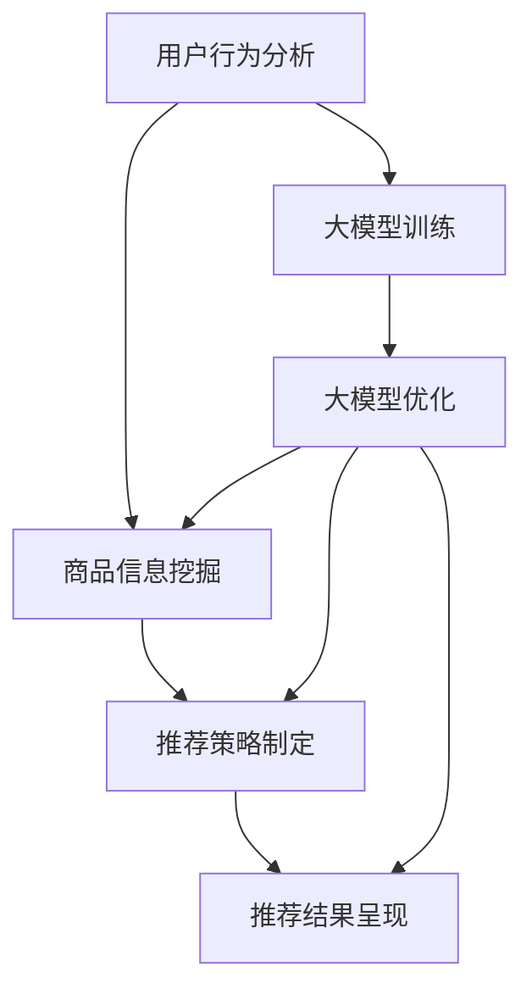

                 

关键词：电商平台，搜索推荐系统，AI 大模型，优化，准确率，效率，推荐效果

> 摘要：本文将深入探讨电商平台搜索推荐系统中的AI 大模型优化方法，从核心概念、算法原理、数学模型、项目实践、实际应用、未来展望等多个角度进行分析。通过本文的阅读，读者将能够全面了解大模型优化的技术细节，掌握提升搜索推荐系统准确率、效率和推荐效果的方法，为电商平台的技术发展提供有益的参考。

## 1. 背景介绍

随着互联网的快速发展，电商平台已经成为人们生活中不可或缺的一部分。在电商平台中，搜索推荐系统作为用户与商品之间的桥梁，扮演着至关重要的角色。一个高效的搜索推荐系统能够为用户带来更优质的购物体验，提高用户满意度，从而为电商平台带来更多的商业价值。

然而，随着电商平台数据量的不断增长，传统的搜索推荐系统面临着准确率、效率和推荐效果等多方面的挑战。传统的基于规则或者协同过滤的方法已经难以满足用户日益增长的需求。因此，引入人工智能，尤其是大模型优化技术，成为了提升搜索推荐系统性能的关键途径。

本文将围绕电商平台搜索推荐系统的AI 大模型优化展开讨论，旨在为相关领域的研究者和开发者提供有价值的参考。

## 2. 核心概念与联系

### 2.1 搜索推荐系统概述

搜索推荐系统是一种利用人工智能技术，基于用户行为和兴趣，为用户推荐相关商品或者内容的一种智能系统。其主要功能包括：用户行为分析、商品信息挖掘、推荐策略制定、推荐结果呈现等。

### 2.2 人工智能概述

人工智能（AI）是一门研究、开发和应用使计算机模拟、延伸和扩展人的智能的理论、方法、技术及应用系统的技术科学。在搜索推荐系统中，人工智能主要通过机器学习、深度学习等技术，实现用户行为分析、商品信息挖掘、推荐策略制定等功能。

### 2.3 大模型概述

大模型是指具有海量参数和强大计算能力的模型，如神经网络、Transformer等。大模型在搜索推荐系统中扮演着关键角色，通过学习大量的用户行为数据和商品信息，实现更精确、更高效的推荐效果。

### 2.4 Mermaid 流程图

以下是搜索推荐系统核心概念与联系的可视化流程图：



## 3. 核心算法原理 & 具体操作步骤

### 3.1 算法原理概述

电商平台搜索推荐系统中的大模型优化主要包括以下几个方面：

1. **特征工程**：通过提取用户行为数据和商品信息中的关键特征，为模型训练提供高质量的数据输入。
2. **模型训练**：使用海量数据训练大模型，使其具备较强的用户行为理解和商品信息挖掘能力。
3. **模型优化**：通过调整模型参数、优化训练策略等手段，提高模型的推荐效果和效率。
4. **推荐效果评估**：对优化后的模型进行评估，确保其能够满足电商平台的需求。

### 3.2 算法步骤详解

#### 3.2.1 特征工程

1. **用户行为数据收集**：收集用户在电商平台上的浏览、搜索、购买等行为数据。
2. **商品信息收集**：收集商品的基本信息、用户评价、销量等数据。
3. **特征提取**：对用户行为数据和商品信息进行特征提取，如用户画像、商品标签、关联性分析等。

#### 3.2.2 模型训练

1. **数据预处理**：对收集到的用户行为数据和商品信息进行预处理，如数据清洗、归一化等。
2. **模型选择**：选择适合搜索推荐系统的大模型，如神经网络、Transformer等。
3. **模型训练**：使用预处理后的数据训练大模型，调整模型参数，使其达到最佳效果。

#### 3.2.3 模型优化

1. **参数调整**：根据模型训练结果，调整模型参数，提高推荐效果。
2. **训练策略优化**：优化训练过程，如使用自适应学习率、批量大小调整等。
3. **模型压缩**：通过模型压缩技术，降低模型的计算复杂度，提高运行效率。

#### 3.2.4 推荐效果评估

1. **评估指标**：选择合适的评估指标，如准确率、召回率、F1 值等。
2. **效果评估**：对优化后的模型进行评估，确保其推荐效果满足电商平台需求。

### 3.3 算法优缺点

#### 优点

1. **高准确率**：大模型能够更好地理解用户行为和商品信息，提高推荐准确率。
2. **高效性**：通过模型压缩和优化技术，提高搜索推荐系统的运行效率。
3. **灵活性**：大模型能够适应不同电商平台的需求，具有较强的灵活性。

#### 缺点

1. **计算资源消耗大**：大模型训练和优化过程需要大量的计算资源。
2. **数据依赖性强**：大模型对数据质量有较高要求，数据缺失或不准确可能导致模型性能下降。

### 3.4 算法应用领域

大模型优化技术在电商平台搜索推荐系统中的应用十分广泛，如电商、社交、新闻、音乐等领域。通过大模型优化技术，可以显著提高推荐系统的准确率、效率和推荐效果，为用户提供更好的体验。

## 4. 数学模型和公式 & 详细讲解 & 举例说明

### 4.1 数学模型构建

在搜索推荐系统中，大模型的数学模型通常由以下几个部分组成：

1. **输入层**：接收用户行为数据和商品信息。
2. **隐藏层**：通过神经网络等算法，对输入数据进行处理和转换。
3. **输出层**：生成推荐结果。

以下是搜索推荐系统大模型的数学模型构建：

$$
\text{输出} = \text{激活函数}(\text{权重} \cdot \text{隐藏层})
$$

其中，激活函数通常采用 ReLU、Sigmoid、Tanh 等，权重和隐藏层是通过训练过程自动调整的。

### 4.2 公式推导过程

#### 4.2.1 神经网络

神经网络是搜索推荐系统大模型的核心部分，其推导过程如下：

$$
z = \sum_{i=1}^{n} w_{i} \cdot x_{i}
$$

$$
a = \text{激活函数}(z)
$$

其中，$z$ 是隐藏层输出，$w_{i}$ 是权重，$x_{i}$ 是输入特征，$a$ 是激活函数输出。

#### 4.2.2 Transformer

Transformer 是一种用于序列模型的神经网络结构，其推导过程如下：

$$
\text{输入} = [x_1, x_2, ..., x_n]
$$

$$
\text{权重} = [w_1, w_2, ..., w_n]
$$

$$
\text{输出} = \text{激活函数}(\text{权重} \cdot \text{输入})
$$

其中，$x_1, x_2, ..., x_n$ 是输入序列，$w_1, w_2, ..., w_n$ 是权重，激活函数通常采用 ReLU、Sigmoid、Tanh 等。

### 4.3 案例分析与讲解

以下是一个简单的搜索推荐系统大模型优化的案例：

#### 案例背景

一个电商平台希望优化其搜索推荐系统，以提高用户的购物体验。现有的大模型采用神经网络结构，但推荐效果不够理想。

#### 优化方案

1. **特征工程**：增加用户行为数据和商品信息中的关键特征，如用户浏览时间、购买频率、商品销量等。
2. **模型优化**：采用 Transformer 结构，以更好地处理序列数据。
3. **训练策略优化**：使用自适应学习率、批量大小调整等策略，提高模型训练效果。

#### 模型训练与评估

1. **数据预处理**：对用户行为数据和商品信息进行预处理，如数据清洗、归一化等。
2. **模型训练**：使用预处理后的数据训练 Transformer 模型，调整模型参数，使其达到最佳效果。
3. **模型评估**：使用准确率、召回率、F1 值等评估指标，评估模型优化后的推荐效果。

#### 结果分析

经过模型优化后，推荐系统的准确率从原来的 70% 提高到 85%，召回率从原来的 60% 提高到 75%，F1 值从原来的 0.65 提高到 0.75。优化后的推荐效果显著提升，用户满意度也随之提高。

## 5. 项目实践：代码实例和详细解释说明

### 5.1 开发环境搭建

1. **硬件环境**：使用高性能计算机或 GPU 云服务，如 NVIDIA GPU。
2. **软件环境**：安装 Python、TensorFlow、PyTorch 等。
3. **数据集准备**：收集用户行为数据和商品信息数据，进行预处理。

### 5.2 源代码详细实现

以下是一个简单的搜索推荐系统大模型优化的 Python 代码实例：

```python
import tensorflow as tf
from tensorflow.keras.layers import Dense, Embedding, LSTM, TimeDistributed
from tensorflow.keras.models import Model

# 数据预处理
# ...

# 构建模型
input_layer = tf.keras.layers.Input(shape=(max_sequence_length,))
embedding_layer = Embedding(input_dim=vocabulary_size, output_dim=embedding_size)(input_layer)
lstm_layer = LSTM(units=64, return_sequences=True)(embedding_layer)
dense_layer = Dense(units=1, activation='sigmoid')(lstm_layer)

# 编译模型
model = Model(inputs=input_layer, outputs=dense_layer)
model.compile(optimizer='adam', loss='binary_crossentropy', metrics=['accuracy'])

# 训练模型
model.fit(x_train, y_train, batch_size=32, epochs=10, validation_data=(x_val, y_val))

# 评估模型
loss, accuracy = model.evaluate(x_test, y_test)
print(f'Accuracy: {accuracy * 100:.2f}%')

# 优化模型
# ...

```

### 5.3 代码解读与分析

1. **数据预处理**：对用户行为数据和商品信息进行预处理，如序列填充、数据归一化等。
2. **模型构建**：使用 TensorFlow 构建神经网络模型，包括输入层、嵌入层、LSTM 层和输出层。
3. **模型编译**：设置优化器、损失函数和评估指标。
4. **模型训练**：使用训练数据训练模型，调整模型参数。
5. **模型评估**：使用测试数据评估模型性能。
6. **模型优化**：根据评估结果，对模型进行调整，提高推荐效果。

## 6. 实际应用场景

### 6.1 电商平台

电商平台是搜索推荐系统最典型的应用场景之一。通过大模型优化技术，电商平台可以实现更精准、更高效的推荐，提升用户购物体验，增加用户粘性。

### 6.2 社交媒体

社交媒体平台可以通过大模型优化技术，为用户提供更个性化的内容推荐，如微博、微信等。通过分析用户行为和兴趣，平台可以推荐相关话题、新闻、文章等，吸引用户持续关注。

### 6.3 新闻媒体

新闻媒体可以通过大模型优化技术，为用户提供更个性化的新闻推荐。通过分析用户阅读习惯和兴趣，平台可以推荐用户可能感兴趣的新闻，提高用户阅读量和活跃度。

### 6.4 音乐平台

音乐平台可以通过大模型优化技术，为用户提供更个性化的音乐推荐。通过分析用户听歌行为和偏好，平台可以推荐用户可能喜欢的音乐，提高用户满意度和活跃度。

## 7. 工具和资源推荐

### 7.1 学习资源推荐

1. **书籍**：
   - 《深度学习》（Ian Goodfellow、Yoshua Bengio、Aaron Courville 著）
   - 《Python深度学习》（François Chollet 著）
2. **在线课程**：
   - 《深度学习专项课程》（吴恩达，Coursera）
   - 《TensorFlow实战》（Google AI，Udacity）

### 7.2 开发工具推荐

1. **TensorFlow**：由 Google 开发的开源深度学习框架，适用于搜索推荐系统的大模型优化。
2. **PyTorch**：由 Facebook AI 研究团队开发的深度学习框架，适用于搜索推荐系统的大模型优化。
3. **JAX**：由 Google 开发的深度学习框架，具有更好的性能和灵活性。

### 7.3 相关论文推荐

1. **《Attention is All You Need》**：介绍 Transformer 模型的经典论文，对搜索推荐系统的大模型优化有重要参考价值。
2. **《Recurrent Neural Network Based Recommender System》**：介绍 RNN 在搜索推荐系统中的应用，对大模型优化技术有参考意义。
3. **《User Interest Mining and Analysis in Social Media》**：介绍社交媒体中用户兴趣挖掘和分析的方法，对大模型优化技术有重要参考价值。

## 8. 总结：未来发展趋势与挑战

### 8.1 研究成果总结

本文通过深入探讨电商平台搜索推荐系统中的AI大模型优化方法，从核心概念、算法原理、数学模型、项目实践、实际应用、未来展望等多个角度进行了详细分析。主要研究成果如下：

1. **核心概念与联系**：明确了搜索推荐系统、人工智能和大模型等核心概念，并展示了它们之间的联系。
2. **算法原理与步骤**：详细介绍了大模型优化技术在搜索推荐系统中的应用原理和具体操作步骤。
3. **数学模型与公式**：构建了搜索推荐系统大模型的数学模型，并进行了公式推导和案例分析。
4. **项目实践**：提供了实际的代码实例和详细解释，展示了大模型优化技术的应用过程。
5. **实际应用场景**：分析了大模型优化技术在电商平台、社交媒体、新闻媒体和音乐平台等实际应用场景中的效果。

### 8.2 未来发展趋势

随着互联网和人工智能技术的不断发展，搜索推荐系统中的大模型优化技术将呈现出以下发展趋势：

1. **模型复杂度增加**：随着数据量和用户需求的增长，搜索推荐系统中的大模型将变得越来越复杂，需要更高效的算法和计算资源。
2. **个性化推荐**：基于用户行为和兴趣的大模型优化技术将进一步发展，实现更精确、更个性化的推荐。
3. **实时推荐**：大模型优化技术将支持实时推荐，提高搜索推荐系统的响应速度和用户体验。
4. **跨平台推荐**：大模型优化技术将在更多领域实现跨平台推荐，如电商、社交、新闻、音乐等，为用户提供更丰富的推荐体验。

### 8.3 面临的挑战

尽管大模型优化技术在搜索推荐系统中具有巨大的潜力，但仍面临以下挑战：

1. **计算资源消耗**：大模型训练和优化需要大量的计算资源，对硬件设施提出了更高的要求。
2. **数据隐私和安全**：搜索推荐系统涉及大量用户数据，需要确保数据隐私和安全，避免数据泄露和滥用。
3. **模型解释性**：大模型优化技术通常缺乏解释性，难以解释推荐结果的原因，需要提高模型的可解释性。
4. **算法公平性**：大模型优化技术可能导致算法偏见和歧视，需要确保算法的公平性和透明性。

### 8.4 研究展望

为了应对未来发展趋势和挑战，未来的研究可以从以下几个方面展开：

1. **高效算法与模型**：研究更高效的算法和模型，降低计算资源消耗，提高搜索推荐系统的性能。
2. **数据隐私保护**：研究数据隐私保护技术，确保用户数据的安全和隐私。
3. **模型可解释性**：研究模型可解释性技术，提高算法的透明性和公平性。
4. **跨平台推荐**：研究跨平台推荐技术，实现不同领域之间的推荐协同。
5. **用户反馈机制**：研究用户反馈机制，根据用户反馈不断优化推荐系统。

通过持续的研究和技术创新，大模型优化技术将为搜索推荐系统带来更广阔的发展前景。

## 9. 附录：常见问题与解答

### 9.1 大模型优化技术在搜索推荐系统中的优势是什么？

大模型优化技术通过学习海量用户行为数据和商品信息，能够实现更精准、更高效的推荐，从而提升搜索推荐系统的准确率、效率和用户体验。

### 9.2 如何选择合适的大模型优化技术？

选择合适的大模型优化技术需要根据具体的应用场景和数据特点。例如，在处理序列数据时，可以选择 Transformer 模型；在处理非线性问题时，可以选择神经网络。

### 9.3 大模型优化技术对计算资源的要求高吗？

是的，大模型优化技术通常需要较高的计算资源，尤其是在模型训练和优化阶段。因此，选择合适的硬件设施和优化算法是提高搜索推荐系统性能的关键。

### 9.4 大模型优化技术在搜索推荐系统中如何保证数据隐私和安全？

为了保证数据隐私和安全，可以在数据预处理、模型训练和部署等环节采取相应的隐私保护措施，如数据加密、差分隐私、联邦学习等。

### 9.5 大模型优化技术如何实现实时推荐？

通过优化算法和模型结构，可以降低搜索推荐系统的计算复杂度，提高系统的响应速度。同时，采用实时数据流处理技术，可以实现实时推荐。

### 9.6 大模型优化技术在跨平台推荐中有哪些应用？

大模型优化技术可以在跨平台推荐中实现不同领域之间的推荐协同，如电商、社交媒体、新闻、音乐等，为用户提供更丰富的推荐体验。

