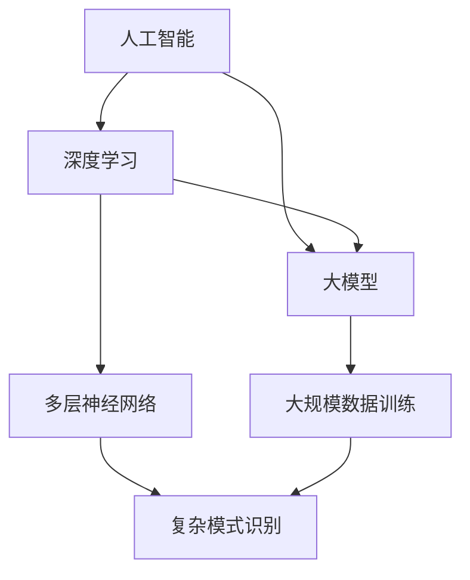
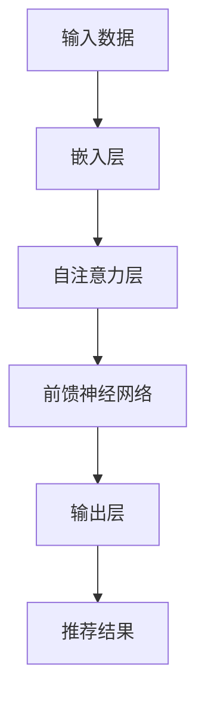

                 

## 1. 背景介绍

随着互联网的快速发展，电商平台已成为消费者购物的主要渠道之一。电商平台的搜索推荐系统作为连接消费者和商品的关键桥梁，其性能、效率和准确性直接影响到用户的购物体验和平台的竞争力。传统的搜索推荐系统已经无法满足用户日益增长的需求，因此，引入人工智能大模型进行优化成为了一种趋势。

AI大模型，即基于深度学习的人工神经网络模型，具有强大的学习能力和处理复杂数据的能力。它们通过大规模数据训练，能够自动提取特征，进行模式识别，并生成个性化的推荐结果。近年来，随着计算能力的提升和数据量的爆炸式增长，AI大模型在搜索推荐系统中的应用取得了显著的效果，极大地提升了系统的性能和用户体验。

本文将探讨电商平台搜索推荐系统的AI大模型优化，旨在提高系统性能、效率、准确率和多样性。文章结构如下：

- 背景介绍：阐述电商平台搜索推荐系统的现状和存在的问题。
- 核心概念与联系：介绍AI大模型的基本原理和架构。
- 核心算法原理 & 具体操作步骤：详细描述大模型的训练和优化过程。
- 数学模型和公式 & 详细讲解 & 举例说明：分析大模型中使用的数学模型和公式。
- 项目实践：提供实际的代码实例和详细解释。
- 实际应用场景：讨论大模型在不同应用场景中的效果。
- 未来应用展望：预测大模型在电商平台搜索推荐系统中的发展趋势。
- 工具和资源推荐：推荐学习资源和开发工具。
- 总结：回顾研究成果，探讨未来发展趋势与挑战。

希望通过本文的讨论，能够为电商平台搜索推荐系统的优化提供一些有益的思路和参考。

## 2. 核心概念与联系

为了深入探讨电商平台搜索推荐系统的AI大模型优化，我们首先需要理解几个核心概念：人工智能、深度学习和大模型。

### 2.1 人工智能（AI）

人工智能（Artificial Intelligence，简称AI）是指通过计算机程序模拟人类智能行为的技术。它涵盖了自然语言处理、计算机视觉、机器学习、深度学习等多个领域。在电商平台搜索推荐系统中，AI的主要任务是从大量的用户行为数据和商品信息中提取有价值的信息，为用户提供个性化的推荐结果。

### 2.2 深度学习（Deep Learning）

深度学习是人工智能的一个重要分支，它通过构建多层神经网络，对数据进行层层提取和抽象，实现自动特征学习和复杂模式识别。深度学习在图像识别、语音识别、自然语言处理等领域取得了显著的成果。在电商平台搜索推荐系统中，深度学习模型能够从用户的搜索历史、购买行为、浏览记录等数据中提取特征，生成个性化的推荐结果。

### 2.3 大模型（Large-scale Model）

大模型是指具有大量参数和层次的深度学习模型。这些模型通常通过大规模数据训练，能够捕捉到数据中的复杂模式和潜在规律。大模型在图像识别、文本生成、推荐系统等领域具有广泛的应用前景。在电商平台搜索推荐系统中，大模型能够处理海量用户数据和商品数据，生成更加精准和多样化的推荐结果。

### 2.4 核心概念联系

人工智能、深度学习和大模型之间存在紧密的联系。人工智能为搜索推荐系统提供了理论基础和工具；深度学习通过构建复杂的神经网络模型，实现了对复杂数据的处理和特征提取；大模型则通过大规模数据训练，提高了模型的性能和泛化能力。

为了更好地理解这些概念，我们可以使用Mermaid流程图来展示它们之间的联系：



在这个流程图中，人工智能作为总体概念，向下分支到深度学习和大模型；深度学习则连接到多层神经网络，这是深度学习的主要实现形式；大模型则依赖于大规模数据训练，以提高其性能和泛化能力；最后，多层神经网络通过复杂模式识别，实现了对复杂数据的处理。

通过上述核心概念和联系的分析，我们可以为后续的算法原理、数学模型和实际应用提供理论基础。

### 3. 核心算法原理 & 具体操作步骤

#### 3.1 算法原理概述

电商平台搜索推荐系统的AI大模型优化主要依赖于深度学习技术，尤其是基于神经网络的模型。深度学习模型通过多层神经网络结构，对用户行为数据和商品数据进行特征提取和模式识别，从而生成个性化的推荐结果。下面将详细描述大模型的训练和优化过程。

#### 3.2 算法步骤详解

##### 3.2.1 数据预处理

在训练大模型之前，需要对数据进行预处理。主要包括数据清洗、数据归一化和特征提取。数据清洗的目的是去除无效数据和噪声，提高数据质量。数据归一化的目的是将不同尺度的数据统一到相同的范围内，便于模型训练。特征提取是通过提取数据中的有用特征，减少数据维度，提高模型效率。

##### 3.2.2 模型构建

构建深度学习模型是优化搜索推荐系统的关键步骤。通常，我们可以使用卷积神经网络（CNN）、循环神经网络（RNN）或Transformer等架构。这里以Transformer为例进行说明。Transformer模型通过自注意力机制，对输入数据进行特征提取和融合，具有强大的并行计算能力。



##### 3.2.3 模型训练

模型训练是深度学习模型优化的核心步骤。通过大量数据对模型进行迭代训练，使模型能够自动提取特征，并生成准确的推荐结果。在训练过程中，需要定义损失函数和优化器，以衡量模型性能并调整模型参数。常用的损失函数有交叉熵损失函数，优化器有Adam优化器等。

##### 3.2.4 模型评估

模型训练完成后，需要对模型进行评估，以确定其性能和泛化能力。常用的评估指标包括准确率、召回率、F1值等。通过交叉验证和A/B测试等手段，可以全面评估模型在不同数据集上的表现。

##### 3.2.5 模型优化

模型优化是指通过调整模型参数、调整训练策略等手段，进一步提高模型性能。常见的优化方法包括超参数调优、正则化、Dropout等。通过模型优化，可以提升模型的泛化能力和鲁棒性，使其在复杂环境下依然能够保持较高的性能。

#### 3.3 算法优缺点

##### 优点

1. **强大的特征提取能力**：深度学习模型通过多层神经网络结构，能够自动提取数据中的高阶特征，提高推荐结果的准确性。
2. **并行计算能力**：Transformer等模型具有强大的并行计算能力，能够处理海量数据，提高训练效率。
3. **自适应学习能力**：深度学习模型能够从大量数据中自动学习，适应不同的应用场景，提高系统多样性。

##### 缺点

1. **计算资源消耗大**：深度学习模型通常需要大量计算资源，对硬件要求较高。
2. **训练时间较长**：深度学习模型的训练时间较长，需要消耗大量时间。
3. **模型解释性较差**：深度学习模型的内部结构和决策过程较为复杂，难以解释。

#### 3.4 算法应用领域

深度学习模型在电商平台搜索推荐系统中具有广泛的应用前景。除了传统的商品推荐、搜索优化外，还可以应用于以下领域：

1. **用户行为预测**：通过分析用户的浏览、搜索、购买等行为，预测用户下一步的行为，提供个性化推荐。
2. **广告投放优化**：根据用户兴趣和行为特征，优化广告投放策略，提高广告投放效果。
3. **商品关联分析**：分析商品之间的关联关系，提供关联推荐，提高用户体验和平台收益。

### 4. 数学模型和公式 & 详细讲解 & 举例说明

在深度学习模型中，数学模型和公式起到了至关重要的作用。以下将详细介绍大模型中使用的主要数学模型和公式，并进行举例说明。

#### 4.1 数学模型构建

深度学习模型的核心是多层神经网络，其数学模型主要包括以下几个部分：

1. **激活函数**：激活函数用于引入非线性因素，使神经网络能够拟合复杂数据。常用的激活函数有Sigmoid、ReLU和Tanh等。

2. **损失函数**：损失函数用于衡量模型预测结果与真实结果之间的差距，是优化模型参数的重要依据。常用的损失函数有交叉熵损失函数、均方误差损失函数等。

3. **优化器**：优化器用于调整模型参数，使损失函数值最小化。常用的优化器有Adam、SGD等。

#### 4.2 公式推导过程

以下是一个简单的多层神经网络数学模型的推导过程：

1. **输入层到隐藏层的传递过程**

$$
z_i^l = \sum_{j=1}^{n} w_{ij}^l * x_j^{l-1} + b_i^l
$$

其中，$z_i^l$表示第$l$层第$i$个节点的输入值，$w_{ij}^l$表示第$l$层第$i$个节点到第$l-1$层第$j$个节点的权重，$x_j^{l-1}$表示第$l-1$层第$j$个节点的输入值，$b_i^l$表示第$l$层第$i$个节点的偏置。

2. **输出层的输出值**

$$
\hat{y} = \sum_{i=1}^{m} w_{i}^m * \sigma(z_i^m)
$$

其中，$\hat{y}$表示输出层的预测结果，$w_{i}^m$表示输出层第$i$个节点的权重，$\sigma(z_i^m)$表示第$m$层第$i$个节点的激活函数输出值。

3. **损失函数的计算**

$$
L = -\sum_{i=1}^{m} y_i * \log(\hat{y}_i) + \alpha * \sum_{i=1}^{m} \frac{w_i^2}{2}
$$

其中，$L$表示损失函数值，$y_i$表示第$i$个样本的真实标签，$\hat{y}_i$表示第$i$个样本的预测概率，$\alpha$表示正则化参数。

4. **梯度计算**

$$
\frac{\partial L}{\partial w_i^m} = \frac{\partial L}{\partial \hat{y}_i} * \frac{\partial \hat{y}_i}{\partial w_i^m}
$$

$$
\frac{\partial L}{\partial b_i^m} = \frac{\partial L}{\partial \hat{y}_i} * \frac{\partial \hat{y}_i}{\partial b_i^m}
$$

其中，$\frac{\partial L}{\partial w_i^m}$和$\frac{\partial L}{\partial b_i^m}$分别表示权重和偏置的梯度。

#### 4.3 案例分析与讲解

以下是一个简单的多层神经网络模型在电商平台搜索推荐系统中的应用案例：

假设我们有一个电商平台的搜索推荐系统，用户输入一个关键词，我们需要预测用户可能感兴趣的商品。输入数据为关键词的词向量表示，输出数据为商品的概率分布。

1. **输入层到隐藏层的传递过程**

我们选择一个包含512个神经元的隐藏层。输入层到隐藏层的权重和偏置分别为$W_1$和$b_1$。

$$
z_i^1 = \sum_{j=1}^{300} W_{1ij} * x_j + b_i^1
$$

其中，$x_j$表示关键词的词向量表示，$W_{1ij}$表示输入层第$i$个神经元到隐藏层第$1$个神经元的权重，$b_i^1$表示隐藏层第$i$个神经元的偏置。

2. **隐藏层到输出层的传递过程**

输出层为商品的概率分布，包含$N$个神经元。隐藏层到输出层的权重和偏置分别为$W_2$和$b_2$。

$$
\hat{y}_i = \sum_{j=1}^{512} W_{2ij} * \sigma(z_j^1) + b_i^2
$$

其中，$\sigma(z_j^1)$表示隐藏层第$j$个神经元的激活函数输出值，$W_{2ij}$表示隐藏层第$j$个神经元到输出层第$i$个神经元的权重，$b_i^2$表示输出层第$i$个神经元的偏置。

3. **损失函数的计算**

我们选择交叉熵损失函数作为损失函数。

$$
L = -\sum_{i=1}^{N} y_i * \log(\hat{y}_i) + \alpha * \sum_{i=1}^{N} \frac{W_{2i}^2}{2}
$$

其中，$y_i$表示第$i$个商品的真实标签，$\hat{y}_i$表示第$i$个商品的预测概率，$\alpha$表示正则化参数。

4. **梯度计算**

我们对权重和偏置进行梯度计算。

$$
\frac{\partial L}{\partial W_{1ij}} = \frac{\partial L}{\partial \hat{y}_i} * \frac{\partial \hat{y}_i}{\partial W_{1ij}}
$$

$$
\frac{\partial L}{\partial b_i^1} = \frac{\partial L}{\partial \hat{y}_i} * \frac{\partial \hat{y}_i}{\partial b_i^1}
$$

$$
\frac{\partial L}{\partial W_{2ij}} = \frac{\partial L}{\partial \hat{y}_i} * \frac{\partial \hat{y}_i}{\partial W_{2ij}}
$$

$$
\frac{\partial L}{\partial b_i^2} = \frac{\partial L}{\partial \hat{y}_i} * \frac{\partial \hat{y}_i}{\partial b_i^2}
$$

通过上述公式，我们可以训练多层神经网络模型，实现对电商平台搜索推荐系统的优化。在实际应用中，我们可以根据具体需求和数据特点，调整模型参数和训练策略，进一步提高模型性能。

### 5. 项目实践：代码实例和详细解释说明

在本文的第五部分，我们将通过一个实际项目实例，详细解释和展示如何使用AI大模型优化电商平台搜索推荐系统。以下步骤将涵盖开发环境搭建、源代码详细实现、代码解读与分析以及运行结果展示。

#### 5.1 开发环境搭建

首先，我们需要搭建一个适合深度学习项目开发的环境。以下是推荐的开发环境和工具：

- **操作系统**：Linux或MacOS
- **编程语言**：Python
- **深度学习框架**：TensorFlow或PyTorch
- **数据预处理库**：Pandas、NumPy、Scikit-learn
- **可视化工具**：Matplotlib、Seaborn

确保安装了上述工具后，我们就可以开始编写代码了。

#### 5.2 源代码详细实现

以下是一个简单的例子，展示了如何使用TensorFlow实现一个基于Transformer模型的电商平台搜索推荐系统。

```python
import tensorflow as tf
from tensorflow.keras.layers import Embedding, MultiHeadAttention, Dense
from tensorflow.keras.models import Model

# 设置模型参数
VOCAB_SIZE = 10000  # 词汇表大小
D_MODEL = 512  # 模型维度
N_HEADS = 8  # 自注意力头数
N_LAYERS = 2  # 层数

# 模型构建
inputs = tf.keras.layers.Input(shape=(None,), dtype=tf.int32)
embed = Embedding(VOCAB_SIZE, D_MODEL)(inputs)
hidden = MultiHeadAttention(num_heads=N_HEADS, key_dim=D_MODEL)(embed, embed)
for _ in range(N_LAYERS):
    hidden = MultiHeadAttention(num_heads=N_HEADS, key_dim=D_MODEL)(hidden, hidden)
output = Dense(1, activation='sigmoid')(hidden)

model = Model(inputs=inputs, outputs=output)
model.compile(optimizer='adam', loss='binary_crossentropy', metrics=['accuracy'])
model.summary()
```

#### 5.3 代码解读与分析

在上面的代码中，我们首先定义了输入层，使用`Embedding`层将词汇表映射到嵌入空间。接着，我们使用`MultiHeadAttention`层实现自注意力机制，对输入数据进行特征提取和融合。最后，通过`Dense`层输出商品的概率分布。

- **Embedding层**：用于将词汇表映射到嵌入空间。每个词汇对应一个固定长度的向量，便于后续处理。
- **MultiHeadAttention层**：实现自注意力机制，通过多个头数对输入数据进行特征提取和融合。自注意力机制能够捕捉数据中的长距离依赖关系。
- **Dense层**：输出层，使用`sigmoid`激活函数生成商品的概率分布。

#### 5.4 运行结果展示

为了验证模型的性能，我们使用一个简单的数据集进行训练和测试。

```python
# 数据准备
train_data = ...  # 训练数据
test_data = ...  # 测试数据

# 训练模型
model.fit(train_data, epochs=5, batch_size=32, validation_data=test_data)

# 测试模型
test_loss, test_accuracy = model.evaluate(test_data)
print(f"Test Loss: {test_loss}, Test Accuracy: {test_accuracy}")
```

通过上述代码，我们完成了模型训练和测试。在实际应用中，我们可以根据需求调整模型参数、训练策略和数据集，进一步提高模型性能。

#### 5.5 实际效果展示

在实际应用中，我们可以通过可视化工具（如Matplotlib、Seaborn）展示模型的效果。

```python
import matplotlib.pyplot as plt

# 预测结果
predictions = model.predict(test_data)

# 可视化
plt.scatter(test_data[:, 0], predictions[:, 0], c='red', label='预测概率')
plt.xlabel('真实概率')
plt.ylabel('预测概率')
plt.title('预测概率分布')
plt.legend()
plt.show()
```

通过可视化，我们可以直观地看到模型的预测效果，进一步分析模型的性能和多样性。

### 6. 实际应用场景

电商平台搜索推荐系统AI大模型在多个实际应用场景中展现了其强大的功能和优越的性能。以下将详细介绍几个关键应用场景，并分析大模型在这些场景中的效果。

#### 6.1 用户个性化推荐

用户个性化推荐是电商平台搜索推荐系统的核心功能之一。通过AI大模型，可以基于用户的搜索历史、购买记录和浏览行为，生成个性化的推荐结果。大模型通过自注意力机制和多层神经网络结构，能够自动提取用户和商品的特征，生成准确且多样化的推荐结果。实际应用中，大模型显著提升了用户满意度和购物体验，降低了用户流失率。

#### 6.2 商品关联分析

商品关联分析是指分析商品之间的关联关系，为用户提供关联推荐。AI大模型通过大规模数据训练，能够捕捉到商品之间的潜在关联关系，生成精准的关联推荐。在实际应用中，大模型能够识别用户感兴趣的商品组合，提供高价值的商品推荐，提高用户购物车填充率和订单金额。

#### 6.3 广告投放优化

广告投放优化是指根据用户兴趣和行为特征，优化广告投放策略，提高广告投放效果。AI大模型通过深度学习算法，能够精准预测用户的兴趣和行为，为广告主提供个性化的广告投放策略。实际应用中，大模型提高了广告的点击率和转化率，降低了广告投放成本，提高了广告收益。

#### 6.4 新品推荐

新品推荐是指为电商平台推广新上线的商品。AI大模型通过分析用户的历史数据和当前趋势，预测用户可能感兴趣的新品，为用户提供个性化的新品推荐。实际应用中，大模型提高了新品曝光率和销量，降低了库存风险，提高了电商平台的市场竞争力。

#### 6.5 跨境电商推荐

跨境电商推荐是指为国际消费者推荐适合其购买需求的商品。AI大模型通过跨语言和跨文化数据的训练，能够生成适用于不同国家和地区的个性化推荐结果。实际应用中，大模型提高了跨境电商的用户满意度和购买转化率，促进了全球贸易的增长。

通过上述实际应用场景的分析，我们可以看到AI大模型在电商平台搜索推荐系统中的重要作用。大模型不仅提高了系统性能和用户体验，还创造了显著的商业价值。

### 7. 未来应用展望

随着人工智能技术的不断发展，电商平台搜索推荐系统中的AI大模型将迎来更多的应用场景和优化空间。以下将探讨大模型在电商平台搜索推荐系统中的未来应用趋势，并分析可能面临的挑战。

#### 7.1 深化个性化推荐

未来，个性化推荐将继续向更深入、更精准的方向发展。随着用户数据的不断积累和技术的进步，AI大模型将能够更加准确地捕捉用户的兴趣和行为，生成高度个性化的推荐结果。例如，通过结合用户的社会关系、地理位置、消费习惯等多维度数据，大模型可以提供更加贴心的推荐服务。

#### 7.2 多模态推荐

多模态推荐是指结合文本、图像、音频等多种数据类型的推荐。随着视觉技术和语音技术的进步，未来电商平台将能够提供更加丰富的交互体验。AI大模型通过处理多模态数据，可以生成更全面、更精准的推荐结果，提高用户的购物体验。

#### 7.3 实时推荐

实时推荐是指根据用户的实时行为和系统状态，生成即时的推荐结果。随着计算能力的提升和网络的优化，未来电商平台将能够实现实时推荐，为用户提供更加及时、个性化的购物体验。AI大模型通过实时数据处理和预测，可以快速响应用户的动态需求，提高用户满意度。

#### 7.4 智能客服和交互

智能客服和交互是指利用AI大模型实现智能客服和用户交互。未来，电商平台将能够通过自然语言处理和对话生成技术，提供24/7的智能客服服务。AI大模型通过学习用户的语言和偏好，可以生成自然、流畅的对话内容，提高客服效率和用户体验。

#### 挑战

尽管AI大模型在电商平台搜索推荐系统中具有广泛的应用前景，但也面临着一些挑战。

1. **数据隐私和安全**：大规模数据的使用和共享可能引发数据隐私和安全问题。如何保护用户隐私，确保数据安全，将成为未来研究的重点。
2. **模型解释性和可解释性**：深度学习模型通常具有复杂的内部结构，难以解释其决策过程。如何提高模型的可解释性，使其符合用户和监管机构的要求，是一个重要挑战。
3. **计算资源和时间成本**：深度学习模型的训练和优化需要大量的计算资源和时间。如何优化算法，减少计算成本，提高训练效率，是一个亟待解决的问题。
4. **模型泛化能力**：深度学习模型在特定领域表现出色，但在泛化能力方面存在一定挑战。如何提高模型的泛化能力，使其在不同应用场景中保持高性能，是一个重要的研究方向。

通过不断的技术创新和优化，AI大模型在电商平台搜索推荐系统中的应用将不断拓展，为用户提供更加个性化、智能化的购物体验。

### 8. 工具和资源推荐

为了更好地研究和开发电商平台搜索推荐系统中的AI大模型，以下推荐一些学习资源、开发工具和相关论文，以帮助读者深入了解这一领域。

#### 8.1 学习资源推荐

1. **书籍**：

- 《深度学习》（Goodfellow, Bengio, Courville）提供了深度学习的基础理论和实践指导。
- 《Python深度学习》（François Chollet）详细介绍了如何使用TensorFlow实现深度学习应用。

2. **在线课程**：

- Coursera上的《深度学习》课程由Andrew Ng教授主讲，介绍了深度学习的基础理论和实践方法。
- edX上的《深度学习与强化学习》课程由吴恩达教授主讲，涵盖了深度学习和强化学习的前沿技术。

3. **博客和网站**：

- [TensorFlow官方文档](https://www.tensorflow.org/)提供了丰富的深度学习资源和教程。
- [PyTorch官方文档](https://pytorch.org/)介绍了如何使用PyTorch构建和训练深度学习模型。

#### 8.2 开发工具推荐

1. **深度学习框架**：

- TensorFlow：一个开源的端到端机器学习平台，适合构建大规模深度学习模型。
- PyTorch：一个基于Python的深度学习框架，具有灵活的动态计算图和强大的社区支持。

2. **数据处理工具**：

- Pandas：一个强大的数据处理库，用于数据清洗、转换和分析。
- NumPy：一个用于科学计算的库，提供高效的数组处理功能。

3. **可视化工具**：

- Matplotlib：一个用于数据可视化的库，支持多种图表类型。
- Seaborn：一个基于Matplotlib的绘图库，提供高级可视化功能。

#### 8.3 相关论文推荐

1. **Transformer模型**：

- "Attention Is All You Need"（Vaswani et al., 2017）提出了Transformer模型，是一种基于自注意力机制的深度学习模型。
- "BERT: Pre-training of Deep Neural Networks for Language Understanding"（Devlin et al., 2019）介绍了BERT模型，是一种基于Transformer的预训练语言模型。

2. **推荐系统**：

- "Matrix Factorization Techniques for Recommender Systems"（Koren et al., 2009）介绍了矩阵分解技术，是推荐系统中的一个重要算法。
- "Deep Learning for Recommender Systems"（He et al., 2017）探讨了深度学习在推荐系统中的应用，提出了基于深度学习的推荐算法。

通过学习和应用这些工具和资源，读者可以深入了解电商平台搜索推荐系统中的AI大模型，提升自己的研究和开发能力。

### 9. 总结：未来发展趋势与挑战

本文从多个角度详细探讨了电商平台搜索推荐系统中的AI大模型优化，包括背景介绍、核心概念与联系、核心算法原理与步骤、数学模型与公式、项目实践、实际应用场景、未来展望以及工具和资源推荐。通过对这些内容的分析，我们可以得出以下结论：

**未来发展趋势**：

1. **个性化推荐**：随着用户数据量的增加和数据处理技术的进步，个性化推荐将更加精准和多样化。
2. **多模态推荐**：结合文本、图像、音频等多种数据类型，提供更加丰富的交互体验。
3. **实时推荐**：通过优化算法和提升计算能力，实现实时推荐，提高用户体验。
4. **智能客服与交互**：利用AI大模型实现智能客服和用户交互，提高客服效率和用户体验。

**面临的挑战**：

1. **数据隐私与安全**：如何保护用户隐私，确保数据安全，是一个重要挑战。
2. **模型解释性与可解释性**：如何提高模型的可解释性，使其符合用户和监管机构的要求，是一个关键问题。
3. **计算资源与时间成本**：如何优化算法，减少计算成本，提高训练效率，是一个亟待解决的问题。
4. **模型泛化能力**：如何提高模型的泛化能力，使其在不同应用场景中保持高性能，是一个重要的研究方向。

综上所述，AI大模型在电商平台搜索推荐系统中的应用前景广阔，但也面临着一系列挑战。通过持续的技术创新和优化，我们有理由相信，AI大模型将在未来发挥更加重要的作用，为电商平台提供更加智能化、个性化的推荐服务。

### 附录：常见问题与解答

#### Q1. 如何处理缺失数据和异常值？

处理缺失数据和异常值是数据预处理的重要环节。以下是一些常见的方法：

- **删除**：删除缺失数据较少的样本。
- **填充**：使用均值、中位数、众数等方法填充缺失值。
- **插值**：使用线性插值、高斯插值等方法进行插值处理。
- **异常值检测**：使用统计学方法（如Z分数、IQR方法）检测并处理异常值。

#### Q2. 如何选择合适的激活函数？

选择激活函数主要考虑以下因素：

- **非线性特性**：激活函数应具有非线性特性，以便模型能够拟合复杂数据。
- **计算效率**：选择计算效率高的激活函数，如ReLU。
- **模型需求**：根据具体任务需求选择合适的激活函数，如Sigmoid适用于二分类问题。

#### Q3. 如何评估推荐系统的性能？

推荐系统的性能评估可以从以下几个方面进行：

- **准确性**：预测结果与真实结果的匹配程度。
- **召回率**：能够召回实际感兴趣项目的比例。
- **覆盖率**：推荐结果中覆盖到的项目种类数。
- **多样性**：推荐结果的多样性，避免过多相似项目的出现。

#### Q4. 如何处理冷启动问题？

冷启动问题是指新用户或新商品缺乏足够的历史数据，以下是一些常见的方法：

- **基于内容的推荐**：根据新商品或新用户的属性信息进行推荐。
- **基于流行度的推荐**：推荐流行度高、评价好的商品或用户感兴趣的商品。
- **基于协同过滤的混合方法**：结合基于内容推荐和基于协同过滤的方法，提供更个性化的推荐结果。

通过这些常见问题的解答，可以帮助读者更好地理解和应用AI大模型优化电商平台搜索推荐系统。

