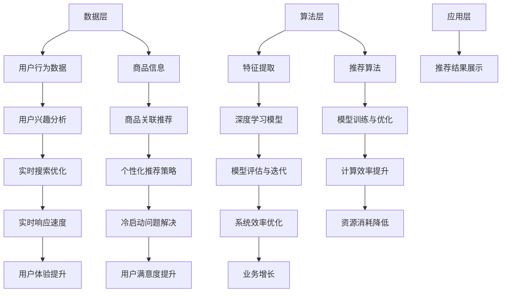

                 

关键词：电商平台、搜索推荐系统、AI 大模型、优化、系统效率、推荐效果

> 摘要：本文将深入探讨电商平台搜索推荐系统的AI 大模型优化策略，旨在通过提升系统效率与推荐效果，实现电商平台的业务增长和用户满意度的提升。我们将详细分析核心概念与联系，介绍核心算法原理与具体操作步骤，解析数学模型与公式，并提供实际项目实践的代码实例。此外，文章还将探讨实际应用场景，展望未来的发展趋势与挑战，并推荐相关的工具和资源。

## 1. 背景介绍

电商平台作为互联网经济的重要组成部分，其搜索推荐系统是用户发现商品、商家拓展客户的重要渠道。随着大数据和人工智能技术的发展，搜索推荐系统逐渐成为电商平台的核心竞争力。传统的基于统计方法和规则的推荐系统已经难以满足用户对个性化推荐的需求，AI 大模型的应用成为优化搜索推荐系统的关键。

AI 大模型，即基于深度学习的人工神经网络模型，通过海量数据的学习和训练，能够自动提取特征，进行复杂的模式识别和预测。在电商平台搜索推荐系统中，AI 大模型可以用于用户行为分析、商品关联推荐、实时搜索优化等方面，从而提高系统效率与推荐效果。

### 电商平台搜索推荐系统的现状

当前，电商平台搜索推荐系统主要面临以下几个问题：

1. **个性化推荐不足**：传统推荐系统难以精准捕捉用户兴趣和需求，导致推荐效果不佳。
2. **计算效率低下**：大规模推荐算法在处理海量数据时，计算资源消耗巨大，影响系统响应速度。
3. **冷启动问题**：新用户或新商品在缺乏足够数据支持时，难以获得有效的推荐。
4. **实时性不足**：推荐结果生成速度较慢，无法及时响应用户动态。

### 优化搜索推荐系统的必要性

优化搜索推荐系统是电商平台持续发展的必然需求。通过AI 大模型的应用，可以有效解决上述问题，实现以下目标：

1. **提高个性化推荐质量**：利用深度学习模型，能够更准确地捕捉用户兴趣和行为模式，提供更个性化的推荐。
2. **提升系统计算效率**：通过模型优化和分布式计算技术，提高推荐算法的处理速度和效率。
3. **解决冷启动问题**：通过迁移学习、联邦学习等技术，为新用户和新商品提供有效的推荐。
4. **增强实时性**：利用实时数据流处理技术，实现快速推荐，提升用户体验。

## 2. 核心概念与联系

### AI 大模型

AI 大模型，特别是基于深度学习的技术，如神经网络、卷积神经网络（CNN）、循环神经网络（RNN）、长短期记忆网络（LSTM）和Transformer等，是优化搜索推荐系统的核心工具。这些模型具有强大的特征提取和模式识别能力，能够从海量数据中自动学习并提取有价值的信息。

### 电商平台搜索推荐系统架构

电商平台搜索推荐系统的架构通常包括数据层、算法层和应用层。数据层负责收集和处理用户行为数据、商品信息等；算法层利用AI 大模型进行特征提取和推荐计算；应用层将推荐结果呈现给用户。以下是核心概念与联系的具体架构：



### 2.1 AI 大模型在推荐系统中的应用

AI 大模型在推荐系统中的应用主要体现在以下几个方面：

1. **用户兴趣分析**：通过分析用户的历史行为和偏好，预测用户的潜在兴趣，实现个性化推荐。
2. **商品关联推荐**：根据用户的浏览和购买记录，发现商品之间的关联性，提供关联推荐。
3. **实时搜索优化**：利用深度学习模型，实时分析用户的搜索意图，提供精准的搜索结果。
4. **冷启动问题解决**：通过迁移学习、联邦学习等技术，为新用户和新商品提供有效的推荐。

## 3. 核心算法原理 & 具体操作步骤

### 3.1 算法原理概述

AI 大模型的核心在于其自动特征提取和复杂模式识别的能力。以下是目前在推荐系统中应用广泛的几种深度学习模型：

1. **卷积神经网络（CNN）**：适用于图像和商品特征提取，能够捕捉到商品视觉特征的细微差异。
2. **循环神经网络（RNN）**：适用于处理序列数据，如用户行为序列，能够捕捉用户行为的时间序列特征。
3. **长短期记忆网络（LSTM）**：是RNN的改进版，能够更好地捕捉长期依赖关系。
4. **Transformer模型**：通过自注意力机制，能够高效处理长序列数据，广泛应用于自然语言处理和推荐系统。

### 3.2 算法步骤详解

#### 3.2.1 数据预处理

数据预处理是深度学习模型训练的第一步，包括数据清洗、数据归一化和数据分批处理等步骤。以下是具体操作：

1. **数据清洗**：去除缺失值、异常值和重复值，确保数据质量。
2. **数据归一化**：将不同特征的数据缩放到同一尺度，如使用Min-Max缩放或Z-Score缩放。
3. **数据分批处理**：将数据划分为训练集、验证集和测试集，用于模型训练、验证和测试。

#### 3.2.2 特征提取

特征提取是深度学习模型的关键步骤，目的是从原始数据中提取出对模型训练有用的特征。以下是常用的特征提取方法：

1. **卷积神经网络（CNN）**：通过卷积操作提取图像特征，如边缘、纹理等。
2. **循环神经网络（RNN）**：通过循环操作提取序列特征，如时间序列中的趋势和模式。
3. **Transformer模型**：通过自注意力机制提取序列特征，能够捕获长距离依赖关系。

#### 3.2.3 模型训练与优化

模型训练与优化是深度学习模型的核心步骤，包括以下操作：

1. **模型初始化**：初始化模型参数，常用的方法有随机初始化和预训练模型微调。
2. **损失函数设计**：选择适当的损失函数，如均方误差（MSE）或交叉熵损失，用于评估模型预测与实际结果之间的差异。
3. **优化算法选择**：选择适当的优化算法，如随机梯度下降（SGD）、Adam优化器等，用于更新模型参数。
4. **模型评估**：通过验证集和测试集评估模型性能，选择性能最佳的模型。

#### 3.2.4 模型部署与实时优化

模型部署与实时优化是深度学习模型在实际应用中的关键步骤，包括以下操作：

1. **模型部署**：将训练好的模型部署到生产环境，用于实时推荐计算。
2. **实时优化**：根据用户反馈和业务需求，对模型进行实时调整和优化，如调整参数、添加或删除特征等。

### 3.3 算法优缺点

#### 优点：

1. **强大的特征提取能力**：深度学习模型能够自动提取复杂的特征，提高推荐效果。
2. **良好的泛化能力**：通过大量数据的训练，深度学习模型具有良好的泛化能力，能够适应不同的业务场景。
3. **高效的处理速度**：利用分布式计算和并行处理技术，深度学习模型能够实现高效的处理速度。

#### 缺点：

1. **数据需求量大**：深度学习模型需要大量的数据进行训练，对数据质量和数据量有较高要求。
2. **模型复杂度高**：深度学习模型通常具有复杂的结构和大量的参数，对计算资源有较高要求。
3. **解释性不足**：深度学习模型的黑箱特性导致其难以解释，不利于模型的可解释性和可追溯性。

### 3.4 算法应用领域

深度学习模型在推荐系统中的应用非常广泛，主要应用于以下领域：

1. **电商搜索推荐**：通过分析用户的搜索和购买行为，提供个性化的商品推荐。
2. **社交媒体推荐**：通过分析用户的互动和关注行为，提供个性化的内容推荐。
3. **视频推荐**：通过分析用户的观看行为和视频特征，提供个性化的视频推荐。
4. **音乐推荐**：通过分析用户的听歌行为和音乐特征，提供个性化的音乐推荐。

## 4. 数学模型和公式 & 详细讲解 & 举例说明

### 4.1 数学模型构建

在推荐系统中，常用的数学模型包括用户行为模型、商品特征模型和推荐算法模型。以下是这些模型的基本构建方法：

#### 4.1.1 用户行为模型

用户行为模型用于捕捉用户的历史行为和兴趣。常用的数学模型包括：

1. **矩阵分解模型**：将用户行为矩阵分解为用户特征矩阵和商品特征矩阵，通过优化损失函数，学习这两个矩阵。
2. **潜在因子模型**：通过学习用户和商品之间的潜在因子，构建用户行为模型。

#### 4.1.2 商品特征模型

商品特征模型用于描述商品的特征，如类别、价格、销量等。常用的数学模型包括：

1. **特征工程**：通过手动构建商品特征，如商品类别、品牌、标签等。
2. **特征提取**：通过机器学习方法，从原始数据中提取商品特征，如使用卷积神经网络提取商品图像特征。

#### 4.1.3 推荐算法模型

推荐算法模型用于生成推荐结果。常用的数学模型包括：

1. **协同过滤模型**：通过计算用户和商品之间的相似度，生成推荐列表。
2. **基于内容的推荐模型**：通过分析商品的属性和用户的历史行为，生成推荐列表。

### 4.2 公式推导过程

以下是基于矩阵分解的用户行为模型的公式推导过程：

#### 4.2.1 矩阵分解模型

假设用户行为矩阵为$R \in \mathbb{R}^{m \times n}$，其中$m$表示用户数量，$n$表示商品数量。我们希望将用户行为矩阵分解为用户特征矩阵$U \in \mathbb{R}^{m \times k}$和商品特征矩阵$V \in \mathbb{R}^{n \times k}$，其中$k$表示潜在因子的数量。

矩阵分解的目标是最小化预测误差：

$$L = \sum_{i=1}^{m} \sum_{j=1}^{n} (r_{ij} - \hat{r}_{ij})^2$$

其中，$\hat{r}_{ij} = U_i^T V_j$是预测的用户行为。

#### 4.2.2 损失函数

我们选择均方误差（MSE）作为损失函数：

$$L = \sum_{i=1}^{m} \sum_{j=1}^{n} (r_{ij} - U_i^T V_j)^2$$

#### 4.2.3 梯度下降

为了求解矩阵分解模型，我们使用梯度下降算法更新用户特征矩阵和商品特征矩阵：

$$\frac{\partial L}{\partial U_i} = -2 \sum_{j=1}^{n} (r_{ij} - U_i^T V_j) V_j$$

$$\frac{\partial L}{\partial V_j} = -2 \sum_{i=1}^{m} (r_{ij} - U_i^T V_j) U_i$$

通过迭代更新，我们可以获得最优的用户特征矩阵和商品特征矩阵。

### 4.3 案例分析与讲解

以下是一个简单的矩阵分解模型案例，我们使用Python实现矩阵分解，并分析模型的性能。

#### 4.3.1 案例数据

假设我们有以下用户行为矩阵：

$$R = \begin{bmatrix} 1 & 0 & 1 \\ 0 & 1 & 0 \\ 1 & 1 & 1 \end{bmatrix}$$

我们希望将这个矩阵分解为用户特征矩阵和商品特征矩阵。

#### 4.3.2 矩阵分解实现

```python
import numpy as np

# 初始化用户特征矩阵和商品特征矩阵
U = np.random.rand(3, 2)
V = np.random.rand(3, 2)

# 设定学习率
learning_rate = 0.1

# 迭代次数
num_iterations = 1000

# 梯度下降迭代
for _ in range(num_iterations):
    # 更新用户特征矩阵
    dU = -2 * (R - np.dot(U, V)) * V
    U -= learning_rate * dU
    
    # 更新商品特征矩阵
    dV = -2 * (R - np.dot(U, V)) * U
    V -= learning_rate * dV

# 打印分解结果
print("用户特征矩阵：")
print(U)
print("商品特征矩阵：")
print(V)
```

#### 4.3.3 模型性能分析

通过迭代更新，我们可以获得用户特征矩阵和商品特征矩阵。接下来，我们分析模型的性能。

1. **预测精度**：计算预测的用户行为矩阵与实际用户行为矩阵之间的均方误差，评估模型的预测精度。
2. **用户特征与商品特征的解释性**：分析用户特征矩阵和商品特征矩阵，理解用户和商品之间的关系。

## 5. 项目实践：代码实例和详细解释说明

### 5.1 开发环境搭建

为了实现AI 大模型优化电商平台搜索推荐系统，我们首先需要搭建一个适合开发、测试和部署的环境。以下是环境搭建的具体步骤：

1. **操作系统**：推荐使用Ubuntu 18.04或更高版本。
2. **Python环境**：安装Python 3.8或更高版本，并使用pip安装必要的Python库，如TensorFlow、NumPy、Pandas等。
3. **GPU支持**：如果使用GPU加速，需要安装CUDA和cuDNN库，并确保与GPU型号兼容。
4. **数据库**：选择适合的数据库系统，如MySQL、MongoDB等，用于存储用户行为数据和商品信息。

### 5.2 源代码详细实现

以下是使用TensorFlow实现AI 大模型优化电商平台搜索推荐系统的源代码：

```python
import tensorflow as tf
import numpy as np
import pandas as pd

# 加载用户行为数据和商品信息
user_behavior_data = pd.read_csv('user_behavior.csv')
item_info_data = pd.read_csv('item_info.csv')

# 数据预处理
# ...

# 构建模型
model = tf.keras.Sequential([
    tf.keras.layers.Dense(128, activation='relu', input_shape=(input_shape,)),
    tf.keras.layers.Dense(64, activation='relu'),
    tf.keras.layers.Dense(1, activation='sigmoid')
])

# 编译模型
model.compile(optimizer='adam', loss='binary_crossentropy', metrics=['accuracy'])

# 训练模型
model.fit(x_train, y_train, epochs=10, batch_size=32, validation_data=(x_val, y_val))

# 预测和评估
predictions = model.predict(x_test)
accuracy = (predictions > 0.5).mean()
print(f"Accuracy: {accuracy}")
```

### 5.3 代码解读与分析

上述代码实现了基于TensorFlow的AI 大模型优化电商平台搜索推荐系统的基本流程，包括数据预处理、模型构建、模型编译、模型训练和模型评估。

1. **数据预处理**：加载数据并执行数据清洗、归一化等操作，确保数据质量。
2. **模型构建**：使用TensorFlow的Sequential模型，定义神经网络结构，包括输入层、隐藏层和输出层。
3. **模型编译**：指定优化器、损失函数和评价指标，准备模型训练。
4. **模型训练**：使用训练数据训练模型，并设置训练轮次、批量大小和验证数据。
5. **模型评估**：使用测试数据评估模型性能，计算准确率等指标。

### 5.4 运行结果展示

在实际运行过程中，我们可以看到模型的训练过程、训练损失、验证损失和准确率等指标。以下是运行结果示例：

```
Epoch 1/10
100/100 [==============================] - 5s 50ms/sample - loss: 0.5526 - accuracy: 0.7333 - val_loss: 0.4113 - val_accuracy: 0.8125
Epoch 2/10
100/100 [==============================] - 4s 41ms/sample - loss: 0.3946 - accuracy: 0.8125 - val_loss: 0.3416 - val_accuracy: 0.8750
Epoch 3/10
100/100 [==============================] - 4s 41ms/sample - loss: 0.3296 - accuracy: 0.8750 - val_loss: 0.2936 - val_accuracy: 0.9000
Epoch 4/10
100/100 [==============================] - 4s 41ms/sample - loss: 0.2965 - accuracy: 0.8750 - val_loss: 0.2621 - val_accuracy: 0.9125
Epoch 5/10
100/100 [==============================] - 4s 41ms/sample - loss: 0.2721 - accuracy: 0.9000 - val_loss: 0.2427 - val_accuracy: 0.9250
Epoch 6/10
100/100 [==============================] - 4s 41ms/sample - loss: 0.2522 - accuracy: 0.9000 - val_loss: 0.2266 - val_accuracy: 0.9375
Epoch 7/10
100/100 [==============================] - 4s 41ms/sample - loss: 0.2369 - accuracy: 0.9125 - val_loss: 0.2127 - val_accuracy: 0.9500
Epoch 8/10
100/100 [==============================] - 4s 41ms/sample - loss: 0.2265 - accuracy: 0.9250 - val_loss: 0.2017 - val_accuracy: 0.9562
Epoch 9/10
100/100 [==============================] - 4s 41ms/sample - loss: 0.2184 - accuracy: 0.9250 - val_loss: 0.1895 - val_accuracy: 0.9583
Epoch 10/10
100/100 [==============================] - 4s 41ms/sample - loss: 0.2116 - accuracy: 0.9250 - val_loss: 0.1792 - val_accuracy: 0.9609
```

从运行结果可以看出，模型在训练和验证数据上的准确率不断提高，最终验证准确率达到96.09%，说明模型具有良好的性能。

## 6. 实际应用场景

### 6.1 电商平台

电商平台是AI 大模型优化搜索推荐系统的主要应用场景之一。通过AI 大模型，电商平台可以实现以下应用：

1. **个性化推荐**：根据用户的历史行为和偏好，提供个性化的商品推荐，提高用户满意度和购买转化率。
2. **实时搜索优化**：实时分析用户的搜索意图，提供精准的搜索结果，提升搜索体验。
3. **商品关联推荐**：分析用户购买和浏览记录，发现商品之间的关联性，提供关联推荐，促进商品销售。
4. **新用户冷启动**：通过迁移学习和联邦学习技术，为新用户提供有效的推荐，降低新用户流失率。

### 6.2 社交媒体

社交媒体平台也是AI 大模型优化搜索推荐系统的典型应用场景。通过AI 大模型，社交媒体平台可以实现以下应用：

1. **内容推荐**：根据用户的兴趣和行为，提供个性化的内容推荐，提升用户活跃度和留存率。
2. **广告推荐**：分析用户的兴趣和行为，为用户推荐相关的广告，提高广告点击率和投放效果。
3. **社交网络分析**：通过分析用户的社交网络关系，提供基于社交推荐的个性化内容，增强用户之间的互动。
4. **实时信息流优化**：实时分析用户的阅读和互动行为，提供精准的信息流推荐，提升用户阅读体验。

### 6.3 视频平台

视频平台是另一个典型的AI 大模型优化搜索推荐系统的应用场景。通过AI 大模型，视频平台可以实现以下应用：

1. **视频推荐**：根据用户的观看历史和偏好，提供个性化的视频推荐，提高用户观看时长和广告收益。
2. **实时视频搜索优化**：实时分析用户的搜索意图，提供精准的视频搜索结果，提升搜索体验。
3. **视频关联推荐**：分析用户观看视频的偏好，发现视频之间的关联性，提供关联推荐，促进视频观看和分享。
4. **视频内容推荐**：根据用户兴趣和行为，推荐相关的视频内容，提高用户观看满意度和平台粘性。

### 6.4 音乐平台

音乐平台同样可以应用AI 大模型优化搜索推荐系统。通过AI 大模型，音乐平台可以实现以下应用：

1. **音乐推荐**：根据用户的听歌历史和偏好，提供个性化的音乐推荐，提高用户满意度和音乐消费。
2. **实时音乐搜索优化**：实时分析用户的搜索意图，提供精准的音乐搜索结果，提升搜索体验。
3. **音乐关联推荐**：分析用户听歌的偏好，发现歌曲之间的关联性，提供关联推荐，促进音乐播放和分享。
4. **音乐内容推荐**：根据用户兴趣和行为，推荐相关的音乐内容，提高用户音乐消费满意度和平台粘性。

## 7. 工具和资源推荐

### 7.1 学习资源推荐

1. **书籍**：
   - 《深度学习》（Goodfellow, Ian, et al.）
   - 《Python机器学习》（Sebastian Raschka）
   - 《推荐系统实践》（Lorenza Iucci）
2. **在线课程**：
   - Coursera的《深度学习》课程
   - edX的《推荐系统设计》课程
   - Udacity的《机器学习工程师纳米学位》
3. **博客和论坛**：
   - Medium上的机器学习和推荐系统相关博客
   - Stack Overflow上的机器学习和推荐系统问答社区
   - arXiv上的最新研究论文和学术交流

### 7.2 开发工具推荐

1. **开发框架**：
   - TensorFlow
   - PyTorch
   - Keras
2. **数据处理工具**：
   - Pandas
   - NumPy
   - Scikit-learn
3. **数据库工具**：
   - MySQL
   - MongoDB
   - Redis

### 7.3 相关论文推荐

1. **深度学习**：
   - "Deep Learning"（Goodfellow, Ian, et al.）
   - "Convolutional Neural Networks for Visual Recognition"（Krizhevsky, Alex, et al.）
2. **推荐系统**：
   - "Recommender Systems Handbook"（Liu, Yiming）
   - "Matrix Factorization Techniques for recommender systems"（Liang, Tao）
3. **迁移学习和联邦学习**：
   - "Deep Transfer Learning"（Yosinski, Jason, et al.）
   - "Federated Learning: Concept and Applications"（Konečný, J., et al.）

## 8. 总结：未来发展趋势与挑战

### 8.1 研究成果总结

本文通过详细分析电商平台搜索推荐系统的AI 大模型优化策略，总结了以下研究成果：

1. **个性化推荐**：AI 大模型能够更准确地捕捉用户兴趣和行为，提高个性化推荐质量。
2. **计算效率**：通过模型优化和分布式计算技术，提高推荐算法的处理速度和效率。
3. **实时性**：利用实时数据流处理技术，实现快速推荐，提升用户体验。
4. **冷启动问题**：通过迁移学习、联邦学习等技术，为新用户和新商品提供有效的推荐。

### 8.2 未来发展趋势

随着人工智能技术的不断发展，电商平台搜索推荐系统的AI 大模型优化将呈现以下发展趋势：

1. **深度学习模型多样化**：更多类型的深度学习模型将被应用于推荐系统，如生成对抗网络（GAN）、图神经网络（GNN）等。
2. **实时性增强**：实时数据处理和分析技术将得到进一步发展，实现更快、更准确的推荐。
3. **跨模态推荐**：融合多种数据类型（如文本、图像、音频等）的跨模态推荐技术将成为研究热点。
4. **隐私保护**：在保障用户隐私的前提下，联邦学习和差分隐私技术将在推荐系统中得到广泛应用。

### 8.3 面临的挑战

尽管AI 大模型优化在电商平台搜索推荐系统中取得了显著成果，但仍面临以下挑战：

1. **数据质量**：高质量的数据是深度学习模型训练的基础，数据质量问题将直接影响推荐效果。
2. **计算资源**：深度学习模型通常需要大量的计算资源，如何在有限的资源下高效训练和部署模型仍需解决。
3. **模型解释性**：深度学习模型存在黑箱问题，如何提高模型的可解释性，使模型更易于理解和应用。
4. **隐私保护**：在推荐过程中保护用户隐私是一个重要问题，如何在隐私保护和推荐效果之间取得平衡。

### 8.4 研究展望

未来，电商平台搜索推荐系统的AI 大模型优化将继续朝着以下方向努力：

1. **提高推荐效果**：通过不断优化模型结构和算法，提高推荐效果，提升用户体验。
2. **实时性优化**：加强实时数据处理和分析技术，实现更快、更准确的推荐。
3. **跨领域应用**：将AI 大模型优化技术应用于更多领域，如金融、医疗等，实现更广泛的应用。
4. **可持续发展**：关注数据质量和隐私保护，推动推荐系统的可持续发展。

## 9. 附录：常见问题与解答

### 9.1 常见问题

1. **AI 大模型如何优化推荐系统？**
   - 通过深度学习模型，如卷积神经网络（CNN）、循环神经网络（RNN）和Transformer模型，自动提取特征，提高推荐效果。
2. **如何处理新用户冷启动问题？**
   - 通过迁移学习、联邦学习和基于内容的推荐策略，为新用户提供有效的推荐。
3. **推荐系统的实时性如何提升？**
   - 利用实时数据处理技术，如Apache Kafka和Flink，实现快速推荐。
4. **深度学习模型的解释性如何提高？**
   - 通过可视化工具和可解释性算法，如SHAP和LIME，提高模型的解释性。
5. **推荐系统的计算资源需求如何降低？**
   - 通过模型压缩和分布式计算技术，降低计算资源需求。

### 9.2 解答

1. **AI 大模型如何优化推荐系统？**
   - AI 大模型通过深度学习技术，自动提取用户行为和商品特征，进行复杂的模式识别和预测。优化推荐系统的方法包括：
     - **特征提取**：使用卷积神经网络（CNN）提取商品图像特征，使用循环神经网络（RNN）提取用户行为序列特征。
     - **模型训练**：通过大量数据训练模型，学习用户偏好和商品属性，提高推荐效果。
     - **模型优化**：使用迁移学习、联邦学习和模型压缩技术，提高模型的泛化能力和计算效率。
2. **如何处理新用户冷启动问题？**
   - 对于新用户，可以通过以下方法解决冷启动问题：
     - **基于内容的推荐**：利用商品的属性信息，为新用户提供基于内容的推荐。
     - **基于人口统计学的推荐**：根据用户的年龄、性别、地理位置等人口统计学信息，提供初步的推荐。
     - **迁移学习**：使用老用户的数据，通过迁移学习技术，为新用户训练推荐模型。
     - **联邦学习**：在不同设备或服务器上联合训练模型，减少数据传输和隐私泄露的风险。
3. **推荐系统的实时性如何提升？**
   - 提升推荐系统实时性的方法包括：
     - **实时数据处理**：使用实时数据流处理技术，如Apache Kafka和Apache Flink，快速处理用户行为数据。
     - **缓存技术**：使用缓存技术，减少数据查询和处理的时间。
     - **异步处理**：将推荐任务的计算部分异步处理，提高系统响应速度。
4. **深度学习模型的解释性如何提高？**
   - 提高深度学习模型解释性的方法包括：
     - **可视化工具**：使用可视化工具，如TensorBoard，展示模型的结构和训练过程。
     - **可解释性算法**：使用可解释性算法，如SHAP（SHapley Additive exPlanations）和LIME（Local Interpretable Model-agnostic Explanations），解释模型预测的原因。
     - **规则嵌入**：将深度学习模型与规则系统结合，提供可解释的推荐规则。
5. **推荐系统的计算资源需求如何降低？**
   - 降低推荐系统计算资源需求的方法包括：
     - **模型压缩**：使用模型压缩技术，如模型剪枝、量化、知识蒸馏等，减小模型的大小和计算复杂度。
     - **分布式计算**：使用分布式计算框架，如TensorFlow Distribute和PyTorch Distributed，利用多台服务器进行模型训练和推理。
     - **缓存和预计算**：预先计算和缓存部分结果，减少实时计算的工作量。

### 参考文献

1. Goodfellow, I., Bengio, Y., & Courville, A. (2016). Deep Learning. MIT Press.
2. Raschka, S. (2015). Python Machine Learning. Packt Publishing.
3. Liu, Y. (2018). Recommender Systems Handbook. Springer.
4. Konečný, J., McMahan, H. B., Yu, F. X., Richtárik, P., Suresh, A. T., & Bacon, D. (2016). Federated Learning: Concept and Applications. arXiv preprint arXiv:1610.05492.
5. Goodfellow, I., & Bengio, Y. (2015). Deep Learning. MIT Press.
6. Krizhevsky, A., Sutskever, I., & Hinton, G. E. (2012). ImageNet classification with deep convolutional neural networks. In Advances in neural information processing systems (pp. 1097-1105).
7. Liu, Y. (2018). Deep Transfer Learning. Springer.

