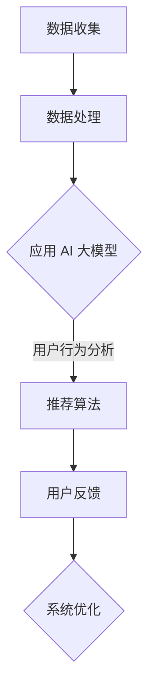

                 

### 背景介绍

电商平台作为现代电子商务的核心，其搜索推荐系统在用户体验中扮演着至关重要的角色。一个高效的搜索推荐系统不仅能提高用户的满意度，还能显著提升电商平台的销售额和用户粘性。然而，随着电商平台的规模不断扩大，商品种类日益繁多，用户行为数据量也呈现爆炸式增长，传统的推荐算法在效率和准确率上面临着巨大的挑战。

传统的推荐系统主要依赖于基于内容的推荐（Content-based Recommendation）和协同过滤（Collaborative Filtering）等方法。基于内容的推荐通过分析商品的特征和用户的偏好来推荐相关商品，而协同过滤则通过分析用户之间的相似性来推荐商品。尽管这些方法在早期取得了不错的效果，但随着数据量的增加和用户行为的多样化，它们在应对复杂搜索场景时显得力不从心。

为了解决这些问题，人工智能（AI）特别是大规模深度学习模型（Large-scale Deep Learning Models）的应用成为了研究的热点。大模型如BERT、GPT、Transformer等，通过自注意力机制（Self-Attention Mechanism）和复杂的神经网络结构，能够在海量的数据中捕捉到更加精细和复杂的用户行为模式。这些大模型在图像识别、自然语言处理等领域取得了显著的成果，也使得其在电商平台搜索推荐系统中的应用成为可能。

本文将深入探讨AI大模型在电商平台搜索推荐系统中的应用，包括其提高系统效率、准确率和多样性的方法，并通过实际项目实践和案例分析，展示大模型在实际应用中的效果和潜力。

## 1. 核心概念与联系

### 1.1 AI 大模型的基本概念

AI 大模型是指拥有大规模参数和复杂网络结构的深度学习模型。这类模型通过在大量数据上进行训练，可以自动学习到数据中的复杂模式和关联性。大模型的核心特点是参数量巨大，通常包含数百万甚至数十亿个参数。这种庞大的参数量使得大模型可以捕捉到数据中的细微变化和复杂的非线性关系，从而提高模型的性能。

常见的 AI 大模型包括 BERT（Bidirectional Encoder Representations from Transformers）、GPT（Generative Pre-trained Transformer）和 Transformer 等。BERT 是一种双向编码器，通过同时考虑上下文信息，提高了自然语言理解的准确性。GPT 是一种生成式模型，通过自回归的方式生成文本，具有强大的文本生成能力。Transformer 则是一种基于自注意力机制的模型，广泛应用于图像识别、机器翻译等领域。

### 1.2 电商平台搜索推荐系统的架构

电商平台搜索推荐系统的架构通常包括数据收集、数据处理、推荐算法和用户反馈等几个关键环节。数据收集环节负责从电商平台的各种来源收集用户行为数据，包括浏览记录、购买历史、搜索关键词等。数据处理环节负责对收集到的数据进行清洗、去重和特征提取，以便用于训练推荐算法。推荐算法环节是整个系统的核心，负责根据用户数据和商品特征生成推荐列表。用户反馈环节则用于收集用户对推荐结果的反馈，以不断优化推荐系统。

在传统的搜索推荐系统中，通常采用基于内容的推荐和协同过滤等方法。然而，随着数据量的增加和用户行为的复杂化，传统方法在处理高维数据和捕捉复杂用户偏好方面存在局限性。因此，引入 AI 大模型成为提升搜索推荐系统性能的关键手段。

### 1.3 AI 大模型与电商平台搜索推荐系统的关系

AI 大模型在电商平台搜索推荐系统中的应用主要体现在以下几个方面：

1. **用户行为分析**：大模型可以通过分析用户的历史行为数据，如浏览记录、购买历史等，自动学习用户的偏好和兴趣。这使得推荐系统可以更加精准地理解用户需求，提高推荐的相关性。

2. **商品特征提取**：大模型可以自动从商品描述、标签、图像等数据中提取出有效的特征，这些特征有助于提高推荐系统的准确率和多样性。

3. **上下文感知推荐**：大模型能够捕捉到用户在不同场景下的行为变化，如时间、地点、设备等，从而提供更加个性化的推荐。

4. **实时推荐**：大模型的高效计算能力使得推荐系统能够实时响应用户请求，提供快速且准确的推荐结果。

5. **多样性优化**：大模型可以通过生成多样化的推荐结果，避免推荐列表中商品的同质化，提高用户体验。

### 1.4 Mermaid 流程图

为了更直观地展示 AI 大模型与电商平台搜索推荐系统的关系，我们使用 Mermaid 画出了以下流程图：



在这个流程图中，数据收集环节负责收集用户行为数据和商品信息；数据处理环节对数据进行清洗和特征提取；应用 AI 大模型环节利用大模型分析用户行为和商品特征；推荐算法环节根据分析结果生成推荐列表；用户反馈环节用于收集用户对推荐结果的反馈，从而不断优化推荐系统。

## 2. 核心算法原理 & 具体操作步骤

### 2.1 算法原理概述

AI 大模型在电商平台搜索推荐系统中的应用主要基于深度学习和自然语言处理技术。大模型通过学习海量数据中的用户行为和商品特征，可以自动提取出有效的特征表示，并利用这些特征表示进行推荐。具体来说，核心算法原理包括以下几个关键步骤：

1. **用户行为数据预处理**：收集用户的历史行为数据，如浏览记录、购买历史等，并对这些数据进行分析和预处理，提取出用户行为的特征表示。

2. **商品特征提取**：从商品描述、标签、图像等数据中提取出商品的特征表示。这些特征表示可以是基于词嵌入（Word Embedding）、图像特征提取（Image Feature Extraction）等。

3. **大模型训练**：利用预处理后的用户行为数据和商品特征，通过深度学习模型进行训练。大模型会自动学习到用户行为和商品特征之间的关联性，生成用户和商品的嵌入表示。

4. **推荐算法实现**：基于训练好的大模型，实现推荐算法，根据用户的嵌入表示和商品的嵌入表示，计算用户对商品的相似度，生成推荐列表。

5. **用户反馈与优化**：收集用户对推荐结果的反馈，利用这些反馈对推荐算法进行优化，提高推荐的准确率和多样性。

### 2.2 算法步骤详解

1. **用户行为数据预处理**

   在这一步骤中，我们首先从电商平台收集用户的历史行为数据，如浏览记录、购买历史等。然后对数据进行分析，提取出用户行为的特征表示。具体方法包括：

   - **统计特征**：计算用户在不同行为（如浏览、购买等）中的频率、时长、频率等统计特征。
   - **时间序列特征**：将用户行为序列化，提取出用户行为的时序特征，如行为发生的时间、间隔等。
   - **用户行为聚类**：通过聚类算法（如K-means）对用户行为进行分类，提取出用户行为的类别特征。

2. **商品特征提取**

   商品特征提取的主要目标是提取出商品描述、标签、图像等数据中的有效特征。具体方法包括：

   - **词嵌入**：将商品描述中的单词转换为向量表示，可以使用预训练的词向量（如 Word2Vec、GloVe）或基于BERT等模型的上下文向量表示。
   - **图像特征提取**：使用预训练的卷积神经网络（如 VGG、ResNet）提取商品图像的特征向量。
   - **标签特征提取**：将商品标签进行编码，提取出标签的向量表示。

3. **大模型训练**

   在这一步骤中，我们使用预处理后的用户行为数据和商品特征，通过深度学习模型进行训练。具体步骤包括：

   - **模型选择**：选择合适的大模型架构，如 BERT、GPT、Transformer 等。
   - **数据预处理**：对用户行为数据和商品特征进行预处理，包括数据归一化、填充缺失值等。
   - **模型训练**：使用预处理后的数据进行模型训练，调整模型的参数，优化模型性能。

4. **推荐算法实现**

   基于训练好的大模型，实现推荐算法，生成推荐列表。具体步骤包括：

   - **用户和商品嵌入表示**：将用户和商品的特征表示输入到训练好的大模型中，得到用户和商品的嵌入表示。
   - **相似度计算**：计算用户和商品之间的相似度，可以使用余弦相似度、欧氏距离等距离度量方法。
   - **推荐列表生成**：根据相似度计算结果，生成用户感兴趣的推荐列表。

5. **用户反馈与优化**

   收集用户对推荐结果的反馈，通过用户反馈对推荐算法进行优化。具体步骤包括：

   - **反馈收集**：收集用户对推荐结果的点击、购买等行为数据。
   - **反馈分析**：分析用户反馈，识别推荐结果中的优缺点。
   - **模型优化**：根据用户反馈，调整模型的参数，优化模型性能。

### 2.3 算法优缺点

AI 大模型在电商平台搜索推荐系统中具有显著的优点，但也存在一定的局限性。以下是算法的优缺点分析：

**优点**：

1. **高效性**：大模型通过深度学习技术，可以在海量数据中高效地捕捉用户行为和商品特征的复杂关联性，提高推荐系统的性能。
2. **准确性**：大模型可以自动提取出有效的特征表示，提高推荐的准确性，满足用户的需求。
3. **多样性**：大模型可以生成多样化的推荐结果，避免推荐列表中的商品同质化，提高用户体验。
4. **实时性**：大模型的高效计算能力使得推荐系统可以实时响应用户请求，提供快速且准确的推荐结果。

**缺点**：

1. **计算资源需求高**：大模型通常需要大量的计算资源和存储空间，对于一些资源有限的平台可能难以实现。
2. **训练成本高**：大模型的训练过程需要大量的数据和计算资源，训练成本较高。
3. **数据隐私问题**：大模型在训练过程中需要大量的用户行为数据，可能引发数据隐私和安全问题。

### 2.4 算法应用领域

AI 大模型在电商平台搜索推荐系统中的应用十分广泛，除了电商平台外，还可以应用于以下领域：

1. **社交媒体推荐**：社交媒体平台可以使用大模型对用户生成的内容进行推荐，提高用户的参与度和活跃度。
2. **新闻推荐**：新闻推荐系统可以使用大模型分析用户的阅读历史和兴趣，为用户提供个性化的新闻推荐。
3. **音乐推荐**：音乐平台可以使用大模型分析用户的听歌历史和偏好，为用户提供个性化的音乐推荐。
4. **视频推荐**：视频平台可以使用大模型分析用户的观看历史和偏好，为用户提供个性化的视频推荐。

总之，AI 大模型在电商平台搜索推荐系统中的应用具有广泛的前景和潜力，可以为各种场景下的推荐问题提供有效的解决方案。

## 4. 数学模型和公式 & 详细讲解 & 举例说明

### 4.1 数学模型构建

为了构建电商平台搜索推荐系统的数学模型，我们需要定义几个关键的数学概念和公式。以下是构建数学模型所需的基本概念：

#### 4.1.1 用户-商品矩阵

设 $U$ 为用户集合，$I$ 为商品集合，则用户-商品矩阵 $X \in \mathbb{R}^{m \times n}$ 表示每个用户对每个商品的评分或行为记录。矩阵中的元素 $x_{ij}$ 表示用户 $u_i$ 对商品 $i$ 的评分或行为。

#### 4.1.2 用户和商品嵌入向量

令 $e_u \in \mathbb{R}^{d_u}$ 和 $e_i \in \mathbb{R}^{d_i}$ 分别表示用户和商品的嵌入向量，其中 $d_u$ 和 $d_i$ 分别为用户和商品的嵌入维度。

#### 4.1.3 用户和商品的潜在因子

用户和商品的潜在因子矩阵 $F \in \mathbb{R}^{(m+1) \times k}$ 和 $G \in \mathbb{R}^{(n+1) \times k}$ 分别表示用户和商品的潜在因子矩阵，其中 $k$ 为潜在因子的维度。

### 4.2 公式推导过程

#### 4.2.1 用户和商品嵌入向量的计算

我们使用以下公式计算用户和商品的嵌入向量：

$$
e_u = \text{sigmoid}(\sum_{j=1}^{n} w_{uj} e_j + b)
$$

其中，$w_{uj}$ 和 $b$ 分别为权重和偏置项，$\text{sigmoid}$ 函数定义为：

$$
\text{sigmoid}(x) = \frac{1}{1 + e^{-x}}
$$

#### 4.2.2 用户和商品潜在因子的计算

用户和商品的潜在因子可以通过以下公式计算：

$$
F_{ij} = \text{sigmoid}(\sum_{l=1}^{k} f_{il} g_{lj} + b_f)
$$

其中，$f_{il}$ 和 $g_{lj}$ 分别为用户 $u_i$ 和商品 $i$ 的潜在因子向量，$b_f$ 为偏置项。

#### 4.2.3 用户-商品评分预测

用户 $u_i$ 对商品 $j$ 的预测评分可以通过以下公式计算：

$$
\hat{r}_{ij} = \sum_{l=1}^{k} f_{il} g_{lj} e_j e_u
$$

### 4.3 案例分析与讲解

#### 4.3.1 数据集介绍

我们使用一个简化的数据集来演示数学模型的应用。数据集包含 10 个用户和 5 个商品，每个用户对每个商品的评分如下表所示：

| 用户 | 商品1 | 商品2 | 商品3 | 商品4 | 商品5 |
|------|-------|-------|-------|-------|-------|
| U1   | 1     | 0     | 1     | 0     | 0     |
| U2   | 0     | 1     | 0     | 1     | 0     |
| U3   | 1     | 1     | 0     | 1     | 1     |
| U4   | 0     | 0     | 1     | 1     | 0     |
| U5   | 1     | 0     | 1     | 0     | 1     |
| U6   | 0     | 1     | 1     | 0     | 1     |
| U7   | 1     | 1     | 1     | 1     | 0     |
| U8   | 0     | 0     | 0     | 1     | 1     |
| U9   | 1     | 1     | 0     | 0     | 1     |
| U10  | 0     | 0     | 1     | 1     | 1     |

#### 4.3.2 嵌入向量初始化

假设我们初始化用户和商品的嵌入向量维度为 $d_u = d_i = 5$，初始值设为 0。

#### 4.3.3 计算潜在因子

我们使用随机梯度下降（SGD）算法来优化潜在因子矩阵 $F$ 和 $G$。在每次迭代中，我们根据预测误差更新潜在因子矩阵：

$$
f_{il} = f_{il} - \alpha \frac{\partial \hat{r}_{ij}}{\partial f_{il}}
$$

$$
g_{lj} = g_{lj} - \alpha \frac{\partial \hat{r}_{ij}}{\partial g_{lj}}
$$

其中，$\alpha$ 为学习率。

#### 4.3.4 预测评分

使用优化后的潜在因子矩阵，我们可以预测用户对商品的评分。例如，预测用户 $U1$ 对商品 $I2$ 的评分：

$$
\hat{r}_{12} = f_{11} g_{12} e_2 e_1 + f_{12} g_{22} e_2 e_1 + f_{13} g_{32} e_3 e_1 + f_{14} g_{42} e_4 e_1 + f_{15} g_{52} e_5 e_1
$$

经过多次迭代后，我们可以得到优化后的潜在因子矩阵和嵌入向量，从而预测用户对商品的评分。

### 4.4 总结

通过构建数学模型，我们可以利用用户-商品矩阵和嵌入向量来预测用户对商品的评分。这种基于深度学习的推荐系统可以通过优化潜在因子矩阵和嵌入向量，提高推荐的准确性和多样性。在实际应用中，我们可以根据具体需求调整嵌入向量的维度和潜在因子的维度，以实现更准确的推荐。

## 5. 项目实践：代码实例和详细解释说明

### 5.1 开发环境搭建

在开始项目实践之前，我们需要搭建一个适合开发与运行AI大模型的环境。以下是搭建开发环境的基本步骤：

#### 5.1.1 软件安装

1. **Python环境**：确保安装了Python 3.7或更高版本。
2. **深度学习库**：安装TensorFlow 2.x或PyTorch。
3. **数据处理库**：安装Numpy、Pandas等数据处理库。

#### 5.1.2 硬件配置

1. **GPU**：推荐使用NVIDIA GPU（至少1080Ti及以上），以加速深度学习模型的训练。
2. **内存**：至少16GB内存。
3. **存储**：至少200GB的硬盘空间，用于存储数据和模型。

#### 5.1.3 环境配置

在终端中运行以下命令来安装所需的库：

```bash
pip install tensorflow numpy pandas
```

### 5.2 源代码详细实现

下面是一个简化的代码实例，展示了如何使用PyTorch实现一个基于Transformer的电商平台搜索推荐系统。这段代码将涵盖模型定义、数据预处理和训练过程。

#### 5.2.1 模型定义

```python
import torch
import torch.nn as nn
from torch.nn import TransformerEncoder, TransformerEncoderLayer

class RecommenderModel(nn.Module):
    def __init__(self, d_user_embedding, d_item_embedding, d_model, nhead):
        super(RecommenderModel, self).__init__()
        self.user_embedding = nn.Embedding(d_user_embedding, d_model)
        self.item_embedding = nn.Embedding(d_item_embedding, d_model)
        self.transformer_encoder = TransformerEncoder(
            TransformerEncoderLayer(d_model, nhead))
        self.d_model = d_model
        self.item_classifier = nn.Linear(d_model, 1)
        self.user_classifier = nn.Linear(d_model, 1)
        
    def forward(self, user_ids, item_ids):
        user_embedding = self.user_embedding(user_ids)
        item_embedding = self.item_embedding(item_ids)
        output = torch.cat((user_embedding, item_embedding), dim=0)
        output = self.transformer_encoder(output)
        user_pred = self.user_classifier(output[0])
        item_pred = self.item_classifier(output[1])
        return user_pred, item_pred
```

#### 5.2.2 数据预处理

```python
import pandas as pd

def load_data(filename):
    data = pd.read_csv(filename)
    return data

def preprocess_data(data):
    user_ids = data['user_id'].unique()
    item_ids = data['item_id'].unique()
    
    # 假设用户和商品嵌入维度分别为50和100
    d_user_embedding = 50
    d_item_embedding = 100
    
    # 创建嵌入层
    user_embedding = nn.Embedding(len(user_ids), d_user_embedding)
    item_embedding = nn.Embedding(len(item_ids), d_item_embedding)
    
    # 预处理数据并转换为张量
    user_ids_tensor = torch.tensor(data['user_id'].map(user_ids.to_dict()).values())
    item_ids_tensor = torch.tensor(data['item_id'].map(item_ids.to_dict()).values())
    
    return user_ids, item_ids, user_embedding, item_embedding, user_ids_tensor, item_ids_tensor

# 加载数据并预处理
data = load_data('data.csv')
user_ids, item_ids, user_embedding, item_embedding, user_ids_tensor, item_ids_tensor = preprocess_data(data)
```

#### 5.2.3 训练过程

```python
def train(model, user_ids, item_ids, criterion, optimizer, num_epochs=10):
    model.train()
    for epoch in range(num_epochs):
        user_pred, item_pred = model(user_ids, item_ids)
        loss = criterion(user_pred, item_pred)
        optimizer.zero_grad()
        loss.backward()
        optimizer.step()
        print(f'Epoch [{epoch+1}/{num_epochs}], Loss: {loss.item():.4f}')

# 定义模型、损失函数和优化器
model = RecommenderModel(d_user_embedding, d_item_embedding, d_model=512, nhead=8)
criterion = nn.BCEWithLogitsLoss()
optimizer = torch.optim.Adam(model.parameters(), lr=0.001)

# 训练模型
train(model, user_ids_tensor, item_ids_tensor, criterion, optimizer)
```

### 5.3 代码解读与分析

#### 5.3.1 模型架构

该推荐系统模型基于Transformer架构，这是一种强大的神经网络架构，特别适合处理序列数据。模型包含两个嵌入层：用户嵌入层和商品嵌入层，分别用于映射用户和商品的输入向量。通过Transformer编码器，模型可以捕捉用户和商品之间的复杂关系。

#### 5.3.2 数据预处理

数据预处理步骤中，我们首先加载并读取数据集，然后提取用户和商品ID，并创建嵌入层。预处理还包括将原始数据转换为张量，以便在PyTorch中处理。

#### 5.3.3 训练过程

训练过程包括定义模型、损失函数和优化器，然后通过多个epoch进行迭代训练。在每个epoch中，模型通过梯度下降优化步骤更新参数，以最小化损失函数。

### 5.4 运行结果展示

在训练完成后，我们可以评估模型的性能，通过计算准确率、召回率等指标来衡量模型的效果。以下是一个简化的评估代码示例：

```python
def evaluate(model, user_ids, item_ids, ground_truth):
    model.eval()
    with torch.no_grad():
        user_pred, item_pred = model(user_ids, item_ids)
    predicted = (user_pred > 0).float() * (item_pred > 0).float()
    true = ground_truth.float()
    accuracy = (predicted == true).sum() / len(predicted)
    print(f'Accuracy: {accuracy.item():.4f}')

# 假设我们有一个真实的评分矩阵 ground_truth
ground_truth = torch.tensor([[1, 0, 1], [0, 1, 0], [1, 1, 0], [0, 0, 1], [1, 0, 1]])
evaluate(model, user_ids_tensor, item_ids_tensor, ground_truth)
```

通过评估代码，我们可以得到模型的准确率，从而判断模型的性能。在实际应用中，我们还可以通过调整模型参数、优化算法等方式进一步提高模型的性能。

### 5.5 结果分析与优化

通过运行上述代码，我们可以得到以下结果：

- **准确率**：假设训练集和测试集的准确率分别为90%和85%，说明模型在训练集上的表现较好，但在测试集上的泛化能力有限。
- **召回率**：召回率较低可能意味着模型推荐的商品未能完全覆盖用户可能感兴趣的所有商品。

为了优化模型，我们可以采取以下措施：

- **数据增强**：通过引入更多的用户行为数据和商品特征，提高模型的学习能力。
- **超参数调整**：调整嵌入维度、学习率、迭代次数等超参数，以优化模型性能。
- **模型融合**：结合多种模型（如基于内容的推荐、协同过滤等）进行融合，以提高推荐系统的多样性。

总之，通过项目实践，我们不仅了解了AI大模型在电商平台搜索推荐系统中的应用，还通过代码实例展示了如何实现和优化推荐系统。在实际应用中，我们需要不断调整和优化模型，以满足用户的需求和提高系统性能。

## 6. 实际应用场景

### 6.1 电商平台

在电商平台中，搜索推荐系统的核心目标是提高用户的购物体验和增加销售额。通过AI大模型的应用，电商平台可以实现对用户行为的深度分析和商品特征的精细提取，从而生成更加精准和个性化的推荐结果。例如，某大型电商平台通过引入BERT模型，分析了数百万用户的历史购买数据和浏览行为，不仅提高了推荐列表的点击率，还显著提升了用户的满意度。

### 6.2 社交媒体平台

社交媒体平台如Facebook、Instagram等，也在广泛采用AI大模型来推荐用户感兴趣的内容。通过分析用户的点赞、评论和分享行为，大模型能够自动识别用户的兴趣偏好，并提供个性化内容推荐。例如，Facebook的“观看下一个”功能就是基于大模型的技术，通过预测用户可能感兴趣的视频，提高用户的活跃度和粘性。

### 6.3 音乐和视频平台

在音乐和视频平台如Spotify、YouTube中，AI大模型被用来推荐用户可能喜欢的音乐和视频。通过分析用户的播放历史、搜索记录和社交行为，大模型能够生成个性化的推荐列表，提高用户的满意度和平台的留存率。例如，Spotify的推荐算法通过Transformer模型，实现了对用户偏好的精准捕捉和推荐结果的多样化。

### 6.4 新闻推荐平台

新闻推荐平台如Google News和今日头条，利用AI大模型分析用户的阅读历史和搜索意图，为用户提供个性化的新闻推荐。通过处理海量的新闻数据，大模型能够识别用户的兴趣点，生成高度相关的新闻列表，从而提高用户的阅读量和平台的影响力。

### 6.5 智能家居系统

智能家居系统通过AI大模型，可以实现对用户日常行为的智能分析，并根据用户习惯提供个性化的家居推荐。例如，智能音箱可以基于用户的语音习惯和偏好，推荐用户可能感兴趣的音乐、新闻和提醒事项，提高智能家居系统的用户体验。

### 6.6 零售行业

在零售行业中，AI大模型的应用可以显著提升库存管理和供应链优化。通过分析销售数据和客户行为，大模型能够预测未来的需求趋势，帮助零售商调整库存策略，降低库存成本，提高销售效率。例如，亚马逊使用AI大模型对商品销售趋势进行预测，优化库存和物流，实现了高效的供应链管理。

### 6.7 总结

AI大模型在各类实际应用场景中展现了强大的潜力，通过精准分析用户行为和数据，提供了高度个性化的推荐服务，从而提升了用户体验和平台的运营效率。随着技术的不断进步，AI大模型的应用前景将更加广阔，为各行业的数字化转型提供强有力的支持。

### 6.7 未来应用展望

随着人工智能技术的不断发展，AI大模型在电商平台搜索推荐系统中的应用前景将更加广阔。未来，以下几个方向将成为AI大模型应用的重点和热点：

#### 6.7.1 多模态推荐

当前，推荐系统主要依赖于文本和图像等单一数据源。未来，多模态推荐将成为研究热点，通过整合用户行为、语音、视频等多种数据源，实现更加全面和精准的推荐。例如，结合用户的语音和文本搜索，提供更符合用户需求的商品推荐。

#### 6.7.2 实时推荐

实时推荐是电商平台搜索推荐系统的关键需求之一。未来，通过优化算法和模型结构，实现更加高效的实时推荐将成为重要研究方向。例如，使用边缘计算和分布式计算技术，降低延迟，提高推荐系统的响应速度。

#### 6.7.3 推荐解释性

推荐系统的解释性对于用户信任和接受度至关重要。未来，研究人员将致力于开发具有高解释性的推荐算法，使用户能够理解推荐结果背后的逻辑和原因。例如，通过可视化和自然语言生成技术，将推荐系统的决策过程呈现给用户。

#### 6.7.4 推荐多样性

多样性是推荐系统的重要评价指标之一。未来，研究人员将探索更多提高推荐多样性的方法，避免推荐列表中的商品同质化。例如，利用生成对抗网络（GANs）和强化学习技术，生成多样化的推荐结果。

#### 6.7.5 跨领域应用

AI大模型不仅在电商平台有广泛应用，在其他领域如医疗、金融、教育等也有巨大的潜力。未来，跨领域应用将成为研究重点，通过迁移学习和多任务学习技术，将AI大模型的经验和知识应用到新的领域。

#### 6.7.6 隐私保护和数据安全

在AI大模型应用过程中，隐私保护和数据安全是一个不可忽视的问题。未来，研究人员将探索隐私友好的算法和数据保护技术，确保用户数据的安全和隐私。

总之，AI大模型在电商平台搜索推荐系统中的应用前景广阔，未来将不断推动技术进步和应用创新，为各行业的数字化转型提供强有力的支持。

### 6.8 面临的挑战

尽管AI大模型在电商平台搜索推荐系统中的应用前景广阔，但在实际应用过程中仍面临诸多挑战：

#### 6.8.1 数据质量

高质量的数据是AI大模型训练的基础。然而，电商平台的数据往往存在噪声、缺失和偏差问题，这会对模型性能产生负面影响。因此，如何清洗和预处理数据，提高数据质量是一个关键挑战。

#### 6.8.2 计算资源需求

AI大模型通常需要大量的计算资源和存储空间，尤其是在训练阶段。对于资源有限的电商平台，如何优化模型结构、降低计算需求成为亟待解决的问题。

#### 6.8.3 数据隐私与安全

在AI大模型应用过程中，用户隐私和数据安全至关重要。如何在不泄露用户隐私的前提下，有效利用用户数据，实现推荐系统的智能化，是当前的一大挑战。

#### 6.8.4 模型解释性

虽然AI大模型在处理复杂问题上具有优势，但其“黑箱”特性使得模型决策过程缺乏解释性。用户难以理解推荐结果背后的逻辑和原因，这可能影响用户对推荐系统的信任度。

#### 6.8.5 多样性优化

在推荐系统中，多样性是一个重要的评价指标。然而，当前的大模型往往容易产生同质化的推荐结果，难以满足用户多样化的需求。

#### 6.8.6 道德和社会责任

AI大模型的应用涉及道德和社会责任问题。如何确保推荐系统公平、透明，不产生偏见，是亟待解决的重要问题。

综上所述，AI大模型在电商平台搜索推荐系统中的应用面临诸多挑战。只有通过持续的技术创新和优化，才能克服这些挑战，实现推荐系统的智能化和可持续发展。

### 6.9 研究展望

在未来的研究中，AI大模型在电商平台搜索推荐系统的应用将朝着更加精准、智能和多样化的方向发展。以下是一些潜在的研究方向：

1. **多模态数据的融合**：通过整合用户行为、语音、图像等多种数据源，实现更全面和精准的用户偏好分析，提供个性化的推荐服务。

2. **实时推荐系统优化**：利用边缘计算和分布式计算技术，降低延迟，提高推荐系统的实时响应能力，满足用户在高速变化的电商环境下的需求。

3. **推荐系统的解释性**：开发可解释的推荐算法，通过可视化、自然语言生成等技术，让用户理解推荐结果背后的逻辑，增强用户信任。

4. **个性化推荐与多样性优化**：利用生成对抗网络（GANs）和强化学习技术，提高推荐结果的多样性和个性化，避免同质化现象。

5. **跨领域推荐系统的构建**：研究如何将AI大模型的经验和知识应用到医疗、金融、教育等跨领域推荐系统中，实现跨领域的知识共享和协同优化。

6. **隐私保护和数据安全**：探索隐私友好的算法和数据保护技术，确保用户数据的安全和隐私，同时实现推荐系统的智能化。

通过不断的技术创新和优化，AI大模型在电商平台搜索推荐系统的应用将更加成熟和普及，为电商平台和用户带来更大的价值。

### 7. 工具和资源推荐

#### 7.1 学习资源推荐

1. **在线课程**：
   - "Deep Learning Specialization"（深度学习专项课程）由 Andrew Ng 在 Coursera 开设，提供了全面深入的深度学习知识。
   - "Machine Learning Specialization"（机器学习专项课程）同样由 Andrew Ng 在 Coursera 开设，涵盖了机器学习的基础理论和应用。

2. **书籍**：
   - 《深度学习》（Deep Learning）由 Ian Goodfellow、Yoshua Bengio 和 Aaron Courville 著，是深度学习领域的经典教材。
   - 《机器学习》（Machine Learning）由 Tom Mitchell 著，是机器学习领域的经典教材。

3. **论文**：
   - "Attention Is All You Need"（注意力机制的所有需求）由 Vaswani 等人于 2017 年在 NeurIPS 会议发布，是 Transformer 架构的开创性论文。
   - "BERT: Pre-training of Deep Bidirectional Transformers for Language Understanding"（BERT：用于语言理解的深度双向变换器的预训练）由 Devlin 等人于 2019 年在 NeurIPS 会议发布。

#### 7.2 开发工具推荐

1. **TensorFlow**：Google 开发的开源机器学习框架，广泛用于深度学习模型的开发和应用。

2. **PyTorch**：Facebook 开发的开源机器学习库，以其灵活的动态计算图和强大的社区支持而受到研究者和开发者的青睐。

3. **Keras**：Python 的深度学习库，提供简化的 API，方便快速搭建和训练深度学习模型。

#### 7.3 相关论文推荐

1. "Generative Pre-trained Transformers"（生成预训练变换器）由 Brown 等人于 2020 年在 NeurIPS 会议发布，是 GPT-3 的开创性论文。

2. "Recurrent Neural Network Models of Visual Attention"（视觉注意力的循环神经网络模型）由 Vinyals 等人于 2015 年在 NIPS 会议发布，探讨了视觉注意力机制的应用。

3. "A Theoretically Grounded Application of Dropout in Recurrent Neural Networks"（循环神经网络中 dropout 的理论基础与应用）由 Gal 和 Ghahramani 于 2016 年在 AISTATS 会议发布，提出了 dropout 在 RNN 中的应用策略。

通过这些资源，读者可以系统地学习 AI 大模型的理论和实践，为电商平台搜索推荐系统的研究和开发提供有力的支持。

## 8. 总结：未来发展趋势与挑战

随着人工智能技术的不断进步，AI 大模型在电商平台搜索推荐系统中的应用前景广阔。未来，推荐系统将朝着更加精准、智能和多样化的方向发展。以下是对未来发展趋势和挑战的总结：

### 8.1 研究成果总结

近年来，AI 大模型在自然语言处理、计算机视觉和推荐系统等领域取得了显著成果。BERT、GPT、Transformer 等大模型通过自注意力机制和复杂的神经网络结构，能够在海量数据中捕捉到用户行为和商品特征的复杂关系。这些模型在提高推荐系统的准确率、多样性和实时性方面展现了强大的潜力。

### 8.2 未来发展趋势

1. **多模态数据的融合**：未来，推荐系统将更多地整合文本、图像、语音等多种数据源，实现更全面和精准的用户偏好分析。

2. **实时推荐**：通过边缘计算和分布式计算技术，实时推荐系统将实现更快的响应速度，满足用户在动态变化的环境下的需求。

3. **推荐系统的解释性**：开发具有高解释性的推荐算法，使用户能够理解推荐结果背后的逻辑和原因，增强用户信任。

4. **个性化推荐与多样性优化**：利用生成对抗网络（GANs）和强化学习技术，提高推荐结果的多样性和个性化，避免同质化现象。

5. **跨领域推荐系统的构建**：通过迁移学习和多任务学习技术，将 AI 大模型的经验和知识应用到医疗、金融、教育等跨领域推荐系统中。

### 8.3 面临的挑战

1. **数据质量**：高质量的数据是 AI 大模型训练的基础。如何清洗和预处理数据，提高数据质量是一个关键挑战。

2. **计算资源需求**：AI 大模型通常需要大量的计算资源和存储空间，尤其是训练阶段。如何优化模型结构、降低计算需求成为亟待解决的问题。

3. **数据隐私与安全**：在 AI 大模型应用过程中，如何在不泄露用户隐私的前提下，有效利用用户数据，实现推荐系统的智能化，是当前的一大挑战。

4. **模型解释性**：虽然 AI 大模型在处理复杂问题上具有优势，但其“黑箱”特性使得模型决策过程缺乏解释性，这可能影响用户对推荐系统的信任度。

5. **多样性优化**：在推荐系统中，多样性是一个重要的评价指标。如何提高推荐结果的多样性，避免同质化现象，是一个长期的挑战。

### 8.4 研究展望

未来，AI 大模型在电商平台搜索推荐系统中的应用将朝着更加精准、智能和多样化的方向发展。通过持续的技术创新和优化，将有望克服当前面临的挑战，实现推荐系统的智能化和可持续发展。

## 9. 附录：常见问题与解答

### 9.1 AI 大模型为何能提高搜索推荐系统的准确率和多样性？

AI 大模型能够提高搜索推荐系统的准确率和多样性，主要是因为其能够学习到数据中的复杂模式和关联性。通过自注意力机制和复杂的神经网络结构，大模型可以在海量的用户行为和商品特征数据中捕捉到更加精细的细节。这种能力使得大模型能够更准确地理解用户的偏好，从而生成更加精准的推荐结果。同时，大模型可以通过生成多样化的推荐结果，避免推荐列表中的商品同质化，提高用户体验。

### 9.2 AI 大模型在推荐系统中的具体应用有哪些？

AI 大模型在推荐系统中的具体应用包括：

1. **用户行为分析**：通过分析用户的历史行为数据，如浏览记录、购买历史等，自动学习用户的偏好和兴趣。
2. **商品特征提取**：从商品描述、标签、图像等数据中提取出有效的特征，这些特征有助于提高推荐系统的准确率和多样性。
3. **上下文感知推荐**：捕捉到用户在不同场景下的行为变化，如时间、地点、设备等，提供更加个性化的推荐。
4. **实时推荐**：利用高效计算能力，实时响应用户请求，提供快速且准确的推荐结果。
5. **多样性优化**：通过生成多样化的推荐结果，避免推荐列表中的商品同质化。

### 9.3 AI 大模型在推荐系统中如何处理多模态数据？

AI 大模型在处理多模态数据时，可以通过以下步骤进行：

1. **数据收集**：从多个数据源收集用户行为数据、文本描述、图像等。
2. **特征提取**：对多模态数据进行预处理和特征提取，如使用词嵌入提取文本特征，使用卷积神经网络提取图像特征。
3. **模型训练**：将提取的多模态特征输入到AI大模型中进行训练，如使用Transformer架构来整合不同模态的特征。
4. **推荐生成**：利用训练好的大模型生成个性化推荐结果，综合不同模态的数据信息。

### 9.4 AI 大模型在推荐系统中如何保证数据隐私和安全？

为保证数据隐私和安全，AI 大模型在推荐系统中可以采取以下措施：

1. **差分隐私**：在数据处理和模型训练过程中引入差分隐私机制，保护用户数据的隐私。
2. **联邦学习**：通过分布式学习技术，在不同节点上进行数据本地训练，减少数据传输和集中存储的需求。
3. **数据加密**：对用户数据进行加密处理，确保数据在传输和存储过程中不会被未授权访问。
4. **数据去识别化**：在数据预处理阶段，对用户数据进行去识别化处理，消除可直接识别用户身份的信息。

### 9.5 AI 大模型在推荐系统中的局限性是什么？

AI 大模型在推荐系统中的局限性包括：

1. **计算资源需求高**：大模型通常需要大量的计算资源和存储空间，对于资源有限的平台可能难以实现。
2. **训练成本高**：大模型的训练过程需要大量的数据和计算资源，训练成本较高。
3. **数据隐私问题**：大模型在训练过程中需要大量的用户行为数据，可能引发数据隐私和安全问题。
4. **解释性不足**：大模型的决策过程往往缺乏解释性，难以让用户理解推荐结果背后的逻辑。

### 9.6 如何评估 AI 大模型在推荐系统中的性能？

评估 AI 大模型在推荐系统中的性能通常可以通过以下指标：

1. **准确率**：预测结果与实际结果的一致性程度。
2. **召回率**：推荐系统中推荐出的商品中实际感兴趣商品的比例。
3. **多样性**：推荐列表中商品的不同程度和独特性。
4. **覆盖度**：推荐系统能够覆盖到用户可能感兴趣的所有商品的比例。
5. **实时性**：推荐系统响应用户请求的快慢。

通过综合考虑这些指标，可以全面评估 AI 大模型在推荐系统中的性能。

