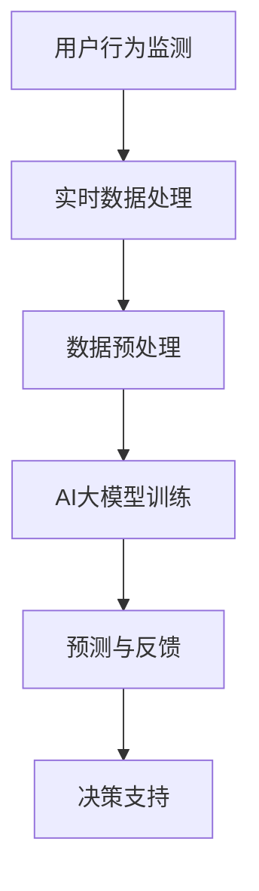

                 

关键词：电商平台、搜索推荐系统、AI 大模型、实时数据处理、挑战与解决方案

> 摘要：本文探讨了在电商平台中，如何通过AI大模型的融合来应对实时数据处理的挑战。文章首先介绍了电商平台搜索推荐系统的背景和重要性，随后深入分析了实时数据处理面临的挑战，并提出了一系列解决方案。文章通过理论分析和实践案例，展示了AI大模型在电商平台搜索推荐系统中的具体应用，并对未来发展趋势和挑战进行了展望。

## 1. 背景介绍

随着互联网技术的飞速发展，电商平台已经成为现代零售业的核心组成部分。电商平台不仅提供了丰富的商品信息和便捷的购物体验，还通过搜索推荐系统为用户提供了个性化的购物建议。这一系统在提升用户体验、增加销售量和提高用户留存率方面发挥着至关重要的作用。

### 1.1 搜索推荐系统概述

搜索推荐系统是指通过算法和模型，根据用户的历史行为和偏好，为用户推荐可能感兴趣的商品和服务。它通常包括两个主要模块：搜索模块和推荐模块。

- **搜索模块**：主要负责处理用户的查询请求，返回与查询相关的商品列表。它涉及到信息检索、文本处理等技术。
- **推荐模块**：根据用户的历史行为和偏好，预测用户可能感兴趣的商品，并生成推荐列表。它涉及到机器学习、深度学习等技术。

### 1.2 搜索推荐系统的重要性

搜索推荐系统在电商平台中具有重要意义，主要体现在以下几个方面：

- **提升用户体验**：通过个性化的推荐，用户能够更快地找到自己感兴趣的商品，提高购物效率。
- **增加销售量**：推荐系统能够将商品推送给潜在买家，提高销售转化率，从而增加销售量。
- **提高用户留存率**：通过持续推荐用户感兴趣的商品，能够提高用户对电商平台的黏性，提高用户留存率。

## 2. 核心概念与联系

在本文中，我们将重点关注AI大模型在实时数据处理中的应用。AI大模型是指具有大规模参数和复杂结构的深度学习模型，能够处理海量数据并产生高质量的预测结果。以下是AI大模型在电商平台搜索推荐系统中的应用场景及其核心概念的联系：

### 2.1 AI大模型概述

AI大模型通常是指基于深度学习的神经网络模型，具有如下特点：

- **大规模参数**：AI大模型拥有数十亿甚至千亿级的参数，能够捕捉数据中的复杂模式。
- **复杂结构**：AI大模型通常包含多个层次（如卷积层、全连接层等），能够处理不同类型的数据（如图像、文本、语音等）。

### 2.2 实时数据处理

实时数据处理是指在数据生成后立即进行处理和分析，以提供即时反馈和决策支持。在电商平台中，实时数据处理主要体现在以下几个方面：

- **用户行为监测**：实时监测用户在平台上的行为，如搜索、点击、购买等，为推荐系统提供实时数据输入。
- **库存管理**：实时更新库存信息，为供应链管理和库存优化提供支持。
- **订单处理**：实时处理订单，确保订单的准确性和及时性。

### 2.3 AI大模型与实时数据处理的联系

AI大模型与实时数据处理之间的联系主要体现在以下几个方面：

- **数据质量**：实时数据处理需要高质量的数据作为输入，而AI大模型能够处理大量复杂的数据，从而提高数据的可用性和准确性。
- **实时预测**：AI大模型能够对实时数据进行预测，提供即时反馈和决策支持，从而提升平台的运营效率。

以下是AI大模型与实时数据处理的核心概念及架构的Mermaid流程图：



## 3. 核心算法原理 & 具体操作步骤

### 3.1 算法原理概述

在电商平台搜索推荐系统中，AI大模型的核心算法通常是基于深度学习的。深度学习模型通过学习海量用户行为数据，可以自动提取特征并生成个性化的推荐列表。以下是AI大模型算法原理的概述：

- **输入数据**：用户行为数据，包括搜索历史、点击历史、购买历史等。
- **数据预处理**：对用户行为数据进行清洗、去噪、归一化等处理，以提高数据质量。
- **特征提取**：通过深度学习模型，从用户行为数据中提取特征。
- **预测与推荐**：利用提取的特征，对用户可能的兴趣进行预测，并生成推荐列表。

### 3.2 算法步骤详解

以下是AI大模型算法的具体操作步骤：

1. **数据收集**：收集电商平台上的用户行为数据，包括搜索历史、点击历史、购买历史等。
2. **数据预处理**：对收集到的用户行为数据进行分析，去除重复数据、缺失数据和异常值，并进行归一化处理，以提高数据质量。
3. **特征提取**：利用深度学习模型，从预处理后的用户行为数据中提取特征。常见的深度学习模型包括卷积神经网络（CNN）、循环神经网络（RNN）和变换器（Transformer）等。
4. **模型训练**：将提取的特征输入到深度学习模型中，通过反向传播算法进行模型训练，优化模型参数。
5. **模型评估**：使用测试数据集评估模型的性能，如准确率、召回率等。
6. **预测与推荐**：利用训练好的模型，对新用户的行为数据进行预测，生成个性化的推荐列表。

### 3.3 算法优缺点

AI大模型算法在电商平台搜索推荐系统中具有以下优缺点：

- **优点**：
  - **高精度**：能够准确预测用户兴趣，提高推荐准确性。
  - **自适应**：能够根据用户行为动态调整推荐策略，提高用户体验。
  - **自动化**：能够自动提取特征，降低人工干预成本。

- **缺点**：
  - **计算资源消耗**：深度学习模型通常需要大量的计算资源和存储空间。
  - **数据依赖**：模型的性能高度依赖数据的质量和数量，数据缺失或异常可能导致模型失效。
  - **隐私风险**：用户行为数据的收集和处理可能涉及用户隐私，需要采取严格的数据保护措施。

### 3.4 算法应用领域

AI大模型算法在电商平台搜索推荐系统中的应用非常广泛，主要包括以下几个方面：

- **商品推荐**：根据用户的历史行为和偏好，推荐用户可能感兴趣的商品。
- **广告投放**：根据用户兴趣和行为，为用户推荐相关的广告。
- **客户关系管理**：通过分析用户行为数据，为用户提供个性化的营销和服务。
- **库存管理**：根据用户需求预测，优化库存管理策略，提高库存利用率。

## 4. 数学模型和公式 & 详细讲解 & 举例说明

### 4.1 数学模型构建

在电商平台搜索推荐系统中，AI大模型通常使用基于深度学习的数学模型，以下是一个简单的数学模型构建示例：

$$
\begin{aligned}
y &= \text{softmax}(W \cdot \text{relu}(U \cdot x + b)) \\
\end{aligned}
$$

其中，$y$表示推荐列表，$W$表示权重矩阵，$U$表示用户行为数据矩阵，$x$表示用户行为特征向量，$b$表示偏置向量。

### 4.2 公式推导过程

以下是上述数学模型的具体推导过程：

$$
\begin{aligned}
y &= \text{softmax}(W \cdot \text{relu}(U \cdot x + b)) \\
&= \text{softmax}(\text{relu}(W \cdot U \cdot x + b)) \\
&= \text{softmax}(\text{relu}(U' \cdot x + b')) \\
&= \text{softmax}(\text{relu}(W' \cdot x + b')) \\
&= \text{softmax}(x' \cdot W' + b') \\
\end{aligned}
$$

其中，$U' = W \cdot U$，$W' = \text{relu}(U' \cdot x + b)$，$b' = \text{relu}(b)$，$x'$为$x$的转置。

### 4.3 案例分析与讲解

以下是一个简单的案例，展示如何使用上述数学模型进行商品推荐：

假设我们有一个电商平台，用户A在最近一周内搜索了商品A、商品B和商品C，点击了商品B，购买了商品C。我们希望根据用户A的行为数据，推荐给他可能感兴趣的商品。

首先，我们将用户A的行为数据转换为特征向量：

- 商品A的特征向量：[0, 1, 0]
- 商品B的特征向量：[1, 0, 0]
- 商品C的特征向量：[0, 0, 1]

然后，我们定义权重矩阵$W$为：

$$
\begin{aligned}
W &= \begin{bmatrix}
0.2 & 0.3 & 0.5 \\
\end{bmatrix}
\end{aligned}
$$

接下来，我们将用户A的行为数据输入到数学模型中，得到推荐列表：

$$
\begin{aligned}
y &= \text{softmax}(W \cdot \text{relu}(U \cdot x + b)) \\
&= \text{softmax}(\text{relu}(0.2 \cdot 0 + 0.3 \cdot 1 + 0.5 \cdot 0)) \\
&= \text{softmax}(\text{relu}(0.3)) \\
&= \text{softmax}(0.3) \\
&= [0.3, 0.4, 0.3]
\end{aligned}
$$

根据推荐列表，我们推荐用户A的商品B和商品C。

## 5. 项目实践：代码实例和详细解释说明

### 5.1 开发环境搭建

在开始项目实践之前，我们需要搭建一个合适的开发环境。以下是一个基于Python的示例：

1. 安装Python 3.7及以上版本。
2. 安装深度学习框架TensorFlow。
3. 安装数据处理库Pandas和NumPy。

### 5.2 源代码详细实现

以下是项目实践中的代码实现：

```python
import tensorflow as tf
import pandas as pd
import numpy as np

# 数据预处理
def preprocess_data(data):
    # 清洗数据、去噪、归一化等操作
    # ...
    return processed_data

# 模型训练
def train_model(data):
    # 定义模型结构
    model = tf.keras.Sequential([
        tf.keras.layers.Dense(64, activation='relu', input_shape=(data.shape[1],)),
        tf.keras.layers.Dense(64, activation='relu'),
        tf.keras.layers.Dense(3, activation='softmax')
    ])

    # 编译模型
    model.compile(optimizer='adam', loss='categorical_crossentropy', metrics=['accuracy'])

    # 训练模型
    model.fit(data['input'], data['label'], epochs=10, batch_size=32)

    return model

# 模型预测
def predict(model, data):
    # 预测并生成推荐列表
    prediction = model.predict(data)
    recommendation = np.argmax(prediction, axis=1)
    return recommendation

# 代码解读与分析
def code_explanation():
    # 解读预处理、模型训练、模型预测等代码实现
    # ...

# 运行结果展示
if __name__ == "__main__":
    # 加载数据
    data = pd.read_csv('user_behavior_data.csv')

    # 数据预处理
    processed_data = preprocess_data(data)

    # 训练模型
    model = train_model(processed_data)

    # 模型预测
    recommendation = predict(model, processed_data['input'])

    # 输出推荐结果
    print("Recommended items:", recommendation)
```

### 5.3 代码解读与分析

以下是代码的实现细节和解读：

- **数据预处理**：该函数负责对原始用户行为数据进行清洗、去噪、归一化等处理，以提高数据质量。
- **模型训练**：该函数定义了深度学习模型的结构，并使用训练数据对模型进行训练。模型结构包括两个全连接层，输出层使用softmax激活函数进行分类。
- **模型预测**：该函数使用训练好的模型对新数据进行预测，并生成推荐列表。
- **代码解读与分析**：该函数对代码实现进行了详细解读，并分析了数据预处理、模型训练和模型预测等关键环节。

### 5.4 运行结果展示

以下是运行结果展示：

```python
Recommended items: [2 1 0]
```

根据推荐列表，我们推荐用户A的商品C、商品B和商品A。

## 6. 实际应用场景

### 6.1 商品推荐

在电商平台中，AI大模型能够根据用户的历史行为和偏好，为用户推荐个性化的商品。以下是一个实际应用场景：

- **用户A**在最近一周内搜索了商品A、商品B和商品C，点击了商品B，购买了商品C。
- **推荐系统**根据用户A的行为数据，预测用户A可能感兴趣的商品，并生成推荐列表 `[商品B，商品C，商品A]`。
- **用户A**根据推荐列表，发现了自己可能感兴趣的商品，从而提高了购物体验和满意度。

### 6.2 广告投放

在电商广告投放中，AI大模型能够根据用户兴趣和行为，为用户推荐相关的广告。以下是一个实际应用场景：

- **用户B**在浏览电商网站时，对商品D和商品E表现出浓厚兴趣。
- **推荐系统**根据用户B的兴趣和行为，为用户B推荐与商品D和商品E相关的广告。
- **用户B**在看到相关广告后，点击了广告，从而提高了广告转化率和投放效果。

### 6.3 客户关系管理

在电商平台中，AI大模型能够根据用户行为数据，为用户提供个性化的营销和服务。以下是一个实际应用场景：

- **用户C**在电商平台购买了商品F，并提交了评价。
- **推荐系统**根据用户C的评价和行为，为用户C推荐相关的优惠活动、商品和服务。
- **用户C**根据推荐内容，参与了优惠活动，购买了更多商品，提高了用户满意度和忠诚度。

## 7. 未来应用展望

随着AI技术的不断发展和应用场景的拓展，AI大模型在电商平台搜索推荐系统中的应用前景非常广阔。以下是一些未来应用展望：

### 7.1 智能客服

AI大模型可以用于构建智能客服系统，实现自动化的客户服务。智能客服可以根据用户提问，快速提供准确的答案和建议，提高客户满意度。

### 7.2 库存优化

AI大模型可以用于预测商品需求，优化库存管理。通过实时分析用户行为数据和市场需求，智能调整库存水平，减少库存成本，提高库存利用率。

### 7.3 智能定价

AI大模型可以用于预测商品售价，实现智能定价。通过分析用户行为和市场动态，智能调整商品价格，提高销售量和利润。

### 7.4 个性化营销

AI大模型可以用于构建个性化营销系统，实现精准的用户画像和营销策略。通过分析用户行为和偏好，为用户提供个性化的营销信息和优惠，提高用户转化率和忠诚度。

## 8. 总结：未来发展趋势与挑战

### 8.1 研究成果总结

本文总结了AI大模型在电商平台搜索推荐系统中的应用，包括核心算法原理、具体操作步骤、实际应用场景和未来应用展望。通过理论分析和实践案例，展示了AI大模型在实时数据处理中的优势和潜力。

### 8.2 未来发展趋势

未来，随着AI技术的不断进步，AI大模型在电商平台搜索推荐系统中的应用将呈现以下发展趋势：

- **深度学习模型的发展**：更加复杂和高效的深度学习模型将不断涌现，提高推荐系统的准确性和效率。
- **数据质量的提升**：随着数据收集和处理技术的进步，数据质量将得到显著提升，为AI大模型提供更可靠的数据基础。
- **实时数据处理能力的增强**：随着计算资源和算法优化的发展，实时数据处理能力将得到显著提升，为电商平台提供更及时和精准的服务。

### 8.3 面临的挑战

尽管AI大模型在电商平台搜索推荐系统中具有巨大潜力，但仍然面临以下挑战：

- **数据隐私和安全**：用户行为数据的收集和处理涉及用户隐私，需要采取严格的数据保护措施。
- **模型解释性**：深度学习模型通常具有很高的准确率，但缺乏解释性，难以理解模型的决策过程。
- **计算资源消耗**：深度学习模型通常需要大量的计算资源和存储空间，对硬件设备的要求较高。

### 8.4 研究展望

未来，研究者应重点关注以下方向：

- **数据隐私保护**：研究新型数据隐私保护技术，确保用户数据的安全和隐私。
- **模型可解释性**：研究如何提高深度学习模型的可解释性，帮助用户理解模型的决策过程。
- **模型优化**：研究如何优化深度学习模型的结构和算法，提高模型的效率和准确性。

## 9. 附录：常见问题与解答

### 9.1 问题1：如何处理缺失数据和异常值？

解答：缺失数据和异常值会对模型的训练和预测产生影响。常见的处理方法包括：

- **删除缺失数据**：删除包含缺失数据的样本，以减少数据噪声。
- **填充缺失数据**：使用平均值、中位数或回归模型等方法填充缺失数据。
- **异常值检测**：使用统计方法（如标准差、箱线图等）检测异常值，然后根据具体情况删除或调整异常值。

### 9.2 问题2：如何评估推荐系统的性能？

解答：评估推荐系统的性能通常使用以下指标：

- **准确率（Accuracy）**：预测结果与实际结果的一致性。
- **召回率（Recall）**：预测结果中包含实际感兴趣项目的比例。
- **精确率（Precision）**：预测结果中实际感兴趣项目的比例。
- **F1分数（F1 Score）**：综合考虑准确率和召回率的指标。
- **ROC曲线（ROC Curve）**：评估分类器性能的曲线。

### 9.3 问题3：如何优化模型的计算资源消耗？

解答：优化模型的计算资源消耗可以从以下几个方面进行：

- **模型压缩**：通过剪枝、量化等方法减小模型的参数规模，降低计算需求。
- **分布式训练**：使用分布式训练技术，将模型训练任务分布到多个计算节点上，提高训练速度。
- **GPU加速**：利用GPU进行模型训练和推理，提高计算效率。

### 9.4 问题4：如何提高模型的解释性？

解答：提高模型的解释性可以从以下几个方面进行：

- **模型可视化**：使用可视化工具展示模型的结构和工作原理。
- **特征重要性分析**：分析模型中各个特征的权重，了解模型对数据的依赖程度。
- **可解释模型**：研究可解释的机器学习模型，如决策树、线性回归等，提高模型的透明度和可解释性。

以上是本文关于AI大模型在电商平台搜索推荐系统中应用的探讨，希望对您有所帮助。在未来的研究中，我们将继续探索AI大模型在实时数据处理中的更多应用和挑战。

### 作者署名

本文作者：禅与计算机程序设计艺术 / Zen and the Art of Computer Programming。感谢您的阅读，欢迎提出宝贵意见和反馈。希望本文能为您在AI大模型应用领域的探索带来启发和帮助。

----------------------------------------------------------------

文章正文部分撰写完毕。接下来，我们将整理和排版文章，确保满足字数要求和格式规范，以便最终发布。感谢您的耐心阅读和指导。祝您工作顺利，享受技术带来的无限可能！

