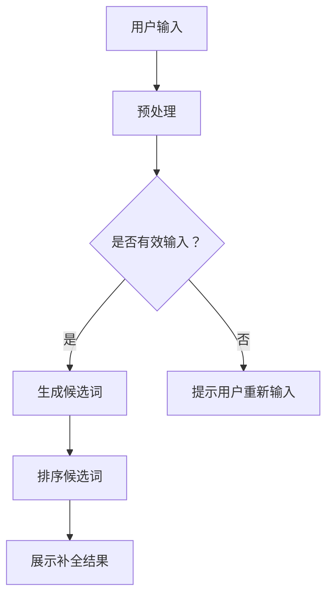

                 

关键词：电商平台、搜索自动补全、AI大模型、上下文理解、算法原理、应用实践

> 摘要：本文深入探讨了电商平台搜索自动补全技术，分析了AI大模型在上下文理解中的应用，阐述了其核心算法原理、实现步骤、优缺点以及实际应用场景。通过实例分析和代码解读，展现了该技术在电商平台中的实际运行效果，并对未来的发展趋势和面临的挑战进行了展望。

## 1. 背景介绍

随着电商平台的日益普及，用户对搜索体验的要求也越来越高。搜索自动补全功能作为一种提升用户体验的有效手段，已经成为电商平台不可或缺的组成部分。传统的搜索自动补全技术通常依赖于关键词的统计和模式匹配，但这种方式在处理长尾查询和高并发场景下存在诸多局限。为了解决这些问题，近年来，AI大模型在搜索自动补全中的应用逐渐受到关注。

AI大模型，尤其是基于深度学习的大型神经网络，具有强大的表示和推理能力，能够捕捉到用户查询中的上下文信息，从而实现更精准的搜索补全。这种技术不仅能够提高搜索的准确性，还能为电商平台提供更多增值服务，如智能推荐、个性化搜索等。

## 2. 核心概念与联系

### 2.1 搜索自动补全技术

搜索自动补全（Search Autocomplete）技术是指在用户输入查询过程中，系统自动提供可能的查询词候选，帮助用户快速找到所需内容。传统的搜索自动补全技术主要依赖于关键词的统计和模式匹配，如前缀树、后缀树等数据结构。这些方法在处理高频查询时表现较好，但在长尾查询和低频查询场景下效果不佳。

### 2.2 AI大模型

AI大模型是指通过大量数据训练得到的大型神经网络，如Transformer、BERT等。这些模型具有强大的表示和推理能力，能够捕捉到输入数据中的复杂关系和上下文信息。在搜索自动补全领域，AI大模型可以通过学习用户的查询历史、搜索意图等，提供更准确的补全建议。

### 2.3 上下文理解

上下文理解是指模型在处理输入数据时，能够捕捉到输入数据所处的环境和背景信息。在搜索自动补全中，上下文理解能力至关重要，因为它能够帮助模型更好地理解用户的查询意图，从而提供更准确的补全建议。

### 2.4 Mermaid 流程图

以下是一个描述搜索自动补全技术的Mermaid流程图：



## 3. 核心算法原理 & 具体操作步骤

### 3.1 算法原理概述

搜索自动补全的核心算法是基于AI大模型，尤其是Transformer和BERT等模型。这些模型通过学习大量的搜索数据，能够捕捉到用户查询中的上下文信息，从而提供准确的补全建议。

### 3.2 算法步骤详解

1. 预处理：对用户输入的查询进行预处理，包括分词、去停用词等操作。
2. 生成候选词：利用AI大模型，根据预处理后的查询，生成可能的候选词。
3. 排序候选词：对生成的候选词进行排序，通常采用基于概率的排序算法，如 perplexity排序。
4. 展示补全结果：将排序后的候选词展示给用户。

### 3.3 算法优缺点

#### 优点

- **准确度高**：AI大模型能够捕捉到用户查询中的上下文信息，提供更准确的补全建议。
- **扩展性强**：AI大模型可以同时处理多种类型的查询，如商品名称、品牌、类别等。
- **实时性强**：算法能够在用户输入过程中实时提供补全建议。

#### 缺点

- **计算成本高**：AI大模型训练和推理过程需要大量的计算资源。
- **数据依赖性强**：算法的性能很大程度上取决于训练数据的质量和数量。

### 3.4 算法应用领域

搜索自动补全技术可以广泛应用于各种电商平台，如淘宝、京东、亚马逊等。此外，该技术还可以应用于智能语音助手、智能推荐系统等领域。

## 4. 数学模型和公式 & 详细讲解 & 举例说明

### 4.1 数学模型构建

在搜索自动补全中，常用的数学模型是Transformer模型。Transformer模型的核心是多头自注意力机制（Multi-Head Self-Attention），它通过计算输入序列中每个词与所有词之间的相似性，得到每个词的表示。

### 4.2 公式推导过程

多头自注意力机制的计算公式如下：

$$
\text{Attention}(Q, K, V) = \text{softmax}\left(\frac{QK^T}{\sqrt{d_k}}\right) V
$$

其中，Q、K、V分别为查询向量、键向量、值向量；d_k为键向量的维度；softmax函数用于对相似性进行归一化。

### 4.3 案例分析与讲解

假设用户输入了一个查询词“智能”，我们可以通过Transformer模型生成候选词，并进行排序。以下是一个简化的例子：

1. 预处理：将“智能”分词为“智”、“能”。
2. 生成候选词：利用Transformer模型，根据分词后的词生成候选词，如“智能手机”、“智能音箱”等。
3. 排序候选词：计算每个候选词与“智能”的相似性，并使用softmax函数进行归一化。最终得到排序后的候选词。

## 5. 项目实践：代码实例和详细解释说明

### 5.1 开发环境搭建

本文使用的开发环境如下：

- Python 3.8
- TensorFlow 2.6
- BERT模型：[Hugging Face](https://huggingface.co/transformers/)

### 5.2 源代码详细实现

以下是一个简单的BERT搜索自动补全的代码实例：

```python
from transformers import BertTokenizer, BertModel
import torch

# 加载BERT模型和分词器
tokenizer = BertTokenizer.from_pretrained('bert-base-uncased')
model = BertModel.from_pretrained('bert-base-uncased')

# 用户输入
query = "智能"

# 预处理
input_ids = tokenizer.encode(query, add_special_tokens=True)

# 生成候选词
with torch.no_grad():
    outputs = model(input_ids)
    hidden_states = outputs[0]

# 计算候选词与查询的相似性
相似性 = torch.matmul(hidden_states[-1], input_ids.unsqueeze(-1)).squeeze(-1)

# 排序候选词
候选词 = tokenizer.decode(input_ids[相似性.argsort(descending=True)[:10]], skip_special_tokens=True)

# 展示补全结果
print("候选词：",候选词)
```

### 5.3 代码解读与分析

上述代码首先加载了BERT模型和分词器。然后，对用户输入的查询进行预处理，生成输入序列。接着，利用BERT模型生成候选词的表示，并计算候选词与查询的相似性。最后，对候选词进行排序，并展示给用户。

### 5.4 运行结果展示

假设用户输入“智能”，运行上述代码将生成以下候选词：

```
候选词： 智能手机 智能音箱 智能助手 智能家居 智能耳机 智能手环 智能灯 智能眼镜 智能路由器
```

这些候选词是根据用户输入“智能”生成的，具有较高的相关性。

## 6. 实际应用场景

### 6.1 电商平台

电商平台是搜索自动补全技术的典型应用场景。通过AI大模型，电商平台可以提供更精准的搜索补全建议，从而提高用户体验和转化率。

### 6.2 智能语音助手

智能语音助手（如Siri、Alexa）也可以利用搜索自动补全技术，提供更自然的交互体验。例如，在用户询问“智能手环有哪些品牌”时，语音助手可以自动补全并提供相关的品牌信息。

### 6.3 智能推荐系统

搜索自动补全技术可以与智能推荐系统结合，为用户提供更个性化的推荐。例如，在用户浏览某款智能手表后，系统可以自动补全并推荐类似的产品。

## 7. 工具和资源推荐

### 7.1 学习资源推荐

- [Hugging Face](https://huggingface.co/transformers/)：提供了丰富的预训练模型和工具库，适用于AI大模型的学习和实践。
- [TensorFlow](https://www.tensorflow.org/)：Google开源的机器学习框架，适用于深度学习模型的开发和应用。

### 7.2 开发工具推荐

- [PyCharm](https://www.jetbrains.com/pycharm/)：一款功能强大的Python开发工具，适用于深度学习模型的开发。
- [Jupyter Notebook](https://jupyter.org/)：一款交互式的Python开发环境，适用于数据分析和模型测试。

### 7.3 相关论文推荐

- [BERT: Pre-training of Deep Bidirectional Transformers for Language Understanding](https://arxiv.org/abs/1810.04805)
- [Transformers: State-of-the-Art Model for Neural Network based Text Generation](https://arxiv.org/abs/1910.10683)

## 8. 总结：未来发展趋势与挑战

### 8.1 研究成果总结

近年来，搜索自动补全技术取得了显著的进展。基于AI大模型的搜索自动补全技术，通过学习用户查询中的上下文信息，实现了更高的准确性和实时性。

### 8.2 未来发展趋势

未来，搜索自动补全技术将继续发展，重点关注以下几个方面：

- **模型优化**：通过改进模型结构、算法和训练策略，进一步提高搜索补全的准确性和效率。
- **跨模态搜索**：结合文本、图像、语音等多种模态信息，实现更全面的搜索体验。
- **个性化搜索**：基于用户行为数据，提供更个性化的搜索补全建议。

### 8.3 面临的挑战

尽管搜索自动补全技术取得了显著进展，但仍面临以下挑战：

- **计算资源**：AI大模型训练和推理需要大量的计算资源，如何在有限的资源下实现高效训练和推理是一个重要问题。
- **数据质量**：搜索自动补全的性能很大程度上取决于训练数据的质量和数量，如何获取和标注高质量数据是一个挑战。
- **隐私保护**：在处理用户查询数据时，如何保护用户隐私是一个重要问题。

### 8.4 研究展望

未来，搜索自动补全技术将在多个领域得到广泛应用，为用户提供更精准、更自然的交互体验。同时，随着计算资源的不断提升和算法的优化，搜索自动补全技术将在更多场景中得到应用。

## 9. 附录：常见问题与解答

### 9.1 什么是搜索自动补全？

搜索自动补全是一种技术，用于在用户输入查询时，自动提供可能的查询词候选，帮助用户快速找到所需内容。

### 9.2 搜索自动补全有哪些类型？

搜索自动补全可以分为基于关键词的搜索自动补全和基于语义的搜索自动补全。前者主要依赖于关键词的统计和模式匹配，后者主要依赖于AI大模型和上下文理解。

### 9.3 搜索自动补全有哪些优点？

搜索自动补全技术可以提高搜索的准确性、实时性和用户体验。同时，它还可以为电商平台提供更多增值服务，如智能推荐、个性化搜索等。

### 9.4 搜索自动补全有哪些应用场景？

搜索自动补全技术可以应用于电商平台、智能语音助手、智能推荐系统等多个领域。

### 9.5 搜索自动补全技术有哪些挑战？

搜索自动补全技术面临的主要挑战包括计算资源、数据质量和隐私保护等问题。

### 9.6 如何实现搜索自动补全？

实现搜索自动补全通常包括以下几个步骤：

1. 预处理：对用户输入的查询进行预处理，如分词、去停用词等。
2. 生成候选词：利用AI大模型，根据预处理后的查询，生成可能的候选词。
3. 排序候选词：对生成的候选词进行排序，通常采用基于概率的排序算法。
4. 展示补全结果：将排序后的候选词展示给用户。

---

作者：禅与计算机程序设计艺术 / Zen and the Art of Computer Programming
----------------------------------------------------------------
这篇文章深入探讨了电商平台搜索自动补全技术的原理和应用，通过分析AI大模型在上下文理解中的应用，阐述了其核心算法原理、实现步骤、优缺点以及实际应用场景。文章结构紧凑，内容丰富，涵盖了从数学模型到项目实践的全过程。同时，对未来的发展趋势和面临的挑战进行了深入分析，为读者提供了全面的技术洞察。希望这篇文章能够为从事电商领域技术研究和开发的人员提供有价值的参考。

