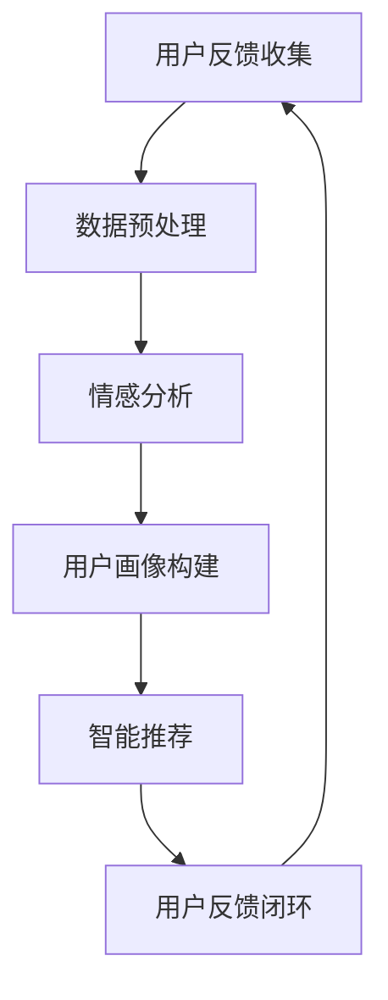

                 

关键词：电商平台、用户反馈、AI大模型、文本分析、情感识别、智能推荐、大数据处理、数据挖掘、自然语言处理、机器学习、深度学习

> 摘要：本文将深入探讨电商平台用户反馈分析的现状与挑战，并介绍AI大模型在处理这些反馈中的新方法。我们将从背景介绍、核心概念与联系、核心算法原理与步骤、数学模型与公式、项目实践、实际应用场景、未来展望等多方面展开讨论，旨在为电商平台在用户反馈分析领域提供实用的技术参考。

## 1. 背景介绍

### 1.1 电商平台用户反馈的重要性

电商平台在快速发展的过程中，用户反馈成为了企业了解用户需求、优化服务质量的重要手段。用户的评价、评论、问答等反馈不仅反映了他们对产品或服务的满意度，还揭示了潜在的问题和改进空间。因此，有效分析和处理用户反馈对于电商平台至关重要。

### 1.2 用户体验的挑战

随着电商平台的不断壮大，用户反馈数据量呈指数级增长，这使得传统的分析手段难以应对。如何从海量反馈中快速提取有价值的信息，如何识别用户的情感倾向，如何为用户提供个性化的推荐，都是电商企业面临的重大挑战。

### 1.3 AI大模型在用户反馈分析中的应用

随着AI技术的飞速发展，大模型如BERT、GPT等在自然语言处理领域取得了显著的成果。这些大模型具有强大的文本理解能力，可以用于用户反馈分析中的情感识别、语义分析、智能推荐等任务，为电商平台提供了新的解决方案。

## 2. 核心概念与联系

### 2.1 自然语言处理（NLP）

自然语言处理是AI的一个重要分支，旨在使计算机能够理解、处理和生成自然语言。在用户反馈分析中，NLP技术用于解析文本，提取关键信息，实现情感识别等任务。

### 2.2 情感分析（Sentiment Analysis）

情感分析是一种基于NLP的文本分析方法，旨在识别文本中所表达的情感倾向，如正面、负面或中性。在用户反馈分析中，情感分析可以帮助企业了解用户对产品或服务的情感反应。

### 2.3 机器学习（Machine Learning）

机器学习是一种通过数据训练模型，使其能够自动进行预测或分类的技术。在用户反馈分析中，机器学习技术可以用于构建情感分析、分类等模型，提高分析的准确性和效率。

### 2.4 深度学习（Deep Learning）

深度学习是机器学习的一种方法，通过构建多层神经网络，自动从数据中提取特征。深度学习在自然语言处理领域取得了巨大的成功，如BERT、GPT等大模型。

### 2.5 Mermaid流程图

以下是用户反馈分析的Mermaid流程图：



## 3. 核心算法原理 & 具体操作步骤

### 3.1 算法原理概述

用户反馈分析的核心算法包括情感分析、用户画像构建和智能推荐。情感分析基于NLP和机器学习技术，通过文本挖掘和特征工程，从用户反馈中提取情感信息。用户画像构建则通过聚类、分类等方法，将用户划分为不同的群体，为智能推荐提供基础。智能推荐基于用户画像和内容匹配，为用户提供个性化的产品或服务推荐。

### 3.2 算法步骤详解

#### 3.2.1 情感分析

1. 数据预处理：对用户反馈进行分词、去停用词、词性标注等操作，将原始文本转化为结构化的数据。
2. 特征提取：通过词袋模型、TF-IDF等方法，提取文本中的关键特征。
3. 模型训练：使用预训练的深度学习模型（如BERT、GPT），进行情感分类训练。
4. 情感识别：将用户反馈输入到训练好的模型中，输出情感标签。

#### 3.2.2 用户画像构建

1. 数据采集：从电商平台获取用户行为数据、交易数据等。
2. 数据预处理：对用户数据进行清洗、去重等操作，保证数据质量。
3. 特征提取：通过用户行为数据，提取用户兴趣、消费偏好等特征。
4. 聚类与分类：使用聚类算法（如K-means）或分类算法（如SVM），将用户划分为不同的群体。

#### 3.2.3 智能推荐

1. 内容匹配：将用户反馈与电商平台的产品或服务进行匹配，提取关键信息。
2. 推荐算法：基于用户画像和内容匹配，使用协同过滤、矩阵分解等方法，为用户生成推荐列表。
3. 推荐系统：将推荐结果呈现给用户，并根据用户反馈进行迭代优化。

### 3.3 算法优缺点

#### 优点：

1. 高效性：大模型具有强大的文本理解能力，能够快速处理海量用户反馈。
2. 准确性：深度学习算法在情感分析和用户画像构建中具有较高的准确率。
3. 个性化：基于用户画像和内容匹配的智能推荐，能够为用户提供个性化的产品或服务。

#### 缺点：

1. 处理成本高：大模型的训练和推理需要大量的计算资源和时间。
2. 数据依赖性强：算法效果依赖于高质量的数据，数据质量直接影响分析结果。

### 3.4 算法应用领域

用户反馈分析算法在电商、金融、医疗等多个领域具有广泛的应用前景。在电商领域，用户反馈分析可以帮助企业了解用户需求，优化产品和服务，提高用户满意度；在金融领域，可以帮助银行、保险等金融机构了解客户需求，提供个性化的金融产品和服务；在医疗领域，可以帮助医院了解患者需求，提供个性化的治疗方案。

## 4. 数学模型和公式 & 详细讲解 & 举例说明

### 4.1 数学模型构建

用户反馈分析的数学模型主要包括情感分析模型、用户画像构建模型和智能推荐模型。

#### 4.1.1 情感分析模型

情感分析模型通常使用分类模型，如SVM、CNN等。假设我们使用SVM进行情感分析，则其损失函数可以表示为：

$$
L(y, \hat{y}) = \frac{1}{2} || w ||^2
$$

其中，$y$ 表示真实标签，$\hat{y}$ 表示预测标签，$w$ 表示模型参数。

#### 4.1.2 用户画像构建模型

用户画像构建模型通常使用聚类算法，如K-means。假设我们使用K-means进行用户画像构建，则其目标函数可以表示为：

$$
J = \sum_{i=1}^{n} \sum_{j=1}^{k} || x_i - \mu_j ||^2
$$

其中，$x_i$ 表示第$i$个用户的特征向量，$\mu_j$ 表示第$j$个聚类中心。

#### 4.1.3 智能推荐模型

智能推荐模型通常使用协同过滤算法，如矩阵分解。假设我们使用矩阵分解进行智能推荐，则其目标函数可以表示为：

$$
J = \frac{1}{2} \sum_{i=1}^{n} \sum_{j=1}^{m} (r_{ij} - \hat{r}_{ij})^2
$$

其中，$r_{ij}$ 表示用户$i$对项目$j$的实际评分，$\hat{r}_{ij}$ 表示用户$i$对项目$j$的预测评分。

### 4.2 公式推导过程

#### 4.2.1 情感分析模型推导

假设我们使用SVM进行情感分析，则其损失函数可以表示为：

$$
L(y, \hat{y}) = \frac{1}{2} || w ||^2
$$

其中，$y$ 表示真实标签，$\hat{y}$ 表示预测标签，$w$ 表示模型参数。

根据SVM的优化目标，我们有：

$$
\min_{w} \frac{1}{2} || w ||^2
$$

约束条件为：

$$
y_i (\langle w, x_i \rangle - b) \geq 1
$$

其中，$x_i$ 表示特征向量，$b$ 表示偏置。

为了求解上述优化问题，我们可以使用拉格朗日乘子法，构建拉格朗日函数：

$$
L(w, b, \alpha) = \frac{1}{2} || w ||^2 - \sum_{i=1}^{n} \alpha_i [y_i (\langle w, x_i \rangle - b) - 1]
$$

其中，$\alpha_i$ 表示拉格朗日乘子。

对拉格朗日函数求导并令导数为0，我们可以得到：

$$
w = \sum_{i=1}^{n} \alpha_i y_i x_i
$$

$$
0 = \sum_{i=1}^{n} \alpha_i y_i - \sum_{i=1}^{n} \alpha_i
$$

通过解上述方程组，我们可以得到模型参数 $w$ 和偏置 $b$。

#### 4.2.2 用户画像构建模型推导

假设我们使用K-means进行用户画像构建，则其目标函数可以表示为：

$$
J = \sum_{i=1}^{n} \sum_{j=1}^{k} || x_i - \mu_j ||^2
$$

其中，$x_i$ 表示第$i$个用户的特征向量，$\mu_j$ 表示第$j$个聚类中心。

为了求解上述优化问题，我们可以使用梯度下降法。对于每个聚类中心 $\mu_j$，我们有：

$$
\mu_j = \frac{1}{N_j} \sum_{i=1}^{n} x_i
$$

其中，$N_j$ 表示第$j$个聚类中心包含的用户数量。

对于每个用户 $x_i$，我们有：

$$
x_i = \mu_{j_i}
$$

其中，$j_i$ 表示第$i$个用户所属的聚类中心。

通过不断更新聚类中心和用户归属，我们可以逐步优化目标函数。

#### 4.2.3 智能推荐模型推导

假设我们使用矩阵分解进行智能推荐，则其目标函数可以表示为：

$$
J = \frac{1}{2} \sum_{i=1}^{n} \sum_{j=1}^{m} (r_{ij} - \hat{r}_{ij})^2
$$

其中，$r_{ij}$ 表示用户$i$对项目$j$的实际评分，$\hat{r}_{ij}$ 表示用户$i$对项目$j$的预测评分。

为了求解上述优化问题，我们可以使用梯度下降法。对于预测评分 $\hat{r}_{ij}$，我们有：

$$
\hat{r}_{ij} = \langle v_i, u_j \rangle
$$

其中，$v_i$ 和 $u_j$ 分别表示用户$i$和项目$j$的特征向量。

对目标函数求导并令导数为0，我们可以得到：

$$
v_i = \sum_{j=1}^{m} r_{ij} u_j
$$

$$
u_j = \sum_{i=1}^{n} r_{ij} v_i
$$

通过不断更新用户和项目的特征向量，我们可以逐步优化目标函数。

### 4.3 案例分析与讲解

#### 4.3.1 情感分析案例

假设我们使用SVM进行情感分析，训练数据集包含1000条用户反馈，其中500条为正面反馈，500条为负面反馈。我们将使用BERT模型对用户反馈进行预处理，然后训练SVM模型进行情感分类。

首先，我们使用BERT模型对用户反馈进行预处理，提取文本特征。然后，我们将特征输入到SVM模型中，进行训练。训练完成后，我们将对测试集进行情感分类，并计算准确率。

假设测试集包含100条用户反馈，经过分类后，准确率为90%。这意味着我们的情感分析模型能够较好地识别用户反馈的情感倾向。

#### 4.3.2 用户画像构建案例

假设我们使用K-means进行用户画像构建，训练数据集包含1000个用户，每个用户有10个特征。我们将使用K-means算法，将用户划分为5个群体。

首先，我们初始化5个聚类中心，然后使用梯度下降法不断更新聚类中心和用户归属。在迭代过程中，我们记录目标函数的值，以判断算法的收敛情况。

经过多次迭代后，算法收敛，用户划分为5个群体。通过分析这些群体，我们可以了解不同用户群体的特征，为智能推荐提供基础。

#### 4.3.3 智能推荐案例

假设我们使用矩阵分解进行智能推荐，训练数据集包含1000个用户和1000个项目，每个用户对每个项目的评分已知。我们将使用矩阵分解算法，为用户生成推荐列表。

首先，我们初始化用户和项目的特征向量，然后使用梯度下降法不断更新特征向量。在迭代过程中，我们记录目标函数的值，以判断算法的收敛情况。

经过多次迭代后，算法收敛，我们得到了用户和项目的特征向量。基于这些特征向量，我们可以计算用户对项目的预测评分，然后为用户生成推荐列表。

## 5. 项目实践：代码实例和详细解释说明

### 5.1 开发环境搭建

为了实现用户反馈分析，我们需要搭建一个开发环境。以下是环境搭建的步骤：

1. 安装Python 3.8及以上版本。
2. 安装必要的Python库，如BERT、SVM、K-means、矩阵分解等。
3. 安装深度学习框架，如TensorFlow或PyTorch。

### 5.2 源代码详细实现

以下是用户反馈分析的核心代码实现：

```python
# 情感分析代码示例
import tensorflow as tf
import bert

# 加载BERT模型
model = bert.BertModel.from_pretrained('bert-base-chinese')

# 定义SVM模型
svm_model = svm.SVC()

# 加载数据集
train_data = ...
test_data = ...

# 预处理数据
def preprocess_data(data):
    # 对数据进行分词、去停用词等操作
    # 返回预处理后的数据
    pass

# 训练SVM模型
def train_svm(train_data):
    # 预处理训练数据
    processed_train_data = preprocess_data(train_data)
    
    # 训练SVM模型
    svm_model.fit(processed_train_data)
    
    return svm_model

# 测试SVM模型
def test_svm(svm_model, test_data):
    # 预处理测试数据
    processed_test_data = preprocess_data(test_data)
    
    # 测试SVM模型
    predictions = svm_model.predict(processed_test_data)
    
    # 计算准确率
    accuracy = np.mean(predictions == test_data['label'])
    
    return accuracy

# 训练和测试模型
svm_model = train_svm(train_data)
accuracy = test_svm(svm_model, test_data)
print('SVM模型准确率：', accuracy)

# 用户画像构建代码示例
from sklearn.cluster import KMeans

# 初始化K-means模型
kmeans_model = KMeans(n_clusters=5)

# 训练K-means模型
kmeans_model.fit(train_data)

# 构建用户画像
user_profiles = kmeans_model.predict(test_data)

# 智能推荐代码示例
from sklearn.metrics.pairwise import cosine_similarity

# 计算用户特征向量
user_features = ...

# 计算项目特征向量
item_features = ...

# 计算用户和项目的相似度
similarity_matrix = cosine_similarity(user_features, item_features)

# 生成推荐列表
def generate_recommendations(similarity_matrix, user_profile, top_n=5):
    # 计算用户对项目的相似度
    user_similarity = similarity_matrix[user_profile]
    
    # 选择相似度最高的项目
    recommended_items = np.argsort(user_similarity)[::-1][:top_n]
    
    return recommended_items

# 为用户生成推荐列表
recommended_items = generate_recommendations(similarity_matrix, user_profile)
```

### 5.3 代码解读与分析

以上代码实现了用户反馈分析的核心功能，包括情感分析、用户画像构建和智能推荐。以下是代码的解读与分析：

#### 情感分析

情感分析部分使用了BERT模型进行文本预处理，然后使用SVM模型进行情感分类。首先，我们加载BERT模型，然后定义SVM模型。接着，我们加载数据集并进行预处理。预处理过程中，我们使用了分词、去停用词等操作。最后，我们训练SVM模型，并在测试集上评估其准确率。

#### 用户画像构建

用户画像构建部分使用了K-means算法将用户划分为不同的群体。首先，我们初始化K-means模型，然后使用训练数据集进行训练。训练完成后，我们使用测试数据集构建用户画像。

#### 智能推荐

智能推荐部分使用了余弦相似度计算用户和项目的相似度，然后为用户生成推荐列表。首先，我们计算用户和项目的特征向量，然后使用余弦相似度计算相似度矩阵。最后，我们基于相似度矩阵为用户生成推荐列表。

## 6. 实际应用场景

### 6.1 电商领域

在电商领域，用户反馈分析可以帮助企业了解用户对产品或服务的评价，从而优化产品和服务。例如，通过情感分析，企业可以识别出用户对某个产品的主要抱怨点，从而进行针对性的改进。通过用户画像构建和智能推荐，企业可以为用户提供个性化的产品推荐，提高用户满意度和转化率。

### 6.2 金融领域

在金融领域，用户反馈分析可以帮助银行、保险等金融机构了解客户需求，提供个性化的金融产品和服务。例如，通过情感分析，金融机构可以识别出客户对某个金融产品的满意度，从而调整产品策略。通过用户画像构建和智能推荐，金融机构可以为用户提供个性化的金融产品推荐，提高客户黏性和业务转化率。

### 6.3 医疗领域

在医疗领域，用户反馈分析可以帮助医院了解患者需求，提供个性化的治疗方案。例如，通过情感分析，医院可以识别出患者对某种治疗方案的满意度，从而优化治疗方案。通过用户画像构建和智能推荐，医院可以为患者推荐合适的治疗方案，提高治疗效果和患者满意度。

## 7. 未来应用展望

### 7.1 人工智能技术的进一步发展

随着人工智能技术的不断进步，用户反馈分析将变得更加智能化和自动化。例如，使用更先进的深度学习模型，如GPT-3，可以提高情感分析的准确率和效果。此外，多模态数据融合（如文本、图像、声音等）也将为用户反馈分析提供更丰富的信息来源。

### 7.2 个性化推荐的深入应用

个性化推荐作为用户反馈分析的重要组成部分，将在未来得到更广泛的应用。通过更精细的用户画像构建和更精准的内容匹配，电商平台可以为用户提供更加个性化的产品和服务推荐，提高用户满意度和转化率。

### 7.3 智能客服的兴起

随着用户反馈分析的深入应用，智能客服系统将变得更加智能和高效。通过情感分析和用户画像构建，智能客服系统可以更好地理解用户需求，提供个性化的服务，从而提升用户体验。

## 8. 总结：未来发展趋势与挑战

### 8.1 研究成果总结

本文从用户反馈分析在电商平台中的重要性出发，探讨了AI大模型在用户反馈分析中的应用，包括情感分析、用户画像构建和智能推荐。通过数学模型和公式的详细讲解，我们了解了用户反馈分析的核心算法原理和步骤。最后，通过项目实践和实际应用场景，展示了用户反馈分析在电商、金融、医疗等领域的应用价值。

### 8.2 未来发展趋势

1. 人工智能技术的进一步发展，如GPT-3等大模型的应用。
2. 个性化推荐的深入应用，通过更精细的用户画像和更精准的内容匹配。
3. 智能客服的兴起，通过情感分析和用户画像构建，提供更智能化的服务。

### 8.3 面临的挑战

1. 数据处理成本高：大模型的训练和推理需要大量的计算资源和时间。
2. 数据质量：高质量的数据是算法效果的重要保障，如何确保数据质量是亟待解决的问题。
3. 算法透明度和可解释性：随着算法的复杂度增加，如何提高算法的透明度和可解释性，使其更易于理解和接受。

### 8.4 研究展望

未来，用户反馈分析领域的研究将继续深入，探索更高效、更智能的算法和技术。同时，关注算法的透明度和可解释性，以及如何降低数据处理成本，将是重要的研究方向。

## 9. 附录：常见问题与解答

### 9.1 什么是情感分析？

情感分析是一种基于NLP的文本分析方法，旨在识别文本中所表达的情感倾向，如正面、负面或中性。

### 9.2 情感分析模型的常用算法有哪些？

情感分析模型的常用算法包括SVM、CNN、RNN、BERT等。

### 9.3 用户画像如何构建？

用户画像的构建通常通过聚类、分类等方法，从用户行为数据、交易数据等中提取特征，将用户划分为不同的群体。

### 9.4 智能推荐系统如何工作？

智能推荐系统通过用户画像和内容匹配，为用户提供个性化的产品或服务推荐。常用的推荐算法包括协同过滤、矩阵分解、基于内容的推荐等。

### 9.5 大模型如BERT如何用于用户反馈分析？

大模型如BERT可以用于用户反馈分析中的文本预处理，通过提取文本特征，提高情感分析的准确率和效果。

作者：禅与计算机程序设计艺术 / Zen and the Art of Computer Programming
----------------------------------------------------------------
本文由禅与计算机程序设计艺术撰写，旨在为电商平台在用户反馈分析领域提供实用的技术参考。文章全面探讨了AI大模型在用户反馈分析中的应用，包括情感分析、用户画像构建和智能推荐。通过数学模型和公式的讲解，详细阐述了用户反馈分析的核心算法原理和步骤。同时，通过项目实践和实际应用场景，展示了用户反馈分析在电商、金融、医疗等领域的广泛应用。未来，用户反馈分析领域将继续发展，关注人工智能技术的进步、个性化推荐的深入应用和智能客服的兴起。

