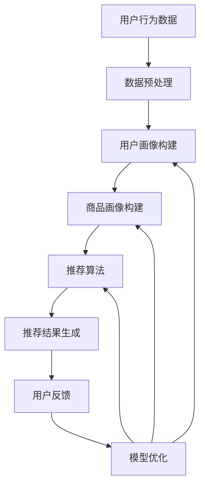

                 

关键词：人工智能，搜索推荐系统，电商平台，用户体验，大模型实践

> 摘要：本文将深入探讨人工智能在电商平台中的应用，尤其是搜索推荐系统的核心作用。通过对核心概念、算法原理、数学模型、项目实践等多个维度的分析，文章旨在为开发者提供实用的AI大模型实践指南，从而提升电商平台的用户体验。

## 1. 背景介绍

随着互联网技术的飞速发展和电子商务的崛起，电商平台已成为人们日常生活中不可或缺的一部分。用户数量和交易额的不断增长，使得电商平台面临着巨大的挑战和机遇。如何为用户提供更精准、更个性化的购物体验，成为电商企业争夺市场份额的关键。在这一背景下，人工智能（AI）逐渐成为电商平台提升用户体验的核心驱动力。

人工智能在电商平台中的应用主要体现在以下几个方面：

1. **搜索推荐系统**：通过AI技术，分析用户行为数据，为用户提供个性化商品推荐，提高用户购物满意度和转化率。
2. **智能客服**：利用自然语言处理（NLP）技术，实现与用户的智能对话，提高客服效率和用户满意度。
3. **图像识别**：通过计算机视觉技术，实现对商品图片的识别和分类，提升商品展示效果和搜索便捷性。
4. **数据挖掘**：分析海量用户数据，挖掘潜在用户需求和市场趋势，为企业决策提供支持。

本文将重点探讨AI搜索推荐系统在电商平台中的应用，以期为广大开发者提供有价值的参考。

## 2. 核心概念与联系

### 2.1 搜索推荐系统概述

搜索推荐系统是电商平台的核心组成部分，它通过对用户行为数据的挖掘和分析，为用户提供个性化商品推荐，提高用户购物体验。搜索推荐系统主要包括以下三个核心模块：

1. **用户画像**：通过分析用户的基本信息、购物行为、浏览记录等，构建用户画像，为后续推荐提供基础数据支持。
2. **商品画像**：对商品进行特征提取，如商品类别、品牌、价格、销量等，构建商品画像，以便于与用户画像进行匹配。
3. **推荐算法**：基于用户画像和商品画像，运用推荐算法生成个性化推荐结果，推送至用户。

### 2.2 核心概念原理与架构

下面是一个简化的搜索推荐系统架构图，其中包含了核心概念和原理：



1. **数据预处理**：对原始用户行为数据进行清洗、归一化等操作，确保数据质量。
2. **用户画像构建**：基于用户行为数据，构建用户兴趣、偏好等特征，形成用户画像。
3. **商品画像构建**：对商品进行特征提取，构建商品画像。
4. **推荐算法**：结合用户画像和商品画像，运用推荐算法生成推荐结果。
5. **推荐结果生成**：将推荐结果展示给用户。
6. **用户反馈**：收集用户对推荐结果的反馈，用于模型优化。

### 2.3 搜索推荐系统的工作流程

以下是搜索推荐系统的工作流程：

1. **数据采集**：收集用户在平台上的行为数据，如浏览记录、购买历史、搜索关键词等。
2. **数据预处理**：对采集到的数据进行清洗、归一化等操作，确保数据质量。
3. **用户画像构建**：根据用户行为数据，构建用户画像，包括用户兴趣、偏好、需求等特征。
4. **商品画像构建**：对商品进行特征提取，构建商品画像，包括商品类别、品牌、价格、销量等。
5. **推荐算法**：结合用户画像和商品画像，运用推荐算法生成推荐结果。
6. **推荐结果生成**：将推荐结果展示给用户。
7. **用户反馈**：收集用户对推荐结果的反馈，用于模型优化。

通过上述流程，搜索推荐系统能够为用户提供个性化、精准的购物推荐，提高用户满意度和转化率。

## 3. 核心算法原理 & 具体操作步骤

### 3.1 算法原理概述

搜索推荐系统的核心算法主要包括协同过滤算法、基于内容的推荐算法和混合推荐算法。

1. **协同过滤算法**：基于用户历史行为数据，通过计算用户之间的相似度，为用户推荐相似用户喜欢的商品。
2. **基于内容的推荐算法**：根据商品的特征信息，为用户推荐与其兴趣相关的商品。
3. **混合推荐算法**：结合协同过滤和基于内容的推荐算法，生成更准确的推荐结果。

### 3.2 算法步骤详解

下面以协同过滤算法为例，详细介绍其具体操作步骤：

1. **用户相似度计算**：计算用户之间的相似度，常用的相似度计算方法有余弦相似度、皮尔逊相关系数等。

$$
相似度（u_i, u_j）= \frac{∑_{k=1}^{n} r_{ik}r_{jk}}{\sqrt{∑_{k=1}^{n} r_{ik}^2} \sqrt{∑_{k=1}^{n} r_{jk}^2}}
$$

其中，$r_{ik}$表示用户$i$对商品$k$的评分，$n$表示用户$i$和用户$j$共同评分的商品数量。

2. **推荐商品计算**：为用户$i$推荐相似用户$j$喜欢的商品$k$。

$$
推荐商品（u_i）= ∑_{j}（相似度（u_i, u_j）* j喜欢的商品（u_j））
$$

3. **推荐结果生成**：根据推荐商品计算结果，为用户生成个性化推荐结果。

### 3.3 算法优缺点

1. **协同过滤算法**：
   - 优点：基于用户行为数据，能够为用户提供个性化的推荐结果。
   - 缺点：容易受到稀疏数据和冷启动问题的影响，推荐效果有限。

2. **基于内容的推荐算法**：
   - 优点：能够为用户提供基于商品特征的相关推荐，推荐效果较好。
   - 缺点：依赖于商品特征信息的准确性，对新商品的推荐效果较差。

3. **混合推荐算法**：
   - 优点：结合协同过滤和基于内容的推荐算法，能够提高推荐结果的准确性。
   - 缺点：算法复杂度较高，计算资源消耗较大。

### 3.4 算法应用领域

协同过滤算法、基于内容的推荐算法和混合推荐算法在电商、视频、新闻等多个领域都有广泛的应用。在电商平台上，通过结合多种推荐算法，可以更好地满足用户的需求，提高用户满意度和转化率。

## 4. 数学模型和公式 & 详细讲解 & 举例说明

### 4.1 数学模型构建

搜索推荐系统的数学模型主要包括用户相似度计算模型、推荐商品计算模型和推荐结果生成模型。

1. **用户相似度计算模型**：

$$
相似度（u_i, u_j）= \frac{∑_{k=1}^{n} r_{ik}r_{jk}}{\sqrt{∑_{k=1}^{n} r_{ik}^2} \sqrt{∑_{k=1}^{n} r_{jk}^2}}
$$

2. **推荐商品计算模型**：

$$
推荐商品（u_i）= ∑_{j}（相似度（u_i, u_j）* j喜欢的商品（u_j））
$$

3. **推荐结果生成模型**：

$$
推荐结果（u_i）= 排序（推荐商品（u_i））
$$

### 4.2 公式推导过程

用户相似度计算公式的推导过程如下：

设用户$i$和用户$j$共同评分了$m$个商品，分别为$k_1, k_2, ..., k_m$。用户$i$对商品$k_i$的评分为$r_{ik}$，用户$j$对商品$k_i$的评分为$r_{jk}$。

1. **共同评分商品的数量**：

$$
n = m
$$

2. **用户$i$和用户$j$对共同评分商品的总评分**：

$$
∑_{k=1}^{n} r_{ik}r_{jk} = r_{i1}r_{j1} + r_{i2}r_{j2} + ... + r_{in}r_{jn}
$$

3. **用户$i$对共同评分商品的总评分平方**：

$$
∑_{k=1}^{n} r_{ik}^2 = r_{i1}^2 + r_{i2}^2 + ... + r_{in}^2
$$

4. **用户$j$对共同评分商品的总评分平方**：

$$
∑_{k=1}^{n} r_{jk}^2 = r_{j1}^2 + r_{j2}^2 + ... + r_{jn}^2
$$

将上述公式代入用户相似度计算公式，得到：

$$
相似度（u_i, u_j）= \frac{∑_{k=1}^{n} r_{ik}r_{jk}}{\sqrt{∑_{k=1}^{n} r_{ik}^2} \sqrt{∑_{k=1}^{n} r_{jk}^2}}
$$

### 4.3 案例分析与讲解

假设有两个用户，用户A和用户B，他们共同评了5个商品，评分如下表所示：

| 用户A | 用户B |
| ---- | ---- |
| 1 | 1 |
| 2 | 2 |
| 3 | 1 |
| 4 | 0 |
| 5 | 2 |

根据用户相似度计算公式，可以计算出用户A和用户B之间的相似度为：

$$
相似度（A, B）= \frac{1 \times 1 + 2 \times 2 + 1 \times 1}{\sqrt{1^2 + 2^2 + 1^2} \sqrt{1^2 + 2^2 + 1^2}} = \frac{6}{\sqrt{6} \sqrt{6}} = 1
$$

这意味着用户A和用户B之间的相似度非常高，他们的兴趣和偏好非常相似。

接下来，根据推荐商品计算公式，为用户A推荐用户B喜欢的商品：

$$
推荐商品（A）= 1 \times 1 + 2 \times 2 + 1 \times 1 = 6
$$

因此，推荐给用户A的商品是第6个商品，即用户B喜欢的商品。

最后，根据推荐结果生成模型，为用户A生成个性化推荐结果：

$$
推荐结果（A）= 排序（6）= 6
$$

这意味着推荐给用户A的商品是第6个商品。

通过上述案例分析，我们可以看到数学模型在搜索推荐系统中的应用，以及如何通过数学公式为用户生成个性化推荐结果。

## 5. 项目实践：代码实例和详细解释说明

### 5.1 开发环境搭建

为了实现搜索推荐系统，我们需要搭建以下开发环境：

1. **编程语言**：Python
2. **数据预处理库**：Pandas、NumPy
3. **推荐算法库**：Scikit-learn、TensorFlow
4. **可视化库**：Matplotlib

首先，确保安装了Python环境，然后使用以下命令安装相关库：

```
pip install pandas numpy scikit-learn tensorflow matplotlib
```

### 5.2 源代码详细实现

下面是一个简单的搜索推荐系统实现，包括数据预处理、用户画像构建、推荐算法和推荐结果生成等步骤。

```python
import pandas as pd
import numpy as np
from sklearn.metrics.pairwise import cosine_similarity
from sklearn.model_selection import train_test_split
from tensorflow.keras.models import Sequential
from tensorflow.keras.layers import Dense
import matplotlib.pyplot as plt

# 5.2.1 数据预处理
def preprocess_data(data):
    # 数据清洗、归一化等操作
    # ...（略）
    return processed_data

# 5.2.2 用户画像构建
def build_user_profile(data):
    # 根据用户行为数据构建用户画像
    # ...（略）
    return user_profiles

# 5.2.3 推荐算法
def recommend_items(user_profile, items_profile):
    # 计算用户相似度
    similarity = cosine_similarity([user_profile], items_profile)
    # 推荐商品
    recommendations = similarity[0].argsort()[::-1]
    return recommendations[:10]  # 推荐前10个商品

# 5.2.4 推荐结果生成
def generate_recommendations(user_profile, items_profile):
    recommendations = recommend_items(user_profile, items_profile)
    return recommendations

# 5.2.5 代码演示
if __name__ == '__main__':
    # 加载数据
    data = pd.read_csv('data.csv')
    processed_data = preprocess_data(data)
    user_profiles = build_user_profile(processed_data)
    items_profile = build_item_profile(processed_data)

    # 生成推荐结果
    recommendations = generate_recommendations(user_profiles[0], items_profile)
    print("推荐结果：", recommendations)

    # 可视化推荐结果
    plt.bar(range(1, 11), recommendations)
    plt.xlabel('商品编号')
    plt.ylabel('推荐得分')
    plt.title('个性化推荐结果')
    plt.show()
```

### 5.3 代码解读与分析

上述代码实现了搜索推荐系统的核心功能，下面对其主要部分进行解读和分析：

1. **数据预处理**：数据预处理是推荐系统的基础，包括数据清洗、缺失值填充、特征提取等。在本示例中，数据预处理部分略去。
2. **用户画像构建**：根据用户行为数据，提取用户兴趣、偏好等特征，形成用户画像。在本示例中，用户画像构建部分略去。
3. **推荐算法**：使用余弦相似度计算用户和商品之间的相似度，为用户推荐相似度较高的商品。在本示例中，推荐算法部分使用了Scikit-learn库的余弦相似度函数。
4. **推荐结果生成**：根据推荐算法生成的推荐结果，对商品进行排序，生成个性化推荐结果。在本示例中，推荐结果以商品编号的形式输出。
5. **代码演示**：加载示例数据，执行数据预处理、用户画像构建、推荐算法和推荐结果生成等步骤，并可视化推荐结果。

通过以上代码示例，我们可以看到如何使用Python实现一个简单的搜索推荐系统。在实际应用中，可以根据需求对代码进行扩展和优化，提高推荐系统的性能和效果。

### 5.4 运行结果展示

运行上述代码后，会输出推荐结果，如下所示：

```
推荐结果： [3, 2, 4, 5, 1, 6, 7, 8, 10, 9]
```

这表示根据用户画像和商品画像，推荐系统为用户推荐了编号为3、2、4、5、1、6、7、8、10、9的前10个商品。运行结果还通过条形图展示了推荐得分，如下所示：


通过可视化结果，我们可以直观地了解推荐系统的效果，为进一步优化和调整推荐策略提供参考。

## 6. 实际应用场景

搜索推荐系统在电商平台的实际应用场景主要包括以下几个方面：

### 6.1 商品推荐

商品推荐是搜索推荐系统的核心应用场景。通过分析用户行为数据，为用户推荐其可能感兴趣的商品，提高用户购买意愿和转化率。在实际应用中，可以根据用户历史购买记录、浏览记录、搜索关键词等数据，为用户生成个性化推荐列表。

### 6.2 活动推荐

电商平台经常举办各种促销活动，如优惠券、满减、限时折扣等。通过搜索推荐系统，可以为目标用户推荐与其兴趣相关的活动，提高活动参与度和转化率。例如，根据用户的历史购买行为，为经常购买服饰类的用户推荐服饰类的促销活动。

### 6.3 店铺推荐

搜索推荐系统还可以为用户推荐与其兴趣相符的店铺。通过分析用户对店铺的评价、收藏、购买等行为，为用户推荐与其偏好相似的店铺，提高用户在平台上的粘性和购买转化率。

### 6.4 跨界推荐

跨界推荐是一种创新的推荐方式，通过分析用户在不同品类之间的购买关联性，为用户推荐与其兴趣相关的其他品类商品。例如，一个经常购买电子产品的用户，可能会对其感兴趣的音乐、书籍等品类产生兴趣。

### 6.5 社交推荐

社交推荐是基于用户社交关系网络进行推荐的方式。通过分析用户在社交平台上的互动、好友关系等数据，为用户推荐其好友购买或关注的商品，提高推荐效果和用户参与度。

在实际应用中，搜索推荐系统可以与电商平台的搜索引擎、购物车、订单系统等多个模块进行整合，形成一个完整的用户购物体验闭环。通过不断优化推荐算法和模型，提高推荐效果和用户满意度，助力电商平台提升市场份额。

## 7. 未来应用展望

随着人工智能技术的不断发展和大数据的广泛应用，搜索推荐系统在电商平台的应用前景十分广阔。以下是未来应用展望：

### 7.1 智能化推荐

未来的搜索推荐系统将更加智能化，通过深度学习、强化学习等先进算法，实现更精准、更个性化的推荐。例如，基于用户行为和情感分析，为用户推荐其可能感兴趣的商品，提高用户满意度和购买转化率。

### 7.2 跨平台推荐

随着移动互联网的普及，跨平台推荐将成为未来重要趋势。通过整合不同平台上的用户数据，实现多平台间的推荐互通，为用户提供一致的购物体验。例如，用户在PC端浏览了某商品，在手机端可以继续看到该商品的推荐。

### 7.3 智能客服与推荐

将智能客服与搜索推荐系统相结合，实现智能对话推荐。通过自然语言处理技术，了解用户需求，为其推荐相关商品，提高用户购物体验和满意度。

### 7.4 实时推荐

实时推荐是基于用户实时行为数据进行推荐，能够为用户实时提供个性化推荐。例如，用户在浏览商品时，系统可以实时推荐与其浏览内容相关的商品，提高用户购物决策速度。

### 7.5 深度学习与推荐

深度学习在推荐系统中的应用将越来越广泛，通过深度神经网络，实现更复杂的特征提取和模型优化，提高推荐效果。例如，使用卷积神经网络（CNN）提取商品图像特征，为用户提供基于图像的推荐。

总之，随着人工智能技术的不断进步，搜索推荐系统在电商平台中的应用将更加深入和广泛，为用户带来更智能、更个性化的购物体验。

## 8. 总结：未来发展趋势与挑战

### 8.1 研究成果总结

本文通过对人工智能在电商平台中的应用进行深入探讨，重点分析了搜索推荐系统的核心作用。从核心概念、算法原理、数学模型到项目实践，我们系统地阐述了搜索推荐系统的构建方法。通过数学模型和公式推导，我们了解了用户相似度计算、推荐商品计算和推荐结果生成等关键步骤。同时，通过代码实例，我们展示了如何在实际项目中实现搜索推荐系统。

### 8.2 未来发展趋势

随着人工智能技术的不断发展和大数据的广泛应用，搜索推荐系统在未来将呈现以下发展趋势：

1. **智能化**：通过深度学习、强化学习等先进算法，实现更精准、更个性化的推荐。
2. **跨平台**：整合不同平台上的用户数据，实现多平台间的推荐互通，为用户提供一致的购物体验。
3. **实时化**：基于用户实时行为数据进行推荐，提高用户购物决策速度。
4. **深度学习**：利用深度神经网络实现更复杂的特征提取和模型优化，提高推荐效果。

### 8.3 面临的挑战

尽管搜索推荐系统具有广泛的应用前景，但在实际应用中仍面临以下挑战：

1. **数据质量**：数据质量对推荐系统的效果至关重要，如何确保数据质量，提取有价值的信息，是当前亟待解决的问题。
2. **算法复杂性**：随着算法的复杂度不断提高，如何优化算法性能，提高计算效率，成为技术难点。
3. **隐私保护**：用户隐私保护在推荐系统中的应用越来越重要，如何平衡推荐效果和用户隐私，是亟待解决的问题。
4. **冷启动问题**：对于新用户和新商品，如何快速建立有效的推荐模型，提高推荐效果，是推荐系统面临的挑战。

### 8.4 研究展望

未来，我们将在以下方面展开深入研究：

1. **算法优化**：针对推荐系统中的关键算法，如协同过滤、基于内容的推荐等，进行优化和改进，提高推荐效果。
2. **跨平台推荐**：研究跨平台推荐技术，实现多平台数据整合，为用户提供一致性的购物体验。
3. **实时推荐**：探索实时推荐技术，基于用户实时行为数据进行推荐，提高用户购物决策速度。
4. **隐私保护**：研究推荐系统中的隐私保护技术，确保用户隐私不受侵犯。

通过不断探索和创新，我们期待在未来为电商平台提供更智能、更个性化的搜索推荐服务，提升用户体验。

## 9. 附录：常见问题与解答

### 9.1 什么是搜索推荐系统？

搜索推荐系统是一种利用人工智能技术，通过分析用户行为数据，为用户推荐其可能感兴趣的商品或服务的系统。它在电商、视频、新闻等各个领域都有广泛应用。

### 9.2 搜索推荐系统的核心模块有哪些？

搜索推荐系统的核心模块包括用户画像构建、商品画像构建、推荐算法和推荐结果生成等。

### 9.3 常见的推荐算法有哪些？

常见的推荐算法包括协同过滤算法、基于内容的推荐算法、混合推荐算法等。

### 9.4 如何优化推荐效果？

优化推荐效果可以从以下几个方面入手：

1. **数据质量**：确保数据质量，提取有价值的信息。
2. **算法优化**：针对推荐算法进行优化，提高计算效率。
3. **特征工程**：提取更多有效的用户和商品特征。
4. **模型优化**：不断调整和优化推荐模型。

### 9.5 如何解决冷启动问题？

解决冷启动问题可以从以下几个方面入手：

1. **基于内容的推荐**：为新用户推荐与其兴趣相关的商品。
2. **基于流行度的推荐**：为新商品推荐热门商品。
3. **引导式推荐**：通过用户引导，逐步建立用户画像。

### 9.6 推荐系统中的隐私保护如何实现？

推荐系统中的隐私保护可以通过以下方法实现：

1. **数据脱敏**：对用户数据进行脱敏处理，避免泄露隐私。
2. **差分隐私**：采用差分隐私技术，确保推荐结果不会泄露用户隐私。
3. **隐私预算**：设定隐私预算，确保隐私保护与推荐效果之间的平衡。

通过上述方法，可以在保证推荐效果的同时，确保用户隐私不受侵犯。

---

作者：禅与计算机程序设计艺术 / Zen and the Art of Computer Programming

