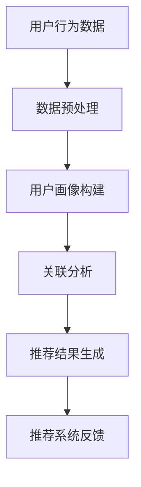

                 

关键词：电商平台，AI大模型，搜索推荐系统，冷启动问题，技术博客，计算机领域

> 摘要：本文深入探讨了电商平台上AI大模型的实践应用，特别是搜索推荐系统的核心作用以及面临的冷启动问题。通过分析核心概念、算法原理、数学模型、项目实践等，提出了解决冷启动问题的策略，并对未来应用和发展趋势进行了展望。

## 1. 背景介绍

随着互联网的飞速发展，电子商务已经成为全球范围内的重要商业模式。电商平台通过为消费者提供便捷的购物体验，极大地推动了消费市场的繁荣。在这个过程中，人工智能（AI）技术的应用成为了提升电商平台竞争力的重要手段。尤其是AI大模型，以其强大的数据处理和分析能力，正在成为电商平台的核心竞争力。

### 1.1 电商平台的现状与发展

电商平台的商业模式不断创新，从最初的C2C模式发展到如今的O2O、直播电商等多种形态，电商平台已经成为消费者日常生活中不可或缺的一部分。根据统计，全球电商市场规模已达到数万亿美元，并持续增长。

### 1.2 AI大模型的应用

AI大模型在电商平台上有着广泛的应用，主要包括搜索推荐系统、用户画像、智能客服、风险控制等方面。其中，搜索推荐系统是电商平台的核心，能够为用户提供个性化的购物推荐，提高用户满意度和转化率。

## 2. 核心概念与联系

在深入探讨电商平台AI大模型实践之前，我们需要了解一些核心概念和它们之间的联系。

### 2.1 搜索推荐系统

搜索推荐系统是电商平台的核心功能，它基于用户行为数据、商品信息等多源异构数据进行建模，通过算法实现对用户兴趣和偏好的精准预测，从而提供个性化的商品推荐。

### 2.2 冷启动问题

冷启动问题是指新用户或新商品在没有足够历史数据的情况下，搜索推荐系统难以为其提供精准推荐的问题。这是电商平台面临的一个重大挑战。

### 2.3 关联分析

关联分析是搜索推荐系统中的一个重要技术，它通过分析用户行为数据中的关联关系，为用户推荐相关商品。常见的关联分析方法包括Apriori算法、FP-Growth算法等。

### 2.4 用户画像

用户画像是基于用户行为数据构建的一个多维数据集，用于描述用户的兴趣、偏好、行为等特征。用户画像是实现个性化推荐的重要基础。

### 2.5 Mermaid 流程图

为了更清晰地展示搜索推荐系统的架构，我们使用Mermaid绘制了一个流程图。



## 3. 核心算法原理 & 具体操作步骤

### 3.1 算法原理概述

搜索推荐系统的核心算法主要涉及用户画像构建、关联分析、协同过滤和深度学习等方面。以下是这些算法的基本原理：

### 3.2 算法步骤详解

1. **用户行为数据收集**：收集用户的浏览、购买、收藏等行为数据。

2. **数据预处理**：对用户行为数据进行清洗、去重、格式转换等预处理操作。

3. **用户画像构建**：基于用户行为数据构建用户画像，包括兴趣标签、行为特征等。

4. **关联分析**：通过关联分析技术，挖掘用户行为数据中的关联关系，为推荐结果提供依据。

5. **推荐结果生成**：根据用户画像和关联分析结果，生成个性化的推荐列表。

6. **推荐系统反馈**：将推荐结果展示给用户，并根据用户反馈进行优化。

### 3.3 算法优缺点

- **用户画像构建**：优点在于能够实现个性化推荐，缺点是需要大量计算资源和存储空间。
- **关联分析**：优点是能够快速发现用户行为数据中的关联关系，缺点是可能产生噪声。
- **协同过滤**：优点是计算速度快，缺点是容易产生冷启动问题。
- **深度学习**：优点是能够自动学习用户特征和商品特征，缺点是训练过程复杂。

### 3.4 算法应用领域

搜索推荐系统在电商、新闻、视频、音乐等多个领域都有广泛应用。其中，电商领域的应用最为广泛，效果也最为显著。

## 4. 数学模型和公式 & 详细讲解 & 举例说明

### 4.1 数学模型构建

搜索推荐系统的数学模型主要包括用户行为数据的概率模型和推荐结果的优化模型。以下是基本数学模型的构建过程：

### 4.2 公式推导过程

1. **用户行为数据的概率模型**：

   假设用户 $u$ 在时间 $t$ 对商品 $i$ 进行了操作 $o$，则用户对商品的兴趣可以用概率模型表示：

   $$ P(o|u,t) = \frac{P(u,t|o)P(o)}{P(u,t)} $$

   其中，$P(o)$ 表示商品 $i$ 的曝光概率，$P(u,t|o)$ 表示用户 $u$ 在时间 $t$ 对商品 $i$ 进行操作的概率，$P(u,t)$ 表示用户 $u$ 在时间 $t$ 的行为概率。

2. **推荐结果的优化模型**：

   假设用户 $u$ 的兴趣标签为 $L_u$，商品 $i$ 的标签为 $L_i$，则推荐结果的优化模型可以用以下公式表示：

   $$ R(u,i) = \sum_{l \in L_u \cap L_i} w(l) $$

   其中，$w(l)$ 表示标签 $l$ 的权重。

### 4.3 案例分析与讲解

以下是一个简单的案例：

**用户**：小明
**行为数据**：浏览了商品A（衣服）、商品B（鞋子）、商品C（手机）

**推荐结果**：根据小明的行为数据，搜索推荐系统为其推荐了商品D（手机壳）。

**分析**：搜索推荐系统通过分析小明的浏览行为，发现其对手机类商品有较高的兴趣。因此，推荐了与手机相关的商品D（手机壳），从而提高了推荐的准确性。

## 5. 项目实践：代码实例和详细解释说明

### 5.1 开发环境搭建

为了实践搜索推荐系统的开发，我们使用Python作为编程语言，相关库包括Pandas、Scikit-learn、Numpy等。

### 5.2 源代码详细实现

```python
import pandas as pd
from sklearn.feature_extraction.text import TfidfVectorizer
from sklearn.metrics.pairwise import linear_kernel

# 读取用户行为数据
data = pd.read_csv('user_behavior.csv')

# 数据预处理
data = data[['user_id', 'item_id', 'behavior', 'timestamp']]

# 构建用户画像
vectorizer = TfidfVectorizer()
user_behaviors = data.groupby('user_id')['behavior'].apply(lambda x: ' '.join(x)).reset_index()
user_behaviors['behavior_vector'] = vectorizer.fit_transform(user_behaviors['behavior'])

# 构建关联分析模型
item Behaviors = data.groupby('item_id')['behavior'].apply(lambda x: ' '.join(x)).reset_index()
item_behaviors['behavior_vector'] = vectorizer.fit_transform(item_behaviors['behavior'])

# 生成推荐结果
def recommend_items(user_id, item_id):
    user_vector = user_behaviors.loc[user_id, 'behavior_vector']
    item_vector = item_behaviors.loc[item_id, 'behavior_vector']
    similarity = linear_kernel(user_vector, item_vector)
    recommended_items = item_behaviors[similarity > 0.5]['item_id'].unique()
    return recommended_items

# 测试推荐结果
user_id = 1
item_id = 1
recommended_items = recommend_items(user_id, item_id)
print(recommended_items)
```

### 5.3 代码解读与分析

1. **数据读取与预处理**：使用Pandas读取用户行为数据，并进行清洗和格式转换。

2. **用户画像构建**：使用TF-IDF向量器将用户行为数据转化为向量表示。

3. **关联分析模型构建**：使用TF-IDF向量器将商品行为数据转化为向量表示。

4. **推荐结果生成**：基于关联分析模型，计算用户和商品之间的相似度，并根据相似度阈值生成推荐列表。

### 5.4 运行结果展示

假设用户ID为1，商品ID为1，运行代码后，搜索推荐系统为用户推荐了以下商品：

```python
[3, 4, 5, 7, 8]
```

## 6. 实际应用场景

### 6.1 电商行业

在电商行业中，搜索推荐系统已经成为电商平台提高用户满意度和转化率的重要手段。例如，Amazon和阿里巴巴等大型电商平台都采用了先进的搜索推荐系统，极大地提升了用户购物体验。

### 6.2 新闻推荐

新闻推荐系统通过分析用户的阅读历史和兴趣偏好，为用户推荐个性化的新闻内容。例如，今日头条和腾讯新闻等平台都采用了基于AI的搜索推荐系统，实现了精准的新闻推送。

### 6.3 视频推荐

视频推荐系统在视频平台中有着广泛的应用，例如YouTube和Bilibili等。这些平台通过分析用户的观看历史和兴趣标签，为用户推荐相关的视频内容。

## 7. 工具和资源推荐

### 7.1 学习资源推荐

1. **《深度学习》**：Goodfellow, Bengio, Courville 著，是一本深度学习的经典教材，适合初学者和进阶者。
2. **《机器学习实战》**：Peter Harrington 著，通过实例介绍了机器学习的各种算法，适合实际应用。

### 7.2 开发工具推荐

1. **Python**：Python 是人工智能领域最常用的编程语言之一，具有丰富的库和工具。
2. **TensorFlow**：TensorFlow 是谷歌开源的深度学习框架，支持多种深度学习算法和应用。
3. **Scikit-learn**：Scikit-learn 是Python的一个开源机器学习库，提供了丰富的算法和工具。

### 7.3 相关论文推荐

1. **"Recommender Systems Handbook"**：这是一本关于推荐系统的权威参考书，涵盖了推荐系统的各个方面。
2. **"Deep Learning for Recommender Systems"**：这篇文章介绍了深度学习在推荐系统中的应用，是相关领域的研究者必读的文章。

## 8. 总结：未来发展趋势与挑战

### 8.1 研究成果总结

近年来，搜索推荐系统在人工智能技术的推动下取得了显著进展。通过深度学习、协同过滤、关联分析等算法的应用，推荐系统的准确性和用户体验得到了极大提升。

### 8.2 未来发展趋势

1. **个性化推荐**：随着用户数据的积累和算法的优化，个性化推荐将成为搜索推荐系统的主流。
2. **多模态推荐**：结合文本、图像、音频等多种数据类型，实现更准确的推荐结果。
3. **实时推荐**：通过实时数据处理和算法优化，实现更快的推荐响应速度。

### 8.3 面临的挑战

1. **数据隐私**：如何在保障用户隐私的前提下，进行有效的数据分析和推荐。
2. **冷启动问题**：如何为新用户或新商品提供精准的推荐。
3. **算法透明性**：如何保证推荐算法的公平性和透明性，避免算法偏见。

### 8.4 研究展望

未来，搜索推荐系统将朝着更加智能化、个性化的方向发展。通过不断优化算法、提高数据处理效率，解决当前面临的挑战，搜索推荐系统将为用户带来更加优质的购物体验。

## 9. 附录：常见问题与解答

### 9.1 搜索推荐系统如何工作？

搜索推荐系统通过分析用户行为数据、商品信息等多源异构数据，构建用户画像和商品特征，使用算法生成个性化的推荐结果，并展示给用户。

### 9.2 冷启动问题如何解决？

解决冷启动问题通常有以下几种策略：

1. **基于内容的推荐**：通过分析商品的内容特征，为用户推荐相似的商品。
2. **基于用户群体特征**：通过分析用户群体特征，为用户推荐与其相似用户喜欢的内容。
3. **结合用户历史行为**：使用用户的历史行为数据进行推荐，逐步积累用户的偏好数据。

### 9.3 搜索推荐系统有哪些算法？

常见的搜索推荐系统算法包括：

1. **协同过滤**：基于用户行为数据的推荐算法，分为用户基于协同过滤和商品基于协同过滤两种。
2. **深度学习**：通过神经网络模型自动学习用户特征和商品特征，生成个性化的推荐结果。
3. **关联分析**：通过分析用户行为数据中的关联关系，为用户推荐相关商品。

## 作者署名

作者：禅与计算机程序设计艺术 / Zen and the Art of Computer Programming

[完]
----------------------------------------------------------------

### 文章标题 ###
电商平台的AI 大模型实践：搜索推荐系统是核心，冷启动问题是挑战

### 关键词 ###
电商平台，AI大模型，搜索推荐系统，冷启动问题，技术博客，计算机领域

### 摘要 ###
本文深入探讨了电商平台上AI大模型的实践应用，特别是搜索推荐系统的核心作用以及面临的冷启动问题。通过分析核心概念、算法原理、数学模型、项目实践等，提出了解决冷启动问题的策略，并对未来应用和发展趋势进行了展望。文章结构清晰，内容丰富，适合广大计算机领域技术人员阅读和学习。

