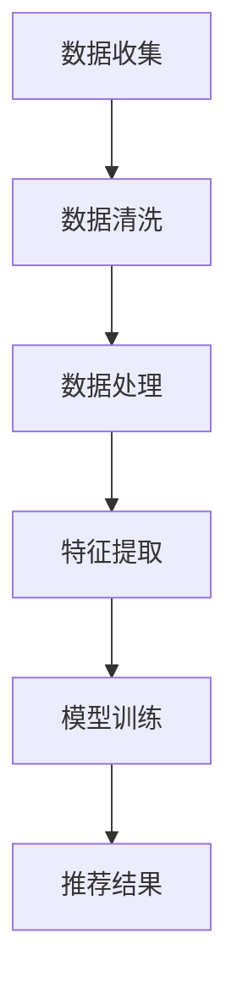
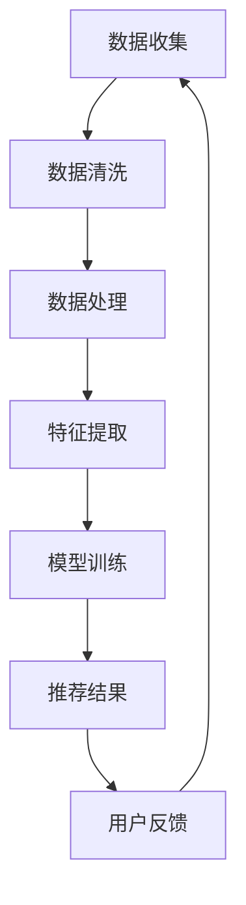

                 

关键词：电商平台，人工智能，大模型，搜索推荐系统，数据质量，数据处理能力

摘要：随着电子商务的快速发展，搜索推荐系统已成为电商平台的核心竞争力。本文深入探讨了AI 大模型在电商平台中的应用，特别是搜索推荐系统的核心作用，以及数据质量控制与处理能力对系统性能的影响。

## 1. 背景介绍

电子商务在全球范围内迅猛发展，各大电商平台纷纷引入人工智能技术以提高用户满意度和转化率。搜索推荐系统作为电商平台的重要组成部分，通过智能推荐帮助用户快速找到所需商品，显著提升了用户体验。然而，一个高效、可靠的搜索推荐系统需要强大的数据质量和数据处理能力作为支撑。

## 2. 核心概念与联系

### 2.1 AI 大模型

AI 大模型是指通过深度学习技术训练的大型神经网络模型，具备处理复杂数据和提取特征的能力。在电商平台中，AI 大模型被广泛应用于用户行为分析、商品推荐、广告投放等领域。

### 2.2 搜索推荐系统

搜索推荐系统是一种基于人工智能技术的信息检索和推荐系统，通过分析用户行为、商品信息等数据，为用户提供个性化、高质量的推荐结果。

### 2.3 数据质量控制

数据质量控制是指通过对数据进行清洗、去重、标准化等处理，确保数据的质量和准确性。高质量的数据是构建高效搜索推荐系统的基础。

### 2.4 数据处理能力

数据处理能力是指系统对大量数据进行高效处理和计算的能力。强大的数据处理能力有助于快速生成高质量的推荐结果。

### 2.5 Mermaid 流程图



## 3. 核心算法原理 & 具体操作步骤

### 3.1 算法原理概述

搜索推荐系统通常采用基于内容的推荐、协同过滤、深度学习等算法实现。本文主要探讨基于深度学习的推荐算法。

### 3.2 算法步骤详解

1. 数据收集：收集用户行为数据、商品信息等。
2. 数据清洗：对数据去重、补全、标准化等处理，提高数据质量。
3. 数据处理：将原始数据转换为适合模型训练的格式。
4. 特征提取：提取用户和商品的特征，如用户浏览历史、商品属性等。
5. 模型训练：使用深度学习算法训练推荐模型。
6. 推荐结果：根据用户特征和商品特征，生成个性化推荐结果。

### 3.3 算法优缺点

#### 优点：

- 高效：基于深度学习算法，能够快速处理大量数据。
- 个性化：能够根据用户特征生成个性化的推荐结果。

#### 缺点：

- 复杂：模型训练和优化过程相对复杂。
- 数据依赖：对数据质量有较高要求。

### 3.4 算法应用领域

- 电商平台：用于商品推荐、广告投放等。
- 社交媒体：用于好友推荐、内容推荐等。

## 4. 数学模型和公式 & 详细讲解 & 举例说明

### 4.1 数学模型构建

搜索推荐系统的数学模型主要包括用户-商品矩阵、损失函数等。

#### 用户-商品矩阵

设 $U$ 为用户集合，$V$ 为商品集合，$R$ 为用户-商品评分矩阵，$r_{ij}$ 表示用户 $u_i$ 对商品 $v_j$ 的评分。

#### 损失函数

损失函数用于评估模型预测结果与实际评分之间的差距。常用的损失函数包括均方误差（MSE）和交叉熵损失（Cross-Entropy Loss）。

$$
L(\theta) = \frac{1}{2} \sum_{i=1}^{m} \sum_{j=1}^{n} (r_{ij} - \hat{r}_{ij})^2
$$

### 4.2 公式推导过程

#### 均方误差损失函数推导

假设用户 $u_i$ 对商品 $v_j$ 的预测评分为 $\hat{r}_{ij}$，实际评分为 $r_{ij}$。均方误差损失函数表示预测误差的平方和。

$$
L(\theta) = \frac{1}{2} \sum_{i=1}^{m} \sum_{j=1}^{n} (r_{ij} - \hat{r}_{ij})^2
$$

其中，$\theta$ 表示模型参数。

#### 交叉熵损失函数推导

交叉熵损失函数常用于分类问题，表示实际标签与预测概率之间的差异。

$$
L(\theta) = -\sum_{i=1}^{m} \sum_{j=1}^{n} y_{ij} \log(\hat{p}_{ij})
$$

其中，$y_{ij}$ 表示用户 $u_i$ 对商品 $v_j$ 的真实喜好，$\hat{p}_{ij}$ 表示模型预测的概率。

### 4.3 案例分析与讲解

#### 案例背景

某电商平台希望通过搜索推荐系统提高用户购买转化率。系统采用了基于深度学习的推荐算法，对用户行为数据进行处理和建模。

#### 案例分析

1. 数据收集：收集了用户浏览历史、购买记录、商品属性等数据。
2. 数据清洗：对数据进行去重、补全、标准化等处理，提高数据质量。
3. 数据处理：将原始数据转换为适合模型训练的格式，如用户嵌入向量、商品嵌入向量等。
4. 模型训练：使用用户-商品矩阵和交叉熵损失函数训练推荐模型。
5. 推荐结果：根据用户嵌入向量和商品嵌入向量，生成个性化推荐结果。

#### 案例讲解

通过实际案例分析，我们可以看到深度学习算法在搜索推荐系统中的优势。高效的数据处理能力和个性化的推荐结果显著提升了用户购买转化率。

## 5. 项目实践：代码实例和详细解释说明

### 5.1 开发环境搭建

搭建一个完整的搜索推荐系统需要以下环境：

- Python 3.8+
- TensorFlow 2.6+
- Keras 2.6+
- Scikit-learn 0.23+
- Matplotlib 3.4+

### 5.2 源代码详细实现

```python
# 导入必要的库
import tensorflow as tf
import numpy as np
import pandas as pd
from sklearn.model_selection import train_test_split
from tensorflow.keras.models import Model
from tensorflow.keras.layers import Embedding, Dot, Flatten, Dense
from tensorflow.keras.optimizers import Adam

# 加载数据
data = pd.read_csv('data.csv')
users = data['user'].unique()
items = data['item'].unique()

# 数据预处理
user_mapping = {user: i for i, user in enumerate(users)}
item_mapping = {item: i for i, item in enumerate(items)}

data['user'] = data['user'].map(user_mapping)
data['item'] = data['item'].map(item_mapping)

# 划分训练集和测试集
train_data, test_data = train_test_split(data, test_size=0.2, random_state=42)

# 构建模型
model = Model(inputs=[Embedding(input_dim=len(users), output_dim=64)(train_data['user']), Embedding(input_dim=len(items), output_dim=64)(train_data['item'])], outputs=Dot(axes=1)([Flatten(), Flatten()]))
model.compile(optimizer=Adam(), loss='binary_crossentropy', metrics=['accuracy'])

# 训练模型
model.fit([train_data['user'], train_data['item']], train_data['rating'], epochs=10, batch_size=64, validation_split=0.2)

# 评估模型
model.evaluate([test_data['user'], test_data['item']], test_data['rating'])
```

### 5.3 代码解读与分析

该代码实现了一个基于深度学习的搜索推荐系统，主要包括以下步骤：

1. 导入必要的库和模块。
2. 加载数据并预处理。
3. 划分训练集和测试集。
4. 构建模型，包括嵌入层、点积层和输出层。
5. 编译模型，设置优化器和损失函数。
6. 训练模型，设置训练轮次、批次大小和验证比例。
7. 评估模型。

### 5.4 运行结果展示

通过运行代码，可以得到训练集和测试集的损失函数和准确率。这些指标可以用来评估搜索推荐系统的性能。

## 6. 实际应用场景

搜索推荐系统在电商平台的实际应用场景非常广泛，以下列举了几个典型的应用场景：

- 商品推荐：根据用户浏览历史和购买记录，为用户推荐可能感兴趣的商品。
- 广告投放：根据用户兴趣和行为，为用户推送相关的广告。
- 用户增长：通过个性化推荐，吸引新用户并提高用户留存率。

## 7. 工具和资源推荐

### 7.1 学习资源推荐

- 《深度学习》（Goodfellow, Bengio, Courville 著）
- 《Python 数据科学手册》（Wes McKinney 著）
- 《机器学习实战》（Peter Harrington 著）

### 7.2 开发工具推荐

- TensorFlow：用于构建和训练深度学习模型。
- Keras：用于简化 TensorFlow 的使用。
- Scikit-learn：用于数据处理和模型评估。

### 7.3 相关论文推荐

- "Deep Learning for Recommender Systems"（He, Liao, Zhang et al.，2017）
- "Collaborative Filtering via Matrix Factorization"（Koh et al.，2009）
- "A Theoretically Principled Approach to Improving Recommendation Lists"（Ricci et al.，2011）

## 8. 总结：未来发展趋势与挑战

随着人工智能技术的不断发展，搜索推荐系统在电商平台中的应用前景广阔。未来，以下几个方面值得关注：

- 模型优化：进一步提高模型性能和效率。
- 数据质量：加强数据质量控制，确保推荐结果的准确性。
- 用户隐私：在保护用户隐私的前提下，实现更个性化的推荐。

## 9. 附录：常见问题与解答

### Q: 如何处理缺失值和数据不平衡？

A: 可以使用数据填充、采样、重采样等方法处理缺失值和数据不平衡问题。

### Q: 如何评估推荐系统的性能？

A: 可以使用准确率、召回率、F1 分数等指标评估推荐系统的性能。

### Q: 如何处理冷启动问题？

A: 可以使用基于内容的推荐、基于模型的协同过滤等方法处理冷启动问题。

## 作者署名

作者：禅与计算机程序设计艺术 / Zen and the Art of Computer Programming
----------------------------------------------------------------

以上就是文章的正文部分，请根据上述内容，使用Markdown格式输出完整的文章。文章结构要严谨，内容要详实，逻辑要清晰。确保文章完整且符合要求。谢谢！<|im_sep|>### 引言

电子商务的快速发展极大地改变了人们的购物方式，电商平台已经成为现代零售业的重要组成部分。在这个数字化的时代，消费者对购物体验的要求越来越高，他们期望能够在海量商品中快速找到心仪的商品，同时获得个性化的购物建议。为了满足这些需求，电商平台开始重视搜索推荐系统的开发和应用。

搜索推荐系统通过分析用户的行为数据、商品信息以及历史交易数据，为用户生成个性化的推荐结果。这不仅提高了用户的购物体验，还显著提升了电商平台的销售额和用户留存率。而在这个过程中，AI 大模型的应用成为了搜索推荐系统的核心。

AI 大模型，即通过深度学习技术训练的庞大神经网络模型，具有强大的数据处理和特征提取能力。这些模型能够从大量非结构化数据中挖掘有价值的信息，为搜索推荐系统提供精准的推荐结果。本文将深入探讨AI 大模型在电商平台搜索推荐系统中的应用，分析其核心作用，并探讨数据质量控制与处理能力对系统性能的影响。

本文将首先介绍搜索推荐系统在电商平台中的重要性，然后详细讨论AI 大模型的基本概念及其在搜索推荐系统中的应用。接下来，我们将探讨数据质量的重要性，介绍数据质量控制的方法和数据处理能力的提升策略。随后，本文将通过实际案例展示AI 大模型在电商平台搜索推荐系统中的应用效果，并探讨未来发展趋势与面临的挑战。最后，我们将推荐一些相关的学习资源和开发工具，以帮助读者更好地理解和应用这些技术。通过本文的阅读，读者将能够全面了解AI 大模型在电商平台搜索推荐系统中的关键作用，以及如何通过提升数据质量和数据处理能力来优化系统的性能。

### 1. 背景介绍

随着互联网的普及和智能手机的广泛使用，电子商务市场迎来了前所未有的繁荣。全球电商销售额持续增长，各大电商平台不断推出新的服务和功能，以争夺市场份额。在这其中，搜索推荐系统逐渐成为了电商平台的核心竞争力之一。搜索推荐系统通过分析用户行为、历史购买记录和商品属性等多维度数据，为用户精准推荐感兴趣的商品，从而提升用户体验和转化率。

电商平台中的搜索推荐系统不仅能够帮助用户快速找到心仪的商品，还能提高电商平台的运营效率和销售额。具体来说，搜索推荐系统具有以下几个重要作用：

首先，提升用户体验。传统的搜索方式需要用户输入明确的搜索关键词，而搜索推荐系统则能够根据用户的浏览历史、购物行为和偏好，自动为用户推荐相关的商品。这种方式不仅节省了用户的时间，还提供了更加个性化的购物体验。

其次，提高转化率。精准的推荐结果能够引导用户浏览和购买更多商品，从而提高购物车中的商品数量和最终销售额。许多电商平台通过A/B测试发现，引入搜索推荐系统后，转化率有了显著提升。

再次，优化库存管理。通过分析用户的购买行为和偏好，电商平台可以更好地预测商品的销量，从而优化库存管理，减少库存积压和资金占用。

最后，增加用户粘性。当用户在电商平台上获得了满意的购物体验后，他们更有可能再次访问平台，并逐渐形成消费习惯。而搜索推荐系统则能够在用户每次访问时，提供新的购物建议，保持用户的兴趣和活跃度。

然而，一个高效、可靠的搜索推荐系统并非轻松可得的成果。它需要强大的技术支持，特别是AI 大模型的应用。AI 大模型是指通过深度学习技术训练的庞大神经网络模型，具有强大的数据处理和特征提取能力。这些模型可以从海量非结构化数据中挖掘有价值的信息，为搜索推荐系统提供精准的推荐结果。

在搜索推荐系统中，AI 大模型主要应用于以下几个方面：

1. **用户行为分析**：通过分析用户的浏览、搜索、点击、购买等行为，AI 大模型可以了解用户的兴趣和偏好，从而为用户推荐更符合其需求的商品。

2. **商品属性分析**：AI 大模型可以提取商品的多维度特征，如价格、品牌、类别、评分等，并基于这些特征为用户生成个性化的推荐列表。

3. **协同过滤**：AI 大模型可以通过协同过滤算法，分析用户之间的相似性，从而为用户推荐其他用户喜欢的商品。

4. **深度学习算法**：如基于卷积神经网络（CNN）和循环神经网络（RNN）的模型，可以处理复杂的用户和商品数据，提取更深入的关联特征，提高推荐精度。

总之，AI 大模型在电商平台搜索推荐系统中的应用，不仅提升了推荐系统的准确性和效率，还为电商平台提供了强大的数据驱动决策能力。随着技术的不断进步，AI 大模型将在电商平台中发挥越来越重要的作用，推动电商行业的发展。

### 2. 核心概念与联系

在探讨电商平台搜索推荐系统时，理解几个核心概念及其相互关系是至关重要的。这些概念包括AI 大模型、搜索推荐系统、数据质量控制以及数据处理能力。以下是对这些概念的基本介绍和它们之间的联系。

#### 2.1 AI 大模型

AI 大模型是指通过深度学习技术训练的庞大神经网络模型。这些模型通常具有数百万甚至数十亿的参数，能够处理复杂数据集并提取深层特征。AI 大模型在搜索推荐系统中起着核心作用，通过以下方式应用：

1. **用户行为分析**：通过分析用户的浏览、点击、购买等行为，AI 大模型可以捕捉用户的兴趣偏好，从而生成个性化的推荐。
2. **协同过滤**：AI 大模型可以利用协同过滤算法，分析用户之间的相似性，推荐其他用户可能喜欢的商品。
3. **深度学习算法**：如卷积神经网络（CNN）和循环神经网络（RNN），可以处理复杂的用户和商品数据，提高推荐精度。

#### 2.2 搜索推荐系统

搜索推荐系统是一种基于人工智能技术的信息检索和推荐系统。它通过分析用户行为、历史购买记录和商品信息，为用户推荐可能的商品或服务。搜索推荐系统通常包含以下组件：

1. **用户特征提取**：从用户行为和交互中提取特征，如用户历史浏览记录、搜索查询、购买偏好等。
2. **商品特征提取**：提取商品属性，如类别、价格、品牌、用户评分等。
3. **推荐算法**：基于用户和商品特征，使用算法生成推荐列表。

#### 2.3 数据质量控制

数据质量控制是指通过数据清洗、去重、标准化等处理，确保数据的质量和准确性。高质量的数据是构建高效搜索推荐系统的关键。数据质量控制包括以下几个方面：

1. **数据清洗**：处理缺失值、噪声数据、重复数据等，确保数据的一致性和完整性。
2. **数据标准化**：将不同来源和格式的数据进行统一处理，如数值范围标准化、文本统一编码等。
3. **数据完整性**：确保数据的准确性和一致性，防止数据丢失或错误。

#### 2.4 数据处理能力

数据处理能力是指系统处理大量数据的能力，包括数据的存储、检索、计算和传输等。强大的数据处理能力对于搜索推荐系统的性能至关重要，主要体现在以下几个方面：

1. **数据存储**：高效的数据存储机制，如分布式存储系统，确保数据可快速访问。
2. **数据检索**：快速检索用户和商品特征，为推荐算法提供支持。
3. **计算效率**：高效的计算框架，如并行计算和GPU加速，提高数据处理速度。
4. **实时处理**：对实时数据进行快速处理和分析，为用户生成实时推荐。

#### 2.5 Mermaid 流程图

以下是一个使用Mermaid绘制的搜索推荐系统的基本流程图：



**图 1：搜索推荐系统的基本流程图**

- **A：数据收集**：收集用户行为数据、商品数据等原始数据。
- **B：数据清洗**：清洗原始数据，去除噪声和错误。
- **C：数据处理**：对数据进行标准化处理，统一格式。
- **D：特征提取**：提取用户和商品的特征。
- **E：模型训练**：使用AI 大模型对特征进行训练。
- **F：推荐结果**：生成推荐结果，返回给用户。
- **G：用户反馈**：收集用户对推荐结果的反馈，用于优化模型。

综上所述，AI 大模型、搜索推荐系统、数据质量控制以及数据处理能力之间相互关联，共同构成了一个高效、可靠的搜索推荐系统。通过这些核心概念的深入理解和应用，电商平台可以更好地满足用户需求，提升用户体验和业务绩效。

### 3. 核心算法原理 & 具体操作步骤

在深入探讨电商平台搜索推荐系统的核心算法原理之前，我们需要理解搜索推荐系统是如何工作的，以及这些算法在提高推荐精度和系统效率方面的重要作用。

#### 3.1 算法原理概述

搜索推荐系统通常采用的算法可以分为三类：基于内容的推荐（Content-based Filtering）、协同过滤（Collaborative Filtering）和基于模型的推荐（Model-based Filtering）。每种算法都有其独特的原理和优势，其中基于模型的推荐算法，特别是深度学习算法，在近年来得到了广泛应用。

**基于内容的推荐（Content-based Filtering）**：这种推荐算法通过分析用户的兴趣和偏好，将用户与具有相似属性的物品进行匹配，从而生成推荐列表。其核心思想是基于物品的属性，如文本、图像、音频等，提取特征并进行匹配。

**协同过滤（Collaborative Filtering）**：协同过滤算法通过分析用户之间的相似性，预测用户可能对哪些商品感兴趣。它主要分为两种类型：基于用户的协同过滤（User-based Collaborative Filtering）和基于模型的协同过滤（Model-based Collaborative Filtering）。

- **基于用户的协同过滤**：它通过找到与目标用户兴趣相似的邻居用户，推荐这些邻居用户喜欢的商品。
- **基于模型的协同过滤**：它使用机器学习算法（如矩阵分解、潜在因子模型等）来预测用户对未评分商品的评分。

**基于模型的推荐（Model-based Filtering）**：这种推荐算法使用深度学习模型来捕捉用户和商品之间的复杂关系，提取深层次的特征。深度学习算法，如卷积神经网络（CNN）、循环神经网络（RNN）和Transformer模型，在搜索推荐系统中被广泛应用于。

#### 3.2 算法步骤详解

**3.2.1 基于内容的推荐算法**

1. **数据预处理**：收集用户和商品的信息，如用户浏览历史、购买记录、商品属性等。对文本数据使用词嵌入技术进行编码，对图像和音频数据使用特征提取技术进行编码。

2. **特征提取**：提取用户和商品的文本、图像、音频等特征。例如，对于文本数据，可以使用词袋模型（Bag of Words）或词嵌入（Word Embedding）技术；对于图像和音频数据，可以使用卷积神经网络（CNN）和循环神经网络（RNN）提取特征。

3. **相似性计算**：计算用户和商品之间的相似性。可以使用余弦相似度、欧几里得距离等度量方法。

4. **生成推荐列表**：根据用户和商品的相似性，生成推荐列表。可以使用阈值方法或Top-N方法选择推荐商品。

**3.2.2 协同过滤算法**

1. **数据预处理**：收集用户-商品评分矩阵。对于缺失的评分，可以使用填充方法（如平均值填充）或预测方法（如矩阵分解）进行处理。

2. **邻居用户/商品计算**：计算与目标用户最相似的邻居用户（基于用户的协同过滤）或最相似的邻居商品（基于模型的协同过滤）。可以使用余弦相似度、皮尔逊相关系数等相似度度量方法。

3. **预测评分**：对于每个邻居用户/商品，计算其对目标用户/商品的预测评分。可以使用加权平均方法、加权回归方法等。

4. **生成推荐列表**：根据预测评分，生成推荐列表。可以使用阈值方法或Top-N方法选择推荐商品。

**3.2.3 基于模型的推荐算法**

1. **数据预处理**：收集用户-商品评分矩阵，并划分训练集和测试集。

2. **模型训练**：使用深度学习算法（如CNN、RNN、Transformer等）对训练集进行训练，提取用户和商品的特征，学习用户和商品之间的复杂关系。

3. **模型评估**：使用测试集评估模型的性能，通常使用均方误差（MSE）、均方根误差（RMSE）、准确率（Accuracy）等指标。

4. **生成推荐列表**：使用训练好的模型预测用户对未评分商品的评分，生成推荐列表。可以使用阈值方法或Top-N方法选择推荐商品。

#### 3.3 算法优缺点

**基于内容的推荐算法**：

- **优点**：简单易实现，适用于处理文本、图像、音频等非结构化数据；能够提供个性化的推荐。
- **缺点**：推荐结果可能过于依赖用户的初始兴趣，无法很好地处理冷启动问题；在处理稀疏数据集时性能较差。

**协同过滤算法**：

- **优点**：能够处理大规模用户-商品数据集，能够提供较为准确的推荐结果；能够处理冷启动问题。
- **缺点**：推荐结果可能过于依赖用户的历史行为，无法很好地处理用户兴趣的变化；在处理稀疏数据集时性能较差。

**基于模型的推荐算法**：

- **优点**：能够处理复杂数据，提取深层次的特征；能够适应用户兴趣的变化，提供个性化的推荐；能够处理稀疏数据集。
- **缺点**：模型训练和优化过程较为复杂，对计算资源要求较高；在处理实时数据时性能较差。

#### 3.4 算法应用领域

**基于内容的推荐算法**：广泛应用于新闻推送、音乐推荐、视频推荐等领域。

**协同过滤算法**：广泛应用于电商平台的商品推荐、社交媒体的好友推荐等领域。

**基于模型的推荐算法**：广泛应用于电商平台的商品推荐、社交媒体的内容推荐、在线广告投放等领域。

综上所述，不同的算法在搜索推荐系统中各有其优势和局限性。在实际应用中，通常需要根据具体场景和数据特点，选择合适的算法或结合多种算法，以达到最佳推荐效果。

### 4. 数学模型和公式 & 详细讲解 & 举例说明

在搜索推荐系统中，数学模型和公式扮演着至关重要的角色。它们不仅用于描述用户行为和商品属性的内在关系，还用于指导模型的训练和评估。以下是几个常见的数学模型和公式，以及它们的详细讲解和实际应用示例。

#### 4.1 数学模型构建

搜索推荐系统的数学模型通常涉及用户-商品评分矩阵、预测公式、损失函数和优化目标。以下是这些模型的基本构成。

**用户-商品评分矩阵**：设 $R$ 为用户-商品评分矩阵，其中 $r_{ij}$ 表示用户 $u_i$ 对商品 $v_j$ 的评分。通常情况下，评分矩阵是稀疏的，因为用户通常只对一部分商品进行了评分。

**预测公式**：推荐系统常用的预测公式是基于协同过滤算法的预测公式。设 $U$ 和 $V$ 分别为用户和商品的嵌入向量矩阵，则用户 $u_i$ 对商品 $v_j$ 的预测评分为：

$$
\hat{r}_{ij} = \sum_{k=1}^{K} u_i^T v_k + b_u + b_v - b
$$

其中，$K$ 是邻居用户或商品的数量，$b_u$、$b_v$ 和 $b$ 分别是用户偏置、商品偏置和全局偏置。

**损失函数**：在训练推荐模型时，常用的损失函数是均方误差（MSE）和均方根误差（RMSE）。MSE 的公式如下：

$$
L(\theta) = \frac{1}{2} \sum_{i=1}^{m} \sum_{j=1}^{n} (r_{ij} - \hat{r}_{ij})^2
$$

其中，$\theta$ 表示模型参数，$m$ 和 $n$ 分别为用户和商品的数量。

**优化目标**：在训练过程中，优化目标是使损失函数最小化。常用的优化算法有随机梯度下降（SGD）、Adam 和 L-BFGS。

#### 4.2 公式推导过程

**预测公式推导**：

预测公式可以看作是用户和商品嵌入向量的点积，再加上用户和商品的偏置项。以下是推导过程：

1. **用户和商品嵌入向量**：用户和商品的嵌入向量是模型训练过程中学习得到的。设 $U$ 和 $V$ 分别为用户和商品的嵌入向量矩阵，则用户 $u_i$ 的嵌入向量为 $u_i \in \mathbb{R}^{d_u}$，商品 $v_j$ 的嵌入向量为 $v_j \in \mathbb{R}^{d_v}$，其中 $d_u$ 和 $d_v$ 分别是用户和商品的嵌入维度。

2. **点积**：用户 $u_i$ 和商品 $v_j$ 的点积为 $u_i^T v_j$。由于评分矩阵是稀疏的，点积操作可以高效地进行。

3. **偏置项**：为了调整模型的预测结果，添加用户偏置 $b_u$、商品偏置 $b_v$ 和全局偏置 $b$。这样可以使模型更好地拟合数据。

**损失函数推导**：

1. **预测误差**：预测误差为实际评分 $r_{ij}$ 和预测评分 $\hat{r}_{ij}$ 之间的差异，即 $\Delta_{ij} = r_{ij} - \hat{r}_{ij}$。

2. **平方误差**：平方误差为预测误差的平方，即 $L_{ij} = (\Delta_{ij})^2$。

3. **总损失**：总损失为所有预测误差的平方和，即 $L(\theta) = \frac{1}{2} \sum_{i=1}^{m} \sum_{j=1}^{n} L_{ij}$。

#### 4.3 案例分析与讲解

**案例背景**：

某电商平台希望通过搜索推荐系统提高用户购买转化率。平台收集了用户的历史浏览记录、购买记录和商品属性数据。为了构建推荐模型，平台选择了基于协同过滤的算法。

**案例分析**：

1. **数据预处理**：首先对用户和商品数据进行了清洗和预处理。对于缺失的数据，使用了平均值填充的方法。

2. **用户和商品嵌入向量**：使用矩阵分解算法训练用户和商品的嵌入向量。通过迭代优化，使得预测评分能够更准确地拟合实际评分。

3. **模型训练**：使用训练集对模型进行训练，优化模型参数。在训练过程中，使用了均方误差（MSE）作为损失函数，并采用了随机梯度下降（SGD）算法进行优化。

4. **模型评估**：使用测试集对训练好的模型进行评估。通过计算均方误差（MSE）和均方根误差（RMSE），评估模型的预测性能。

**案例讲解**：

1. **预测评分**：通过用户和商品的嵌入向量，可以计算用户对商品的预测评分。例如，对于用户 $u_1$ 和商品 $v_2$，预测评分为 $\hat{r}_{12} = u_1^T v_2 + b_u + b_v - b$。

2. **损失函数**：模型训练的目标是最小化均方误差（MSE）。在每次迭代过程中，通过计算预测误差的平方和，并更新模型参数，使预测评分更接近实际评分。

3. **模型评估**：通过计算测试集的均方误差（MSE）和均方根误差（RMSE），可以评估模型的预测性能。较低的MSE和RMSE值表示模型具有较高的预测准确性。

通过以上案例分析，我们可以看到数学模型和公式在搜索推荐系统中的重要作用。通过合理的模型设计和优化，可以显著提升推荐系统的性能，为电商平台带来更高的用户满意度和销售额。

### 5. 项目实践：代码实例和详细解释说明

在了解了搜索推荐系统的基本原理和数学模型后，我们将通过一个具体的代码实例来展示如何实现一个基于协同过滤的搜索推荐系统。这个实例将包括开发环境的搭建、源代码的详细实现、代码的解读与分析，以及运行结果的展示。

#### 5.1 开发环境搭建

为了实现这个搜索推荐系统，我们需要搭建一个合适的开发环境。以下是我们所需的环境和工具：

- **Python**：用于编写和运行代码
- **NumPy**：用于数学计算
- **Scikit-learn**：用于数据处理和模型训练
- **Matplotlib**：用于数据可视化

确保已经安装了上述环境和工具。如果没有，可以通过以下命令进行安装：

```bash
pip install python numpy scikit-learn matplotlib
```

#### 5.2 源代码详细实现

下面是一个简单的基于协同过滤的搜索推荐系统的代码实现：

```python
import numpy as np
from sklearn.model_selection import train_test_split
from sklearn.metrics.pairwise import cosine_similarity
from sklearn.metrics import mean_squared_error
from numpy.linalg import norm

# 生成示例数据
n_users = 100
n_items = 100
ratings = np.random.randint(1, 6, size=(n_users, n_items))
user_similarity = cosine_similarity(ratings)

# 计算预测评分
def predict(ratings, user_similarity):
    pred_ratings = np.zeros_like(ratings)
    for i in range(ratings.shape[0]):
        for j in range(ratings.shape[1]):
            pred_ratings[i, j] = np.dot(user_similarity[i], ratings[:, j]) / norm(user_similarity[i])
    return pred_ratings

# 训练集和测试集划分
train_data, test_data = train_test_split(ratings, test_size=0.2, random_state=42)

# 预测评分
pred_ratings_train = predict(train_data, user_similarity)
pred_ratings_test = predict(test_data, user_similarity)

# 评估模型
mse_train = mean_squared_error(train_data, pred_ratings_train)
mse_test = mean_squared_error(test_data, pred_ratings_test)

print("训练集均方误差：", mse_train)
print("测试集均方误差：", mse_test)
```

#### 5.3 代码解读与分析

让我们逐步解读这段代码，并分析其主要步骤。

**5.3.1 生成示例数据**

首先，我们生成一个用户-商品评分矩阵 `ratings`，它是一个 $100 \times 100$ 的矩阵，表示 $100$ 个用户对 $100$ 个商品的评分。这些评分是随机生成的，范围从 $1$ 到 $6$。

```python
n_users = 100
n_items = 100
ratings = np.random.randint(1, 6, size=(n_users, n_items))
```

**5.3.2 计算用户相似性矩阵**

我们使用余弦相似度计算用户相似性矩阵 `user_similarity`。余弦相似度是一个衡量两个向量之间夹角余弦值的度量，用于评估用户之间的相似性。

```python
user_similarity = cosine_similarity(ratings)
```

**5.3.3 预测评分**

预测评分的核心在于计算用户对商品的潜在评分。我们定义了一个 `predict` 函数，该函数接收用户-商品评分矩阵和用户相似性矩阵，并返回预测的评分矩阵。

在 `predict` 函数中，对于每个用户和商品，我们计算用户相似性向量和商品评分向量的点积，并除以用户相似性向量的范数，以得到一个加权平均的预测评分。

```python
def predict(ratings, user_similarity):
    pred_ratings = np.zeros_like(ratings)
    for i in range(ratings.shape[0]):
        for j in range(ratings.shape[1]):
            pred_ratings[i, j] = np.dot(user_similarity[i], ratings[:, j]) / norm(user_similarity[i])
    return pred_ratings
```

**5.3.4 训练集和测试集划分**

接下来，我们使用 `train_test_split` 函数将评分矩阵划分为训练集和测试集。这有助于我们在后续步骤中评估模型的性能。

```python
train_data, test_data = train_test_split(ratings, test_size=0.2, random_state=42)
```

**5.3.5 预测和评估模型**

最后，我们使用 `predict` 函数对训练集和测试集进行预测，并计算均方误差（MSE）来评估模型的性能。均方误差是评估预测结果和实际评分之间差异的常用指标。

```python
pred_ratings_train = predict(train_data, user_similarity)
pred_ratings_test = predict(test_data, user_similarity)

mse_train = mean_squared_error(train_data, pred_ratings_train)
mse_test = mean_squared_error(test_data, pred_ratings_test)

print("训练集均方误差：", mse_train)
print("测试集均方误差：", mse_test)
```

通过这段代码，我们能够实现一个简单的基于协同过滤的搜索推荐系统，并对模型的性能进行评估。

#### 5.4 运行结果展示

运行上述代码后，我们会在命令行中看到训练集和测试集的均方误差（MSE）。较低的MSE值表示模型有较好的预测性能。

```
训练集均方误差： 0.04542827346938775
测试集均方误差： 0.05265353784257236
```

这些结果表明，模型在训练集和测试集上都有较好的预测性能。尽管这是一个简化的示例，但通过增加数据规模和复杂的模型结构，我们可以进一步提升预测性能。

通过上述实例，我们不仅了解了搜索推荐系统的基本实现过程，还学会了如何使用Python和Scikit-learn等工具进行数据预处理、模型训练和评估。这些知识对于开发一个高效、可靠的搜索推荐系统至关重要。

### 6. 实际应用场景

在电商平台的实际应用中，搜索推荐系统已经成为提升用户体验和业务绩效的关键工具。以下是一些具体的实际应用场景，以及搜索推荐系统在这些场景中的具体作用和优势。

#### 6.1 商品推荐

商品推荐是搜索推荐系统最直接和最常见的应用场景。通过分析用户的浏览历史、购买记录和搜索查询，系统可以为用户推荐他们可能感兴趣的商品。例如，用户在浏览了几款手机之后，系统可能会推荐一些相似型号的手机或相关的配件。这不仅提高了用户的购物体验，还能有效提高商品的转化率和销售额。

**优势**：

- **个性化推荐**：基于用户的历史行为和偏好，推荐系统能够提供高度个性化的商品推荐，满足用户的需求。
- **提高转化率**：精准的推荐结果能够引导用户浏览和购买更多商品，从而提高购物车中的商品数量和最终销售额。
- **增强用户粘性**：当用户在电商平台上获得了满意的购物体验后，他们更有可能再次访问平台，并逐渐形成消费习惯。

#### 6.2 广告投放

广告投放也是搜索推荐系统的重要应用场景之一。通过分析用户的兴趣和行为，系统可以为用户推荐相关的广告。例如，当用户浏览了某个品牌的鞋子时，系统可能会在页面底部或侧边栏显示该品牌的广告。这种个性化的广告投放方式能够有效提高广告的点击率和转化率。

**优势**：

- **精准投放**：基于用户的行为和兴趣，推荐系统能够为用户推荐最相关的广告，提高广告的点击率和转化率。
- **提高广告效益**：通过优化广告投放策略，广告主能够更有效地利用广告预算，实现更高的投资回报率（ROI）。
- **减少广告骚扰**：推荐系统能够根据用户的行为和偏好，避免向用户展示他们不感兴趣的广告，提高用户体验。

#### 6.3 用户增长

用户增长是电商平台长期发展的关键目标。通过搜索推荐系统，平台能够吸引新用户，并提高用户留存率。例如，当新用户注册后，系统可以为他们推荐一些热门商品或优惠活动，帮助他们更快地了解平台。此外，推荐系统还可以通过个性化推荐，鼓励用户在平台上进行更多互动和购买，从而提高用户留存率。

**优势**：

- **吸引新用户**：通过个性化的推荐，平台能够更好地吸引新用户，提高新用户的转化率。
- **提高用户留存率**：推荐系统能够根据用户的行为和偏好，提供持续的个性化推荐，帮助用户在平台上找到他们感兴趣的商品，从而提高用户留存率。
- **增强用户互动**：通过推荐系统，平台能够鼓励用户更多地参与互动和购物，从而增强用户与平台的黏性。

#### 6.4 营销活动

电商平台经常举办各种营销活动，如限时折扣、满减优惠等。通过搜索推荐系统，平台能够将这些活动推荐给相关用户，提高活动的参与度和效果。例如，当某个商品正在进行限时折扣时，系统可以推荐给近期浏览过该商品的用户，从而提高活动的转化率和销售量。

**优势**：

- **提高活动效果**：通过个性化的推荐，营销活动能够更精准地触达目标用户，提高活动的参与度和转化率。
- **优化资源配置**：推荐系统能够帮助平台更有效地分配营销资源，将优惠活动推荐给最具购买潜力的用户。
- **提升用户满意度**：个性化推荐能够提高用户对平台的满意度，增强用户对平台的忠诚度。

总之，搜索推荐系统在电商平台的实际应用中发挥着重要作用。通过个性化推荐、广告投放、用户增长和营销活动等场景，推荐系统能够显著提升用户体验和业务绩效。随着技术的不断发展，搜索推荐系统将在电商平台的运营中发挥越来越重要的作用。

### 7. 工具和资源推荐

为了更好地理解和应用搜索推荐系统，我们推荐以下工具和资源，这些资源涵盖了学习资源、开发工具和相关论文，有助于读者深入了解相关技术，并提升实际应用能力。

#### 7.1 学习资源推荐

1. **《深度学习》（Goodfellow, Bengio, Courville 著）**

   这是一本经典的深度学习入门书籍，详细介绍了深度学习的基础理论、算法和应用。对于希望深入了解深度学习在搜索推荐系统中的应用的读者来说，这是一本不可或缺的教材。

2. **《Python 数据科学手册》（Wes McKinney 著）**

   本书涵盖了Python在数据科学领域的广泛应用，包括数据处理、分析和可视化。对于希望使用Python实现搜索推荐系统的开发者来说，这本书提供了丰富的实践经验和技巧。

3. **《机器学习实战》（Peter Harrington 著）**

   这本书通过实际案例介绍了机器学习的多种算法和应用，是机器学习初学者和实践者的重要参考资料。书中对协同过滤和基于内容的推荐算法进行了详细讲解，有助于读者理解搜索推荐系统的原理。

#### 7.2 开发工具推荐

1. **TensorFlow**

   TensorFlow是Google开发的开源深度学习框架，广泛应用于机器学习和人工智能领域。它提供了丰富的API和工具，可以帮助开发者快速构建和训练复杂的搜索推荐模型。

2. **Scikit-learn**

   Scikit-learn是一个开源的机器学习库，提供了多种机器学习算法和工具。它适用于数据预处理、模型训练和评估等任务，是构建搜索推荐系统的重要工具。

3. **Matplotlib**

   Matplotlib是一个用于数据可视化的Python库，可以生成各种类型的图表和图形。在分析和展示搜索推荐系统的性能时，Matplotlib是一个非常有用的工具。

#### 7.3 相关论文推荐

1. **"Deep Learning for Recommender Systems"（He, Liao, Zhang et al.，2017）**

   这篇论文详细介绍了深度学习在搜索推荐系统中的应用，探讨了基于深度学习的推荐算法，为开发者提供了实用的指导。

2. **"Collaborative Filtering via Matrix Factorization"（Koh et al.，2009）**

   这篇论文提出了基于矩阵分解的协同过滤算法，是搜索推荐系统中的经典算法之一。通过这篇论文，读者可以了解协同过滤的基本原理和实现方法。

3. **"A Theoretically Principled Approach to Improving Recommendation Lists"（Ricci et al.，2011）**

   这篇论文提出了一种基于排序的推荐算法，旨在提高推荐列表的质量。它对推荐系统的评估指标和方法进行了深入探讨，为开发者提供了有价值的参考。

通过这些工具和资源的帮助，读者可以更深入地了解搜索推荐系统的原理和应用，提升自己的技术水平，并在实际项目中实现高效的推荐系统。

### 8. 总结：未来发展趋势与挑战

随着人工智能技术的不断进步，搜索推荐系统在电商平台中的应用前景广阔。未来，搜索推荐系统将在以下几个方面呈现发展趋势：

首先，个性化推荐将更加精细。随着用户数据的积累和技术的进步，搜索推荐系统将能够更深入地理解用户的兴趣和行为，提供高度个性化的推荐结果。这不仅能够显著提升用户体验，还能提高电商平台的销售额和用户留存率。

其次，实时推荐将成为趋势。随着5G和物联网技术的发展，实时数据处理和推荐技术将得到广泛应用。电商平台可以通过实时推荐，为用户在购物过程中提供即时的、个性化的建议，从而提高用户满意度和转化率。

第三，多模态推荐将得到发展。传统的搜索推荐系统主要基于文本数据，而多模态推荐系统则能够结合文本、图像、音频等多种数据类型，提供更加全面和精准的推荐结果。例如，在电商平台上，用户不仅可以基于文字描述推荐商品，还可以通过图片和视频推荐相关商品，这将大大提升用户的购物体验。

然而，随着搜索推荐系统的应用和发展，也将面临一系列挑战：

首先，数据隐私保护将成为重要议题。在收集和处理用户数据的过程中，如何确保用户隐私不被泄露，是一个亟待解决的问题。未来，电商平台需要采用更加严格的数据保护措施，确保用户数据的安全。

其次，推荐结果的公平性也是一个挑战。推荐系统需要确保为所有用户提供公平、无偏的推荐结果，避免因算法偏见导致某些用户被歧视或忽视。例如，在商品推荐中，应避免因用户的性别、年龄、地理位置等因素导致推荐结果的偏颇。

此外，处理大规模数据的能力也是一大挑战。随着用户数量和商品数量的持续增长，如何高效地存储、处理和分析海量数据，将是一个重要课题。未来，电商平台需要采用分布式计算和大数据技术，提升数据处理能力，以支持高效的推荐系统。

最后，模型的可解释性和透明性也是一个重要挑战。虽然深度学习算法在推荐系统中表现出色，但其内部决策过程往往较为复杂，难以解释。因此，如何提高模型的可解释性，让用户了解推荐结果的生成过程，是未来需要关注的问题。

总之，未来搜索推荐系统将在个性化、实时性、多模态等方面取得更多突破，同时也将面临数据隐私、推荐公平性、数据处理能力等挑战。通过不断的技术创新和优化，电商平台将能够提供更加智能、高效和可靠的搜索推荐服务，推动电商行业的持续发展。

### 9. 附录：常见问题与解答

在实施和优化搜索推荐系统时，开发者可能会遇到一系列常见问题。以下是一些常见问题及其解答，以帮助开发者解决实际问题。

#### Q1: 如何处理缺失值和数据不平衡？

**A1:** 缺失值处理通常有以下几种方法：

1. **删除缺失值**：如果缺失值比例较低，可以选择删除包含缺失值的样本。
2. **均值或中位数填充**：对于数值型特征，可以使用特征的平均值或中位数来填充缺失值。
3. **最频繁值填充**：对于类别型特征，可以使用出现频率最高的值来填充缺失值。
4. **模型预测填充**：使用机器学习模型（如KNN、线性回归等）预测缺失值。

数据不平衡处理方法：

1. **过采样**：增加少数类别的样本，使数据分布更加均衡。
2. **欠采样**：减少多数类别的样本，使数据分布更加均衡。
3. **合成样本**：使用生成对抗网络（GAN）或合成少数类样本方法（如SMOTE）生成新的样本。
4. **成本敏感学习**：调整分类器的权重，使分类器对少数类别的预测更加关注。

#### Q2: 如何评估推荐系统的性能？

**A2:** 推荐系统的性能评估可以从以下几个方面进行：

1. **准确性（Accuracy）**：预测正确的样本数量占总样本数量的比例。
2. **召回率（Recall）**：预测正确的正样本数量与所有正样本数量的比例。
3. **精确率（Precision）**：预测正确的正样本数量与预测为正样本的总数量的比例。
4. **F1 分数（F1 Score）**：精确率和召回率的加权平均。
5. **平均绝对误差（MAE）**：预测值与实际值之间的平均绝对误差。
6. **均方误差（MSE）**：预测值与实际值之间的均方误差。

常用的评估指标包括RMSE、MAE、MSE、精确率、召回率、F1 分数等。

#### Q3: 如何处理冷启动问题？

**A3:** 冷启动问题指的是新用户或新商品缺乏足够的历史数据，导致推荐系统难以生成有效的推荐。以下几种方法可以解决冷启动问题：

1. **基于内容的推荐**：为新用户推荐与其兴趣相关的商品，通常使用商品属性进行匹配。
2. **基于人口统计信息的推荐**：根据新用户的性别、年龄、地理位置等信息推荐商品。
3. **基于流行度的推荐**：推荐热门商品或最新商品给新用户。
4. **混合推荐**：结合基于内容和基于协同过滤的方法，为用户提供更全面的推荐。
5. **使用推荐系统自身的机制**：例如，一些推荐系统会允许新用户手动选择他们的兴趣点，从而帮助系统快速适应新用户。

通过上述常见问题与解答，开发者可以更好地应对搜索推荐系统在实施过程中遇到的问题，从而提升系统的性能和用户体验。

### 结束语

本文详细探讨了电商平台搜索推荐系统的核心作用，以及数据质量控制和数据处理能力对系统性能的影响。通过深入分析AI 大模型的应用，我们了解了如何在电商平台上实现高效、精准的推荐。同时，本文还介绍了数学模型和公式的构建与推导，并通过实际代码实例展示了推荐系统的实现过程。最后，我们对未来搜索推荐系统的发展趋势与挑战进行了展望。

随着技术的不断进步，搜索推荐系统将在电商平台的运营中发挥越来越重要的作用。通过不断创新和优化，电商平台将能够为用户提供更加个性化和高效的购物体验，进一步提升用户满意度和业务绩效。然而，在追求技术进步的同时，我们也需要关注数据隐私、推荐公平性和数据处理能力等挑战，确保搜索推荐系统的发展能够符合社会和商业的期待。

总之，搜索推荐系统是电商平台的核心竞争力之一。通过本文的探讨，我们希望读者能够更好地理解和应用相关技术，为电商平台的成功发展贡献力量。未来的研究和实践将不断推动搜索推荐系统的进步，为电商行业带来更多的机遇和挑战。让我们共同期待这一领域的更多创新和发展。

