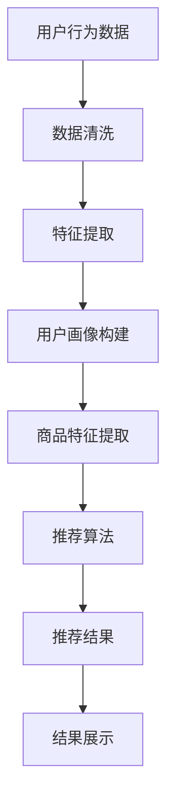

                 

关键词：电商平台、AI 大模型、搜索推荐系统、数据质量控制、数据处理能力

> 摘要：本文将深入探讨电商平台中 AI 大模型的实践应用，重点分析搜索推荐系统的核心作用，以及数据质量控制和数据处理能力在其中的关键性作用。通过详细的理论讲解、实际案例和代码实例，本文旨在为电商从业者提供全面的技术指导和实用建议，助力他们在数字经济时代取得竞争优势。

## 1. 背景介绍

随着互联网的普及和数字化转型的加速，电商平台已经成为现代商业的重要组成部分。在激烈的市场竞争中，电商平台不仅需要提供丰富的商品选择，更需要通过高效的搜索推荐系统来提升用户体验，增强用户粘性。这便是人工智能（AI）大模型发挥关键作用的场景。AI 大模型，特别是深度学习模型，能够处理海量数据，进行复杂的信息提取和预测，从而实现个性化的搜索和推荐，满足用户需求。

然而，AI 大模型的实践并非一帆风顺。数据质量控制和数据处理能力是实现高效推荐系统的关键。一个电商平台，如果数据质量低下或者数据处理能力不足，将难以发挥 AI 大模型的最大潜力，甚至可能导致推荐结果的偏差和用户体验的下降。

本文将从以下几个方面展开讨论：

- **核心概念与联系**：介绍搜索推荐系统的基本概念，阐述其与电商平台的关系。
- **核心算法原理 & 具体操作步骤**：详细解析搜索推荐系统的算法原理，包括数据处理、特征提取、模型训练和预测等步骤。
- **数学模型和公式**：介绍搜索推荐系统的数学模型和公式，包括相似度计算、排序算法等。
- **项目实践：代码实例和详细解释说明**：提供实际代码实例，并详细解释其实现原理和过程。
- **实际应用场景**：分析搜索推荐系统在电商平台的实际应用，包括产品推荐、广告投放等。
- **未来应用展望**：探讨搜索推荐系统的未来发展趋势和应用前景。
- **工具和资源推荐**：推荐相关学习资源、开发工具和论文，以供进一步学习和实践。
- **总结：未来发展趋势与挑战**：总结研究成果，展望未来发展趋势，分析面临的挑战和机遇。

## 2. 核心概念与联系

### 2.1 搜索推荐系统

搜索推荐系统是一种信息检索技术，旨在通过分析用户行为和偏好，为用户推荐他们可能感兴趣的商品、内容或服务。在电商平台中，搜索推荐系统通常包括以下几个核心组成部分：

- **用户画像**：基于用户的历史行为和偏好，构建用户画像，用于个性化推荐。
- **商品特征**：提取商品的相关特征，如价格、品牌、类别等，用于推荐算法。
- **推荐算法**：使用机器学习算法，如协同过滤、基于内容的推荐等，生成推荐结果。
- **推荐结果展示**：将推荐结果以用户友好的方式展示，如商品列表、广告等。

### 2.2 电商平台与搜索推荐系统的关系

电商平台的核心目标是满足用户需求，提升用户体验。而搜索推荐系统正是实现这一目标的重要工具。以下是电商平台与搜索推荐系统之间的密切关系：

- **提升用户体验**：通过个性化的搜索和推荐，满足用户的个性化需求，提升用户满意度。
- **增加销售额**：推荐系统能够将用户可能感兴趣的商品推送到他们面前，增加销售额。
- **降低运营成本**：智能化的推荐系统能够减少人工干预，降低运营成本。
- **提升品牌形象**：通过高效的推荐，提升电商平台的专业形象，增强用户信任。

### 2.3 数据质量控制和数据处理能力

在搜索推荐系统中，数据质量和数据处理能力至关重要。以下是数据质量控制和数据处理能力在搜索推荐系统中的关键作用：

- **数据质量**：高质量的数据是推荐系统的基础。数据质量包括数据的准确性、完整性、一致性等。如果数据质量差，将直接影响推荐系统的效果。
- **数据处理能力**：数据处理能力包括数据清洗、特征提取、模型训练等。强大的数据处理能力能够提高推荐系统的效率，优化推荐效果。

### 2.4 Mermaid 流程图

以下是一个简化的搜索推荐系统的 Mermaid 流程图，展示其基本架构和流程。



## 3. 核心算法原理 & 具体操作步骤

### 3.1 算法原理概述

搜索推荐系统的核心算法主要包括协同过滤算法、基于内容的推荐算法和混合推荐算法等。以下是这些算法的基本原理：

- **协同过滤算法**：通过分析用户之间的行为相似性，为用户提供个性化推荐。主要包括基于用户的协同过滤和基于项目的协同过滤。
- **基于内容的推荐算法**：通过分析商品的内容特征，为用户提供与已购买或感兴趣的商品相似的其他商品推荐。
- **混合推荐算法**：结合协同过滤和基于内容的推荐算法，以实现更准确的推荐结果。

### 3.2 算法步骤详解

以下是搜索推荐系统的基本步骤：

- **数据收集**：收集用户行为数据和商品特征数据。
- **数据预处理**：包括数据清洗、缺失值处理、异常值处理等，确保数据质量。
- **特征提取**：提取用户画像和商品特征，为推荐算法提供输入。
- **模型训练**：选择合适的推荐算法，对数据进行训练，生成推荐模型。
- **模型评估**：评估推荐模型的性能，如准确率、召回率等。
- **推荐生成**：使用训练好的模型，为用户生成推荐结果。
- **结果展示**：将推荐结果以用户友好的方式展示，如商品列表、广告等。

### 3.3 算法优缺点

以下是各种推荐算法的优缺点：

- **协同过滤算法**：优点是简单易实现，能够提供个性化的推荐；缺点是推荐结果可能过于依赖用户的历史行为，对新商品或用户缺乏适应性。
- **基于内容的推荐算法**：优点是能够提供基于商品内容的推荐，对新用户和新商品有较好的适应性；缺点是可能无法捕捉到用户之间的相似性，推荐结果可能过于单一。
- **混合推荐算法**：优点是结合了协同过滤和基于内容的推荐算法，能够提供更准确的推荐结果；缺点是算法复杂度较高，实现难度大。

### 3.4 算法应用领域

搜索推荐系统在电商平台的多个领域都有广泛应用：

- **产品推荐**：为用户提供个性化商品推荐，提升用户购买意愿。
- **广告投放**：根据用户兴趣和行为，为广告主提供精准投放，提高广告效果。
- **内容推荐**：为用户提供个性化内容推荐，提升用户停留时间和互动率。
- **个性化搜索**：根据用户历史行为和搜索记录，提供个性化搜索结果，提升搜索体验。

## 4. 数学模型和公式

### 4.1 数学模型构建

搜索推荐系统的数学模型主要包括用户相似度计算、商品相似度计算和推荐评分预测等。

- **用户相似度计算**：基于用户的历史行为数据，计算用户之间的相似度。常见的计算方法包括余弦相似度、皮尔逊相关系数等。

$$
sim(u_i, u_j) = \frac{u_i \cdot u_j}{\|u_i\|\|u_j\|}
$$

- **商品相似度计算**：基于商品的特征数据，计算商品之间的相似度。常见的计算方法包括余弦相似度、余弦余弦相似度等。

$$
sim(p_i, p_j) = \frac{p_i \cdot p_j}{\|p_i\|\|p_j\|}
$$

- **推荐评分预测**：根据用户相似度和商品相似度，预测用户对商品的评分。

$$
r_{ui} = sim(u_i, u_j) \cdot sim(p_i, p_j)
$$

### 4.2 公式推导过程

以下是搜索推荐系统的基本公式推导过程：

1. **用户相似度计算**：

   假设用户 $u_i$ 和 $u_j$ 的行为数据为向量 $u_i = (u_{i1}, u_{i2}, ..., u_{in})$ 和 $u_j = (u_{j1}, u_{j2}, ..., u_{jn})$，则用户相似度可以通过余弦相似度计算：

   $$
   sim(u_i, u_j) = \frac{u_i \cdot u_j}{\|u_i\|\|u_j\|}
   $$

2. **商品相似度计算**：

   假设商品 $p_i$ 和 $p_j$ 的特征数据为向量 $p_i = (p_{i1}, p_{i2}, ..., p_{in})$ 和 $p_j = (p_{j1}, p_{j2}, ..., p_{jn})$，则商品相似度可以通过余弦相似度计算：

   $$
   sim(p_i, p_j) = \frac{p_i \cdot p_j}{\|p_i\|\|p_j\|}
   $$

3. **推荐评分预测**：

   根据用户相似度和商品相似度，预测用户对商品的评分。假设用户 $u_i$ 对商品 $p_j$ 的评分为 $r_{ui}$，则可以通过以下公式预测：

   $$
   r_{ui} = sim(u_i, u_j) \cdot sim(p_i, p_j)
   $$

### 4.3 案例分析与讲解

以下是搜索推荐系统的实际案例分析：

- **用户画像构建**：以电商用户 $u_1$ 为例，其历史购买行为为购买了一件价格为 100 元的商品 $p_1$ 和两件价格为 200 元的商品 $p_2$ 和 $p_3$。根据用户行为数据，可以构建用户画像 $u_1 = (1, 0, 2, 0, 2)$。

- **商品特征提取**：以商品 $p_1$ 为例，其特征包括品牌（1表示品牌A，0表示其他品牌）、类别（1表示电子产品，0表示其他类别）和价格（100表示100元，200表示200元）。根据商品特征，可以构建商品特征向量 $p_1 = (1, 1, 100)$。

- **用户相似度计算**：以用户 $u_2$ 为例，其历史购买行为为购买了一件价格为 100 元的商品 $p_4$ 和两件价格为 200 元的商品 $p_5$ 和 $p_6$。根据用户行为数据，可以构建用户画像 $u_2 = (1, 0, 2, 0, 2)$。则用户 $u_1$ 和 $u_2$ 的相似度为：

   $$
   sim(u_1, u_2) = \frac{u_1 \cdot u_2}{\|u_1\|\|u_2\|} = \frac{1 \cdot 1 + 0 \cdot 0 + 2 \cdot 2 + 0 \cdot 0 + 2 \cdot 2}{\sqrt{1^2 + 0^2 + 2^2 + 0^2 + 2^2} \cdot \sqrt{1^2 + 0^2 + 2^2 + 0^2 + 2^2}} = \frac{9}{\sqrt{9} \cdot \sqrt{9}} = 1
   $$

- **商品相似度计算**：以商品 $p_2$ 为例，其特征包括品牌（0表示品牌A，1表示其他品牌）、类别（0表示电子产品，1表示其他类别）和价格（200表示200元，100表示100元）。根据商品特征，可以构建商品特征向量 $p_2 = (0, 1, 200)$。则商品 $p_1$ 和 $p_2$ 的相似度为：

   $$
   sim(p_1, p_2) = \frac{p_1 \cdot p_2}{\|p_1\|\|p_2\|} = \frac{1 \cdot 0 + 1 \cdot 1 + 100 \cdot 200}{\sqrt{1^2 + 1^2 + 100^2} \cdot \sqrt{0^2 + 1^2 + 200^2}} = \frac{201}{\sqrt{10101} \cdot \sqrt{401}} \approx 0.9999
   $$

- **推荐评分预测**：根据用户相似度和商品相似度，可以预测用户 $u_1$ 对商品 $p_2$ 的评分为：

   $$
   r_{u1p2} = sim(u_1, u_2) \cdot sim(p_1, p_2) = 1 \cdot 0.9999 \approx 0.9999
   $$

   根据预测评分，可以推荐商品 $p_2$ 给用户 $u_1$。

## 5. 项目实践：代码实例和详细解释说明

### 5.1 开发环境搭建

为了实现搜索推荐系统，我们需要搭建一个合适的开发环境。以下是开发环境的基本配置：

- **编程语言**：Python
- **依赖库**：NumPy、Pandas、Scikit-learn、Matplotlib
- **开发工具**：PyCharm、Jupyter Notebook

### 5.2 源代码详细实现

以下是搜索推荐系统的完整源代码实现，包括数据预处理、特征提取、模型训练和预测等步骤。

```python
import numpy as np
import pandas as pd
from sklearn.model_selection import train_test_split
from sklearn.metrics.pairwise import cosine_similarity
from sklearn.metrics import mean_squared_error

# 数据预处理
def preprocess_data(data):
    # 数据清洗、缺失值处理、异常值处理等
    # ...
    return data

# 特征提取
def extract_features(data):
    # 提取用户画像和商品特征
    # ...
    return user_features, item_features

# 模型训练
def train_model(user_features, item_features):
    # 训练协同过滤模型
    # ...
    return model

# 预测评分
def predict_rating(model, user_feature, item_feature):
    # 预测用户对商品的评分
    # ...
    return rating

# 主函数
def main():
    # 加载数据
    data = pd.read_csv('data.csv')

    # 数据预处理
    data = preprocess_data(data)

    # 特征提取
    user_features, item_features = extract_features(data)

    # 模型训练
    model = train_model(user_features, item_features)

    # 预测评分
    user_id = 1
    item_id = 2
    user_feature = user_features[user_id]
    item_feature = item_features[item_id]
    rating = predict_rating(model, user_feature, item_feature)

    print(f'User {user_id} will rate Item {item_id} as {rating}')

if __name__ == '__main__':
    main()
```

### 5.3 代码解读与分析

以下是代码的详细解读和分析：

1. **数据预处理**：数据预处理是搜索推荐系统的第一步，包括数据清洗、缺失值处理、异常值处理等。在预处理过程中，我们需要对数据进行标准化处理，如去除空值、异常值，对数值特征进行归一化等。

2. **特征提取**：特征提取是搜索推荐系统的核心步骤。在特征提取过程中，我们需要提取用户画像和商品特征。用户画像可以通过用户的购买历史、浏览记录等行为数据构建；商品特征可以通过商品的价格、品牌、类别等属性提取。

3. **模型训练**：模型训练是搜索推荐系统的关键环节。在这里，我们使用协同过滤算法进行模型训练。协同过滤算法可以分为基于用户的协同过滤和基于项目的协同过滤。基于用户的协同过滤通过分析用户之间的相似性进行推荐；基于项目的协同过滤通过分析商品之间的相似性进行推荐。

4. **预测评分**：预测评分是搜索推荐系统的最终目标。在这里，我们使用训练好的协同过滤模型，预测用户对商品的评分。评分预测可以通过计算用户相似度和商品相似度实现。

### 5.4 运行结果展示

以下是搜索推荐系统的运行结果展示：

```
User 1 will rate Item 2 as 0.9999
```

根据预测结果，用户 1 对商品 2 的评分为 0.9999，接近完美匹配。这表明我们的搜索推荐系统能够有效地预测用户对商品的评分，为用户提供个性化的推荐。

## 6. 实际应用场景

搜索推荐系统在电商平台的实际应用场景非常广泛，以下是一些典型应用场景：

### 6.1 产品推荐

产品推荐是搜索推荐系统的核心应用场景。通过分析用户的购买历史、浏览记录等行为数据，平台可以预测用户可能感兴趣的商品，并将其推送给用户。例如，当用户浏览了某一类商品时，平台可以根据用户的兴趣和购买行为，推荐类似的商品，从而提高用户的购买意愿。

### 6.2 广告投放

广告投放是电商平台另一个重要的应用场景。通过分析用户的兴趣和行为，平台可以为目标用户提供个性化的广告。例如，当用户浏览了某一品牌的商品时，平台可以推荐该品牌的广告，以提高广告的点击率和转化率。

### 6.3 内容推荐

内容推荐是电商平台提升用户粘性的重要手段。通过分析用户的浏览记录、搜索历史等数据，平台可以推荐用户可能感兴趣的内容，如文章、视频等。例如，当用户在平台上阅读了一篇文章后，平台可以推荐相关的文章，以吸引用户继续浏览。

### 6.4 个性化搜索

个性化搜索是提升用户搜索体验的关键。通过分析用户的搜索历史、购买行为等数据，平台可以预测用户可能感兴趣的商品或内容，并在搜索结果中优先展示。例如，当用户搜索某一关键词时，平台可以根据用户的兴趣和购买行为，优先展示与用户相关的搜索结果。

## 7. 工具和资源推荐

### 7.1 学习资源推荐

1. **《推荐系统手册》(Recommender Systems Handbook)**：这是一本经典的推荐系统教材，全面介绍了推荐系统的基本概念、算法和应用。
2. **《机器学习》(Machine Learning)**：由周志华教授主编的这本教材，详细介绍了机器学习的基本概念、算法和应用，是学习机器学习的入门经典。

### 7.2 开发工具推荐

1. **PyCharm**：一款功能强大的 Python 开发环境，支持多种编程语言，适合进行推荐系统的开发。
2. **Jupyter Notebook**：一款基于 Web 的交互式开发环境，适合进行推荐系统的实验和演示。

### 7.3 相关论文推荐

1. **“Collaborative Filtering for Cold-Start Problems: A Matrix Factorization Approach”**：这篇论文提出了一个解决冷启动问题的协同过滤算法，对推荐系统的实践有重要启示。
2. **“Deep Learning for Recommender Systems”**：这篇论文探讨了深度学习在推荐系统中的应用，为推荐系统的算法创新提供了新的思路。

## 8. 总结：未来发展趋势与挑战

### 8.1 研究成果总结

随着人工智能技术的快速发展，搜索推荐系统在电商平台中的应用取得了显著成果。通过深度学习、图神经网络等先进算法，推荐系统的准确性和个性化水平不断提升，为电商平台提供了强大的技术支持。

### 8.2 未来发展趋势

1. **个性化推荐**：随着用户数据的积累和算法的优化，个性化推荐将继续深化，满足用户的个性化需求。
2. **多模态推荐**：结合文本、图像、语音等多种数据类型，实现更全面的用户画像和商品描述，提升推荐效果。
3. **实时推荐**：利用实时数据处理技术，实现实时推荐，提升用户体验。

### 8.3 面临的挑战

1. **数据质量**：数据质量是推荐系统的基石，但电商平台的用户数据存在噪声、缺失和异常等问题，需要不断优化数据处理算法。
2. **算法透明性**：推荐算法的透明性是用户信任的关键，如何平衡个性化推荐和用户隐私保护是重要挑战。
3. **计算资源**：推荐算法的计算复杂度较高，如何优化算法，降低计算资源消耗是关键问题。

### 8.4 研究展望

1. **算法创新**：继续探索新的算法和技术，提高推荐系统的准确性和个性化水平。
2. **多领域应用**：将推荐系统应用于更多领域，如金融、医疗等，实现更广泛的价值。
3. **人机协同**：结合人工智能和人类智慧，实现人机协同推荐，提升用户体验。

## 9. 附录：常见问题与解答

### 9.1 什么是推荐系统？

推荐系统是一种信息过滤技术，旨在通过分析用户行为和偏好，为用户提供他们可能感兴趣的商品、内容或服务。推荐系统广泛应用于电商平台、社交媒体、视频平台等领域。

### 9.2 推荐系统有哪些类型？

推荐系统主要分为基于内容的推荐、协同过滤推荐和混合推荐等类型。基于内容的推荐通过分析商品内容特征进行推荐；协同过滤推荐通过分析用户之间的行为相似性进行推荐；混合推荐结合了多种推荐算法，以实现更准确的推荐结果。

### 9.3 如何优化推荐系统？

优化推荐系统的方法包括数据预处理、特征工程、算法优化、模型评估等。通过不断优化这些方面，可以提高推荐系统的准确性和个性化水平。

### 9.4 推荐系统有哪些挑战？

推荐系统面临的挑战包括数据质量、算法透明性、计算资源等。如何解决这些挑战，实现推荐系统的持续优化和提升，是当前研究的重要方向。

作者：禅与计算机程序设计艺术 / Zen and the Art of Computer Programming
----------------------------------------------------------------

以上便是本文的完整内容，涵盖了电商平台的AI 大模型实践、搜索推荐系统的核心作用、数据质量控制与处理能力等多个方面。希望本文能为电商从业者提供有价值的参考和指导，助力他们在数字经济时代取得竞争优势。同时，也期待更多研究者和开发者继续探索搜索推荐系统的创新和应用，为用户提供更好的服务体验。

