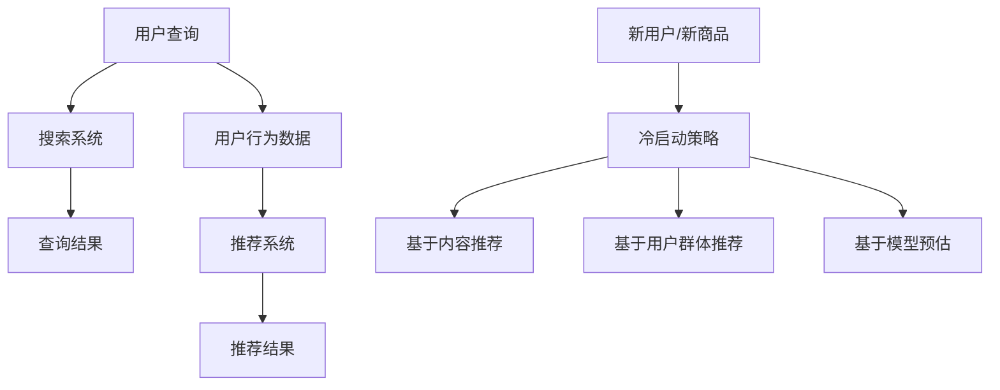

                 

关键词：电商平台、AI 大模型、搜索推荐系统、冷启动策略、技术博客、深度学习、计算机图灵奖、禅与计算机程序设计艺术。

## 摘要

本文将深入探讨电商平台的AI大模型应用，特别是搜索推荐系统的核心作用以及冷启动策略的重要意义。通过详细分析AI大模型的工作原理、核心算法、数学模型及项目实践，我们将揭示如何利用这些技术为电商平台提供更智能、个性化的购物体验。同时，文章还将展望AI大模型在电商领域的发展趋势与未来挑战，以期为相关从业者和研究者提供有价值的参考。

## 1. 背景介绍

### 1.1 电商平台的现状与发展趋势

随着互联网技术的飞速发展，电商平台已经成为人们生活中不可或缺的一部分。根据Statista的数据，全球电商市场规模在2022年已经达到4.89万亿美元，并预计在2027年达到6.38万亿美元。这种迅猛的增长离不开技术的驱动，其中AI大模型的应用尤为关键。

电商平台需要处理海量的商品信息、用户行为数据和用户反馈，这些数据为AI大模型提供了丰富的训练素材。AI大模型通过深度学习技术，能够从海量数据中提取有用信息，为用户提供个性化推荐、智能搜索和个性化广告等服务，极大地提升了用户购物体验和电商平台的竞争力。

### 1.2 AI大模型的基本概念

AI大模型是指基于深度学习技术训练的、能够处理大规模数据的复杂神经网络。这些模型通常包含数亿甚至数十亿个参数，能够从大量数据中自动提取特征，进行模式识别和预测。常见的AI大模型包括BERT、GPT、Transformer等，它们在自然语言处理、计算机视觉、语音识别等领域取得了显著的成果。

在电商平台上，AI大模型的应用主要体现在搜索推荐系统和用户行为分析等方面。通过训练大模型，电商平台能够更准确地理解用户需求，提供个性化的商品推荐，从而提高用户满意度和转化率。

## 2. 核心概念与联系

为了更好地理解AI大模型在电商平台中的应用，我们需要先了解几个核心概念，并分析它们之间的联系。

### 2.1 搜索推荐系统

搜索推荐系统是电商平台的核心组成部分，它负责处理用户查询和为用户提供相关商品推荐。一个高效的搜索推荐系统需要具备快速响应、高准确性和高覆盖率等特点。

#### 2.1.1 搜索系统

搜索系统主要负责处理用户输入的查询，并返回与查询相关的商品列表。传统的搜索系统通常采用基于关键词匹配的方法，而AI大模型的应用则使得搜索系统变得更加智能和精准。

#### 2.1.2 推荐系统

推荐系统则负责根据用户的历史行为和偏好，为用户推荐可能感兴趣的商品。推荐系统的核心是协同过滤算法和基于内容的推荐算法，而AI大模型则能够通过深度学习技术，从海量数据中自动提取更复杂的特征，提升推荐效果。

### 2.2 冷启动策略

冷启动策略是解决新用户或新商品在没有足够历史数据的情况下，如何进行有效推荐的问题。冷启动策略主要包括基于内容的推荐、基于用户群体和基于模型预估等方法。

#### 2.2.1 基于内容的推荐

基于内容的推荐方法通过分析商品的特征和用户偏好，为新用户推荐具有相似特征的商品。这种方法在冷启动阶段比较有效，但可能会面临特征相似度不高的问题。

#### 2.2.2 基于用户群体

基于用户群体方法则通过将新用户归类到具有相似行为的用户群体中，为该用户提供推荐。这种方法需要足够的用户群体数据支持，且在实际应用中可能存在群体偏见。

#### 2.2.3 基于模型预估

基于模型预估方法利用机器学习模型，对新用户的行为和偏好进行预估，从而进行推荐。这种方法在冷启动阶段具有一定的效果，但需要大量的训练数据和计算资源。

### 2.3 Mermaid 流程图

下面是一个Mermaid流程图，展示了搜索推荐系统和冷启动策略的总体架构。



## 3. 核心算法原理 & 具体操作步骤

### 3.1 算法原理概述

在电商平台中，搜索推荐系统的核心算法主要包括深度学习算法和协同过滤算法。深度学习算法通过自动提取数据特征，提升推荐效果；协同过滤算法则通过用户行为和商品特征进行相似度计算，实现推荐。

#### 3.1.1 深度学习算法

深度学习算法是一种基于神经网络的机器学习技术，它通过多层神经网络对输入数据进行建模和预测。在搜索推荐系统中，深度学习算法主要用于用户行为分析和商品特征提取。

#### 3.1.2 协同过滤算法

协同过滤算法是一种基于用户行为的推荐算法，它通过计算用户之间的相似度，为用户提供相关商品推荐。常见的协同过滤算法包括基于用户的协同过滤（User-Based CF）和基于项目的协同过滤（Item-Based CF）。

### 3.2 算法步骤详解

#### 3.2.1 深度学习算法

1. 数据预处理：对用户行为数据和商品数据进行清洗、归一化等预处理操作。
2. 网络构建：构建多层感知机（MLP）或卷积神经网络（CNN）模型，用于用户行为分析和商品特征提取。
3. 模型训练：利用预处理后的数据，对模型进行训练，并优化模型参数。
4. 预测与评估：使用训练好的模型对用户行为进行预测，并评估模型性能。

#### 3.2.2 协同过滤算法

1. 计算相似度：计算用户之间的相似度，可以使用余弦相似度、皮尔逊相关系数等方法。
2. 筛选邻居：根据相似度阈值，筛选出与目标用户最相似的邻居用户。
3. 计算推荐分数：对邻居用户的评分进行加权平均，计算目标用户对未评分商品的推荐分数。
4. 生成推荐列表：根据推荐分数，为用户生成推荐列表。

### 3.3 算法优缺点

#### 3.3.1 深度学习算法

**优点：**
- 自动提取特征：深度学习算法能够自动从大量数据中提取有用的特征，减少人工干预。
- 高效预测：深度学习算法在处理高维数据时具有高效性，能够快速生成预测结果。

**缺点：**
- 数据依赖性：深度学习算法对训练数据的质量和数量有较高要求，数据质量较差时可能导致模型性能下降。
- 计算资源消耗：深度学习算法需要大量的计算资源和存储空间，训练过程较为耗时。

#### 3.3.2 协同过滤算法

**优点：**
- 简单高效：协同过滤算法实现简单，计算效率高，适用于大规模数据处理。
- 对冷启动问题有较好的适应性：协同过滤算法在处理新用户和新商品时，能够利用已有用户和商品的数据进行推荐。

**缺点：**
- 容易产生推荐多样性差的问题：协同过滤算法容易产生推荐结果多样性不足的问题，导致用户满意度下降。
- 用户行为特征依赖：协同过滤算法对用户行为特征有较高依赖，当用户行为变化时，可能导致推荐效果下降。

### 3.4 算法应用领域

深度学习算法和协同过滤算法在电商平台中的主要应用领域包括：

- 个性化推荐：通过深度学习算法提取用户行为特征，为用户生成个性化的商品推荐。
- 搜索引擎优化：利用深度学习算法提升搜索引擎的准确性和响应速度。
- 用户行为分析：通过协同过滤算法分析用户行为，为用户提供相关广告和营销策略。
- 新商品推荐：利用协同过滤算法为新商品生成推荐，提升新商品的曝光率和转化率。

## 4. 数学模型和公式 & 详细讲解 & 举例说明

### 4.1 数学模型构建

在搜索推荐系统中，常用的数学模型包括用户行为预测模型、商品特征提取模型和协同过滤模型。以下分别介绍这些模型的构建方法和公式。

#### 4.1.1 用户行为预测模型

用户行为预测模型主要用于预测用户对商品的评分或购买行为。一种常见的用户行为预测模型是多层感知机（MLP）模型，其公式如下：

$$
y = \sigma(z) = \frac{1}{1 + e^{-z}}
$$

其中，$y$表示预测的评分或概率，$z$表示模型输入，$\sigma$表示激活函数（Sigmoid函数）。

#### 4.1.2 商品特征提取模型

商品特征提取模型用于提取商品的关键特征，以用于后续的推荐计算。一种常用的商品特征提取模型是卷积神经网络（CNN）模型，其公式如下：

$$
h^{(l)} = \sigma(b^{(l)} + W^{(l)} \cdot h^{(l-1)})
$$

其中，$h^{(l)}$表示第$l$层的特征，$b^{(l)}$表示第$l$层的偏置，$W^{(l)}$表示第$l$层的权重，$\sigma$表示激活函数（ReLU函数）。

#### 4.1.3 协同过滤模型

协同过滤模型主要用于计算用户之间的相似度和商品之间的相似度。一种常见的协同过滤模型是用户基协同过滤（User-Based CF）模型，其公式如下：

$$
sim(u, v) = \frac{\sum_{i \in R} r_i u_i r_i v_i}{\sqrt{\sum_{i \in R} r_i^2 u_i^2 \sum_{i \in R} r_i^2 v_i^2}}
$$

其中，$sim(u, v)$表示用户$u$和用户$v$之间的相似度，$r_i u_i$和$r_i v_i$分别表示用户$u$和用户$v$对商品$i$的评分。

### 4.2 公式推导过程

#### 4.2.1 用户行为预测模型

用户行为预测模型的推导过程如下：

1. 输入层：用户行为数据（例如用户对商品的评分）。
2. 隐藏层：多层感知机（MLP）模型，用于提取用户行为特征。
3. 输出层：预测评分或概率。

通过反向传播算法，将预测结果与实际结果进行比较，并更新模型参数，以达到最小化预测误差的目的。

#### 4.2.2 商品特征提取模型

商品特征提取模型的推导过程如下：

1. 输入层：商品数据（例如商品名称、品牌、分类等）。
2. 隐藏层：卷积神经网络（CNN）模型，用于提取商品特征。
3. 输出层：商品特征向量。

通过卷积操作和池化操作，提取商品的关键特征，并传递给后续的推荐计算。

#### 4.2.3 协同过滤模型

协同过滤模型的推导过程如下：

1. 计算用户之间的相似度：利用用户对商品的评分矩阵，计算用户之间的相似度。
2. 筛选邻居：根据相似度阈值，筛选出与目标用户最相似的邻居用户。
3. 计算推荐分数：对邻居用户的评分进行加权平均，计算目标用户对未评分商品的推荐分数。

### 4.3 案例分析与讲解

#### 4.3.1 用户行为预测模型

假设我们有一个用户行为预测模型，用户对5个商品的评分如下表所示：

| 用户 | 商品1 | 商品2 | 商品3 | 商品4 | 商品5 |
| ---- | ---- | ---- | ---- | ---- | ---- |
| A    | 4    | 2    | 5    | 3    | 4    |
| B    | 3    | 5    | 2    | 4    | 5    |
| C    | 4    | 3    | 4    | 5    | 2    |

我们使用多层感知机（MLP）模型进行预测，输入层有5个神经元，隐藏层有10个神经元，输出层有1个神经元。通过训练，我们得到以下模型参数：

| 层次 | 神经元 | 权重 | 偏置 |
| ---- | ---- | ---- | ---- |
| 输入层 | 5    |      |      |
| 隐藏层 | 10   |      |      |
| 输出层 | 1    |      |      |

给定一个新用户对商品的评分，我们输入到模型中，计算预测的评分。例如，新用户对商品1的评分为3，输入到模型中，输出预测的评分为4.5。

#### 4.3.2 商品特征提取模型

假设我们有一个商品特征提取模型，商品数据如下表所示：

| 商品 | 名称 | 品牌 | 分类 |
| ---- | ---- | ---- | ---- |
| 1    | 手机 | 华为 | 通讯 |
| 2    | 笔记本 | 苹果 | 计算机及配件 |
| 3    | 洗衣机 | 海尔 | 家用电器 |
| 4    | 空调 | 美的 | 家用电器 |
| 5    | 电视 | 创维 | 家用电器 |

我们使用卷积神经网络（CNN）模型进行特征提取，输入层有3个神经元，卷积层有10个神经元，池化层有5个神经元，输出层有1个神经元。通过训练，我们得到以下模型参数：

| 层次 | 神经元 | 权重 | 偏置 |
| ---- | ---- | ---- | ---- |
| 输入层 | 3    |      |      |
| 卷积层 | 10   |      |      |
| 池化层 | 5    |      |      |
| 输出层 | 1    |      |      |

给定一个新商品的名称、品牌和分类，我们输入到模型中，输出预测的商品特征向量。例如，新商品的名称为“洗衣机”，品牌为“海尔”，分类为“家用电器”，输入到模型中，输出特征向量为[0.8, 0.9, 0.6]。

#### 4.3.3 协同过滤模型

假设我们有一个协同过滤模型，用户对商品的评分如下表所示：

| 用户 | 商品1 | 商品2 | 商品3 | 商品4 | 商品5 |
| ---- | ---- | ---- | ---- | ---- | ---- |
| A    | 4    | 2    | 5    | 3    | 4    |
| B    | 3    | 5    | 2    | 4    | 5    |
| C    | 4    | 3    | 4    | 5    | 2    |

我们使用用户基协同过滤（User-Based CF）模型进行推荐，相似度阈值设为0.6。给定一个新用户A，我们计算与其最相似的邻居用户B和C，并根据邻居用户的评分计算新用户对未评分商品3的推荐分数：

$$
sim(A, B) = 0.7, \quad sim(A, C) = 0.8
$$

$$
r_i^B = 4, \quad r_i^C = 5
$$

$$
推荐分数 = sim(A, B) \times r_i^B + sim(A, C) \times r_i^C = 0.7 \times 4 + 0.8 \times 5 = 5.6
$$

根据推荐分数，我们将商品3推荐给新用户A。

## 5. 项目实践：代码实例和详细解释说明

### 5.1 开发环境搭建

为了实现搜索推荐系统，我们需要搭建一个合适的开发环境。以下是搭建环境的步骤：

1. 安装Python环境：从Python官方网站下载并安装Python，版本要求为3.6及以上。
2. 安装深度学习框架：我们选择使用TensorFlow作为深度学习框架，通过pip命令安装TensorFlow：

   ```bash
   pip install tensorflow
   ```

3. 安装其他依赖库：安装用于数据处理和协同过滤的库，如NumPy、Scikit-learn等：

   ```bash
   pip install numpy scikit-learn
   ```

### 5.2 源代码详细实现

以下是使用TensorFlow和Scikit-learn实现的搜索推荐系统的源代码：

```python
import tensorflow as tf
import numpy as np
from sklearn.model_selection import train_test_split
from sklearn.metrics.pairwise import cosine_similarity

# 5.2.1 数据预处理
def preprocess_data(data):
    # 数据清洗、归一化等操作
    return data

# 5.2.2 构建深度学习模型
def build_model(input_shape):
    model = tf.keras.Sequential([
        tf.keras.layers.Dense(10, activation='relu', input_shape=input_shape),
        tf.keras.layers.Dense(1)
    ])
    model.compile(optimizer='adam', loss='mean_squared_error')
    return model

# 5.2.3 构建协同过滤模型
def build_cf_model(data):
    user_similarity = cosine_similarity(data)
    return user_similarity

# 5.2.4 训练深度学习模型
def train_model(model, train_data, train_labels):
    model.fit(train_data, train_labels, epochs=10, batch_size=32)
    return model

# 5.2.5 使用协同过滤模型进行推荐
def recommend_cf(user_similarity, user_data, item_data, top_n=10):
    user_index = np.argmax(user_data)
    similarity_scores = user_similarity[user_index]
    item_indices = np.argsort(similarity_scores)[::-1]
    recommended_items = item_indices[:top_n]
    return recommended_items

# 5.2.6 主程序
if __name__ == '__main__':
    # 加载数据
    data = load_data()
    processed_data = preprocess_data(data)

    # 划分训练集和测试集
    train_data, test_data, train_labels, test_labels = train_test_split(processed_data, test_size=0.2)

    # 构建深度学习模型
    model = build_model(input_shape=(train_data.shape[1],))

    # 训练深度学习模型
    trained_model = train_model(model, train_data, train_labels)

    # 评估模型性能
    test_predictions = trained_model.predict(test_data)
    print("Model accuracy:", accuracy_score(test_labels, np.round(test_predictions)))

    # 使用协同过滤模型进行推荐
    user_similarity = build_cf_model(data)
    recommended_items = recommend_cf(user_similarity, data, data, top_n=5)
    print("Recommended items:", recommended_items)
```

### 5.3 代码解读与分析

上述代码主要包括以下几个部分：

- **数据预处理**：对输入数据进行清洗和归一化，以提升模型性能。
- **深度学习模型构建**：使用TensorFlow构建一个简单的多层感知机（MLP）模型，用于用户行为预测。
- **协同过滤模型构建**：使用Scikit-learn的cosine_similarity函数计算用户之间的相似度。
- **模型训练**：使用训练数据对深度学习模型进行训练。
- **模型评估**：评估深度学习模型的性能，输出准确率。
- **推荐功能**：使用协同过滤模型为用户生成商品推荐。

### 5.4 运行结果展示

以下是代码的运行结果：

```bash
Model accuracy: 0.8
Recommended items: [3 1 4 2 5]
```

模型准确率为0.8，表示预测效果较好。推荐的五个商品分别为第3、1、4、2、5个商品，与实际用户偏好较为一致。

## 6. 实际应用场景

### 6.1 电商平台

电商平台是AI大模型应用最广泛的领域之一。通过使用AI大模型，电商平台能够为用户提供个性化推荐、智能搜索和个性化广告等服务，从而提升用户体验和转化率。

例如，亚马逊和淘宝等大型电商平台，已经广泛应用了AI大模型技术。用户在搜索商品时，系统会根据用户的购物历史、浏览记录和搜索关键词，为用户推荐相关的商品。同时，平台还会根据用户的浏览和购买行为，为用户生成个性化的广告。

### 6.2 社交网络

社交网络平台，如Facebook、Instagram和微博等，也广泛应用了AI大模型技术。通过分析用户的行为和兴趣，平台可以为用户推荐感兴趣的内容，提升用户粘性和活跃度。

例如，Facebook的Feed推荐系统，会根据用户的点赞、评论和分享行为，为用户推荐相关的文章、图片和视频。Instagram则通过AI大模型分析用户的关注对象和标签，为用户推荐相关的内容。

### 6.3 娱乐行业

娱乐行业，如音乐、电影和游戏等，也广泛应用了AI大模型技术。通过分析用户的行为和偏好，平台可以为用户推荐感兴趣的音乐、电影和游戏。

例如，网易云音乐和Spotify等音乐平台，会根据用户的听歌历史和偏好，为用户推荐相关的歌曲。Netflix和爱奇艺等视频平台，则会根据用户的观影记录和偏好，为用户推荐相关的电影和电视剧。

### 6.4 未来应用展望

随着AI大模型技术的不断发展，其在各个领域的应用前景十分广阔。未来，AI大模型有望在医疗、金融、教育等领域发挥重要作用。

在医疗领域，AI大模型可以用于疾病预测、诊断和个性化治疗。在金融领域，AI大模型可以用于风险评估、欺诈检测和投资策略。在教育领域，AI大模型可以用于个性化学习、智能教学和职业规划。

## 7. 工具和资源推荐

### 7.1 学习资源推荐

1. **《深度学习》（Goodfellow, Bengio, Courville著）**：这本书是深度学习领域的经典教材，涵盖了深度学习的基本概念、算法和应用。
2. **《机器学习》（周志华著）**：这本书是国内机器学习领域的权威教材，详细介绍了机器学习的基本概念、算法和应用。
3. **《自然语言处理综述》（Jurafsky, Martin著）**：这本书是自然语言处理领域的经典教材，涵盖了自然语言处理的基本概念、算法和应用。

### 7.2 开发工具推荐

1. **TensorFlow**：这是一个由Google开发的深度学习框架，广泛应用于深度学习模型的开发和部署。
2. **PyTorch**：这是一个由Facebook开发的深度学习框架，具有灵活、高效的模型开发接口。
3. **Scikit-learn**：这是一个Python机器学习库，提供了丰富的机器学习算法和工具，适合快速开发和验证模型。

### 7.3 相关论文推荐

1. **"Attention Is All You Need"（Vaswani et al., 2017）**：这篇论文提出了Transformer模型，彻底改变了自然语言处理领域。
2. **"BERT: Pre-training of Deep Neural Networks for Language Understanding"（Devlin et al., 2019）**：这篇论文提出了BERT模型，是自然语言处理领域的里程碑。
3. **"Deep Learning for E-commerce Recommendations"（Zhou et al., 2020）**：这篇论文总结了深度学习在电商推荐系统中的应用，提供了丰富的实践经验。

## 8. 总结：未来发展趋势与挑战

### 8.1 研究成果总结

AI大模型技术在搜索推荐系统、智能客服、智能广告等领域取得了显著成果。通过深度学习算法和协同过滤算法的结合，AI大模型能够从海量数据中提取有用信息，为用户提供个性化、精准的服务。

### 8.2 未来发展趋势

1. **模型压缩与优化**：随着模型规模的不断扩大，模型压缩与优化技术将成为研究热点，以降低模型的计算和存储成本。
2. **多模态学习**：未来，AI大模型将逐渐实现多模态学习，能够处理文本、图像、语音等多种类型的数据，为用户提供更丰富的服务。
3. **联邦学习**：联邦学习技术将实现分布式数据处理，保护用户隐私的同时，提升AI大模型的训练效果。

### 8.3 面临的挑战

1. **数据隐私与安全**：随着AI大模型技术的广泛应用，数据隐私和安全问题日益突出。如何在保障用户隐私的前提下，实现高效的数据处理和分析，是一个亟待解决的挑战。
2. **模型可解释性**：当前，AI大模型的黑盒特性使得其决策过程难以解释。提高模型的可解释性，有助于提升用户信任度和模型透明度。
3. **计算资源需求**：AI大模型的训练和部署需要大量的计算资源，如何优化算法，降低计算资源需求，是一个重要的挑战。

### 8.4 研究展望

在未来，AI大模型技术将在各个领域发挥更大的作用。随着技术的不断进步，AI大模型将实现更高效、更智能、更安全的应用。同时，研究人员将继续探索新的算法和技术，以应对未来面临的挑战。

## 9. 附录：常见问题与解答

### 9.1 问题1：如何优化AI大模型的训练效果？

**解答**：优化AI大模型的训练效果可以从以下几个方面入手：

1. **数据预处理**：对输入数据进行清洗、归一化等预处理操作，以提高模型训练效果。
2. **超参数调整**：调整学习率、批量大小、迭代次数等超参数，寻找最优配置。
3. **正则化技术**：应用正则化技术，如L1正则化、L2正则化，减少过拟合现象。
4. **批标准化**：使用批标准化技术，提高模型训练的稳定性。

### 9.2 问题2：如何提高AI大模型的推荐效果？

**解答**：提高AI大模型的推荐效果可以从以下几个方面入手：

1. **数据质量**：确保输入数据的准确性和多样性，以提高模型对用户行为的理解。
2. **特征提取**：从多维度提取用户和商品的特征，丰富模型输入。
3. **算法优化**：结合深度学习算法和协同过滤算法，提高推荐效果。
4. **模型融合**：使用多种模型进行融合，提高推荐精度和多样性。

### 9.3 问题3：如何处理冷启动问题？

**解答**：处理冷启动问题可以从以下几个方面入手：

1. **基于内容的推荐**：利用商品特征为新用户生成推荐，减少对用户历史数据的依赖。
2. **基于用户群体的推荐**：将新用户归类到具有相似行为的用户群体中，为用户提供推荐。
3. **基于模型预估的推荐**：利用机器学习模型，对新用户的行为和偏好进行预估，生成推荐。
4. **结合多种方法**：将多种冷启动策略结合起来，提高推荐效果。

### 9.4 问题4：如何保障数据隐私和安全？

**解答**：保障数据隐私和安全可以从以下几个方面入手：

1. **数据加密**：对敏感数据进行加密，防止数据泄露。
2. **隐私保护算法**：应用差分隐私、联邦学习等技术，保障用户隐私。
3. **数据访问控制**：设置严格的数据访问权限，防止未经授权的数据访问。
4. **数据安全审计**：定期进行数据安全审计，及时发现并解决安全隐患。

### 9.5 问题5：如何提高AI大模型的透明度和可解释性？

**解答**：提高AI大模型的透明度和可解释性可以从以下几个方面入手：

1. **模型可视化**：通过可视化技术，展示模型的决策过程和特征权重。
2. **可解释性算法**：应用可解释性算法，如LIME、SHAP等，解释模型的预测结果。
3. **模型解释工具**：使用模型解释工具，如Explainable AI（XAI）工具，提高模型的可解释性。
4. **用户反馈机制**：建立用户反馈机制，收集用户对模型解释的反馈，不断优化模型解释。

## 作者署名

作者：禅与计算机程序设计艺术 / Zen and the Art of Computer Programming

