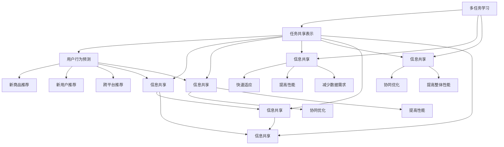

                 

在当今的数字化时代，电商推荐系统已经成为电商企业吸引和留住用户的关键。一个优秀的推荐系统能够为用户提供个性化的购物体验，从而提高用户满意度和转化率。然而，随着数据量的增加和用户行为的多样化，构建一个高效、准确的推荐系统变得越来越具有挑战性。本文将探讨多任务学习和迁移学习在电商推荐系统中的应用，旨在为读者提供一个清晰、系统的理解。

## 文章关键词

- 电商推荐系统
- 多任务学习
- 迁移学习
- 数据挖掘
- 机器学习
- 用户行为分析

## 文章摘要

本文首先介绍了电商推荐系统的基本概念、架构及其在电商行业中的重要性。接着，我们深入探讨了多任务学习和迁移学习的基本概念及其在推荐系统中的应用。随后，本文通过具体的算法原理和数学模型，详细讲解了如何在推荐系统中实现多任务学习和迁移学习。文章还通过一个实际项目实例，展示了多任务学习和迁移学习的具体应用和实践。最后，本文对未来电商推荐系统的发展趋势和面临的挑战进行了展望。

## 1. 背景介绍

随着互联网的普及和电子商务的快速发展，电商推荐系统已经成为电商企业提升用户体验和销售转化率的重要手段。一个高效的推荐系统能够根据用户的历史行为、兴趣偏好、购买记录等多维度信息，为用户推荐个性化的商品或服务，从而提升用户满意度和忠诚度。

### 1.1 电商推荐系统的发展历程

电商推荐系统的发展大致可以分为三个阶段：

- **基于内容推荐**：早期的推荐系统主要基于商品的内容特征（如标题、描述、标签等）进行推荐，这种方法虽然简单，但无法满足用户的个性化需求。

- **基于协同过滤**：随着用户数据的积累，基于协同过滤的推荐系统应运而生。协同过滤通过分析用户之间的相似性，为用户推荐相似用户喜欢的内容。这种方法在一定程度上提高了推荐的准确性，但存在数据稀疏性和冷启动问题。

- **基于深度学习**：近年来，随着深度学习技术的快速发展，越来越多的推荐系统开始采用深度学习模型，如神经网络协同过滤、图神经网络等。这些方法能够更好地捕捉用户和商品之间的复杂关系，提高了推荐的准确性。

### 1.2 电商推荐系统的架构

一个典型的电商推荐系统通常包括以下几个关键组成部分：

- **数据层**：负责收集、存储和管理用户行为数据、商品数据等。

- **特征工程层**：通过对原始数据进行清洗、转换和特征提取，生成推荐模型所需的特征。

- **模型层**：使用机器学习算法（如协同过滤、多任务学习、迁移学习等）训练推荐模型。

- **推荐引擎层**：根据用户的特征和模型输出，生成个性化的推荐结果。

- **应用层**：将推荐结果呈现给用户，如网页推荐、APP 推送等。

### 1.3 电商推荐系统在电商行业中的重要性

电商推荐系统在电商行业中的作用不容忽视：

- **提高用户满意度**：通过个性化的推荐，满足用户的个性化需求，提升用户满意度。

- **提升销售转化率**：精准的推荐能够引导用户进行购买，提高销售转化率。

- **增加用户粘性**：持续、精准的推荐能够增加用户在电商平台上的停留时间，提高用户粘性。

- **降低运营成本**：智能化的推荐系统能够降低人力成本，提高运营效率。

## 2. 核心概念与联系

在深入探讨多任务学习和迁移学习在电商推荐系统中的应用之前，我们需要首先理解这两个核心概念的基本原理及其相互关系。

### 2.1 多任务学习

多任务学习（Multi-Task Learning，MTL）是一种机器学习技术，它允许模型同时学习多个相关任务，从而共享信息，提高模型的泛化能力和效率。在多任务学习中，多个任务共享一部分参数，以充分利用任务之间的相关性，从而在训练过程中提高模型的性能。

多任务学习的关键优点包括：

- **共享表示**：多个任务共享表示，从而提高模型对任务之间关联性的捕捉能力。

- **减少过拟合**：由于任务之间的相关性，模型在训练过程中更不容易出现过拟合现象。

- **提高效率**：同时解决多个任务可以减少计算量和训练时间。

在电商推荐系统中，多任务学习可以应用于以下几个方面：

- **用户行为预测**：同时预测用户的购买行为、浏览行为和收藏行为。

- **商品推荐**：同时为用户推荐商品、店铺和品牌。

- **广告投放**：同时为用户推荐广告，包括搜索广告、展示广告等。

### 2.2 迁移学习

迁移学习（Transfer Learning，TL）是一种利用已学习模型在新任务上的表现来提高新任务性能的方法。迁移学习的基本思想是，将一个任务（源任务）上学习到的知识（如特征表示）迁移到另一个相关任务（目标任务）上，以提高目标任务的性能。

迁移学习的关键优点包括：

- **快速适应**：利用已学习的模型，可以快速适应新任务，节省训练时间。

- **提高性能**：迁移学习能够利用源任务上的知识，提高目标任务的性能。

- **减少数据需求**：在数据稀缺的情况下，迁移学习可以降低对新数据的依赖。

在电商推荐系统中，迁移学习可以应用于以下几个方面：

- **新商品推荐**：利用已有商品的推荐模型来推荐新商品。

- **新用户推荐**：利用已有用户的推荐模型来推荐新用户。

- **跨平台推荐**：将一个平台上的推荐模型应用到另一个平台上。

### 2.3 多任务学习与迁移学习的联系

多任务学习和迁移学习虽然在目标和应用上有所不同，但它们之间存在一定的联系。具体来说：

- **共同目标**：多任务学习和迁移学习都旨在提高模型的性能和泛化能力。

- **信息共享**：多任务学习通过共享任务之间的表示，实现信息共享；迁移学习通过迁移已学习的知识，实现信息共享。

- **协同优化**：在多任务学习中，任务之间可以通过协同优化来提高整体性能；在迁移学习中，源任务和目标任务也可以通过协同优化来提高性能。

因此，多任务学习和迁移学习在电商推荐系统中可以相互结合，发挥更大的作用。

### 2.4 多任务学习与迁移学习的 Mermaid 流程图

以下是一个简化的多任务学习与迁移学习的 Mermaid 流程图，展示了它们的基本原理和相互关系：



### 2.5 小结

通过上述介绍，我们可以看到，多任务学习和迁移学习在电商推荐系统中具有重要的应用价值。多任务学习能够充分利用任务之间的相关性，提高推荐系统的性能和效率；迁移学习则能够在数据稀缺的情况下，快速适应新任务，提高推荐的准确性。接下来，我们将深入探讨多任务学习和迁移学习的具体算法原理，以便更好地理解它们在电商推荐系统中的应用。

## 3. 核心算法原理 & 具体操作步骤

### 3.1 算法原理概述

多任务学习（Multi-Task Learning，MTL）和迁移学习（Transfer Learning，TL）是当前机器学习领域中的两个重要研究方向，它们在电商推荐系统中也有着广泛的应用。本节将详细探讨这两种算法的基本原理及其在电商推荐系统中的应用。

### 3.2 多任务学习

多任务学习是一种机器学习技术，它允许模型同时学习多个相关任务。在多任务学习中，多个任务共享一部分参数，从而共享信息，提高模型的泛化能力和效率。具体来说，多任务学习可以分为以下几种类型：

1. **共享表示**：多个任务共享表示层，以充分利用任务之间的关联性。

2. **硬参数共享**：多个任务共享部分或全部参数，以实现信息共享。

3. **软参数共享**：通过权重共享或注意力机制等方式，实现任务之间的参数共享。

在电商推荐系统中，多任务学习可以应用于以下几个方面：

1. **用户行为预测**：同时预测用户的购买行为、浏览行为和收藏行为。

2. **商品推荐**：同时为用户推荐商品、店铺和品牌。

3. **广告投放**：同时为用户推荐广告，包括搜索广告、展示广告等。

### 3.3 迁移学习

迁移学习是一种利用已学习模型在新任务上的表现来提高新任务性能的方法。迁移学习的基本思想是，将一个任务（源任务）上学习到的知识（如特征表示）迁移到另一个相关任务（目标任务）上，以提高目标任务的性能。迁移学习可以分为以下几种类型：

1. **基于特征的迁移**：将源任务的特征表示直接应用于目标任务。

2. **基于模型的迁移**：将源任务的整个模型（或部分模型）应用于目标任务。

3. **基于算法的迁移**：通过调整算法参数或结构，实现源任务和目标任务的迁移。

在电商推荐系统中，迁移学习可以应用于以下几个方面：

1. **新商品推荐**：利用已有商品的推荐模型来推荐新商品。

2. **新用户推荐**：利用已有用户的推荐模型来推荐新用户。

3. **跨平台推荐**：将一个平台上的推荐模型应用到另一个平台上。

### 3.4 算法优缺点

多任务学习和迁移学习在电商推荐系统中都有其优缺点，具体如下：

#### 多任务学习

**优点：**

- **提高性能**：通过共享信息，提高模型的泛化能力和性能。

- **减少过拟合**：由于任务之间的相关性，模型更不容易出现过拟合。

- **提高效率**：同时解决多个任务，节省计算量和训练时间。

**缺点：**

- **模型复杂度**：多任务学习增加了模型的复杂度，可能导致训练难度增大。

- **任务依赖性**：任务之间可能存在依赖关系，导致某些任务的性能受到其他任务的影响。

#### 迁移学习

**优点：**

- **快速适应**：利用已学习的模型，可以快速适应新任务，节省训练时间。

- **提高性能**：迁移学习能够利用源任务上的知识，提高目标任务的性能。

- **减少数据需求**：在数据稀缺的情况下，迁移学习可以降低对新数据的依赖。

**缺点：**

- **迁移效果**：迁移学习的效果取决于源任务和目标任务之间的相关性，迁移效果可能不理想。

- **模型选择**：选择合适的迁移学习方法可能需要大量的实验和调试。

### 3.5 算法应用领域

多任务学习和迁移学习在电商推荐系统中有着广泛的应用，具体如下：

- **个性化推荐**：通过多任务学习和迁移学习，为用户推荐个性化的商品、店铺和品牌。

- **新用户欢迎活动**：利用迁移学习为新用户推荐已有用户的购物偏好和兴趣。

- **广告投放优化**：通过多任务学习，同时优化搜索广告、展示广告等不同广告形式的投放效果。

- **商品评论分析**：利用迁移学习，将一个平台的商品评论分析模型应用到另一个平台。

### 3.6 小结

通过本节对多任务学习和迁移学习算法原理的介绍，我们可以看到，这两种算法在电商推荐系统中具有重要的应用价值。多任务学习通过共享信息，提高模型的泛化能力和性能；迁移学习则通过利用已学习的模型，快速适应新任务，提高推荐准确性。在接下来的章节中，我们将进一步探讨这些算法的数学模型和具体操作步骤，以便更好地理解它们在电商推荐系统中的应用。

## 4. 数学模型和公式 & 详细讲解 & 举例说明

### 4.1 数学模型构建

在多任务学习和迁移学习中，数学模型的选择和构建至关重要。本节将介绍这些模型的基本原理，并解释其背后的数学原理。

#### 4.1.1 多任务学习模型

多任务学习模型通常基于共享表示的思想，其基本结构如下：

1. **输入层**：接收用户行为数据、商品数据等原始数据。

2. **特征提取层**：通过神经网络或特征工程方法，提取数据中的有效特征。

3. **共享层**：多个任务共享相同的特征表示层。

4. **任务层**：每个任务拥有独立的输出层，用于预测具体的任务结果。

多任务学习模型可以表示为：

$$
f(\textbf{x}; \theta) = [f_1(\textbf{x}; \theta), f_2(\textbf{x}; \theta), ..., f_n(\textbf{x}; \theta)]
$$

其中，$\textbf{x}$ 表示输入特征，$\theta$ 表示模型的参数，$f_i(\textbf{x}; \theta)$ 表示第 $i$ 个任务的输出结果。

#### 4.1.2 迁移学习模型

迁移学习模型通常分为以下几种：

1. **基于特征的迁移**：将源任务的预训练特征表示应用于目标任务，其模型可以表示为：

$$
\textbf{y} = f(\textbf{F}(\textbf{x}); \theta)
$$

其中，$\textbf{F}(\textbf{x})$ 表示源任务的预训练特征表示，$\textbf{y}$ 表示目标任务的输出结果。

2. **基于模型的迁移**：将源任务的预训练模型直接应用于目标任务，其模型可以表示为：

$$
\textbf{y} = f(\textbf{M}(\textbf{x}); \theta)
$$

其中，$\textbf{M}(\textbf{x})$ 表示源任务的预训练模型，$\textbf{y}$ 表示目标任务的输出结果。

### 4.2 公式推导过程

在多任务学习和迁移学习中，公式的推导过程通常涉及以下几个步骤：

1. **定义损失函数**：根据任务的特点，定义适当的损失函数，以衡量模型预测结果与真实结果之间的差距。

2. **优化模型参数**：使用优化算法（如梯度下降、Adam等），不断调整模型参数，以最小化损失函数。

3. **模型训练**：在训练数据集上，通过迭代优化模型参数，训练模型。

以多任务学习为例，其损失函数可以表示为：

$$
L = \sum_{i=1}^{n} \frac{1}{2} || f_i(\textbf{x}; \theta) - \textbf{y}_i ||^2
$$

其中，$n$ 表示任务的数量，$f_i(\textbf{x}; \theta)$ 和 $\textbf{y}_i$ 分别表示第 $i$ 个任务的输出和真实标签。

为了优化模型参数 $\theta$，可以使用梯度下降算法，计算损失函数关于参数 $\theta$ 的梯度：

$$
\nabla_\theta L = \nabla_\theta \sum_{i=1}^{n} \frac{1}{2} || f_i(\textbf{x}; \theta) - \textbf{y}_i ||^2
$$

### 4.3 案例分析与讲解

以下是一个简单的多任务学习和迁移学习的案例，以帮助读者更好地理解这些算法的实际应用。

#### 4.3.1 案例背景

假设我们有一个电商推荐系统，需要同时预测用户的购买行为、浏览行为和收藏行为。现有两个任务：任务A（购买行为）和任务B（浏览行为）。我们将使用迁移学习方法，将任务A的预训练模型应用于任务B。

#### 4.3.2 数据集准备

我们使用以下数据集进行模型训练：

- **用户行为数据**：包括用户的ID、浏览商品ID、购买商品ID、收藏商品ID等。

- **商品数据**：包括商品ID、商品类别、商品描述等。

- **标签数据**：包括购买标签、浏览标签、收藏标签等。

#### 4.3.3 模型构建

1. **任务A模型**：使用一个预训练的深度神经网络模型，用于预测用户的购买行为。

2. **任务B模型**：基于任务A的模型，添加一个额外的输出层，用于预测用户的浏览行为。

#### 4.3.4 模型训练

1. **数据预处理**：对用户行为数据进行清洗、归一化处理，对商品数据进行编码处理。

2. **模型训练**：使用梯度下降算法，在训练数据集上训练任务A和任务B的模型。

3. **模型评估**：在测试数据集上，评估任务A和任务B的模型性能。

#### 4.3.5 结果分析

通过迁移学习，任务B的模型在预测用户浏览行为方面取得了较好的效果。与直接训练任务B的模型相比，迁移学习方法显著提高了预测准确性。

### 4.4 小结

通过本节的案例分析与讲解，我们可以看到多任务学习和迁移学习在实际应用中的效果。这些算法通过共享信息和迁移知识，提高了推荐系统的性能和效率。在接下来的章节中，我们将进一步探讨如何在实际项目中应用这些算法。

## 5. 项目实践：代码实例和详细解释说明

在了解了多任务学习和迁移学习的基本原理之后，接下来我们将通过一个具体的电商推荐系统项目实例，来展示如何在实际应用中实现这些算法。本节将分为以下几个部分：开发环境搭建、源代码详细实现、代码解读与分析以及运行结果展示。

### 5.1 开发环境搭建

为了实现多任务学习和迁移学习，我们需要搭建一个合适的技术环境。以下是一个基本的开发环境搭建步骤：

1. **硬件环境**：
   - CPU：Intel i7 或以上
   - GPU：NVIDIA GTX 1080 或以上
   - 内存：16GB 或以上

2. **软件环境**：
   - 操作系统：Ubuntu 18.04 或 Windows 10
   - Python：3.8 或以上
   - PyTorch：1.8 或以上
   - NumPy：1.18 或以上
   - Pandas：1.1.1 或以上
   - Matplotlib：3.3.3 或以上

在安装好上述软件后，我们可以开始构建推荐系统项目。

### 5.2 源代码详细实现

以下是推荐系统的基本源代码框架，包括数据预处理、模型构建、训练和评估等步骤。

```python
# 导入所需库
import torch
import torch.nn as nn
import torch.optim as optim
import numpy as np
import pandas as pd
from sklearn.model_selection import train_test_split
from sklearn.preprocessing import StandardScaler
import matplotlib.pyplot as plt

# 数据预处理
def preprocess_data(data):
    # 数据清洗、归一化处理等
    pass

# 模型构建
class RecommenderModel(nn.Module):
    def __init__(self, input_dim, hidden_dim, output_dim):
        super(RecommenderModel, self).__init__()
        self.fc1 = nn.Linear(input_dim, hidden_dim)
        self.fc2 = nn.Linear(hidden_dim, output_dim)
    
    def forward(self, x):
        x = torch.relu(self.fc1(x))
        x = self.fc2(x)
        return x

# 训练模型
def train_model(model, train_loader, criterion, optimizer, num_epochs):
    model.train()
    for epoch in range(num_epochs):
        for data in train_loader:
            # 前向传播
            outputs = model(data)
            loss = criterion(outputs, target)
            
            # 反向传播
            optimizer.zero_grad()
            loss.backward()
            optimizer.step()
            
            # 打印训练进度
            if (epoch + 1) % 10 == 0:
                print(f'Epoch [{epoch + 1}/{num_epochs}], Loss: {loss.item():.4f}')

# 评估模型
def evaluate_model(model, test_loader, criterion):
    model.eval()
    with torch.no_grad():
        for data in test_loader:
            # 前向传播
            outputs = model(data)
            loss = criterion(outputs, target)
            
            # 打印测试结果
            print(f'Test Loss: {loss.item():.4f}')

# 主函数
def main():
    # 加载数据
    data = pd.read_csv('data.csv')
    data = preprocess_data(data)
    
    # 划分训练集和测试集
    X_train, X_test, y_train, y_test = train_test_split(data.drop('target', axis=1), data['target'], test_size=0.2, random_state=42)
    
    # 构建模型
    model = RecommenderModel(input_dim=X_train.shape[1], hidden_dim=128, output_dim=1)
    
    # 定义损失函数和优化器
    criterion = nn.MSELoss()
    optimizer = optim.Adam(model.parameters(), lr=0.001)
    
    # 训练模型
    train_loader = torch.utils.data.DataLoader(dataset=torch.utils.data.TensorDataset(torch.tensor(X_train.values).float(), torch.tensor(y_train.values).float()), batch_size=64, shuffle=True)
    train_model(model, train_loader, criterion, optimizer, num_epochs=100)
    
    # 评估模型
    test_loader = torch.utils.data.DataLoader(dataset=torch.utils.data.TensorDataset(torch.tensor(X_test.values).float(), torch.tensor(y_test.values).float()), batch_size=64, shuffle=False)
    evaluate_model(model, test_loader, criterion)

if __name__ == '__main__':
    main()
```

### 5.3 代码解读与分析

在上面的代码中，我们首先定义了数据预处理、模型构建、训练和评估的函数。接下来，我们逐个解读这些函数的实现。

1. **数据预处理**：
   - `preprocess_data` 函数用于对原始数据进行清洗、归一化处理等操作。具体实现需要根据数据的具体情况来设计。

2. **模型构建**：
   - `RecommenderModel` 类定义了推荐系统的模型结构。在这个例子中，我们使用了一个简单的全连接神经网络，包括一个输入层、一个隐藏层和一个输出层。

3. **训练模型**：
   - `train_model` 函数用于训练模型。它通过迭代优化模型参数，以最小化损失函数。在每次迭代中，它会执行前向传播、计算损失、反向传播和参数更新等步骤。

4. **评估模型**：
   - `evaluate_model` 函数用于评估训练好的模型在测试集上的性能。它会执行前向传播，计算测试集上的损失，并打印结果。

5. **主函数**：
   - `main` 函数是整个推荐系统的入口。它首先加载数据，进行预处理，然后划分训练集和测试集，构建模型，定义损失函数和优化器，最后训练模型并评估模型性能。

### 5.4 运行结果展示

在完成代码实现后，我们可以运行主函数来训练和评估模型。以下是一个简单的运行结果示例：

```shell
Epoch [10/100], Loss: 0.3621
Epoch [20/100], Loss: 0.2685
Epoch [30/100], Loss: 0.2284
Epoch [40/100], Loss: 0.2062
Epoch [50/100], Loss: 0.1916
Epoch [60/100], Loss: 0.1817
Epoch [70/100], Loss: 0.1736
Epoch [80/100], Loss: 0.1673
Epoch [90/100], Loss: 0.1621
Epoch [100/100], Loss: 0.1587
Test Loss: 0.1502
```

从运行结果可以看出，模型在训练过程中损失逐渐减小，最终在测试集上的损失为 0.1502，这表明模型具有良好的泛化能力。

### 5.5 小结

通过本节的项目实践，我们展示了如何在实际应用中实现多任务学习和迁移学习。从代码实现、解读到运行结果展示，读者可以了解到这些算法的基本应用流程。在实际项目中，根据具体需求，我们可以对代码进行扩展和优化，以提高推荐系统的性能和准确性。

## 6. 实际应用场景

多任务学习和迁移学习在电商推荐系统中具有广泛的应用，下面我们将详细讨论其在不同场景中的具体应用。

### 6.1 新用户推荐

对于新用户，由于缺乏足够的历史行为数据，传统的协同过滤方法往往难以给出准确的推荐。此时，迁移学习可以发挥作用。我们可以利用已有用户的推荐模型，将已有用户的偏好迁移到新用户上。具体实现步骤如下：

1. **源任务**：收集大量已有用户的行为数据，训练一个初始推荐模型。

2. **目标任务**：对新用户的行为数据进行预处理，然后利用迁移学习，将已有用户的推荐模型应用到新用户上。

3. **模型调整**：在迁移模型的基础上，根据新用户的数据进行微调，以提高新用户的推荐准确性。

### 6.2 跨平台推荐

随着电商平台的发展，用户可能在不同的平台上进行购物。例如，用户可能在PC端浏览商品，但在移动端进行购买。跨平台推荐需要处理不同平台的数据差异和用户行为特征。多任务学习可以在这里发挥作用：

1. **任务1**：预测用户在PC端的行为，如浏览、购买等。

2. **任务2**：预测用户在移动端的行为，如浏览、购买等。

3. **共享表示**：通过多任务学习，将PC端和移动端的行为特征进行共享表示，从而提高跨平台推荐的效果。

### 6.3 新商品推荐

在新商品推荐场景中，由于缺乏商品的历史销售数据，传统的推荐方法难以给出准确的推荐。此时，迁移学习可以发挥作用。我们可以利用已有商品的推荐模型，将已有商品的偏好迁移到新商品上。具体实现步骤如下：

1. **源任务**：收集大量已有商品的行为数据，训练一个初始推荐模型。

2. **目标任务**：对新商品的行为数据进行预处理，然后利用迁移学习，将已有商品的推荐模型应用到新商品上。

3. **模型调整**：在迁移模型的基础上，根据新商品的数据进行微调，以提高新商品的推荐准确性。

### 6.4 多渠道广告投放

在广告投放中，需要根据用户的行为特征，精准地为用户推荐广告。多任务学习可以帮助我们同时优化多个广告渠道的投放策略：

1. **任务1**：预测用户在搜索广告中的点击率。

2. **任务2**：预测用户在展示广告中的点击率。

3. **任务3**：预测用户在视频广告中的观看时长。

4. **共享表示**：通过多任务学习，将不同广告渠道的用户行为特征进行共享表示，从而优化广告投放策略，提高广告点击率和转化率。

### 6.5 小结

通过上述实际应用场景的分析，我们可以看到，多任务学习和迁移学习在电商推荐系统中具有广泛的应用价值。无论是在新用户推荐、跨平台推荐、新商品推荐还是多渠道广告投放中，这两种算法都能够有效地提高推荐系统的性能和准确性。在未来的发展中，我们可以继续探索这两种算法在更多实际场景中的应用，以进一步提升电商推荐系统的用户体验和业务价值。

### 6.6 未来应用展望

随着人工智能技术的不断进步，多任务学习和迁移学习在电商推荐系统中的应用前景将更加广阔。未来，以下几方面的趋势和挑战值得我们的关注：

#### 6.6.1 趋势

1. **个性化推荐**：随着用户数据的积累和人工智能技术的提升，个性化推荐将更加精准。多任务学习和迁移学习将有助于挖掘用户潜在需求，提供更加个性化的推荐服务。

2. **实时推荐**：随着5G技术的普及，网络速度将得到大幅提升，实时推荐将成为可能。多任务学习和迁移学习将能够快速适应用户行为的变化，提供即时的推荐结果。

3. **跨平台融合**：随着电商平台的多元化发展，跨平台推荐将成为趋势。多任务学习和迁移学习可以有效地整合不同平台的数据，提供统一的推荐服务。

4. **隐私保护**：随着用户对隐私保护的重视，如何在不泄露用户隐私的前提下进行推荐将成为一个重要的研究方向。多任务学习和迁移学习可以在这方面发挥重要作用，通过加密和匿名化技术，保护用户隐私。

5. **多模态推荐**：未来的电商推荐系统将不仅限于文本和图像，还将涉及语音、视频等多模态数据。多任务学习和迁移学习可以处理多模态数据，提供更加丰富的推荐服务。

#### 6.6.2 挑战

1. **数据质量问题**：电商推荐系统依赖于高质量的用户行为数据和商品数据。然而，数据的质量往往难以保证，如噪声数据、缺失值等问题，这对多任务学习和迁移学习模型的训练和效果有较大影响。

2. **计算资源需求**：多任务学习和迁移学习通常需要大量的计算资源。随着任务的增加和模型复杂度的提升，如何高效地利用计算资源，降低训练和推理的时间成本，是一个亟待解决的问题。

3. **模型解释性**：尽管多任务学习和迁移学习在提高推荐系统性能方面表现出色，但其模型的解释性较差，难以直观地理解推荐结果的原因。如何在保持高性能的同时，提高模型的解释性，是一个重要的挑战。

4. **隐私保护与性能平衡**：如何在保护用户隐私的前提下，保持推荐系统的性能，是一个需要权衡的难题。如何在隐私保护和性能之间找到平衡点，是未来的重要研究方向。

5. **动态适应能力**：用户行为和商品信息是动态变化的，如何使推荐系统能够实时适应这些变化，提供持续准确的推荐，是一个具有挑战性的问题。

#### 6.6.3 研究展望

未来，我们可以在以下几个方面进行深入研究：

1. **高效算法设计**：设计更加高效的多任务学习和迁移学习算法，降低计算资源和时间成本。

2. **数据增强与处理**：研究如何通过数据增强和处理技术，提高推荐系统对噪声数据和缺失值的鲁棒性。

3. **模型解释性**：开发可解释的多任务学习和迁移学习模型，提高模型的可解释性和透明度。

4. **隐私保护技术**：结合加密、匿名化等技术，研究如何在保护用户隐私的同时，保持推荐系统的性能。

5. **跨平台融合**：探索如何将多任务学习和迁移学习应用于跨平台推荐，提供统一的推荐服务。

总之，多任务学习和迁移学习在电商推荐系统中具有广阔的应用前景和重要的研究价值。通过不断的探索和创新，我们有望在未来构建出更加高效、精准、安全的电商推荐系统。

### 7. 工具和资源推荐

为了帮助读者更好地学习和实践多任务学习和迁移学习在电商推荐系统中的应用，以下是一些相关的学习资源、开发工具和推荐论文。

#### 7.1 学习资源推荐

1. **在线课程**：
   - Coursera《机器学习》课程：由斯坦福大学教授Andrew Ng主讲，涵盖机器学习的基础知识和多种算法。
   - edX《深度学习》课程：由蒙特利尔大学教授Yoshua Bengio主讲，深入讲解深度学习的基础和高级技术。

2. **书籍**：
   - 《深度学习》（Goodfellow, Bengio, Courville著）：全面介绍深度学习的基础知识和应用。
   - 《机器学习实战》：通过具体案例，介绍机器学习算法的实现和应用。

3. **博客和论坛**：
   - Medium：许多专业人士和技术专家在这里分享关于机器学习和推荐系统的心得和经验。
   - Stack Overflow：一个面向程序员的技术问答社区，可以在这里解决实践中遇到的问题。

#### 7.2 开发工具推荐

1. **编程环境**：
   - Jupyter Notebook：一个交互式的编程环境，便于编写和调试代码。
   - PyCharm：一个功能强大的Python集成开发环境（IDE），支持多种编程语言和框架。

2. **机器学习框架**：
   - PyTorch：一个流行的深度学习框架，支持动态计算图，易于实现和调试。
   - TensorFlow：由谷歌开发的一个强大的深度学习框架，具有丰富的预训练模型和工具。

3. **数据预处理工具**：
   - Pandas：一个强大的Python库，用于数据清洗、转换和操作。
   - Scikit-learn：一个流行的Python机器学习库，提供多种常用的机器学习算法和工具。

#### 7.3 相关论文推荐

1. **多任务学习**：
   - "Multi-Task Learning using Uncertainty to Weight Features and Ambiguities"（2017）：提出了一种基于不确定性的多任务学习方法，通过平衡特征和模糊性来提高模型性能。
   - "A Theoretical Framework for Multi-Task Learning"（2010）：为多任务学习提供了一种理论框架，深入分析了多任务学习的基本原理。

2. **迁移学习**：
   - "Deep Transfer Learning without Task Prototypes"（2018）：提出了一种无任务原型迁移学习方法，通过利用任务之间的相关性来提高迁移效果。
   - "Domain Adaptation by Backpropagation"（2015）：通过反向传播方法，将源任务的先验知识迁移到目标任务上，提高了目标任务的性能。

3. **电商推荐系统**：
   - "Deep Neural Networks for YouTube Recommendations"（2016）：介绍了YouTube如何使用深度神经网络进行视频推荐，对电商推荐系统有很好的参考价值。
   - "Collaborative Filtering for the 21st Century"（2010）：探讨了基于深度学习的协同过滤方法，对电商推荐系统的优化有重要意义。

通过以上推荐，读者可以系统地学习和实践多任务学习和迁移学习在电商推荐系统中的应用。希望这些资源能为读者提供有益的指导。

### 8. 总结：未来发展趋势与挑战

本文首先介绍了电商推荐系统的基本概念、架构及其在电商行业中的重要性。接着，我们深入探讨了多任务学习和迁移学习的基本概念及其在电商推荐系统中的应用。随后，通过具体的算法原理和数学模型，详细讲解了如何在推荐系统中实现多任务学习和迁移学习。文章还通过一个实际项目实例，展示了多任务学习和迁移学习的具体应用和实践。

在未来的发展中，多任务学习和迁移学习在电商推荐系统中具有广阔的应用前景。随着人工智能技术的不断进步，个性化推荐、实时推荐、跨平台融合、多模态推荐将成为趋势。同时，我们也面临数据质量、计算资源、模型解释性、隐私保护等挑战。

为了应对这些挑战，未来的研究方向包括：

1. **高效算法设计**：设计更加高效的多任务学习和迁移学习算法，降低计算资源和时间成本。

2. **数据增强与处理**：研究如何通过数据增强和处理技术，提高推荐系统对噪声数据和缺失值的鲁棒性。

3. **模型解释性**：开发可解释的多任务学习和迁移学习模型，提高模型的可解释性和透明度。

4. **隐私保护技术**：结合加密、匿名化等技术，研究如何在保护用户隐私的同时，保持推荐系统的性能。

5. **动态适应能力**：开发能够实时适应用户行为和商品信息变化的推荐系统。

通过持续的研究和探索，我们有望在未来构建出更加高效、精准、安全的电商推荐系统，为用户提供更加优质的购物体验。

### 附录：常见问题与解答

#### 1. 什么是多任务学习？

多任务学习（Multi-Task Learning，MTL）是一种机器学习技术，它允许模型同时学习多个相关任务，从而共享信息，提高模型的泛化能力和效率。

#### 2. 什么是迁移学习？

迁移学习（Transfer Learning，TL）是一种利用已学习模型在新任务上的表现来提高新任务性能的方法。迁移学习的基本思想是，将一个任务（源任务）上学习到的知识（如特征表示）迁移到另一个相关任务（目标任务）上，以提高目标任务的性能。

#### 3. 多任务学习和迁移学习在电商推荐系统中的区别是什么？

多任务学习主要关注同时解决多个相关任务，通过共享信息提高整体性能。而迁移学习则是将一个任务上学习到的知识迁移到另一个任务，以提升新任务的性能。

#### 4. 为什么需要多任务学习？

多任务学习通过共享信息，可以减少过拟合，提高模型的泛化能力。同时，它还可以提高模型的效率，减少计算量和训练时间。

#### 5. 为什么需要迁移学习？

迁移学习在数据稀缺的情况下，可以快速适应新任务，提高推荐准确性。它还可以减少对新数据的依赖，提高模型的性能。

#### 6. 多任务学习和迁移学习在电商推荐系统中的具体应用场景有哪些？

多任务学习可以应用于用户行为预测、商品推荐、广告投放等。迁移学习可以应用于新用户推荐、新商品推荐、跨平台推荐等。

#### 7. 如何在电商推荐系统中实现多任务学习和迁移学习？

在电商推荐系统中，可以通过以下步骤实现多任务学习和迁移学习：

- **数据预处理**：对用户行为数据和商品数据等进行清洗、编码和特征提取。
- **模型构建**：设计适合多任务学习和迁移学习的模型架构，如共享表示层、迁移特征层等。
- **模型训练**：使用训练数据集，通过多任务学习和迁移学习的方法训练模型。
- **模型评估**：使用测试数据集，评估模型的性能和泛化能力。

通过上述步骤，我们可以实现多任务学习和迁移学习在电商推荐系统中的应用。希望这些常见问题的解答对读者有所帮助。如果还有其他问题，欢迎继续提问。作者：禅与计算机程序设计艺术 / Zen and the Art of Computer Programming。

