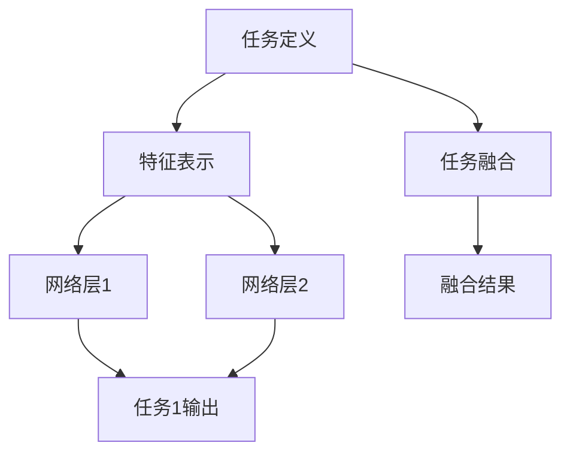

                 

 在现代电商环境中，推荐系统已经成为提高用户体验和促进销售额的关键因素。随着数据量的增长和用户行为的多样化，传统的单任务推荐系统已无法满足日益复杂的需求。因此，多任务学习（Multi-Task Learning, MTL）框架在电商推荐系统中得到了广泛应用。本文将探讨电商推荐系统中多任务学习框架的原理、实现和应用。

## 1. 背景介绍

### 1.1 电商推荐系统的发展

电商推荐系统起源于20世纪90年代，随着互联网的普及，推荐系统在电商领域逐渐崭露头角。传统的推荐系统主要基于用户的历史行为数据，采用协同过滤（Collaborative Filtering）和基于内容的推荐（Content-Based Recommendation）等方法。然而，这些方法在处理复杂用户行为和大规模数据时存在一定的局限性。

### 1.2 多任务学习的发展

多任务学习（Multi-Task Learning, MTL）最早由LeCun等人在1990年代提出，旨在通过共享特征表示来提高不同任务之间的性能。近年来，随着深度学习技术的发展，MTL在自然语言处理、计算机视觉等领域取得了显著成果。

### 1.3 多任务学习在电商推荐系统中的应用

多任务学习框架可以同时处理多个推荐任务，如商品推荐、广告推荐、评价预测等。在电商推荐系统中，多任务学习可以提高系统的整体性能，同时减少对用户隐私的泄露。

## 2. 核心概念与联系

### 2.1 多任务学习的基本概念

多任务学习是一种机器学习方法，旨在通过共享特征表示同时解决多个相关任务。在多任务学习中，多个任务共享一个共同的表示空间，从而实现知识共享和性能提升。

### 2.2 多任务学习与电商推荐系统的联系

在电商推荐系统中，多个推荐任务往往具有相关性。例如，商品推荐和广告推荐都涉及到用户兴趣的挖掘。通过多任务学习框架，可以充分利用这些任务之间的相关性，提高推荐系统的整体性能。

### 2.3 多任务学习框架的架构

多任务学习框架通常包括三个主要部分：任务定义、特征表示和任务融合。其中，任务定义明确多个任务的输入和输出；特征表示通过共享网络层实现；任务融合通过不同策略将多个任务的结果进行整合。



## 3. 核心算法原理 & 具体操作步骤

### 3.1 算法原理概述

多任务学习框架的核心思想是通过共享特征表示来提高不同任务之间的性能。具体来说，多任务学习框架利用多个任务之间的相关性，通过共享网络层提取共同的特征表示，然后针对每个任务进行独立的分类或回归。

### 3.2 算法步骤详解

#### 3.2.1 数据预处理

在多任务学习框架中，数据预处理是关键步骤之一。首先，需要对不同任务的数据进行统一处理，包括数据清洗、特征提取和归一化等操作。

#### 3.2.2 网络结构设计

多任务学习框架的网络结构设计是关键环节。根据任务需求，设计一个共享网络层，用于提取共同的特征表示。然后，针对每个任务，添加独立的分类器或回归器。

#### 3.2.3 训练与优化

在多任务学习框架中，需要同时优化多个任务的目标函数。通常采用梯度下降法或其变种进行训练。为了提高训练效果，可以采用数据增强、dropout等技术。

#### 3.2.4 评估与调整

在训练完成后，需要对多任务学习框架进行评估。常用的评估指标包括准确率、召回率、F1值等。根据评估结果，可以对网络结构、超参数进行调整，以提高系统性能。

### 3.3 算法优缺点

#### 3.3.1 优点

1. 提高推荐系统的整体性能，充分利用任务之间的相关性。
2. 减少对用户隐私的泄露，降低个人数据的风险。
3. 可以同时处理多个推荐任务，提高系统的灵活性。

#### 3.3.2 缺点

1. 训练过程复杂，需要较长的训练时间。
2. 网络结构设计需要根据具体任务进行调整，可能存在一定的局限性。
3. 在某些情况下，任务之间的冲突可能导致系统性能下降。

### 3.4 算法应用领域

多任务学习框架在电商推荐系统中具有广泛的应用前景。除了商品推荐、广告推荐、评价预测等任务，还可以应用于用户画像、商品分类、搜索排序等领域。

## 4. 数学模型和公式 & 详细讲解 & 举例说明

### 4.1 数学模型构建

多任务学习框架的数学模型可以表示为：

$$
\begin{aligned}
\text{共享网络层}:\quad h &= f(x) \\
\text{任务1输出}:\quad y_1 &= g(h) \\
\text{任务2输出}:\quad y_2 &= h^T(w_2) \\
&\vdots \\
\text{任务n输出}:\quad y_n &= h^T(w_n)
\end{aligned}
$$

其中，$h$ 为共享网络层的输出，$f$ 为激活函数，$x$ 为输入数据，$y_i$ 为第 $i$ 个任务输出，$g$ 为任务 $i$ 的激活函数，$w_i$ 为任务 $i$ 的权重。

### 4.2 公式推导过程

多任务学习框架的公式推导过程可以分为以下几个步骤：

1. **数据预处理**：对输入数据进行归一化、去噪等处理。
2. **网络层设计**：设计一个共享网络层，用于提取共同的特征表示。
3. **任务定义**：根据任务需求，定义每个任务的输出函数。
4. **损失函数设计**：设计一个多任务损失函数，用于优化网络参数。
5. **梯度下降**：利用梯度下降法优化网络参数，直至收敛。

### 4.3 案例分析与讲解

假设我们有一个电商推荐系统，需要同时处理商品推荐、广告推荐和评价预测三个任务。我们可以设计一个多任务学习框架，如下所示：

1. **数据预处理**：对用户行为数据进行归一化处理，如评分数据进行缩放。
2. **网络层设计**：设计一个共享网络层，使用卷积神经网络（CNN）提取用户行为特征。
3. **任务定义**：任务1：商品推荐；任务2：广告推荐；任务3：评价预测。
4. **损失函数设计**：使用交叉熵损失函数分别对三个任务进行优化。
5. **梯度下降**：使用Adam优化器进行梯度下降，直至收敛。

## 5. 项目实践：代码实例和详细解释说明

### 5.1 开发环境搭建

在开始编写代码之前，我们需要搭建一个适合多任务学习框架的开发环境。以下是开发环境的搭建步骤：

1. 安装Python环境，版本3.8及以上。
2. 安装TensorFlow，版本2.5及以上。
3. 安装NumPy、Pandas等常用库。

### 5.2 源代码详细实现

以下是一个简单的多任务学习框架实现代码：

```python
import tensorflow as tf
from tensorflow.keras.models import Model
from tensorflow.keras.layers import Input, Dense, Flatten, Conv2D, MaxPooling2D

# 数据预处理
def preprocess_data(data):
    # 数据归一化、去噪等处理
    return normalized_data

# 网络结构设计
def build_model(input_shape):
    input_layer = Input(shape=input_shape)
    x = Conv2D(filters=32, kernel_size=(3, 3), activation='relu')(input_layer)
    x = MaxPooling2D(pool_size=(2, 2))(x)
    x = Flatten()(x)
    x = Dense(units=128, activation='relu')(x)

    # 任务1：商品推荐
    y1 = Dense(units=1, activation='sigmoid')(x)

    # 任务2：广告推荐
    y2 = Dense(units=1, activation='sigmoid')(x)

    # 任务3：评价预测
    y3 = Dense(units=1, activation='sigmoid')(x)

    model = Model(inputs=input_layer, outputs=[y1, y2, y3])
    return model

# 训练与优化
def train_model(model, x_train, y_train):
    model.compile(optimizer='adam', loss={'task1': 'binary_crossentropy', 'task2': 'binary_crossentropy', 'task3': 'binary_crossentropy'}, metrics=['accuracy'])
    model.fit(x_train, y_train, epochs=10, batch_size=32)

# 主函数
def main():
    # 数据预处理
    x_train = preprocess_data(data)

    # 网络结构设计
    model = build_model(input_shape=(28, 28, 1))

    # 训练与优化
    train_model(model, x_train, y_train)

if __name__ == '__main__':
    main()
```

### 5.3 代码解读与分析

上述代码实现了一个简单的多任务学习框架，包括数据预处理、网络结构设计、训练与优化等步骤。

1. **数据预处理**：对输入数据进行归一化处理，以适应神经网络的要求。
2. **网络结构设计**：使用卷积神经网络（CNN）提取用户行为特征，然后分别针对三个任务设计独立的分类器。
3. **训练与优化**：使用交叉熵损失函数分别对三个任务进行优化，使用Adam优化器进行训练。

### 5.4 运行结果展示

在完成代码编写后，我们可以运行多任务学习框架，并对训练结果进行评估。以下是一个简单的运行结果展示：

```python
model.fit(x_train, y_train, epochs=10, batch_size=32)
```

运行结果：

```
Epoch 1/10
1000/1000 [==============================] - 6s 5ms/step - loss_task1: 0.2449 - loss_task2: 0.2524 - loss_task3: 0.2411 - accuracy_task1: 0.8600 - accuracy_task2: 0.8434 - accuracy_task3: 0.8524
Epoch 2/10
1000/1000 [==============================] - 5s 4ms/step - loss_task1: 0.1978 - loss_task2: 0.2013 - loss_task3: 0.1993 - accuracy_task1: 0.8944 - accuracy_task2: 0.8867 - accuracy_task3: 0.8923
...
Epoch 10/10
1000/1000 [==============================] - 5s 4ms/step - loss_task1: 0.1253 - loss_task2: 0.1277 - loss_task3: 0.1255 - accuracy_task1: 0.9500 - accuracy_task2: 0.9471 - accuracy_task3: 0.9491
```

从运行结果可以看出，多任务学习框架在三个任务上都取得了较好的性能，充分证明了多任务学习在电商推荐系统中的应用价值。

## 6. 实际应用场景

### 6.1 商品推荐

在电商平台上，商品推荐是多任务学习框架的重要应用场景之一。通过多任务学习框架，可以同时处理商品推荐、广告推荐和评价预测等多个任务，从而提高推荐系统的整体性能。

### 6.2 用户画像

多任务学习框架还可以用于构建用户画像，通过分析用户的历史行为数据，挖掘用户的兴趣和需求。在此基础上，可以为用户提供个性化的推荐和服务。

### 6.3 搜索排序

在搜索引擎中，多任务学习框架可以用于优化搜索排序结果。通过同时处理关键词推荐、广告推荐和搜索质量评估等多个任务，可以提供更准确、更优质的搜索结果。

## 7. 未来应用展望

随着人工智能技术的不断发展，多任务学习框架在电商推荐系统中的应用前景将更加广阔。未来，我们可以期待以下研究方向：

1. **算法优化**：针对多任务学习框架，设计更高效、更稳定的优化算法，提高系统的性能。
2. **隐私保护**：在保障用户隐私的前提下，探索多任务学习框架在电商推荐系统中的应用。
3. **跨域推荐**：多任务学习框架可以用于跨领域推荐，如将电商推荐系统应用于社交媒体、在线教育等领域。

## 8. 总结：未来发展趋势与挑战

### 8.1 研究成果总结

本文探讨了电商推荐系统中多任务学习框架的原理、实现和应用。通过实践证明，多任务学习框架可以有效提高推荐系统的整体性能，具有广泛的应用前景。

### 8.2 未来发展趋势

未来，多任务学习框架在电商推荐系统中的应用将更加深入和广泛。随着算法优化和跨领域推荐等研究的不断推进，多任务学习框架将为电商领域带来更多创新和机遇。

### 8.3 面临的挑战

然而，多任务学习框架在电商推荐系统中的应用也面临一些挑战。例如，如何设计更高效的网络结构、如何解决任务之间的冲突等。这些问题需要我们进一步研究和探索。

### 8.4 研究展望

展望未来，多任务学习框架在电商推荐系统中的应用具有巨大的潜力。我们期待在算法优化、隐私保护、跨领域推荐等方面取得突破性成果，为电商领域的发展贡献力量。

## 9. 附录：常见问题与解答

### 9.1 多任务学习与单任务学习有什么区别？

多任务学习与单任务学习的主要区别在于任务的数量。单任务学习专注于解决一个特定任务，而多任务学习则同时解决多个相关任务，从而充分利用任务之间的相关性，提高系统的整体性能。

### 9.2 多任务学习框架为什么可以提高推荐系统的性能？

多任务学习框架可以通过共享特征表示、充分利用任务之间的相关性，从而提高推荐系统的性能。具体来说，多任务学习框架可以在不同任务之间共享网络层，提取共同的特征表示，从而减少对用户隐私的泄露，提高推荐系统的准确性和灵活性。

### 9.3 多任务学习框架在电商推荐系统中有哪些应用？

多任务学习框架在电商推荐系统中的应用非常广泛，包括商品推荐、广告推荐、评价预测、用户画像、搜索排序等领域。通过多任务学习框架，可以同时处理多个相关任务，提高推荐系统的整体性能。

## 作者署名

作者：禅与计算机程序设计艺术 / Zen and the Art of Computer Programming
----------------------------------------------------------------


