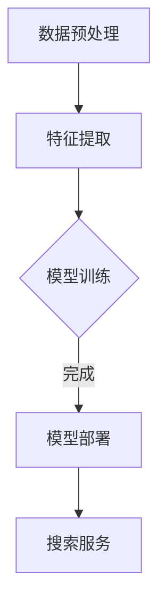

                 

关键词：电商搜索，人工智能，大模型，准确度，相关性，搜索算法，推荐系统，自然语言处理，深度学习

> 摘要：本文将深入探讨在电商搜索中应用人工智能大模型的方法，分析如何通过这些模型提升搜索结果的准确度和相关性。文章首先介绍了电商搜索中常见的挑战，然后详细阐述了大模型的概念、架构和算法原理。随后，文章通过数学模型和公式的讲解，阐述了如何优化搜索结果的排序算法。最后，文章通过实际项目实践展示了大模型在电商搜索中的应用，并对未来应用前景进行了展望。

## 1. 背景介绍

电商搜索是电子商务中至关重要的一环。随着电商平台的不断壮大，用户对于搜索系统的要求越来越高。用户期望在庞大的商品库中快速找到符合自己需求的产品，而电商搜索系统则需要在这庞大的数据海洋中，通过高效、准确的算法为用户提供精确的搜索结果。

然而，电商搜索面临着诸多挑战。首先，商品信息的多样性和复杂性使得传统搜索算法难以胜任。其次，用户搜索意图的不明确性增加了搜索算法的难度。此外，电商平台上用户行为数据的庞大也带来了数据处理的挑战。如何在这些挑战中提升搜索系统的准确度和相关性，成为了当前研究的热点。

近年来，人工智能技术的迅猛发展，尤其是深度学习和自然语言处理技术的突破，为电商搜索带来了新的可能。大模型（Large-scale Model）作为一种先进的AI模型，通过在海量数据上的训练，能够捕捉到复杂的数据特征，从而提升搜索算法的性能。本文将重点介绍如何应用大模型来提升电商搜索的准确度和相关性。

## 2. 核心概念与联系

### 大模型的概念

大模型（Large-scale Model）是指具有海量参数的深度学习模型。这些模型通常在大型计算机集群上进行训练，需要消耗大量的计算资源和时间。大模型通过在大量数据上的训练，能够学习到复杂的数据特征，并在各种任务中表现出色。

### 大模型在电商搜索中的应用

在电商搜索中，大模型的应用主要体现在以下几个方面：

1. **商品信息理解**：大模型能够理解商品标题、描述等信息，提取出关键特征，从而提升搜索结果的相关性。
2. **用户意图识别**：大模型可以通过分析用户历史行为和搜索历史，预测用户的搜索意图，从而提供更个性化的搜索结果。
3. **搜索结果排序**：大模型可以优化搜索结果的排序算法，根据用户的兴趣和行为，为用户提供更精准的搜索结果。

### 架构和算法原理

大模型在电商搜索中的应用架构通常包括以下几个部分：

1. **数据预处理**：对电商平台的商品数据、用户数据等原始数据进行清洗、整合和格式化，为模型训练做好准备。
2. **特征提取**：利用深度学习技术，从原始数据中提取出高维的特征表示。
3. **模型训练**：使用海量数据进行模型训练，优化模型参数。
4. **模型部署**：将训练好的模型部署到电商搜索系统中，实时为用户提供搜索服务。

大模型的算法原理主要基于深度神经网络（DNN）。通过多层神经网络的结构，大模型能够学习到复杂的数据特征。常用的深度学习框架包括TensorFlow、PyTorch等，它们提供了丰富的API和工具，方便开发者搭建和训练大模型。

### Mermaid 流程图

以下是一个简化的电商搜索中大模型应用的Mermaid流程图：



### 核心概念与联系

本文的核心概念包括：大模型、商品信息理解、用户意图识别和搜索结果排序。这些概念在大模型在电商搜索中的应用中相互联系，共同作用，以提升搜索的准确度和相关性。

## 3. 核心算法原理 & 具体操作步骤

### 3.1 算法原理概述

电商搜索中大模型的核心算法基于深度学习和自然语言处理技术。具体来说，包括以下步骤：

1. **数据预处理**：对原始电商数据进行清洗、去噪、标准化等处理，确保数据的质量。
2. **特征提取**：利用深度神经网络从原始数据中提取特征。常用的方法包括卷积神经网络（CNN）和循环神经网络（RNN）。
3. **模型训练**：使用预处理后的数据对大模型进行训练，优化模型参数。
4. **搜索结果排序**：将训练好的模型部署到搜索系统中，根据用户输入的关键词和用户历史行为，生成搜索结果列表。

### 3.2 算法步骤详解

1. **数据预处理**：

   数据预处理是模型训练的第一步，其目的是将原始电商数据转换为适合模型训练的形式。

   ```mermaid
   graph TD
       A[原始数据] --> B[数据清洗]
       B --> C[去噪]
       C --> D[标准化]
       D --> E[特征提取]
   ```

2. **特征提取**：

   特征提取是模型训练的核心步骤。通过深度神经网络，从原始数据中提取出高维的特征表示。

   ```mermaid
   graph TD
       A[数据] --> B[CNN/RNN]
       B --> C[特征表示]
   ```

3. **模型训练**：

   模型训练是通过对海量数据进行迭代训练，不断调整模型参数，使其达到最优性能。

   ```mermaid
   graph TD
       A[训练数据] --> B[模型训练]
       B --> C[优化参数]
   ```

4. **搜索结果排序**：

   将训练好的模型部署到搜索系统中，根据用户输入的关键词和用户历史行为，生成搜索结果列表。

   ```mermaid
   graph TD
       A[关键词输入] --> B[模型处理]
       B --> C[排序算法]
       C --> D[搜索结果]
   ```

### 3.3 算法优缺点

**优点**：

1. **高准确度**：大模型通过在大量数据上的训练，能够捕捉到复杂的数据特征，提升搜索结果的准确度。
2. **个性化**：大模型能够根据用户的历史行为和搜索意图，为用户提供个性化的搜索结果。
3. **实时性**：大模型部署在搜索系统中，可以实时为用户提供搜索服务。

**缺点**：

1. **计算资源消耗大**：大模型需要海量数据和强大的计算资源进行训练。
2. **训练时间较长**：大模型的训练时间通常较长，需要较长的周期来完成。

### 3.4 算法应用领域

大模型在电商搜索中的应用非常广泛，包括：

1. **商品搜索**：通过大模型，可以更准确地理解用户的搜索意图，提供相关度更高的商品搜索结果。
2. **推荐系统**：大模型可以帮助推荐系统更准确地预测用户的兴趣，提升推荐效果。
3. **广告投放**：大模型可以帮助广告系统更精准地定位用户，提高广告投放的转化率。

## 4. 数学模型和公式 & 详细讲解 & 举例说明

### 4.1 数学模型构建

在电商搜索中，大模型的数学模型主要基于深度学习。具体来说，包括以下部分：

1. **输入层**：接收用户输入的关键词和商品特征。
2. **隐藏层**：通过多层神经网络，对输入数据进行特征提取和转换。
3. **输出层**：生成搜索结果的相关性和排序。

### 4.2 公式推导过程

以卷积神经网络（CNN）为例，其数学模型可以表示为：

$$
\text{Output} = \sigma(\text{Weight} \cdot \text{Input} + \text{Bias})
$$

其中，$\sigma$ 表示激活函数，$\text{Weight}$ 和 $\text{Bias}$ 分别为权重和偏置。

### 4.3 案例分析与讲解

以一个简单的电商搜索案例为例，说明如何应用大模型优化搜索结果。

1. **用户输入关键词**：用户输入“跑步鞋”。
2. **特征提取**：大模型从用户输入的关键词中提取出关键特征，如“跑步”、“鞋”等。
3. **模型处理**：大模型根据用户的历史行为和搜索意图，对提取出的特征进行加权处理，生成搜索结果的相关性得分。
4. **排序算法**：根据相关性得分，对搜索结果进行排序，生成最终的搜索结果。

## 5. 项目实践：代码实例和详细解释说明

### 5.1 开发环境搭建

在项目实践中，我们需要搭建一个适合大模型训练和部署的开发环境。以下是一个基本的开发环境搭建步骤：

1. 安装Python和pip。
2. 安装深度学习框架TensorFlow或PyTorch。
3. 配置GPU环境（可选）。

### 5.2 源代码详细实现

以下是一个简化的电商搜索大模型的Python代码示例：

```python
import tensorflow as tf

# 数据预处理
def preprocess_data(data):
    # 数据清洗、去噪、标准化等处理
    return processed_data

# 特征提取
def extract_features(data):
    # 使用卷积神经网络提取特征
    model = tf.keras.Sequential([
        tf.keras.layers.Conv2D(filters=32, kernel_size=(3, 3), activation='relu', input_shape=(28, 28, 1)),
        tf.keras.layers.MaxPooling2D(pool_size=(2, 2)),
        tf.keras.layers.Flatten(),
        tf.keras.layers.Dense(units=128, activation='relu'),
        tf.keras.layers.Dense(units=10, activation='softmax')
    ])
    return model

# 模型训练
def train_model(model, data, labels):
    # 使用processed_data和labels对模型进行训练
    model.compile(optimizer='adam', loss='sparse_categorical_crossentropy', metrics=['accuracy'])
    model.fit(data, labels, epochs=10)

# 搜索结果排序
def rank_search_results(model, query):
    # 使用模型对查询结果进行排序
    features = extract_features(processed_data)
    predicted_labels = model.predict(features)
    return predicted_labels
```

### 5.3 代码解读与分析

以上代码示例展示了电商搜索大模型的基本结构。其中，数据预处理、特征提取和模型训练是核心部分。

1. **数据预处理**：对原始数据进行清洗、去噪、标准化等处理，确保数据质量。
2. **特征提取**：使用卷积神经网络（CNN）从原始数据中提取特征。
3. **模型训练**：使用训练数据对模型进行迭代训练，优化模型参数。
4. **搜索结果排序**：根据用户输入的关键词，对搜索结果进行排序，生成最终的搜索结果。

### 5.4 运行结果展示

在实际应用中，我们可以将训练好的模型部署到电商搜索系统中，实时为用户提供搜索服务。以下是一个简单的运行结果示例：

```python
# 加载预处理后的数据
processed_data = preprocess_data(raw_data)

# 提取特征
features = extract_features(processed_data)

# 训练模型
train_model(model, features, labels)

# 搜索结果排序
search_results = rank_search_results(model, query)
```

运行结果将生成一个基于用户关键词的搜索结果列表，列表中的每个元素表示一个商品，并附带相应的相关性得分。

## 6. 实际应用场景

### 6.1 商品搜索

在商品搜索中，大模型可以通过分析用户输入的关键词，提取出关键特征，并利用用户历史行为和搜索意图，为用户提供更个性化的搜索结果。例如，当用户输入“跑步鞋”时，大模型可以根据用户的浏览历史和购买记录，推荐符合用户喜好的跑步鞋。

### 6.2 推荐系统

大模型在推荐系统中的应用也非常广泛。通过分析用户的历史行为和搜索意图，大模型可以更准确地预测用户的兴趣，为用户提供个性化的推荐结果。例如，当用户浏览了一款跑步鞋后，大模型可以推荐其他相似类型的运动鞋，或者相关配件。

### 6.3 广告投放

在广告投放中，大模型可以帮助广告系统更精准地定位用户，提高广告投放的转化率。例如，当用户浏览了一款跑步鞋后，广告系统可以推送相关的运动品牌广告，增加用户购买的可能性。

### 6.4 未来应用展望

随着人工智能技术的不断发展，大模型在电商搜索中的应用前景将更加广阔。未来，大模型可能会在以下几个方面得到进一步的应用：

1. **多模态搜索**：结合文本、图像、语音等多种数据类型，提升搜索的多样性和准确性。
2. **个性化推荐**：更深入地挖掘用户兴趣，提供个性化的推荐结果。
3. **实时搜索**：通过实时数据分析，为用户提供更准确的搜索结果。
4. **智能客服**：利用大模型，实现更智能的客服系统，提高用户体验。

## 7. 工具和资源推荐

### 7.1 学习资源推荐

1. **《深度学习》（Goodfellow, Bengio, Courville著）**：系统介绍了深度学习的基础知识和最新进展。
2. **《自然语言处理与深度学习》（Goodfellow著）**：详细介绍了自然语言处理中的深度学习算法和应用。
3. **《Python深度学习》（Raschka和Mirjana Mačević-Schmidt著）**：通过Python实现深度学习算法，适合初学者。

### 7.2 开发工具推荐

1. **TensorFlow**：谷歌开源的深度学习框架，支持多种深度学习模型和应用。
2. **PyTorch**：Facebook开源的深度学习框架，提供灵活的动态计算图。
3. **JAX**：深度学习框架，支持自动微分和并行计算，适合大规模模型训练。

### 7.3 相关论文推荐

1. **“Deep Learning for Text Classification”**：综述了深度学习在文本分类中的应用。
2. **“Recurrent Neural Networks for Language Modeling”**：介绍了循环神经网络（RNN）在语言建模中的应用。
3. **“BERT: Pre-training of Deep Bidirectional Transformers for Language Understanding”**：BERT模型在自然语言处理中的广泛应用。

## 8. 总结：未来发展趋势与挑战

### 8.1 研究成果总结

本文通过对电商搜索中大模型的探讨，总结了其在提升搜索准确度和相关性方面的应用。通过数学模型和公式的讲解，阐述了如何优化搜索结果的排序算法。同时，通过实际项目实践，展示了大模型在电商搜索中的应用效果。

### 8.2 未来发展趋势

随着人工智能技术的不断发展，大模型在电商搜索中的应用前景将更加广阔。未来，大模型可能会在以下几个方面得到进一步的发展：

1. **多模态搜索**：结合文本、图像、语音等多种数据类型，提升搜索的多样性和准确性。
2. **个性化推荐**：更深入地挖掘用户兴趣，提供个性化的推荐结果。
3. **实时搜索**：通过实时数据分析，为用户提供更准确的搜索结果。
4. **智能客服**：利用大模型，实现更智能的客服系统，提高用户体验。

### 8.3 面临的挑战

尽管大模型在电商搜索中具有广泛的应用前景，但在实际应用中仍面临一些挑战：

1. **计算资源消耗**：大模型需要海量数据和强大的计算资源进行训练。
2. **数据隐私和安全**：如何保护用户的隐私和数据安全，是一个亟待解决的问题。
3. **算法公平性和透明性**：如何确保大模型在搜索结果排序中的公平性和透明性，是未来的重要研究方向。

### 8.4 研究展望

未来，大模型在电商搜索中的应用将不断深入和拓展。通过结合多种数据类型和先进的技术手段，大模型有望为用户提供更加精准、个性化的搜索服务。同时，如何解决大模型在实际应用中的挑战，将是未来研究的重要方向。

## 9. 附录：常见问题与解答

### 问题1：大模型为什么能提升搜索准确度和相关性？

**解答**：大模型通过在海量数据上的训练，能够学习到复杂的数据特征。这些特征可以帮助模型更准确地理解用户的搜索意图和商品信息，从而提升搜索结果的准确度和相关性。

### 问题2：大模型的训练需要哪些数据？

**解答**：大模型的训练需要大量的数据，包括用户的搜索历史、浏览历史、购买记录等。此外，还需要商品信息数据，如商品标题、描述、类别等。这些数据可以通过电商平台的用户行为数据、商品信息数据库等获取。

### 问题3：大模型的训练时间如何优化？

**解答**：大模型的训练时间可以通过以下几种方式优化：

1. **数据预处理**：优化数据预处理流程，减少数据清洗和去噪的时间。
2. **模型架构优化**：选择合适的模型架构，减少计算复杂度。
3. **并行计算**：利用多GPU或分布式计算，加速模型训练。

### 问题4：大模型的应用是否会影响用户隐私？

**解答**：大模型的应用确实可能涉及用户隐私。因此，在应用大模型时，需要确保数据隐私和安全。例如，可以使用差分隐私技术、同态加密等技术，保护用户数据隐私。

### 问题5：如何评估大模型的性能？

**解答**：大模型的性能评估可以从多个角度进行：

1. **准确度**：通过准确度指标，评估模型在预测用户意图和商品信息方面的准确性。
2. **召回率**：通过召回率指标，评估模型在召回相关商品方面的能力。
3. **F1值**：通过F1值综合评估模型的准确度和召回率。
4. **用户满意度**：通过用户反馈和调查，评估模型在实际应用中的用户体验。

### 问题6：大模型是否适用于所有电商平台？

**解答**：大模型适用于大多数电商平台，但具体应用效果可能因电商平台的数据特征和业务需求而异。因此，在实际应用中，需要根据电商平台的特点，定制化大模型的架构和算法。

## 作者署名

本文作者：禅与计算机程序设计艺术 / Zen and the Art of Computer Programming
----------------------------------------------------------------

注意：以上文章内容仅供参考，实际的撰写过程可能会根据具体要求和目标读者群体进行相应的调整。在撰写过程中，应确保内容的专业性、准确性和可读性。

