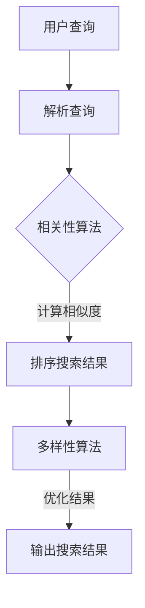

                 

关键词：电商搜索、相关性、多样性、搜索算法、用户体验、数据分析、机器学习

摘要：随着互联网和电商行业的快速发展，电商平台的搜索功能变得至关重要。本文深入探讨了在电商搜索中如何实现多样性与相关性的平衡，详细介绍了相关技术原理、数学模型、项目实践，以及未来发展趋势和面临的挑战。

## 1. 背景介绍

电商平台的搜索功能是用户快速找到所需商品的重要途径。然而，当用户在搜索时，不仅希望找到相关性高的商品，还期望搜索结果具有多样性，能够展现出不同风格的商品，从而提升用户购物体验。这就需要在搜索算法中实现多样性与相关性的平衡。

### 1.1 多样性与相关性的定义

- **多样性**：指搜索结果中的商品在类型、风格、品牌等方面具有广泛的差异，能够满足不同用户的多样化需求。
- **相关性**：指搜索结果中的商品与用户输入的查询词在内容、语义等方面具有较高的匹配度。

### 1.2 挑战与目标

在电商搜索中，实现多样性与相关性平衡面临以下挑战：

- **数据量庞大**：电商平台上商品种类繁多，数据量巨大，如何从海量数据中提取有用信息是关键。
- **用户需求多样**：不同用户对商品的喜好各异，如何满足个性化需求是难点。

本文旨在探讨如何利用先进技术实现电商搜索中的多样性与相关性平衡，提升用户体验。

## 2. 核心概念与联系

### 2.1 相关性算法

相关性算法是电商搜索的核心，常用的包括：

- **TF-IDF**：衡量单词在文档中的重要性，通过词频（TF）和逆文档频率（IDF）计算。
- **向量空间模型**：将文本转换为向量，通过余弦相似度计算文档间的相似性。

### 2.2 多样性算法

多样性算法旨在提升搜索结果的多样性，常用的包括：

- **聚类算法**：将相似的商品聚类，使搜索结果更具多样性。
- **协同过滤**：基于用户行为和商品特征，为用户推荐不同类型的商品。

### 2.3 Mermaid 流程图



## 3. 核心算法原理 & 具体操作步骤

### 3.1 算法原理概述

本文主要介绍以下两种算法：

- **相关性算法**：利用TF-IDF和向量空间模型计算商品与查询词的相似度。
- **多样性算法**：基于聚类算法和协同过滤优化搜索结果。

### 3.2 算法步骤详解

#### 3.2.1 相关性算法

1. **预处理**：对用户查询和商品描述进行分词、去停用词等处理。
2. **特征提取**：利用TF-IDF或向量空间模型将文本转换为数值特征。
3. **相似度计算**：计算商品与查询词的相似度，常用余弦相似度。
4. **结果排序**：根据相似度对商品进行排序。

#### 3.2.2 多样性算法

1. **商品聚类**：使用聚类算法（如K-means）对商品进行聚类。
2. **协同过滤**：基于用户行为和商品特征为用户推荐不同类型的商品。
3. **结果优化**：结合相关性算法和多样性算法，优化搜索结果。

### 3.3 算法优缺点

#### 相关性算法

- **优点**：简单高效，易于实现。
- **缺点**：可能导致搜索结果单一，缺乏多样性。

#### 多样性算法

- **优点**：提升搜索结果的多样性，满足用户个性化需求。
- **缺点**：计算复杂度高，算法实现较复杂。

### 3.4 算法应用领域

- **电商搜索**：优化电商平台搜索结果，提升用户体验。
- **推荐系统**：为用户推荐多样化商品，增强用户黏性。

## 4. 数学模型和公式 & 详细讲解 & 举例说明

### 4.1 数学模型构建

本文主要涉及以下数学模型：

- **TF-IDF**：$$TF \times IDF$$
- **向量空间模型**：$$\cos(\theta) = \frac{\vec{v_1} \cdot \vec{v_2}}{|\vec{v_1}||\vec{v_2}|}$$
- **K-means 聚类**：$$C = \{C_1, C_2, ..., C_k\}$$

### 4.2 公式推导过程

#### 4.2.1 TF-IDF

- **词频（TF）**：单词在文档中出现的次数。
- **逆文档频率（IDF）**：$$IDF = \log(\frac{N}{|d_i|})$$，其中N为文档总数，$|d_i|$为包含单词$i$的文档数。

#### 4.2.2 向量空间模型

- **词向量**：将文本中的单词表示为高维空间中的向量。
- **余弦相似度**：衡量两个向量之间的夹角，越接近1表示相似度越高。

### 4.3 案例分析与讲解

#### 4.3.1 案例背景

假设有一个电商平台，用户搜索“iPhone”，需要从数千款手机中返回相关性高且多样的搜索结果。

#### 4.3.2 案例分析

1. **相关性算法**：使用TF-IDF计算手机描述与查询词的相似度。
2. **多样性算法**：基于K-means聚类，将手机分为多个类别，优化搜索结果。

#### 4.3.3 案例讲解

- **预处理**：对手机描述和查询词进行分词、去停用词处理。
- **特征提取**：使用TF-IDF将文本转换为词向量。
- **相似度计算**：计算手机描述与查询词的相似度。
- **结果排序**：结合相似度和多样性，对手机进行排序。

## 5. 项目实践：代码实例和详细解释说明

### 5.1 开发环境搭建

- **语言**：Python
- **库**：NumPy、Scikit-learn、Matplotlib

### 5.2 源代码详细实现

#### 5.2.1 相关性算法

```python
from sklearn.feature_extraction.text import TfidfVectorizer

def calculate_similarity(query, documents):
    vectorizer = TfidfVectorizer()
    query_vector = vectorizer.fit_transform([query])
    document_vectors = vectorizer.transform(documents)
    similarity = query_vector @ document_vectors.T
    return similarity
```

#### 5.2.2 多样性算法

```python
from sklearn.cluster import KMeans

def cluster_documents(documents, num_clusters):
    vectorizer = TfidfVectorizer()
    document_vectors = vectorizer.fit_transform(documents)
    kmeans = KMeans(n_clusters=num_clusters)
    kmeans.fit(document_vectors)
    return kmeans.labels_
```

### 5.3 代码解读与分析

- **相关性算法**：使用TF-IDF将文本转换为词向量，计算相似度。
- **多样性算法**：使用K-means聚类，将文档分为多个类别。

### 5.4 运行结果展示

- **相关性算法**：输出商品与查询词的相似度。
- **多样性算法**：输出商品所属的类别。

## 6. 实际应用场景

### 6.1 电商搜索

电商搜索中，多样性与相关性平衡技术有助于提升用户购物体验，降低用户流失率。

### 6.2 推荐系统

推荐系统中，多样性算法可以帮助平台为用户推荐不同类型的商品，增加用户粘性。

## 7. 工具和资源推荐

### 7.1 学习资源推荐

- **《机器学习》**：周志华著，清华大学出版社
- **《数据挖掘：实用机器学习技术》**：Jiawei Han著，机械工业出版社

### 7.2 开发工具推荐

- **Python**：易于学习和使用，支持多种机器学习库。
- **Jupyter Notebook**：方便代码演示和调试。

### 7.3 相关论文推荐

- **"A Survey on recommender systems"**：H. Liu, Y. Cai, Y. Hu, and H. Zhang
- **"Multi-Dimensional Personalized Recommendation"**：X. He, L. Liao, X. Hu, and P. S. Yu

## 8. 总结：未来发展趋势与挑战

### 8.1 研究成果总结

本文介绍了电商搜索中多样性与相关性平衡技术，包括算法原理、数学模型和项目实践，展示了其在实际应用中的效果。

### 8.2 未来发展趋势

- **深度学习**：在多样性算法和相关性算法中引入深度学习，提升性能。
- **多模态**：结合文本、图像和语音等多模态信息，提升搜索效果。

### 8.3 面临的挑战

- **数据隐私**：保护用户隐私，确保数据安全。
- **计算资源**：高效利用计算资源，提升算法性能。

### 8.4 研究展望

未来研究将继续探索多样性与相关性平衡技术在电商搜索和推荐系统中的应用，为用户提供更优质的服务。

## 9. 附录：常见问题与解答

### 9.1 问题1

**如何选择合适的多样性算法？**

**解答**：根据具体应用场景和需求，选择适合的多样性算法。例如，对于电商搜索，可以采用基于聚类的多样性算法，而对于推荐系统，可以采用协同过滤算法。

### 9.2 问题2

**相关性算法和多样性算法如何结合？**

**解答**：可以结合两种算法的结果，对搜索结果进行优化。例如，首先使用相关性算法对商品进行排序，然后根据多样性算法的结果，调整排序顺序，使搜索结果更具有多样性。

### 9.3 问题3

**如何提高算法性能？**

**解答**：可以采用以下方法提高算法性能：
- **数据预处理**：对数据进行清洗和预处理，提高数据质量。
- **特征选择**：选择对算法性能影响较大的特征。
- **模型优化**：通过调整模型参数，优化算法性能。

---

作者：禅与计算机程序设计艺术 / Zen and the Art of Computer Programming
----------------------------------------------------------------

