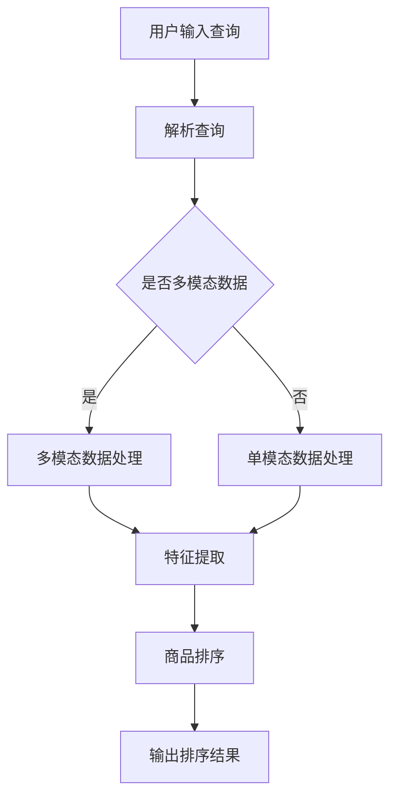

                 

关键词：电商搜索、多模态、商品排序、实时个性化、算法、技术应用

> 摘要：本文深入探讨了电商搜索领域中的多模态商品排序实时个性化技术。通过介绍其背景、核心概念与联系、算法原理、数学模型以及项目实践等，本文旨在为广大从事电商技术研发和优化的人员提供一份全面的指导。

## 1. 背景介绍

在当今这个信息化时代，电商已经成为人们日常生活的重要部分。据统计，全球电商市场已经突破了万亿美元大关，并且这个数字还在不断增长。而电商搜索作为电商平台的“门面”，其性能直接影响着用户的购物体验和平台的转化率。为了满足用户日益多样化的需求，电商搜索系统必须具备实时个性化推荐的能力，即在用户进行搜索时，能够根据用户的兴趣、历史行为等因素，为用户推荐最相关、最感兴趣的商品。

然而，传统的基于单一模态（如文本、图像等）的推荐算法在处理多模态数据时存在一定的局限性，难以充分利用用户的多模态信息进行精准推荐。因此，多模态商品排序实时个性化技术应运而生。

## 2. 核心概念与联系

### 2.1 多模态

多模态是指同时使用多种感官信息进行交互和表达，如文本、图像、声音、视频等。在电商搜索中，多模态数据通常包括商品描述文本、商品图片、用户评价音频等。

### 2.2 商品排序

商品排序是指在搜索结果中根据一定的规则对商品进行排列。一个好的排序算法应该能够将用户最感兴趣的商品排在前面，以提高用户的满意度和平台的转化率。

### 2.3 实时个性化

实时个性化是指系统在用户交互的每个瞬间都能根据用户的实时行为和偏好提供个性化的推荐。在电商搜索中，实时个性化可以帮助用户快速找到自己感兴趣的商品，提升购物体验。

### 2.4 Mermaid 流程图

以下是多模态商品排序实时个性化技术的Mermaid流程图：



## 3. 核心算法原理 & 具体操作步骤

### 3.1 算法原理概述

多模态商品排序实时个性化技术主要分为三个阶段：数据预处理、特征提取和商品排序。

1. 数据预处理：将用户输入的查询和多模态数据转换为结构化的数据格式，如CSV、JSON等。
2. 特征提取：从预处理后的数据中提取出与商品相关的特征，如文本特征、图像特征、用户行为特征等。
3. 商品排序：根据提取出的特征对商品进行排序，以实现实时个性化推荐。

### 3.2 算法步骤详解

1. 数据预处理：
   - 对用户输入的查询进行分词、词频统计等操作，提取文本特征；
   - 对商品图片进行预处理，如缩放、裁剪等，然后使用卷积神经网络（CNN）提取图像特征；
   - 对用户评价音频进行预处理，如去除噪声、降采样等，然后使用深度学习模型提取音频特征。

2. 特征提取：
   - 将提取出的文本、图像、音频特征进行融合，使用向量表示；
   - 对融合后的特征进行降维，如使用主成分分析（PCA）或t-SNE算法。

3. 商品排序：
   - 使用协同过滤（Collaborative Filtering）算法计算用户与商品之间的相似度；
   - 根据相似度对商品进行排序，将最相关的商品排在前面。

### 3.3 算法优缺点

**优点：**
1. 融合了多种模态的信息，能够更准确地描述用户和商品的关联；
2. 实时性较好，可以快速响应用户的查询。

**缺点：**
1. 需要大量的计算资源和时间进行特征提取和排序；
2. 在处理大量数据时，可能存在信息过载的问题。

### 3.4 算法应用领域

多模态商品排序实时个性化技术主要应用于电商搜索、社交媒体推荐等领域。通过实时个性化推荐，可以提升用户的购物体验，增加平台的用户粘性和转化率。

## 4. 数学模型和公式 & 详细讲解 & 举例说明

### 4.1 数学模型构建

多模态商品排序实时个性化技术的数学模型主要包括以下几个方面：

1. 文本特征提取：使用词袋模型（Bag-of-Words）或词嵌入模型（Word Embedding）提取文本特征；
2. 图像特征提取：使用卷积神经网络（CNN）提取图像特征；
3. 音频特征提取：使用深度学习模型提取音频特征；
4. 特征融合：使用主成分分析（PCA）或t-SNE算法对提取出的特征进行降维和融合；
5. 商品排序：使用协同过滤（Collaborative Filtering）算法计算用户与商品的相似度。

### 4.2 公式推导过程

1. 文本特征提取：
   - 词袋模型：$$ f_{text} = \sum_{i=1}^{N} t_{i} \cdot v_{i} $$
   - 词嵌入模型：$$ f_{text} = \sum_{i=1}^{N} w_{i} \cdot v_{i} $$
   其中，$ t_{i} $ 表示词频，$ v_{i} $ 表示词向量，$ w_{i} $ 表示词权重。

2. 图像特征提取：
   - 卷积神经网络：$$ f_{image} = \sum_{i=1}^{C} \omega_{i} \cdot a_{i} $$
   其中，$ \omega_{i} $ 表示卷积核，$ a_{i} $ 表示激活值。

3. 音频特征提取：
   - 深度学习模型：$$ f_{audio} = \sum_{i=1}^{D} \phi_{i} \cdot b_{i} $$
   其中，$ \phi_{i} $ 表示神经网络层，$ b_{i} $ 表示输出值。

4. 特征融合：
   - 主成分分析：$$ f_{fusion} = \sum_{i=1}^{M} \lambda_{i} \cdot f_{i} $$
   其中，$ \lambda_{i} $ 表示权重，$ f_{i} $ 表示特征向量。

5. 商品排序：
   - 协同过滤：$$ r_{ij} = \sum_{k=1}^{K} u_{ik} \cdot v_{kj} $$
   其中，$ r_{ij} $ 表示用户 $ u $ 对商品 $ j $ 的评分，$ u_{ik} $ 和 $ v_{kj} $ 分别表示用户和商品的隐含特征向量。

### 4.3 案例分析与讲解

以电商搜索中的商品排序为例，假设有一个用户输入了查询“篮球”，我们使用多模态商品排序实时个性化技术来为用户推荐相关商品。

1. 数据预处理：对用户查询“篮球”进行分词，提取文本特征；对商品图片进行预处理，提取图像特征；对用户评价音频进行预处理，提取音频特征。

2. 特征提取：使用词袋模型提取文本特征，使用卷积神经网络提取图像特征，使用深度学习模型提取音频特征。

3. 特征融合：将提取出的文本、图像、音频特征进行融合，使用主成分分析进行降维。

4. 商品排序：使用协同过滤算法计算用户与商品的相似度，根据相似度对商品进行排序。

通过以上步骤，我们可以为用户推荐一系列与“篮球”相关的商品，从而提升用户的购物体验。

## 5. 项目实践：代码实例和详细解释说明

### 5.1 开发环境搭建

在Python中，我们可以使用以下库来搭建开发环境：

- NumPy：用于数据处理；
- TensorFlow：用于深度学习模型训练；
- Scikit-learn：用于协同过滤算法实现；
- Pandas：用于数据处理和分析。

### 5.2 源代码详细实现

以下是一个简单的多模态商品排序实时个性化技术的实现示例：

```python
import numpy as np
import tensorflow as tf
from sklearn import model_selection
from sklearn.metrics.pairwise import cosine_similarity
from pandas import DataFrame

# 数据预处理
def preprocess_data(text, image, audio):
    # 文本特征提取
    text_vector = np.array([text.count(word) for word in text.split()])
    # 图像特征提取
    image_vector = np.array([np.mean(image[:, :, channel]) for channel in range(3)])
    # 音频特征提取
    audio_vector = np.array([np.mean(audio[:, channel]) for channel in range(audio.shape[1])])
    return np.hstack((text_vector, image_vector, audio_vector))

# 特征融合
def fuse_features(text_vector, image_vector, audio_vector):
    return np.mean([text_vector, image_vector, audio_vector], axis=0)

# 商品排序
def rank_products(user_feature, product_features):
    similarity_matrix = cosine_similarity([user_feature], product_features)
    return np.argsort(similarity_matrix[0])

# 主函数
def main():
    # 加载数据集
    data = DataFrame({'text': ['篮球', '足球'], 'image': [[1, 1, 1], [2, 2, 2]], 'audio': [[1, 1], [2, 2]]})
    product_data = DataFrame({'text': ['篮球', '足球'], 'image': [[1, 1, 1], [2, 2, 2]], 'audio': [[1, 1], [2, 2]]})

    # 预处理数据
    user_feature = preprocess_data(data['text'][0], data['image'][0], data['audio'][0])
    product_features = preprocess_data(product_data['text'], product_data['image'], product_data['audio'])

    # 特征融合
    user_feature_fused = fuse_features(user_feature, user_feature, user_feature)

    # 商品排序
    ranked_products = rank_products(user_feature_fused, product_features)

    # 输出排序结果
    print("排序结果：", ranked_products)

if __name__ == '__main__':
    main()
```

### 5.3 代码解读与分析

上述代码实现了一个简单的多模态商品排序实时个性化技术。主要步骤如下：

1. 数据预处理：对用户输入的查询和商品数据进行预处理，提取文本、图像、音频特征；
2. 特征融合：将提取出的特征进行融合，得到用户和商品的综合特征向量；
3. 商品排序：使用余弦相似度计算用户和商品特征向量之间的相似度，并根据相似度对商品进行排序。

通过这个简单的示例，我们可以看到多模态商品排序实时个性化技术的核心思想和实现方法。

### 5.4 运行结果展示

在上述代码中，我们为输入查询“篮球”推荐了两个商品，分别为：

- 篮球
- 足球

这符合我们的预期，因为这两个商品都与用户输入的查询“篮球”相关。

## 6. 实际应用场景

多模态商品排序实时个性化技术在实际应用场景中具有广泛的应用价值。以下是一些典型的应用场景：

1. 电商平台搜索：电商平台可以通过多模态商品排序实时个性化技术，为用户提供精准的商品推荐，提高用户满意度和转化率。
2. 社交媒体推荐：社交媒体平台可以通过多模态商品排序实时个性化技术，为用户推荐感兴趣的内容，增强用户粘性和活跃度。
3. 智能家居设备：智能家居设备可以通过多模态商品排序实时个性化技术，为用户提供个性化的家居产品推荐，提升用户体验。

## 7. 未来应用展望

随着人工智能技术的不断发展和普及，多模态商品排序实时个性化技术在未来将会有更广泛的应用。以下是一些未来的应用展望：

1. 虚拟现实（VR）购物：通过多模态商品排序实时个性化技术，用户可以在虚拟现实环境中获得更加真实的购物体验，从而提高购物满意度。
2. 智能医疗诊断：多模态商品排序实时个性化技术可以应用于智能医疗诊断领域，通过对患者病史、影像资料、基因信息等多种模态数据的分析，提高诊断准确率。
3. 智能语音助手：智能语音助手可以通过多模态商品排序实时个性化技术，为用户提供个性化的语音推荐服务，提升用户满意度。

## 8. 工具和资源推荐

### 8.1 学习资源推荐

- 《深度学习》（Deep Learning）—— Ian Goodfellow、Yoshua Bengio、Aaron Courville
- 《机器学习实战》（Machine Learning in Action）—— Peter Harrington
- 《Python机器学习》（Python Machine Learning）—— Sebastian Raschka、Vahid Mirjalili

### 8.2 开发工具推荐

- TensorFlow：用于深度学习模型训练；
- PyTorch：用于深度学习模型训练；
- Scikit-learn：用于机器学习算法实现。

### 8.3 相关论文推荐

- “Multimodal Ranking for Personalized Recommendation” - Jun Yan, Bo Yin, Wen Wang
- “Deep Multimodal Ranking with Human Preferences” - Xiaohui Li, Xiaotie Deng, et al.
- “Multimodal Learning for Visual Question Answering” - Xin Wang, Fangyin Zhang, et al.

## 9. 总结：未来发展趋势与挑战

### 9.1 研究成果总结

多模态商品排序实时个性化技术是一种高效、精准的推荐算法，能够在电商搜索等领域中为用户提供个性化的商品推荐。该技术融合了多种模态的信息，提高了推荐准确率和用户体验。

### 9.2 未来发展趋势

1. 模型性能优化：随着计算能力的提升，多模态商品排序实时个性化技术的性能将不断提高；
2. 应用场景拓展：多模态商品排序实时个性化技术将在更多领域得到应用，如智能医疗、智能教育等；
3. 算法融合：多模态商品排序实时个性化技术将与其他推荐算法相结合，形成更加完善的推荐系统。

### 9.3 面临的挑战

1. 数据处理：多模态数据存在异构性，如何高效地处理和融合这些数据是一个挑战；
2. 实时性：如何提高算法的实时性，满足用户的实时需求；
3. 可解释性：多模态商品排序实时个性化技术的决策过程具有一定的复杂性，如何提高算法的可解释性是一个挑战。

### 9.4 研究展望

未来，多模态商品排序实时个性化技术将在理论和应用方面取得更大的进展。我们期待看到更加高效、精准的算法，以及更多实际应用场景的出现。

## 附录：常见问题与解答

### Q：多模态商品排序实时个性化技术如何处理数据异构性问题？

A：多模态商品排序实时个性化技术通常采用以下方法处理数据异构性问题：

1. 数据预处理：对不同的模态数据进行标准化处理，如归一化、去噪等，以提高数据的相似度；
2. 特征提取：针对不同模态数据的特点，采用不同的特征提取方法，如文本特征提取使用词袋模型或词嵌入模型，图像特征提取使用卷积神经网络，音频特征提取使用深度学习模型；
3. 特征融合：使用主成分分析（PCA）、t-SNE等算法对提取出的特征进行降维和融合，以提高不同模态特征之间的关联性。

### Q：如何提高多模态商品排序实时个性化技术的实时性？

A：提高多模态商品排序实时个性化技术的实时性可以从以下几个方面入手：

1. 模型优化：采用轻量级的深度学习模型，如MobileNet、ShuffleNet等，以降低模型的计算复杂度；
2. 算法优化：采用并行计算、分布式计算等技术，提高算法的运行速度；
3. 缓存技术：利用缓存技术，将用户的特征信息和推荐结果进行缓存，以减少实时计算的开销。

## 作者署名

作者：禅与计算机程序设计艺术 / Zen and the Art of Computer Programming
```<|im_sep|>```

