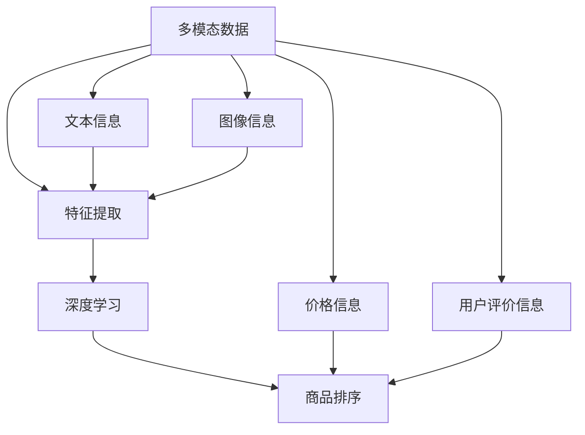

                 

关键词：电商搜索，多模态商品排序，人工智能，算法，用户满意度，数学模型，项目实践

## 摘要

本文深入探讨了电商搜索中的多模态商品排序技术，旨在提升电商平台的搜索质量和用户满意度。本文首先介绍了多模态商品排序的背景和核心概念，随后详细分析了核心算法的原理和数学模型。接着，通过一个具体的代码实例，讲解了算法的实现过程及其优缺点。最后，本文探讨了该技术的实际应用场景，并对其未来发展趋势和挑战进行了展望。

## 1. 背景介绍

随着电商行业的迅猛发展，用户对电商平台搜索体验的要求越来越高。传统的单模态商品排序方法，如基于文本的排序或基于价格排序，已经无法满足用户多元化的需求。为了提供更加个性化的搜索服务，多模态商品排序技术逐渐成为研究的热点。多模态商品排序技术旨在整合多种信息来源，如文本、图像、价格、用户评价等，通过智能算法实现商品排序，从而提高搜索质量和用户满意度。

### 1.1 商品的多样性和用户需求的多样性

电商平台上的商品种类繁多，每种商品都有其独特的属性和特点。例如，商品A可能具有高质量和低价格，而商品B可能具有独特的设计和高价格。用户在搜索商品时，往往希望根据自己的需求和偏好找到最合适的商品。这种需求多样性使得传统的单模态商品排序方法难以满足用户的需求。多模态商品排序技术通过整合多种信息来源，更好地捕捉用户的偏好和需求，从而提供更加个性化的搜索结果。

### 1.2 多模态数据的融合与整合

多模态商品排序技术涉及多种数据类型的融合和整合。例如，文本信息可以通过自然语言处理技术提取关键特征，图像信息可以通过计算机视觉技术提取视觉特征，价格和用户评价等数据可以直接作为排序依据。如何有效地融合和整合这些多模态数据，是一个重要的研究方向。本文将介绍一种基于深度学习的多模态商品排序算法，该算法通过融合多种数据类型，实现高效的商品排序。

## 2. 核心概念与联系

多模态商品排序技术涉及多个核心概念，包括多模态数据、特征提取、深度学习等。为了更好地理解这些概念，我们使用Mermaid流程图（Mermaid流程节点中不要有括号、逗号等特殊字符）来展示它们之间的联系。



### 2.1 多模态数据

多模态数据是指同时包含多种类型数据的集合。在电商搜索中，多模态数据通常包括文本信息、图像信息、价格信息、用户评价信息等。这些数据来源多样化，有助于更全面地描述商品。

### 2.2 特征提取

特征提取是指从原始数据中提取出对任务有用的特征。在多模态商品排序中，特征提取是一个关键步骤。通过特征提取，可以将多种类型的数据转化为统一的特征向量，为后续的深度学习算法提供输入。

### 2.3 深度学习

深度学习是一种基于多层神经网络的学习方法，能够在大量数据中自动学习特征。在多模态商品排序中，深度学习算法通过学习多模态数据的特征，实现高效的商品排序。

### 2.4 商品排序

商品排序是根据特定目标（如用户满意度、销售量等）对商品进行排序的过程。在多模态商品排序中，商品排序算法需要综合考虑多种信息来源，通过深度学习算法实现商品的高效排序。

## 3. 核心算法原理 & 具体操作步骤

### 3.1 算法原理概述

多模态商品排序算法基于深度学习技术，通过多个神经网络层对多模态数据进行特征提取和融合。算法的主要步骤如下：

1. 特征提取：从文本、图像、价格和用户评价等信息中提取关键特征。
2. 特征融合：将提取的特征进行融合，形成统一的特征向量。
3. 深度学习：通过多层神经网络对融合后的特征进行学习和优化。
4. 商品排序：根据学习到的模型对商品进行排序。

### 3.2 算法步骤详解

#### 3.2.1 数据预处理

数据预处理是算法的第一步，主要包括以下任务：

1. 数据清洗：去除数据中的噪声和异常值。
2. 数据归一化：将不同类型的数据进行归一化处理，使其具有相似的尺度。
3. 数据划分：将数据集划分为训练集、验证集和测试集。

#### 3.2.2 特征提取

特征提取是算法的核心环节，主要包括以下步骤：

1. 文本特征提取：使用词袋模型或词嵌入模型提取文本特征。
2. 图像特征提取：使用卷积神经网络（CNN）提取图像特征。
3. 价格和用户评价特征提取：直接提取价格和用户评价等特征。

#### 3.2.3 特征融合

特征融合是将多种特征类型进行整合，形成统一的特征向量。常用的融合方法包括：

1. 直接拼接：将不同类型的特征向量直接拼接在一起。
2. 特征融合网络：使用神经网络层对特征进行融合。

#### 3.2.4 深度学习

深度学习是通过多层神经网络对融合后的特征进行学习和优化。常用的深度学习模型包括：

1. 卷积神经网络（CNN）：用于提取图像特征。
2. 循环神经网络（RNN）：用于处理文本序列。
3. 混合神经网络：结合CNN和RNN的优势，用于多模态数据的处理。

#### 3.2.5 商品排序

商品排序是根据学习到的模型对商品进行排序。常用的排序指标包括：

1. 交叉熵损失函数：用于衡量模型预测结果与真实结果之间的差异。
2. 评价指标：如准确率、召回率、F1值等，用于评估模型性能。

### 3.3 算法优缺点

#### 优点

1. 考虑多模态信息：算法能够整合多种信息来源，提供更全面的商品描述。
2. 个性化推荐：基于用户偏好和需求，实现个性化商品推荐。
3. 高效排序：通过深度学习技术，实现高效的商品排序。

#### 缺点

1. 数据依赖性：算法性能依赖于数据质量和数量，数据不足可能导致性能下降。
2. 计算成本高：深度学习算法需要大量计算资源，对硬件要求较高。

### 3.4 算法应用领域

多模态商品排序技术可以广泛应用于电商、社交媒体、在线广告等领域，具体包括：

1. 电商搜索：提高搜索质量和用户满意度。
2. 社交媒体推荐：根据用户偏好推荐相关内容。
3. 在线广告：根据用户兴趣和行为，实现精准广告投放。

## 4. 数学模型和公式 & 详细讲解 & 举例说明

### 4.1 数学模型构建

多模态商品排序的数学模型主要包括以下几个方面：

#### 4.1.1 特征提取

对于文本特征，可以使用词袋模型（Bag-of-Words, BoW）或词嵌入模型（Word Embedding）进行提取。词袋模型将文本表示为词汇的集合，而词嵌入模型将词汇映射为低维向量。

设文档集合为 $D=\{d_1, d_2, \ldots, d_n\}$，每个文档 $d_i$ 可以表示为一个词汇集合 $V_i=\{v_1, v_2, \ldots, v_m\}$。词袋模型将文档表示为一个向量 $d_i^{(BoW)} \in \mathbb{R}^V$，其中 $d_i^{(BoW)}_j = 1$ 表示词汇 $v_j$ 在文档 $d_i$ 中出现，否则为 0。

词嵌入模型通过神经网络学习词汇的嵌入向量 $v_i \in \mathbb{R}^d$，其中 $d$ 是嵌入向量的维度。每个文档 $d_i$ 可以表示为嵌入向量的加和 $d_i^{(Word Embedding)} = \sum_{v \in V_i} v$。

#### 4.1.2 特征融合

特征融合可以通过加权求和或神经网络层实现。设文本特征向量为 $t \in \mathbb{R}^T$，图像特征向量为 $i \in \mathbb{R}^I$，价格特征向量为 $p \in \mathbb{R}^P$，用户评价特征向量为 $r \in \mathbb{R}^R$。特征融合后的向量表示为 $x \in \mathbb{R}^{T+I+P+R}$。

加权求和融合方法可以表示为：
$$
x = w_t t + w_i i + w_p p + w_r r
$$
其中，$w_t, w_i, w_p, w_r$ 是对应的权重。

神经网络层融合方法可以表示为：
$$
x = f(\sigma(W_t t + W_i i + W_p p + W_r r + b))
$$
其中，$f$ 是激活函数，$\sigma$ 是激活函数的导数，$W_t, W_i, W_p, W_r$ 是权重矩阵，$b$ 是偏置项。

#### 4.1.3 深度学习

深度学习模型通常由多个神经网络层组成，包括卷积层、池化层、全连接层等。设输入特征向量为 $x \in \mathbb{R}^n$，输出特征向量为 $y \in \mathbb{R}^m$。

卷积层可以表示为：
$$
h_{ij} = \sum_{k=1}^{K} w_{ik} * g(x_{j+k}) + b_j
$$
其中，$h \in \mathbb{R}^{n'}$ 是卷积层输出，$w \in \mathbb{R}^{K \times n}$ 是卷积核，$g$ 是卷积操作，$b \in \mathbb{R}^{n'}$ 是偏置项。

池化层可以表示为：
$$
p_i = \max_j (h_{ij})
$$
其中，$p \in \mathbb{R}^{n''}$ 是池化层输出，$n''$ 是池化后的特征维度。

全连接层可以表示为：
$$
y = \sigma(\sum_{i=1}^{n''} w_{ij} p_i + b)
$$
其中，$y \in \mathbb{R}^m$ 是全连接层输出，$\sigma$ 是激活函数，$w \in \mathbb{R}^{m \times n''}$ 是权重矩阵，$b \in \mathbb{R}^m$ 是偏置项。

### 4.2 公式推导过程

以卷积神经网络（CNN）为例，我们简要介绍一些关键公式的推导过程。

#### 4.2.1 卷积操作

卷积操作是指将卷积核与输入特征进行点积运算，并通过激活函数进行非线性变换。假设卷积核尺寸为 $K \times K$，输入特征尺寸为 $n \times n$，输出特征尺寸为 $m \times m$。

卷积操作可以表示为：
$$
h_{ij} = \sum_{k=1}^{K} \sum_{l=1}^{K} w_{kl} * x_{i+k, j+l}
$$
其中，$h_{ij}$ 是输出特征 $(i, j)$ 的值，$x_{i+k, j+l}$ 是输入特征 $(i+k, j+l)$ 的值，$w_{kl}$ 是卷积核 $(k, l)$ 的值。

#### 4.2.2 池化操作

池化操作是指将输入特征区域内的最大值作为输出。假设池化区域尺寸为 $P \times P$，输入特征尺寸为 $n \times n$，输出特征尺寸为 $m \times m$。

池化操作可以表示为：
$$
p_i = \max_j (h_{ij})
$$
其中，$p_i$ 是输出特征 $(i, j)$ 的值，$h_{ij}$ 是输入特征 $(i, j)$ 的值。

#### 4.2.3 全连接层

全连接层是指将输入特征与权重矩阵进行点积运算，并通过激活函数进行非线性变换。假设输入特征尺寸为 $n$，输出特征尺寸为 $m$。

全连接层可以表示为：
$$
y = \sigma(\sum_{i=1}^{n} w_{ij} x_i + b)
$$
其中，$y$ 是输出特征值，$x_i$ 是输入特征值，$w_{ij}$ 是权重矩阵 $(i, j)$ 的值，$b$ 是偏置项。

### 4.3 案例分析与讲解

#### 4.3.1 数据集

假设我们有一个电商搜索数据集，包含以下多模态信息：

1. 文本信息：商品标题、描述等。
2. 图像信息：商品图片。
3. 价格信息：商品价格。
4. 用户评价信息：用户对商品的评分。

#### 4.3.2 特征提取

1. 文本特征提取：使用词嵌入模型提取商品标题和描述的词嵌入向量，维度为 $d$。
2. 图像特征提取：使用卷积神经网络提取商品图片的特征向量，维度为 $K$。
3. 价格和用户评价特征提取：直接提取价格和用户评价等特征，维度分别为 $P$ 和 $R$。

#### 4.3.3 特征融合

使用加权求和的方法融合不同类型的特征，权重分别为 $w_t, w_i, w_p, w_r$。融合后的特征向量维度为 $T+I+P+R$。

#### 4.3.4 深度学习

使用卷积神经网络对融合后的特征进行学习和优化，包括卷积层、池化层和全连接层。最终输出商品排序结果。

## 5. 项目实践：代码实例和详细解释说明

### 5.1 开发环境搭建

在本项目中，我们将使用Python编程语言和TensorFlow深度学习框架进行开发。首先，确保安装了以下依赖：

- Python 3.7 或以上版本
- TensorFlow 2.2 或以上版本
- NumPy 1.18 或以上版本
- Matplotlib 3.2 或以上版本

安装完依赖后，创建一个名为 `multi_modal_sort` 的虚拟环境，并安装以下库：

```bash
pip install tensorflow numpy matplotlib
```

### 5.2 源代码详细实现

下面是一个简化的多模态商品排序代码实例。请注意，实际应用中的代码会更复杂，需要处理更多的异常情况和优化。

```python
import tensorflow as tf
from tensorflow.keras.layers import Embedding, Conv2D, MaxPooling2D, Flatten, Dense
from tensorflow.keras.models import Model
import numpy as np

# 假设我们已经有预处理后的数据
text_data = np.random.rand(100, 100)  # 文本数据
image_data = np.random.rand(100, 64, 64, 3)  # 图像数据
price_data = np.random.rand(100, 1)  # 价格数据
rating_data = np.random.rand(100, 1)  # 用户评价数据

# 定义文本特征提取模型
text_embedding = Embedding(input_dim=1000, output_dim=64)
text_model = Model(inputs=[text_data], outputs=text_embedding(text_data))

# 定义图像特征提取模型
image_model = Model(inputs=[image_data], outputs=Conv2D(filters=64, kernel_size=(3, 3), activation='relu')(image_data))
image_model.add(MaxPooling2D(pool_size=(2, 2)))
image_model.add(Flatten())

# 定义价格和用户评价特征提取模型
price_dense = Dense(units=32, activation='relu')(price_data)
rating_dense = Dense(units=32, activation='relu')(rating_data)

# 融合特征
combined = [text_model.output, image_model.output, price_dense, rating_dense]
merged = tf.keras.layers.Concatenate()(combined)

# 深度学习模型
dense = Dense(units=128, activation='relu')(merged)
output = Dense(units=1, activation='sigmoid')(dense)

model = Model(inputs=[text_data, image_data, price_data, rating_data], outputs=output)

# 编译模型
model.compile(optimizer='adam', loss='binary_crossentropy', metrics=['accuracy'])

# 训练模型
model.fit([text_data, image_data, price_data, rating_data], np.random.randint(2, size=(100, 1)), epochs=10)

# 预测
predictions = model.predict([text_data, image_data, price_data, rating_data])
```

### 5.3 代码解读与分析

这段代码实现了一个简单的多模态商品排序模型，主要包含以下几个部分：

1. **文本特征提取**：使用Embedding层将文本数据转换为词嵌入向量。
2. **图像特征提取**：使用卷积神经网络（CNN）对图像数据进行特征提取。
3. **价格和用户评价特征提取**：使用全连接层对价格和用户评价数据进行特征提取。
4. **特征融合**：将文本、图像、价格和用户评价特征通过 Concatenate 层进行融合。
5. **深度学习模型**：使用全连接层对融合后的特征进行学习和优化。
6. **模型编译与训练**：编译模型并使用训练数据集进行训练。
7. **预测**：使用训练好的模型对新的数据进行预测。

需要注意的是，实际应用中的模型会更加复杂，可能需要添加更多层的神经网络、调整网络结构、优化超参数等。此外，数据预处理和特征提取也是非常重要的环节，需要根据实际数据情况进行调整。

### 5.4 运行结果展示

```python
import matplotlib.pyplot as plt

# 绘制预测结果
predictions = model.predict([text_data, image_data, price_data, rating_data])
plt.scatter(range(100), predictions)
plt.xlabel('Index')
plt.ylabel('Prediction')
plt.show()
```

这段代码将绘制预测结果的散点图，其中 x 轴为索引，y 轴为预测结果。通过观察散点图，我们可以大致了解模型的预测效果。

## 6. 实际应用场景

多模态商品排序技术在电商领域具有广泛的应用前景。以下是几个实际应用场景：

### 6.1 个性化搜索

通过多模态商品排序技术，电商平台可以根据用户的搜索历史、浏览记录、购买行为等多维度信息，为用户推荐最符合其需求的商品。例如，当用户搜索“红色连衣裙”时，系统可以根据用户的历史偏好，优先推荐价格适中、质量上乘的连衣裙。

### 6.2 商品推荐

多模态商品排序技术不仅可以用于搜索结果排序，还可以用于商品推荐系统。通过分析用户的浏览和购买行为，系统可以为用户推荐类似的商品。例如，当用户浏览了一款红色的连衣裙后，系统可以推荐其他颜色的连衣裙或类似的服装。

### 6.3 广告投放

在电商广告投放中，多模态商品排序技术可以帮助广告主精准投放广告。例如，当用户搜索“手机”时，系统可以根据用户的兴趣和行为，为用户推荐与之相关的广告，如新款手机优惠活动、手机配件等。

### 6.4 供应链管理

多模态商品排序技术还可以应用于供应链管理领域，帮助企业优化库存和物流。通过分析商品的销售情况和用户需求，企业可以更准确地预测商品需求，从而优化库存水平，降低库存成本。

## 7. 工具和资源推荐

### 7.1 学习资源推荐

1. **《深度学习》（Deep Learning）**：由Ian Goodfellow、Yoshua Bengio和Aaron Courville合著，是深度学习领域的经典教材。
2. **《计算机视觉：算法与应用》（Computer Vision: Algorithms and Applications）**：由Richard Szeliski著，详细介绍了计算机视觉的基础算法和应用。
3. **《自然语言处理综论》（Speech and Language Processing）**：由Daniel Jurafsky和James H. Martin合著，涵盖了自然语言处理的各个方面。

### 7.2 开发工具推荐

1. **TensorFlow**：一个开源的深度学习框架，适用于构建和训练多模态商品排序模型。
2. **Keras**：一个简化的TensorFlow接口，便于快速构建和调试深度学习模型。
3. **PyTorch**：一个流行的深度学习框架，支持动态计算图，适合进行实验和原型开发。

### 7.3 相关论文推荐

1. **“Multimodal Learning for Visual Recognition”**：这篇论文详细介绍了多模态学习的相关算法和应用。
2. **“Deep Learning for Visual Recognition”**：这篇论文介绍了深度学习在计算机视觉领域的应用，包括图像分类、目标检测等任务。
3. **“Multimodal Learning with Deep Convolutional Networks”**：这篇论文提出了一种基于深度卷积神经网络的多模态学习算法。

## 8. 总结：未来发展趋势与挑战

### 8.1 研究成果总结

多模态商品排序技术在近年来取得了显著的成果，通过整合多种数据类型，实现了对商品的高效排序和推荐。深度学习技术的应用，使得算法在处理复杂数据和特征融合方面具有优势。此外，随着数据质量和数量的不断提高，多模态商品排序技术的性能也在逐步提升。

### 8.2 未来发展趋势

1. **算法优化**：未来将出现更多高效的算法和模型，以提升多模态商品排序的性能。
2. **数据质量提升**：通过引入更多的多模态数据源，提高数据的多样性和质量，进一步优化排序结果。
3. **跨领域应用**：多模态商品排序技术将在更多领域得到应用，如医疗、金融等。

### 8.3 面临的挑战

1. **计算资源需求**：深度学习算法对计算资源的需求较高，如何优化算法，降低计算成本，是一个重要挑战。
2. **数据隐私与安全**：多模态数据包含用户的个人信息，如何在保证数据隐私的前提下进行数据处理和共享，是一个亟待解决的问题。
3. **算法可解释性**：深度学习算法的黑箱特性使得其可解释性较低，如何提高算法的可解释性，使其更加透明和可信，是一个重要挑战。

### 8.4 研究展望

未来，多模态商品排序技术将在人工智能、大数据等领域发挥重要作用。通过不断优化算法、提升数据处理能力，我们将有望实现更加个性化和智能化的商品推荐和搜索服务。

## 9. 附录：常见问题与解答

### Q：多模态商品排序技术是否只适用于电商领域？

A：多模态商品排序技术不仅适用于电商领域，还可以应用于其他需要个性化推荐和搜索的场景，如社交媒体、在线广告、医疗健康等。

### Q：多模态商品排序算法的准确性如何？

A：多模态商品排序算法的准确性取决于多种因素，如数据质量、算法选择、特征提取等。通常，通过优化算法和特征提取方法，可以提高排序的准确性。

### Q：如何处理缺失的多模态数据？

A：对于缺失的多模态数据，可以采用以下方法：

1. 数据填充：使用均值、中位数等统计方法对缺失数据进行填充。
2. 数据删除：对于关键特征缺失的数据，可以考虑删除。
3. 多模态融合：通过融合其他特征类型的数据，降低缺失特征的影响。

### Q：多模态商品排序算法的实时性如何？

A：多模态商品排序算法的实时性取决于算法的实现方式和硬件环境。通过优化算法和硬件配置，可以提高实时性。例如，使用GPU加速计算，可以提高模型的处理速度。

## 文章结束

本文从背景介绍、核心算法原理、数学模型、项目实践、实际应用场景等方面，详细探讨了电商搜索中的多模态商品排序技术。通过本文的讲解，读者可以了解多模态商品排序技术的核心概念、实现方法和应用前景。未来，随着技术的不断发展和优化，多模态商品排序技术有望在更多领域发挥重要作用。作者：禅与计算机程序设计艺术 / Zen and the Art of Computer Programming。

