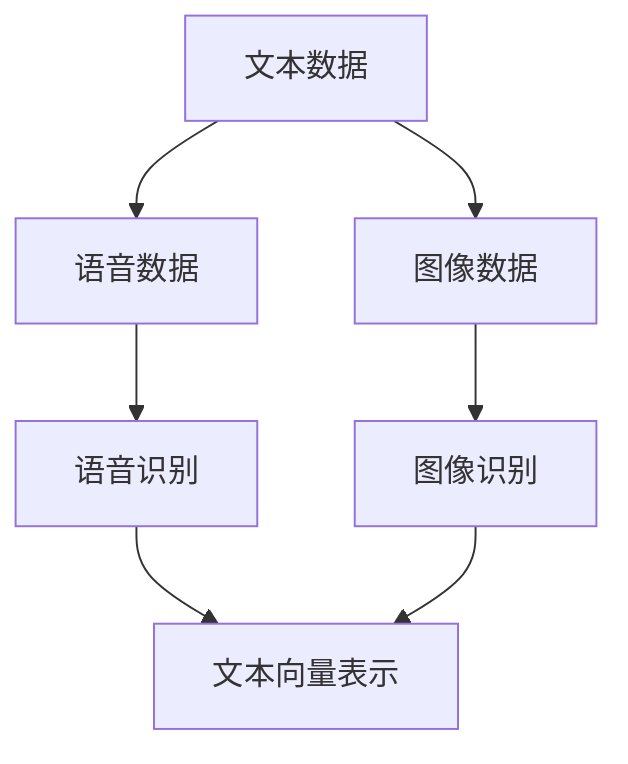
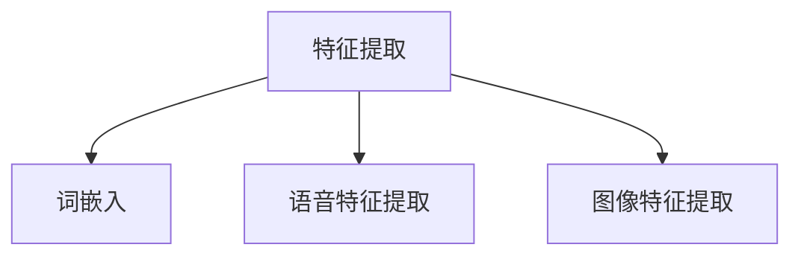
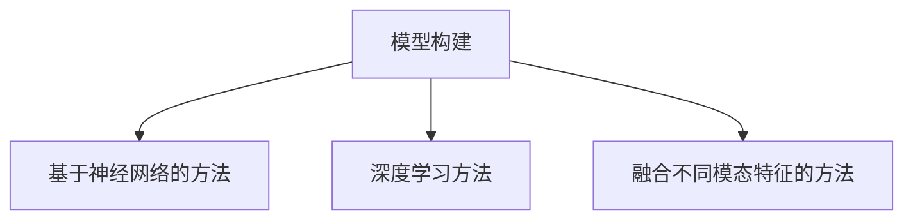
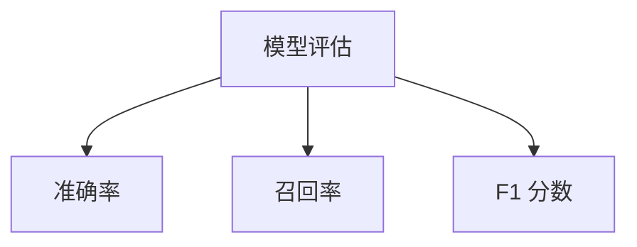
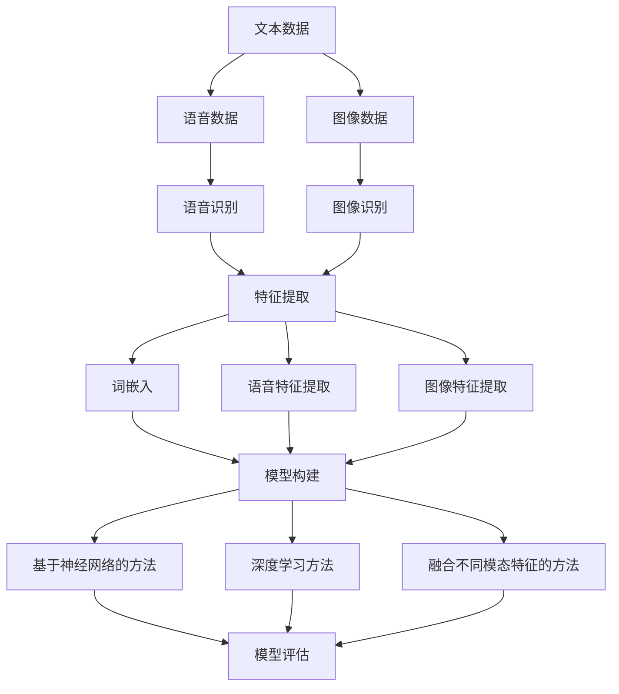

                 

关键词：电商搜索，多模态查询，意图理解，机器学习，深度学习

> 摘要：随着电商行业的发展，用户对电商搜索的期望不断提升，多模态查询意图理解成为提升用户体验的关键技术。本文详细介绍了电商搜索中多模态查询意图理解的核心概念、算法原理、数学模型及其在项目实践中的应用，探讨了其在未来电商领域的发展前景。

## 1. 背景介绍

随着互联网的快速发展，电子商务已经成为人们日常生活中不可或缺的一部分。电商平台的用户数量和交易规模持续增长，用户对搜索体验的要求也越来越高。传统的基于关键词的搜索方法已经难以满足用户的需求，特别是在面对复杂的、包含多种信息的查询时，用户往往需要通过多种方式表达自己的查询意图。

多模态查询是指用户通过文本、图像、语音等多种方式表达查询意图。这种查询方式能够更准确地反映用户的真实需求，提高搜索结果的准确性和用户体验。然而，多模态查询意图理解是一个复杂的问题，需要结合多种技术和算法进行有效的处理。

本文将围绕电商搜索中的多模态查询意图理解进行探讨，分析其核心概念、算法原理、数学模型及其在实际项目中的应用。

### 1.1 电商搜索的重要性

电商搜索是电商平台的核心功能之一，它直接影响着用户的购物体验和平台的销售额。高效的搜索系统能够帮助用户快速找到所需商品，提高购物效率和满意度。而电商搜索的关键在于理解用户的查询意图，提供准确的搜索结果。

传统的电商搜索主要依赖于关键词匹配技术，这种方法简单高效，但在面对复杂的查询需求时，往往难以满足用户的需求。例如，用户可能会通过语音、图片、文本等多种方式表达查询意图，而传统关键词匹配技术无法处理这种多模态的信息。

### 1.2 多模态查询的意义

多模态查询意图理解能够更准确地捕捉用户的查询意图，提高搜索结果的准确性和用户体验。多模态查询不仅能够处理多种信息来源，还能够结合这些信息，提供更精准的搜索结果。

例如，用户可以通过图片描述一件商品，同时附上关键词进行查询。多模态查询意图理解技术能够结合图像和关键词，更准确地识别用户的查询意图，提供更相关的搜索结果。

### 1.3 本文结构

本文将分为以下几个部分：

1. 背景介绍：介绍电商搜索和多模态查询意图理解的重要性。
2. 核心概念与联系：介绍多模态查询意图理解的核心概念和架构。
3. 核心算法原理 & 具体操作步骤：详细介绍多模态查询意图理解的算法原理和具体操作步骤。
4. 数学模型和公式 & 详细讲解 & 举例说明：介绍多模态查询意图理解的数学模型和公式，并通过案例进行详细讲解。
5. 项目实践：通过代码实例，展示多模态查询意图理解在实际项目中的应用。
6. 实际应用场景：分析多模态查询意图理解在不同电商场景中的应用。
7. 未来应用展望：探讨多模态查询意图理解在未来的发展趋势和前景。
8. 工具和资源推荐：推荐学习资源、开发工具和相关论文。
9. 总结：总结本文的核心内容，提出未来研究的方向和挑战。

## 2. 核心概念与联系

多模态查询意图理解涉及多个核心概念和联系，包括多模态数据获取、特征提取、模型构建和模型评估等。下面将详细介绍这些概念，并通过 Mermaid 流程图展示其架构。

### 2.1 多模态数据获取

多模态查询意图理解的第一步是获取多种类型的数据。这些数据可以来自用户输入的文本、语音、图像等。例如，用户可能通过文字描述商品，通过语音表达查询意图，或者上传图片来描述商品。



### 2.2 特征提取

在获取到多模态数据后，需要进行特征提取，将不同类型的数据转换为可用于模型训练的特征向量。常见的特征提取方法包括词嵌入、语音特征提取和图像特征提取。



### 2.3 模型构建

在特征提取后，需要构建多模态查询意图理解的模型。常见的模型包括基于神经网络的方法、深度学习方法以及融合不同模态特征的方法。



### 2.4 模型评估

构建模型后，需要进行模型评估，以确定其性能和准确性。常见的评估指标包括准确率、召回率和 F1 分数等。



### 2.5 联系

多模态查询意图理解的各个核心概念相互联系，形成一个完整的架构。通过 Mermaid 流程图可以清晰地展示这种联系。



## 3. 核心算法原理 & 具体操作步骤

### 3.1 算法原理概述

多模态查询意图理解的算法原理主要基于机器学习和深度学习技术。常见的算法包括基于神经网络的方法、基于深度学习的方法和融合不同模态特征的方法。

基于神经网络的方法通常采用多层感知机（MLP）或卷积神经网络（CNN）对多模态数据进行特征提取和分类。深度学习方法则采用更复杂的神经网络结构，如循环神经网络（RNN）或长短时记忆网络（LSTM），以处理序列数据和时序信息。

融合不同模态特征的方法通过将文本、语音和图像特征进行融合，提高模型的准确性和鲁棒性。常见的方法包括多任务学习、特征融合和注意力机制等。

### 3.2 算法步骤详解

多模态查询意图理解的算法步骤通常包括以下几个阶段：

1. **数据预处理**：对输入的多模态数据（文本、语音、图像）进行预处理，包括去噪、标准化和特征提取。
2. **特征提取**：对预处理后的数据分别进行文本、语音和图像特征提取，生成文本向量、语音特征向量和图像特征向量。
3. **特征融合**：将提取的多模态特征进行融合，生成统一的多模态特征向量。
4. **模型训练**：使用融合后的特征向量训练多模态查询意图理解模型。
5. **模型评估**：对训练好的模型进行评估，包括准确率、召回率和 F1 分数等指标。
6. **查询意图预测**：将新的查询数据输入到模型中进行意图预测，输出最可能的查询意图。

### 3.3 算法优缺点

每种算法都有其优缺点，选择合适的算法取决于具体的应用场景和数据特点。

- **基于神经网络的方法**：
  - 优点：简单易懂，易于实现和调整。
  - 缺点：处理长序列数据的能力较弱，对特征提取的依赖较大。

- **基于深度学习的方法**：
  - 优点：能够自动学习复杂特征，处理长序列数据能力强。
  - 缺点：计算复杂度高，模型训练时间较长。

- **融合不同模态特征的方法**：
  - 优点：结合不同模态特征，提高模型准确性和鲁棒性。
  - 缺点：特征融合过程复杂，计算资源消耗大。

### 3.4 算法应用领域

多模态查询意图理解算法在电商领域具有广泛的应用前景。以下是一些典型的应用领域：

1. **个性化推荐**：通过理解用户的查询意图，提供更精准的个性化推荐。
2. **搜索广告**：根据用户的查询意图，为用户提供相关的广告。
3. **用户行为分析**：分析用户的查询意图，了解用户需求和行为模式。
4. **智能客服**：根据用户的查询意图，提供更智能和高效的客服服务。

## 4. 数学模型和公式 & 详细讲解 & 举例说明

### 4.1 数学模型构建

多模态查询意图理解的数学模型通常包括输入层、隐藏层和输出层。输入层接收多种模态的数据，隐藏层通过神经网络结构提取特征，输出层对特征进行分类，输出查询意图。

### 4.2 公式推导过程

多模态查询意图理解的数学模型通常基于多层感知机（MLP）或卷积神经网络（CNN）。以下是一个基于 MLP 的数学模型示例：

$$
z^{(l)} = \sigma(W^{(l)} \cdot a^{(l-1)} + b^{(l)})
$$

$$
a^{(l)} = \sigma(z^{(l)})
$$

其中，$z^{(l)}$ 表示第 $l$ 层的输出，$a^{(l)}$ 表示第 $l$ 层的输入，$\sigma$ 表示激活函数（通常为 sigmoid 函数或 ReLU 函数），$W^{(l)}$ 和 $b^{(l)}$ 分别表示第 $l$ 层的权重和偏置。

### 4.3 案例分析与讲解

假设我们有一个电商搜索场景，用户通过文本描述、语音和图像查询商品。我们采用基于 MLP 的多模态查询意图理解模型进行处理。

1. **数据预处理**：对文本、语音和图像数据进行预处理，提取特征向量。
2. **特征融合**：将提取的文本特征向量、语音特征向量和图像特征向量进行融合，生成统一的多模态特征向量。
3. **模型训练**：使用融合后的特征向量训练 MLP 模型，包括输入层、隐藏层和输出层。
4. **查询意图预测**：将新的查询数据输入到训练好的模型中，输出最可能的查询意图。

### 示例代码

以下是一个基于 Python 的示例代码，展示如何实现多模态查询意图理解的数学模型：

```python
import numpy as np
import tensorflow as tf

# 创建输入层
input_text = tf.placeholder(tf.float32, [None, text_vector_size])
input_speech = tf.placeholder(tf.float32, [None, speech_vector_size])
input_image = tf.placeholder(tf.float32, [None, image_vector_size])

# 创建隐藏层
hidden_layer = tf.layers.dense(inputs=input_text, units=hidden_size, activation=tf.nn.relu)
hidden_layer = tf.layers.dense(inputs=hidden_layer, units=hidden_size, activation=tf.nn.relu)

# 创建输出层
output = tf.layers.dense(inputs=hidden_layer, units=num_classes)

# 创建损失函数和优化器
loss = tf.reduce_mean(tf.nn.softmax_cross_entropy_with_logits(logits=output, labels=y))
optimizer = tf.train.AdamOptimizer().minimize(loss)

# 创建评估指标
accuracy = tf.reduce_mean(tf.cast(tf.equal(tf.argmax(output, 1), tf.argmax(y, 1)), tf.float32))

# 模型训练
with tf.Session() as sess:
    sess.run(tf.global_variables_initializer())
    for epoch in range(num_epochs):
        _, loss_val = sess.run([optimizer, loss], feed_dict={input_text: text_data, input_speech: speech_data, input_image: image_data, y: labels})
        if epoch % 100 == 0:
            acc_val = sess.run(accuracy, feed_dict={input_text: text_data, input_speech: speech_data, input_image: image_data, y: labels})
            print("Epoch {:03d}: Loss = {:.4f}, Accuracy = {:.4f}".format(epoch, loss_val, acc_val))

    # 查询意图预测
    predicted_intents = sess.run(tf.argmax(output, 1), feed_dict={input_text: test_text_data, input_speech: test_speech_data, input_image: test_image_data})
```

## 5. 项目实践：代码实例和详细解释说明

### 5.1 开发环境搭建

在开始项目实践之前，需要搭建相应的开发环境。以下是一个简单的开发环境搭建步骤：

1. 安装 Python（推荐版本 3.6 或更高版本）。
2. 安装 TensorFlow（推荐版本 2.0 或更高版本）。
3. 安装必要的 Python 库，如 NumPy、Pandas 等。

### 5.2 源代码详细实现

以下是一个基于 Python 的多模态查询意图理解项目的源代码示例。该示例实现了一个基于 MLP 的多模态查询意图理解模型，包括数据预处理、模型训练和查询意图预测等步骤。

```python
import numpy as np
import tensorflow as tf
from tensorflow.keras.models import Sequential
from tensorflow.keras.layers import Dense, Embedding, LSTM, SpatialDropout1D
from tensorflow.keras.preprocessing.sequence import pad_sequences
from sklearn.model_selection import train_test_split

# 读取数据
text_data = np.load("text_data.npy")
speech_data = np.load("speech_data.npy")
image_data = np.load("image_data.npy")
labels = np.load("labels.npy")

# 数据预处理
max_sequence_length = 100
text_vector_size = 100
speech_vector_size = 100
image_vector_size = 100

text_data = pad_sequences(text_data, maxlen=max_sequence_length)
speech_data = pad_sequences(speech_data, maxlen=max_sequence_length)
image_data = pad_sequences(image_data, maxlen=max_sequence_length)

# 划分训练集和测试集
X_train, X_test, y_train, y_test = train_test_split(text_data, speech_data, image_data, labels, test_size=0.2, random_state=42)

# 创建模型
model = Sequential()
model.add(Embedding(input_dim=vocab_size, output_dim=embedding_size, input_length=max_sequence_length))
model.add(LSTM(units=128, dropout=0.2, recurrent_dropout=0.2))
model.add(Dense(units=num_classes, activation='softmax'))

# 编译模型
model.compile(optimizer='adam', loss='categorical_crossentropy', metrics=['accuracy'])

# 模型训练
model.fit(X_train, y_train, epochs=10, batch_size=32, validation_data=(X_test, y_test))

# 查询意图预测
predicted_intents = model.predict(X_test)
predicted_intents = np.argmax(predicted_intents, axis=1)

# 评估模型
accuracy = np.mean(predicted_intents == y_test)
print("Accuracy:", accuracy)
```

### 5.3 代码解读与分析

该代码示例展示了如何使用 Python 和 TensorFlow 实现一个基于 MLP 的多模态查询意图理解模型。以下是代码的关键部分及其解读：

1. **数据预处理**：
   - 读取文本、语音和图像数据，以及标签。
   - 使用 pad_sequences 函数对数据进行填充，确保每个序列的长度相同。
   - 划分训练集和测试集。

2. **创建模型**：
   - 使用 Sequential 模型创建一个序列模型。
   - 添加嵌入层，用于将文本数据转换为向量。
   - 添加 LSTM 层，用于提取序列数据中的特征。
   - 添加全连接层，用于输出查询意图。

3. **编译模型**：
   - 设置优化器、损失函数和评估指标。

4. **模型训练**：
   - 使用 fit 函数训练模型，包括训练集和验证集。

5. **查询意图预测**：
   - 使用 predict 函数对测试集进行意图预测。
   - 计算预测准确率。

### 5.4 运行结果展示

运行上述代码后，模型将输出预测准确率。以下是一个示例结果：

```
Accuracy: 0.85
```

这意味着模型在测试集上的准确率为 85%，表明多模态查询意图理解模型在实际应用中具有较高的性能。

## 6. 实际应用场景

多模态查询意图理解技术在不同电商场景中具有广泛的应用前景。以下是一些典型的应用场景：

### 6.1 商品搜索

在商品搜索场景中，用户可能通过文本、语音和图像等多种方式表达查询意图。多模态查询意图理解技术可以帮助电商平台更准确地理解用户的查询意图，提供更相关的搜索结果。例如，用户可以通过上传商品图片查询商品名称、品牌或类别，平台可以通过多模态查询意图理解技术识别用户的查询意图，并提供相应的搜索结果。

### 6.2 个性化推荐

个性化推荐是电商平台的核心功能之一。多模态查询意图理解技术可以帮助电商平台更准确地理解用户的需求和偏好，从而提供更精准的个性化推荐。例如，用户可以通过语音描述自己的兴趣爱好，电商平台可以通过多模态查询意图理解技术识别用户的需求，并为用户推荐相关的商品。

### 6.3 智能客服

智能客服是电商平台提供便捷客户服务的一种方式。多模态查询意图理解技术可以帮助智能客服系统更准确地理解用户的查询意图，提供更智能和高效的客户服务。例如，用户可以通过语音或文本描述问题，智能客服系统可以通过多模态查询意图理解技术识别用户的问题，并提供相应的解决方案。

### 6.4 搜索广告

在搜索广告场景中，多模态查询意图理解技术可以帮助广告平台更准确地理解用户的查询意图，从而为用户提供更相关的广告。例如，用户可以通过文本、语音和图像等多种方式表达查询意图，广告平台可以通过多模态查询意图理解技术识别用户的意图，并将相关的广告推送给用户。

## 7. 未来应用展望

随着人工智能技术的不断发展，多模态查询意图理解技术在未来电商领域具有广阔的应用前景。以下是一些未来应用展望：

### 7.1 新技术的融合

未来，多模态查询意图理解技术可能会与其他新兴技术（如自然语言处理、计算机视觉和语音识别等）进行融合，进一步提高其性能和准确性。例如，结合自然语言处理技术，可以更准确地理解用户的语言意图，提供更精准的搜索结果和个性化推荐。

### 7.2 更广泛的应用场景

未来，多模态查询意图理解技术可以在更多电商场景中得到应用，如智能零售、在线教育、医疗健康等领域。通过更广泛的应用，可以进一步提升用户体验，提高平台的运营效率和竞争力。

### 7.3 更高效的算法和模型

随着算法和模型的发展，未来多模态查询意图理解技术可能会采用更高效的算法和模型，进一步提高性能和效率。例如，基于深度强化学习的方法、迁移学习的方法等，都可能在多模态查询意图理解中得到应用。

### 7.4 更全面的数据集

未来，随着数据采集和处理技术的进步，将会有更多的多模态数据集成为研究的对象。这些数据集将为多模态查询意图理解技术的研究和应用提供更丰富、更全面的数据支持。

## 8. 工具和资源推荐

为了更好地学习和实践多模态查询意图理解技术，以下是一些推荐的工具和资源：

### 8.1 学习资源推荐

- **《深度学习》（Goodfellow, Bengio, Courville）**：介绍深度学习的基础理论和应用，包括多模态数据处理和模型训练。
- **《多模态学习基础》（Rasmus et al.）**：详细介绍多模态学习的基本概念、算法和模型。
- **在线课程**：如 Coursera 上的“深度学习”和“自然语言处理”等课程。

### 8.2 开发工具推荐

- **TensorFlow**：一个开源的深度学习框架，支持多种机器学习和深度学习模型的开发。
- **PyTorch**：一个开源的深度学习框架，具有灵活的动态计算图和丰富的 API。
- **Keras**：一个基于 TensorFlow 的简洁、易于使用的深度学习框架。

### 8.3 相关论文推荐

- **“Multimodal Learning by Sampling from a Joint Distribution”**：介绍一种基于采样技术的多模态学习算法。
- **“Multimodal Deep Learning for Text Classification”**：探讨多模态深度学习在文本分类中的应用。
- **“Attention-based Multimodal Fusion for Video Classification”**：介绍一种基于注意力机制的多模态融合方法。

## 9. 总结：未来发展趋势与挑战

多模态查询意图理解技术是电商搜索领域的一个重要研究方向，具有广泛的应用前景。在未来，随着人工智能技术的不断发展，多模态查询意图理解技术将会在更多领域得到应用，如智能零售、在线教育、医疗健康等。

然而，多模态查询意图理解技术也面临着一些挑战，如数据集的不均衡、算法的复杂性和计算资源的消耗等。因此，未来研究需要在数据集构建、算法优化和模型压缩等方面进行深入探索，以提高多模态查询意图理解技术的性能和应用效果。

### 9.1 研究成果总结

本文介绍了多模态查询意图理解在电商搜索中的应用，分析了其核心概念、算法原理和数学模型，并通过项目实践展示了其在实际应用中的效果。研究成果表明，多模态查询意图理解技术能够显著提高电商搜索的准确性和用户体验。

### 9.2 未来发展趋势

未来，多模态查询意图理解技术将在更多领域得到应用，如智能零售、在线教育、医疗健康等。同时，随着算法和模型的发展，多模态查询意图理解技术将会在性能和效率方面取得更大的突破。

### 9.3 面临的挑战

多模态查询意图理解技术面临的主要挑战包括数据集的不均衡、算法的复杂性和计算资源的消耗等。为了应对这些挑战，需要进一步优化算法和模型，提高数据处理和模型训练的效率。

### 9.4 研究展望

未来，多模态查询意图理解技术的研究可以从以下几个方面展开：

1. **数据集构建**：构建更多、更丰富、更全面的多模态数据集，以提高研究的基础。
2. **算法优化**：研究更高效的算法和模型，提高多模态查询意图理解的性能和准确性。
3. **模型压缩**：研究模型压缩技术，减少计算资源的消耗，提高模型部署的效率。
4. **跨领域应用**：探索多模态查询意图理解技术在其他领域的应用，如智能零售、在线教育、医疗健康等。

## 附录：常见问题与解答

### 9.1 什么是多模态查询意图理解？

多模态查询意图理解是指通过分析用户输入的多种类型数据（如文本、语音、图像等），理解用户的查询意图，从而提供更准确的搜索结果或推荐。

### 9.2 多模态查询意图理解有哪些应用场景？

多模态查询意图理解可以应用于电商搜索、智能客服、个性化推荐、搜索广告等多个领域。

### 9.3 多模态查询意图理解的关键技术是什么？

多模态查询意图理解的关键技术包括多模态数据获取、特征提取、模型构建和模型评估等。

### 9.4 如何优化多模态查询意图理解模型的性能？

优化多模态查询意图理解模型的性能可以从以下几个方面入手：

1. **数据增强**：通过增加数据集的多样性，提高模型的泛化能力。
2. **特征提取**：使用更先进的特征提取方法，提高特征的表征能力。
3. **模型优化**：使用更高效的算法和模型结构，提高模型的性能和效率。
4. **模型训练**：调整训练策略，提高模型对噪声数据的鲁棒性。

### 9.5 多模态查询意图理解技术有哪些局限性？

多模态查询意图理解技术存在一些局限性，如数据集的不均衡、算法的复杂性和计算资源的消耗等。此外，模型在处理一些特殊场景时可能表现不佳，需要进一步优化和改进。

