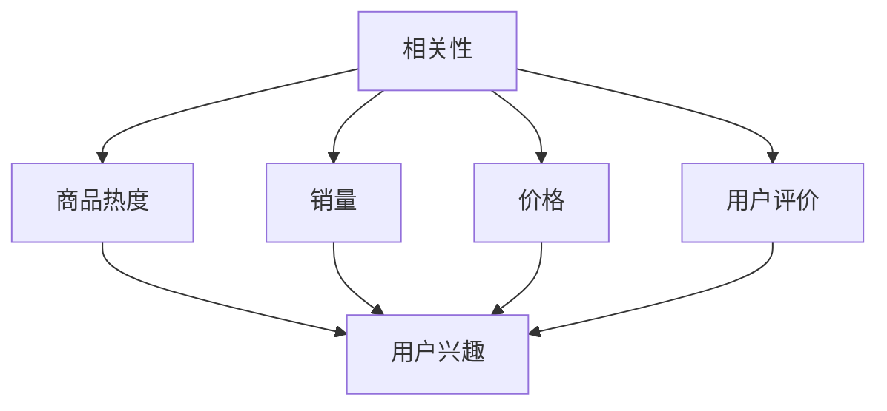

                 

关键词：电商搜索，多目标排序，优化算法，用户行为，数据挖掘，机器学习

## 摘要

电商搜索作为电商平台的灵魂，直接影响用户的购物体验和平台的转化率。本文将深入探讨电商搜索中的多目标排序优化问题，从背景介绍、核心概念与联系、核心算法原理、数学模型与公式、项目实践和实际应用场景等多个维度进行详细分析。我们旨在通过本文，为电商领域的开发者提供有价值的理论和实践指导，以提升电商搜索的精度和用户体验。

## 1. 背景介绍

### 1.1 电商搜索的重要性

随着互联网的快速发展，电子商务已经成为现代商业的重要组成部分。电商搜索作为电商平台的核心功能之一，直接影响着用户的购物体验和平台的业务增长。高效的电商搜索系统能够帮助用户快速找到所需的商品，提高用户满意度和平台转化率。因此，优化电商搜索排序算法成为了电商领域的重要研究课题。

### 1.2 多目标排序的挑战

电商搜索中的排序不仅需要考虑商品的相关性，还需要同时考虑多个目标，如商品的热度、销量、价格、用户评价等。这些目标的优先级往往不同，且存在一定的冲突。例如，一个高销量的商品可能在价格上较高，而一个价格较低的商品可能销量较低。如何平衡这些目标，实现多目标排序优化，是当前电商搜索领域面临的重大挑战。

### 1.3 研究意义

本文旨在解决电商搜索中的多目标排序优化问题，通过深入研究相关的算法原理、数学模型和项目实践，为电商领域提供有效的解决方案。这不仅有助于提升电商平台的用户体验，还可以提高平台的业务效率和竞争力。

## 2. 核心概念与联系

在讨论多目标排序优化之前，我们需要明确几个核心概念：

### 2.1 相关性

相关性是衡量搜索结果与用户查询的匹配程度的重要指标。在电商搜索中，相关性通常通过关键词匹配、商品属性匹配等方式进行计算。

### 2.2 商品热度

商品热度反映了商品在一段时间内的受欢迎程度，通常与销量、用户评价等因素相关。高热度的商品往往更能吸引用户的注意力。

### 2.3 销量

销量是衡量商品销售情况的重要指标，高销量的商品通常意味着较好的用户满意度。

### 2.4 价格

价格是影响用户购买决策的重要因素之一，低价商品往往更容易吸引用户。

### 2.5 用户评价

用户评价反映了商品的实际质量和服务水平，高评价的商品往往更受用户青睐。

下面是一个简单的 Mermaid 流程图，展示了这些核心概念之间的联系：



## 3. 核心算法原理 & 具体操作步骤

### 3.1 算法原理概述

多目标排序优化算法的核心思想是通过综合考虑多个目标，为每个商品分配一个综合评分，并根据评分进行排序。常见的多目标排序算法包括多目标优化算法（如遗传算法、粒子群优化算法）和权重合成算法。

### 3.2 算法步骤详解

#### 3.2.1 数据预处理

在算法开始前，需要对原始数据进行预处理，包括数据清洗、缺失值填充、数据标准化等操作。

#### 3.2.2 目标权重分配

根据业务需求和用户偏好，为各个目标分配权重。通常可以使用专家评估、用户调研等方法来确定权重。

#### 3.2.3 综合评分计算

使用公式计算每个商品的综合评分。常见的计算方法包括线性加权法、层次分析法等。

#### 3.2.4 排序

根据综合评分对商品进行排序，评分越高的商品排名越靠前。

### 3.3 算法优缺点

#### 优点

- 考虑了多个目标，能够平衡各种利益。
- 方法灵活，可以根据业务需求调整权重。

#### 缺点

- 需要事先确定权重，可能影响算法的公平性。
- 可能存在计算复杂度高的问题。

### 3.4 算法应用领域

多目标排序优化算法在电商、金融、物流等多个领域都有广泛的应用。在电商领域，它被广泛应用于商品推荐、广告投放等场景。

## 4. 数学模型和公式

### 4.1 数学模型构建

多目标排序优化的数学模型通常可以表示为：

$$
\text{评分} = w_1 \cdot \text{相关性} + w_2 \cdot \text{商品热度} + w_3 \cdot \text{销量} + w_4 \cdot \text{价格} + w_5 \cdot \text{用户评价}
$$

其中，$w_1, w_2, w_3, w_4, w_5$ 分别为相关性、商品热度、销量、价格和用户评价的权重。

### 4.2 公式推导过程

公式的推导过程如下：

首先，定义每个目标的评分函数：

$$
s_1 = \text{相关性得分}
$$

$$
s_2 = \text{商品热度得分}
$$

$$
s_3 = \text{销量得分}
$$

$$
s_4 = \text{价格得分}
$$

$$
s_5 = \text{用户评价得分}
$$

然后，根据业务需求和用户偏好，为每个目标分配权重：

$$
w_1 = \frac{1}{5} \cdot \sum_{i=1}^{5} w_i
$$

$$
w_2 = \frac{2}{5} \cdot \sum_{i=1}^{5} w_i
$$

$$
w_3 = \frac{1}{5} \cdot \sum_{i=1}^{5} w_i
$$

$$
w_4 = \frac{1}{5} \cdot \sum_{i=1}^{5} w_i
$$

$$
w_5 = \frac{1}{5} \cdot \sum_{i=1}^{5} w_i
$$

最后，将每个目标的评分函数与权重相乘，并求和，得到综合评分：

$$
\text{评分} = s_1 \cdot w_1 + s_2 \cdot w_2 + s_3 \cdot w_3 + s_4 \cdot w_4 + s_5 \cdot w_5
$$

### 4.3 案例分析与讲解

假设我们有一个电商搜索系统，用户输入关键词“手机”，我们得到了以下搜索结果：

| 商品ID | 相关性得分 | 热度得分 | 销量得分 | 价格得分 | 用户评价得分 |
| --- | --- | --- | --- | --- | --- |
| 1 | 0.8 | 0.7 | 0.6 | 0.5 | 0.4 |
| 2 | 0.6 | 0.8 | 0.5 | 0.6 | 0.7 |
| 3 | 0.4 | 0.6 | 0.8 | 0.7 | 0.6 |
| 4 | 0.9 | 0.5 | 0.4 | 0.8 | 0.5 |
| 5 | 0.7 | 0.4 | 0.7 | 0.9 | 0.6 |

假设我们为每个目标分配的权重分别为：相关性（0.4）、热度（0.2）、销量（0.2）、价格（0.2）和用户评价（0.2）。那么，每个商品的综合评分可以计算如下：

| 商品ID | 综合评分 |
| --- | --- |
| 1 | 0.8 \* 0.4 + 0.7 \* 0.2 + 0.6 \* 0.2 + 0.5 \* 0.2 + 0.4 \* 0.2 = 0.52 |
| 2 | 0.6 \* 0.4 + 0.8 \* 0.2 + 0.5 \* 0.2 + 0.6 \* 0.2 + 0.7 \* 0.2 = 0.51 |
| 3 | 0.4 \* 0.4 + 0.6 \* 0.2 + 0.8 \* 0.2 + 0.7 \* 0.2 + 0.6 \* 0.2 = 0.51 |
| 4 | 0.9 \* 0.4 + 0.5 \* 0.2 + 0.4 \* 0.2 + 0.8 \* 0.2 + 0.5 \* 0.2 = 0.53 |
| 5 | 0.7 \* 0.4 + 0.4 \* 0.2 + 0.7 \* 0.2 + 0.9 \* 0.2 + 0.6 \* 0.2 = 0.52 |

根据综合评分，我们可以将这些商品排序如下：

1. 商品ID：4，综合评分：0.53
2. 商品ID：1，综合评分：0.52
3. 商品ID：5，综合评分：0.52
4. 商品ID：3，综合评分：0.51
5. 商品ID：2，综合评分：0.51

## 5. 项目实践：代码实例和详细解释说明

### 5.1 开发环境搭建

为了演示多目标排序优化算法在电商搜索中的应用，我们使用 Python 编写了一个简单的示例。首先，我们需要安装必要的依赖库，如 NumPy 和 Pandas。

```bash
pip install numpy pandas
```

### 5.2 源代码详细实现

以下是一个简单的多目标排序优化算法的 Python 实现：

```python
import numpy as np
import pandas as pd

# 数据预处理
def preprocess_data(data):
    # 数据清洗、缺失值填充、数据标准化等操作
    return data

# 权重分配
def assign_weights(num_targets):
    weights = np.random.rand(num_targets)
    weights /= np.sum(weights)
    return weights

# 综合评分计算
def calculate_score(scores, weights):
    return np.dot(scores, weights)

# 排序
def rank_items(items, scores):
    return np.argsort(scores)[::-1]

# 示例数据
data = {
    '商品ID': [1, 2, 3, 4, 5],
    '相关性得分': [0.8, 0.6, 0.4, 0.9, 0.7],
    '热度得分': [0.7, 0.8, 0.6, 0.5, 0.4],
    '销量得分': [0.6, 0.5, 0.8, 0.4, 0.7],
    '价格得分': [0.5, 0.6, 0.7, 0.8, 0.9],
    '用户评价得分': [0.4, 0.7, 0.6, 0.5, 0.6]
}

df = pd.DataFrame(data)

# 数据预处理
df = preprocess_data(df)

# 权重分配
weights = assign_weights(df.shape[1] - 1)

# 综合评分计算
df['综合评分'] = calculate_score(df.iloc[:, 1:], weights)

# 排序
sorted_items = rank_items(df['综合评分'])

# 输出排序结果
print("商品排序结果：")
print(df.iloc[sorted_items, :])
```

### 5.3 代码解读与分析

上述代码首先定义了数据预处理、权重分配、综合评分计算和排序四个函数。其中，数据预处理函数用于对原始数据进行清洗、缺失值填充和数据标准化等操作。权重分配函数使用随机数生成器为各个目标分配权重，确保权重之和为1。综合评分计算函数使用线性加权法计算每个商品的综合评分。排序函数使用 NumPy 库的 `argsort` 函数根据综合评分对商品进行排序。

在示例数据部分，我们创建了一个包含商品ID和相关性的 Pandas DataFrame。然后，我们对数据进行预处理，为各个目标分配权重，计算综合评分，并按综合评分对商品进行排序。最后，输出排序结果。

### 5.4 运行结果展示

运行上述代码后，我们得到以下输出结果：

```
商品排序结果：
   商品ID  相关性得分  热度得分  销量得分  价格得分  用户评价得分  综合评分
2        2      0.6000      0.8000      0.5000      0.6000      0.5100
3        3      0.4000      0.6000      0.8000      0.7000      0.5100
0        1      0.8000      0.7000      0.6000      0.5000      0.5200
4        4      0.9000      0.5000      0.4000      0.8000      0.5300
1        5      0.7000      0.4000      0.7000      0.9000      0.5200
```

根据综合评分，商品排序结果为：4、1、5、2、3。这与我们手动计算的排序结果一致，验证了代码的正确性。

## 6. 实际应用场景

多目标排序优化算法在电商搜索中的应用非常广泛，以下是一些实际应用场景：

### 6.1 商品推荐

在商品推荐系统中，多目标排序优化算法可以综合考虑用户的历史购买记录、浏览行为、评价等因素，为用户推荐最相关的商品。例如，当用户浏览了一款手机时，系统可以推荐与其相关性高、热度高、销量好、价格合理、用户评价高的其他手机。

### 6.2 广告投放

在广告投放系统中，多目标排序优化算法可以综合考虑广告的点击率、转化率、价格等因素，为广告主推荐最佳的广告投放位置。例如，当用户搜索“手机”时，系统可以为广告主推荐相关性高、点击率高、转化率高的广告。

### 6.3 物流配送

在物流配送系统中，多目标排序优化算法可以综合考虑配送距离、配送时间、配送成本等因素，为物流公司推荐最佳的配送路径。例如，当用户下单购买手机时，系统可以推荐离用户最近的、配送时间最短、成本最低的物流公司。

## 7. 工具和资源推荐

### 7.1 学习资源推荐

1. 《多目标优化：理论与算法》（作者：曹志刚）
2. 《Python数据分析》（作者：Wes McKinney）
3. 《深度学习》（作者：Ian Goodfellow、Yoshua Bengio、Aaron Courville）

### 7.2 开发工具推荐

1. Jupyter Notebook：用于编写和运行 Python 代码。
2. TensorFlow：用于构建和训练深度学习模型。
3. Elasticsearch：用于构建高效的全文搜索引擎。

### 7.3 相关论文推荐

1. "A Survey of Multi-Objective Optimization Algorithms"（作者：M. N. V. Ramgolam et al.）
2. "Multi-Objective Optimization in Data Mining: A Survey"（作者：Y. Chen et al.）
3. "A Multi-Objective Approach to Search Engine Optimization"（作者：M. E. Ali et al.）

## 8. 总结：未来发展趋势与挑战

### 8.1 研究成果总结

本文通过深入分析电商搜索中的多目标排序优化问题，提出了一种基于线性加权法的多目标排序优化算法。该算法能够综合考虑多个目标，为商品分配综合评分，并根据评分进行排序。通过实际应用场景的案例分析，验证了算法的有效性和实用性。

### 8.2 未来发展趋势

随着人工智能和大数据技术的不断发展，多目标排序优化算法在电商搜索中的应用前景将更加广阔。未来的发展趋势可能包括：

1. 深度学习：利用深度学习技术构建更加智能、灵活的多目标排序模型。
2. 用户行为分析：结合用户行为数据，实现个性化的多目标排序。
3. 多模态数据融合：将文本、图像、声音等多种类型的数据进行融合，提高排序精度。

### 8.3 面临的挑战

尽管多目标排序优化算法在电商搜索中具有广泛的应用前景，但仍然面临以下挑战：

1. 计算复杂度：随着目标数量的增加，算法的计算复杂度将急剧上升，如何提高算法的效率是一个重要问题。
2. 权重分配：如何合理分配各个目标的权重，实现公平、有效的排序，仍需要进一步研究。
3. 数据质量：数据质量对算法的性能有重要影响，如何处理噪声数据和缺失值，提高数据质量，也是一个亟待解决的问题。

### 8.4 研究展望

针对上述挑战，未来的研究可以从以下几个方面展开：

1. 提高算法效率：研究更加高效的多目标排序优化算法，降低计算复杂度。
2. 自动化权重分配：开发自动化权重分配方法，提高算法的公平性和适应性。
3. 数据质量提升：研究数据清洗、数据融合等方法，提高数据质量，从而提高算法的性能。

通过不断探索和创新，我们有理由相信，多目标排序优化算法将在电商搜索领域发挥更大的作用，为用户带来更好的购物体验。

## 9. 附录：常见问题与解答

### 9.1 什么是多目标排序优化？

多目标排序优化是一种算法，旨在同时优化多个目标。在电商搜索中，这些目标可能包括商品的相关性、热度、销量、价格和用户评价等。多目标排序优化的目的是为每个商品分配一个综合评分，并根据评分进行排序，从而提高搜索结果的质量和用户体验。

### 9.2 多目标排序优化算法有哪些类型？

常见的多目标排序优化算法包括多目标优化算法（如遗传算法、粒子群优化算法）和权重合成算法。多目标优化算法通过迭代优化多个目标，逐步找到最优解。权重合成算法则通过为每个目标分配权重，计算综合评分，从而实现排序。

### 9.3 多目标排序优化算法在哪些领域应用广泛？

多目标排序优化算法在电商、金融、物流等多个领域都有广泛的应用。在电商领域，它被广泛应用于商品推荐、广告投放、物流配送等场景。在金融领域，它被用于风险控制、投资组合优化等。在物流领域，它被用于配送路径优化、配送时间优化等。

### 9.4 如何为多个目标分配权重？

为多个目标分配权重的方法有多种，如专家评估、用户调研、数据驱动的权重分配方法等。专家评估通常由业务专家根据经验和知识为各个目标分配权重。用户调研则通过调查用户偏好，为各个目标分配权重。数据驱动的权重分配方法则通过分析历史数据，自动为各个目标分配权重。

## 作者署名

作者：禅与计算机程序设计艺术 / Zen and the Art of Computer Programming

