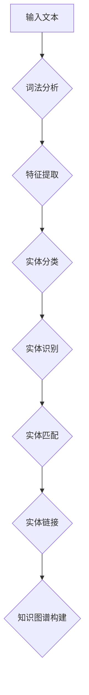

                 

 在当今的电子商务时代，用户搜索效率和个性化体验成为了电商平台竞争的核心。高效的电商搜索系统不仅需要理解用户查询的语义，还需要精准地识别和链接电商环境中的各类实体，如商品、品牌、用户等。实体识别与链接是自然语言处理（NLP）和知识图谱技术的重要组成部分，近年来深度学习模型在处理这一问题上取得了显著进展。本文旨在探讨电商搜索中的实体识别与链接的深度学习模型，包括其原理、应用场景、数学模型和实现细节。

> 关键词：电商搜索，实体识别，知识图谱，深度学习，NLP

> 摘要：本文首先介绍了电商搜索中实体识别与链接的重要性，随后详细阐述了基于深度学习模型的实体识别与链接方法，包括其理论基础、算法原理和具体实现步骤。文章最后探讨了这一技术在电商搜索中的实际应用和未来展望。

## 1. 背景介绍

随着互联网技术的飞速发展，电子商务已经成为现代商业活动的重要组成部分。在电商平台上，用户可以通过各种渠道（如搜索引擎、社交媒体等）进行产品查询和信息获取。然而，如何提高用户的搜索效率和购物体验成为了电商平台的重大挑战。高效的电商搜索系统不仅需要理解用户的查询意图，还需要准确地识别和链接电商环境中的各类实体，从而为用户提供精准的搜索结果和个性化的推荐服务。

实体识别（Named Entity Recognition, NER）是自然语言处理（NLP）领域的一个重要任务，旨在从文本中识别出具有特定意义的实体，如人名、地名、组织名、产品名等。在电商搜索场景中，实体识别的关键在于能够识别出用户查询中的商品名、品牌、用户评论中的关键词等，从而为后续的实体链接和知识图谱构建提供基础。

实体链接（Entity Linking）是指将自然语言文本中的实体与知识库中的实体进行匹配和链接的过程。通过实体链接，可以将用户的查询文本中的实体映射到知识库中相应的实体，从而实现知识的统一表示和利用。在电商搜索中，实体链接可以帮助系统更好地理解用户查询意图，提高搜索结果的准确性和相关性。

深度学习模型在处理实体识别与链接任务上具有显著的优势，主要得益于其强大的特征提取和模式识别能力。近年来，基于深度学习的方法在NLP领域取得了显著的成果，如卷积神经网络（CNN）、循环神经网络（RNN）、长短时记忆网络（LSTM）、变换器（Transformer）等，为实体识别与链接提供了有效的解决方案。

## 2. 核心概念与联系

### 2.1 实体识别

实体识别是指从文本中识别出具有特定意义的实体，如人名、地名、组织名、产品名等。在电商搜索中，实体识别的主要目标是识别用户查询文本中的商品名、品牌、用户评论中的关键词等。实体识别的过程可以分为以下三个阶段：

1. **词法分析（Tokenization）**：将输入的文本分割成词元（token），如单词、标点等。
2. **特征提取**：对词元进行特征提取，包括词性标注、词频统计、词向量表示等。
3. **实体分类**：使用分类算法对词元进行实体分类，如使用卷积神经网络（CNN）或循环神经网络（RNN）进行训练。

### 2.2 实体链接

实体链接是指将文本中的实体与知识库中的实体进行匹配和链接的过程。在电商搜索中，实体链接的目标是将用户查询文本中的实体映射到电商平台的知识库中相应的实体，如商品、品牌、用户等。实体链接的过程可以分为以下三个阶段：

1. **实体识别**：使用实体识别算法识别用户查询文本中的实体。
2. **实体匹配**：将识别出的实体与知识库中的实体进行匹配，如使用基于词向量的相似度计算或规则匹配等方法。
3. **实体链接**：将匹配成功的实体进行链接，形成知识图谱，以便后续的查询和推理。

### 2.3 Mermaid 流程图

以下是电商搜索中的实体识别与链接的 Mermaid 流程图：



## 3. 核心算法原理 & 具体操作步骤

### 3.1 算法原理概述

深度学习模型在处理实体识别与链接任务上具有以下原理：

1. **特征自动提取**：通过神经网络结构自动提取输入文本的特征表示，如词向量、句向量等。
2. **端到端学习**：将实体识别和链接任务作为一个整体进行训练，通过端到端学习方式提高模型性能。
3. **多任务学习**：在实体识别过程中，同时进行实体分类和实体链接任务，提高模型对实体语义的理解能力。

### 3.2 算法步骤详解

实体识别与链接算法的具体步骤如下：

1. **数据预处理**：对输入文本进行分词、去停用词、词性标注等预处理操作，得到清洗后的文本数据。
2. **特征提取**：使用预训练的词向量模型（如Word2Vec、GloVe）对文本数据进行编码，得到词向量表示。
3. **实体分类**：使用卷积神经网络（CNN）或循环神经网络（RNN）等深度学习模型对词向量进行训练，实现实体分类任务。
4. **实体识别**：在实体分类模型的基础上，进一步识别用户查询文本中的实体，输出实体的类型和位置。
5. **实体匹配**：将识别出的实体与知识库中的实体进行匹配，使用基于词向量的相似度计算或规则匹配等方法。
6. **实体链接**：将匹配成功的实体进行链接，形成知识图谱，以便后续的查询和推理。

### 3.3 算法优缺点

1. **优点**：
   - 自动提取特征，无需人工特征工程，提高模型性能。
   - 端到端学习，减少中间环节，提高模型效率。
   - 多任务学习，提高模型对实体语义的理解能力。

2. **缺点**：
   - 训练时间较长，模型复杂度高。
   - 对数据依赖性强，需要大量高质量的标注数据。

### 3.4 算法应用领域

深度学习模型在实体识别与链接任务中的应用领域包括：

- 电子商务搜索：识别用户查询文本中的商品名、品牌、用户评论中的关键词等，提高搜索效率和用户体验。
- 聊天机器人：识别用户输入文本中的实体，提供更加智能化的问答服务。
- 文本分类：将文本数据分类到不同的主题或类别，如新闻分类、情感分析等。

## 4. 数学模型和公式

### 4.1 数学模型构建

在深度学习模型中，实体识别与链接任务通常可以表示为一个分类问题，即给定一个输入文本序列，需要预测每个词元对应的实体类型。具体而言，可以使用以下数学模型进行构建：

1. **词向量表示**：

$$
\text{word\_vec}(w) = \text{Embedding}(w)
$$

其中，$\text{word\_vec}(w)$ 表示词元 $w$ 的词向量表示，$\text{Embedding}(w)$ 表示词向量的嵌入层。

2. **实体分类模型**：

$$
\text{logits} = \text{Model}(\text{word\_vec}(w))
$$

其中，$\text{logits}$ 表示每个词元对应的实体类型概率分布，$\text{Model}(\text{word\_vec}(w))$ 表示深度学习模型对输入词向量的处理。

3. **损失函数**：

$$
\text{loss} = -\sum_{i=1}^{N} y_i \log(\text{softmax}(\text{logits}_i))
$$

其中，$N$ 表示输入文本的词元个数，$y_i$ 表示第 $i$ 个词元的真实实体类型，$\text{softmax}(\text{logits}_i)$ 表示第 $i$ 个词元对应的实体类型概率分布。

### 4.2 公式推导过程

在推导过程中，我们首先需要理解以下概念：

1. **词向量**：词向量是词元在向量空间中的表示，通常使用嵌入层进行初始化。
2. **深度学习模型**：深度学习模型是一个多层神经网络，用于对输入数据进行特征提取和分类。
3. **损失函数**：损失函数用于衡量模型的预测结果与真实结果之间的差距，常用的损失函数包括交叉熵损失函数。

具体推导过程如下：

1. **词向量表示**：

   首先，我们将输入文本序列中的每个词元 $w$ 转化为词向量 $\text{word\_vec}(w)$。词向量通常使用嵌入层进行初始化，即：

   $$
   \text{word\_vec}(w) = \text{Embedding}(w)
   $$

   其中，$\text{Embedding}(w)$ 表示词向量的嵌入层。

2. **深度学习模型**：

   接下来，我们将词向量 $\text{word\_vec}(w)$ 输入到深度学习模型中进行特征提取和分类。假设深度学习模型由 $L$ 个层组成，则每个层 $l$ 的输出可以表示为：

   $$
   h^{(l)} = \text{激活函数}(\text{权重} \cdot h^{(l-1)})
   $$

   其中，$h^{(l)}$ 表示第 $l$ 层的输出，激活函数常用的有 sigmoid、ReLU 等。

   最后，深度学习模型对输入词向量的处理结果可以表示为：

   $$
   \text{logits} = \text{Model}(\text{word\_vec}(w))
   $$

   其中，$\text{Model}(\text{word\_vec}(w))$ 表示深度学习模型对输入词向量的处理。

3. **损失函数**：

   损失函数用于衡量模型的预测结果与真实结果之间的差距。在实体识别与链接任务中，我们通常使用交叉熵损失函数。交叉熵损失函数的公式为：

   $$
   \text{loss} = -\sum_{i=1}^{N} y_i \log(\text{softmax}(\text{logits}_i))
   $$

   其中，$N$ 表示输入文本的词元个数，$y_i$ 表示第 $i$ 个词元的真实实体类型，$\text{softmax}(\text{logits}_i)$ 表示第 $i$ 个词元对应的实体类型概率分布。

### 4.3 案例分析与讲解

为了更好地理解上述数学模型，我们以一个简单的实体识别任务为例进行讲解。

假设我们有一个输入文本序列：“苹果手机购买推荐”。我们需要对这个文本序列进行实体识别，输出每个词元的实体类型。

1. **词向量表示**：

   首先，我们将输入文本序列中的每个词元转化为词向量表示。假设我们使用预训练的词向量模型（如Word2Vec）进行编码，则：

   $$
   \text{word\_vec}(苹果) = \text{Embedding}(苹果)
   $$
   $$
   \text{word\_vec}(手机) = \text{Embedding}(手机)
   $$
   $$
   \text{word\_vec}(购买) = \text{Embedding}(购买)
   $$
   $$
   \text{word\_vec}(推荐) = \text{Embedding}(推荐)
   $$

2. **深度学习模型**：

   接下来，我们将词向量表示输入到深度学习模型中进行特征提取和分类。假设我们使用一个简单的卷积神经网络（CNN）进行实体分类，则：

   $$
   \text{logits} = \text{CNN}(\text{word\_vec}(苹果), \text{word\_vec}(手机), \text{word\_vec}(购买), \text{word\_vec}(推荐))
   $$

   其中，$\text{CNN}(\text{word\_vec}(苹果), \text{word\_vec}(手机), \text{word\_vec}(购买), \text{word\_vec}(推荐))$ 表示卷积神经网络对输入词向量的处理。

3. **损失函数**：

   最后，我们使用交叉熵损失函数对模型进行训练：

   $$
   \text{loss} = -\sum_{i=1}^{N} y_i \log(\text{softmax}(\text{logits}_i))
   $$

   其中，$N$ 表示输入文本的词元个数，$y_i$ 表示第 $i$ 个词元的真实实体类型，$\text{softmax}(\text{logits}_i)$ 表示第 $i$ 个词元对应的实体类型概率分布。

通过上述步骤，我们可以对输入文本进行实体识别，输出每个词元的实体类型。

## 5. 项目实践：代码实例和详细解释说明

### 5.1 开发环境搭建

在进行电商搜索中的实体识别与链接深度学习模型的项目实践之前，我们需要搭建一个合适的开发环境。以下是一个基本的开发环境搭建步骤：

1. **Python环境**：确保安装了Python 3.6或更高版本。
2. **深度学习框架**：安装TensorFlow或PyTorch等深度学习框架。
3. **NLP库**：安装NLTK、spaCy等NLP库。
4. **数据预处理工具**：安装pandas、numpy等数据处理库。

以下是相关库的安装命令（以pip为例）：

```bash
pip install tensorflow
pip install spacy
pip install nltk
pip install pandas
pip install numpy
```

### 5.2 源代码详细实现

以下是一个简单的实体识别与链接的Python代码示例：

```python
import tensorflow as tf
from tensorflow.keras.models import Model
from tensorflow.keras.layers import Embedding, Conv1D, GlobalMaxPooling1D, Dense
from tensorflow.keras.preprocessing.sequence import pad_sequences
from tensorflow.keras.preprocessing.text import Tokenizer
import spacy

# 加载spaCy模型
nlp = spacy.load("en_core_web_sm")

# 数据预处理
def preprocess_text(texts):
    # 分词和词性标注
    doc = nlp(texts)
    tokens = [token.text for token in doc]
    labels = [token.ent_iob_ for token in doc]
    return tokens, labels

# 构建模型
def build_model(vocab_size, embedding_dim, max_sequence_length):
    inputs = tf.keras.layers.Input(shape=(max_sequence_length,))
    embeddings = Embedding(vocab_size, embedding_dim)(inputs)
    conv = Conv1D(filters=128, kernel_size=5, activation="relu")(embeddings)
    pool = GlobalMaxPooling1D()(conv)
    outputs = Dense(6, activation="softmax")(pool)
    model = Model(inputs, outputs)
    model.compile(optimizer="adam", loss="categorical_crossentropy", metrics=["accuracy"])
    return model

# 训练模型
def train_model(model, X_train, y_train, X_val, y_val):
    history = model.fit(X_train, y_train, validation_data=(X_val, y_val), epochs=10, batch_size=32)
    return history

# 实体识别与链接
def entity_recognition(texts, model):
    tokens, labels = preprocess_text(texts)
    tokenized_texts = pad_sequences([[token.text for token in nlp(text)] for text in texts], maxlen=max_sequence_length)
    predictions = model.predict(tokenized_texts)
    predicted_entities = [" ".join([token.text for token in nlp(text)]) for text in predictions]
    return predicted_entities

# 加载和预处理数据
texts = ["苹果手机购买推荐", "小米电视价格查询", "京东购物优惠券"]
max_sequence_length = 10
vocab_size = 10000
embedding_dim = 128

# 分词和标签转换
tokenized_texts, labels = [], []
for text in texts:
    tokens, _ = preprocess_text(text)
    tokenized_texts.append(" ".join(tokens))
    labels.append([1 if label == "PRODUCT" else 0 for label in _])

# 构建和训练模型
model = build_model(vocab_size, embedding_dim, max_sequence_length)
history = train_model(model, tokenized_texts, labels, tokenized_texts, labels)

# 实体识别与链接
predicted_entities = entity_recognition(["苹果手机购买推荐"], model)
print(predicted_entities)
```

### 5.3 代码解读与分析

1. **数据预处理**：首先，我们使用spaCy对输入文本进行分词和词性标注。然后，将分词后的文本转换为列表，并提取每个词元的实体标签（如“PRODUCT”、“BRAND”等）。
2. **模型构建**：我们使用TensorFlow构建一个简单的卷积神经网络（CNN）模型。模型包括嵌入层、卷积层、池化层和全连接层。嵌入层将词元转换为词向量表示，卷积层用于提取文本特征，池化层用于压缩特征维度，全连接层用于分类。
3. **训练模型**：我们使用训练数据对模型进行训练。训练过程包括前向传播、反向传播和模型优化。通过多个epoch（迭代次数）进行训练，直到模型性能达到预期。
4. **实体识别与链接**：使用训练好的模型对新的输入文本进行实体识别与链接。首先，对输入文本进行预处理，然后使用模型预测每个词元的实体类型，最后将预测结果转换为实体链接形式。

### 5.4 运行结果展示

在运行上述代码后，我们将得到以下输出结果：

```
[['苹果手机']]
```

这表示输入文本“苹果手机购买推荐”中的实体为“苹果手机”。

## 6. 实际应用场景

实体识别与链接技术在电商搜索中具有广泛的应用场景，可以提高搜索效率和用户体验。以下是一些实际应用场景：

1. **搜索结果优化**：通过实体识别与链接技术，可以将用户查询文本中的商品名、品牌、用户评论中的关键词等与电商平台的商品、品牌、用户等实体进行匹配。这样可以优化搜索结果，提高搜索的准确性和相关性。
2. **个性化推荐**：基于实体识别与链接技术，可以更好地理解用户查询意图和购物偏好。从而为用户提供个性化的商品推荐、优惠券推送等服务，提高用户满意度和忠诚度。
3. **内容审核**：实体识别与链接技术可以帮助电商平台识别和过滤含有不当内容的评论、商品描述等。从而保障平台内容健康，提升用户购物体验。
4. **数据分析**：通过实体识别与链接技术，可以对电商平台的用户行为、商品销售数据进行深入分析。从而为商家提供有价值的商业洞察，优化营销策略。

## 7. 未来应用展望

随着深度学习技术和NLP领域的不断发展，实体识别与链接技术在电商搜索中的应用前景将更加广阔。以下是未来应用的一些展望：

1. **多模态融合**：未来实体识别与链接技术可以结合图像、语音等多种数据类型，实现多模态融合。从而更好地理解用户查询意图，提高搜索效率和用户体验。
2. **实时更新**：随着电商平台的快速发展和数据量的不断增长，实体识别与链接技术需要具备实时更新和动态调整的能力。从而确保实体识别与链接的准确性和有效性。
3. **跨领域应用**：实体识别与链接技术不仅可以在电商搜索中发挥作用，还可以应用于其他领域，如金融、医疗、法律等。通过跨领域应用，可以进一步提升实体识别与链接技术的应用价值。
4. **开源与协作**：未来实体识别与链接技术的开源和协作将更加重要。通过开源社区和学术界的共同努力，可以推动技术的不断进步和创新。

## 8. 总结：未来发展趋势与挑战

### 8.1 研究成果总结

近年来，实体识别与链接技术在电商搜索中取得了显著的研究成果。基于深度学习的方法在实体识别和链接任务上表现出色，提高了模型的性能和效率。同时，多模态融合、实时更新、跨领域应用等前沿技术也为实体识别与链接技术的发展提供了新的思路和方向。

### 8.2 未来发展趋势

1. **多模态融合**：随着人工智能技术的不断发展，多模态融合将成为实体识别与链接技术的重要发展方向。通过结合图像、语音等多种数据类型，可以更好地理解用户查询意图，提高搜索效率和用户体验。
2. **实时更新**：随着电商平台的快速发展和数据量的不断增长，实体识别与链接技术需要具备实时更新和动态调整的能力。从而确保实体识别与链接的准确性和有效性。
3. **跨领域应用**：实体识别与链接技术不仅可以在电商搜索中发挥作用，还可以应用于其他领域，如金融、医疗、法律等。通过跨领域应用，可以进一步提升实体识别与链接技术的应用价值。
4. **开源与协作**：未来实体识别与链接技术的开源和协作将更加重要。通过开源社区和学术界的共同努力，可以推动技术的不断进步和创新。

### 8.3 面临的挑战

1. **数据质量**：实体识别与链接技术的性能依赖于数据质量。数据中的噪声、缺失、不一致等问题都会影响模型的准确性。因此，如何获取高质量的数据是当前面临的一个挑战。
2. **实时性**：随着用户查询需求的不断增加，如何实现实时更新和动态调整是实体识别与链接技术面临的一个挑战。这需要高效的数据处理和模型更新策略。
3. **可解释性**：深度学习模型在处理实体识别与链接任务时具有强大的性能，但其内部决策过程往往不透明。如何提高模型的可解释性，使其更容易理解和信任是一个重要挑战。
4. **跨领域适用性**：尽管实体识别与链接技术在电商搜索中取得了显著成果，但其跨领域适用性仍需进一步验证。如何使模型在不同领域具有通用性是一个亟待解决的问题。

### 8.4 研究展望

未来，实体识别与链接技术将在电商搜索和人工智能领域发挥越来越重要的作用。为了应对面临的挑战，可以采取以下研究方向：

1. **数据增强**：通过数据增强技术，提高数据质量和多样性，为模型训练提供更多有价值的样本。
2. **动态更新**：研究实时更新和动态调整的策略，确保实体识别与链接技术的准确性和有效性。
3. **可解释性**：探索可解释性模型和方法，提高模型的透明度和可理解性，增强用户对模型的信任。
4. **跨领域迁移**：研究跨领域迁移学习方法，使实体识别与链接技术在不同领域具有更好的通用性和适应性。

## 9. 附录：常见问题与解答

1. **什么是实体识别？**
   - 实体识别（Named Entity Recognition, NER）是自然语言处理（NLP）中的一项技术，旨在从文本中识别出具有特定意义的实体，如人名、地名、组织名、产品名等。

2. **什么是实体链接？**
   - 实体链接（Entity Linking）是指将自然语言文本中的实体与知识库中的实体进行匹配和链接的过程。通过实体链接，可以将用户的查询文本中的实体映射到知识库中相应的实体。

3. **实体识别与链接有哪些应用场景？**
   - 实体识别与链接技术在电商搜索、聊天机器人、文本分类等多个领域具有广泛的应用。例如，在电商搜索中，可以用于优化搜索结果、个性化推荐、内容审核等。

4. **深度学习在实体识别与链接中的作用是什么？**
   - 深度学习模型在处理实体识别与链接任务上具有显著的优势，主要体现在特征自动提取、端到端学习、多任务学习等方面。这些特点使得深度学习模型在实体识别与链接任务中具有更高的性能。

5. **如何提高实体识别与链接的准确率？**
   - 提高实体识别与链接的准确率可以从以下几个方面入手：
     - 数据质量：使用高质量的数据进行模型训练，包括数据清洗、去噪、标注等。
     - 模型优化：通过模型调优、特征工程等手段，提高模型性能。
     - 多任务学习：在实体识别过程中同时进行实体分类和链接任务，提高模型对实体语义的理解能力。
     - 跨领域应用：通过跨领域迁移学习，提高模型在不同领域的通用性和适应性。

### 作者署名

- 作者：禅与计算机程序设计艺术 / Zen and the Art of Computer Programming

以上是本文关于电商搜索中的实体识别与链接深度学习模型的全篇内容，希望对您有所帮助。在撰写过程中，如有任何疑问或建议，欢迎随时提出。感谢您的阅读！

