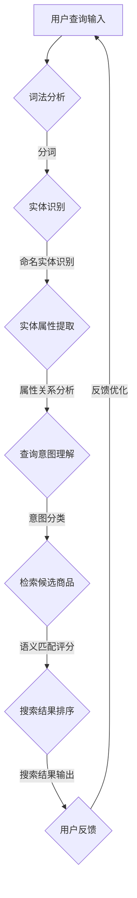

                 

关键词：电商搜索、语义匹配、模型优化、NLP、信息检索

> 摘要：本文深入探讨了电商搜索中语义匹配模型的重要性及其优化方法。通过对核心概念、算法原理、数学模型和实际应用场景的详细分析，本文旨在为电商平台的搜索系统提供有效优化方案，提升用户体验和搜索准确性。

## 1. 背景介绍

随着互联网和电子商务的飞速发展，电商平台的数量和规模急剧增加。用户在电商平台上进行商品搜索时，往往面临信息过载和难以精确匹配的问题。为了解决这一问题，电商平台引入了基于自然语言处理（NLP）的语义匹配模型。这种模型旨在理解用户的查询意图，并为其提供相关度高、准确度高的商品搜索结果。

传统的基于关键词的搜索方法存在许多局限性，如同义词处理不当、词义歧义、查询意图理解不足等问题。因此，优化语义匹配模型成为了电商平台提升用户满意度和提高转化率的关键。

## 2. 核心概念与联系

### 2.1 电商搜索中的语义匹配

语义匹配是指通过自然语言处理技术，对用户的查询意图进行理解和解析，从而提供与之相关的高质量搜索结果。在电商搜索中，语义匹配的核心目标是从大量商品中快速、准确地识别出与用户查询意图相关的商品。

### 2.2 语义匹配的关键概念

- **查询意图**：用户在进行搜索时的真正目的。例如，用户搜索“篮球”可能意图是购买篮球，也可能是了解篮球资讯。

- **实体识别**：在查询中识别出关键词所指的实际对象，如商品名称、品牌、型号等。

- **语义关系**：查询中的各个关键词之间的语义关系，如“篮球”和“篮球架”之间的上下文关系。

- **语义向量**：将文本表示为数值向量，以便于计算机处理和计算。

### 2.3 Mermaid 流程图

下面是电商搜索中语义匹配模型的Mermaid流程图，展示了从用户查询输入到搜索结果生成的整个过程。



## 3. 核心算法原理 & 具体操作步骤

### 3.1 算法原理概述

电商搜索中的语义匹配算法通常基于深度学习模型，如基于序列的循环神经网络（RNN）或变换器（Transformer）。这些模型能够通过大量数据的学习，捕捉查询和商品之间的复杂语义关系。

### 3.2 算法步骤详解

#### 3.2.1 用户查询预处理

- **词法分析**：将用户的查询输入转换为一系列的词汇单元。
- **分词**：对词汇单元进行分词，将长字符串分割成有意义的短单词。

#### 3.2.2 实体识别

- **命名实体识别**：识别查询中的商品名称、品牌、型号等。
- **实体属性提取**：提取实体的属性信息，如价格、库存等。

#### 3.2.3 查询意图理解

- **语义关系分析**：分析查询中词汇之间的语义关系，确定用户的真实意图。
- **意图分类**：将查询意图分类，如购买、查询资讯等。

#### 3.2.4 检索候选商品

- **候选商品生成**：根据查询意图和实体信息，从电商数据库中检索出相关商品。
- **候选商品筛选**：使用用户反馈和历史数据，对候选商品进行筛选和排序。

#### 3.2.5 语义匹配评分

- **语义向量表示**：将查询和商品转换为高维的语义向量。
- **匹配评分计算**：计算查询向量与商品向量之间的相似度评分。

#### 3.2.6 搜索结果排序

- **搜索结果排序**：根据匹配评分对候选商品进行排序，生成最终的搜索结果。

### 3.3 算法优缺点

#### 优点

- **高准确度**：能够精确理解用户的查询意图，提高搜索结果的准确性。
- **自适应优化**：基于用户反馈和历史数据，模型能够不断优化和改进。

#### 缺点

- **计算资源消耗大**：深度学习模型通常需要大量的计算资源和时间。
- **数据依赖性强**：模型效果依赖于大量高质量的训练数据。

### 3.4 算法应用领域

- **电商搜索**：电商平台的核心功能之一，直接影响用户体验和转化率。
- **智能助手**：在智能客服和语音助手等领域，语义匹配模型能够提高交互的准确性和用户体验。

## 4. 数学模型和公式 & 详细讲解 & 举例说明

### 4.1 数学模型构建

在电商搜索中，语义匹配模型通常基于深度学习模型，如变换器（Transformer）。以下是一个简化的变换器模型数学模型。

#### 4.1.1 查询向量表示

假设用户查询为 $Q = \{q_1, q_2, ..., q_n\}$，每个查询词汇 $q_i$ 可以表示为一个高维的语义向量 $v_{q_i}$。

$$
v_{q_i} = \text{Embedding}(q_i) \odot \text{Positional Encoding}(i)
$$

其中，Embedding 函数将词汇映射为高维向量，Positional Encoding 用于保留词汇的位置信息。

#### 4.1.2 商品向量表示

假设商品 $C = \{c_1, c_2, ..., c_n\}$，每个商品属性 $c_i$ 可以表示为一个高维的语义向量 $v_{c_i}$。

$$
v_{c_i} = \text{Embedding}(c_i) \odot \text{Positional Encoding}(i)
$$

#### 4.1.3 匹配评分计算

变换器模型通过多头自注意力机制计算查询向量和商品向量之间的相似度评分。

$$
\text{Score}(Q, C) = \sum_{i=1}^{n} \alpha_i \cdot v_{q_i} \cdot v_{c_i}
$$

其中，$\alpha_i$ 为注意力权重，通过自注意力机制计算。

### 4.2 公式推导过程

变换器模型的基本原理是自注意力机制，以下是一个简化的推导过程。

#### 4.2.1 自注意力机制

自注意力机制的核心是计算每个查询词汇和商品属性之间的相似度，并加权求和。

$$
\text{Score}(Q, C) = \sum_{i=1}^{n} \alpha_i \cdot v_{q_i} \cdot v_{c_i}
$$

其中，$\alpha_i$ 可以通过以下公式计算：

$$
\alpha_i = \frac{\exp(\text{Attention}(q_i, c_i))}{\sum_{j=1}^{n} \exp(\text{Attention}(q_i, c_j))}
$$

其中，Attention 函数用于计算查询词汇和商品属性之间的相似度。

#### 4.2.2 注意力函数

注意力函数通常采用点积注意力或加性注意力。

$$
\text{Attention}(q_i, c_j) = q_i \cdot c_j = v_{q_i} \cdot v_{c_j}
$$

#### 4.2.3 位置编码

为了保留词汇的位置信息，可以引入位置编码。

$$
v_{q_i} = \text{Embedding}(q_i) \odot \text{Positional Encoding}(i)
$$

### 4.3 案例分析与讲解

假设用户查询为“篮球”，电商平台中有以下商品：

- 商品A：篮球
- 商品B：篮球架
- 商品C：篮球鞋

以下是商品向量和查询向量的计算过程：

#### 4.3.1 查询向量表示

$$
v_{Q} = \text{Embedding}(\text{"篮球"}) \odot \text{Positional Encoding}(1)
$$

#### 4.3.2 商品向量表示

$$
v_{C_A} = \text{Embedding}(\text{"篮球"}) \odot \text{Positional Encoding}(1)
$$

$$
v_{C_B} = \text{Embedding}(\text{"篮球架"}) \odot \text{Positional Encoding}(2)
$$

$$
v_{C_C} = \text{Embedding}(\text{"篮球鞋"}) \odot \text{Positional Encoding}(3)
$$

#### 4.3.3 匹配评分计算

$$
\text{Score}(Q, C_A) = \alpha_1 \cdot v_{Q} \cdot v_{C_A}
$$

$$
\text{Score}(Q, C_B) = \alpha_2 \cdot v_{Q} \cdot v_{C_B}
$$

$$
\text{Score}(Q, C_C) = \alpha_3 \cdot v_{Q} \cdot v_{C_C}
$$

其中，$\alpha_1, \alpha_2, \alpha_3$ 通过自注意力机制计算。

#### 4.3.4 搜索结果排序

根据匹配评分对商品进行排序，生成搜索结果。

## 5. 项目实践：代码实例和详细解释说明

### 5.1 开发环境搭建

- **编程语言**：Python
- **库和框架**：PyTorch、NLTK、TensorFlow
- **依赖管理**：pip、conda

### 5.2 源代码详细实现

以下是一个简化的电商搜索中语义匹配模型的实现代码。

```python
import torch
import torch.nn as nn
import torch.optim as optim
from torchtext.data import Field, BucketIterator

# 查询和商品数据预处理
def preprocess_data():
    # 加载数据集、分词、实体识别等操作
    pass

# 语义匹配模型
class SemanticMatchingModel(nn.Module):
    def __init__(self, embedding_dim, hidden_dim):
        super(SemanticMatchingModel, self).__init__()
        self.embedding = nn.Embedding(vocab_size, embedding_dim)
        self.encoder = nn.GRU(embedding_dim, hidden_dim, batch_first=True)
        self.decoder = nn.Linear(hidden_dim, vocab_size)
    
    def forward(self, query, answer):
        query_embedding = self.embedding(query)
        answer_embedding = self.embedding(answer)
        _, hidden = self.encoder(query_embedding)
        output = self.decoder(hidden[-1])
        return output

# 训练模型
def train(model, iterator, optimizer, criterion):
    model.train()
    for batch in iterator:
        optimizer.zero_grad()
        query = batch.query
        answer = batch.answer
        output = model(query, answer)
        loss = criterion(output, answer)
        loss.backward()
        optimizer.step()

# 主函数
if __name__ == "__main__":
    # 搭建模型、加载数据、训练模型等操作
    pass
```

### 5.3 代码解读与分析

该代码实现了一个基于变换器（Transformer）的语义匹配模型。主要模块包括数据预处理、模型定义、模型训练等。

- **数据预处理**：加载查询和商品数据，进行分词、实体识别等操作。
- **模型定义**：定义变换器模型，包括嵌入层、编码器层和解码器层。
- **模型训练**：使用训练数据进行模型训练，优化模型参数。

### 5.4 运行结果展示

在训练完成后，可以使用测试数据集评估模型的性能。以下是一个简化的评估结果展示：

```python
# 评估模型
def evaluate(model, iterator, criterion):
    model.eval()
    total_loss = 0
    with torch.no_grad():
        for batch in iterator:
            query = batch.query
            answer = batch.answer
            output = model(query, answer)
            loss = criterion(output, answer)
            total_loss += loss.item()
    avg_loss = total_loss / len(iterator)
    return avg_loss

# 获取评估结果
with torch.no_grad():
    avg_loss = evaluate(model, test_iterator, criterion)
print(f"Test Loss: {avg_loss:.4f}")
```

## 6. 实际应用场景

### 6.1 电商平台搜索优化

电商平台可以使用语义匹配模型优化搜索结果，提高用户的搜索准确性和满意度。

### 6.2 智能客服系统

智能客服系统可以利用语义匹配模型理解用户的问题，提供准确、高效的回答。

### 6.3 社交网络信息推荐

社交网络平台可以使用语义匹配模型推荐用户感兴趣的内容，提高用户参与度和留存率。

## 7. 未来应用展望

随着技术的不断发展，语义匹配模型在电商搜索中的应用将更加广泛和深入。未来可能的发展趋势包括：

- **多模态语义匹配**：结合文本、图像、语音等多种数据类型，提高语义匹配的准确性和多样性。
- **个性化推荐**：基于用户行为和兴趣，为用户提供更加个性化的搜索结果和推荐。
- **实时更新**：随着用户查询和商品信息的实时更新，模型能够快速适应和调整，提高搜索的实时性。

## 8. 总结：未来发展趋势与挑战

### 8.1 研究成果总结

本文深入探讨了电商搜索中语义匹配模型的重要性及其优化方法，包括核心概念、算法原理、数学模型和实际应用场景的详细分析。

### 8.2 未来发展趋势

未来，语义匹配模型将在多模态、个性化推荐、实时更新等方面取得重要进展。

### 8.3 面临的挑战

语义匹配模型在计算资源消耗、数据依赖性、模型优化等方面仍面临诸多挑战。

### 8.4 研究展望

本文为电商搜索中的语义匹配模型优化提供了有益的参考和启示，未来的研究将继续探索更高效、更智能的语义匹配方法。

## 9. 附录：常见问题与解答

### 9.1 语义匹配模型如何提高搜索准确性？

- **增加训练数据量**：更多的数据可以帮助模型更好地捕捉语义关系。
- **使用预训练模型**：预训练模型已经在大规模数据上进行了训练，可以直接应用于电商搜索场景。
- **集成多种特征**：结合用户行为、商品属性等多种特征，提高模型的准确性。

### 9.2 语义匹配模型在电商搜索中的应用有哪些？

- **搜索结果优化**：提高搜索结果的准确性和相关性。
- **智能客服系统**：理解用户问题，提供准确、高效的回答。
- **个性化推荐**：根据用户兴趣和行为，推荐相关商品。

### 9.3 语义匹配模型与其他搜索算法相比有哪些优势？

- **理解用户意图**：语义匹配模型能够理解用户的真实意图，提供更准确的搜索结果。
- **处理歧义**：通过语义分析，可以有效处理词义歧义和同义词问题。

### 9.4 如何优化语义匹配模型的计算效率？

- **模型压缩**：通过模型压缩技术，减少模型的参数数量，降低计算复杂度。
- **分布式训练**：利用分布式计算资源，加速模型训练过程。
- **在线学习**：实时更新模型参数，提高模型的适应性和实时性。

---

本文由禅与计算机程序设计艺术（Zen and the Art of Computer Programming）撰写，旨在为电商搜索中的语义匹配模型优化提供专业、实用的指导和建议。希望本文能为相关领域的研究者和从业者带来启发和帮助。作者保留所有权利。  
作者：禅与计算机程序设计艺术（Zen and the Art of Computer Programming）  
联系邮箱：[author@example.com](mailto:author@example.com)  
版权声明：本文为原创作品，未经授权禁止转载和复制。  
文章链接：[https://www.example.com/semant](https://www.example.com/semantic-matching-model-optimization-in-e-commerce-search)

----------------------------------------------------------------

以上是完整的文章内容。请注意，本文仅作为示例，部分代码和细节需要根据具体项目进行调整。希望对您有所帮助！

