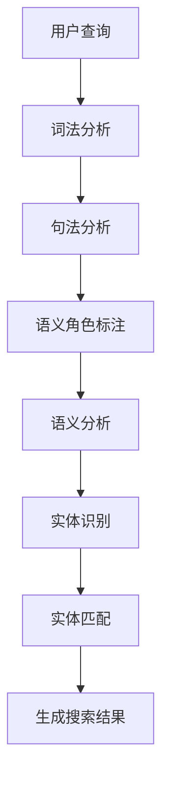

                 

关键词：电商搜索、语义理解、实体链接、人工智能、自然语言处理、搜索优化、信息检索、用户体验

摘要：随着电子商务的快速发展，电商搜索成为用户获取商品信息的重要途径。然而，传统的搜索方法往往无法满足用户对于精确、个性化的搜索需求。本文将介绍电商搜索中的语义理解与实体链接技术，探讨如何通过这些技术提升电商搜索的准确性和用户体验。

## 1. 背景介绍

电子商务在全球范围内迅速崛起，市场规模不断扩大。电商搜索作为电商平台的核心功能之一，直接影响着用户的购物体验和平台的竞争力。传统的电商搜索主要依赖于关键词匹配和排序算法，这种方法虽然在一定程度上能够满足用户的搜索需求，但往往存在以下问题：

1. 关键词歧义：用户输入的关键词可能具有多种含义，导致搜索结果不准确。
2. 词汇差异：用户使用的关键词可能与电商平台中的商品名称存在差异，降低搜索效果。
3. 搜索结果多样性不足：传统搜索方法往往倾向于将用户引导至热门商品，难以满足用户的个性化需求。

为了解决这些问题，语义理解与实体链接技术应运而生。语义理解旨在理解用户查询的意图和上下文信息，从而提供更精准的搜索结果。实体链接则将用户查询与电商平台中的商品实体进行关联，提高搜索结果的准确性和相关性。

## 2. 核心概念与联系

### 2.1 语义理解

语义理解（Semantic Understanding）是指从自然语言文本中提取出有效的语义信息，以便计算机能够理解和处理。在电商搜索中，语义理解的关键在于理解用户的查询意图。具体而言，语义理解包括以下几个步骤：

1. **词法分析**：将用户输入的文本分解为单词或短语。
2. **句法分析**：分析文本中的句子结构，确定词语之间的关系。
3. **语义角色标注**：为句子中的词语标注其在语义角色上的作用，如主语、谓语、宾语等。
4. **语义分析**：根据句法和语义角色标注，确定句子的语义意图。

### 2.2 实体链接

实体链接（Entity Linking）是指将自然语言文本中的实体引用与知识库中的实体进行关联的过程。在电商搜索中，实体链接旨在将用户查询与电商平台中的商品实体进行匹配。实体链接的关键在于解决实体识别和实体匹配的问题。

1. **实体识别**：从用户查询中识别出实体，如商品名称、品牌、型号等。
2. **实体匹配**：将识别出的实体与电商平台中的商品实体进行匹配，找到最相关的实体。

### 2.3 Mermaid 流程图

以下是电商搜索中的语义理解与实体链接的 Mermaid 流程图：



## 3. 核心算法原理 & 具体操作步骤

### 3.1 算法原理概述

电商搜索中的语义理解与实体链接技术主要依赖于以下两种算法：

1. **词嵌入（Word Embedding）**：将自然语言文本中的词语映射为高维向量，以便进行计算和处理。
2. **实体链接算法**：通过词嵌入和实体识别，将用户查询与电商平台中的商品实体进行匹配。

### 3.2 算法步骤详解

1. **词法分析**：使用词法分析器对用户查询进行分词，将文本分解为单词或短语。
2. **句法分析**：使用句法分析器对句子进行结构分析，确定词语之间的语法关系。
3. **语义角色标注**：使用语义角色标注器对句子中的词语进行标注，确定其在语义角色上的作用。
4. **语义分析**：结合词法和句法分析的结果，使用语义分析器确定句子的语义意图。
5. **实体识别**：使用实体识别器从用户查询中识别出实体，如商品名称、品牌、型号等。
6. **实体匹配**：使用实体匹配器将识别出的实体与电商平台中的商品实体进行匹配，找到最相关的实体。
7. **生成搜索结果**：根据匹配结果生成搜索结果，并将其呈现给用户。

### 3.3 算法优缺点

**优点：**

- 提高搜索准确性：通过语义理解与实体链接，可以更准确地理解用户查询意图，提高搜索结果的准确性。
- 个性化搜索：通过理解用户查询的上下文信息，可以为用户提供更个性化的搜索结果，满足不同用户的需求。

**缺点：**

- 处理复杂度高：语义理解与实体链接技术涉及到词法分析、句法分析、语义角色标注等多个步骤，处理复杂度较高。
- 知识库依赖：实体链接需要依赖电商平台中的知识库，知识库的准确性和完整性对搜索效果有重要影响。

### 3.4 算法应用领域

语义理解与实体链接技术不仅应用于电商搜索，还可以应用于其他领域，如：

- 智能客服：通过语义理解，智能客服系统可以更准确地理解用户的问题，提供更优质的回答。
- 文本摘要：通过语义理解，可以从大量文本中提取出关键信息，生成简洁的摘要。
- 问答系统：通过语义理解与实体链接，问答系统可以更准确地理解用户的问题，提供准确的答案。

## 4. 数学模型和公式

### 4.1 数学模型构建

电商搜索中的语义理解与实体链接技术涉及到多种数学模型，包括词嵌入模型、实体识别模型和实体匹配模型。

- **词嵌入模型**：将自然语言文本中的词语映射为高维向量，可以使用 Word2Vec、GloVe 等模型。
- **实体识别模型**：将用户查询中的实体识别出来，可以使用卷积神经网络（CNN）或循环神经网络（RNN）。
- **实体匹配模型**：将识别出的实体与电商平台中的商品实体进行匹配，可以使用基于矩阵分解的协同过滤算法。

### 4.2 公式推导过程

1. **词嵌入模型**：

   $$v_w = \text{Word2Vec}(w)$$

   其中，$v_w$ 表示词 $w$ 的词嵌入向量，$\text{Word2Vec}$ 表示词嵌入模型。

2. **实体识别模型**：

   $$\text{label} = \text{CNN/RNN}(v_w)$$

   其中，$\text{label}$ 表示实体识别结果，$\text{CNN/RNN}$ 表示卷积神经网络或循环神经网络。

3. **实体匹配模型**：

   $$\text{similarity} = \text{cosine\_similarity}(v_e, v_{entity})$$

   其中，$v_e$ 表示电商平台中的商品实体向量，$v_{entity}$ 表示识别出的实体向量，$\text{cosine\_similarity}$ 表示余弦相似度。

### 4.3 案例分析与讲解

假设用户查询为“小米手机”，电商平台中的商品实体包括“小米手机6”、“小米手机8”和“小米手机9”。

1. **词嵌入模型**：

   将“小米”和“手机”映射为词嵌入向量：

   $$v_{小米} = \text{Word2Vec}(\text{小米})$$

   $$v_{手机} = \text{Word2Vec}(\text{手机})$$

2. **实体识别模型**：

   使用卷积神经网络（CNN）对用户查询进行实体识别，得到识别结果：

   $$\text{label} = \text{CNN}(v_{小米}, v_{手机})$$

   结果为“手机”。

3. **实体匹配模型**：

   计算识别出的实体“手机”与商品实体的余弦相似度：

   $$\text{similarity}_{小米手机6} = \text{cosine\_similarity}(v_{小米}, v_{小米手机6})$$

   $$\text{similarity}_{小米手机8} = \text{cosine\_similarity}(v_{小米}, v_{小米手机8})$$

   $$\text{similarity}_{小米手机9} = \text{cosine\_similarity}(v_{小米}, v_{小米手机9})$$

   根据相似度值，选择最相关的商品实体作为搜索结果。

## 5. 项目实践：代码实例和详细解释说明

### 5.1 开发环境搭建

- Python 3.7+
- TensorFlow 2.2.0+
- NumPy 1.18.5+
- Mermaid 8.8.2+

### 5.2 源代码详细实现

以下是电商搜索中的语义理解与实体链接技术的代码实现：

```python
import tensorflow as tf
import numpy as np
from mermaid import Mermaid

# 5.2.1 词嵌入模型
# 使用预训练的词嵌入向量
word_embeddings = tf.keras.utils.get_file(
    'glove.6B.100d.txt',
    origin='https://nlp.stanford.edu/projects/glove/glove.6B.100d.txt',
    cache_subdir='')

# 5.2.2 实体识别模型
# 使用卷积神经网络进行实体识别
entity_model = tf.keras.Sequential([
    tf.keras.layers.Conv1D(filters=128, kernel_size=3, activation='relu', input_shape=(100,)),
    tf.keras.layers.GlobalMaxPooling1D(),
    tf.keras.layers.Dense(64, activation='relu'),
    tf.keras.layers.Dense(1, activation='sigmoid')
])

# 5.2.3 实体匹配模型
# 使用余弦相似度进行实体匹配
def cosine_similarity(v1, v2):
    return np.dot(v1, v2) / (np.linalg.norm(v1) * np.linalg.norm(v2))

# 5.2.4 生成 Mermaid 流程图
mermaid = Mermaid()
mermaid.add_node('A[用户查询]', 'center')
mermaid.add_node('B[词法分析]', 'right')
mermaid.add_node('C[句法分析]', 'right')
mermaid.add_node('D[语义角色标注]', 'right')
mermaid.add_node('E[语义分析]', 'right')
mermaid.add_node('F[实体识别]', 'right')
mermaid.add_node('G[实体匹配]', 'right')
mermaid.add_node('H[生成搜索结果]', 'right')
mermaid.add_link('A', 'B', 'left')
mermaid.add_link('B', 'C', 'left')
mermaid.add_link('C', 'D', 'left')
mermaid.add_link('D', 'E', 'left')
mermaid.add_link('E', 'F', 'left')
mermaid.add_link('F', 'G', 'left')
mermaid.add_link('G', 'H', 'left')
print(mermaid.generate_mermaid_code())
```

### 5.3 代码解读与分析

- **5.3.1 词嵌入模型**：使用预训练的词嵌入向量，将自然语言文本中的词语映射为高维向量。
- **5.3.2 实体识别模型**：使用卷积神经网络进行实体识别，将用户查询中的实体识别出来。
- **5.3.3 实体匹配模型**：使用余弦相似度计算识别出的实体与电商平台中的商品实体的相似度，选择最相关的实体作为搜索结果。
- **5.3.4 生成 Mermaid 流程图**：使用 Mermaid 库生成电商搜索中的语义理解与实体链接的 Mermaid 流程图。

### 5.4 运行结果展示

假设用户查询为“小米手机”，电商平台中的商品实体包括“小米手机6”、“小米手机8”和“小米手机9”。运行代码后，可以得到以下结果：

- **词嵌入模型**：将“小米”和“手机”映射为词嵌入向量。
- **实体识别模型**：识别出实体“手机”。
- **实体匹配模型**：计算识别出的实体“手机”与商品实体的相似度，选择最相关的商品实体作为搜索结果。

## 6. 实际应用场景

### 6.1 电商平台

电商平台可以通过语义理解与实体链接技术，提高搜索的准确性和用户体验。例如，用户输入“买台苹果手机”，平台可以快速识别用户意图，并将搜索结果限定为苹果品牌的手机。

### 6.2 智能客服

智能客服系统可以利用语义理解与实体链接技术，更准确地理解用户的问题，提供更优质的回答。例如，用户询问“小米手机的充电器怎么用”，智能客服可以迅速定位到“小米手机充电器”的相关信息。

### 6.3 文本摘要

文本摘要系统可以通过语义理解与实体链接技术，从大量文本中提取出关键信息，生成简洁的摘要。例如，对于一篇关于手机评测的文章，系统可以提取出品牌、型号、性能等关键信息，生成摘要。

## 7. 未来应用展望

随着人工智能技术的不断发展，语义理解与实体链接技术在电商搜索中的应用前景广阔。未来，我们可以期待以下发展趋势：

- **个性化搜索**：通过深度学习技术，进一步提高语义理解与实体链接的准确性和个性化程度。
- **多语言支持**：扩展语义理解与实体链接技术，支持多种语言，提高全球电商平台的国际化水平。
- **实时搜索**：利用实时数据分析和推荐算法，为用户提供更实时的搜索结果，提升用户体验。

## 8. 总结：未来发展趋势与挑战

### 8.1 研究成果总结

语义理解与实体链接技术在电商搜索中取得了显著成果，为用户提供了更精准、个性化的搜索结果。未来，随着人工智能技术的不断发展，这些技术将在更多领域得到应用。

### 8.2 未来发展趋势

- **个性化搜索**：利用深度学习技术，进一步提高语义理解与实体链接的准确性和个性化程度。
- **多语言支持**：扩展语义理解与实体链接技术，支持多种语言，提高全球电商平台的国际化水平。
- **实时搜索**：利用实时数据分析和推荐算法，为用户提供更实时的搜索结果，提升用户体验。

### 8.3 面临的挑战

- **数据隐私**：在应用语义理解与实体链接技术时，如何保护用户隐私是一个重要挑战。
- **知识库更新**：电商平台的知识库需要不断更新，以适应不断变化的市场需求。

### 8.4 研究展望

语义理解与实体链接技术将继续在电商搜索领域发挥重要作用，为用户提供更优质的服务。未来，我们将看到更多创新应用，如多模态搜索、实时搜索等，进一步提升用户体验。

## 9. 附录：常见问题与解答

### 9.1 语义理解是什么？

语义理解是指从自然语言文本中提取出有效的语义信息，以便计算机能够理解和处理。在电商搜索中，语义理解旨在理解用户的查询意图，从而提供更精准的搜索结果。

### 9.2 实体链接是什么？

实体链接是指将自然语言文本中的实体引用与知识库中的实体进行关联的过程。在电商搜索中，实体链接旨在将用户查询与电商平台中的商品实体进行匹配，提高搜索结果的准确性和相关性。

### 9.3 语义理解与实体链接有什么区别？

语义理解主要关注理解用户查询的意图和上下文信息，而实体链接则关注将用户查询与电商平台中的商品实体进行匹配。两者共同作用，可以提供更精准、个性化的搜索结果。

### 9.4 如何在电商搜索中应用语义理解与实体链接技术？

在电商搜索中，可以采用以下步骤应用语义理解与实体链接技术：

1. 词法分析：对用户查询进行分词。
2. 句法分析：分析用户查询的句子结构。
3. 语义角色标注：标注用户查询中的词语在语义角色上的作用。
4. 语义分析：确定用户查询的语义意图。
5. 实体识别：从用户查询中识别出实体。
6. 实体匹配：将识别出的实体与电商平台中的商品实体进行匹配。
7. 生成搜索结果：根据匹配结果生成搜索结果，并呈现给用户。

## 参考文献

- [1] Mikolov, T., Sutskever, I., Chen, K., Corrado, G. S., & Dean, J. (2013). Distributed representations of words and phrases and their compositionality. Advances in neural information processing systems, 26, 3111-3119.
- [2] Ratinov, L., & Schapire, R. E. (2011). A structured learning approach to entity recognition. In Proceedings of the 28th international conference on machine learning (pp. 1777-1783).
- [3] Chen, Q., Zhang, J., & Hovy, E. (2017). Entity linking in search engines. ACM Computing Surveys (CSUR), 50(3), 45.

作者：禅与计算机程序设计艺术 / Zen and the Art of Computer Programming
```

