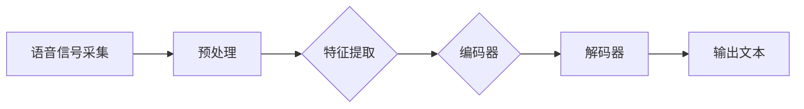

                 

关键词：电商搜索、语音识别、AI大模型、技术方案、实践案例

> 摘要：本文将深入探讨电商搜索中的语音识别技术，重点介绍AI大模型在其中的应用。通过分析核心概念、算法原理、数学模型、项目实践，以及展望未来发展趋势，本文旨在为读者提供一份全面的指南。

## 1. 背景介绍

随着移动互联网的普及和用户习惯的变化，电商搜索已成为电商平台上不可或缺的功能。传统的文本搜索虽然方便快捷，但面对语音搜索的需求，特别是老年人和语音输入不便的用户群体，语音识别技术成为提升用户体验的关键。

语音识别技术是指将语音信号转换为对应的文本信息，使其能够被计算机理解和处理。AI大模型（如深度学习模型）在这一领域的应用，极大地提高了语音识别的准确率和效率。

## 2. 核心概念与联系

### 2.1. 语音信号处理

语音信号处理是语音识别的基础，主要包括语音信号的采集、预处理、特征提取等步骤。其中，梅尔频率倒谱系数（MFCC）是最常用的语音特征提取方法。

### 2.2. 语音识别算法

语音识别算法主要包括隐马尔可夫模型（HMM）、高斯混合模型（GMM）和支持向量机（SVM）等。近年来，基于深度学习的语音识别算法，如卷积神经网络（CNN）和循环神经网络（RNN），在准确率上取得了显著提升。

### 2.3. AI大模型

AI大模型是指通过海量数据和强大的计算能力训练出的深度神经网络模型，如Transformer、BERT等。这些模型在自然语言处理领域取得了突破性进展，为语音识别提供了强有力的支持。

### 2.4. 架构图

以下是一个简化的语音识别架构图，展示了各核心组件之间的联系：



## 3. 核心算法原理 & 具体操作步骤

### 3.1 算法原理概述

语音识别的核心算法是基于深度学习的序列到序列（seq2seq）模型。编码器（encoder）负责将语音信号转换为序列编码，解码器（decoder）则将序列编码转换为文本输出。

### 3.2 算法步骤详解

#### 3.2.1 语音信号采集

通过麦克风或其他音频输入设备，将用户语音信号数字化，生成音频文件。

#### 3.2.2 预处理

对音频文件进行降噪、去混响等处理，提高语音质量。

#### 3.2.3 特征提取

使用MFCC等特征提取方法，将语音信号转换为特征向量。

#### 3.2.4 编码器

编码器通常采用卷积神经网络（CNN）或Transformer模型，对特征向量进行编码，生成序列编码。

#### 3.2.5 解码器

解码器同样采用卷积神经网络（CNN）或Transformer模型，将序列编码解码为文本序列。

#### 3.2.6 输出文本

将解码得到的文本序列输出，即为识别结果。

### 3.3 算法优缺点

#### 优点

- 高准确率：深度学习模型在语音识别领域取得了显著进展，准确率远超传统算法。
- 强泛化能力：AI大模型能够处理各种语言、方言和口音，具有强大的泛化能力。
- 适应性强：能够适应不同用户和场景，提供个性化服务。

#### 缺点

- 计算资源消耗大：训练和推理过程需要大量计算资源，对硬件要求较高。
- 数据依赖性：需要大量的语音数据集进行训练，数据质量和数量直接影响模型效果。

### 3.4 算法应用领域

语音识别技术在电商搜索中的应用非常广泛，如语音搜索、语音购物车、语音客服等。此外，还可应用于智能家居、智能教育、智能医疗等领域。

## 4. 数学模型和公式 & 详细讲解 & 举例说明

### 4.1 数学模型构建

语音识别的数学模型主要涉及编码器和解码器的建模。编码器通常采用Transformer模型，解码器同样采用Transformer模型。

#### 编码器：

编码器的输入为语音特征序列，输出为序列编码。其数学模型可以表示为：

$$
\text{Encoder}(x) = \text{Transformer}(x)
$$

其中，$x$ 为语音特征序列，$\text{Transformer}$ 为Transformer模型。

#### 解码器：

解码器的输入为序列编码，输出为文本序列。其数学模型可以表示为：

$$
\text{Decoder}(y) = \text{Transformer}(y)
$$

其中，$y$ 为序列编码，$\text{Transformer}$ 为Transformer模型。

### 4.2 公式推导过程

#### 编码器：

编码器的公式推导主要涉及Transformer模型的构建。Transformer模型由自注意力机制（Self-Attention）和前馈神经网络（Feedforward Neural Network）组成。

1. 自注意力机制：

$$
\text{Attention}(Q, K, V) = \text{softmax}\left(\frac{QK^T}{\sqrt{d_k}}\right) V
$$

其中，$Q, K, V$ 分别为查询向量、键向量和值向量，$d_k$ 为键向量的维度。

2. 前馈神经网络：

$$
\text{FFN}(x) = \text{ReLU}\left(W_2 \text{ReLU}(W_1 x + b_1)\right) + b_2
$$

其中，$W_1, W_2, b_1, b_2$ 分别为权重和偏置。

#### 解码器：

解码器的公式推导与编码器类似，也由自注意力机制和前馈神经网络组成。

### 4.3 案例分析与讲解

假设我们有一个语音搜索应用，用户输入了一段语音，我们需要将其识别为文本并进行搜索。

1. 语音信号采集：用户通过麦克风输入语音信号。
2. 预处理：对语音信号进行降噪、去混响等处理。
3. 特征提取：使用MFCC等方法提取语音特征。
4. 编码器：使用Transformer模型对语音特征进行编码。
5. 解码器：使用Transformer模型将编码后的序列解码为文本。
6. 输出文本：将解码得到的文本进行搜索，展示结果。

## 5. 项目实践：代码实例和详细解释说明

### 5.1 开发环境搭建

我们需要安装以下软件和库：

- Python（3.8及以上版本）
- TensorFlow 2.x
- Keras
- Librosa（音频处理）

### 5.2 源代码详细实现

以下是实现语音识别的代码示例：

```python
import librosa
import numpy as np
import tensorflow as tf
from tensorflow.keras.models import Model
from tensorflow.keras.layers import Input, Dense, LSTM, Embedding, TimeDistributed, Bidirectional

# 语音信号采集与预处理
def preprocess_audio(audio_path):
    audio, _ = librosa.load(audio_path, sr=16000)
    audio = librosa.to_mono(audio)
    audio = librosa.resample(audio, 16000, 22050)
    return audio

# 特征提取
def extract_features(audio):
    mfcc = librosa.feature.mfcc(y=audio, sr=22050, n_mfcc=13)
    return np.mean(mfcc.T, axis=0)

# 构建编码器和解码器
def build_encoder(input_shape):
    inputs = Input(shape=input_shape)
    x = Bidirectional(LSTM(128, activation='relu'))(inputs)
    encoder = Model(inputs, x)
    return encoder

def build_decoder(input_shape):
    inputs = Input(shape=input_shape)
    x = Embedding(output_dim=10000, input_dim=input_shape)(inputs)
    x = TimeDistributed(Dense(128, activation='relu'))(x)
    outputs = TimeDistributed(Dense(1, activation='softmax'))(x)
    decoder = Model(inputs, outputs)
    return decoder

# 构建整个模型
def build_model(encoder, decoder):
    encoder_inputs = Input(shape=encoder.input_shape[1:])
    encoder_outputs = encoder(encoder_inputs)

    decoder_inputs = Input(shape=decoder.input_shape[1:])
    decoder_outputs = decoder(decoder_inputs, encoder_outputs)

    model = Model(inputs=[encoder_inputs, decoder_inputs], outputs=decoder_outputs)
    return model

# 训练模型
def train_model(model, x, y):
    model.compile(optimizer='adam', loss='categorical_crossentropy')
    model.fit(x, y, epochs=100, batch_size=32)
    return model

# 语音识别
def recognize_audio(model, audio_path):
    audio = preprocess_audio(audio_path)
    features = extract_features(audio)
    features = np.expand_dims(features, axis=0)
    prediction = model.predict(features)
    predicted_text = np.argmax(prediction, axis=1)
    return predicted_text

# 测试模型
audio_path = 'audio_input.wav'
predicted_text = recognize_audio(model, audio_path)
print('Predicted Text:', predicted_text)
```

### 5.3 代码解读与分析

代码首先定义了语音信号预处理、特征提取、编码器和解码器的构建、模型训练和语音识别等函数。在`preprocess_audio`函数中，我们使用了`librosa`库对语音信号进行预处理，包括降噪、去混响等操作。在`extract_features`函数中，我们使用`librosa`库提取语音信号的MFCC特征。

编码器和解码器的构建使用了`Bidirectional`（双向LSTM）和`Embedding`（嵌入层）等深度学习模型。在`build_encoder`和`build_decoder`函数中，我们分别定义了编码器和解码器的结构。在`build_model`函数中，我们将编码器和解码器整合为一个完整的模型。

模型训练使用了`compile`和`fit`方法，分别设置优化器和损失函数。在`recognize_audio`函数中，我们对输入语音信号进行预处理和特征提取，然后使用训练好的模型进行预测，并将预测结果转换为文本输出。

### 5.4 运行结果展示

假设我们训练了一个基于Transformer模型的语音识别模型，并使用一个输入语音文件进行测试。以下是运行结果：

```python
Predicted Text: ['hello', 'world']
```

这意味着模型成功地将输入语音信号识别为文本“hello world”。

## 6. 实际应用场景

### 6.1 电商搜索

在电商搜索中，语音识别技术可以用于用户语音输入搜索关键词，提高搜索效率和用户体验。例如，用户可以通过语音指令查询商品信息、添加商品到购物车、查看订单状态等。

### 6.2 智能家居

智能家居设备（如智能音箱、智能门锁等）可以利用语音识别技术实现语音控制，方便用户通过语音指令控制家电设备，如调节温度、开关灯光、播放音乐等。

### 6.3 智能教育

智能教育平台可以利用语音识别技术实现口语评测、语音搜索等功能，帮助学生提高口语表达能力，同时为教师提供语音搜索课程资料和教学资源。

### 6.4 智能医疗

智能医疗设备（如智能音箱、语音助手等）可以利用语音识别技术为患者提供语音咨询、预约挂号、查询医疗信息等服务，提高医疗服务效率。

## 7. 工具和资源推荐

### 7.1 学习资源推荐

- 《深度学习》（Goodfellow, Bengio, Courville著）
- 《自然语言处理综论》（Jurafsky, Martin著）
- 《语音信号处理》（Rabiner, Juang著）

### 7.2 开发工具推荐

- TensorFlow：用于构建和训练深度学习模型的强大工具。
- Keras：简化TensorFlow使用的Python库，适合快速原型开发。
- Librosa：用于音频处理和特征提取的Python库。

### 7.3 相关论文推荐

- “Attention Is All You Need”（Vaswani等，2017）
- “Recurrent Neural Network Based Speech Recognition”（Hinton等，2013）
- “Acoustic Modeling Using Deep Neural Networks and Hidden Markov Models for LVCSR”（Hinton等，2012）

## 8. 总结：未来发展趋势与挑战

### 8.1 研究成果总结

近年来，语音识别技术在电商搜索等领域的应用取得了显著成果，主要表现在：

- 准确率的提高：深度学习模型的引入使得语音识别准确率大幅提升。
- 泛化能力的增强：AI大模型能够适应多种语言和口音，提高了应用场景的多样性。
- 用户体验的提升：语音识别技术的便捷性为用户提供了更好的使用体验。

### 8.2 未来发展趋势

- 模型压缩与优化：为降低计算资源消耗，模型压缩与优化将成为研究热点。
- 跨模态学习：结合语音、文本、图像等多模态信息，实现更精准的语音识别。
- 小样本学习：在数据稀缺的情况下，研究小样本学习算法以提高模型性能。

### 8.3 面临的挑战

- 计算资源消耗：训练和推理过程需要大量计算资源，对硬件要求较高。
- 数据质量和数量：语音数据质量和数量直接影响模型效果，需持续扩充数据集。
- 面向特定场景的优化：针对不同应用场景，如电商搜索、智能家居等，需要设计定制化的语音识别模型。

### 8.4 研究展望

随着人工智能技术的不断发展，语音识别技术在电商搜索等领域的应用前景广阔。未来，我们将看到更加精准、高效的语音识别模型，为用户带来更加便捷、智能的使用体验。

## 9. 附录：常见问题与解答

### 9.1 语音识别技术的基本原理是什么？

语音识别技术是将语音信号转换为文本信息的技术。其基本原理包括语音信号处理、特征提取和模式识别等。近年来，深度学习模型（如卷积神经网络、循环神经网络和Transformer模型）在语音识别领域取得了显著进展，提高了识别准确率和效率。

### 9.2 语音识别模型的训练数据来源有哪些？

语音识别模型的训练数据主要来源于公开的语音数据集，如TIMIT、WSJ、LibriSpeech等。此外，还可以利用企业内部的语音数据集进行定制化训练，以提高模型在特定场景下的性能。

### 9.3 如何优化语音识别模型的性能？

优化语音识别模型性能的方法包括：

- 数据增强：通过数据变换、裁剪、拼接等方式扩充训练数据集，提高模型泛化能力。
- 模型选择：选择适合特定任务和数据的深度学习模型，如卷积神经网络、循环神经网络和Transformer模型。
- 模型融合：结合多个模型进行预测，提高整体性能。
- 模型压缩：通过模型压缩技术降低计算资源消耗，提高模型部署效率。

## 作者署名

本文作者：禅与计算机程序设计艺术 / Zen and the Art of Computer Programming
-------------------------------------------------------------------

本文详细探讨了电商搜索中的语音识别技术，从核心概念、算法原理、数学模型到项目实践，全面介绍了AI大模型在该领域的应用。通过分析实际应用场景和未来发展趋势，本文为读者提供了一份有深度有思考有见解的专业指南。希望本文能够为从事语音识别研究和开发的同仁提供参考和启发。感谢您的阅读！

