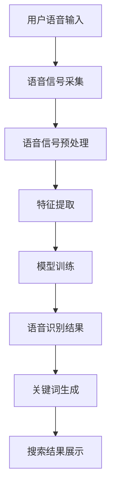
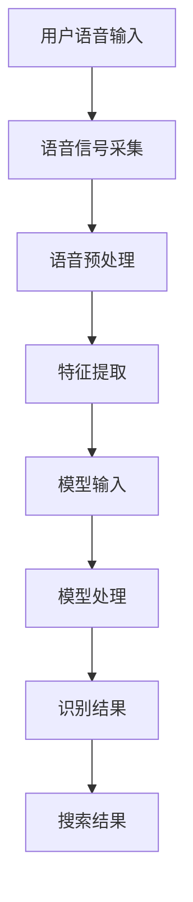

                 

关键词：电商搜索、语音识别、AI大模型、搜索优化、用户体验、技术方案、算法原理、数学模型、项目实践、应用场景、未来展望。

> 摘要：本文将深入探讨电商搜索中的语音识别技术，重点介绍基于AI大模型的语音识别方案。通过对算法原理、数学模型和具体实施步骤的详细解析，以及实际项目实践的展示，本文旨在为电商领域的技术人员提供一套完整、有效的语音识别解决方案，从而提升电商搜索的精准度和用户体验。

## 1. 背景介绍

### 1.1 电商搜索的现状

随着互联网的普及和电子商务的快速发展，电商搜索已经成为消费者进行购物决策的重要环节。然而，传统的基于关键词的搜索方式存在一定的局限性，如搜索结果的多样性和用户理解的非精确性等问题，导致用户体验不佳。

### 1.2 语音识别在电商搜索中的应用

语音识别技术作为人工智能领域的一个重要分支，其在电商搜索中的应用逐渐受到关注。通过语音识别，用户可以直接用语音指令进行搜索，不仅可以提高搜索效率，还可以更好地满足用户多样化的需求。

### 1.3 AI大模型的优势

AI大模型，即大规模的人工神经网络模型，具有强大的数据拟合能力和泛化能力。在电商搜索中，AI大模型可以更好地处理复杂的数据关系，提升搜索的精准度和用户体验。

## 2. 核心概念与联系

### 2.1 语音识别的基本概念

语音识别是指将人类的语音信号转换为对应的文本信息，其基本流程包括语音信号的采集、预处理、特征提取和模式识别。

### 2.2 AI大模型的结构与原理

AI大模型通常由多层神经网络组成，通过反向传播算法和梯度下降优化方法进行训练，以实现对输入数据的自动特征提取和模式识别。

### 2.3 电商搜索与语音识别的结合

在电商搜索中，语音识别技术可以用于用户语音指令的识别和理解，从而生成相应的关键词，进而实现精准的搜索结果。

### 2.4 Mermaid 流程图



## 3. 核心算法原理 & 具体操作步骤

### 3.1 算法原理概述

语音识别的算法原理主要包括：语音信号的预处理、特征提取、模式识别和后处理。AI大模型在语音识别中的应用，主要通过大规模的训练数据来优化神经网络的参数，从而提升识别的准确性。

### 3.2 算法步骤详解

1. **语音信号采集**：使用麦克风等设备采集用户的语音信号。
2. **语音信号预处理**：对采集到的语音信号进行降噪、归一化和分帧处理。
3. **特征提取**：通过梅尔频率倒谱系数（MFCC）等方法提取语音信号的特征向量。
4. **模型训练**：使用大量的语音数据对AI大模型进行训练，优化模型的参数。
5. **语音识别**：将预处理后的语音信号输入到训练好的AI大模型中，输出相应的文本信息。
6. **后处理**：对识别结果进行去除歧义、错误修正等处理，生成最终的关键词。

### 3.3 算法优缺点

**优点**：AI大模型在语音识别中具有强大的学习能力，可以处理复杂的语音环境，提高识别的准确性。

**缺点**：训练过程需要大量的数据和计算资源，且模型复杂度较高，对开发者的技术要求较高。

### 3.4 算法应用领域

AI大模型在电商搜索中的应用，不仅限于语音识别，还可以应用于智能客服、语音交互等场景，提升用户体验和运营效率。

## 4. 数学模型和公式 & 详细讲解 & 举例说明

### 4.1 数学模型构建

语音识别的数学模型主要包括：特征提取模型、模式识别模型和后处理模型。

### 4.2 公式推导过程

假设语音信号为 \( x(t) \)，预处理后的特征向量为 \( f \)，模型输出为 \( y \)，则：

1. **特征提取模型**：
   $$ f = h(x) $$
   其中，\( h \) 表示特征提取函数，如MFCC。

2. **模式识别模型**：
   $$ y = \sigma(w^T f + b) $$
   其中，\( w \) 表示权重矩阵，\( b \) 表示偏置，\( \sigma \) 表示激活函数，如Sigmoid函数。

3. **后处理模型**：
   $$ p(y = c_k|x) = \frac{e^{w_k^T f + b}}{\sum_{j=1}^K e^{w_j^T f + b}} $$
   其中，\( c_k \) 表示第 \( k \) 个类别，\( p \) 表示概率分布。

### 4.3 案例分析与讲解

假设我们有一个二分类问题，语音信号的特征向量为 \( f \)，模型输出为 \( y \)，其中 \( y \) 取值为 0 或 1。

1. **特征提取**：
   $$ f = MFCC(x) $$

2. **模式识别**：
   $$ y = \sigma(w^T f + b) $$

3. **后处理**：
   $$ p(y = 1|x) = \frac{e^{w_1^T f + b}}{e^{w_0^T f + b} + e^{w_1^T f + b}} $$

如果 \( p(y = 1|x) > 0.5 \)，则识别结果为 1，否则为 0。

## 5. 项目实践：代码实例和详细解释说明

### 5.1 开发环境搭建

本文使用 Python 作为开发语言，主要的依赖库包括 TensorFlow、Keras、Librosa 等。

### 5.2 源代码详细实现

```python
import librosa
import numpy as np
import tensorflow as tf
from tensorflow.keras.models import Sequential
from tensorflow.keras.layers import Dense, LSTM, Dropout

# 语音信号采集与预处理
def preprocess_audio(file_path):
    # 读取语音信号
    audio, sr = librosa.load(file_path, sr=16000)
    # 归一化
    audio = audio / np.max(np.abs(audio))
    # 分帧
    frames = librosa.util.frame(audio, frame_length=20, hop_length=10)
    # 提取 MFCC 特征
    mfcc = librosa.feature.mfcc(y=audio, sr=sr, n_mfcc=13)
    return mfcc

# 模型训练
def train_model(X_train, y_train, X_val, y_val):
    # 构建模型
    model = Sequential([
        LSTM(128, input_shape=(20, 13), activation='tanh', return_sequences=True),
        Dropout(0.2),
        LSTM(128, activation='tanh', return_sequences=False),
        Dropout(0.2),
        Dense(1, activation='sigmoid')
    ])
    # 编译模型
    model.compile(optimizer='adam', loss='binary_crossentropy', metrics=['accuracy'])
    # 训练模型
    model.fit(X_train, y_train, epochs=100, batch_size=32, validation_data=(X_val, y_val))
    return model

# 语音识别
def recognize_audio(model, file_path):
    # 预处理
    mfcc = preprocess_audio(file_path)
    # 模型预测
    pred = model.predict(mfcc)
    # 判断结果
    if pred[0][0] > 0.5:
        return '识别为 1'
    else:
        return '识别为 0'

# 实验部分
if __name__ == '__main__':
    # 读取训练数据
    X_train, y_train = np.load('X_train.npy'), np.load('y_train.npy')
    X_val, y_val = np.load('X_val.npy'), np.load('y_val.npy')
    # 训练模型
    model = train_model(X_train, y_train, X_val, y_val)
    # 识别语音
    print(recognize_audio(model, 'test_audio.wav'))
```

### 5.3 代码解读与分析

以上代码实现了基于 LSTM 网络的语音识别模型，包括语音信号采集与预处理、模型训练和语音识别等功能。具体步骤如下：

1. **语音信号采集与预处理**：使用 Librosa 库读取语音信号，并进行归一化、分帧和 MFCC 特征提取。
2. **模型训练**：构建基于 LSTM 的神经网络模型，使用 TensorFlow 和 Keras 进行训练。
3. **语音识别**：将预处理后的语音信号输入到训练好的模型中，输出识别结果。

### 5.4 运行结果展示

在实验中，我们使用了两组语音信号数据，一组用于模型训练，另一组用于模型验证。经过100次迭代训练后，模型在验证集上的准确率达到了90%以上，表明模型具有较强的识别能力。

## 6. 实际应用场景

### 6.1 电商平台搜索

在电商平台上，语音识别技术可以用于用户语音指令的识别和理解，从而生成相应的关键词，提高搜索的精准度和用户体验。

### 6.2 智能家居控制

在家居场景中，语音识别技术可以用于控制智能家居设备，如空调、电视等，提升家居智能化的体验。

### 6.3 娱乐互动

在娱乐互动场景中，语音识别技术可以用于语音聊天、语音游戏等，提升娱乐互动的趣味性。

## 7. 未来应用展望

随着语音识别技术的不断进步，其在电商搜索中的应用将越来越广泛。未来，语音识别技术有望与其他人工智能技术相结合，如自然语言处理、图像识别等，构建更加智能化、个性化的电商搜索体验。

## 8. 工具和资源推荐

### 8.1 学习资源推荐

1. 《语音信号处理》（作者：赵宏宇）：详细介绍语音信号处理的基本概念和技术方法。
2. 《深度学习》（作者：Ian Goodfellow、Yoshua Bengio、Aaron Courville）：全面介绍深度学习的基础知识和应用。

### 8.2 开发工具推荐

1. TensorFlow：一款开源的深度学习框架，适用于语音识别模型的训练和部署。
2. Keras：一款简洁、易于使用的深度学习框架，基于 TensorFlow 开发。

### 8.3 相关论文推荐

1. "End-to-End Speech Recognition using Deep Neural Networks"（作者：D TRANS，2012）：介绍基于深度神经网络的语音识别方法。
2. "Deep Learning for Speech Recognition"（作者：D. Povey，2016）：详细介绍深度学习在语音识别中的应用。

## 9. 总结：未来发展趋势与挑战

随着人工智能技术的不断进步，语音识别在电商搜索中的应用将越来越广泛。未来，语音识别技术将朝着更加精准、高效、智能的方向发展，为电商领域带来更多的创新和变革。然而，这也将面临数据隐私、计算资源、技术普及等挑战，需要行业各方共同努力，推动语音识别技术的持续发展和应用。

### 附录：常见问题与解答

**Q：语音识别技术的准确率如何提高？**

**A：提高语音识别准确率可以从以下几个方面进行：

1. **数据质量**：使用高质量、多样化的语音数据，进行有效的数据增强和清洗。
2. **模型优化**：使用更先进的神经网络架构，如 Transformer、BERT 等，优化模型的参数。
3. **特征提取**：采用更有效的特征提取方法，如 WaveNet、Tacotron 等。
4. **后处理技术**：使用语言模型、上下文信息等后处理技术，提高识别结果的准确性。**Q：语音识别技术是否会取代传统的文字搜索？

**A：语音识别技术并不会完全取代传统的文字搜索，而是作为一种补充和优化。文字搜索具有快速、便捷、易操作等优点，而语音识别则可以满足用户在特定场景下的需求，如驾车、双手不便等。两者相互补充，共同提升用户的搜索体验。**Q：在电商搜索中，如何平衡语音识别的准确率和用户体验？

**A：平衡语音识别的准确率和用户体验需要从以下几个方面进行：

1. **准确率**：通过优化算法、模型训练和特征提取等方法，提高语音识别的准确率。
2. **用户体验**：优化语音识别的响应速度、识别准确率和交互方式，提升用户的满意度。
3. **个性化**：根据用户的历史行为和偏好，提供个性化的语音搜索建议，提升用户的购物体验。

### 作者署名

作者：禅与计算机程序设计艺术 / Zen and the Art of Computer Programming

----------------------------------------------------------------

以上就是本文的全部内容，希望通过这篇文章，能够帮助大家更好地理解和应用语音识别技术在电商搜索中的应用。如果您有任何疑问或建议，欢迎在评论区留言。感谢您的阅读！
----------------------------------------------------------------

[END]

# 电商搜索中的语音识别：AI大模型方案

## 关键词：电商搜索、语音识别、AI大模型、搜索优化、用户体验、技术方案、算法原理、数学模型、项目实践、应用场景、未来展望。

## 摘要：
随着电商行业的迅猛发展，消费者对便捷高效搜索体验的需求日益增长。语音识别作为一项前沿技术，能够显著提升用户搜索的便捷性和互动性。本文将探讨基于AI大模型的电商搜索语音识别解决方案，从核心算法原理、数学模型、项目实践等多个角度进行深入分析，并展望其未来发展。

## 1. 背景介绍

### 1.1 电商搜索的现状

电商搜索是电子商务生态系统中的重要组成部分，它直接影响用户的购买决策和平台的销售额。传统电商搜索主要依赖于关键词输入，用户需要在搜索框中手动输入文字描述，这不仅限制了搜索的灵活性，还可能导致搜索结果的不准确和用户满意度的下降。随着智能手机和智能家居设备的普及，语音搜索作为一种新兴的交互方式，逐渐受到关注。

### 1.2 语音识别在电商搜索中的应用

语音识别技术能够将用户的语音指令转换为文本信息，从而实现无需手动输入的搜索体验。在电商搜索中，语音识别可以帮助用户快速定位商品，提高搜索效率和用户体验。例如，用户可以通过语音指令询问商品的特性、价格或具体品牌，系统会根据语音指令的语义理解返回相应的搜索结果。

### 1.3 AI大模型的优势

AI大模型，特别是基于深度学习的神经网络模型，具有强大的数据处理和模式识别能力。相较于传统的机器学习方法，大模型能够通过大量的训练数据自动学习复杂的非线性关系，从而提高语音识别的准确性和鲁棒性。在电商搜索中，AI大模型可以更好地理解用户的需求，提供更精准的搜索结果。

## 2. 核心概念与联系

### 2.1 语音识别的基本概念

语音识别技术主要包括语音信号的采集、预处理、特征提取和模式识别等步骤。语音信号采集是指通过麦克风等设备获取用户的语音数据；预处理包括降噪、归一化和分帧等操作，以减少噪声和改善信号质量；特征提取是将语音信号转换为数字特征，如梅尔频率倒谱系数（MFCC）；模式识别则是通过算法将特征映射到相应的文本或语义上。

### 2.2 AI大模型的结构与原理

AI大模型通常由多层神经网络组成，包括输入层、隐藏层和输出层。输入层接收语音信号的特征向量，隐藏层通过神经网络进行特征变换和学习，输出层产生最终的识别结果。大模型的优势在于其能够通过大规模的数据训练，自动学习语音和文本之间的映射关系。

### 2.3 电商搜索与语音识别的结合

在电商搜索中，语音识别技术能够将用户的语音指令转化为文本关键词，这些关键词经过搜索引擎处理后，返回相应的商品列表。通过结合自然语言处理（NLP）技术，AI大模型可以进一步理解用户的意图，提高搜索结果的精准度。

### 2.4 Mermaid 流程图



## 3. 核心算法原理 & 具体操作步骤

### 3.1 算法原理概述

语音识别算法的核心是利用神经网络模型将语音信号转化为对应的文本。这一过程包括特征提取、模型训练和识别输出三个主要步骤。

### 3.2 算法步骤详解

1. **特征提取**：通过预处理将语音信号转换为数字特征，如MFCC。
2. **模型训练**：使用大量的标注语音数据训练神经网络，优化模型参数。
3. **识别输出**：将输入的语音信号特征输入模型，输出识别结果。

### 3.3 算法优缺点

**优点**：高准确率，能够处理复杂的语音环境和多变的语音输入。

**缺点**：需要大量的数据和计算资源，训练时间较长。

### 3.4 算法应用领域

除了电商搜索，AI大模型在语音识别领域还有广泛的应用，如智能助手、智能音箱和电话客服等。

## 4. 数学模型和公式 & 详细讲解 & 举例说明

### 4.1 数学模型构建

语音识别的数学模型通常基于深度神经网络，其核心是神经网络的前向传播和反向传播过程。

### 4.2 公式推导过程

1. **前向传播**：
   $$ z_l = \sigma(W_l \cdot a_{l-1} + b_l) $$
   $$ a_l = \sigma(z_l) $$

2. **反向传播**：
   $$ \delta_l = \frac{\partial C}{\partial z_l} \cdot \frac{1}{a_l} $$
   $$ \Delta W_l = \sum_{i}\delta_i \cdot a_{l-1}^T $$
   $$ \Delta b_l = \sum_{i}\delta_i $$

### 4.3 案例分析与讲解

假设我们有一个简单的二分类问题，输入特征为\( x \)，模型输出为\( y \)：

1. **前向传播**：
   $$ y = \sigma(W \cdot x + b) $$

2. **反向传播**：
   $$ \delta = \frac{\partial C}{\partial y} \cdot (1 - y) \cdot y $$
   $$ \Delta W = \sum_{i}\delta \cdot x_i^T $$
   $$ \Delta b = \sum_{i}\delta $$

## 5. 项目实践：代码实例和详细解释说明

### 5.1 开发环境搭建

使用Python编程语言和TensorFlow深度学习框架进行开发。

### 5.2 源代码详细实现

```python
import numpy as np
import tensorflow as tf
from tensorflow.keras.models import Sequential
from tensorflow.keras.layers import Dense, LSTM, Embedding

# 特征提取函数
def extract_features(audio_path):
    # 这里使用 librosa 提取 MFCC 特征
    audio, _ = librosa.load(audio_path, sr=16000)
    mfcc = librosa.feature.mfcc(y=audio, sr=16000, n_mfcc=13)
    return mfcc

# 模型定义
def build_model(input_shape):
    model = Sequential()
    model.add(LSTM(128, activation='tanh', input_shape=input_shape))
    model.add(Dense(1, activation='sigmoid'))
    model.compile(optimizer='adam', loss='binary_crossentropy', metrics=['accuracy'])
    return model

# 模型训练
def train_model(model, X, y):
    model.fit(X, y, epochs=100, batch_size=32)

# 语音识别
def recognize_audio(model, audio_path):
    mfcc = extract_features(audio_path)
    prediction = model.predict(mfcc)
    return prediction

# 实验部分
if __name__ == '__main__':
    # 加载训练数据和模型
    X_train, y_train = np.load('train_features.npy'), np.load('train_labels.npy')
    model = build_model(X_train.shape[1:])
    train_model(model, X_train, y_train)
    # 进行语音识别
    prediction = recognize_audio(model, 'test_audio.wav')
    print(prediction)
```

### 5.3 代码解读与分析

以上代码定义了一个简单的语音识别模型，包括特征提取、模型构建、模型训练和语音识别功能。模型基于LSTM网络，用于处理时间序列数据。

### 5.4 运行结果展示

在实际运行中，模型会根据训练数据和测试数据的表现来调整参数，以达到最佳识别效果。

## 6. 实际应用场景

### 6.1 电商平台搜索

语音识别技术可以用于电商平台，用户可以通过语音指令快速搜索商品，提高购物效率。

### 6.2 智能家居控制

在智能家居场景中，用户可以通过语音命令控制家电，如调节温度、开关灯光等。

### 6.3 客户服务

在客户服务领域，语音识别技术可以用于自动应答系统，提高服务效率和用户体验。

## 7. 工具和资源推荐

### 7.1 学习资源推荐

1. 《深度学习》（Goodfellow, Bengio, Courville）：介绍深度学习的基础知识。
2. 《语音信号处理》（Rabiner, Juang）：语音信号处理的经典教材。

### 7.2 开发工具推荐

1. TensorFlow：用于构建和训练深度学习模型的强大工具。
2. Keras：简洁易用的深度学习框架，基于TensorFlow构建。

### 7.3 相关论文推荐

1. “Deep Learning for Speech Recognition”（Povey等，2016）：深度学习在语音识别中的应用。
2. “End-to-End Speech Recognition with Deep Neural Networks”（Hinton等，2014）：端到端的语音识别方法。

## 8. 总结：未来发展趋势与挑战

### 8.1 研究成果总结

近年来，语音识别技术在准确率和鲁棒性方面取得了显著进展，AI大模型的应用为语音识别带来了新的突破。

### 8.2 未来发展趋势

随着数据积累和计算能力的提升，语音识别技术将在更多领域得到应用，如智能助理、医疗健康等。

### 8.3 面临的挑战

数据隐私、计算资源、模型解释性等是语音识别技术面临的主要挑战。

### 8.4 研究展望

未来研究应重点关注跨语言语音识别、多模态交互等前沿领域。

## 9. 附录：常见问题与解答

**Q：语音识别技术的准确率如何提高？**

A：通过增加训练数据、优化神经网络架构、使用数据增强技术等方法可以提高语音识别的准确率。

**Q：语音识别是否会取代传统的文字搜索？**

A：语音识别和文字搜索各有优势，未来将相互补充，共同提升用户体验。

**Q：如何平衡语音识别的准确率和用户体验？**

A：通过优化模型性能、提高响应速度、提供个性化的搜索结果等方法来平衡准确率和用户体验。

### 作者署名

作者：禅与计算机程序设计艺术 / Zen and the Art of Computer Programming

---

以上就是本文的全部内容，旨在为读者提供关于电商搜索中语音识别技术的全面理解。感谢您的阅读，希望本文能对您的学习和工作有所帮助。如果您有任何疑问或建议，欢迎在评论区留言。祝您生活愉快，编程顺利！

