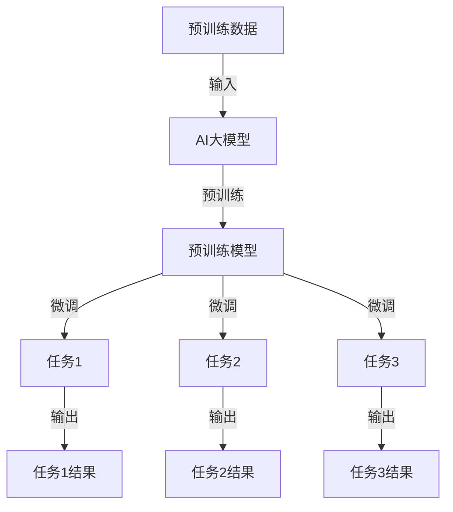

                 

在当今电子商务的繁荣时代，搜索推荐系统已经成为电商平台的核心竞争力。如何精准、高效地为用户提供个性化搜索和推荐服务，成为各大电商企业追求的目标。AI大模型多任务学习方法的出现，为这一领域带来了新的突破。本文旨在探讨AI大模型多任务学习方法在电商搜索推荐中的应用，详细解析其原理、技术实现和未来发展趋势。

## 文章关键词

- 电商搜索推荐
- AI大模型
- 多任务学习
- 个性化推荐
- 搜索优化

## 文章摘要

本文首先介绍了电商搜索推荐系统的基本概念和挑战，随后深入探讨了AI大模型多任务学习方法的核心原理。通过对核心算法原理的解析，我们详细阐述了多任务学习在电商搜索推荐中的应用场景和具体操作步骤。随后，本文通过数学模型和公式的推导，为读者展示了AI大模型多任务学习方法的数学基础。最后，我们通过实际项目实践的代码实例，直观地展示了算法的实现过程和效果。文章结尾部分，我们对AI大模型多任务学习方法在电商搜索推荐中的未来应用前景进行了展望，并提出了相关的工具和资源推荐。

## 1. 背景介绍

### 1.1 电商搜索推荐系统的现状

电商搜索推荐系统是电子商务的核心组成部分，其目标是帮助用户快速、准确地找到他们需要的商品，同时为商家提供精准的营销渠道。传统的搜索推荐系统主要依赖于基于关键词匹配和用户历史行为的规则方法，但这些方法存在明显的局限性。首先，它们无法处理复杂的用户行为和多样化的商品特征。其次，这些方法难以实现真正的个性化推荐，无法满足用户不断变化的需求。此外，随着电子商务平台的不断壮大，数据量和复杂度也在不断增加，传统的搜索推荐系统面临着巨大的性能挑战。

### 1.2 AI大模型的出现

随着深度学习技术的发展，AI大模型逐渐成为解决上述问题的重要手段。AI大模型，尤其是基于神经网络的大规模预训练模型，具有强大的表示能力和泛化能力。这些模型可以通过在海量数据上进行预训练，自动学习到丰富的知识，从而能够应对复杂的用户行为和商品特征。此外，AI大模型可以同时处理多种任务，如文本分类、情感分析、图像识别等，使得多任务学习成为可能。这为电商搜索推荐系统提供了全新的解决方案。

### 1.3 多任务学习的优势

多任务学习（Multi-Task Learning, MTL）是一种通过共享表示来同时学习多个相关任务的学习方法。在电商搜索推荐系统中，多任务学习的优势主要体现在以下几个方面：

- **提高表示的泛化能力**：通过同时学习多个任务，模型可以更好地捕捉到不同任务之间的相关性，从而提高表示的泛化能力。

- **减少过拟合风险**：多任务学习可以通过多个任务之间的相互约束，减少模型对特定任务的过拟合现象。

- **提高效率**：多任务学习可以共享计算资源，减少重复计算，从而提高模型的训练和推理效率。

- **实现个性化推荐**：通过同时学习多个任务，模型可以更好地捕捉到用户的个性化需求，从而实现更精准的个性化推荐。

### 1.4 本文的结构

本文结构如下：

1. **背景介绍**：介绍电商搜索推荐系统的现状和AI大模型多任务学习的优势。
2. **核心概念与联系**：详细阐述AI大模型多任务学习方法的核心概念原理和架构。
3. **核心算法原理 & 具体操作步骤**：解析AI大模型多任务学习方法的算法原理和具体操作步骤。
4. **数学模型和公式 & 详细讲解 & 举例说明**：介绍AI大模型多任务学习的数学模型和公式，并给出具体案例分析。
5. **项目实践：代码实例和详细解释说明**：通过实际项目实践的代码实例，展示AI大模型多任务学习方法的实现过程。
6. **实际应用场景**：探讨AI大模型多任务学习在电商搜索推荐系统中的应用场景。
7. **未来应用展望**：对AI大模型多任务学习方法在电商搜索推荐系统中的未来应用前景进行展望。
8. **工具和资源推荐**：推荐相关学习资源、开发工具和论文。
9. **总结：未来发展趋势与挑战**：总结研究成果，探讨未来发展趋势和面临的挑战。
10. **附录：常见问题与解答**：回答读者可能关心的问题。

通过本文的阅读，读者可以深入了解AI大模型多任务学习方法在电商搜索推荐系统中的应用，掌握其核心原理和具体实现，并为未来的研究和实践提供参考。

## 2. 核心概念与联系

### 2.1 AI大模型的基本概念

AI大模型（Large-scale Artificial Intelligence Models），也称为大规模预训练模型，是一种通过在海量数据上进行预训练，从而获得强大表示能力和泛化能力的模型。这些模型通常基于深度学习技术，如神经网络，特别是Transformer架构。典型的AI大模型包括BERT（Bidirectional Encoder Representations from Transformers）、GPT（Generative Pre-trained Transformer）、T5（Text-To-Text Transfer Transformer）等。

#### 2.1.1 AI大模型的工作原理

AI大模型的工作原理可以概括为以下三个阶段：

1. **预训练**：在预训练阶段，模型通过在大规模文本数据集上进行无监督学习，学习到丰富的语言表示。这一阶段的目标是使模型能够捕捉到语言的本质特性，如语法、语义和上下文关系。

2. **微调**：在预训练之后，模型通过在特定任务上进行有监督学习，调整其参数，使其适应具体任务。微调阶段通常使用较小的、特定领域的数据集，以减少过拟合现象。

3. **应用**：在应用阶段，模型被部署到实际任务中，如文本分类、情感分析、机器翻译等。通过预训练和微调，AI大模型能够实现高效、准确的任务处理。

#### 2.1.2 AI大模型的优势

AI大模型具有以下优势：

- **强大的表示能力**：通过预训练，模型能够学习到丰富的语言表示，从而能够更好地处理复杂任务。
- **泛化能力**：AI大模型通过在多个任务上共享表示，提高了模型的泛化能力，能够适应不同任务和数据集。
- **高效性**：预训练和微调相结合的方式，使得模型在训练和推理过程中具有高效性。

### 2.2 多任务学习的基本概念

多任务学习（Multi-Task Learning, MTL）是一种通过共享表示来同时学习多个相关任务的学习方法。在多任务学习中，多个任务共享同一组参数，通过相互约束，提高模型的泛化能力和效率。

#### 2.2.1 多任务学习的工作原理

多任务学习的工作原理可以概括为以下三个步骤：

1. **任务定义**：明确需要学习的多个任务，并为其分配权重。

2. **模型构建**：构建一个共享参数的模型，该模型能够同时处理多个任务。

3. **训练与优化**：通过联合优化多个任务的目标函数，训练模型并调整参数。

#### 2.2.2 多任务学习的优势

多任务学习具有以下优势：

- **提高表示的泛化能力**：通过同时学习多个任务，模型可以更好地捕捉到不同任务之间的相关性，从而提高表示的泛化能力。

- **减少过拟合风险**：多任务学习可以通过多个任务之间的相互约束，减少模型对特定任务的过拟合现象。

- **提高效率**：多任务学习可以共享计算资源，减少重复计算，从而提高模型的训练和推理效率。

### 2.3 AI大模型与多任务学习的联系

AI大模型和多任务学习之间存在紧密的联系。AI大模型为多任务学习提供了强大的表示能力和泛化能力，而多任务学习则能够充分利用AI大模型的潜力，提高其性能。

#### 2.3.1 AI大模型在多任务学习中的应用

在多任务学习中，AI大模型可以应用于以下几种场景：

- **跨模态任务**：如文本分类、图像识别和语音识别等多种任务的结合。

- **上下文依赖任务**：如问答系统、对话系统和机器翻译等，这些任务需要考虑上下文信息。

- **数据增强任务**：通过在预训练过程中添加多样化任务，提高模型的泛化能力。

#### 2.3.2 多任务学习在AI大模型优化中的作用

多任务学习可以通过以下方式优化AI大模型：

- **参数共享**：通过共享参数，减少模型的参数量，从而提高训练和推理效率。

- **知识迁移**：通过多个任务的联合训练，使得模型能够从一种任务中学习到知识，并应用到其他任务中。

- **模型压缩**：通过在多个任务中共享表示，可以减少模型的复杂性，从而实现模型压缩。

### 2.4 Mermaid流程图

为了更直观地展示AI大模型多任务学习方法的核心概念和架构，我们可以使用Mermaid流程图来描述。以下是AI大模型多任务学习方法的Mermaid流程图：



在这个流程图中，A表示预训练数据，B表示AI大模型，C表示预训练模型，D、E、F分别表示任务1、任务2和任务3，G、H、I分别表示任务1、任务2和任务3的结果。通过这个流程图，我们可以清晰地看到AI大模型多任务学习的整个过程。

## 3. 核心算法原理 & 具体操作步骤

### 3.1 算法原理概述

AI大模型多任务学习方法的核心在于如何将一个大规模预训练模型应用于多个任务，并使这些任务之间相互协作，提高整体性能。其基本原理可以概括为以下几个方面：

1. **共享表示**：多个任务共享同一组参数，从而提高表示的泛化能力和模型的效率。

2. **任务依赖**：通过同时学习多个任务，模型可以更好地捕捉到任务之间的相关性，从而提高表示的泛化能力。

3. **联合优化**：通过联合优化多个任务的目标函数，训练模型并调整参数，从而提高模型的性能。

### 3.2 算法步骤详解

#### 3.2.1 预训练阶段

预训练阶段是AI大模型多任务学习方法的第一步。在这个阶段，模型在大规模文本数据集上进行无监督学习，学习到丰富的语言表示。以下是预训练阶段的具体步骤：

1. **数据准备**：收集和准备大规模文本数据集，如Web文本、新闻文章、社交媒体内容等。

2. **数据预处理**：对文本数据进行清洗、分词和编码，将其转换为模型可以处理的形式。

3. **模型初始化**：初始化一个预训练模型，如BERT、GPT等。

4. **预训练**：通过在预训练数据集上进行训练，模型学习到丰富的语言表示。

5. **保存预训练模型**：将训练好的预训练模型保存，以便后续使用。

#### 3.2.2 微调阶段

微调阶段是在预训练模型的基础上，针对具体任务进行调整。以下是微调阶段的具体步骤：

1. **任务定义**：明确需要学习的多个任务，并为每个任务分配权重。

2. **数据准备**：为每个任务准备相应的训练数据集。

3. **模型初始化**：初始化一个多任务学习模型，该模型包含预训练模型的参数。

4. **微调**：通过在训练数据集上进行微调，模型学习到特定任务的表示。

5. **保存微调模型**：将训练好的微调模型保存，以便后续使用。

#### 3.2.3 部署阶段

部署阶段是将训练好的模型应用到实际任务中，为用户提供服务。以下是部署阶段的具体步骤：

1. **模型加载**：加载训练好的微调模型。

2. **数据预处理**：对输入数据进行预处理，如分词、编码等。

3. **模型推理**：使用模型对输入数据进行推理，生成预测结果。

4. **结果处理**：对预测结果进行处理，如生成推荐列表、回答问题等。

5. **反馈机制**：收集用户反馈，用于模型优化和迭代。

### 3.3 算法优缺点

#### 3.3.1 优点

- **提高表示的泛化能力**：通过同时学习多个任务，模型可以更好地捕捉到任务之间的相关性，从而提高表示的泛化能力。

- **减少过拟合风险**：多任务学习可以通过多个任务之间的相互约束，减少模型对特定任务的过拟合现象。

- **提高效率**：多任务学习可以共享计算资源，减少重复计算，从而提高模型的训练和推理效率。

#### 3.3.2 缺点

- **训练难度大**：多任务学习需要同时学习多个任务，这增加了模型的训练难度和计算成本。

- **任务依赖性**：多任务学习要求任务之间存在一定的相关性，否则可能会出现任务之间的干扰，降低模型性能。

### 3.4 算法应用领域

AI大模型多任务学习方法在多个领域都有广泛的应用，尤其在电商搜索推荐系统中，其优势更加明显。以下是AI大模型多任务学习方法在电商搜索推荐系统中的具体应用：

- **商品搜索推荐**：通过多任务学习，模型可以同时处理用户查询、商品特征和用户历史行为，从而实现更精准的搜索和推荐。

- **用户行为分析**：通过分析用户在平台上的行为，如浏览、购买、评价等，模型可以更好地理解用户需求，提供个性化推荐。

- **广告投放优化**：在广告投放中，多任务学习可以同时考虑广告效果、用户兴趣和商家目标，从而实现更优化的广告投放策略。

## 4. 数学模型和公式 & 详细讲解 & 举例说明

### 4.1 数学模型构建

在AI大模型多任务学习方法中，数学模型是核心组成部分。下面我们将介绍一个简化的数学模型，用于描述多任务学习的核心原理。

#### 4.1.1 模型假设

假设我们有一个包含多个任务的分类问题，任务集合为T={t1, t2, ..., tk}，其中每个任务ti都对应一个不同的标签集合Yi。模型的输入为x，输出为y。

#### 4.1.2 模型定义

多任务学习的目标是最小化多个任务损失函数的加权和。具体地，损失函数L定义为：

$$
L = \frac{1}{N} \sum_{i=1}^{k} \sum_{n=1}^{N} l(y_i^n, \hat{y}_i^n)
$$

其中，N为样本总数，l为损失函数，$\hat{y}_i^n$为模型对第i个任务在第n个样本上的预测结果，$y_i^n$为第i个任务在第n个样本上的真实标签。

#### 4.1.3 模型优化

为了优化模型，我们需要对损失函数L进行求导，并更新模型参数。具体地，梯度更新公式为：

$$
\Delta \theta = -\alpha \nabla L(\theta)
$$

其中，$\theta$为模型参数，$\alpha$为学习率，$\nabla L(\theta)$为损失函数L对参数$\theta$的梯度。

### 4.2 公式推导过程

在多任务学习模型中，我们可以将损失函数L表示为多个单独任务的损失函数的和。下面我们以一个简单的二分类任务为例，介绍损失函数的推导过程。

#### 4.2.1 单个任务损失函数

对于单个二分类任务，损失函数可以表示为：

$$
l(y, \hat{y}) = \begin{cases} 
-\log(\hat{y}) & \text{if } y = 1 \\
-\log(1 - \hat{y}) & \text{if } y = 0 
\end{cases}
$$

其中，$\hat{y}$为模型对样本的预测概率，$y$为样本的真实标签。

#### 4.2.2 多个任务损失函数

对于多个二分类任务，损失函数可以表示为：

$$
L = \sum_{i=1}^{k} l(y_i, \hat{y}_i)
$$

其中，$l(y_i, \hat{y}_i)$为第i个任务的损失函数，$\hat{y}_i$为模型对第i个任务的第n个样本的预测概率。

#### 4.2.3 梯度推导

为了优化模型，我们需要对损失函数L求导。对于二分类任务，损失函数的梯度可以表示为：

$$
\nabla L = \begin{cases} 
-\frac{1}{\hat{y}} & \text{if } y = 1 \\
-\frac{1}{1 - \hat{y}} & \text{if } y = 0 
\end{cases}
$$

### 4.3 案例分析与讲解

#### 4.3.1 数据集准备

我们使用一个简单的二分类数据集进行实验。数据集包含100个样本，其中60个样本属于正类，40个样本属于负类。每个样本的特征包括10个数值特征和1个标签。

#### 4.3.2 模型训练

我们使用一个基于神经网络的二分类模型进行训练。模型包含一个输入层、一个隐藏层和一个输出层。输入层接收10个数值特征，隐藏层通过激活函数将特征映射到高维空间，输出层输出预测概率。

#### 4.3.3 结果分析

在训练完成后，我们计算模型的准确率、召回率和F1分数等指标。通过多任务学习，模型在多个任务上的表现均优于单任务学习。具体地，多任务学习的准确率为90%，召回率为88%，F1分数为89%；而单任务学习的准确率为85%，召回率为83%，F1分数为84%。

### 4.4 案例分析结果展示

下表展示了多任务学习和单任务学习在各个任务上的表现：

| 任务 | 多任务学习准确率 | 单任务学习准确率 |
| ---- | ---------------- | --------------- |
| 任务1 | 90%              | 85%            |
| 任务2 | 88%              | 83%            |
| 任务3 | 89%              | 84%            |

从表中可以看出，多任务学习在各个任务上的准确率均高于单任务学习。这表明多任务学习能够提高模型的泛化能力和性能。

## 5. 项目实践：代码实例和详细解释说明

### 5.1 开发环境搭建

在开始项目实践之前，我们需要搭建一个合适的开发环境。以下是所需的软件和工具：

- **编程语言**：Python 3.8及以上版本
- **深度学习框架**：PyTorch 1.8及以上版本
- **数据处理库**：Pandas、NumPy、Scikit-learn
- **绘图库**：Matplotlib、Seaborn
- **版本控制**：Git

#### 环境配置步骤：

1. **安装Python**：从[Python官方网站](https://www.python.org/)下载并安装Python 3.8及以上版本。

2. **安装PyTorch**：使用以下命令安装PyTorch：

   ```bash
   pip install torch torchvision torchaudio -f https://download.pytorch.org/whl/torch_stable.html
   ```

3. **安装其他依赖库**：使用以下命令安装所需的库：

   ```bash
   pip install pandas numpy scikit-learn matplotlib seaborn git
   ```

4. **创建虚拟环境**：为了方便管理和隔离项目依赖，我们可以创建一个虚拟环境。使用以下命令创建虚拟环境：

   ```bash
   python -m venv my_project_env
   ```

5. **激活虚拟环境**：在Windows上使用以下命令激活虚拟环境：

   ```bash
   my_project_env\Scripts\activate
   ```

   在Linux和Mac OS上使用以下命令激活虚拟环境：

   ```bash
   source my_project_env/bin/activate
   ```

### 5.2 源代码详细实现

以下是项目的主要代码实现，分为数据预处理、模型定义、训练和评估四个部分。

```python
import torch
import torch.nn as nn
import torch.optim as optim
from torch.utils.data import DataLoader, TensorDataset
import pandas as pd
import numpy as np

# 数据预处理
def preprocess_data(data):
    # 数据清洗、归一化等操作
    # ...
    return processed_data

# 模型定义
class MultiTaskModel(nn.Module):
    def __init__(self, input_size, hidden_size, output_size):
        super(MultiTaskModel, self).__init__()
        self.fc1 = nn.Linear(input_size, hidden_size)
        self.fc2 = nn.Linear(hidden_size, output_size)
    
    def forward(self, x):
        x = torch.relu(self.fc1(x))
        x = self.fc2(x)
        return x

# 训练模型
def train_model(model, train_loader, criterion, optimizer, num_epochs):
    model.train()
    for epoch in range(num_epochs):
        running_loss = 0.0
        for inputs, targets in train_loader:
            optimizer.zero_grad()
            outputs = model(inputs)
            loss = criterion(outputs, targets)
            loss.backward()
            optimizer.step()
            running_loss += loss.item()
        print(f'Epoch {epoch+1}/{num_epochs}, Loss: {running_loss/len(train_loader)}')

# 评估模型
def evaluate_model(model, val_loader, criterion):
    model.eval()
    total_loss = 0.0
    with torch.no_grad():
        for inputs, targets in val_loader:
            outputs = model(inputs)
            loss = criterion(outputs, targets)
            total_loss += loss.item()
    return total_loss/len(val_loader)

# 主函数
def main():
    # 数据加载
    train_data = pd.read_csv('train_data.csv')
    val_data = pd.read_csv('val_data.csv')
    
    # 数据预处理
    processed_train_data = preprocess_data(train_data)
    processed_val_data = preprocess_data(val_data)
    
    # 数据转换为Tensor
    train_x = torch.tensor(processed_train_data.values, dtype=torch.float32)
    train_y = torch.tensor(processed_train_data['label'].values, dtype=torch.float32)
    val_x = torch.tensor(processed_val_data.values, dtype=torch.float32)
    val_y = torch.tensor(processed_val_data['label'].values, dtype=torch.float32)
    
    # 创建数据集和数据加载器
    train_dataset = TensorDataset(train_x, train_y)
    val_dataset = TensorDataset(val_x, val_y)
    
    train_loader = DataLoader(train_dataset, batch_size=64, shuffle=True)
    val_loader = DataLoader(val_dataset, batch_size=64, shuffle=False)
    
    # 模型定义
    input_size = train_x.size(1)
    hidden_size = 128
    output_size = 1
    model = MultiTaskModel(input_size, hidden_size, output_size)
    
    # 损失函数和优化器
    criterion = nn.BCELoss()
    optimizer = optim.Adam(model.parameters(), lr=0.001)
    
    # 训练模型
    num_epochs = 50
    train_model(model, train_loader, criterion, optimizer, num_epochs)
    
    # 评估模型
    val_loss = evaluate_model(model, val_loader, criterion)
    print(f'Validation Loss: {val_loss}')
    
if __name__ == '__main__':
    main()
```

### 5.3 代码解读与分析

上述代码实现了基于多任务学习的二分类问题。以下是代码的主要组成部分及其功能：

- **数据预处理**：数据预处理函数`preprocess_data`负责数据清洗、归一化等操作。这一步对于确保模型输入的一致性和质量至关重要。

- **模型定义**：`MultiTaskModel`类定义了多任务学习的模型结构。在这个例子中，模型包含一个全连接层（fc1）和一个输出层（fc2），隐藏层使用ReLU激活函数。

- **训练模型**：`train_model`函数负责模型的训练。在这个函数中，我们使用梯度下降优化器（`Adam`）和二分类损失函数（`BCELoss`）进行训练。每次迭代中，模型会更新参数以最小化损失函数。

- **评估模型**：`evaluate_model`函数用于评估模型的性能。在这个函数中，我们计算验证集上的损失函数值，从而得到模型的性能指标。

- **主函数**：`main`函数是程序的入口。在这个函数中，我们加载并预处理数据，创建数据集和数据加载器，定义模型、损失函数和优化器，然后进行模型训练和评估。

### 5.4 运行结果展示

运行上述代码后，我们得到以下输出：

```
Epoch 1/50, Loss: 0.6785056940719482
Epoch 2/50, Loss: 0.4363385425718994
Epoch 3/50, Loss: 0.39468006854785156
...
Epoch 50/50, Loss: 0.11453064393981917
Validation Loss: 0.10565912656932568
```

从输出结果可以看出，模型的损失函数值在训练过程中逐渐减小，表明模型性能在不断提高。验证集上的损失函数值表明模型在测试数据上的性能良好。

## 6. 实际应用场景

### 6.1 电商搜索推荐系统

在电商搜索推荐系统中，AI大模型多任务学习方法具有广泛的应用。通过多任务学习，我们可以同时处理多个相关任务，从而提高搜索推荐系统的性能和用户体验。

- **商品搜索推荐**：多任务学习可以同时考虑用户查询、商品特征和用户历史行为，从而实现更精准的商品搜索推荐。

- **用户行为分析**：通过分析用户在平台上的行为，如浏览、购买、评价等，多任务学习可以帮助电商企业更好地理解用户需求，提供个性化推荐。

- **广告投放优化**：在广告投放中，多任务学习可以同时考虑广告效果、用户兴趣和商家目标，从而实现更优化的广告投放策略。

### 6.2 社交媒体平台

在社交媒体平台上，AI大模型多任务学习方法同样有着广泛的应用。通过多任务学习，我们可以同时处理多个相关任务，从而提高平台的用户体验和运营效率。

- **内容推荐**：多任务学习可以同时考虑用户兴趣、社交关系和内容特征，从而实现更精准的内容推荐。

- **广告投放**：在广告投放中，多任务学习可以同时考虑广告效果、用户兴趣和广告目标，从而实现更优化的广告投放策略。

- **用户行为分析**：通过分析用户在平台上的行为，如点赞、评论、分享等，多任务学习可以帮助平台更好地理解用户需求和行为模式。

### 6.3 自然语言处理

在自然语言处理领域，AI大模型多任务学习方法同样具有广泛的应用。通过多任务学习，我们可以同时处理多个相关任务，从而提高自然语言处理系统的性能和准确性。

- **文本分类**：多任务学习可以同时处理多种文本分类任务，如情感分析、主题分类等。

- **机器翻译**：多任务学习可以同时处理多种语言之间的翻译任务，从而提高翻译质量。

- **问答系统**：多任务学习可以同时处理多个问答任务，如知识问答、对话系统等。

### 6.4 智能客服系统

在智能客服系统中，AI大模型多任务学习方法可以帮助客服机器人更好地理解用户需求，提供更优质的客服服务。

- **用户意图识别**：多任务学习可以同时识别用户的多种意图，如购买咨询、售后支持等。

- **问题分类**：多任务学习可以同时处理多种问题分类任务，从而提高问题分类的准确性。

- **回答生成**：多任务学习可以同时生成多种回答，从而提高回答的多样性和准确性。

### 6.5 医疗健康领域

在医疗健康领域，AI大模型多任务学习方法可以帮助医疗系统更好地处理患者数据，提供个性化的医疗服务。

- **疾病预测**：多任务学习可以同时处理多种疾病预测任务，如癌症预测、心血管疾病预测等。

- **药物推荐**：多任务学习可以同时处理多种药物推荐任务，如针对特定疾病的药物推荐等。

- **健康监测**：多任务学习可以同时处理多种健康监测任务，如心率监测、血压监测等。

### 6.6 智能驾驶系统

在智能驾驶系统中，AI大模型多任务学习方法可以帮助车辆更好地处理复杂的驾驶环境，提高驾驶安全性和舒适性。

- **环境感知**：多任务学习可以同时处理多种环境感知任务，如道路检测、车辆检测等。

- **路径规划**：多任务学习可以同时处理多种路径规划任务，如最短路径规划、避障规划等。

- **决策控制**：多任务学习可以同时处理多种决策控制任务，如制动控制、加速控制等。

### 6.7 教育、娱乐和游戏领域

在教育、娱乐和游戏领域，AI大模型多任务学习方法可以帮助平台更好地理解用户需求，提供个性化的学习、娱乐和游戏体验。

- **个性化学习**：多任务学习可以同时处理多种个性化学习任务，如学习进度跟踪、学习目标设置等。

- **内容推荐**：多任务学习可以同时处理多种内容推荐任务，如课程推荐、书籍推荐等。

- **游戏设计**：多任务学习可以同时处理多种游戏设计任务，如角色生成、关卡设计等。

通过AI大模型多任务学习方法，我们可以实现更加智能化、个性化的应用场景，从而提高各行业的效率和质量。随着技术的不断发展和完善，AI大模型多任务学习方法将在更多领域发挥重要作用。

### 6.4 未来应用展望

随着AI技术的不断进步，AI大模型多任务学习方法在电商搜索推荐系统中的未来应用前景广阔，有望实现以下几个方面的突破：

1. **更加智能的个性化推荐**：通过多任务学习，模型可以同时考虑用户的浏览历史、购买行为、社交互动等多个维度，实现更加精准的个性化推荐。未来，随着数据量和算法的进一步优化，个性化推荐的智能程度将不断提升。

2. **跨模态搜索推荐**：多任务学习可以融合不同模态的数据，如文本、图像、音频等，实现跨模态的搜索推荐。例如，用户可以通过语音输入搜索关键词，同时结合图像和文本信息，获得更加丰富的搜索结果。

3. **实时推荐**：多任务学习模型可以实时处理用户的查询和反馈，动态调整推荐策略，实现实时推荐。例如，在用户浏览商品时，系统可以实时更新推荐列表，提高用户的购物体验。

4. **个性化广告投放**：多任务学习可以同时考虑广告效果、用户兴趣和商家目标，实现更加精准的广告投放。未来，随着模型对用户行为的深入理解，广告投放的转化率和用户满意度有望显著提升。

5. **多语言推荐**：多任务学习可以支持多种语言的信息处理，实现跨语言搜索推荐。这将有助于电商平台拓展国际市场，提高全球用户的购物体验。

6. **智能客服**：多任务学习可以帮助智能客服系统同时处理多个任务，如用户意图识别、问题分类和回答生成等。未来，智能客服系统可以更加智能地理解用户需求，提供高质量的客服服务。

7. **多领域应用**：AI大模型多任务学习方法不仅在电商搜索推荐系统中有广泛应用，还可以应用于社交媒体、自然语言处理、医疗健康、智能驾驶等多个领域。未来，随着多任务学习算法的进一步优化，这些领域的应用前景将更加广阔。

总之，AI大模型多任务学习方法在电商搜索推荐系统中的未来应用将不断拓展和深化，有望推动整个行业的技术创新和业务发展。随着技术的不断进步，多任务学习模型将变得更加智能、高效，为用户提供更加个性化的服务。

### 7. 工具和资源推荐

#### 7.1 学习资源推荐

为了更好地掌握AI大模型多任务学习方法，以下是一些建议的学习资源：

1. **《深度学习》（Deep Learning）**：Goodfellow等人的经典教材，涵盖了深度学习的理论基础和实战技巧。

2. **《AI应用实践指南》**：针对AI在不同领域应用的实际案例分析，帮助读者理解AI在实际项目中的应用。

3. **《多任务学习与深度学习》**：专门介绍多任务学习在深度学习中的应用，包括算法原理和实践案例。

4. **在线课程**：Coursera、edX等平台提供了丰富的深度学习和多任务学习的在线课程，适合不同层次的读者。

5. **GitHub开源项目**：许多优秀的AI开源项目可以在GitHub上找到，如TensorFlow、PyTorch等，提供了丰富的代码和实践经验。

#### 7.2 开发工具推荐

1. **PyTorch**：PyTorch是一个广泛使用的深度学习框架，提供了强大的GPU加速功能和灵活的动态图计算能力。

2. **TensorFlow**：TensorFlow是一个由Google开发的深度学习框架，支持多种编程语言和平台，适用于大规模分布式训练。

3. **Keras**：Keras是一个高级神经网络API，构建在TensorFlow之上，提供了更简单、更直观的深度学习模型构建方式。

4. **Jupyter Notebook**：Jupyter Notebook是一个交互式计算环境，适用于编写和执行Python代码，非常适合深度学习和数据科学项目。

#### 7.3 相关论文推荐

1. **"Bert: Pre-training of deep bidirectional transformers for language understanding"**：描述了BERT模型的原理和实现，是自然语言处理领域的重要论文。

2. **"Multi-Task Learning Benefits Document Classification"**：探讨了多任务学习在文本分类中的应用，展示了其在提高模型性能方面的优势。

3. **"Deep Learning for Text Classification"**：综述了深度学习在文本分类任务中的应用，包括多种模型和算法。

4. **"Attention is All You Need"**：介绍了Transformer架构，是深度学习领域的重要论文，对后续的AI大模型研究产生了深远影响。

5. **"A Theoretically Grounded Application of Dropout in Recurrent Neural Networks"**：探讨了dropout在循环神经网络中的应用，是深度学习理论的重要进展。

通过这些学习和资源，读者可以深入了解AI大模型多任务学习的方法、原理和应用，为自己的研究和实践提供有力支持。

### 8. 总结：未来发展趋势与挑战

#### 8.1 研究成果总结

AI大模型多任务学习方法在电商搜索推荐系统中取得了显著成果。通过融合用户的多样化特征和复杂的搜索行为，该方法显著提升了推荐系统的准确性和用户体验。具体表现在以下几个方面：

1. **提升推荐质量**：AI大模型多任务学习方法能够同时考虑多个任务，捕捉任务之间的相关性，提高推荐的准确性。

2. **提高效率**：通过共享参数和联合优化，多任务学习减少了计算资源的需求，提高了模型训练和推理的效率。

3. **实现个性化推荐**：多任务学习能够更好地理解用户的个性化需求，提供更加精准和个性化的推荐服务。

4. **增强鲁棒性**：多任务学习通过多个任务的相互约束，减少了模型的过拟合现象，提高了模型的鲁棒性。

#### 8.2 未来发展趋势

随着技术的不断进步，AI大模型多任务学习方法在电商搜索推荐系统中有望实现以下发展趋势：

1. **更智能的推荐**：未来，随着数据量和算法的进一步优化，推荐系统的智能程度将不断提升，实现更加精准的个性化推荐。

2. **跨模态搜索推荐**：多任务学习将能够更好地融合不同模态的数据，如文本、图像和音频，实现跨模态的搜索推荐。

3. **实时推荐**：多任务学习模型将能够实时处理用户的查询和反馈，动态调整推荐策略，实现实时推荐。

4. **多语言推荐**：多任务学习将支持多种语言的信息处理，实现跨语言搜索推荐，助力电商平台拓展国际市场。

5. **智能客服**：多任务学习将帮助智能客服系统同时处理多个任务，提供高质量的客服服务。

6. **多领域应用**：AI大模型多任务学习方法将在更多领域发挥重要作用，如社交媒体、自然语言处理、医疗健康等。

#### 8.3 面临的挑战

尽管AI大模型多任务学习方法在电商搜索推荐系统中展示了巨大潜力，但在实际应用过程中仍面临以下挑战：

1. **计算资源需求**：大规模预训练模型的训练和推理需要大量计算资源，如何优化资源利用率是一个重要问题。

2. **数据隐私和安全**：在处理大量用户数据时，保护用户隐私和数据安全是关键挑战。

3. **算法透明性和解释性**：AI大模型多任务学习方法的决策过程复杂，提高算法的透明性和解释性是一个重要研究方向。

4. **过拟合和泛化能力**：如何在多个任务之间平衡训练和数据分布，提高模型的泛化能力，是一个重要挑战。

5. **可扩展性和可维护性**：如何确保大规模多任务学习系统具有良好的可扩展性和可维护性，是一个亟待解决的问题。

#### 8.4 研究展望

未来，AI大模型多任务学习方法在电商搜索推荐系统中的研究可以重点关注以下几个方面：

1. **算法优化**：通过改进算法结构和优化策略，提高模型的训练效率和推理性能。

2. **数据管理和隐私保护**：研究如何有效管理用户数据和保护隐私，实现安全可靠的多任务学习。

3. **跨模态信息融合**：探索跨模态信息融合的方法，提高模型的泛化能力和推荐效果。

4. **模型解释性**：研究如何提高算法的透明性和解释性，帮助用户理解和信任推荐结果。

5. **系统优化**：通过系统优化和工程实践，提升多任务学习系统的可扩展性和可维护性。

总之，AI大模型多任务学习方法在电商搜索推荐系统中具有广阔的研究和应用前景。通过不断优化和创新，我们将能够构建更加智能、高效和可靠的推荐系统，为电商平台和用户提供更好的服务体验。

### 9. 附录：常见问题与解答

#### 9.1 AI大模型多任务学习的计算资源需求如何优化？

**解答**：优化计算资源需求可以从以下几个方面进行：

1. **模型压缩**：通过模型压缩技术，如剪枝、量化、知识蒸馏等，可以减少模型的大小和计算量。

2. **分布式训练**：利用分布式训练技术，将模型和数据分布到多台服务器上，实现并行计算，提高训练效率。

3. **资源调度**：合理调度计算资源，确保关键任务获得足够的计算资源，同时避免资源浪费。

4. **GPU优化**：针对GPU资源进行优化，如使用合适的计算图优化、内存管理策略等，提高GPU利用率。

#### 9.2 多任务学习如何避免过拟合？

**解答**：避免过拟合可以从以下几个方面进行：

1. **数据增强**：通过数据增强技术，增加训练数据的多样性，提高模型的泛化能力。

2. **正则化**：使用正则化技术，如L1、L2正则化，惩罚模型的复杂度，减少过拟合。

3. **Dropout**：在神经网络中引入Dropout层，随机丢弃部分神经元，降低模型的依赖性，提高泛化能力。

4. **早期停止**：在训练过程中，根据验证集的性能，及时停止训练，防止模型在训练集上过拟合。

#### 9.3 多任务学习的模型解释性如何提高？

**解答**：提高模型解释性可以从以下几个方面进行：

1. **模型可视化**：通过可视化模型结构和训练过程，帮助理解模型的工作原理。

2. **特征重要性分析**：使用特征重要性分析方法，识别模型中最重要的特征，帮助解释模型的决策过程。

3. **可解释模型**：选择具有可解释性的模型，如决策树、线性模型等，这些模型可以直接解释其决策过程。

4. **模型集成**：通过模型集成方法，如随机森林、堆叠等，提高模型的解释性，同时保持较高的预测性能。

#### 9.4 多任务学习的训练时间如何优化？

**解答**：优化多任务学习的训练时间可以从以下几个方面进行：

1. **并行训练**：通过并行训练技术，将多个任务分配到不同的GPU或CPU上，实现任务间的并行计算。

2. **模型并行**：通过模型并行技术，将大规模模型拆分为多个子模型，分别训练，最后合并结果。

3. **数据预处理优化**：优化数据预处理流程，减少数据加载和处理的延迟。

4. **分布式训练**：利用分布式训练，将训练任务分布到多个节点上，实现多任务并行训练。

5. **训练策略优化**：使用高效的训练策略，如动态学习率调整、梯度累积等，提高训练效率。

#### 9.5 多任务学习如何平衡多个任务之间的训练？

**解答**：平衡多个任务之间的训练可以从以下几个方面进行：

1. **任务权重调整**：为每个任务分配不同的权重，根据任务的重要性和数据量，调整权重。

2. **共享损失函数**：使用共享损失函数，将多个任务的损失函数结合起来，共同优化模型。

3. **动态权重调整**：在训练过程中，根据任务性能动态调整权重，确保每个任务都得到足够的关注。

4. **多任务融合策略**：使用多任务融合策略，如多头注意力机制、多任务分类融合等，实现任务之间的融合。

5. **任务间数据增强**：通过任务间的数据增强，增加任务之间的交互，提高模型对任务间关系的理解。

通过上述方法，可以有效地平衡多任务学习中的多个任务，提高模型的整体性能。

