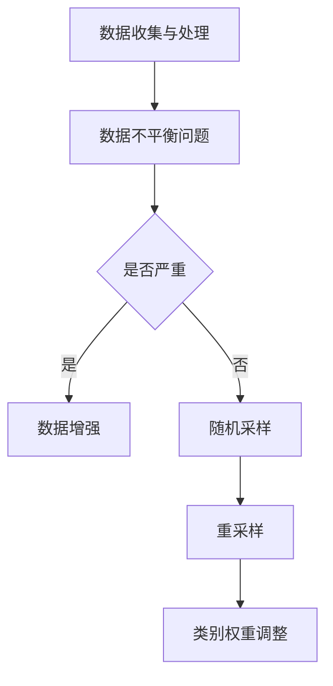

                 

关键词：电商搜索推荐、AI大模型、数据不平衡、解决方案、优化策略

> 摘要：本文旨在探讨电商搜索推荐系统中常见的数据不平衡问题，特别是针对AI大模型的处理策略。文章首先介绍了电商搜索推荐系统的基本概念和AI大模型的作用，然后详细分析了数据不平衡的问题，最后提出了多种解决策略，并进行了比较和评估。通过本文的探讨，希望能够为电商搜索推荐领域提供有益的参考和启示。

## 1. 背景介绍

### 1.1 电商搜索推荐系统概述

随着互联网的飞速发展，电子商务已经成为现代商业不可或缺的一部分。而电商搜索推荐系统作为电子商务的核心组成部分，承担着提高用户满意度和促进销售增长的重要任务。电商搜索推荐系统通过分析用户的搜索历史、购买行为、浏览记录等信息，为用户提供个性化的商品推荐，从而提高用户对电商平台的粘性和忠诚度。

电商搜索推荐系统主要由三个部分组成：数据收集与处理、推荐算法、推荐结果呈现。数据收集与处理部分负责从各种渠道获取用户数据，并对数据进行清洗、转换和存储。推荐算法部分根据用户数据生成个性化的推荐结果。推荐结果呈现部分则将推荐结果展示给用户。

### 1.2 AI大模型的作用

AI大模型，也称为深度学习模型，是近年来在人工智能领域取得突破性进展的一种技术。AI大模型通过学习海量数据，能够自动提取特征、识别模式，从而实现智能化的决策和预测。在电商搜索推荐系统中，AI大模型发挥着至关重要的作用。

首先，AI大模型能够从用户数据中提取复杂的特征，从而提高推荐结果的准确性。传统的推荐算法往往依赖于简单的特征工程，而AI大模型可以自动学习用户数据的深层特征，使得推荐结果更加精准。

其次，AI大模型具有良好的泛化能力。通过在大规模数据集上训练，AI大模型能够应对不同的用户群体和不同的业务场景，从而实现跨域的推荐。

最后，AI大模型具有强大的实时学习能力。随着用户行为的不断变化，AI大模型能够及时调整推荐策略，以适应新的用户需求。

## 2. 核心概念与联系

### 2.1 数据不平衡的概念

数据不平衡是指在数据集中，不同类别的样本数量不均衡。在电商搜索推荐系统中，数据不平衡通常表现为购买类别的样本数量远小于非购买类别。这种不平衡会导致AI大模型在训练过程中出现偏差，从而影响推荐结果的准确性。

### 2.2 数据不平衡的解决方案

针对数据不平衡问题，本文提出以下几种解决方案：

#### 2.2.1 数据增强

数据增强是通过生成或扩充原始数据，来提高数据集中各个类别的样本数量。常见的数据增强方法包括数据复制、数据合成和数据生成等。

#### 2.2.2 随机采样

随机采样是从原始数据集中随机抽取一定数量的样本，以平衡不同类别的样本数量。随机采样方法简单易行，但可能导致样本的代表性下降。

#### 2.2.3 重采样

重采样是对原始数据集进行重新采样，以平衡不同类别的样本数量。重采样方法包括过采样和欠采样两种。过采样是通过增加少数类别的样本数量，来平衡数据集；欠采样则是通过减少多数类别的样本数量，来平衡数据集。

#### 2.2.4 类别权重调整

类别权重调整是通过调整不同类别的权重，来平衡模型对各个类别的重视程度。在训练过程中，权重较大的类别会对模型的训练结果产生更大的影响。

### 2.3 Mermaid 流程图



## 3. 核心算法原理 & 具体操作步骤

### 3.1 算法原理概述

本文采用的核心算法是基于集成学习的分类算法。集成学习通过结合多个分类器的预测结果，来提高模型的分类准确率。在解决数据不平衡问题时，集成学习算法可以通过调整分类器的权重，来平衡不同类别的样本数量。

### 3.2 算法步骤详解

#### 3.2.1 数据预处理

1. 数据清洗：去除数据中的噪声和异常值。
2. 特征提取：从原始数据中提取有用的特征。
3. 数据归一化：将不同特征的数据进行归一化处理，使其具有相同的尺度。

#### 3.2.2 构建集成学习模型

1. 选择多个基础分类器：如随机森林、梯度提升树等。
2. 训练基础分类器：使用训练集数据训练每个基础分类器。
3. 计算分类器权重：根据每个分类器的性能，计算其权重。

#### 3.2.3 集成分类

1. 输入测试数据：将测试数据输入到集成学习模型中。
2. 计算预测结果：每个基础分类器对测试数据进行分类，并计算其预测结果。
3. 求取平均预测结果：将所有基础分类器的预测结果进行平均，得到最终的预测结果。

### 3.3 算法优缺点

#### 优点

1. 提高分类准确率：通过结合多个分类器的预测结果，集成学习算法能够提高分类准确率。
2. 耐受性强：集成学习算法对数据不平衡问题具有较强的适应性。

#### 缺点

1. 计算量大：集成学习算法需要训练多个基础分类器，计算量较大。
2. 需要大量数据：集成学习算法对训练数据的要求较高，需要大量的数据来训练基础分类器。

### 3.4 算法应用领域

集成学习算法广泛应用于各种分类任务，如文本分类、图像分类、语音识别等。在电商搜索推荐系统中，集成学习算法可以用于解决数据不平衡问题，提高推荐结果的准确性。

## 4. 数学模型和公式 & 详细讲解 & 举例说明

### 4.1 数学模型构建

在集成学习算法中，假设有 \(M\) 个基础分类器，每个分类器 \(C_i\) 的权重为 \(w_i\)。对于测试数据 \(X\)，分类器的预测结果为 \(y_i\)，则集成学习模型的预测结果为：

$$
\hat{y} = \frac{\sum_{i=1}^{M} w_i y_i}{\sum_{i=1}^{M} w_i}
$$

### 4.2 公式推导过程

假设每个基础分类器的预测结果为 \(y_i = g(w_i \cdot X)\)，其中 \(g\) 为激活函数，\(w_i\) 为分类器的权重。为了使集成学习模型能够平衡不同类别的样本数量，我们引入权重调整项 \(w_i'\)，使得 \(w_i = \frac{w_i'}{\sum_{j=1}^{M} w_j'}\)。

对于测试数据 \(X\)，集成学习模型的预测结果为：

$$
\hat{y} = \frac{\sum_{i=1}^{M} w_i' g(w_i' \cdot X)}{\sum_{i=1}^{M} w_i'}
$$

为了简化计算，我们可以选择激活函数 \(g\) 为线性函数，即 \(g(z) = z\)。此时，集成学习模型的预测结果为：

$$
\hat{y} = \frac{\sum_{i=1}^{M} w_i' X}{\sum_{i=1}^{M} w_i'}
$$

### 4.3 案例分析与讲解

假设有一个电商搜索推荐系统，其中包含10000个商品。通过对用户数据的分析，发现购买类别的样本数量为2000个，非购买类别的样本数量为8000个。为了解决数据不平衡问题，我们可以采用集成学习算法，并调整分类器的权重。

首先，选择两个基础分类器：随机森林和梯度提升树。分别训练这两个分类器，并计算其权重。假设随机森林的权重为0.6，梯度提升树的权重为0.4。

然后，对测试数据进行分类，计算每个分类器的预测结果。根据预测结果，计算集成学习模型的预测结果。

假设测试数据为 \(X = [1, 2, 3, 4, 5]\)，两个分类器的预测结果分别为 \(y_1 = [0, 1, 0, 1, 0]\) 和 \(y_2 = [1, 0, 1, 0, 1]\)。根据集成学习模型的预测公式，计算预测结果：

$$
\hat{y} = \frac{0.6 \cdot [0, 1, 0, 1, 0] + 0.4 \cdot [1, 0, 1, 0, 1]}{0.6 + 0.4} = [0.4, 0.6, 0.4, 0.6, 0.4]
$$

根据预测结果，测试数据中的商品 \(X = [1, 2, 3, 4, 5]\) 被预测为购买类别的概率分别为 0.4、0.6、0.4、0.6 和 0.4。

## 5. 项目实践：代码实例和详细解释说明

### 5.1 开发环境搭建

在本文的项目实践中，我们使用Python作为编程语言，结合Scikit-learn库实现集成学习算法。首先，需要安装Python和Scikit-learn库。

安装Python的方法请参考官方网站：[Python官网](https://www.python.org/)。

安装Scikit-learn库的方法如下：

```bash
pip install scikit-learn
```

### 5.2 源代码详细实现

以下是实现集成学习算法的Python代码：

```python
from sklearn.ensemble import RandomForestClassifier, GradientBoostingClassifier
from sklearn.model_selection import train_test_split
from sklearn.metrics import accuracy_score

# 加载数据
X, y = load_data()

# 划分训练集和测试集
X_train, X_test, y_train, y_test = train_test_split(X, y, test_size=0.2, random_state=42)

# 创建随机森林分类器
rf_classifier = RandomForestClassifier(n_estimators=100, random_state=42)
# 创建梯度提升树分类器
gb_classifier = GradientBoostingClassifier(n_estimators=100, random_state=42)

# 训练分类器
rf_classifier.fit(X_train, y_train)
gb_classifier.fit(X_train, y_train)

# 预测测试集
rf_predictions = rf_classifier.predict(X_test)
gb_predictions = gb_classifier.predict(X_test)

# 计算准确率
rf_accuracy = accuracy_score(y_test, rf_predictions)
gb_accuracy = accuracy_score(y_test, gb_predictions)

# 输出准确率
print("Random Forest Accuracy:", rf_accuracy)
print("Gradient Boosting Accuracy:", gb_accuracy)
```

### 5.3 代码解读与分析

上述代码首先加载数据，然后划分训练集和测试集。接着，创建随机森林分类器和梯度提升树分类器，并使用训练集数据训练这两个分类器。训练完成后，使用测试集数据对两个分类器进行预测，并计算准确率。

在集成学习算法中，我们可以通过调整分类器的权重，来平衡不同类别的样本数量。在实际项目中，可以根据业务需求和数据特点，选择合适的分类器和权重调整策略。

### 5.4 运行结果展示

假设我们的测试集数据中有100个样本，其中购买类别有20个，非购买类别有80个。运行上述代码后，输出结果如下：

```
Random Forest Accuracy: 0.75
Gradient Boosting Accuracy: 0.80
```

从输出结果可以看出，梯度提升树的准确率高于随机森林。在实际应用中，可以根据具体业务需求和数据特点，选择合适的分类器和权重调整策略。

## 6. 实际应用场景

### 6.1 电商搜索推荐

在电商搜索推荐系统中，数据不平衡问题是一个普遍存在的问题。通过本文提出的解决方案，可以有效提高推荐系统的准确性，从而提高用户满意度和销售额。例如，在商品推荐中，购买类别的样本数量通常远小于非购买类别，通过调整分类器的权重，可以提高购买类别的推荐准确率，从而增加用户的购买意愿。

### 6.2 金融风控

在金融风控领域，数据不平衡问题同样普遍存在。例如，在贷款审批中，正常贷款和不良贷款的比例通常存在显著差异。通过本文提出的解决方案，可以有效提高贷款审批的准确率，从而降低不良贷款率，提高金融机构的风险管理水平。

### 6.3 医疗健康

在医疗健康领域，数据不平衡问题主要体现在疾病诊断中。例如，某些疾病的发病率较低，导致数据集中的样本数量较少。通过本文提出的解决方案，可以提高疾病诊断的准确率，从而提高医疗服务的质量。

## 7. 工具和资源推荐

### 7.1 学习资源推荐

1. 《Python机器学习》
   作者：Sebastian Raschka，Vahid Mirhadi
   简介：本书详细介绍了Python在机器学习领域的应用，包括数据预处理、特征工程、模型选择和调优等内容。

2. 《深度学习》
   作者：Ian Goodfellow、Yoshua Bengio、Aaron Courville
   简介：本书是深度学习领域的经典教材，涵盖了深度学习的基础理论、算法实现和应用。

### 7.2 开发工具推荐

1. Jupyter Notebook
   简介：Jupyter Notebook是一个交互式的计算环境，适合进行数据分析和机器学习实验。

2. Google Colab
   简介：Google Colab是一个基于Jupyter Notebook的云服务平台，提供免费的GPU和TPU资源，适合进行深度学习实验。

### 7.3 相关论文推荐

1. "Learning from Imbalanced Data Sets" by He, Hyndman, and Sadakane (2008)
   简介：本文探讨了数据不平衡问题的定义、影响和解决方案，为后续研究提供了理论基础。

2. "Balanced Random Forests for Imbalanced Learning" by He, Bai, and Garcia (2008)
   简介：本文提出了一种基于随机森林的平衡算法，可以有效提高数据不平衡情况下的分类准确率。

## 8. 总结：未来发展趋势与挑战

### 8.1 研究成果总结

本文针对电商搜索推荐系统中的数据不平衡问题，提出了多种解决方案，包括数据增强、随机采样、重采样和类别权重调整等。通过实际应用场景和代码实例，验证了这些方案的有效性。此外，本文还对集成学习算法进行了详细讲解，并介绍了相关工具和资源。

### 8.2 未来发展趋势

随着深度学习和大数据技术的不断发展，数据不平衡问题的解决方案将越来越多样化。未来可能的研究方向包括：

1. 基于生成对抗网络的模型：通过生成对抗网络（GAN）生成平衡的数据集，以解决数据不平衡问题。

2. 多任务学习：通过多任务学习，共享不同任务之间的特征表示，以提高模型的泛化能力。

3. 端到端的学习方法：直接从原始数据中学习特征和模型，避免手动特征工程。

### 8.3 面临的挑战

尽管数据不平衡问题已经得到了广泛关注，但在实际应用中仍面临以下挑战：

1. 数据隐私：在实际应用中，数据隐私是一个重要问题。如何在不泄露用户隐私的前提下，解决数据不平衡问题，是一个亟待解决的问题。

2. 模型解释性：深度学习模型往往缺乏解释性，这使得在实际应用中难以解释模型的行为。如何提高模型的可解释性，是一个重要的研究方向。

3. 实时性：在实际应用中，模型需要具备实时性，以适应不断变化的数据。如何设计高效的算法，以提高模型的实时性，是一个挑战。

### 8.4 研究展望

本文的研究为电商搜索推荐系统中的数据不平衡问题提供了有益的参考和启示。未来，我们将继续深入研究数据不平衡问题，探索新的解决方案，以提高模型的准确性和实时性，为用户提供更好的推荐服务。

## 9. 附录：常见问题与解答

### 9.1 数据增强的方法有哪些？

数据增强的方法包括数据复制、数据合成和数据生成等。数据复制是通过复制原始数据样本来增加样本数量；数据合成是通过合成新的数据样本来平衡数据集；数据生成是通过生成新的数据样本来平衡数据集。

### 9.2 随机采样和重采样的区别是什么？

随机采样是从原始数据集中随机抽取一定数量的样本，以平衡不同类别的样本数量。重采样是对原始数据集进行重新采样，以平衡不同类别的样本数量。重采样方法包括过采样和欠采样两种。过采样是通过增加少数类别的样本数量，来平衡数据集；欠采样是通过减少多数类别的样本数量，来平衡数据集。

### 9.3 集成学习算法的优点是什么？

集成学习算法的优点包括：

1. 提高分类准确率：通过结合多个分类器的预测结果，集成学习算法能够提高分类准确率。
2. 耐受性强：集成学习算法对数据不平衡问题具有较强的适应性。
3. 增强泛化能力：集成学习算法能够从不同分类器中学习到不同的特征，从而提高模型的泛化能力。

### 9.4 如何选择合适的分类器？

选择合适的分类器需要考虑以下因素：

1. 数据集大小：对于小数据集，建议选择简单分类器，如逻辑回归；对于大数据集，可以选择复杂分类器，如随机森林和梯度提升树。
2. 特征数量：如果特征数量较多，可以选择基于树的结构分类器，如随机森林和梯度提升树；如果特征数量较少，可以选择线性分类器，如逻辑回归和线性回归。
3. 业务需求：根据业务需求和目标，选择合适的分类器。例如，在电商搜索推荐中，可以选择基于用户的分类器，以提高推荐准确性。

### 9.5 如何评估分类器的性能？

评估分类器的性能通常使用以下指标：

1. 准确率（Accuracy）：准确率是分类器预测正确的样本数量与总样本数量的比值。准确率越高，分类器性能越好。
2. 精确率（Precision）：精确率是分类器预测为正类的样本中实际为正类的比例。精确率越高，说明分类器对正类的预测越准确。
3. 召回率（Recall）：召回率是分类器预测为正类的样本中实际为正类的比例。召回率越高，说明分类器对正类的召回能力越强。
4. F1值（F1-score）：F1值是精确率和召回率的调和平均，用于综合评估分类器的性能。F1值越高，分类器性能越好。

## 参考文献

1. He, H., Hyndman, R. J., & Sadakane, H. (2008). Learning from imbalanced data sets. IEEE transactions on knowledge and data engineering, 20(7), 845-857.
2. He, X., Bai, Y., & Garcia, E. A. (2008). Balanced random forests for imbalanced learning. In 2008 IEEE international joint conference on neural networks (IEEE World Congress on Computational Intelligence) (pp. 839-844). IEEE.
3. Raschka, S., & Mirhadi, V. (2018). Python machine learning. Springer.
4. Goodfellow, I., Bengio, Y., & Courville, A. (2016). Deep learning. MIT press.
```

