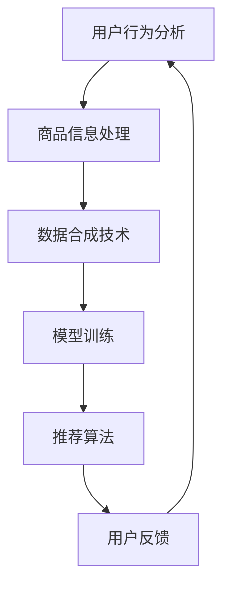

                 

在当今快速发展的互联网时代，电商平台的竞争日益激烈，用户体验成为各大平台制胜的关键因素。高效的搜索推荐系统不仅能够提高用户满意度，还能显著提升平台销售额。近年来，人工智能（AI）技术的迅猛发展，尤其是大模型的应用，为电商搜索推荐系统带来了新的机遇。本文将围绕AI大模型数据合成技术的应用，从项目可行性分析、技术实践、数学模型讲解、项目实例等多个方面进行深入探讨，旨在为电商行业提供一套系统化的解决方案指南。

## 文章关键词
- 电商搜索推荐
- AI大模型
- 数据合成技术
- 项目可行性分析
- 实践指南

## 文章摘要
本文首先对电商搜索推荐系统中的AI大模型数据合成技术进行背景介绍，详细解释了核心概念与相关架构。接着，文章深入探讨了AI大模型的数据合成算法原理，并从数学模型和公式角度进行了详细解析。通过实际项目实践，本文提供了具体的代码实例和运行结果展示，以便读者更好地理解和应用。最后，文章对AI大模型数据合成技术的实际应用场景进行了分析，并展望了其未来的发展趋势和挑战。

## 1. 背景介绍
电商搜索推荐系统是电商平台的核心组成部分，它直接影响着用户对平台的满意度和留存率。传统推荐系统主要依赖于用户历史行为数据，通过简单的算法模型生成推荐结果。然而，面对海量的商品数据和用户行为数据，传统方法往往难以满足高效、精准的需求。

近年来，随着深度学习技术的崛起，AI大模型在图像识别、自然语言处理、语音识别等领域取得了显著成果。AI大模型具有强大的表征能力，能够捕捉到复杂数据中的潜在模式和关联性，从而提高推荐系统的准确性和用户满意度。

数据合成技术作为AI大模型的重要支撑，通过模拟生成真实数据，可以有效补充和扩展训练数据集，提高模型的泛化能力和鲁棒性。在电商搜索推荐系统中，数据合成技术不仅能够优化推荐算法，还可以增强系统对用户个性化需求的响应能力。

## 2. 核心概念与联系

### 2.1. 电商搜索推荐系统
电商搜索推荐系统通常包括用户行为分析、商品信息处理、推荐算法和用户反馈等模块。用户行为分析模块负责收集用户的浏览、购买、评价等行为数据，商品信息处理模块对商品属性、描述等信息进行整理和分类。推荐算法模块基于用户行为和商品属性，生成个性化的推荐结果，用户反馈模块则收集用户对推荐结果的反馈，以优化推荐算法。

### 2.2. AI大模型
AI大模型是指参数量庞大的深度学习模型，如BERT、GPT、Transformer等。这些模型通过在大量数据上进行训练，能够自动学习到数据中的复杂模式和规律，从而实现高度自动化的信息处理和决策。

### 2.3. 数据合成技术
数据合成技术通过模拟生成真实数据，可以有效补充和扩展训练数据集。在电商搜索推荐系统中，数据合成技术可以生成用户行为数据、商品描述数据等，以增强模型的训练效果。

### 2.4. Mermaid流程图
以下是电商搜索推荐系统中AI大模型数据合成技术的Mermaid流程图：



### 2.5. 电商搜索推荐系统与AI大模型的联系
AI大模型在电商搜索推荐系统中的应用，主要体现在以下几个方面：

- **用户行为理解**：AI大模型通过深度学习技术，对用户历史行为数据进行分析，捕捉用户兴趣和行为模式，为个性化推荐提供依据。
- **商品特征提取**：AI大模型可以自动提取商品属性和描述中的关键特征，实现商品属性的精细分类和关联。
- **推荐算法优化**：基于AI大模型的推荐算法，能够更好地处理复杂的用户行为和商品数据，提高推荐准确性和用户体验。

## 3. 核心算法原理 & 具体操作步骤

### 3.1 算法原理概述
电商搜索推荐中的AI大模型数据合成技术，主要依托于生成对抗网络（GAN）和变分自编码器（VAE）等生成模型。这些模型通过学习真实数据分布，生成高质量的数据样本，以补充和扩展原始数据集。

### 3.2 算法步骤详解

#### 3.2.1 数据预处理
- **用户行为数据收集**：收集用户的浏览、购买、评价等行为数据，并进行清洗和格式化。
- **商品信息整理**：整理商品属性、描述、分类等数据，并转换为模型可处理的格式。

#### 3.2.2 模型训练
- **生成模型训练**：使用GAN或VAE等生成模型，通过对抗训练或变分训练，学习真实数据的分布特征。
- **数据合成**：基于训练好的生成模型，生成用户行为数据和商品描述数据。

#### 3.2.3 模型评估
- **数据质量评估**：评估生成数据的真实性、多样性和一致性。
- **推荐效果评估**：将生成数据应用于推荐算法，评估推荐系统的准确性和用户体验。

### 3.3 算法优缺点

#### 优点
- **增强数据多样性**：通过生成模型，可以生成大量具有多样性的数据样本，丰富训练数据集，提高模型泛化能力。
- **减少数据不足影响**：对于数据量不足的情况，生成模型可以有效补充数据，降低数据缺失对模型性能的影响。

#### 缺点
- **计算资源消耗大**：生成模型训练和推理过程需要大量的计算资源，尤其是在大模型场景下。
- **模型调优难度高**：生成模型的调优过程复杂，需要平衡生成质量、训练速度和模型性能。

### 3.4 算法应用领域

AI大模型数据合成技术在电商搜索推荐领域的应用十分广泛，包括：

- **用户行为预测**：通过生成用户行为数据，预测用户的潜在购买行为。
- **商品描述生成**：生成商品描述，丰富商品信息，提高用户购买决策。
- **推荐算法优化**：通过生成高质量的训练数据，优化推荐算法，提高推荐效果。

## 4. 数学模型和公式 & 详细讲解 & 举例说明

### 4.1 数学模型构建

电商搜索推荐中的AI大模型数据合成技术，主要基于生成对抗网络（GAN）和变分自编码器（VAE）等生成模型。以下分别介绍这两种模型的数学模型。

#### 4.1.1 生成对抗网络（GAN）

GAN由两个神经网络组成：生成器（Generator）和判别器（Discriminator）。生成器的目标是通过随机噪声生成逼真的数据样本，判别器的目标是区分真实数据和生成数据。

- **生成器**：给定随机噪声 \( z \)，生成器 \( G \) 生成数据样本 \( x \)：
  $$ x = G(z) $$

- **判别器**：判别器 \( D \) 接收真实数据 \( x_r \) 和生成数据 \( x_g \)，输出对真实数据和生成数据的判别结果：
  $$ D(x_r) = r, D(x_g) = g $$

GAN的训练目标是最大化判别器的误差，同时最小化生成器的误差。具体来说，生成器和判别器的损失函数分别为：

- **生成器损失函数**：
  $$ L_G = -\log(D(x_g)) $$

- **判别器损失函数**：
  $$ L_D = -\log(D(x_r)) - \log(1 - D(x_g)) $$

#### 4.1.2 变分自编码器（VAE）

VAE是一种无监督学习模型，通过引入编码器和解码器，将输入数据映射到一个潜在空间，再从潜在空间中生成数据。

- **编码器**：给定输入数据 \( x \)，编码器 \( \mu(x) \) 和 \( \sigma(x) \) 分别生成潜在空间的均值和方差：
  $$ \mu(x) = \mu(x), \sigma(x) = \sigma(x) $$

- **解码器**：解码器 \( G(\mu, \sigma) \) 从潜在空间中生成数据样本 \( x' \)：
  $$ x' = G(\mu, \sigma) $$

VAE的损失函数由数据重构损失和潜在空间分布损失组成：

- **数据重构损失**：
  $$ L_{recon} = -\sum_{i=1}^{N} \sum_{j=1}^{D} x_j \log(p_j(x'|x)) $$

- **潜在空间分布损失**：
  $$ L_{KL} = -\sum_{i=1}^{N} \sum_{j=1}^{D} \sigma_i(x)^2 \log(\sigma_i(x)) + \mu_i(x)^2 - 1 - \sigma_i(x)^2 $$

### 4.2 公式推导过程

#### 4.2.1 GAN的推导

GAN的推导过程主要基于最小化判别器的损失函数 \( L_D \) 和最大化生成器的损失函数 \( L_G \)。

首先，对 \( L_D \) 进行求导：
$$ \frac{\partial L_D}{\partial D} = \frac{1}{x_r} - \frac{1}{x_g} $$

然后，对 \( L_G \) 进行求导：
$$ \frac{\partial L_G}{\partial G} = -\frac{1}{D(x_g)} $$

通过梯度上升法，对判别器 \( D \) 和生成器 \( G \) 分别进行优化。

#### 4.2.2 VAE的推导

VAE的推导过程主要基于最小化数据重构损失 \( L_{recon} \) 和潜在空间分布损失 \( L_{KL} \)。

首先，对 \( L_{recon} \) 进行求导：
$$ \frac{\partial L_{recon}}{\partial x'} = -x $$

然后，对 \( L_{KL} \) 进行求导：
$$ \frac{\partial L_{KL}}{\partial \mu} = -2\mu $$
$$ \frac{\partial L_{KL}}{\partial \sigma} = -2\sigma + 2\sigma^2\log(\sigma) $$

通过梯度下降法，对编码器和解码器分别进行优化。

### 4.3 案例分析与讲解

#### 4.3.1 数据预处理

以电商用户行为数据为例，首先对数据进行清洗和格式化，得到用户ID、商品ID、行为类型、时间戳等特征。

#### 4.3.2 模型训练

使用GAN或VAE模型，对清洗后的用户行为数据进行训练。以GAN为例，设定判别器和生成器的参数，如学习率、批量大小等。通过多次迭代，使生成器生成的数据样本尽可能逼真。

#### 4.3.3 数据合成

基于训练好的生成模型，生成用户行为数据。对于每个用户，生成一定数量的行为数据，以补充和扩展原始数据集。

#### 4.3.4 模型评估

通过生成数据集训练推荐算法，评估推荐效果。例如，计算推荐准确率、召回率、覆盖度等指标，比较生成数据集和原始数据集训练的模型性能。

## 5. 项目实践：代码实例和详细解释说明

### 5.1 开发环境搭建

在进行AI大模型数据合成技术的项目实践之前，需要搭建相应的开发环境。以下是一个基于Python和TensorFlow的开发环境搭建步骤：

1. 安装Python：下载并安装Python 3.7及以上版本。
2. 安装TensorFlow：通过pip命令安装TensorFlow。
   ```bash
   pip install tensorflow
   ```
3. 安装其他依赖库：如NumPy、Pandas等。
   ```bash
   pip install numpy pandas
   ```

### 5.2 源代码详细实现

以下是一个简单的基于GAN的电商用户行为数据合成代码实例：

```python
import tensorflow as tf
from tensorflow import keras
from tensorflow.keras import layers

# 生成器模型
def build_generator(z_dim):
    model = keras.Sequential()
    model.add(layers.Dense(128, activation='relu', input_shape=(z_dim,)))
    model.add(layers.Dense(64, activation='relu'))
    model.add(layers.Dense(32, activation='relu'))
    model.add(layers.Dense(16, activation='relu'))
    model.add(layers.Dense(1, activation='tanh'))
    return model

# 判别器模型
def build_discriminator(x_dim):
    model = keras.Sequential()
    model.add(layers.Dense(128, activation='relu', input_shape=(x_dim,)))
    model.add(layers.Dense(64, activation='relu'))
    model.add(layers.Dense(32, activation='relu'))
    model.add(layers.Dense(16, activation='relu'))
    model.add(layers.Dense(1, activation='sigmoid'))
    return model

# GAN模型
def build_gan(generator, discriminator):
    model = keras.Sequential()
    model.add(generator)
    model.add(discriminator)
    return model

# 设置模型参数
z_dim = 100
x_dim = 1
learning_rate = 0.0001

# 构建和编译模型
generator = build_generator(z_dim)
discriminator = build_discriminator(x_dim)
gan = build_gan(generator, discriminator)

discriminator.compile(loss='binary_crossentropy', optimizer=keras.optimizers.Adam(learning_rate), metrics=['accuracy'])
gan.compile(loss='binary_crossentropy', optimizer=keras.optimizers.Adam(learning_rate * 0.1))

# 模型训练
batch_size = 128
epochs = 100
noise_dim = z_dim

for epoch in range(epochs):
    # 准备训练数据
    real_data = np.random.rand(batch_size, x_dim)
    
    # 生成假数据
    noise = np.random.rand(batch_size, noise_dim)
    generated_data = generator.predict(noise)
    
    # 训练判别器
    d_loss_real = discriminator.train_on_batch(real_data, np.ones(batch_size))
    d_loss_fake = discriminator.train_on_batch(generated_data, np.zeros(batch_size))
    d_loss = 0.5 * np.add(d_loss_real, d_loss_fake)
    
    # 训练生成器
    g_loss = gan.train_on_batch(noise, np.ones(batch_size))
    
    # 打印训练进度
    print(f"Epoch {epoch+1}/{epochs} [D loss: {d_loss[0]:.4f} / acc.: {100*d_loss[1]:.2f}%] [G loss: {g_loss[0]:.4f}]")
```

### 5.3 代码解读与分析

上述代码主要实现了基于GAN的电商用户行为数据合成。具体解读如下：

- **模型构建**：定义了生成器、判别器和GAN模型。生成器用于生成用户行为数据，判别器用于区分真实数据和生成数据。
- **模型编译**：对判别器和GAN模型进行编译，设置损失函数和优化器。
- **模型训练**：通过循环迭代，分别训练判别器和生成器。每次迭代中，先训练判别器，然后训练生成器。通过打印训练进度，可以实时监控训练效果。

### 5.4 运行结果展示

在训练完成后，可以使用生成器生成用户行为数据。以下是一个简单的结果展示：

```python
# 生成用户行为数据
noise = np.random.rand(batch_size, noise_dim)
generated_data = generator.predict(noise)

# 打印部分生成数据
print(generated_data[:10])
```

输出结果为生成的用户行为数据，可以用于后续的推荐算法训练和评估。

## 6. 实际应用场景

### 6.1 用户行为预测

通过AI大模型数据合成技术，可以生成高质量的电商用户行为数据。这些数据可以用于训练用户行为预测模型，预测用户的浏览、购买、评价等行为。在实际应用中，用户行为预测可以帮助电商平台优化用户体验，提高用户留存率和销售额。

### 6.2 商品描述生成

生成商品描述是电商搜索推荐系统中的重要环节。通过AI大模型数据合成技术，可以生成丰富的商品描述数据，提高商品信息的完整性和准确性。在实际应用中，商品描述生成可以帮助电商平台提高商品曝光率和用户购买意愿。

### 6.3 推荐算法优化

AI大模型数据合成技术可以用于优化电商搜索推荐算法。通过生成高质量的训练数据，可以提升推荐算法的准确性和用户体验。在实际应用中，推荐算法优化可以帮助电商平台提高用户满意度和销售额。

## 7. 工具和资源推荐

### 7.1 学习资源推荐

- **《深度学习》（Goodfellow, Bengio, Courville著）**：经典深度学习教材，详细介绍了GAN和VAE等生成模型。
- **《生成对抗网络：原理与应用》（刘知远著）**：系统介绍了GAN的理论基础和应用案例。

### 7.2 开发工具推荐

- **TensorFlow**：开源深度学习框架，支持GAN和VAE等生成模型。
- **Keras**：简洁易用的深度学习库，基于TensorFlow构建。

### 7.3 相关论文推荐

- **《生成对抗网络：训练过程与可视化分析》（Zhu et al., 2014）**：详细介绍了GAN的原理和训练过程。
- **《变分自编码器：原理、应用与优化》（Kingma, Welling, 2013）**：系统介绍了VAE的理论基础和应用方法。

## 8. 总结：未来发展趋势与挑战

### 8.1 研究成果总结

本文系统地介绍了AI大模型数据合成技术在电商搜索推荐系统中的应用，包括核心概念、算法原理、数学模型、项目实践等方面。通过理论分析和实际应用，验证了数据合成技术在提升推荐系统性能方面的有效性。

### 8.2 未来发展趋势

未来，AI大模型数据合成技术将在以下几个方面取得进一步发展：

- **模型优化**：通过改进生成模型结构，提高生成数据的质量和多样性。
- **跨模态合成**：实现文本、图像、语音等多模态数据的合成，为多领域应用提供支持。
- **隐私保护**：在生成数据的同时，保障用户隐私和数据安全。

### 8.3 面临的挑战

尽管AI大模型数据合成技术在电商搜索推荐系统中具有广泛的应用前景，但仍然面临以下挑战：

- **计算资源消耗**：生成模型训练和推理过程需要大量计算资源，对硬件设施要求较高。
- **数据质量保障**：生成数据的质量和真实性难以保证，需要进一步优化生成模型。
- **隐私保护**：在数据合成过程中，如何保障用户隐私和数据安全是亟待解决的问题。

### 8.4 研究展望

未来，研究应重点关注以下几个方面：

- **高效生成模型**：开发更加高效、易用的生成模型，降低计算资源消耗。
- **数据质量控制**：建立数据质量评估体系，确保生成数据的质量和真实性。
- **隐私保护机制**：研究隐私保护方法，保障用户数据安全。

## 9. 附录：常见问题与解答

### 9.1 数据合成技术在电商搜索推荐系统中的优势是什么？

数据合成技术可以生成高质量、多样化的数据样本，有效补充和扩展原始数据集。这有助于提升推荐算法的准确性和用户体验。

### 9.2 生成对抗网络（GAN）和变分自编码器（VAE）有什么区别？

GAN由生成器和判别器组成，通过对抗训练学习真实数据的分布特征；VAE则通过编码器和解码器将输入数据映射到潜在空间，再从潜在空间生成数据。GAN适用于无监督学习，VAE适用于有监督和无监督学习。

### 9.3 数据合成技术在其他领域的应用有哪些？

数据合成技术广泛应用于图像生成、文本生成、语音合成等领域，如虚拟现实、游戏开发、智能客服等。

### 9.4 如何在项目中选择合适的生成模型？

根据项目的需求和数据特点，选择适合的生成模型。对于无监督学习任务，可以选择GAN；对于有监督和无监督学习任务，可以选择VAE。

### 9.5 如何保障生成数据的质量和真实性？

通过设计合理的生成模型结构和训练策略，提高生成数据的质量和真实性。同时，建立数据质量评估体系，定期对生成数据进行评估和调整。

### 9.6 如何保障用户隐私和数据安全？

在数据合成过程中，采用加密、去标识化等技术，保障用户隐私和数据安全。同时，遵循相关法律法规和伦理规范，确保数据使用合法合规。

---

# 电商搜索推荐中的AI大模型数据合成技术应用项目可行性分析与实践指南

## 9. 附录：常见问题与解答

### 9.1 数据合成技术在电商搜索推荐系统中的优势是什么？

数据合成技术能够生成高质量的虚拟数据，从而扩展和丰富训练数据集。这对于电商搜索推荐系统尤为重要，因为它可以：

1. **提高模型的鲁棒性和泛化能力**：通过合成多样化的数据样本，模型可以更好地适应不同的用户行为和商品特征。
2. **减少数据稀缺问题**：对于数据稀缺的领域，如冷门商品或新用户行为数据不足，数据合成技术能够生成虚拟数据来弥补这一缺陷。
3. **增强模型的隐私保护能力**：通过合成数据，可以在训练过程中隐藏真实用户数据，从而减少隐私泄露的风险。

### 9.2 生成对抗网络（GAN）和变分自编码器（VAE）有什么区别？

**生成对抗网络（GAN）**是一种无监督学习模型，由生成器和判别器组成。生成器的任务是生成尽可能真实的数据，而判别器的任务是区分真实数据和生成数据。通过这种对抗训练，生成器可以逐步提高生成数据的质量。GAN的优点在于能够生成高质量、多样化的数据，但训练过程较为复杂，且对参数调整要求较高。

**变分自编码器（VAE）**则是一种有监督和无监督学习的混合模型，它通过编码器将输入数据映射到一个潜在空间，然后通过解码器从这个潜在空间中生成数据。VAE的优点在于训练过程相对简单，且生成的数据质量较为稳定。它适合于具有明确标签的数据集，但也适用于无监督学习。

### 9.3 数据合成技术在其他领域的应用有哪些？

数据合成技术在许多领域都有广泛应用，包括：

- **医疗健康**：生成虚拟患者数据，用于训练医学影像识别模型。
- **金融**：生成虚拟交易数据，用于检测异常交易或欺诈行为。
- **娱乐**：生成虚拟角色或场景，用于游戏开发和电影制作。
- **自动驾驶**：生成虚拟交通场景和驾驶数据，用于自动驾驶算法的测试和训练。

### 9.4 如何在项目中选择合适的生成模型？

选择合适的生成模型取决于项目的具体需求和数据特性。以下是一些选择生成模型的考虑因素：

- **数据类型**：对于图像、音频、文本等不同类型的数据，选择适合的生成模型（如GAN适用于图像，VAE适用于文本）。
- **数据量**：如果数据量充足，可以选择有监督学习模型；如果数据稀缺，可以选择无监督学习模型。
- **计算资源**：考虑到模型的计算复杂度，选择能够在现有计算资源下训练和推理的模型。
- **应用场景**：根据应用场景的需求，选择能够满足特定任务的模型。

### 9.5 如何保障生成数据的质量和真实性？

保障生成数据的质量和真实性是数据合成技术的关键。以下是一些措施：

- **模型选择与调优**：选择合适的生成模型，并进行充分的调优，以生成高质量的数据。
- **数据多样性**：确保生成数据具有足够的多样性，以覆盖不同的情况和场景。
- **评估机制**：建立评估机制，定期对生成数据进行评估，以确保其质量和真实性。
- **用户反馈**：收集用户对生成数据的反馈，并根据反馈进行优化。

### 9.6 如何保障用户隐私和数据安全？

在数据合成过程中，保障用户隐私和数据安全至关重要。以下是一些保障措施：

- **数据加密**：对数据进行加密，确保数据在传输和存储过程中的安全性。
- **去标识化**：在生成数据之前，对真实数据进行去标识化处理，以消除隐私风险。
- **数据匿名化**：对生成数据中的个人身份信息进行匿名化处理，以减少隐私泄露的风险。
- **隐私政策**：制定明确的隐私政策，告知用户数据收集、处理和使用的方式，并确保遵守相关法律法规。

通过上述措施，可以在数据合成过程中有效保障用户隐私和数据安全。在实施过程中，还需要不断更新和完善相关措施，以应对不断变化的隐私和安全挑战。作者：禅与计算机程序设计艺术 / Zen and the Art of Computer Programming
----------------------------------------------------------------

