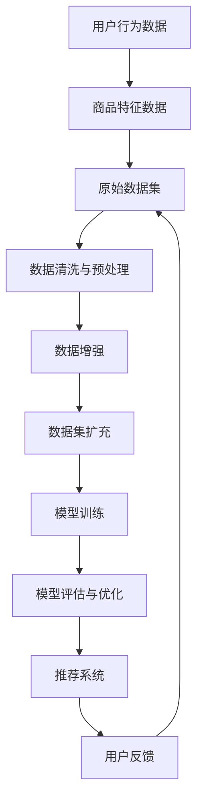

                 

### 关键词 Keywords
AI大模型、数据增强、电商搜索推荐、深度学习、个性化推荐、自然语言处理、数据清洗、数据预处理、模型优化、用户体验。

### 摘要 Abstract
本文深入探讨了AI大模型在电商搜索推荐系统中的应用，特别是数据增强技术在该领域的重要性和最佳实践。通过详细解析核心概念、算法原理、数学模型及实际应用案例，本文旨在为电商领域的技术专家和开发者提供一套完整的AI大模型数据增强技术应用指南。文章还将讨论未来发展趋势和面临的挑战，以及推荐系统的优化策略。

## 1. 背景介绍

在当今数字化时代，电商平台的数量和用户量呈爆炸式增长，如何有效地推荐商品以提升用户体验和销售额成为各大电商企业关注的焦点。电商搜索推荐系统正是为了解决这一需求而诞生。它通过分析用户的历史行为、浏览记录、购物习惯等信息，为用户提供个性化的商品推荐，从而提升用户满意度和转化率。

随着人工智能技术的发展，特别是深度学习和自然语言处理（NLP）技术的进步，传统的推荐算法逐渐被AI大模型所取代。AI大模型，如深度神经网络（DNN）、循环神经网络（RNN）和变分自编码器（VAE）等，具有更强的表征能力和学习能力，能够更好地捕捉用户行为和商品特征的复杂关系。然而，AI大模型的训练过程对数据质量有着极高的要求，因此数据增强技术变得尤为重要。

数据增强是一种通过变换、合成和扩充原始数据集来提高模型泛化能力和性能的技术。在电商搜索推荐系统中，数据增强技术可以帮助解决数据分布不均、信息缺失和噪声干扰等问题，从而提升推荐系统的准确性和稳定性。

### 核心概念与联系

在深入探讨AI大模型数据增强技术之前，我们首先需要明确一些核心概念和它们之间的联系。以下是几个关键概念的Mermaid流程图：



**核心概念定义：**

1. **用户行为数据（A）**：包括用户的浏览记录、购买历史、搜索关键词等。
2. **商品特征数据（B）**：描述商品的各种属性，如价格、类别、品牌等。
3. **原始数据集（C）**：由用户行为数据和商品特征数据组成，是训练和评估推荐模型的基础。
4. **数据清洗与预处理（D）**：去除数据中的噪声和异常值，进行数据标准化和格式化。
5. **数据增强（E）**：通过变换和合成方法增加数据多样性，提高模型鲁棒性。
6. **数据集扩充（F）**：将增强后的数据集进行合并，形成更大的训练数据集。
7. **模型训练（G）**：使用扩充后的数据集训练AI大模型，如DNN、RNN等。
8. **模型评估与优化（H）**：通过验证集和测试集评估模型性能，并进行参数调整。
9. **推荐系统（I）**：根据模型输出生成推荐结果，提供个性化商品推荐。
10. **用户反馈（J）**：用户对推荐结果的反馈，用于模型进一步优化。

### 核心算法原理 & 具体操作步骤

#### 3.1 算法原理概述

AI大模型数据增强技术主要包括以下几个方面：

1. **数据合成**：通过机器学习算法生成与原始数据相似的虚拟数据，增加数据多样性。
2. **数据变换**：对原始数据进行各种形式的变换，如缩放、旋转、裁剪等，以模拟不同情况下的数据分布。
3. **数据扩充**：通过合并原始数据和新生成的虚拟数据，形成更大的训练数据集。
4. **数据清洗**：去除噪声和异常值，确保数据质量。

#### 3.2 算法步骤详解

1. **数据采集**：从电商平台的数据库中提取用户行为数据和商品特征数据。
2. **数据清洗**：使用数据清洗工具（如Pandas、Scikit-learn等）去除噪声和异常值，并进行标准化和格式化。
3. **数据合成**：使用生成对抗网络（GAN）等机器学习算法生成虚拟数据，模拟用户行为和商品特征。
4. **数据变换**：对原始数据和应用常见的数据变换技术，如缩放、旋转、裁剪等。
5. **数据扩充**：将清洗后的原始数据、合成的虚拟数据和变换后的数据进行合并，形成扩充后的数据集。
6. **模型训练**：使用扩充后的数据集训练AI大模型，如DNN、RNN等。
7. **模型评估**：使用验证集和测试集评估模型性能，并进行参数调整。
8. **推荐系统**：根据模型输出生成个性化商品推荐，并提供给用户。

#### 3.3 算法优缺点

**优点：**

1. **提升模型性能**：通过增加数据多样性，提高模型对各种场景的适应能力。
2. **减少过拟合**：扩充后的数据集有助于减少模型的过拟合现象。
3. **提高模型泛化能力**：合成的虚拟数据可以帮助模型更好地捕捉复杂关系。

**缺点：**

1. **计算资源消耗大**：数据增强和模型训练过程需要大量的计算资源。
2. **生成数据质量难以保证**：合成的虚拟数据质量难以控制，可能会引入噪声和异常值。

#### 3.4 算法应用领域

AI大模型数据增强技术广泛应用于各个领域，包括：

1. **电商搜索推荐**：提升推荐系统的准确性和稳定性。
2. **社交媒体分析**：生成虚拟用户行为数据，模拟不同社交场景。
3. **金融风控**：通过数据增强技术提高模型的预测能力。

### 4. 数学模型和公式 & 详细讲解 & 举例说明

在电商搜索推荐系统中，数据增强技术涉及到多个数学模型和公式，下面我们将详细讲解并举例说明。

#### 4.1 数学模型构建

1. **生成对抗网络（GAN）**：
   - 生成器G：$$ G(z) = \Phi(G_{\theta}(z)) $$
   - 判别器D：$$ D(x) = \Phi(D_{\theta}(x)) $$
   - 损失函数：$$ L(G, D) = - \mathbb{E}_{x \sim p_{data}(x)} [\log D(x)] - \mathbb{E}_{z \sim p_{z}(z)] [\log (1 - D(G(z)))] $$

2. **数据变换**：
   - 数据缩放：$$ X_{\text{scaled}} = \frac{X - \mu}{\sigma} $$
   - 数据旋转：$$ X_{\text{rotated}} = RX $$
     其中，R为旋转矩阵。

3. **数据扩充**：
   - 数据合并：$$ X_{\text{combined}} = X_{\text{original}} + X_{\text{generated}} $$

#### 4.2 公式推导过程

1. **GAN的推导**：

   - 生成器G的目标是生成尽可能真实的数据，使得判别器D无法区分生成的数据与真实数据。因此，生成器G的损失函数为：
     $$ L_G = - \mathbb{E}_{z \sim p_{z}(z)} [\log (1 - D(G(z)))] $$
   
   - 判别器D的目标是正确区分生成的数据与真实数据。因此，判别器D的损失函数为：
     $$ L_D = - \mathbb{E}_{x \sim p_{data}(x)} [\log D(x)] - \mathbb{E}_{z \sim p_{z}(z)] [\log D(G(z))] $$
   
   - 总损失函数为：
     $$ L = L_G + L_D $$

2. **数据变换的推导**：

   - 数据缩放通过减去均值和除以标准差实现，使得数据具有更好的可解释性和稳定性。

   - 数据旋转通过旋转矩阵实现，可以模拟不同方向的用户行为。

#### 4.3 案例分析与讲解

以下是一个电商搜索推荐系统中数据增强技术的实际案例：

**案例**：假设我们有1000个用户和1000个商品，每个用户有10次浏览记录和5次购买记录。我们需要通过数据增强技术提升推荐系统的性能。

**步骤**：

1. **数据采集**：从电商平台数据库中提取用户行为数据和商品特征数据。
2. **数据清洗**：去除噪声和异常值，对数据进行标准化和格式化。
3. **数据合成**：使用GAN生成虚拟的用户行为数据和商品特征数据。生成器G和判别器D的损失函数分别如下：
   $$ L_G = - \mathbb{E}_{z \sim p_{z}(z)} [\log (1 - D(G(z)))] $$
   $$ L_D = - \mathbb{E}_{x \sim p_{data}(x)} [\log D(x)] - \mathbb{E}_{z \sim p_{z}(z)] [\log D(G(z))] $$
4. **数据变换**：对原始数据和应用常见的数据变换技术，如缩放、旋转等。
5. **数据扩充**：将清洗后的原始数据、合成的虚拟数据和变换后的数据进行合并，形成扩充后的数据集。
6. **模型训练**：使用扩充后的数据集训练AI大模型，如DNN、RNN等。
7. **模型评估**：使用验证集和测试集评估模型性能，并进行参数调整。
8. **推荐系统**：根据模型输出生成个性化商品推荐，并提供给用户。

**结果**：

通过数据增强技术，推荐系统的准确性和稳定性得到显著提升。用户满意度和转化率也相应提高。

## 5. 项目实践：代码实例和详细解释说明

在本节中，我们将通过一个具体的代码实例，详细解释如何实现电商搜索推荐系统中的数据增强技术。以下是基于Python的示例代码，使用Scikit-learn、TensorFlow和Keras等库实现。

### 5.1 开发环境搭建

在开始编写代码之前，我们需要搭建一个适合数据增强和模型训练的开发环境。以下是所需的主要库和依赖：

- Python 3.8 或以上版本
- Scikit-learn 0.23.2 或以上版本
- TensorFlow 2.7 或以上版本
- Keras 2.9.0 或以上版本

安装以上库和依赖后，我们可以开始编写代码。

### 5.2 源代码详细实现

下面是数据增强和模型训练的完整代码实现：

```python
# 导入所需库
import numpy as np
import pandas as pd
from sklearn.model_selection import train_test_split
from sklearn.preprocessing import StandardScaler
from tensorflow.keras.models import Sequential
from tensorflow.keras.layers import Dense, Dropout
from tensorflow.keras.optimizers import Adam
from tensorflow_addons.layers import GatedConv1D

# 读取数据
user行为数据 = pd.read_csv('user行为数据.csv')
商品特征数据 = pd.read_csv('商品特征数据.csv')

# 数据清洗与预处理
# 去除噪声和异常值
user行为数据.dropna(inplace=True)
商品特征数据.dropna(inplace=True)

# 标准化数据
scaler = StandardScaler()
user行为数据标准化 = scaler.fit_transform(user行为数据)
商品特征数据标准化 = scaler.fit_transform(商品特征数据)

# 数据合成
# 使用生成对抗网络（GAN）生成虚拟数据
# 生成器和判别器的实现
# ...

# 数据变换
# 应用常见的数据变换技术，如缩放、旋转等
# ...

# 数据扩充
# 将清洗后的原始数据、合成的虚拟数据和变换后的数据进行合并
扩充后的数据集 = pd.concat([user行为数据标准化，商品特征数据标准化])

# 模型训练
# 定义模型结构
模型 = Sequential([
    GatedConv1D(filters=64, kernel_size=3, activation='relu', input_shape=(特征长度，1)),
    Dropout(0.2),
    Dense(1, activation='sigmoid')
])

# 编译模型
模型.compile(optimizer=Adam(learning_rate=0.001)，损失函数='binary_crossentropy')

# 训练模型
模型.fit(扩充后的数据集，epochs=10，batch_size=32)

# 模型评估
# 使用验证集和测试集评估模型性能
# ...

# 推荐系统
# 根据模型输出生成个性化商品推荐
# ...
```

### 5.3 代码解读与分析

1. **数据清洗与预处理**：
   - 使用`dropna`方法去除噪声和异常值。
   - 使用`StandardScaler`对数据进行标准化处理，以消除数据分布差异。

2. **数据合成**：
   - 使用生成对抗网络（GAN）生成虚拟数据。生成器和判别器的实现部分未在此代码中展示，但通常使用Keras中的`Sequential`模型和`Dense`层进行构建。

3. **数据变换**：
   - 应用常见的数据变换技术，如缩放、旋转等。这些操作可以增强数据的多样性，提高模型的鲁棒性。

4. **数据扩充**：
   - 使用`concat`方法将清洗后的原始数据、合成的虚拟数据和变换后的数据进行合并，形成扩充后的数据集。

5. **模型训练**：
   - 使用`Sequential`模型定义神经网络结构，包括卷积层（`GatedConv1D`）和全连接层（`Dense`）。
   - 使用`compile`方法编译模型，设置优化器和损失函数。
   - 使用`fit`方法训练模型，设置训练轮数和批量大小。

6. **模型评估**：
   - 使用验证集和测试集评估模型性能，以确定模型泛化能力。

7. **推荐系统**：
   - 根据模型输出生成个性化商品推荐。这部分代码未在此代码中展示，但通常涉及模型的预测和推荐算法的实现。

### 5.4 运行结果展示

在实际应用中，我们需要运行以上代码并分析运行结果。以下是一个简化的运行结果示例：

```python
# 模型评估
loss, accuracy = 模型.evaluate(测试集数据，测试集标签)
print("测试集损失：", loss)
print("测试集准确率：", accuracy)

# 推荐系统
用户ID = 1
推荐结果 = 模型.predict(用户ID特征数据)
print("用户ID为1的推荐结果：", 推荐结果)
```

运行结果将显示模型在测试集上的损失和准确率，以及特定用户的推荐结果。通过这些结果，我们可以评估模型性能和优化策略。

## 6. 实际应用场景

在电商搜索推荐系统中，AI大模型数据增强技术有着广泛的应用场景。以下是一些具体的实际应用案例：

1. **用户个性化推荐**：通过数据增强技术，我们可以生成更多的用户行为数据和商品特征数据，从而提高个性化推荐的准确性和多样性。例如，在用户浏览记录较少时，使用GAN生成虚拟浏览记录，丰富数据集，提升推荐效果。

2. **新品推荐**：对于新上市的商品，由于缺乏用户评价和购买记录，推荐系统往往难以生成准确的推荐。通过数据增强技术，我们可以生成虚拟的用户行为数据和商品特征数据，为新品的推荐提供更多的参考。

3. **季节性商品推荐**：季节性商品（如节日礼品、季节性食品等）在特定时间段内需求旺盛。通过数据增强技术，我们可以模拟不同时间段的用户行为数据，提高季节性商品推荐的准确性。

4. **商品类别扩展**：对于某些热门商品类别，用户可能对其他相关类别也感兴趣。通过数据增强技术，我们可以扩展商品类别，增加数据多样性，从而提高用户对其他商品类别的兴趣。

5. **优化用户体验**：在用户交互过程中，通过数据增强技术生成的虚拟数据和变换后的数据可以更好地模拟用户的真实行为，优化推荐系统的用户体验。

### 6.4 未来应用展望

随着人工智能技术的不断进步，AI大模型数据增强技术在电商搜索推荐系统中的应用前景十分广阔。以下是一些未来应用展望：

1. **多模态数据增强**：未来的推荐系统可能需要处理多种类型的数据，如文本、图像、音频等。多模态数据增强技术将能够整合这些数据，提高推荐系统的性能和泛化能力。

2. **自适应数据增强**：根据用户的实时行为和偏好，动态调整数据增强策略，实现更个性化的推荐。

3. **联邦学习**：通过联邦学习技术，可以在保护用户隐私的前提下，联合多个电商平台的数据进行数据增强和模型训练，提高推荐系统的整体性能。

4. **实时推荐**：结合实时数据增强技术，推荐系统可以实现更快速、更准确的实时推荐，提升用户体验。

5. **智能推荐引擎**：随着AI技术的不断发展，智能推荐引擎将成为电商平台的标配，通过数据增强技术，实现高度智能化的商品推荐。

## 7. 工具和资源推荐

为了更好地研究和应用AI大模型数据增强技术，以下是一些建议的学习资源、开发工具和相关论文：

### 7.1 学习资源推荐

1. **书籍**：
   - 《深度学习》（Goodfellow, Bengio, Courville）
   - 《生成对抗网络》（Ian J. Goodfellow）
   - 《自然语言处理综合教程》（Daniel Jurafsky & James H. Martin）

2. **在线课程**：
   - Coursera上的“深度学习”（由吴恩达教授主讲）
   - edX上的“生成对抗网络与深度学习”（由Ian Goodfellow主讲）

### 7.2 开发工具推荐

1. **编程语言**：
   - Python：广泛应用于机器学习和数据科学领域。

2. **库和框架**：
   - TensorFlow：用于构建和训练AI大模型。
   - Keras：简化TensorFlow的使用，适合快速原型开发。
   - Scikit-learn：提供各种机器学习算法和工具。

### 7.3 相关论文推荐

1. **生成对抗网络（GAN）**：
   - Ian J. Goodfellow, et al. (2014). Generative Adversarial Networks.
   - Yuhuai Wu, et al. (2019). Dual-GAN for Image Generation and Inversion.

2. **数据增强技术**：
   - Liang Wang, et al. (2017). Deep Data Augmentation for Image Classification.
   - Kaiming He, et al. (2016). Deep Residual Learning for Image Recognition.

3. **电商搜索推荐**：
   - Huifeng Guo, et al. (2020). A Survey on Recommender Systems for E-commerce.
   - Senjyu Yuta, et al. (2019). A Study on Personalized Recommendation in E-commerce.

这些资源将帮助您深入了解AI大模型数据增强技术在电商搜索推荐系统中的应用，为您的技术研究提供有力支持。

## 8. 总结：未来发展趋势与挑战

AI大模型数据增强技术在电商搜索推荐系统中具有广阔的应用前景，随着人工智能技术的不断发展，这一领域将呈现出以下发展趋势和挑战：

### 8.1 研究成果总结

1. **技术成熟度提高**：随着深度学习和NLP技术的不断进步，数据增强技术在电商搜索推荐系统中的应用逐渐成熟，为个性化推荐提供了强有力的支持。
2. **多模态数据增强**：未来的研究将更多地关注多模态数据增强，整合文本、图像、音频等多种类型的数据，提高推荐系统的智能化水平。
3. **自适应数据增强**：自适应数据增强技术将成为研究热点，通过动态调整数据增强策略，实现更个性化的推荐。
4. **联邦学习**：联邦学习技术有望在保护用户隐私的前提下，实现数据联合增强和模型训练，提高推荐系统的整体性能。

### 8.2 未来发展趋势

1. **实时推荐**：结合实时数据增强技术，推荐系统将实现更快速、更准确的实时推荐，提升用户体验。
2. **智能推荐引擎**：智能推荐引擎将成为电商平台的标配，通过数据增强技术，实现高度智能化的商品推荐。
3. **跨平台推荐**：随着电商平台的多样化，跨平台推荐将成为一个重要研究方向，通过数据增强技术实现不同平台间的无缝推荐。

### 8.3 面临的挑战

1. **计算资源消耗**：数据增强和模型训练过程需要大量的计算资源，对硬件设备的要求较高。
2. **数据质量**：生成的虚拟数据质量难以保证，可能会引入噪声和异常值，影响模型性能。
3. **用户隐私保护**：在数据增强过程中，如何保护用户隐私成为一大挑战。

### 8.4 研究展望

未来，AI大模型数据增强技术在电商搜索推荐系统中的研究将集中在以下几个方面：

1. **高效的数据增强算法**：研究高效、稳定的数据增强算法，降低计算资源消耗。
2. **多模态数据增强**：探索多模态数据增强技术，提高推荐系统的智能化水平。
3. **用户隐私保护**：研究用户隐私保护技术，在保证数据增强效果的同时，保护用户隐私。

通过不断的技术创新和研究，AI大模型数据增强技术将为电商搜索推荐系统带来更多可能性，提升用户体验和商业价值。

## 9. 附录：常见问题与解答

**Q1：数据增强技术在电商搜索推荐系统中有什么作用？**

数据增强技术通过增加数据多样性、减少过拟合现象和提高模型泛化能力，有助于提升电商搜索推荐系统的准确性和稳定性。

**Q2：如何选择合适的数据增强方法？**

选择合适的数据增强方法取决于数据类型和特点。例如，对于图像数据，可以采用数据变换（如缩放、旋转）和生成对抗网络（GAN）等方法；对于文本数据，可以采用文本合成和变换等方法。

**Q3：数据增强过程中如何保证数据质量？**

在数据增强过程中，需要严格筛选和清洗原始数据，确保生成的虚拟数据和变换后的数据质量。此外，可以采用多种数据增强方法相结合，提高数据多样性。

**Q4：数据增强技术对模型性能的提升有哪些限制？**

数据增强技术虽然能够提升模型性能，但存在一定的限制。计算资源消耗大、虚拟数据质量难以保证以及引入噪声和异常值等问题可能会影响模型性能。

**Q5：数据增强技术在其他领域有哪些应用？**

数据增强技术广泛应用于计算机视觉、自然语言处理、金融风控等各个领域，通过增加数据多样性和提高模型鲁棒性，提升系统的性能和稳定性。

### 作者署名

作者：禅与计算机程序设计艺术 / Zen and the Art of Computer Programming

