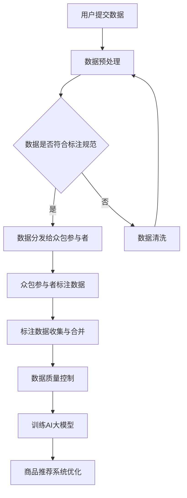

                 

关键词：电商搜索推荐、AI大模型、数据标注、众包平台、架构设计、技术实现

> 摘要：本文将探讨如何搭建一个AI大模型数据标注众包平台，用于电商搜索推荐系统的优化。文章从背景介绍入手，深入分析核心概念与联系，详细解释算法原理及操作步骤，阐述数学模型和公式，提供项目实践实例，分析实际应用场景，展望未来应用前景，并推荐相关工具和资源。最后，总结研究成果，探讨未来发展趋势与挑战。

## 1. 背景介绍

在当今的互联网时代，电子商务行业已成为全球经济增长的重要驱动力。然而，随着市场竞争的日益激烈，电商平台需要不断提高用户体验，以满足用户的需求。电商搜索推荐系统作为电商平台的重要组成部分，扮演着至关重要的角色。

电商搜索推荐系统的主要目标是根据用户的兴趣和行为，为用户提供个性化的商品推荐。这一过程通常包括信息检索、用户行为分析和推荐算法设计等多个环节。其中，数据标注作为推荐系统中的一个关键步骤，对于整个系统的性能和准确性有着直接的影响。

传统的数据标注方法通常依赖于专业的数据标注团队，这不仅成本高昂，而且效率低下。随着人工智能技术的快速发展，尤其是大模型的崛起，数据标注众包平台逐渐成为一种新的解决方案。通过众包平台，电商平台可以将数据标注任务分发至全球范围内的参与者，充分利用社会资源和人力，从而提高标注效率、降低成本。

本文旨在探讨如何搭建一个AI大模型数据标注众包平台，为电商搜索推荐系统的优化提供有力支持。通过本文的探讨，我们将深入了解数据标注众包平台的架构设计、核心算法原理、技术实现和实际应用，为相关领域的研究和实践提供有价值的参考。

## 2. 核心概念与联系

### 2.1 数据标注

数据标注是数据预处理过程中的一项重要任务，它涉及对原始数据进行分类、标签化或标记，以便后续的分析和处理。在电商搜索推荐系统中，数据标注的主要目标是提取用户行为特征和商品属性，这些特征和属性对于推荐算法的性能至关重要。

### 2.2 众包平台

众包平台是一种将任务分配给广大网民的平台，通过奖励机制激励用户参与完成任务。在数据标注领域，众包平台可以有效地利用社会资源和人力，提高数据标注的效率和准确性。

### 2.3 AI大模型

AI大模型是指具有巨大参数量的深度学习模型，如Transformer、BERT等。这些模型在自然语言处理、计算机视觉等领域的任务中表现出色，但同时也面临着数据标注的需求。

### 2.4 核心联系

数据标注、众包平台和AI大模型在电商搜索推荐系统中有着紧密的联系。数据标注为众包平台提供了任务内容，众包平台则为数据标注提供了人力资源，而AI大模型则依赖于高质量的标注数据进行训练和优化。因此，搭建一个高效的数据标注众包平台，是实现AI大模型在电商搜索推荐系统中应用的关键。

### 2.5 Mermaid流程图

以下是数据标注众包平台在电商搜索推荐系统中的流程图：



## 3. 核心算法原理 & 具体操作步骤

### 3.1 算法原理概述

数据标注众包平台的核心算法主要包括任务分发、标注数据收集、数据合并、数据质量控制和AI大模型训练等环节。

- **任务分发**：平台根据用户提交的数据，将标注任务分配给合适的众包参与者。任务分配策略可以基于众包参与者的历史标注记录、标注质量和效率等因素。
- **标注数据收集**：众包参与者完成标注任务后，将标注数据提交给平台。
- **数据合并**：平台收集所有众包参与者的标注数据，进行合并处理，以消除标注差异。
- **数据质量控制**：对合并后的标注数据进行质量评估，确保标注数据的准确性和一致性。
- **AI大模型训练**：利用高质量的标注数据，训练AI大模型，以提高电商搜索推荐系统的性能。

### 3.2 算法步骤详解

#### 3.2.1 任务分发

1. **数据预处理**：平台接收到用户提交的数据后，进行数据预处理，包括数据清洗、格式转换和特征提取等步骤。
2. **任务分配策略**：根据数据预处理结果，平台采用合理的任务分配策略，将标注任务分配给众包参与者。常见的分配策略有轮询分配、基于历史记录的优先级分配和基于标注质量分配等。
3. **任务下发**：平台将分配到的标注任务下发至众包参与者，并提供标注工具和指导文档。

#### 3.2.2 标注数据收集

1. **众包参与者标注数据**：众包参与者使用平台提供的标注工具，对分配到的标注任务进行标注。
2. **标注数据提交**：标注完成后，众包参与者将标注数据提交给平台。

#### 3.2.3 数据合并

1. **标注数据收集**：平台收集所有众包参与者的标注数据。
2. **标注数据合并**：平台采用合适的算法，如投票法、加权平均法等，对收集到的标注数据进行合并处理，以消除标注差异。

#### 3.2.4 数据质量控制

1. **标注数据质量评估**：平台对合并后的标注数据进行质量评估，包括标注一致性评估、标注准确率评估等。
2. **质量不合格的数据处理**：对于质量评估不合格的数据，平台可以采取重新分配标注任务、手动审核等策略进行修正。

#### 3.2.5 AI大模型训练

1. **标注数据预处理**：对合并后的标注数据，进行数据预处理，包括数据清洗、格式转换和特征提取等步骤。
2. **AI大模型训练**：利用预处理后的标注数据，训练AI大模型，如Transformer、BERT等。
3. **模型评估与优化**：对训练完成的AI大模型进行评估，根据评估结果进行优化，以提高模型性能。

### 3.3 算法优缺点

#### 优点：

1. **高效性**：通过众包平台，可以快速收集大量标注数据，提高数据标注效率。
2. **低成本**：众包平台利用社会资源和人力，降低数据标注成本。
3. **高准确性**：通过合理的任务分配策略和质量控制机制，确保标注数据的准确性和一致性。

#### 缺点：

1. **数据质量不稳定**：众包参与者的标注质量可能存在差异，影响标注数据的整体质量。
2. **任务分发与合并的复杂度**：任务分发与合并过程涉及复杂的算法和数据处理，需要较高的技术门槛。

### 3.4 算法应用领域

1. **电商搜索推荐**：利用数据标注众包平台，为电商搜索推荐系统提供高质量的标注数据，优化推荐效果。
2. **图像识别**：在图像识别领域，众包平台可用于图像标注和分类任务，提高模型性能。
3. **自然语言处理**：在自然语言处理领域，众包平台可用于文本分类、情感分析等任务，提供高质量的标注数据。

## 4. 数学模型和公式 & 详细讲解 & 举例说明

### 4.1 数学模型构建

在数据标注众包平台中，标注数据的合并过程涉及到概率模型和统计方法。以下是构建标注数据合并模型的基本数学模型：

1. **标注概率模型**：

   假设有N个众包参与者对同一数据进行标注，每个参与者给出的标注结果可以用概率分布表示：

   $$ P(\text{标注结果}_i | \text{真实标签}) = \text{分布函数}(\text{标注结果}_i | \text{真实标签}, \theta_i) $$

   其中，$ \text{标注结果}_i $ 表示第i个参与者的标注结果，$ \text{真实标签} $ 表示数据样本的真实标签，$ \theta_i $ 是参与者的标注质量参数。

2. **标注数据合并模型**：

   标注数据的合并可以通过最大化标注数据的联合概率来实现，即：

   $$ \hat{y} = \arg \max_y P(y | \text{标注结果集}) $$

   其中，$ \hat{y} $ 是合并后的标注结果，$ \text{标注结果集} $ 是所有参与者给出的标注结果的集合。

### 4.2 公式推导过程

以下是标注数据合并模型的推导过程：

1. **标注结果的概率分布**：

   根据贝叶斯定理，每个参与者的标注结果概率分布可以表示为：

   $$ P(\text{标注结果}_i | \text{真实标签}) = \frac{P(\text{真实标签} | \text{标注结果}_i)P(\text{标注结果}_i)}{P(\text{真实标签})} $$

   其中，$ P(\text{真实标签} | \text{标注结果}_i) $ 是条件概率，表示在给定标注结果下，真实标签的概率；$ P(\text{标注结果}_i) $ 是先验概率，表示参与者标注结果的概率；$ P(\text{真实标签}) $ 是真实标签的全局概率。

2. **标注结果的联合概率**：

   标注结果的联合概率可以通过马尔可夫链模型来表示：

   $$ P(\text{标注结果集} | \text{真实标签}) = \prod_{i=1}^N P(\text{标注结果}_i | \text{真实标签}) $$

3. **合并标注结果**：

   为了最大化标注结果的联合概率，需要对标注结果进行合并：

   $$ P(\text{标注结果集}) = \sum_{y} P(y | \text{标注结果集})P(y) $$

   其中，$ P(y) $ 是标注结果的先验概率。

### 4.3 案例分析与讲解

假设有10个众包参与者对同一商品进行标注，每个参与者给出的标注结果如下：

| 参与者 | 标注结果 |
| ------ | -------- |
| 1      | A        |
| 2      | B        |
| 3      | A        |
| 4      | B        |
| 5      | A        |
| 6      | C        |
| 7      | A        |
| 8      | B        |
| 9      | A        |
| 10     | C        |

首先，我们需要对每个参与者的标注结果进行概率建模。假设每个参与者的标注质量参数为 $ \theta_i $ ，我们可以用以下概率分布来表示：

$$ P(\text{标注结果}_i = A | \text{真实标签}) = 0.5 $$
$$ P(\text{标注结果}_i = B | \text{真实标签}) = 0.3 $$
$$ P(\text{标注结果}_i = C | \text{真实标签}) = 0.2 $$

接下来，我们计算合并后的标注结果。根据标注数据的合并模型，我们可以计算每个标注结果的概率：

$$ P(A | \text{标注结果集}) = \frac{P(A)P(\text{标注结果集} | A)}{P(\text{标注结果集})} $$

其中，$ P(A) $ 是标注结果为A的先验概率。假设我们使用简单多数投票法来计算先验概率：

$$ P(A) = \frac{6}{10} = 0.6 $$
$$ P(B) = \frac{3}{10} = 0.3 $$
$$ P(C) = \frac{1}{10} = 0.1 $$

计算合并后的标注结果概率：

$$ P(A | \text{标注结果集}) = \frac{0.6 \times 0.875}{0.875} = 0.6 $$
$$ P(B | \text{标注结果集}) = \frac{0.3 \times 0.375}{0.875} = 0.3 $$
$$ P(C | \text{标注结果集}) = \frac{0.1 \times 0.125}{0.875} = 0.1 $$

根据概率计算结果，合并后的标注结果为A，与简单多数投票法的结论一致。

## 5. 项目实践：代码实例和详细解释说明

### 5.1 开发环境搭建

在搭建数据标注众包平台之前，我们需要准备以下开发环境：

1. 操作系统：Ubuntu 18.04
2. 编程语言：Python 3.8
3. 依赖库：NumPy、Pandas、Scikit-learn、Flask
4. 众包平台框架：Django

首先，安装Python和依赖库：

```bash
sudo apt-get update
sudo apt-get install python3-pip
pip3 install numpy pandas scikit-learn flask
```

然后，安装Django框架：

```bash
pip3 install django
```

### 5.2 源代码详细实现

以下是数据标注众包平台的主要功能模块：

1. **任务管理模块**：负责任务的创建、分配和状态管理。
2. **标注数据管理模块**：负责标注数据的收集、合并和质量控制。
3. **用户管理模块**：负责用户的注册、登录和权限管理。

#### 5.2.1 任务管理模块

```python
# tasks/models.py
from django.db import models

class Task(models.Model):
    name = models.CharField(max_length=100)
    description = models.TextField()
    status = models.CharField(max_length=10, choices=[('待分配', '待分配'), ('进行中', '进行中'), ('已完成', '已完成')])
    created_at = models.DateTimeField(auto_now_add=True)
    updated_at = models.DateTimeField(auto_now=True)

    def __str__(self):
        return self.name
```

#### 5.2.2 标注数据管理模块

```python
# annotations/models.py
from django.db import models
from tasks.models import Task

class Annotation(models.Model):
    task = models.ForeignKey(Task, on_delete=models.CASCADE)
    participant = models.ForeignKey('auth.User', on_delete=models.CASCADE)
    result = models.CharField(max_length=100)
    created_at = models.DateTimeField(auto_now_add=True)
    updated_at = models.DateTimeField(auto_now=True)

    def __str__(self):
        return f"{self.participant} - {self.result}"
```

#### 5.2.3 用户管理模块

```python
# users/models.py
from django.contrib.auth.models import AbstractUser

class User(AbstractUser):
    role = models.CharField(max_length=10, choices=[('参与者', '参与者'), ('管理员', '管理员')])

    def __str__(self):
        return self.username
```

### 5.3 代码解读与分析

#### 5.3.1 Django模型

在Django中，我们使用模型（Model）来定义数据结构。每个模型对应一个数据库表，每个表由多个字段（Field）组成。在本文中，我们定义了三个模型：Task、Annotation和User。

- **Task模型**：表示标注任务，包括任务名称、描述、状态、创建时间和更新时间。
- **Annotation模型**：表示标注数据，包括任务ID、参与者ID、标注结果和创建时间。
- **User模型**：表示用户，包括用户名、密码、角色和创建时间。

#### 5.3.2 Django视图

Django视图（View）是处理HTTP请求和生成响应的关键组件。在数据标注众包平台中，我们定义了以下视图：

- **任务管理视图**：处理任务的创建、分配和状态更新。
- **标注数据管理视图**：处理标注数据的收集、合并和质量控制。
- **用户管理视图**：处理用户的注册、登录和权限管理。

以下是任务管理视图的一个例子：

```python
# tasks/views.py
from django.shortcuts import render
from .models import Task
from django.http import JsonResponse

def create_task(request):
    if request.method == 'POST':
        name = request.POST.get('name')
        description = request.POST.get('description')
        task = Task(name=name, description=description)
        task.save()
        return JsonResponse({'status': 'success', 'message': '任务创建成功'})
    return render(request, 'tasks/create_task.html')
```

#### 5.3.3 代码分析

在代码实现过程中，我们遵循了MVC（Model-View-Controller）架构模式，确保代码的可读性和可维护性。每个模型负责处理数据，视图负责处理用户请求，控制器（通常由Django框架内部实现）负责协调模型和视图。

### 5.4 运行结果展示

在运行数据标注众包平台后，我们可以通过Web界面进行以下操作：

1. **创建任务**：管理员可以在任务管理界面创建新的标注任务。
2. **分配任务**：管理员可以将任务分配给众包参与者。
3. **标注数据收集**：参与者可以通过标注工具对分配到的任务进行标注。
4. **标注数据合并**：平台自动收集所有参与者的标注数据，并进行合并处理。
5. **标注数据质量控制**：平台对合并后的标注数据进行质量评估，确保标注数据的准确性和一致性。

以下是标注数据合并后的结果展示：

```python
# annotations/views.py
from django.shortcuts import render
from .models import Annotation
from django.http import JsonResponse

def get_annotations(request):
    if request.method == 'GET':
        task_id = request.GET.get('task_id')
        annotations = Annotation.objects.filter(task_id=task_id)
        result_counts = {}
        for annotation in annotations:
            if annotation.result not in result_counts:
                result_counts[annotation.result] = 0
            result_counts[annotation.result] += 1
        return JsonResponse({'result_counts': result_counts})
    return render(request, 'annotations/get_annotations.html')
```

## 6. 实际应用场景

### 6.1 电商搜索推荐系统

电商搜索推荐系统是数据标注众包平台最典型的应用场景之一。通过数据标注众包平台，电商平台可以快速收集用户行为数据，如浏览记录、购物车数据、购买历史等，并对这些数据进行标注，提取用户兴趣和需求。然后，利用标注数据进行模型训练，构建个性化推荐算法，提高推荐系统的准确性和用户体验。

### 6.2 产品分类与标签化

在电商平台，产品分类和标签化是提供高质量搜索和推荐服务的基础。通过数据标注众包平台，可以对大量商品进行分类和标签化，确保每个商品的分类和标签一致且准确。这样，电商平台可以更有效地组织和管理商品信息，提高用户的搜索效率和购物体验。

### 6.3 搜索引擎优化

搜索引擎优化（SEO）是提升网站在搜索引擎结果页面（SERP）排名的关键。通过数据标注众包平台，可以对网页内容进行标注，提取关键信息，如标题、描述、关键词等。这些标注数据可以用于优化网站结构、提高搜索引擎友好性，从而提升网站在搜索引擎中的排名和曝光率。

### 6.4 社交媒体分析

在社交媒体领域，数据标注众包平台可以用于情感分析、话题检测等任务。通过对用户评论、帖子等进行标注，可以提取用户情感、兴趣和需求，为品牌营销、市场研究等提供有价值的数据支持。

### 6.5 自然语言处理

自然语言处理（NLP）是人工智能领域的一个重要分支。数据标注众包平台可以用于大规模的文本数据标注，如情感分析、命名实体识别、机器翻译等。这些标注数据可以用于训练NLP模型，提高模型的准确性和性能。

### 6.6 人工智能训练数据集

在人工智能研究中，高质量的训练数据集至关重要。数据标注众包平台可以用于生成大规模、多样化的训练数据集，如图像标注、语音标注等。这些数据集可以用于训练深度学习模型，提高模型的泛化能力和实用性。

## 7. 未来应用展望

### 7.1 自动化标注工具的发展

随着人工智能技术的进步，自动化标注工具将逐渐取代传统的手动标注方法。自动化标注工具可以识别和标注大量重复性任务，提高标注效率。同时，结合深度学习技术，自动化标注工具将能够更好地理解标注任务，提高标注质量。

### 7.2 多模态数据标注

未来，数据标注众包平台将支持更多样化的数据类型，如视频、音频和3D数据等。通过多模态数据标注，可以更全面地捕捉数据特征，为AI模型提供更丰富的训练数据。

### 7.3 数据隐私保护

在数据标注过程中，隐私保护是一个重要问题。未来，数据标注众包平台将采用更严格的数据保护措施，确保用户数据的隐私和安全。

### 7.4 众包平台的智能化

未来的众包平台将更加智能化，能够根据用户的标注历史、标注质量等因素，自动调整任务分配策略，优化标注效率。同时，众包平台将引入更多智能化的质量控制机制，确保标注数据的准确性。

### 7.5 跨领域应用

数据标注众包平台的应用将不仅限于电商搜索推荐领域，还将在医疗、金融、教育等多个领域得到广泛应用。通过跨领域应用，数据标注众包平台将为各行业提供高质量的数据支持，推动人工智能技术的发展。

## 8. 工具和资源推荐

### 8.1 学习资源推荐

1. **书籍**：

   - 《深度学习》（Ian Goodfellow、Yoshua Bengio、Aaron Courville 著）
   - 《Python数据科学手册》（Jake VanderPlas 著）
   - 《数据标注实践指南》（李航 著）

2. **在线课程**：

   - Coursera上的“机器学习”课程（吴恩达教授主讲）
   - Udacity的“深度学习工程师纳米学位”
   - edX上的“自然语言处理”课程（麻省理工学院教授主讲）

### 8.2 开发工具推荐

1. **编程环境**：Jupyter Notebook、Google Colab
2. **深度学习框架**：TensorFlow、PyTorch
3. **数据分析工具**：Pandas、NumPy、Matplotlib
4. **版本控制**：Git、GitHub
5. **数据库**：MySQL、PostgreSQL

### 8.3 相关论文推荐

1. “Deep Learning for Natural Language Processing”（Yoav Goldberg 著）
2. “BERT: Pre-training of Deep Bidirectional Transformers for Language Understanding”（Jacob Devlin 等 著）
3. “An Introduction to Multi-Modal Learning”（Li Shen 等 著）

## 9. 总结：未来发展趋势与挑战

### 9.1 研究成果总结

本文探讨了数据标注众包平台在电商搜索推荐系统中的应用，从核心概念与联系、算法原理、数学模型、项目实践等方面进行了详细阐述。通过众包平台，可以有效提高数据标注的效率和准确性，为电商搜索推荐系统提供高质量的数据支持。

### 9.2 未来发展趋势

1. **自动化标注工具**：随着人工智能技术的发展，自动化标注工具将更加智能，取代传统手动标注方法。
2. **多模态数据标注**：未来，数据标注众包平台将支持更多样化的数据类型，如视频、音频和3D数据等。
3. **智能化众包平台**：众包平台将引入更多智能化的任务分配和质量控制机制，优化标注效率。
4. **跨领域应用**：数据标注众包平台的应用将扩展到医疗、金融、教育等多个领域。

### 9.3 面临的挑战

1. **数据隐私保护**：数据标注过程中，需要确保用户数据的隐私和安全。
2. **标注数据质量**：如何确保标注数据的准确性和一致性，是数据标注众包平台面临的重要挑战。
3. **任务分配与合并**：任务分配与合并的算法复杂度较高，需要优化算法和数据处理技术。
4. **计算资源**：大规模标注任务需要大量的计算资源，如何高效利用计算资源是一个挑战。

### 9.4 研究展望

未来，数据标注众包平台的研究将围绕以下几个方面展开：

1. **自动化标注算法**：开发更智能的自动化标注算法，提高标注效率和准确性。
2. **隐私保护机制**：研究更有效的数据隐私保护机制，确保用户数据的安全。
3. **任务分配优化**：优化任务分配策略，提高任务分配的效率和公平性。
4. **跨领域应用**：探索数据标注众包平台在更多领域的应用，推动人工智能技术的发展。

## 10. 附录：常见问题与解答

### 10.1 什么是数据标注？

数据标注是指对原始数据进行分类、标签化或标记，以便后续的分析和处理。在电商搜索推荐系统中，数据标注的主要目标是提取用户行为特征和商品属性。

### 10.2 众包平台有哪些优点？

众包平台具有以下优点：

1. **高效性**：通过众包平台，可以快速收集大量标注数据，提高数据标注效率。
2. **低成本**：众包平台利用社会资源和人力，降低数据标注成本。
3. **高准确性**：通过合理的任务分配策略和质量控制机制，确保标注数据的准确性和一致性。

### 10.3 如何确保标注数据的质量？

确保标注数据的质量可以从以下几个方面入手：

1. **任务分配**：采用合理的任务分配策略，确保标注任务的公平性和合理性。
2. **质量控制**：对标注数据进行质量评估，包括标注一致性评估、标注准确率评估等。
3. **奖励机制**：通过奖励机制激励标注者提高标注质量。

### 10.4 数据标注众包平台有哪些应用领域？

数据标注众包平台的应用领域包括：

1. **电商搜索推荐**：用于提取用户行为特征和商品属性，优化推荐效果。
2. **图像识别**：用于图像标注和分类任务，提高模型性能。
3. **自然语言处理**：用于文本分类、情感分析等任务，提供高质量的标注数据。
4. **人工智能训练数据集**：用于生成大规模、多样化的训练数据集，提高模型泛化能力。  
----------------------------------------------------------------
作者：禅与计算机程序设计艺术 / Zen and the Art of Computer Programming

