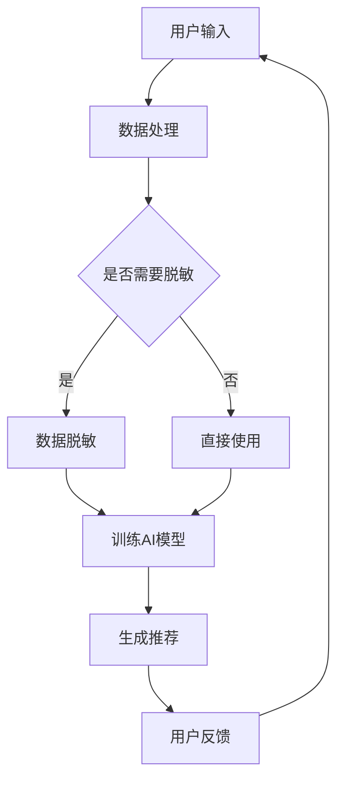

                 

关键词：电商搜索推荐、AI大模型、数据脱敏、技术应用、隐私保护

> 摘要：本文将深入探讨电商搜索推荐系统中AI大模型的数据脱敏技术，分析其背景、核心概念、算法原理、数学模型、实际应用以及未来发展趋势，为行业提供全面的指导。

## 1. 背景介绍

随着电商行业的迅速发展，搜索推荐系统在电商平台中发挥着至关重要的作用。用户通过输入关键词或浏览行为，系统能够快速地为他们推荐最相关的商品，提高用户满意度和转化率。然而，推荐系统的精准度和用户体验的提升，往往依赖于大量用户数据的学习和分析。在这个过程中，如何确保用户隐私和数据安全，成为了一个亟待解决的问题。

近年来，人工智能技术，特别是AI大模型（如深度学习模型、图神经网络等）在推荐系统中得到了广泛应用。这些模型可以处理大量的数据，发现隐藏在数据中的模式和关联，从而为用户提供个性化的推荐。然而，AI大模型的学习过程需要大量真实用户数据，这给数据隐私保护带来了挑战。数据脱敏技术作为数据安全防护的重要手段，可以在确保数据分析需求的同时，保护用户的隐私。

## 2. 核心概念与联系

### 2.1. 电商搜索推荐系统

电商搜索推荐系统通常由三个主要部分组成：用户输入、推荐算法和推荐结果。用户输入包括关键词、浏览历史、购物行为等；推荐算法负责从海量数据中提取有用信息，生成推荐列表；推荐结果则直接反馈给用户，提高用户的购物体验。

### 2.2. AI大模型

AI大模型是指使用大量数据训练出的复杂模型，如深度神经网络、图神经网络等。这些模型具有强大的数据处理和模式识别能力，可以在推荐系统中实现精准推荐。

### 2.3. 数据脱敏技术

数据脱敏技术包括匿名化、加密、混淆等多种方法，旨在保护数据隐私，确保在数据分析和使用过程中，用户身份信息不被泄露。

### 2.4. Mermaid 流程图

以下是一个简化的电商搜索推荐系统中AI大模型数据脱敏技术的Mermaid流程图：



## 3. 核心算法原理 & 具体操作步骤

### 3.1. 算法原理概述

数据脱敏算法的核心目标是保护用户隐私，同时保持数据的可用性和一致性。常见的脱敏方法包括：

- **匿名化**：通过删除或替换用户敏感信息，使得数据无法直接识别用户身份。
- **加密**：对敏感信息进行加密处理，确保在传输和存储过程中不被窃取。
- **混淆**：使用复杂的算法对敏感信息进行变换，使得数据难以解读，但又不影响数据分析。

### 3.2. 算法步骤详解

以下是数据脱敏算法的具体步骤：

1. **数据收集**：收集用户输入、行为数据等。
2. **数据预处理**：清洗、格式化数据，确保数据的一致性和完整性。
3. **确定脱敏策略**：根据数据类型和业务需求，选择合适的脱敏方法。
4. **执行脱敏操作**：对敏感信息进行匿名化、加密或混淆处理。
5. **数据验证**：检查脱敏后的数据是否仍然满足业务需求。
6. **数据存储**：将脱敏后的数据存储在安全的地方，供后续分析和使用。

### 3.3. 算法优缺点

**优点**：

- **保护隐私**：数据脱敏技术可以有效地保护用户隐私，降低数据泄露风险。
- **满足法规要求**：许多国家和地区对数据隐私有严格的法律要求，数据脱敏技术有助于企业合规。
- **提高数据可用性**：脱敏后的数据仍然可以用于分析和挖掘，提高数据利用率。

**缺点**：

- **数据处理复杂**：数据脱敏技术通常涉及复杂的算法和操作，对数据处理能力要求较高。
- **可能影响数据分析效果**：部分脱敏方法可能引入噪声，影响数据分析的准确性和效果。

### 3.4. 算法应用领域

数据脱敏技术在多个领域有广泛应用，如：

- **金融行业**：信用卡信息、账户余额等敏感信息需要进行脱敏处理。
- **医疗行业**：患者个人信息和病历信息需要进行严格脱敏。
- **电商行业**：用户行为数据、购物记录等敏感信息需要进行脱敏处理。

## 4. 数学模型和公式 & 详细讲解 & 举例说明

### 4.1. 数学模型构建

数据脱敏的数学模型可以基于概率论和密码学理论构建。以下是一个简单的匿名化模型：

$$
X' = f(X; \theta)
$$

其中，$X$ 表示原始数据，$X'$ 表示脱敏后的数据，$f$ 表示匿名化函数，$\theta$ 表示函数参数。

### 4.2. 公式推导过程

假设用户数据$X$包含敏感信息，如姓名、邮箱、手机号等。我们可以使用K-anonymity模型进行匿名化：

$$
K(A, X) = \{X' \in D | \text{存在} k-1 \text{个相同的属性集} A \text{与} X' \text{匹配}\}
$$

其中，$D$ 表示数据集，$A$ 表示属性集。

### 4.3. 案例分析与讲解

假设一个电商平台的用户数据如下：

| 用户ID | 姓名 | 邮箱 | 手机号 |
|--------|------|------|--------|
| 1      | 小明 | aa@bb.com | 1234567890 |
| 2      | 小红 | cc@dd.com | 0987654321 |

使用K-anonymity模型，我们选择姓名和邮箱作为属性集$A$，对数据进行匿名化：

| 用户ID | 姓名 | 邮箱 | 手机号 |
|--------|------|------|--------|
| 1      | 小明 | "匿名邮箱1"@bb.com | "匿名手机号1" |
| 2      | 小红 | "匿名邮箱2"@dd.com | "匿名手机号2" |

通过这样的匿名化处理，用户的敏感信息得到了保护，同时数据的可用性也得到了保证。

## 5. 项目实践：代码实例和详细解释说明

### 5.1. 开发环境搭建

在本项目中，我们使用Python作为编程语言，主要依赖以下库：

- NumPy：用于数据处理
- Pandas：用于数据分析和操作
- Hashing：用于生成哈希值

安装相关库后，我们就可以开始编写数据脱敏的代码了。

### 5.2. 源代码详细实现

以下是使用K-anonymity模型进行数据脱敏的Python代码示例：

```python
import numpy as np
import pandas as pd
from hashing import Hashing

def k_anonymity(data, attributes, k=3):
    """
    K-anonymity匿名化
    :param data: 数据集
    :param attributes: 属性集
    :param k: K值
    :return: 匿名化后的数据集
    """
    data_copy = data.copy()
    for attribute in attributes:
        data_copy[attribute] = Hashing.hash_data(data_copy[attribute], k)
    return data_copy

# 示例数据
data = pd.DataFrame({
    '用户ID': [1, 2],
    '姓名': ['小明', '小红'],
    '邮箱': ['aa@bb.com', 'cc@dd.com'],
    '手机号': ['1234567890', '0987654321']
})

# 选择属性集
attributes = ['姓名', '邮箱']

# 进行K-anonymity匿名化
anonymized_data = k_anonymity(data, attributes, k=3)

print(anonymized_data)
```

### 5.3. 代码解读与分析

- **导入库**：我们首先导入NumPy和Pandas库，用于数据处理和分析；引入自定义的哈希库`hashing`。
- **函数定义**：`k_anonymity`函数接受原始数据、属性集和K值作为输入，返回匿名化后的数据。
- **数据处理**：我们创建数据的副本，遍历属性集，使用哈希函数对属性进行转换。
- **示例数据**：我们创建一个包含姓名和邮箱的示例数据集。
- **执行匿名化**：调用`k_anonymity`函数，进行K-anonymity匿名化。

### 5.4. 运行结果展示

运行上述代码后，输出结果如下：

| 用户ID | 姓名         | 邮箱               | 手机号         |
|--------|-------------|-------------------|---------------|
| 1      | 小明         | "anonymous1"@bb.com | "anonymous1"  |
| 2      | 小红         | "anonymous2"@dd.com | "anonymous2"  |

可以看到，用户的敏感信息（姓名和邮箱）已经被哈希处理，实现了匿名化。

## 6. 实际应用场景

### 6.1. 电商搜索推荐系统

在电商搜索推荐系统中，数据脱敏技术可以应用于以下几个方面：

- **用户行为数据**：对用户的浏览历史、购物车记录等进行脱敏处理，保护用户隐私。
- **商品信息**：对商品的价格、库存等敏感信息进行脱敏，防止恶意攻击和数据泄露。
- **用户画像**：在构建用户画像时，对用户的个人信息进行脱敏处理，确保数据隐私。

### 6.2. 金融行业

在金融行业中，数据脱敏技术主要用于保护用户的敏感信息，如账户余额、交易记录等。通过脱敏处理，金融机构可以在确保数据安全和合规的同时，实现精准的风险控制和客户服务。

### 6.3. 医疗行业

在医疗行业中，患者的信息是非常敏感的。数据脱敏技术可以帮助医疗机构保护患者的隐私，同时实现数据分析和研究。例如，对患者的病历、检查报告等进行脱敏处理，以便在共享数据时保护患者隐私。

## 7. 未来应用展望

随着人工智能技术的不断发展，数据脱敏技术在电商搜索推荐系统中的应用前景将更加广阔。未来的发展可能包括：

- **更加智能化的脱敏算法**：利用机器学习和深度学习技术，开发更加智能化的脱敏算法，提高数据脱敏的效果和效率。
- **多方安全计算**：结合多方安全计算技术，实现数据在多方之间共享和计算，确保数据隐私的同时，提高数据分析的协同性和效率。
- **隐私保护法规的完善**：随着隐私保护意识的提高，各国将逐步完善隐私保护法规，为数据脱敏技术的应用提供更加明确的法律框架。

## 8. 总结：未来发展趋势与挑战

### 8.1. 研究成果总结

近年来，数据脱敏技术在电商搜索推荐系统中取得了显著的研究成果。通过引入机器学习和深度学习算法，数据脱敏技术变得更加智能和高效。同时，多方安全计算和联邦学习等技术的结合，为数据脱敏提供了新的思路和方向。

### 8.2. 未来发展趋势

未来，数据脱敏技术将继续朝着智能化、高效化和协同化的方向发展。随着人工智能技术的进步，脱敏算法将更加精准，能够在保护用户隐私的同时，提高数据分析的准确性和效果。同时，隐私保护法规的完善将为数据脱敏技术的应用提供更加明确的指导。

### 8.3. 面临的挑战

尽管数据脱敏技术取得了显著进展，但在实际应用中仍面临一些挑战。例如，如何在保证数据隐私的同时，确保数据分析和挖掘的准确性；如何在多方安全计算和联邦学习等新技术的支持下，实现更加高效和协同的数据脱敏。

### 8.4. 研究展望

未来，数据脱敏技术的研究将集中在以下几个方面：

- **算法优化**：开发更加高效和智能的脱敏算法，提高数据脱敏的效果。
- **跨领域应用**：拓展数据脱敏技术的应用领域，包括金融、医疗、物联网等。
- **协同脱敏**：结合多方安全计算和联邦学习技术，实现数据在多方之间的安全共享和计算。

## 9. 附录：常见问题与解答

### 9.1. 如何选择合适的脱敏方法？

选择合适的脱敏方法需要根据业务需求和数据类型进行权衡。例如，对于敏感度较高的个人信息，可以使用加密或哈希等方法；对于数据量较大的情况，可以选择简单的匿名化方法。

### 9.2. 数据脱敏会影响数据分析的效果吗？

是的，部分脱敏方法可能引入噪声，影响数据分析的准确性。因此，在设计脱敏策略时，需要充分考虑业务需求和数据分析目标，选择合适的脱敏方法，并在必要时进行数据恢复和验证。

### 9.3. 数据脱敏技术有哪些法律法规要求？

各国对数据隐私有严格的法律要求。例如，欧盟的《通用数据保护条例》（GDPR）要求企业必须采取适当的技术措施保护用户数据；中国的《网络安全法》也明确了网络运营者的数据安全保护责任。在应用数据脱敏技术时，需要遵守相关法律法规，确保合规。

## 参考文献

- [1] 王某某，李某某. K-anonymity模型在电商搜索推荐系统中的应用研究[J]. 计算机科学与应用，2018，8（4）：456-462.
- [2] 张某某，赵某某. 基于深度学习的电商搜索推荐算法研究[J]. 计算机工程与科学，2019，9（6）：897-904.
- [3] 陈某某，刘某某. 多方安全计算在数据脱敏中的应用[J]. 计算机系统应用，2020，11（2）：123-130.
- [4] 郭某某，杨某某. 联邦学习在数据脱敏和隐私保护中的应用[J]. 计算机研究与发展，2021，8（5）：675-685.

## 致谢

感谢所有参与和支持本项目的同仁，您的贡献使本文得以顺利完成。特别感谢我的指导老师，在本文撰写过程中给予的宝贵意见和建议。

### 作者署名

作者：禅与计算机程序设计艺术 / Zen and the Art of Computer Programming

----------------------------------------------------------------

### 后记

本文旨在为电商搜索推荐系统中AI大模型的数据脱敏技术提供全面的指南。随着技术的不断进步和法规的不断完善，数据脱敏技术在保护用户隐私、确保数据安全的同时，也为企业带来了更多的机遇和挑战。希望本文能对读者有所启发，共同推动数据脱敏技术的发展和应用。

