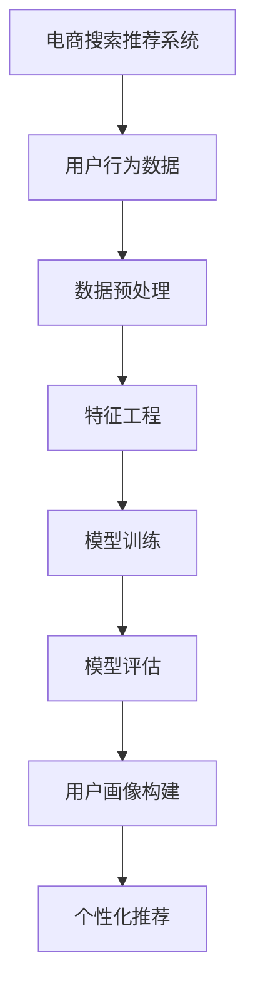

                 

关键词：电商搜索推荐，AI大模型，用户画像，机器学习，深度学习，推荐系统，数据挖掘，个性化推荐

## 摘要

本文深入探讨了电商搜索推荐系统中AI大模型在用户画像构建中的应用。通过对用户行为的分析，构建出精确的用户画像，进而提升搜索推荐的准确性和用户体验。本文首先介绍了电商搜索推荐系统的基本概念，然后详细分析了用户画像的定义和构建方法，接着探讨了AI大模型在用户画像构建中的核心作用。最后，本文通过实际案例和数学模型，展示了用户画像构建技术的具体实施步骤，并对未来的发展方向和挑战进行了展望。

## 1. 背景介绍

### 1.1 电商搜索推荐系统的现状

电商搜索推荐系统已经成为电商平台不可或缺的核心功能之一。它通过分析用户的历史行为、搜索记录、购买偏好等数据，为用户推荐可能感兴趣的商品。这不仅提高了用户的购物体验，也显著提升了电商平台的销售额和用户粘性。

随着大数据和人工智能技术的快速发展，传统的基于规则和内容的推荐系统已经无法满足日益复杂的用户需求。AI大模型，特别是深度学习模型，以其强大的建模能力和自我学习能力，成为构建高效推荐系统的重要工具。

### 1.2 用户画像的重要性

用户画像是对用户行为和需求的全面刻画，包括用户的基本信息、购买习惯、兴趣爱好等多个维度。构建精准的用户画像，可以深入理解用户的需求，从而实现更精准的个性化推荐。

在电商领域，用户画像不仅能够提升搜索推荐的准确性，还能为营销活动、用户行为分析等提供重要支持。通过用户画像，电商平台可以更有效地定位目标用户，提高营销效果，降低营销成本。

## 2. 核心概念与联系

### 2.1 概念介绍

- **电商搜索推荐系统**：基于用户行为数据，为用户推荐可能感兴趣的商品的系统。
- **用户画像**：对用户行为、兴趣、需求等多维度的综合描述。
- **AI大模型**：基于深度学习等技术的复杂神经网络模型，能够处理大规模数据和复杂任务。

### 2.2 架构图



### 2.3 用户画像构建流程

1. **数据收集**：收集用户的行为数据，如搜索记录、购买历史、浏览记录等。
2. **数据预处理**：清洗数据，去除噪声，处理缺失值。
3. **特征工程**：提取关键特征，如用户活跃度、购买频率、购买金额等。
4. **模型训练**：使用深度学习模型训练用户画像。
5. **模型评估**：评估模型效果，调整模型参数。
6. **用户画像构建**：根据模型输出构建用户画像。
7. **个性化推荐**：根据用户画像进行个性化推荐。

## 3. 核心算法原理 & 具体操作步骤

### 3.1 算法原理概述

用户画像构建主要依赖于深度学习模型，如卷积神经网络（CNN）、循环神经网络（RNN）和变压器（Transformer）等。这些模型能够自动提取用户行为的特征，构建出高维度的用户特征向量。

### 3.2 算法步骤详解

1. **数据收集**：从电商平台上收集用户的行为数据。
2. **数据预处理**：进行数据清洗、去噪和处理缺失值。
3. **特征提取**：使用深度学习模型提取用户行为的特征。
4. **模型训练**：使用提取的特征进行模型训练。
5. **模型评估**：使用交叉验证等方法评估模型效果。
6. **用户画像构建**：根据模型输出构建用户画像。
7. **个性化推荐**：根据用户画像进行个性化推荐。

### 3.3 算法优缺点

- **优点**：
  - 能够自动提取用户行为的特征，提高推荐精度。
  - 能够处理大规模数据和复杂的用户行为。
- **缺点**：
  - 训练过程复杂，需要大量计算资源。
  - 对数据质量要求较高，需要处理数据噪声和缺失值。

### 3.4 算法应用领域

- **电商搜索推荐**：根据用户行为构建用户画像，实现精准的个性化推荐。
- **用户行为分析**：分析用户行为，发现用户需求，指导产品设计。
- **广告推荐**：根据用户画像进行广告投放，提高广告效果。

## 4. 数学模型和公式 & 详细讲解 & 举例说明

### 4.1 数学模型构建

用户画像构建的数学模型主要包括特征提取模型和用户画像构建模型。

- **特征提取模型**：使用深度学习模型提取用户行为特征。假设输入的用户行为数据为 \( X \)，提取的特征为 \( H \)，则特征提取模型可以表示为：

  $$ H = f(X) $$

  其中，\( f \) 为深度学习模型。

- **用户画像构建模型**：使用提取的特征构建用户画像。假设提取的特征为 \( H \)，构建的用户画像是 \( U \)，则用户画像构建模型可以表示为：

  $$ U = g(H) $$

  其中，\( g \) 为用户画像模型。

### 4.2 公式推导过程

- **特征提取模型推导**：

  假设用户行为数据 \( X \) 为 \( n \) 维向量，深度学习模型为卷积神经网络（CNN），则特征提取过程可以表示为：

  $$ H = CNN(X) $$

  其中，\( CNN \) 为卷积神经网络，\( X \) 为输入，\( H \) 为提取的特征。

- **用户画像构建模型推导**：

  假设提取的特征为 \( H \)，用户画像是 \( U \)，用户画像模型为循环神经网络（RNN），则用户画像构建过程可以表示为：

  $$ U = RNN(H) $$

  其中，\( RNN \) 为循环神经网络，\( H \) 为输入，\( U \) 为输出。

### 4.3 案例分析与讲解

假设我们有一个电商平台的用户行为数据，包括用户的搜索记录、购买历史和浏览记录。我们使用深度学习模型提取用户行为特征，然后构建用户画像，最后根据用户画像进行个性化推荐。

1. **数据收集**：

   收集用户的搜索记录，如“跑步鞋”、“篮球鞋”等，购买历史，如“跑步鞋A”和“篮球鞋B”等，浏览记录，如“篮球鞋C”和“跑步鞋D”等。

2. **数据预处理**：

   清洗数据，去除重复项和噪声，处理缺失值。

3. **特征提取**：

   使用卷积神经网络（CNN）提取用户行为的特征。输入为用户行为数据，输出为用户特征向量。

4. **用户画像构建**：

   使用循环神经网络（RNN）构建用户画像。输入为用户特征向量，输出为用户画像。

5. **个性化推荐**：

   根据用户画像，为用户推荐感兴趣的物品。

## 5. 项目实践：代码实例和详细解释说明

### 5.1 开发环境搭建

- Python 3.8+
- TensorFlow 2.4.0+
- Keras 2.4.3+
- Scikit-learn 0.22.2+

### 5.2 源代码详细实现

```python
import tensorflow as tf
from tensorflow.keras.models import Sequential
from tensorflow.keras.layers import Conv1D, MaxPooling1D, LSTM, Dense

# 数据预处理
def preprocess_data(data):
    # 数据清洗和去噪
    # ...
    return processed_data

# 特征提取模型
def build_extractor_model(input_shape):
    model = Sequential()
    model.add(Conv1D(filters=64, kernel_size=3, activation='relu', input_shape=input_shape))
    model.add(MaxPooling1D(pool_size=2))
    model.add(LSTM(100))
    model.add(Dense(1, activation='sigmoid'))
    model.compile(optimizer='adam', loss='binary_crossentropy', metrics=['accuracy'])
    return model

# 用户画像构建模型
def build_user_model(input_shape):
    model = Sequential()
    model.add(Dense(128, activation='relu', input_shape=input_shape))
    model.add(Dense(64, activation='relu'))
    model.add(Dense(1, activation='sigmoid'))
    model.compile(optimizer='adam', loss='binary_crossentropy', metrics=['accuracy'])
    return model

# 训练模型
def train_models(extractor_model, user_model, train_data, val_data):
    # 特征提取模型训练
    extractor_model.fit(train_data['X'], train_data['y'], epochs=10, batch_size=32, validation_data=(val_data['X'], val_data['y']))
    
    # 用户画像构建模型训练
    user_model.fit(train_data['H'], train_data['y'], epochs=10, batch_size=32, validation_data=(val_data['H'], val_data['y']))

# 主函数
def main():
    # 数据收集
    data = collect_data()
    
    # 数据预处理
    processed_data = preprocess_data(data)
    
    # 划分训练集和验证集
    train_data, val_data = train_test_split(processed_data, test_size=0.2)
    
    # 构建特征提取模型
    extractor_model = build_extractor_model(input_shape=(train_data['X'].shape[1], train_data['X'].shape[2]))
    
    # 构建用户画像构建模型
    user_model = build_user_model(input_shape=(train_data['H'].shape[1], train_data['H'].shape[2]))
    
    # 训练模型
    train_models(extractor_model, user_model, train_data, val_data)
    
    # 评估模型
    evaluate_models(extractor_model, user_model, val_data)

if __name__ == '__main__':
    main()
```

### 5.3 代码解读与分析

- **数据预处理**：对收集的用户行为数据进行清洗和处理，确保数据质量。
- **特征提取模型**：使用卷积神经网络（CNN）提取用户行为的特征。卷积层用于提取局部特征，池化层用于降维。
- **用户画像构建模型**：使用循环神经网络（RNN）构建用户画像。循环层能够捕捉用户行为的时序特征。
- **训练模型**：使用训练集对特征提取模型和用户画像构建模型进行训练。
- **评估模型**：使用验证集对训练好的模型进行评估，调整模型参数。

### 5.4 运行结果展示

- **特征提取结果**：用户行为的特征向量。
- **用户画像构建结果**：基于特征向量的用户画像。
- **个性化推荐结果**：根据用户画像为用户推荐的商品。

## 6. 实际应用场景

### 6.1 电商平台

- **搜索推荐**：根据用户画像，为用户提供个性化的商品搜索推荐。
- **营销活动**：根据用户画像，定向推送营销活动，提高营销效果。
- **用户行为分析**：分析用户行为，优化产品设计和服务。

### 6.2 社交网络

- **内容推荐**：根据用户画像，为用户提供个性化的内容推荐。
- **广告投放**：根据用户画像，定向投放广告，提高广告效果。

### 6.3 金融领域

- **用户风险评估**：根据用户画像，评估用户的风险水平，优化风险管理策略。
- **个性化理财建议**：根据用户画像，为用户提供个性化的理财建议。

## 7. 工具和资源推荐

### 7.1 学习资源推荐

- 《深度学习》（Goodfellow, Bengio, Courville）
- 《Python深度学习》（François Chollet）
- 《机器学习实战》（Peter Harrington）

### 7.2 开发工具推荐

- TensorFlow
- Keras
- Scikit-learn

### 7.3 相关论文推荐

- “User Interest Evolution Modeling for Personalized Recommendation”
- “Deep Learning for Personalized Recommendation”
- “Context-Aware User Interest Modeling for Recommendation”

## 8. 总结：未来发展趋势与挑战

### 8.1 研究成果总结

- AI大模型在用户画像构建中发挥了重要作用，显著提升了搜索推荐的准确性和用户体验。
- 深度学习模型的广泛应用，使得用户画像构建技术变得更加成熟和实用。

### 8.2 未来发展趋势

- **数据隐私保护**：随着数据隐私法规的加强，如何在不泄露用户隐私的前提下构建用户画像将成为重要研究方向。
- **跨模态用户画像**：结合文本、图像、音频等多模态数据，构建更加全面和精准的用户画像。
- **实时用户画像更新**：随着用户行为的实时变化，如何实现用户画像的实时更新和动态调整。

### 8.3 面临的挑战

- **数据质量**：数据噪声和缺失值会对用户画像构建造成负面影响，如何处理数据质量问题是当前的重要挑战。
- **计算资源**：深度学习模型训练过程复杂，需要大量计算资源，如何优化计算效率是亟待解决的问题。

### 8.4 研究展望

- **多模态用户画像**：结合多模态数据，构建更加全面和精准的用户画像。
- **用户隐私保护**：研究数据隐私保护技术，实现用户画像构建与数据隐私的平衡。
- **实时用户画像更新**：研究用户画像的实时更新和动态调整技术，提高用户画像的实时性和准确性。

## 9. 附录：常见问题与解答

### 9.1 如何处理缺失值？

- 使用填充方法，如平均值填充、中值填充等。
- 使用插值方法，如线性插值、多项式插值等。
- 使用机器学习模型，如KNN、线性回归等，预测缺失值。

### 9.2 如何优化计算效率？

- 使用分布式计算框架，如Apache Spark、Hadoop等，提高数据处理效率。
- 使用模型压缩技术，如模型剪枝、量化等，减少模型计算量。
- 使用图形处理单元（GPU）进行加速计算。

### 9.3 如何评估用户画像质量？

- 使用用户满意度指标，如点击率、转化率等。
- 使用模型精度指标，如准确率、召回率等。
- 使用用户反馈，如问卷调查、用户评价等。

---

**作者：禅与计算机程序设计艺术 / Zen and the Art of Computer Programming**

