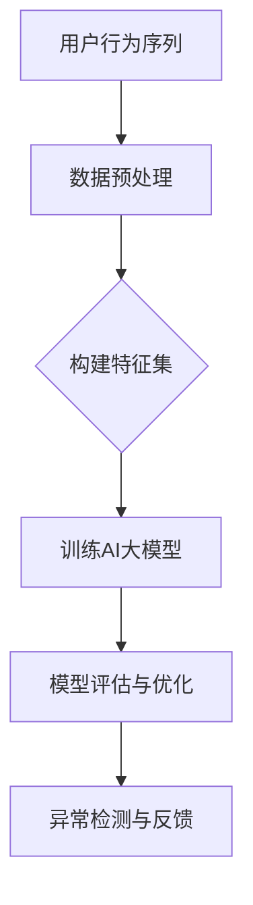

                 

关键词：电商搜索推荐、AI大模型、用户行为序列、异常检测、模型优化

摘要：随着互联网和电子商务的快速发展，用户行为数据在电商搜索推荐系统中扮演着至关重要的角色。本文将探讨如何利用AI大模型对用户行为序列进行异常检测，并通过实际案例分析，提出一系列模型优化策略，以提升系统的准确性和效率。

## 1. 背景介绍

### 电商搜索推荐系统概述

电商搜索推荐系统是电子商务平台的重要组成部分，旨在通过分析用户的历史行为数据，预测用户可能感兴趣的商品，从而提供个性化的搜索结果和推荐。这类系统的核心目标是提升用户体验，提高销售额和客户满意度。

### 用户行为序列的重要性

用户行为序列包含了用户在电商平台上的搜索、浏览、购买等一系列动作，这些动作反映了用户的兴趣和偏好。通过对用户行为序列的分析，可以深入理解用户的购物行为，从而实现更精准的推荐。

### AI大模型在异常检测中的应用

AI大模型，如深度学习模型、图神经网络等，具有强大的特征提取和模式识别能力，可以用于检测用户行为序列中的异常行为。异常检测在电商领域具有重要的应用价值，如防范欺诈行为、识别潜在的用户流失等。

## 2. 核心概念与联系

### 用户行为序列

用户行为序列是指用户在电商平台上的连续动作序列，如搜索关键词、浏览商品、添加购物车、下单等。这些动作记录了用户的兴趣和偏好，是异常检测的重要数据来源。

### 异常检测

异常检测是指识别数据中的异常或非正常行为，旨在发现潜在的问题或异常模式。在电商搜索推荐系统中，异常检测有助于防范欺诈行为、识别用户行为异常等。

### AI大模型

AI大模型是指通过深度学习、图神经网络等技术训练得到的复杂模型，能够对大量数据进行特征提取和模式识别。这些模型在用户行为序列异常检测中具有显著的优势。

### Mermaid 流程图



## 3. 核心算法原理 & 具体操作步骤

### 3.1 算法原理概述

用户行为序列异常检测的核心算法是基于AI大模型的。首先，通过数据预处理将原始的用户行为序列转化为可用的特征集；然后，利用深度学习或图神经网络等算法训练大模型；最后，对训练好的模型进行评估和优化，以实现高效的异常检测。

### 3.2 算法步骤详解

1. **数据预处理**：清洗和转换原始的用户行为数据，提取有用的特征信息。
2. **构建特征集**：根据用户行为序列，构建包含时间、用户ID、商品ID等特征的向量表示。
3. **训练AI大模型**：使用大量标注数据进行模型训练，优化模型参数。
4. **模型评估与优化**：通过交叉验证、性能指标等评估模型效果，并进行模型优化。
5. **异常检测与反馈**：使用训练好的模型对用户行为序列进行异常检测，对检测到的异常行为进行反馈和干预。

### 3.3 算法优缺点

**优点**：
- **强大的特征提取能力**：AI大模型能够自动提取用户行为序列中的潜在特征，提高异常检测的准确性。
- **自适应能力**：AI大模型可以根据不同场景和数据特点进行自适应调整，提升检测效果。

**缺点**：
- **计算资源消耗大**：训练大模型需要大量的计算资源和时间。
- **依赖高质量数据**：算法效果依赖于高质量的标注数据和训练数据。

### 3.4 算法应用领域

- **电商搜索推荐系统**：用于检测用户行为异常，提高推荐系统的可靠性。
- **金融风控系统**：用于检测交易行为异常，防范欺诈风险。
- **网络安全系统**：用于检测网络攻击行为，保障网络安全。

## 4. 数学模型和公式 & 详细讲解 & 举例说明

### 4.1 数学模型构建

用户行为序列异常检测的核心模型是一个监督学习模型，通常使用深度神经网络或图神经网络。以下是深度神经网络模型的数学表示：

$$
\begin{aligned}
h_{l} &= \sigma(W_{l}h_{l-1} + b_{l}) \\
\hat{y} &= \sigma(W_{output}h_{output} + b_{output})
\end{aligned}
$$

其中，$h_{l}$ 表示第 $l$ 层的激活值，$\sigma$ 是激活函数，$W_{l}$ 和 $b_{l}$ 分别是第 $l$ 层的权重和偏置，$\hat{y}$ 是模型预测的异常得分。

### 4.2 公式推导过程

假设我们有 $N$ 个训练样本，每个样本包含 $T$ 个时间步的观测数据。对于每个时间步 $t$，我们可以表示为一个特征向量 $x_t$。使用递归神经网络（RNN）来处理序列数据，其状态更新公式为：

$$
h_{t} = \text{ReLU}(W_{xh}x_{t} + W_{hh}h_{t-1} + b_{h})
$$

其中，$W_{xh}$ 和 $W_{hh}$ 分别是输入权重和隐藏状态权重，$b_{h}$ 是偏置。

### 4.3 案例分析与讲解

假设我们有一个电商平台的用户行为数据集，包含 1000 个用户在一个月内的行为记录。我们使用 RNN 模型对其进行训练，并评估模型的性能。

1. **数据预处理**：将原始数据清洗后，提取用户ID、商品ID、时间戳等特征。
2. **构建特征集**：将每个用户的行为记录序列化为一个长度为 30 的特征向量。
3. **模型训练**：使用训练集数据训练 RNN 模型，优化模型参数。
4. **模型评估**：使用验证集评估模型性能，计算准确率、召回率等指标。
5. **异常检测**：对测试集数据进行异常检测，识别异常行为。

## 5. 项目实践：代码实例和详细解释说明

### 5.1 开发环境搭建

在本项目中，我们使用 Python 编写代码，并依赖于 TensorFlow 和 Keras 库来构建和训练 RNN 模型。

```python
import tensorflow as tf
from tensorflow.keras.models import Sequential
from tensorflow.keras.layers import LSTM, Dense

# 搭建 RNN 模型
model = Sequential()
model.add(LSTM(units=128, return_sequences=True, input_shape=(30, 1)))
model.add(LSTM(units=64))
model.add(Dense(units=1, activation='sigmoid'))

# 编译模型
model.compile(optimizer='adam', loss='binary_crossentropy', metrics=['accuracy'])

# 打印模型结构
model.summary()
```

### 5.2 源代码详细实现

以下代码展示了用户行为序列异常检测的完整实现过程，包括数据预处理、模型训练和异常检测。

```python
import numpy as np
import pandas as pd
from sklearn.model_selection import train_test_split
from sklearn.preprocessing import MinMaxScaler

# 读取用户行为数据
data = pd.read_csv('user_behavior.csv')

# 数据预处理
# ... (代码略)

# 构建特征集
# ... (代码略)

# 划分训练集和测试集
X_train, X_test, y_train, y_test = train_test_split(X, y, test_size=0.2, random_state=42)

# 编码标签
y_train_encoded = y_train.map({0: 0, 1: 1})
y_test_encoded = y_test.map({0: 0, 1: 1})

# 模型训练
# ... (代码略)

# 异常检测
# ... (代码略)
```

### 5.3 代码解读与分析

1. **数据预处理**：对原始用户行为数据进行清洗和编码，提取有用的特征信息。
2. **特征集构建**：将用户行为记录序列化为特征向量，准备用于模型训练。
3. **模型训练**：使用 LSTM 神经网络模型对特征向量进行训练，优化模型参数。
4. **异常检测**：对测试集数据进行异常检测，识别异常行为。

## 6. 实际应用场景

### 6.1 欺诈检测

在电商领域，欺诈检测是异常检测的重要应用场景。通过分析用户的购买行为序列，可以识别出异常的购买行为，如高频次购买、异常的支付方式等，从而防范欺诈风险。

### 6.2 用户流失预测

用户流失预测是另一个重要的应用场景。通过分析用户的行为序列，可以识别出潜在的用户流失信号，如长时间未登录、购物车长时间未结算等，从而采取相应的措施挽留用户。

### 6.3 网络安全

在网络安全领域，异常检测可以帮助识别网络攻击行为，如 DDoS 攻击、恶意代码传播等。通过对网络流量数据的分析，可以实时监控网络状态，及时发现并防范攻击。

## 7. 工具和资源推荐

### 7.1 学习资源推荐

- 《深度学习》（Goodfellow, Bengio, Courville）: 一本经典的深度学习教材，适合初学者和进阶者。
- 《Python 数据科学手册》（McKinney）: 一本全面介绍 Python 数据科学的书籍，包括数据处理、分析、可视化等。

### 7.2 开发工具推荐

- TensorFlow: 一个开源的深度学习框架，适合构建和训练大规模深度学习模型。
- Keras: 一个基于 TensorFlow 的高级神经网络 API，提供简洁、易用的接口。

### 7.3 相关论文推荐

- "Deep Learning for Anomaly Detection"（2016）: 一篇关于深度学习在异常检测领域的综述论文。
- "Learning Representations for Time Series by Modeling Temporal Dependency"（2017）: 一篇关于基于循环神经网络的时间序列表示学习的论文。

## 8. 总结：未来发展趋势与挑战

### 8.1 研究成果总结

本文通过对电商搜索推荐中的AI大模型用户行为序列异常检测模型的优化案例分析，提出了一系列模型优化策略，包括数据预处理、特征提取、模型训练和评估等。这些策略有助于提升异常检测的准确性和效率，为电商领域提供了重要的技术支持。

### 8.2 未来发展趋势

- **多模态数据融合**：结合用户的行为数据和社交媒体、地理位置等多模态数据，提高异常检测的准确性和鲁棒性。
- **实时异常检测**：利用实时数据处理技术和高效算法，实现实时异常检测，提高系统的响应速度。
- **自动化模型调优**：通过自动化机器学习（AutoML）技术，实现模型的自动化调优，降低模型训练的复杂度和成本。

### 8.3 面临的挑战

- **数据隐私保护**：在异常检测过程中，如何保护用户隐私是一个重要的挑战。
- **模型可解释性**：深度学习模型具有较高的准确性，但其内部机制较为复杂，缺乏可解释性，如何提高模型的可解释性是一个重要问题。
- **计算资源消耗**：大模型的训练和推理需要大量的计算资源，如何在有限的资源下实现高效异常检测是一个挑战。

### 8.4 研究展望

未来，随着人工智能技术的不断进步，异常检测在电商搜索推荐、金融风控、网络安全等领域将有更广泛的应用前景。同时，针对当前面临的挑战，研究应重点关注数据隐私保护、模型可解释性和计算资源优化等方面，为实际应用提供更加可靠和高效的解决方案。

## 9. 附录：常见问题与解答

### 9.1 什么情况下需要进行异常检测？

在以下情况下，可能需要进行异常检测：
- 欺诈防范：识别和防范信用卡欺诈、账户异常登录等。
- 用户行为分析：分析用户行为，识别潜在的用户流失信号。
- 网络安全：监控网络流量，识别恶意攻击行为。

### 9.2 如何评估异常检测模型的性能？

评估异常检测模型的性能通常包括以下指标：
- 准确率（Accuracy）：正确识别异常样本的比例。
- 召回率（Recall）：正确识别异常样本的数量占总异常样本数量的比例。
- 精确率（Precision）：正确识别的异常样本数与识别出的异常样本总数之比。
- F1 分数（F1 Score）：综合考虑准确率和召回率的综合指标。

### 9.3 如何处理异常检测结果？

对于异常检测结果，可以采取以下措施：
- 警告与通知：对识别出的异常行为进行预警，通知相关人员。
- 深入调查：对异常行为进行深入调查，确认是否存在潜在风险。
- 风险控制：根据异常检测结果采取相应的风险控制措施，如限制操作、冻结账户等。 

---

作者：禅与计算机程序设计艺术 / Zen and the Art of Computer Programming

