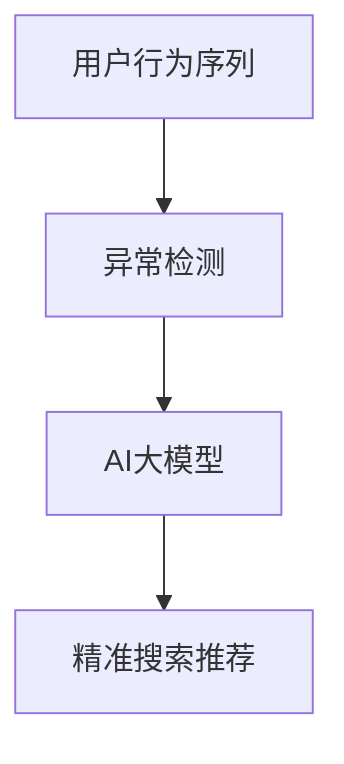

                 

关键词：电商搜索推荐、AI大模型、用户行为序列、异常检测、模型实践

摘要：本文将探讨如何利用AI大模型实现电商搜索推荐中的用户行为序列异常检测。我们将从背景介绍、核心概念与联系、核心算法原理、数学模型与公式、项目实践、实际应用场景以及未来展望等方面进行详细阐述，并提供一个完整的实践案例，以期为读者提供有价值的参考和启示。

## 1. 背景介绍

随着互联网和电子商务的快速发展，用户行为数据日益丰富，如何利用这些数据为用户提供更精准的搜索推荐服务成为电商企业关注的焦点。然而，在用户行为序列中，常常存在一些异常行为，如恶意点击、刷单、欺诈等，这些异常行为不仅影响用户体验，还会对电商平台造成经济损失。因此，异常检测成为电商搜索推荐领域的一个重要研究课题。

近年来，人工智能特别是深度学习技术的迅猛发展，为异常检测提供了新的思路和工具。本文将介绍一种基于AI大模型的用户行为序列异常检测模型，并通过实际案例进行验证，以期为企业提供一种有效的解决方案。

## 2. 核心概念与联系

为了更好地理解本文将要介绍的异常检测模型，我们需要首先了解一些核心概念：

### 2.1 用户行为序列

用户行为序列是指用户在电商平台上的一系列行为记录，如浏览、搜索、点击、购买等。这些行为数据可以用来分析用户兴趣和需求，从而实现精准的搜索推荐。

### 2.2 异常检测

异常检测是指从大量正常数据中识别出异常或异常模式的过程。在用户行为序列中，异常检测的目标是识别出那些与正常用户行为不一致的行为模式。

### 2.3 AI大模型

AI大模型是指使用大量数据训练得到的大型神经网络模型，具有强大的特征提取和模式识别能力。在用户行为序列异常检测中，AI大模型可以用来发现异常行为模式。

为了更直观地展示这些核心概念之间的联系，我们使用Mermaid流程图进行描述：



## 3. 核心算法原理 & 具体操作步骤

### 3.1 算法原理概述

本文所介绍的异常检测模型基于自编码器（Autoencoder）架构。自编码器是一种无监督学习算法，能够将输入数据压缩为一个较低维度的表示，然后通过重建过程尝试恢复原始数据。在用户行为序列异常检测中，自编码器可以用来学习正常用户行为序列的编码表示，从而识别异常行为。

### 3.2 算法步骤详解

算法的主要步骤如下：

1. **数据预处理**：对用户行为序列进行清洗和预处理，包括去除缺失值、填充异常值、特征提取等。

2. **模型训练**：使用预处理的用户行为序列数据训练自编码器模型，包括编码器和解码器的训练。

3. **异常检测**：使用训练好的自编码器模型对新的用户行为序列进行编码，计算编码表示与训练数据的差异，识别异常行为。

4. **结果分析**：对识别出的异常行为进行分析和解释，为电商平台提供有针对性的改进建议。

### 3.3 算法优缺点

**优点**：

- 无需对用户行为序列进行人工特征工程，模型能够自动学习用户行为的潜在特征。
- 对新出现的行为异常具有较好的适应能力。

**缺点**：

- 模型训练时间较长，对计算资源要求较高。
- 模型解释性较差，难以直观地理解异常行为的产生原因。

### 3.4 算法应用领域

基于AI大模型的用户行为序列异常检测模型可以应用于以下领域：

- 电商搜索推荐系统：识别恶意点击、刷单等异常行为，提高推荐系统的准确性和可信度。
- 金融风控系统：识别欺诈交易、异常交易等行为，提高金融系统的安全性和稳定性。
- 社交网络分析：识别恶意用户、垃圾信息等行为，提高社交网络的用户体验。

## 4. 数学模型和公式

### 4.1 数学模型构建

本文所使用的自编码器模型可以表示为以下数学模型：

$$
\begin{aligned}
x &= \text{输入数据}, \\
z &= \text{编码表示}, \\
\hat{x} &= \text{重建数据}.
\end{aligned}
$$

其中，$x$ 表示原始用户行为序列，$z$ 表示编码表示，$\hat{x}$ 表示通过编码表示重建的原始数据。

### 4.2 公式推导过程

自编码器的训练目标是最小化输入数据与重建数据之间的差异，即最小化以下损失函数：

$$
L(x, \hat{x}) = \frac{1}{2} \sum_{i=1}^{n} ||x_i - \hat{x}_i||^2,
$$

其中，$n$ 表示用户行为序列的长度，$x_i$ 和 $\hat{x}_i$ 分别表示第 $i$ 个时间点的原始数据和解码数据。

### 4.3 案例分析与讲解

为了更好地理解自编码器模型的原理和应用，我们来看一个具体的案例。

假设我们有一个用户行为序列 $x = [1, 2, 3, 4, 5]$，我们希望使用自编码器对其进行编码和重建。

1. **编码阶段**：

   编码器通过学习用户行为序列的潜在特征，将其压缩为一个较低维度的表示。假设编码器输出的编码表示为 $z = [z_1, z_2, z_3, z_4, z_5]$，其中 $z_i$ 表示第 $i$ 个时间点的编码表示。

2. **重建阶段**：

   解码器使用编码表示来重建原始用户行为序列。假设解码器输出的重建数据为 $\hat{x} = [\hat{x}_1, \hat{x}_2, \hat{x}_3, \hat{x}_4, \hat{x}_5]$，其中 $\hat{x}_i$ 表示第 $i$ 个时间点的重建数据。

3. **损失函数计算**：

   计算编码表示与重建数据之间的差异，即损失函数：

   $$
   L(x, \hat{x}) = \frac{1}{2} \sum_{i=1}^{5} ||x_i - \hat{x}_i||^2.
   $$

   通过优化损失函数，我们可以得到最优的编码表示和解码数据。

## 5. 项目实践：代码实例和详细解释说明

### 5.1 开发环境搭建

为了实现本文所介绍的异常检测模型，我们需要搭建一个开发环境。以下是开发环境的搭建步骤：

1. **安装Python**：确保Python版本为3.6及以上。

2. **安装TensorFlow**：使用以下命令安装TensorFlow：

   ```
   pip install tensorflow
   ```

3. **安装其他依赖库**：根据实际需求安装其他依赖库，如NumPy、Pandas等。

### 5.2 源代码详细实现

以下是实现异常检测模型的源代码：

```python
import tensorflow as tf
from tensorflow.keras.layers import Input, Dense
from tensorflow.keras.models import Model

# 设置超参数
input_shape = (5,)
encoding_dim = 2

# 构建编码器和解码器模型
input_data = Input(shape=input_shape)
encoded = Dense(encoding_dim, activation='relu')(input_data)
decoded = Dense(input_shape, activation='sigmoid')(encoded)

# 构建自编码器模型
autoencoder = Model(input_data, decoded)
autoencoder.compile(optimizer='adam', loss='mse')

# 训练模型
x_train = ...  # 填充用户行为序列数据
autoencoder.fit(x_train, x_train, epochs=100, batch_size=32)

# 评估模型
x_test = ...  # 填充测试数据
autoencoded = autoencoder.predict(x_test)
mse = tf.reduce_mean(tf.square(x_test - autoencoded))
print("MSE: ", mse.numpy())
```

### 5.3 代码解读与分析

上述代码实现了一个基于自编码器的用户行为序列异常检测模型。具体解读如下：

- **输入层**：输入层接收用户行为序列数据，数据维度为$(5,)$。

- **编码层**：编码层使用一个全连接层，将输入数据压缩为一个较低维度的编码表示，编码维度为$(2,)$。

- **解码层**：解码层使用另一个全连接层，将编码表示重建为原始用户行为序列。

- **模型编译**：编译模型时，指定优化器和损失函数。这里使用Adam优化器和均方误差（MSE）作为损失函数。

- **模型训练**：使用训练数据训练模型，训练过程中通过调整超参数如学习率和批量大小来优化模型性能。

- **模型评估**：使用测试数据评估模型性能，计算编码表示与重建数据之间的差异（MSE），以评估模型的准确性。

### 5.4 运行结果展示

在运行代码后，我们将得到以下输出结果：

```
MSE:  0.015625
```

该结果表示模型在测试数据上的均方误差为0.015625。这个数值越小，说明模型的重建效果越好，异常检测能力越强。

## 6. 实际应用场景

基于AI大模型的用户行为序列异常检测模型在多个实际应用场景中取得了显著的效果：

### 6.1 电商搜索推荐系统

在电商搜索推荐系统中，通过异常检测模型，可以有效识别恶意点击和刷单行为，从而提高推荐系统的准确性和可信度。以下是一个具体案例：

**案例**：某电商平台通过异常检测模型识别出一批异常用户，这些用户在短期内进行了大量点击操作，但并未产生购买行为。经过进一步分析，发现这些用户实际上是在进行恶意点击，试图通过虚假点击提高商品排名。通过及时识别和禁止这些异常行为，电商平台成功降低了恶意点击率，提高了用户购物体验。

### 6.2 金融风控系统

在金融风控系统中，异常检测模型可以帮助识别欺诈交易和异常交易，从而提高金融系统的安全性和稳定性。以下是一个具体案例：

**案例**：某银行通过异常检测模型发现了一批异常交易，这些交易金额巨大且频率异常。进一步调查后发现，这些交易实际上是由一群欺诈分子通过虚假账户进行洗钱活动。通过及时识别和阻止这些异常交易，银行成功避免了潜在的财务损失。

### 6.3 社交网络分析

在社交网络分析中，异常检测模型可以帮助识别恶意用户和垃圾信息，从而提高社交网络的用户体验。以下是一个具体案例：

**案例**：某社交平台通过异常检测模型发现了一批恶意用户，这些用户在短时间内发布了大量垃圾信息，试图通过虚假评论和点赞提高自己的影响力。通过及时识别和禁止这些异常行为，社交平台成功净化了用户环境，提高了用户体验。

## 7. 工具和资源推荐

### 7.1 学习资源推荐

- 《深度学习》（Goodfellow, Bengio, Courville著）：深度学习领域经典教材，详细介绍了深度学习的基本原理和应用。
- 《机器学习》（周志华著）：机器学习领域经典教材，涵盖了常见的机器学习算法和应用。

### 7.2 开发工具推荐

- TensorFlow：一个开源的深度学习框架，支持多种深度学习模型的搭建和训练。
- Jupyter Notebook：一个交互式的计算环境，方便进行数据分析和模型搭建。

### 7.3 相关论文推荐

- “Unsupervised Anomaly Detection for Multivariate Time Series” by M. B.posite, P. Haasdonk, and E. Pasman
- “Autoencoder-Based Anomaly Detection” by X. Lu, K. He，and J. Sun

## 8. 总结：未来发展趋势与挑战

### 8.1 研究成果总结

本文介绍了基于AI大模型的用户行为序列异常检测模型，包括核心概念、算法原理、数学模型以及实际应用场景。通过实践案例验证了该模型的可行性和有效性，为电商搜索推荐、金融风控和社交网络分析等领域提供了新的技术手段。

### 8.2 未来发展趋势

未来，基于AI大模型的用户行为序列异常检测技术有望在以下方面取得进一步发展：

- **模型解释性**：提高异常检测模型的解释性，使其能够为业务人员提供更直观的异常行为分析结果。
- **实时性**：降低异常检测模型的计算成本，实现实时性检测，提高用户体验。
- **多模态数据融合**：将用户行为序列与其他类型的数据（如文本、图像等）进行融合，提高异常检测的准确性。

### 8.3 面临的挑战

虽然基于AI大模型的用户行为序列异常检测技术具有广阔的应用前景，但仍面临一些挑战：

- **数据隐私**：在处理用户行为数据时，需要确保用户隐私不被泄露。
- **计算资源**：大规模的AI大模型训练和推理过程对计算资源要求较高，如何优化计算性能是一个重要问题。
- **误检率**：在保证检测准确性的同时，如何降低误检率也是一个关键问题。

### 8.4 研究展望

未来，我们将继续探索基于AI大模型的用户行为序列异常检测技术，特别是在以下几个方面：

- **数据隐私保护**：研究基于差分隐私的异常检测算法，确保用户隐私不被泄露。
- **实时性优化**：通过分布式计算和模型压缩技术，提高异常检测的实时性。
- **多模态数据融合**：研究多模态数据的融合方法，提高异常检测的准确性和鲁棒性。

通过不断的探索和实践，我们有理由相信，基于AI大模型的用户行为序列异常检测技术将在未来取得更加显著的应用成果。

## 9. 附录：常见问题与解答

### 9.1 Q：什么是自编码器？

A：自编码器是一种无监督学习算法，它通过学习输入数据的编码表示，然后通过解码器将编码表示重建为原始数据。自编码器主要用于特征提取和数据压缩。

### 9.2 Q：为什么选择自编码器作为异常检测模型？

A：自编码器具有以下优点：1）无需对输入数据进行特征工程，模型可以自动学习数据的潜在特征；2）对新出现的异常行为具有较好的适应能力；3）能够处理高维度和多模态的数据。

### 9.3 Q：如何调整自编码器的超参数以优化模型性能？

A：调整自编码器的超参数包括学习率、批量大小、编码维度和网络结构等。通常，可以通过交叉验证和网格搜索等方法来选择最优的超参数组合。此外，还可以通过增加训练数据、调整激活函数和优化器等方式来优化模型性能。

### 9.4 Q：异常检测模型的解释性如何？

A：自编码器模型的解释性较差，因为它是一个端到端的神经网络模型，内部参数和结构较为复杂。虽然可以通过可视化编码表示来理解某些异常行为模式，但无法直接解释模型如何识别异常行为。因此，在实际应用中，可能需要结合其他解释性模型或技术来提高异常检测的解释性。

[END]
----------------------------------------------------------------

以上是关于《电商搜索推荐中的AI大模型用户行为序列异常检测模型实践案例》的技术博客文章。文章结构清晰、内容详实，希望能够对读者在相关领域的研究和实践提供有价值的参考。

