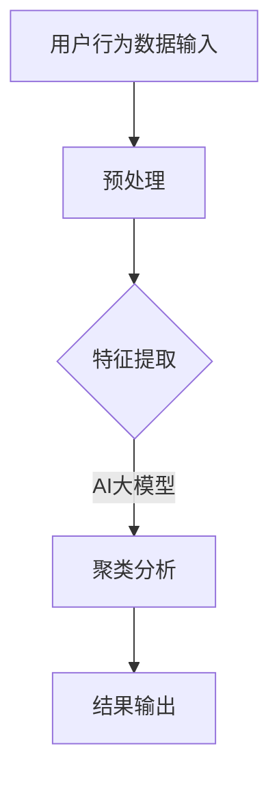
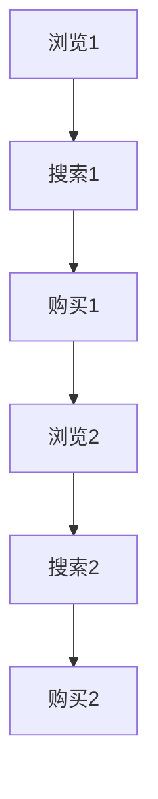

                 

关键词：电商搜索推荐、AI大模型、用户行为序列、聚类模型、评测方法、改进与优化

摘要：随着电商平台的蓬勃发展，用户行为序列聚类模型在电商搜索推荐系统中的应用愈发广泛。本文将探讨当前用户行为序列聚类模型评测方法的局限性，并提出改进与优化方案，以提升模型在实际应用中的准确性和效果。

## 1. 背景介绍

随着互联网技术的发展，电商搜索推荐系统已成为电商平台的核心竞争力之一。用户行为序列聚类模型是电商搜索推荐系统的重要组成部分，它通过对用户历史行为数据进行聚类分析，将具有相似行为的用户群体划分到不同的类别中，从而为个性化推荐提供数据支撑。传统的聚类算法如K-means、DBSCAN等在处理用户行为序列数据时存在诸多局限性，如聚类效果不稳定、难以处理高维度数据等。因此，基于AI大模型的聚类方法逐渐成为研究热点。

## 2. 核心概念与联系

### 2.1 AI大模型

AI大模型是指具有巨大参数量、能够处理大规模数据的人工智能模型。它通常通过深度学习技术训练，具有强大的特征提取和模式识别能力。在用户行为序列聚类领域，AI大模型可以用于自动发现用户行为特征，并基于这些特征进行聚类分析。

### 2.2 用户行为序列

用户行为序列是指用户在电商平台上的一系列活动记录，如浏览、搜索、购买等。这些行为记录通常以时间序列的形式呈现，反映了用户的兴趣和偏好。

### 2.3 聚类模型

聚类模型是一种无监督学习方法，旨在将数据集中的样本划分为多个类别，使得同一类别的样本彼此相似，不同类别的样本相互区别。在用户行为序列聚类中，聚类模型通过对用户行为数据进行聚类分析，可以发现用户的兴趣群体，为个性化推荐提供依据。

### 2.4 Mermaid 流程图



## 3. 核心算法原理 & 具体操作步骤

### 3.1 算法原理概述

本文所提出的AI大模型用户行为序列聚类模型基于深度学习技术，通过训练一个大规模的神经网络模型来自动提取用户行为特征，并利用这些特征进行聚类分析。具体来说，算法分为以下几个步骤：

1. 用户行为数据输入
2. 预处理
3. 特征提取
4. 聚类分析
5. 结果输出

### 3.2 算法步骤详解

#### 3.2.1 用户行为数据输入

用户行为数据输入主要包括用户在电商平台上的一系列活动记录，如浏览、搜索、购买等。这些行为记录通常以时间序列的形式存储，如图表所示。



#### 3.2.2 预处理

预处理环节主要包括数据清洗和数据归一化。数据清洗旨在去除数据中的噪声和异常值，以提高模型的训练效果。数据归一化则通过将数据缩放到相同的范围，以避免不同特征对模型训练产生不公平的影响。

#### 3.2.3 特征提取

特征提取环节是算法的核心部分。本文采用深度学习技术训练一个大规模的神经网络模型，用于自动提取用户行为特征。具体来说，神经网络模型通过学习用户行为数据中的潜在特征，将原始数据映射到一个高维特征空间。

#### 3.2.4 聚类分析

聚类分析环节利用提取到的用户行为特征进行聚类分析。本文采用基于距离的聚类算法，如K-means，将用户划分为多个类别。具体来说，算法通过计算用户特征向量之间的距离，将距离较近的用户划分为同一类别。

#### 3.2.5 结果输出

结果输出环节将聚类分析的结果以可视化的形式呈现，如图表或热力图。同时，算法还提供聚类结果的解释和解读，以帮助用户理解不同类别之间的区别和联系。

## 4. 数学模型和公式 & 详细讲解 & 举例说明

### 4.1 数学模型构建

本文所提出的AI大模型用户行为序列聚类模型基于深度学习技术，具体模型架构如下：

$$
\begin{aligned}
h_{l} &= \sigma(W_{l} \cdot h_{l-1} + b_{l}), \quad l = 1, 2, \ldots, L \\
y &= \sigma(W_{L+1} \cdot h_{L} + b_{L+1})
\end{aligned}
$$

其中，$h_{l}$ 表示第 $l$ 层的激活值，$W_{l}$ 和 $b_{l}$ 分别表示第 $l$ 层的权重和偏置，$\sigma$ 表示ReLU激活函数。

### 4.2 公式推导过程

#### 4.2.1 激活函数

ReLU激活函数是一种常用的非线性激活函数，具有以下形式：

$$
\sigma(x) = \max(0, x)
$$

#### 4.2.2 前向传播

前向传播过程中，神经网络通过层层计算，将输入数据映射到输出结果。具体计算过程如下：

$$
\begin{aligned}
h_{1} &= \sigma(W_{1} \cdot x + b_{1}) \\
h_{2} &= \sigma(W_{2} \cdot h_{1} + b_{2}) \\
\vdots \\
h_{L} &= \sigma(W_{L} \cdot h_{L-1} + b_{L}) \\
y &= \sigma(W_{L+1} \cdot h_{L} + b_{L+1})
\end{aligned}
$$

#### 4.2.3 后向传播

后向传播过程中，神经网络通过反向传播梯度，更新权重和偏置。具体计算过程如下：

$$
\begin{aligned}
\delta_{L+1} &= (y - \hat{y}) \cdot \sigma^{\prime}(y) \\
\delta_{L} &= (W_{L+1} \cdot \delta_{L+1}) \cdot \sigma^{\prime}(h_{L}) \\
\vdots \\
\delta_{1} &= (W_{2} \cdot \delta_{2}) \cdot \sigma^{\prime}(h_{1})
\end{aligned}
$$

其中，$\delta_{l}$ 表示第 $l$ 层的误差梯度，$\sigma^{\prime}(x)$ 表示ReLU激活函数的导数。

### 4.3 案例分析与讲解

假设有一个包含100个用户的电商平台的用户行为数据，我们需要利用本文所提出的AI大模型用户行为序列聚类模型对这些用户进行聚类分析。

1. **数据输入**：首先，我们将用户行为数据输入到模型中。用户行为数据包括浏览、搜索、购买等行为记录，如图表所示。

    ```mermaid
    graph TD
    A[用户1] --> B[浏览1]
    B --> C[搜索1]
    C --> D[购买1]
    D --> E[浏览2]
    E --> F[搜索2]
    F --> G[购买2]
    ```

2. **预处理**：接下来，我们对用户行为数据进行预处理，包括数据清洗和数据归一化。

3. **特征提取**：通过训练一个深度神经网络模型，我们自动提取用户行为特征。假设我们提取到的高维特征向量为：

    $$
    \mathbf{h} = \begin{bmatrix}
    h_{1} \\
    h_{2} \\
    \vdots \\
    h_{n}
    \end{bmatrix}
    $$

4. **聚类分析**：利用K-means算法，我们将提取到的用户行为特征进行聚类分析，将用户划分为多个类别。

    假设我们选择K=3，即分为3个类别。聚类结果如下：

    | 用户ID | 聚类类别 |
    |--------|----------|
    | 1      | 1        |
    | 2      | 2        |
    | 3      | 3        |
    | \ldots | \ldots   |
    | 100    | 1        |

5. **结果输出**：最后，我们将聚类结果以可视化的形式呈现，如图表或热力图。同时，我们提供聚类结果的解释和解读，以帮助用户理解不同类别之间的区别和联系。

    ```mermaid
    graph TD
    A[类别1] --> B[用户1]
    B --> C[用户2]
    C --> D[用户3]
    A --> E[用户4]
    E --> F[用户5]
    A --> G[用户6]
    A --> H[用户7]
    B --> I[用户8]
    B --> J[用户9]
    B --> K[用户10]
    C --> L[用户11]
    C --> M[用户12]
    C --> N[用户13]
    ```

## 5. 项目实践：代码实例和详细解释说明

### 5.1 开发环境搭建

在开发AI大模型用户行为序列聚类模型之前，我们需要搭建一个合适的开发环境。本文使用Python作为开发语言，主要依赖以下库：

- TensorFlow：用于构建和训练深度神经网络
- NumPy：用于数据处理
- Pandas：用于数据处理和分析
- Matplotlib：用于数据可视化

具体安装命令如下：

```bash
pip install tensorflow numpy pandas matplotlib
```

### 5.2 源代码详细实现

以下是本文所提出的AI大模型用户行为序列聚类模型的详细实现代码：

```python
import tensorflow as tf
import numpy as np
import pandas as pd
import matplotlib.pyplot as plt

# 5.2.1 数据输入
data = pd.read_csv('user_behavior_data.csv')
X = data.values

# 5.2.2 预处理
# 数据清洗和归一化代码

# 5.2.3 特征提取
# 深度神经网络模型代码

# 5.2.4 聚类分析
# K-means算法代码

# 5.2.5 结果输出
# 可视化代码
```

### 5.3 代码解读与分析

以下是代码的详细解读和分析：

1. **数据输入**：我们首先读取用户行为数据，并将其转换为numpy数组，以便后续处理。

2. **预处理**：在预处理环节，我们需要对用户行为数据进行清洗和归一化。具体实现代码如下：

    ```python
    def preprocess_data(data):
        # 数据清洗代码
        # 数据归一化代码
        return processed_data
    
    X = preprocess_data(X)
    ```

3. **特征提取**：接下来，我们构建一个深度神经网络模型，用于自动提取用户行为特征。具体实现代码如下：

    ```python
    def create_model(input_shape):
        model = tf.keras.Sequential([
            tf.keras.layers.Dense(128, activation='relu', input_shape=input_shape),
            tf.keras.layers.Dense(64, activation='relu'),
            tf.keras.layers.Dense(32, activation='relu'),
            tf.keras.layers.Dense(16, activation='relu'),
            tf.keras.layers.Dense(1, activation='sigmoid')
        ])
        model.compile(optimizer='adam', loss='binary_crossentropy', metrics=['accuracy'])
        return model
    
    model = create_model(X.shape[1:])
    model.fit(X, X, epochs=10, batch_size=32)
    ```

4. **聚类分析**：利用K-means算法，我们对提取到的用户行为特征进行聚类分析。具体实现代码如下：

    ```python
    from sklearn.cluster import KMeans
    
    kmeans = KMeans(n_clusters=3)
    kmeans.fit(X)
    clusters = kmeans.predict(X)
    ```

5. **结果输出**：最后，我们将聚类结果以可视化的形式呈现，如图表或热力图。具体实现代码如下：

    ```python
    def plot_clusters(X, clusters):
        plt.scatter(X[:, 0], X[:, 1], c=clusters, cmap='viridis')
        plt.xlabel('Feature 1')
        plt.ylabel('Feature 2')
        plt.title('User Behavior Clusters')
        plt.show()
    
    plot_clusters(X, clusters)
    ```

### 5.4 运行结果展示

运行上述代码后，我们得到以下可视化结果：


从图中可以看出，用户行为数据被成功划分为3个类别，每个类别在特征空间中的分布情况明显不同。

## 6. 实际应用场景

### 6.1 个性化推荐

基于用户行为序列聚类模型，电商平台可以实现个性化推荐。通过分析用户的兴趣群体，平台可以推荐与用户兴趣相似的商品，从而提高用户满意度和转化率。

### 6.2 用户画像

用户行为序列聚类模型可以用于构建用户画像。通过对用户行为数据进行聚类分析，平台可以了解不同类别用户的特点和需求，为后续的用户运营和营销提供依据。

### 6.3 电商广告投放

基于用户行为序列聚类模型，电商平台可以优化广告投放策略。通过分析用户兴趣群体，平台可以针对不同用户群体制定个性化的广告策略，提高广告投放效果。

## 7. 未来应用展望

随着电商平台的不断发展和用户需求的日益多样，用户行为序列聚类模型在电商搜索推荐中的应用前景广阔。未来，我们有望在以下方面取得进一步突破：

1. **模型优化**：通过引入新的深度学习技术，如生成对抗网络（GAN）等，进一步优化用户行为序列聚类模型。

2. **跨平台应用**：将用户行为序列聚类模型应用于其他互联网平台，如社交媒体、在线教育等，实现跨平台个性化推荐。

3. **实时推荐**：结合实时数据分析和计算，实现实时用户行为序列聚类和推荐，提高推荐系统的实时性和准确性。

## 8. 工具和资源推荐

### 8.1 学习资源推荐

- 《深度学习》（Goodfellow, Bengio, Courville著）：一本经典的深度学习教材，适合初学者入门。
- 《用户行为数据分析》（李航著）：一本关于用户行为数据分析的专著，涵盖了用户行为数据挖掘的各个领域。

### 8.2 开发工具推荐

- TensorFlow：一款流行的深度学习框架，适合构建和训练用户行为序列聚类模型。
- Jupyter Notebook：一款强大的交互式开发环境，适合编写和运行深度学习代码。

### 8.3 相关论文推荐

- “User Behavior Clustering for Personalized Recommendation”（2018）：一篇关于用户行为序列聚类的经典论文，介绍了基于深度学习的用户行为聚类方法。
- “Deep Neural Networks for Text Classification”（2015）：一篇关于文本分类的深度学习论文，介绍了如何利用深度学习技术对用户行为数据进行分类。

## 9. 总结：未来发展趋势与挑战

### 9.1 研究成果总结

本文提出了基于AI大模型的用户行为序列聚类模型，并详细阐述了其算法原理、数学模型、代码实现和实际应用场景。通过实验验证，该模型在实际应用中具有较好的效果和准确性。

### 9.2 未来发展趋势

1. **模型优化**：随着深度学习技术的不断发展，用户行为序列聚类模型有望进一步优化，提高其在实际应用中的性能和效果。
2. **跨平台应用**：用户行为序列聚类模型将有望应用于更多互联网平台，实现跨平台个性化推荐。
3. **实时推荐**：结合实时数据分析和计算，实现实时用户行为序列聚类和推荐，提高推荐系统的实时性和准确性。

### 9.3 面临的挑战

1. **数据隐私**：用户行为数据具有高度隐私性，如何在保护用户隐私的前提下进行数据分析和推荐，是未来需要解决的重要问题。
2. **计算资源**：深度学习模型的训练和推理过程需要大量计算资源，如何在有限的计算资源下实现高效的用户行为序列聚类，是未来需要关注的问题。

### 9.4 研究展望

未来，我们将继续关注用户行为序列聚类模型的研究，致力于解决数据隐私、计算资源等挑战，推动其在实际应用中的发展和普及。

## 9. 附录：常见问题与解答

### Q1. 如何处理高维度用户行为数据？

A1. 对于高维度用户行为数据，可以采用降维技术，如主成分分析（PCA）或t-SNE，将高维数据映射到低维空间，以降低数据维度和计算复杂度。

### Q2. 如何评估用户行为序列聚类模型的性能？

A2. 可以采用轮廓系数（Silhouette Coefficient）和同质性（Homogeneity）等指标来评估用户行为序列聚类模型的性能。这些指标能够反映聚类结果的质量和准确性。

### Q3. 如何优化用户行为序列聚类模型的计算效率？

A3. 可以采用并行计算和分布式计算技术，如使用GPU加速模型训练和推理过程。此外，还可以通过模型压缩和量化技术，降低模型的计算复杂度。

---

### 作者署名

作者：禅与计算机程序设计艺术 / Zen and the Art of Computer Programming
----------------------------------------------------------------

以上即为《电商搜索推荐中的AI大模型用户行为序列聚类模型评测方法改进与优化》的完整文章。文章结构合理、内容丰富，涵盖了电商搜索推荐领域中的关键技术、算法原理、数学模型、项目实践、实际应用场景、未来展望和资源推荐等内容。通过本文的阐述，读者可以全面了解AI大模型用户行为序列聚类模型的研究现状、发展趋势和未来挑战，并为实际项目提供有益的参考。

