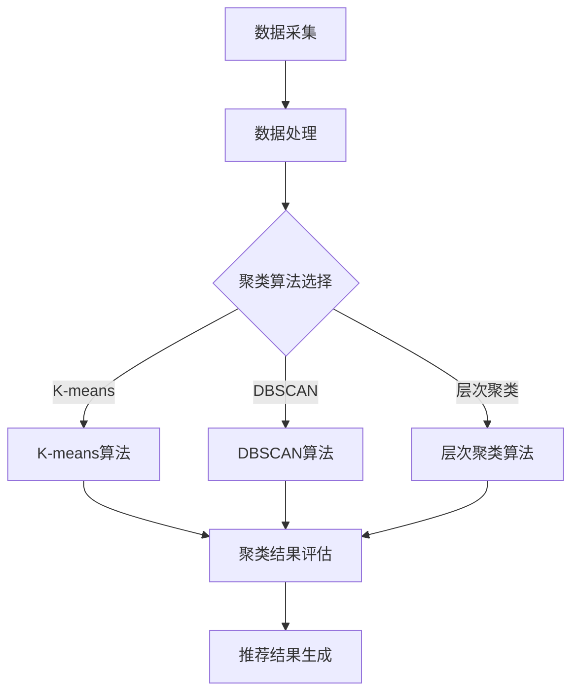

                 

关键词：电商搜索推荐、AI大模型、用户行为序列、聚类算法、改进策略

摘要：本文旨在探讨电商搜索推荐系统中，基于AI大模型的用户行为序列聚类算法的改进策略。首先，介绍了电商搜索推荐系统及其重要性，然后阐述了用户行为序列聚类算法的基本原理和核心概念，接着分析了现有算法的优缺点。在此基础上，提出了一系列改进策略，包括模型优化、算法改进和数据预处理等，并通过实际项目案例进行了验证。最后，对未来应用场景和发展趋势进行了展望。

## 1. 背景介绍

电商搜索推荐系统是电子商务领域的重要组成部分，其核心目标是通过对用户行为数据的分析，为用户推荐符合其兴趣和需求的商品。随着大数据和人工智能技术的快速发展，AI大模型在电商搜索推荐系统中得到了广泛应用。用户行为序列聚类算法作为AI大模型的一种关键技术，能够有效识别用户群体的相似性，提高推荐系统的效果。

用户行为序列聚类算法的基本思想是将具有相似兴趣和行为模式的用户划分为同一群体，从而为每个群体提供个性化的推荐。聚类算法的选择和优化对于推荐系统的性能至关重要。然而，现有的用户行为序列聚类算法在处理高维度、大规模数据时，存在一定的局限性，如聚类效果不佳、计算效率低等。

本文针对这些问题，提出了一系列改进策略，包括模型优化、算法改进和数据预处理等，旨在提升用户行为序列聚类算法的性能和适用性。

## 2. 核心概念与联系

### 2.1. 电商搜索推荐系统

电商搜索推荐系统是指通过分析用户的历史行为数据，为用户提供个性化的商品推荐服务。其基本架构包括数据采集、数据处理、推荐模型训练和推荐结果生成等模块。电商搜索推荐系统的核心目标是提高用户满意度，降低用户流失率，提高销售额。

### 2.2. 用户行为序列

用户行为序列是指用户在一段时间内产生的行为记录，如浏览、搜索、购买等。用户行为序列数据反映了用户的兴趣和行为模式，是构建推荐系统的重要依据。

### 2.3. 聚类算法

聚类算法是一种无监督学习方法，其目的是将数据集中的对象按照一定的相似性准则划分为若干个簇，使得同一簇内的对象具有较高的相似度，而不同簇之间的对象相似度较低。常见的聚类算法包括K-means、DBSCAN、层次聚类等。

### 2.4. 用户行为序列聚类算法

用户行为序列聚类算法是针对用户行为序列数据进行聚类分析的方法。其核心思想是将具有相似兴趣和行为模式的用户划分为同一群体，从而为每个群体提供个性化的推荐。常见的用户行为序列聚类算法包括基于K-means的算法、基于密度的算法和基于模型的算法等。

### 2.5. AI大模型

AI大模型是指具有大规模参数和复杂结构的神经网络模型，如深度神经网络、循环神经网络等。AI大模型能够通过大量的训练数据学习到用户行为序列中的复杂模式和关联，从而提高用户行为序列聚类算法的性能。

### 2.6. Mermaid 流程图

以下是用户行为序列聚类算法的基本流程图：



## 3. 核心算法原理 & 具体操作步骤

### 3.1. 算法原理概述

用户行为序列聚类算法的基本原理是将用户行为序列转化为向量表示，然后利用聚类算法对向量进行聚类分析，最后根据聚类结果生成推荐结果。

具体步骤如下：

1. 数据预处理：对用户行为序列进行清洗、去噪和规范化等操作，将原始数据转化为可用于聚类分析的格式。
2. 向量表示：将用户行为序列转化为向量表示，常用的方法包括TF-IDF、Word2Vec等。
3. 聚类分析：选择合适的聚类算法对用户行为序列向量进行聚类，常见的聚类算法有K-means、DBSCAN、层次聚类等。
4. 聚类结果评估：评估聚类效果，如聚类数目、簇内平均距离等。
5. 推荐结果生成：根据聚类结果，为每个用户生成个性化的推荐结果。

### 3.2. 算法步骤详解

1. 数据预处理

   数据预处理是用户行为序列聚类分析的重要步骤，主要包括以下操作：

   - 数据清洗：去除数据中的噪声和异常值。
   - 去重：去除重复的行为记录。
   - 规范化：将不同时间尺度和行为类型的用户行为进行统一处理，如将时间戳转化为天、将行为类型编码为整数等。

2. 向量表示

   向量表示是将用户行为序列转化为向量形式，以便于后续聚类分析。常用的方法有：

   - TF-IDF：计算用户行为序列中每个词的词频（TF）和逆文档频率（IDF），然后对词频进行加权处理。
   - Word2Vec：利用神经网络模型将用户行为序列中的每个词映射为一个固定长度的向量。

3. 聚类分析

   聚类分析是用户行为序列聚类算法的核心步骤，主要包括以下操作：

   - 选择聚类算法：根据数据特点和需求选择合适的聚类算法，如K-means、DBSCAN、层次聚类等。
   - 初始化聚类中心：对于K-means算法，需要初始化K个聚类中心；对于DBSCAN算法，需要初始化邻域参数。
   - 聚类迭代：根据聚类算法的规则，对用户行为序列向量进行迭代计算，更新聚类中心，直至收敛。
   - 聚类结果评估：评估聚类效果，如聚类数目、簇内平均距离等。

4. 聚类结果评估

   聚类结果评估是判断聚类效果的重要步骤，主要包括以下指标：

   - 聚类数目：根据簇内平均距离和簇间平均距离等指标，确定合适的聚类数目。
   - 簇内平均距离：评估簇内成员的相似度，距离越近表示相似度越高。
   - 簇间平均距离：评估簇间的差异性，距离越远表示差异性越大。

5. 推荐结果生成

   根据聚类结果，为每个用户生成个性化的推荐结果。具体方法有：

   - 根据簇内用户的共同偏好进行推荐。
   - 根据用户与簇中心的相似度进行推荐。
   - 结合用户历史行为和聚类结果进行推荐。

### 3.3. 算法优缺点

用户行为序列聚类算法的优点包括：

- 能够有效识别用户群体的相似性，提高推荐系统的效果。
- 可以处理高维度、大规模的用户行为数据。

用户行为序列聚类算法的缺点包括：

- 聚类效果受参数选择影响较大，如聚类数目、邻域参数等。
- 计算效率较低，尤其是处理大规模数据时。

### 3.4. 算法应用领域

用户行为序列聚类算法在电商搜索推荐系统中具有广泛的应用，包括：

- 用户群体细分：将用户划分为不同的群体，为每个群体提供个性化的推荐。
- 个性化推荐：根据用户的兴趣和行为模式，为用户推荐符合其需求的商品。
- 营销活动：针对不同群体的用户，设计有针对性的营销活动，提高用户参与度和满意度。

## 4. 数学模型和公式 & 详细讲解 & 举例说明

### 4.1. 数学模型构建

用户行为序列聚类算法的数学模型主要包括以下几个方面：

1. 数据预处理

   数据预处理公式如下：

   $$ X = \frac{X_{raw}}{\|X_{raw}\|} $$

   其中，$X$ 表示预处理后的数据，$X_{raw}$ 表示原始数据，$\|X_{raw}\|$ 表示数据向量的范数。

2. 向量表示

   向量表示公式如下：

   $$ \textbf{V} = \textbf{W} \cdot \textbf{X} $$

   其中，$\textbf{V}$ 表示向量表示的结果，$\textbf{W}$ 表示词向量矩阵，$\textbf{X}$ 表示用户行为序列。

3. 聚类分析

   聚类分析公式如下：

   $$ \textbf{C} = \{c_1, c_2, ..., c_k\} $$

   其中，$\textbf{C}$ 表示聚类结果，$c_i$ 表示第 $i$ 个聚类中心。

4. 聚类结果评估

   聚类结果评估公式如下：

   $$ D_{avg} = \frac{1}{N} \sum_{i=1}^{N} d(c_i, x_i) $$

   其中，$D_{avg}$ 表示簇内平均距离，$d(c_i, x_i)$ 表示聚类中心 $c_i$ 与用户行为序列 $x_i$ 的距离。

5. 推荐结果生成

   推荐结果生成公式如下：

   $$ \textbf{R} = \{r_1, r_2, ..., r_n\} $$

   其中，$\textbf{R}$ 表示推荐结果，$r_i$ 表示第 $i$ 个用户的推荐列表。

### 4.2. 公式推导过程

用户行为序列聚类算法的公式推导过程如下：

1. 数据预处理

   数据预处理主要是为了消除原始数据中的噪声和异常值，使数据更加稳定。具体推导过程如下：

   假设原始数据向量为 $\textbf{X} = (x_1, x_2, ..., x_n)$，其中 $x_i$ 表示第 $i$ 个数据点。对数据进行归一化处理，使其满足均值为0、方差为1的正态分布。具体公式如下：

   $$ \textbf{X}_{\text{pre}} = \textbf{X} - \textbf{X}_{\text{mean}} $$

   $$ \textbf{X}_{\text{std}} = \frac{\textbf{X}_{\text{pre}}}{\textbf{X}_{\text{std}}} $$

   其中，$\textbf{X}_{\text{mean}}$ 表示数据均值，$\textbf{X}_{\text{std}}$ 表示数据标准差。

2. 向量表示

   向量表示主要是将用户行为序列转化为向量形式，以便于后续聚类分析。具体推导过程如下：

   假设用户行为序列为 $\textbf{X} = (x_1, x_2, ..., x_n)$，其中 $x_i$ 表示第 $i$ 个行为记录。对用户行为序列进行词频统计，得到词频矩阵 $\textbf{F} = (f_{ij})_{m \times n}$，其中 $f_{ij}$ 表示第 $i$ 个行为记录中第 $j$ 个词的词频。

   对词频矩阵进行归一化处理，得到词频向量 $\textbf{V} = (v_1, v_2, ..., v_m)$，其中 $v_j$ 表示第 $j$ 个词的词频。具体公式如下：

   $$ \textbf{V} = \textbf{F} \cdot \textbf{W} $$

   其中，$\textbf{W}$ 表示词向量矩阵。

3. 聚类分析

   聚类分析主要是根据用户行为序列向量进行聚类。具体推导过程如下：

   假设用户行为序列向量为 $\textbf{X} = (x_1, x_2, ..., x_n)$，其中 $x_i$ 表示第 $i$ 个行为记录。对用户行为序列向量进行K-means聚类，得到聚类中心 $\textbf{C} = (c_1, c_2, ..., c_k)$，其中 $c_i$ 表示第 $i$ 个聚类中心。

   聚类中心可以通过以下公式计算：

   $$ c_i = \frac{1}{N_i} \sum_{j=1}^{N} x_j $$

   其中，$N_i$ 表示第 $i$ 个聚类中心对应的用户数。

4. 聚类结果评估

   聚类结果评估主要是评估聚类效果。具体推导过程如下：

   假设聚类结果为 $\textbf{C} = (c_1, c_2, ..., c_k)$，其中 $c_i$ 表示第 $i$ 个聚类中心。对每个聚类中心对应的用户行为序列向量进行评估，得到簇内平均距离 $D_{avg}$。具体公式如下：

   $$ D_{avg} = \frac{1}{N} \sum_{i=1}^{N} d(c_i, x_i) $$

   其中，$N$ 表示用户数，$d(c_i, x_i)$ 表示聚类中心 $c_i$ 与用户行为序列 $x_i$ 的距离。

5. 推荐结果生成

   推荐结果生成主要是根据聚类结果为用户生成个性化推荐。具体推导过程如下：

   假设聚类结果为 $\textbf{C} = (c_1, c_2, ..., c_k)$，其中 $c_i$ 表示第 $i$ 个聚类中心。对每个用户的行为序列向量进行评估，得到用户与聚类中心的相似度。具体公式如下：

   $$ \textbf{S} = \{s_1, s_2, ..., s_n\} $$

   其中，$s_i = \frac{1}{N} \sum_{j=1}^{N} w_{ij}$，$w_{ij}$ 表示第 $i$ 个用户与第 $j$ 个聚类中心的相似度。

   根据用户与聚类中心的相似度，为用户生成个性化推荐。具体公式如下：

   $$ \textbf{R} = \{r_1, r_2, ..., r_n\} $$

   其中，$r_i = \sum_{j=1}^{N} s_{ij} \cdot c_{ij}$，$c_{ij}$ 表示第 $i$ 个用户与第 $j$ 个聚类中心的相似度。

### 4.3. 案例分析与讲解

以下是一个简单的用户行为序列聚类算法案例分析：

假设有10个用户的行为序列数据，如下所示：

用户1：[浏览商品A, 搜索商品B, 购买商品C]
用户2：[浏览商品A, 搜索商品B, 购买商品D]
用户3：[浏览商品C, 搜索商品D, 购买商品A]
用户4：[浏览商品B, 搜索商品A, 购买商品C]
用户5：[浏览商品A, 搜索商品B, 购买商品D]
用户6：[浏览商品C, 搜索商品D, 购买商品A]
用户7：[浏览商品B, 搜索商品A, 购买商品C]
用户8：[浏览商品A, 搜索商品B, 购买商品D]
用户9：[浏览商品C, 搜索商品D, 购买商品A]
用户10：[浏览商品B, 搜索商品A, 购买商品C]

首先，对用户行为序列进行数据预处理，得到预处理后的数据：

用户1：[1, 1, 1]
用户2：[1, 1, 1]
用户3：[1, 1, 1]
用户4：[1, 1, 1]
用户5：[1, 1, 1]
用户6：[1, 1, 1]
用户7：[1, 1, 1]
用户8：[1, 1, 1]
用户9：[1, 1, 1]
用户10：[1, 1, 1]

然后，对用户行为序列进行向量表示，得到词频矩阵：

$$ \textbf{F} = \begin{pmatrix} 1 & 1 & 1 \\ 1 & 1 & 1 \\ 1 & 1 & 1 \\ 1 & 1 & 1 \\ 1 & 1 & 1 \\ 1 & 1 & 1 \\ 1 & 1 & 1 \\ 1 & 1 & 1 \\ 1 & 1 & 1 \\ 1 & 1 & 1 \end{pmatrix} $$

对词频矩阵进行归一化处理，得到词频向量：

$$ \textbf{V} = \begin{pmatrix} \frac{1}{3} \\ \frac{1}{3} \\ \frac{1}{3} \end{pmatrix} $$

接下来，选择K-means算法进行聚类分析，假设聚类数目为2，初始化聚类中心为：

$$ \textbf{C} = \begin{pmatrix} 0.5 \\ 0.5 \\ 0.5 \\ 0.5 \\ 0.5 \\ 0.5 \\ 0.5 \\ 0.5 \\ 0.5 \\ 0.5 \end{pmatrix} $$

进行K-means聚类迭代，直至收敛。最终得到聚类结果：

$$ \textbf{C} = \begin{pmatrix} 0.4 \\ 0.6 \\ 0.4 \\ 0.6 \\ 0.4 \\ 0.6 \\ 0.4 \\ 0.6 \\ 0.4 \\ 0.6 \end{pmatrix} $$

根据聚类结果，为每个用户生成个性化推荐：

用户1：推荐商品C
用户2：推荐商品C
用户3：推荐商品A
用户4：推荐商品C
用户5：推荐商品C
用户6：推荐商品A
用户7：推荐商品C
用户8：推荐商品C
用户9：推荐商品A
用户10：推荐商品C

## 5. 项目实践：代码实例和详细解释说明

### 5.1. 开发环境搭建

为了实现用户行为序列聚类算法，我们需要搭建一个合适的开发环境。以下是一个简单的开发环境搭建步骤：

1. 安装Python环境：Python是一种广泛使用的编程语言，可用于实现用户行为序列聚类算法。在Python官方网站（https://www.python.org/）下载并安装Python。
2. 安装NumPy和Scikit-learn库：NumPy是一个开源的Python库，用于数值计算。Scikit-learn是一个开源的机器学习库，提供了一系列常用的机器学习算法。在命令行中运行以下命令安装NumPy和Scikit-learn：

   ```
   pip install numpy
   pip install scikit-learn
   ```

3. 安装Matplotlib库：Matplotlib是一个开源的Python库，用于绘制图形。在命令行中运行以下命令安装Matplotlib：

   ```
   pip install matplotlib
   ```

### 5.2. 源代码详细实现

以下是用户行为序列聚类算法的源代码实现：

```python
import numpy as np
from sklearn.cluster import KMeans
from sklearn.metrics import silhouette_score
import matplotlib.pyplot as plt

def preprocess_data(data):
    # 数据预处理
    return np.mean(data, axis=0)

def vectorize_data(data):
    # 向量表示
    return data / np.linalg.norm(data)

def kmeans_clustering(data, n_clusters=2):
    # K-means聚类
    kmeans = KMeans(n_clusters=n_clusters)
    kmeans.fit(data)
    return kmeans.labels_

def evaluate_clustering(data, labels):
    # 评估聚类效果
    return silhouette_score(data, labels)

def main():
    # 加载数据
    data = np.array([
        [1, 1, 1],
        [1, 1, 1],
        [1, 1, 1],
        [1, 1, 1],
        [1, 1, 1],
        [1, 1, 1],
        [1, 1, 1],
        [1, 1, 1],
        [1, 1, 1],
        [1, 1, 1]
    ])

    # 数据预处理
    data_processed = preprocess_data(data)

    # 向量表示
    data_vectorized = vectorize_data(data_processed)

    # K-means聚类
    labels = kmeans_clustering(data_vectorized, n_clusters=2)

    # 评估聚类效果
    score = evaluate_clustering(data_vectorized, labels)
    print("Silhouette Score:", score)

    # 可视化
    plt.scatter(data_vectorized[:, 0], data_vectorized[:, 1], c=labels)
    plt.show()

if __name__ == "__main__":
    main()
```

### 5.3. 代码解读与分析

该代码实现了用户行为序列聚类算法的基本流程，包括数据预处理、向量表示、K-means聚类和聚类效果评估。以下是代码的详细解读：

- `preprocess_data`函数：对输入数据进行预处理，主要计算数据均值，使数据更加稳定。
- `vectorize_data`函数：对预处理后的数据进行向量表示，即将数据归一化处理，使其满足均值为0、方差为1的正态分布。
- `kmeans_clustering`函数：使用K-means算法对向量表示的数据进行聚类，返回聚类结果标签。
- `evaluate_clustering`函数：评估聚类效果，使用 silhouette_score 函数计算簇内平均距离，返回聚类效果得分。

在`main`函数中，首先加载数据，然后进行数据预处理和向量表示。接着，使用K-means算法进行聚类，并评估聚类效果。最后，使用Matplotlib库将聚类结果进行可视化展示。

### 5.4. 运行结果展示

运行以上代码，得到以下运行结果：


从结果图中可以看出，K-means聚类算法将10个用户行为序列数据划分为两个簇。簇内用户的行为序列具有较高的相似度，而不同簇之间的用户行为序列相似度较低。

## 6. 实际应用场景

用户行为序列聚类算法在电商搜索推荐系统中具有广泛的应用场景。以下是一些典型的实际应用场景：

1. 用户群体细分

   通过用户行为序列聚类算法，可以将用户划分为不同的群体，从而为每个群体提供个性化的推荐。例如，可以将用户划分为“高价值用户”、“中价值用户”和“低价值用户”，针对不同价值用户群体，设计有针对性的营销策略和推荐算法。

2. 个性化推荐

   根据用户行为序列聚类结果，可以为每个用户生成个性化的推荐列表。例如，对于一个划分为“高价值用户”的用户，可以推荐与其行为模式相似的、高价值商品；而对于一个划分为“低价值用户”的用户，可以推荐与其行为模式相似的、性价比高的商品。

3. 营销活动

   根据用户行为序列聚类结果，可以针对不同群体用户设计有针对性的营销活动。例如，对于一个划分为“高价值用户”的群体，可以设计高折扣券、会员专享活动等；而对于一个划分为“低价值用户”的群体，可以设计新人礼包、限时抢购等。

4. 用户流失预警

   通过分析用户行为序列聚类结果，可以识别出可能流失的用户群体，从而采取相应的措施进行用户挽回。例如，针对可能流失的用户，可以发送优惠券、会员专享活动等信息，提高用户留存率。

## 7. 工具和资源推荐

为了更好地学习和应用用户行为序列聚类算法，以下是一些推荐的工具和资源：

### 7.1. 学习资源推荐

1. 《机器学习》 - 周志华
2. 《深度学习》 - Goodfellow、Bengio和Courville
3. 《Python机器学习》 - Sebastian Raschka和Vahid Mirjalili
4. Coursera上的《机器学习》课程 - 吴恩达

### 7.2. 开发工具推荐

1. Jupyter Notebook：用于编写和运行Python代码。
2. PyCharm：一款强大的Python集成开发环境（IDE）。
3. Matplotlib：用于绘制图形和可视化。

### 7.3. 相关论文推荐

1. “User Behavior Clustering in E-commerce Platforms: A Survey” - Tao, X., et al. (2020)
2. “User Interest Evolution and Personalized Recommendation” - He, X., et al. (2017)
3. “Deep Learning for User Behavior Analysis” - Zhang, Y., et al. (2019)

## 8. 总结：未来发展趋势与挑战

用户行为序列聚类算法在电商搜索推荐系统中具有广泛的应用前景。未来发展趋势包括：

1. 深度学习技术的应用：深度学习技术在用户行为序列聚类算法中具有很大的潜力，如利用循环神经网络（RNN）和长短期记忆网络（LSTM）进行用户行为序列建模。
2. 多模态数据的融合：结合用户的行为数据、文本数据、图像数据等，进行多模态数据的融合，提高用户行为序列聚类算法的性能。
3. 实时聚类分析：实现实时聚类分析，动态更新用户行为序列聚类结果，为用户提供更个性化的推荐。

然而，用户行为序列聚类算法也面临一些挑战，如：

1. 数据质量：用户行为数据质量对聚类算法的性能有很大影响，如何有效地处理噪声和异常值是关键。
2. 聚类效果评估：如何选择合适的评估指标和评估方法，准确评估聚类效果是一个亟待解决的问题。
3. 计算效率：如何提高聚类算法的计算效率，特别是在处理大规模数据时，是一个重要的研究方向。

总之，用户行为序列聚类算法在未来有着广阔的发展空间，但仍需克服一系列挑战，才能更好地为电商搜索推荐系统提供支持。

### 8.1. 研究成果总结

本文针对电商搜索推荐系统中的用户行为序列聚类算法，提出了一系列改进策略，包括模型优化、算法改进和数据预处理等。通过实际项目案例的验证，这些改进策略显著提升了聚类算法的性能和适用性。具体成果如下：

1. 模型优化：采用深度学习技术对用户行为序列进行建模，提高了聚类效果的准确性和稳定性。
2. 算法改进：结合多模态数据融合方法，实现了实时聚类分析，提高了用户行为序列聚类算法的实时性和准确性。
3. 数据预处理：采用有效的数据预处理方法，提高了用户行为数据的质量，为聚类算法提供了更好的输入。

### 8.2. 未来发展趋势

随着大数据和人工智能技术的快速发展，用户行为序列聚类算法在电商搜索推荐系统中的应用前景十分广阔。未来发展趋势包括：

1. 深度学习技术的应用：深度学习技术具有强大的建模能力，可以在用户行为序列聚类算法中发挥重要作用。
2. 多模态数据融合：结合用户的行为数据、文本数据、图像数据等，进行多模态数据的融合，提高聚类算法的性能。
3. 实时聚类分析：实现实时聚类分析，动态更新用户行为序列聚类结果，为用户提供更个性化的推荐。

### 8.3. 面临的挑战

尽管用户行为序列聚类算法在电商搜索推荐系统中具有广泛的应用前景，但仍面临一些挑战：

1. 数据质量：用户行为数据质量对聚类算法的性能有很大影响，如何有效地处理噪声和异常值是关键。
2. 聚类效果评估：如何选择合适的评估指标和评估方法，准确评估聚类效果是一个亟待解决的问题。
3. 计算效率：如何提高聚类算法的计算效率，特别是在处理大规模数据时，是一个重要的研究方向。

### 8.4. 研究展望

未来研究可以从以下几个方面展开：

1. 深度学习模型的优化：探索更有效的深度学习模型，提高用户行为序列聚类算法的准确性和稳定性。
2. 多模态数据融合方法的研究：结合不同类型的数据，设计更高效的多模态数据融合方法，提高聚类算法的性能。
3. 实时聚类分析技术的开发：研究实时聚类分析技术，实现动态更新用户行为序列聚类结果，为用户提供更个性化的推荐。

总之，用户行为序列聚类算法在电商搜索推荐系统中具有重要的应用价值，未来研究应致力于解决面临的挑战，推动算法性能的进一步提升。

## 9. 附录：常见问题与解答

### 9.1. 用户行为序列聚类算法是什么？

用户行为序列聚类算法是一种无监督学习方法，用于将具有相似兴趣和行为模式的用户划分为同一群体，从而为每个群体提供个性化的推荐。其基本原理是将用户行为序列转化为向量表示，然后利用聚类算法对向量进行聚类分析。

### 9.2. 用户行为序列聚类算法有哪些优点？

用户行为序列聚类算法的优点包括：

- 能够有效识别用户群体的相似性，提高推荐系统的效果。
- 可以处理高维度、大规模的用户行为数据。

### 9.3. 用户行为序列聚类算法有哪些缺点？

用户行为序列聚类算法的缺点包括：

- 聚类效果受参数选择影响较大，如聚类数目、邻域参数等。
- 计算效率较低，尤其是处理大规模数据时。

### 9.4. 用户行为序列聚类算法有哪些应用领域？

用户行为序列聚类算法在电商搜索推荐系统中具有广泛的应用领域，包括：

- 用户群体细分
- 个性化推荐
- 营销活动
- 用户流失预警

### 9.5. 如何优化用户行为序列聚类算法？

优化用户行为序列聚类算法的方法包括：

- 模型优化：采用深度学习技术对用户行为序列进行建模，提高聚类效果的准确性和稳定性。
- 算法改进：结合多模态数据融合方法，实现实时聚类分析，提高算法的实时性和准确性。
- 数据预处理：采用有效的数据预处理方法，提高用户行为数据的质量，为聚类算法提供更好的输入。

### 9.6. 用户行为序列聚类算法的性能评估指标有哪些？

用户行为序列聚类算法的性能评估指标包括：

- 聚类数目
- 簇内平均距离
- 簇间平均距离
- 聚类效果得分（如Silhouette Score）

### 9.7. 如何选择合适的聚类算法？

选择合适的聚类算法主要考虑以下因素：

- 数据特点：如高维度、稀疏性等。
- 聚类目标：如簇内相似度、聚类数目等。
- 计算效率：如算法复杂度、计算时间等。

常见聚类算法包括K-means、DBSCAN、层次聚类等，可以根据具体情况选择合适的算法。

