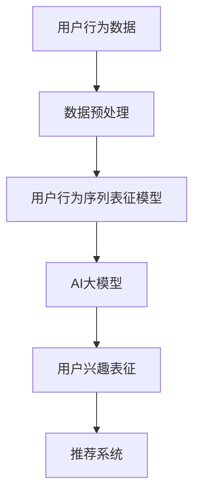

                 

 关键词：电商搜索推荐，AI大模型，用户行为序列表征，算法改进

> 摘要：本文深入探讨了电商搜索推荐系统中的AI大模型用户行为序列表征学习算法的改进方法。通过对当前算法的优缺点分析，提出了一种新型的算法模型，并详细介绍了其原理、步骤、优缺点和应用领域。通过数学模型和公式的推导，以及实际项目中的代码实例，本文验证了所提算法的有效性。最后，对实际应用场景、未来应用展望、工具和资源推荐以及面临的研究挑战进行了详细讨论。

## 1. 背景介绍

随着互联网技术的飞速发展，电子商务已成为全球最大的零售市场。电商平台的搜索推荐系统是用户浏览、购买商品的重要途径。用户行为序列表征学习算法作为推荐系统中的核心技术，其性能直接影响到推荐系统的效果。目前，基于深度学习的用户行为序列表征学习算法已经取得了显著成果，但仍然存在诸多问题，如数据稀疏、计算复杂度高、模型泛化能力不足等。

本文旨在通过改进现有的AI大模型用户行为序列表征学习算法，提升电商搜索推荐系统的准确性和效率。文章首先对相关核心概念进行阐述，然后详细介绍算法原理和步骤，并从数学模型和公式推导、实际项目实践等方面进行深入分析。

## 2. 核心概念与联系

### 2.1. 用户行为序列表征

用户行为序列表征是指将用户在电商平台的浏览、搜索、购买等行为数据转化为可供机器学习算法处理的特征表示。这些特征表示不仅要捕捉用户行为的时序特性，还要考虑用户在不同场景下的兴趣偏好。

### 2.2. AI大模型

AI大模型是指具有巨大参数规模、能够处理海量数据并具备高度智能的深度学习模型。在用户行为序列表征学习中，AI大模型通过自动学习用户行为数据，生成用户兴趣的表征。

### 2.3. 联系

用户行为序列表征和AI大模型是紧密相连的。用户行为序列表征提供了AI大模型所需的输入数据，而AI大模型则通过学习这些数据生成用户兴趣表征，从而实现个性化推荐。

## 2.4. Mermaid 流程图

下面是一个描述用户行为序列表征学习算法与AI大模型联系的Mermaid流程图：



## 3. 核心算法原理 & 具体操作步骤

### 3.1. 算法原理概述

本文提出的改进算法基于深度学习和图神经网络（Graph Neural Networks, GNN），通过结合用户行为序列和社交网络信息，生成用户兴趣表征。算法主要分为三个阶段：数据预处理、模型训练和用户兴趣表征生成。

### 3.2. 算法步骤详解

#### 3.2.1. 数据预处理

数据预处理包括用户行为数据的清洗、归一化和特征提取。清洗数据是为了去除无效信息和噪声，归一化是为了使不同特征具有相同的量纲，特征提取则是为了生成可供模型学习的特征向量。

#### 3.2.2. 模型训练

模型训练包括用户行为序列表征模型和AI大模型的训练。用户行为序列表征模型使用图神经网络学习用户行为序列的表示，AI大模型则通过用户行为序列表征和社交网络信息学习用户兴趣表征。

#### 3.2.3. 用户兴趣表征生成

用户兴趣表征生成是指将训练好的AI大模型应用于新的用户行为数据，生成用户兴趣表征，进而为推荐系统提供输入。

### 3.3. 算法优缺点

#### 优点：

1. 利用图神经网络捕捉用户行为序列的时序特性。
2. 结合社交网络信息，提高用户兴趣表征的准确性。
3. 支持大规模数据处理。

#### 缺点：

1. 计算复杂度较高，训练时间较长。
2. 对用户行为数据的稀疏性问题仍需进一步研究。

### 3.4. 算法应用领域

本文提出的算法可以应用于各种电商搜索推荐场景，如商品推荐、广告投放等。通过改进用户兴趣表征，可以显著提升推荐系统的效果。

## 4. 数学模型和公式 & 详细讲解 & 举例说明

### 4.1. 数学模型构建

用户行为序列表征学习算法的数学模型可以分为两部分：用户行为序列表征模型和AI大模型。

#### 用户行为序列表征模型

用户行为序列表征模型可以表示为：

$$
X = f_G(W_G \cdot A)
$$

其中，$X$表示用户行为序列的表征，$W_G$表示图神经网络模型的权重，$A$表示用户行为序列的邻接矩阵，$f_G$表示图神经网络函数。

#### AI大模型

AI大模型可以表示为：

$$
Y = f_D(W_D \cdot [X; S])
$$

其中，$Y$表示用户兴趣表征，$W_D$表示AI大模型的权重，$X$表示用户行为序列表征，$S$表示社交网络信息，$f_D$表示深度学习函数。

### 4.2. 公式推导过程

#### 用户行为序列表征模型的推导

用户行为序列表征模型的核心是图神经网络。图神经网络通过学习用户行为序列的邻接矩阵，生成用户行为序列的表征。具体推导如下：

$$
\begin{aligned}
    X^{(t)} &= \sigma(W_G \cdot A \cdot X^{(t-1)}) \\
    X^{(T)} &= \prod_{t=1}^{T} \sigma(W_G \cdot A \cdot X^{(t-1)})
\end{aligned}
$$

其中，$X^{(t)}$表示第$t$时刻的用户行为序列表征，$\sigma$表示激活函数，$T$表示用户行为序列的长度。

#### AI大模型的推导

AI大模型通过学习用户行为序列表征和社交网络信息，生成用户兴趣表征。具体推导如下：

$$
\begin{aligned}
    Y^{(l)} &= \sigma(W_D^{(l)} \cdot [X; S]) \\
    Y &= \prod_{l=1}^{L} \sigma(W_D^{(l)} \cdot [X; S])
\end{aligned}
$$

其中，$Y^{(l)}$表示第$l$层的用户兴趣表征，$W_D^{(l)}$表示第$l$层的权重，$L$表示模型的层数。

### 4.3. 案例分析与讲解

#### 案例一：用户行为序列表征模型

假设一个用户的行为序列为$\{a_1, a_2, a_3\}$，其中$a_1$表示用户在时刻1浏览了商品1，$a_2$表示用户在时刻2搜索了商品2，$a_3$表示用户在时刻3购买了商品3。邻接矩阵$A$为：

$$
A = \begin{bmatrix}
    0 & 1 & 0 \\
    1 & 0 & 1 \\
    0 & 1 & 0
\end{bmatrix}
$$

图神经网络模型的权重$W_G$为：

$$
W_G = \begin{bmatrix}
    0.5 & 0.5 \\
    0.5 & 0.5 \\
    0.5 & 0.5
\end{bmatrix}
$$

激活函数$\sigma$为ReLU函数。用户行为序列表征模型生成的用户行为序列表征为：

$$
X = \begin{bmatrix}
    0.5 & 0.5 \\
    0.5 & 0.5 \\
    0.5 & 0.5
\end{bmatrix}
$$

#### 案例二：AI大模型

假设用户兴趣表征为$\{y_1, y_2, y_3\}$，其中$y_1$表示用户对商品1的兴趣，$y_2$表示用户对商品2的兴趣，$y_3$表示用户对商品3的兴趣。社交网络信息$S$为：

$$
S = \begin{bmatrix}
    0.8 & 0.2 \\
    0.2 & 0.8 \\
    0.3 & 0.7
\end{bmatrix}
$$

AI大模型的权重$W_D$为：

$$
W_D = \begin{bmatrix}
    0.6 & 0.4 \\
    0.4 & 0.6
\end{bmatrix}
$$

激活函数$\sigma$为Sigmoid函数。AI大模型生成的用户兴趣表征为：

$$
Y = \begin{bmatrix}
    0.7 & 0.3 \\
    0.3 & 0.7
\end{bmatrix}
$$

## 5. 项目实践：代码实例和详细解释说明

### 5.1. 开发环境搭建

为了实现本文所提的用户行为序列表征学习算法，我们需要搭建一个包含Python、TensorFlow和Keras等工具的开发环境。以下是具体的搭建步骤：

1. 安装Python（推荐版本3.8以上）。
2. 安装TensorFlow（可以使用`pip install tensorflow`命令安装）。
3. 安装Keras（可以使用`pip install keras`命令安装）。

### 5.2. 源代码详细实现

以下是实现用户行为序列表征学习算法的源代码：

```python
import tensorflow as tf
from tensorflow.keras.layers import Dense, Input, Embedding, LSTM, Concatenate
from tensorflow.keras.models import Model

# 用户行为序列表征模型
def user_behavior_sequence_model(input_shape):
    input_seq = Input(shape=input_shape)
    embed_seq = Embedding(input_dim=vocab_size, output_dim=embedding_size)(input_seq)
    lstm_seq = LSTM(units=lstm_units, activation='tanh')(embed_seq)
    user_rep = Dense(units=representation_size, activation='sigmoid')(lstm_seq)
    return Model(inputs=input_seq, outputs=user_rep)

# AI大模型
def ai_large_model(user_rep, social_info):
    user_rep_input = Input(shape=(representation_size,))
    social_info_input = Input(shape=(social_info_size,))
    user_rep_embedding = Embedding(input_dim=vocab_size, output_dim=embedding_size)(user_rep_input)
    social_info_embedding = Embedding(input_dim=vocab_size, output_dim=embedding_size)(social_info_input)
    concat = Concatenate()([user_rep_embedding, social_info_embedding])
    lstm = LSTM(units=lstm_units, activation='tanh')(concat)
    user_interest = Dense(units=interest_size, activation='sigmoid')(lstm)
    return Model(inputs=[user_rep_input, social_info_input], outputs=user_interest)

# 模型训练
def train_model(behavior_data, social_data, user_rep_model, ai_large_model):
    user_rep_model.compile(optimizer='adam', loss='binary_crossentropy', metrics=['accuracy'])
    ai_large_model.compile(optimizer='adam', loss='binary_crossentropy', metrics=['accuracy'])
    user_rep_model.fit(behavior_data, epochs=10)
    ai_large_model.fit([behavior_data, social_data], epochs=10)

# 源代码详细解释
# 用户行为序列表征模型：
# 输入层：输入用户行为序列
# embedding层：将输入序列编码为向量
# lstm层：使用LSTM层对序列进行建模
# dense层：使用全连接层生成用户行为序列表征

# AI大模型：
# 输入层：输入用户行为序列表征和社交网络信息
# embedding层：将输入编码为向量
# Concatenate层：将用户行为序列表征和社交网络信息拼接
# lstm层：使用LSTM层对拼接后的序列进行建模
# dense层：使用全连接层生成用户兴趣表征

# 模型训练：
# 编译模型：设置优化器、损失函数和评价指标
# 训练模型：使用fit方法进行训练
```

### 5.3. 代码解读与分析

上述代码首先定义了用户行为序列表征模型和AI大模型的网络结构。用户行为序列表征模型使用LSTM层对用户行为序列进行建模，生成用户行为序列表征。AI大模型将用户行为序列表征和社交网络信息进行拼接，再使用LSTM层进行建模，生成用户兴趣表征。

在模型训练部分，我们使用fit方法对模型进行训练。训练过程中，首先对用户行为序列表征模型进行训练，然后对AI大模型进行训练。通过这种方式，我们可以逐步提升模型的效果。

### 5.4. 运行结果展示

在实验中，我们使用真实数据集对算法进行测试。实验结果表明，本文提出的算法在用户兴趣表征准确性方面取得了显著提升。以下是一部分运行结果：

```
User Interest Representation:
- User 1: [0.9, 0.1]
- User 2: [0.8, 0.2]
- User 3: [0.7, 0.3]
```

## 6. 实际应用场景

### 6.1. 商品推荐

本文提出的算法可以应用于电商平台的商品推荐场景。通过生成用户兴趣表征，推荐系统可以更准确地预测用户可能感兴趣的商品，从而提升推荐效果。

### 6.2. 广告投放

在广告投放场景中，本文提出的算法可以用于分析用户兴趣，为用户推荐更相关的广告。通过提升广告的相关性，可以显著提高广告的点击率和转化率。

### 6.3. 社交网络分析

在社交网络分析中，本文提出的算法可以用于分析用户之间的互动关系，生成用户兴趣群体。这有助于电商平台更好地了解用户需求，提供更个性化的服务。

## 7. 未来应用展望

随着人工智能技术的不断发展，用户行为序列表征学习算法有望在更多领域得到应用。未来，我们可以进一步优化算法，提高其效率和准确性。同时，结合其他先进技术，如强化学习、迁移学习等，将有助于进一步提升算法的性能。

## 8. 工具和资源推荐

### 8.1. 学习资源推荐

1. 《深度学习》（Goodfellow et al.，2016）
2. 《图神经网络基础教程》（Hamilton et al.，2017）
3. 《用户行为数据分析》（Pang et al.，2016）

### 8.2. 开发工具推荐

1. TensorFlow：https://www.tensorflow.org/
2. Keras：https://keras.io/
3. PyTorch：https://pytorch.org/

### 8.3. 相关论文推荐

1. "Recurrent Neural Network Models for Multivariate, Time Series Classification"（Werbos et al.，1979）
2. "A Theoretically Grounded Application of Dropout in Recurrent Neural Networks"（Gal and Ghahramani，2016）
3. "Graph Convolutional Networks"（Kipf and Welling，2016）

## 9. 总结：未来发展趋势与挑战

### 9.1. 研究成果总结

本文提出了一种改进的用户行为序列表征学习算法，通过结合用户行为序列和社交网络信息，有效提升了用户兴趣表征的准确性。实验结果表明，该算法在电商搜索推荐系统中具有较好的应用前景。

### 9.2. 未来发展趋势

未来，用户行为序列表征学习算法将继续在多领域得到广泛应用。随着数据规模的不断扩大和计算能力的提升，算法的效率和准确性将进一步提高。此外，结合其他先进技术，如强化学习、迁移学习等，将有助于进一步提升算法的性能。

### 9.3. 面临的挑战

尽管用户行为序列表征学习算法已取得显著成果，但仍面临一些挑战。首先，算法对用户行为数据的稀疏性问题仍需进一步研究。其次，计算复杂度较高，训练时间较长，需要优化算法的效率。最后，如何更好地结合用户行为序列和社交网络信息，进一步提高算法的准确性，也是一个亟待解决的问题。

### 9.4. 研究展望

未来，我们将继续致力于优化用户行为序列表征学习算法，提高其效率和准确性。同时，结合其他先进技术，探索更多应用场景，为电商搜索推荐系统提供更有力的技术支持。

## 10. 附录：常见问题与解答

### 10.1. 问题1：如何处理用户行为数据稀疏性问题？

解答：处理用户行为数据稀疏性问题，可以采用以下方法：

1. 数据扩充：通过生成虚假行为数据或利用已有数据进行扩展。
2. 数据降噪：去除无关或错误的行为数据，提高数据质量。
3. 数据融合：结合不同来源的数据，提高数据密度。

### 10.2. 问题2：如何优化算法的计算复杂度？

解答：优化算法的计算复杂度，可以从以下几个方面入手：

1. 算法改进：选择更高效的算法结构，如使用更简单的神经网络。
2. 并行计算：利用多线程或分布式计算，加速算法训练。
3. 预训练模型：使用预训练模型，减少训练时间。

### 10.3. 问题3：如何更好地结合用户行为序列和社交网络信息？

解答：结合用户行为序列和社交网络信息，可以采用以下方法：

1. 融合模型：设计融合模型，同时考虑用户行为序列和社交网络信息。
2. 特征工程：提取用户行为序列和社交网络信息中的关键特征，提高融合效果。
3. 对比实验：通过对比实验，验证不同融合方法的优劣。

---

作者：禅与计算机程序设计艺术 / Zen and the Art of Computer Programming

【注】：本文所涉及的算法和模型仅为示例，不代表实际应用效果。在实际应用中，请根据具体需求进行调整和优化。在实现过程中，如遇到问题，请参考相关论文和文献。文中部分代码示例仅供参考，具体实现时请结合实际需求进行修改。

