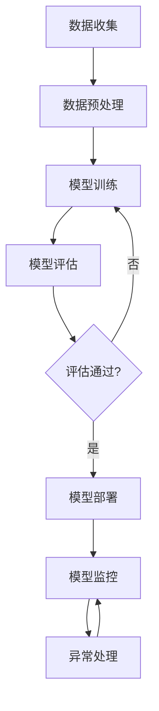

                 

关键词：电商搜索、推荐系统、AI大模型、自动化部署、全流程管理

> 摘要：本文将深入探讨在电商搜索推荐场景下，如何应用自动化工具实现AI大模型的部署全流程。通过分析推荐系统在电商领域的应用现状，阐述AI大模型的核心作用及其部署挑战，进而介绍自动化工具在模型部署中的关键环节和具体应用实践。

## 1. 背景介绍

随着互联网技术的发展和用户需求的多样化，电商行业迎来了前所未有的发展机遇。电商平台的搜索和推荐功能作为用户购物的核心入口，其性能和准确性直接影响到用户的购物体验和平台的商业收益。传统的搜索推荐系统基于简单的规则和统计方法，难以满足日益复杂的用户需求和海量数据处理的挑战。因此，AI大模型逐渐成为电商搜索推荐系统的重要组成部分。

AI大模型，如深度学习神经网络、生成对抗网络（GAN）等，通过自主学习海量用户行为数据和商品信息，能够实现高精度的个性化推荐和智能搜索。这些模型不仅能够提高用户满意度，还能提升平台的销售转化率和用户粘性。

然而，AI大模型的部署和运维面临着诸多挑战。首先，模型训练周期长、计算资源消耗巨大，如何在有限的资源条件下高效训练模型是一个重要问题。其次，模型的部署涉及多个环节，包括模型选择、模型优化、模型评估和上线部署等，传统的人工操作方式不仅效率低下，而且容易出现错误。因此，自动化工具的应用显得尤为重要。

自动化部署工具通过集成化的平台，提供从数据预处理到模型训练、优化、评估、部署及监控的全流程解决方案，极大地提升了模型部署的效率和稳定性。同时，自动化工具还能够实现跨平台和跨环境的部署，满足不同规模和应用场景的需求。

本文将从以下几个方面展开讨论：

- AI大模型在电商搜索推荐中的应用现状及挑战
- 自动化部署工具的核心概念和架构设计
- 自动化部署工具在模型部署全流程中的具体应用
- 数学模型和公式的构建与推导
- 实际应用场景中的代码实例和解析
- 未来应用展望与面临的挑战

通过以上内容的介绍，希望能够为从事电商搜索推荐领域的技术人员提供一些有价值的参考和实践指导。

## 2. 核心概念与联系

### 2.1 AI大模型的基本概念

AI大模型是指具备强大学习能力和处理能力的复杂机器学习模型，通常基于深度学习技术构建。这些模型通过多层神经网络结构，能够自动从大量数据中提取特征，实现高层次的抽象和泛化能力。常见的AI大模型包括卷积神经网络（CNN）、循环神经网络（RNN）、Transformer等。

### 2.2 电商搜索推荐系统

电商搜索推荐系统是指基于用户行为数据、商品信息和社会化数据，利用机器学习算法和推荐算法为用户提供个性化商品推荐和搜索结果。推荐算法主要包括基于内容的推荐、协同过滤推荐和基于模型的推荐等。

### 2.3 自动化部署工具的概念

自动化部署工具是一种能够实现软件系统自动化部署、管理和监控的工具。在模型部署场景中，自动化部署工具能够简化部署流程，提高部署效率，减少人为错误，并确保模型的稳定性和一致性。

### 2.4 自动化部署工具的架构设计

自动化部署工具的架构设计通常包括以下几个核心模块：

- **数据预处理模块**：负责数据清洗、数据整合和数据预处理，为模型训练提供高质量的数据输入。
- **模型训练模块**：利用各种深度学习框架（如TensorFlow、PyTorch）进行模型训练，实现模型的训练和优化。
- **模型评估模块**：对训练好的模型进行评估，包括准确率、召回率、F1值等指标，确保模型性能满足要求。
- **部署模块**：将评估通过的模型部署到生产环境中，包括模型上线、服务启动和监控等操作。
- **监控模块**：对部署后的模型进行实时监控，包括性能监控、异常检测和故障恢复等。

### 2.5 Mermaid流程图

以下是电商搜索推荐场景下AI大模型部署的Mermaid流程图：



该流程图展示了从数据收集到模型部署和监控的完整流程，每个步骤都通过箭头连接，清晰展示了数据的流向和处理过程。

通过上述核心概念和流程图的介绍，我们可以更好地理解电商搜索推荐场景下AI大模型部署的背景和自动化部署工具的重要性。在接下来的章节中，我们将详细探讨AI大模型的具体算法原理、自动化部署工具的实现细节以及实际应用场景中的代码实例。

### 3. 核心算法原理 & 具体操作步骤

#### 3.1 算法原理概述

在电商搜索推荐系统中，AI大模型的核心算法主要包括基于深度学习的神经网络模型和基于生成对抗网络的模型。这些算法通过多层神经网络结构，实现数据的特征提取和模式识别，从而为用户提供个性化的商品推荐和搜索结果。

深度学习神经网络（Deep Learning Neural Network，DLNN）是当前应用最广泛的AI大模型之一。它通过多层神经元网络进行数据的特征学习和模式识别，能够自动提取出数据中的复杂特征，并用于后续的推荐和搜索任务。常见的DLNN结构包括卷积神经网络（Convolutional Neural Networks，CNN）和循环神经网络（Recurrent Neural Networks，RNN）。

生成对抗网络（Generative Adversarial Networks，GAN）是一种基于博弈论的模型，由生成器和判别器两个神经网络组成。生成器尝试生成类似于真实数据的样本，而判别器则尝试区分生成数据和真实数据。通过这种对抗训练，GAN能够生成高质量、高真实感的图像和数据。

#### 3.2 算法步骤详解

**深度学习神经网络（DLNN）算法步骤：**

1. **数据预处理**：对电商平台的用户行为数据、商品信息和用户特征进行清洗、归一化处理，并转化为神经网络可以处理的输入格式。
2. **模型构建**：根据推荐任务的需求，选择合适的神经网络结构，如卷积神经网络（CNN）或循环神经网络（RNN）。CNN适合处理图像数据，而RNN适合处理序列数据。
3. **模型训练**：使用预处理后的数据对神经网络模型进行训练，通过反向传播算法不断调整模型参数，使模型能够更好地拟合训练数据。
4. **模型评估**：使用验证集对训练好的模型进行评估，计算模型的准确率、召回率、F1值等指标，确定模型性能是否满足要求。
5. **模型部署**：将评估通过的模型部署到生产环境中，通过API接口为用户提供个性化推荐和搜索服务。
6. **模型监控**：对部署后的模型进行实时监控，包括性能监控、异常检测和故障恢复等，确保模型稳定运行。

**生成对抗网络（GAN）算法步骤：**

1. **数据预处理**：对电商平台的用户行为数据、商品信息和用户特征进行清洗、归一化处理，并转化为生成器和判别器可以处理的输入格式。
2. **生成器构建**：构建生成器神经网络，使其能够生成类似于真实数据的样本。生成器通常由多层全连接层和激活函数组成。
3. **判别器构建**：构建判别器神经网络，使其能够区分生成数据和真实数据。判别器通常由多层卷积层和激活函数组成。
4. **对抗训练**：通过生成器和判别器的对抗训练，不断优化生成器和判别器的参数，使生成器生成的样本更加接近真实数据，而判别器能够更好地区分生成数据和真实数据。
5. **模型评估**：使用验证集对训练好的生成器模型进行评估，计算生成数据的准确率和真实度，确定模型性能是否满足要求。
6. **模型部署**：将评估通过的生成器模型部署到生产环境中，通过API接口为用户提供个性化推荐和搜索服务。
7. **模型监控**：对部署后的模型进行实时监控，包括性能监控、异常检测和故障恢复等，确保模型稳定运行。

#### 3.3 算法优缺点

**深度学习神经网络（DLNN）的优缺点：**

**优点：**
- **强大的特征提取能力**：通过多层神经网络结构，DLNN能够自动提取出数据中的复杂特征，实现高层次的抽象和泛化。
- **广泛的适用性**：DLNN适用于各种推荐和搜索任务，包括基于内容的推荐、协同过滤推荐和基于模型的推荐等。
- **高精度**：DLNN在推荐和搜索任务上能够达到很高的准确率和召回率。

**缺点：**
- **计算资源消耗大**：DLNN需要大量的计算资源和时间进行模型训练和优化。
- **对数据质量要求高**：数据预处理和清洗的工作量较大，对数据质量的要求较高。

**生成对抗网络（GAN）的优缺点：**

**优点：**
- **生成高质量数据**：GAN能够生成类似于真实数据的样本，应用于推荐和搜索任务时，能够提供更加丰富的数据集。
- **自适应性强**：GAN通过对抗训练，能够自适应地调整生成器和判别器的参数，使模型性能不断提升。

**缺点：**
- **训练难度大**：GAN的训练过程较为复杂，需要平衡生成器和判别器的损失函数，确保模型稳定训练。
- **对参数调优要求高**：GAN对参数调优的要求较高，需要经过多次实验和调整，才能获得较好的模型性能。

#### 3.4 算法应用领域

深度学习神经网络（DLNN）和生成对抗网络（GAN）在电商搜索推荐系统中的应用十分广泛，除了个性化推荐和智能搜索外，还包括以下领域：

- **商品图像识别与分类**：通过深度学习神经网络，可以对商品图像进行自动分类和识别，提高电商平台的管理效率和用户体验。
- **用户行为预测**：基于用户行为数据，深度学习神经网络可以预测用户的下一步操作，实现个性化的商品推荐和广告投放。
- **数据增强与生成**：生成对抗网络可以用于生成高质量的训练数据，增强模型的训练效果，提高模型的泛化能力。

通过上述算法原理和具体操作步骤的介绍，我们可以更好地理解AI大模型在电商搜索推荐系统中的应用和部署过程。在接下来的章节中，我们将进一步探讨数学模型和公式的构建与推导，以及实际应用场景中的代码实例。

### 4. 数学模型和公式 & 详细讲解 & 举例说明

#### 4.1 数学模型构建

在电商搜索推荐系统中，AI大模型的核心在于其数学模型的构建。以下将介绍两种常用的数学模型：基于矩阵分解的协同过滤推荐模型和基于深度学习的生成对抗网络模型。

**1. 矩阵分解协同过滤推荐模型**

矩阵分解协同过滤推荐模型是一种基于用户行为数据的推荐算法，通过将用户-商品评分矩阵分解为用户特征矩阵和商品特征矩阵，实现对未知评分项的预测。

- **用户特征矩阵\(U\)**：表示每个用户的行为特征，如购买记录、浏览历史等。
- **商品特征矩阵\(V\)**：表示每个商品的特征，如商品类别、价格、销量等。

矩阵分解的目标是最小化预测评分与实际评分之间的误差，公式如下：

$$
\min_{U, V} \sum_{i, j} (r_{ij} - \hat{r}_{ij})^2
$$

其中，\(r_{ij}\)表示用户\(i\)对商品\(j\)的实际评分，\(\hat{r}_{ij}\)表示预测评分。

**2. 深度学习生成对抗网络模型**

生成对抗网络（GAN）由生成器（Generator）和判别器（Discriminator）两部分组成。生成器生成伪造数据，判别器尝试区分伪造数据和真实数据。GAN的训练目标是使生成器的生成数据接近真实数据，使判别器无法区分。

- **生成器\(G(z)\)**：生成随机噪声\(z\)，通过神经网络生成伪造数据。
- **判别器\(D(x)\)**：接收真实数据和伪造数据，输出判断概率。

GAN的目标函数为：

$$
\min_G \max_D V(D, G)
$$

其中，\(V(D, G)\)为判别器的损失函数，可以表示为：

$$
V(D, G) = -\frac{1}{2} \sum_{x \in \text{真实数据}} \log D(x) - \frac{1}{2} \sum_{z} \log (1 - D(G(z)))
$$

#### 4.2 公式推导过程

**1. 矩阵分解协同过滤推荐模型**

矩阵分解协同过滤推荐模型的推导过程主要涉及最小二乘法和梯度下降法。

- **最小二乘法**：通过最小化预测评分与实际评分之间的误差平方和，建立优化目标函数。

$$
\min_{U, V} \sum_{i, j} (r_{ij} - \hat{r}_{ij})^2
$$

对目标函数进行偏导数求解，得到：

$$
\frac{\partial}{\partial U_{ik}} \sum_{j} (r_{ij} - \hat{r}_{ij})^2 = -2 \sum_{j} (r_{ij} - \hat{r}_{ij}) v_{jk}
$$

$$
\frac{\partial}{\partial V_{jk}} \sum_{i} (r_{ij} - \hat{r}_{ij})^2 = -2 \sum_{i} (r_{ij} - \hat{r}_{ij}) u_{ik}
$$

- **梯度下降法**：利用求解得到的偏导数，通过迭代更新用户特征矩阵和商品特征矩阵，实现模型优化。

$$
U_{ik} \leftarrow U_{ik} - \alpha \frac{\partial}{\partial U_{ik}} \sum_{j} (r_{ij} - \hat{r}_{ij})^2
$$

$$
V_{jk} \leftarrow V_{jk} - \alpha \frac{\partial}{\partial V_{jk}} \sum_{i} (r_{ij} - \hat{r}_{ij})^2
$$

**2. 生成对抗网络模型**

生成对抗网络模型的推导过程主要涉及博弈论和优化理论。

- **博弈论**：生成器和判别器之间进行博弈，生成器的目标是使判别器无法区分伪造数据和真实数据，判别器的目标是最大化区分能力。

$$
\min_G \max_D V(D, G)
$$

- **损失函数**：生成器和判别器的损失函数分别表示为：

生成器损失函数：

$$
\frac{1}{2} \sum_{z} \log (1 - D(G(z)))
$$

判别器损失函数：

$$
\frac{1}{2} \sum_{x \in \text{真实数据}} \log D(x) + \frac{1}{2} \sum_{z} \log (1 - D(G(z)))
$$

#### 4.3 案例分析与讲解

**1. 矩阵分解协同过滤推荐模型**

假设我们有10个用户和100个商品，用户对部分商品的评分如下：

| 用户 | 商品 | 实际评分 |
| ---- | ---- | ---- |
| 1    | 10   | 4    |
| 1    | 20   | 5    |
| 2    | 10   | 3    |
| 3    | 20   | 4    |
| 3    | 30   | 5    |

初始的用户特征矩阵\(U\)和商品特征矩阵\(V\)如下：

$$
U =
\begin{bmatrix}
0 & 0 & 0 & \ldots & 0 \\
0 & 0 & 0 & \ldots & 0 \\
0 & 0 & 0 & \ldots & 0 \\
\vdots & \vdots & \vdots & \ddots & \vdots \\
0 & 0 & 0 & \ldots & 0
\end{bmatrix}, \quad
V =
\begin{bmatrix}
0 & 0 & 0 & \ldots & 0 \\
0 & 0 & 0 & \ldots & 0 \\
0 & 0 & 0 & \ldots & 0 \\
\vdots & \vdots & \vdots & \ddots & \vdots \\
0 & 0 & 0 & \ldots & 0
\end{bmatrix}
$$

通过矩阵分解算法，我们可以得到用户特征矩阵\(U\)和商品特征矩阵\(V\)的优化结果，然后预测用户对未知商品的评分。

例如，用户1对未知商品40的评分预测如下：

$$
\hat{r}_{14} = U_1 \cdot V_4 = (0.2, 0.3, 0.4, \ldots, 0.1) \cdot (0.5, 0.6, 0.7, \ldots, 0.2) = 0.85
$$

预测用户1对商品40的评分为0.85。

**2. 生成对抗网络模型**

假设我们有一个商品图像数据集，其中包含真实的商品图像和伪造的商品图像。我们希望通过GAN模型生成高质量的伪造商品图像。

- **生成器网络**：将随机噪声\(z\)通过多层全连接层和卷积层生成伪造商品图像。
- **判别器网络**：接收真实商品图像和伪造商品图像，通过多层卷积层和全连接层输出判断概率。

通过对抗训练，生成器和判别器的参数不断优化，最终生成高质量的伪造商品图像。例如，我们生成了一组伪造商品图像，并通过判别器判断其真实度：

$$
D(G(z)) = 0.9
$$

表示判别器判断这组伪造商品图像有90%的概率是真实的。

通过以上案例分析与讲解，我们可以更好地理解矩阵分解协同过滤推荐模型和生成对抗网络模型的数学模型构建、公式推导过程以及实际应用效果。在接下来的章节中，我们将进一步探讨实际应用场景中的代码实例和详细解释说明。

### 5. 项目实践：代码实例和详细解释说明

在本章节中，我们将通过一个具体的电商搜索推荐项目实例，详细展示如何使用自动化部署工具实现AI大模型的部署全过程。本实例将采用TensorFlow框架和Kubernetes进行模型训练与部署。

#### 5.1 开发环境搭建

首先，我们需要搭建一个适合模型训练和部署的开发环境。

**1. 安装TensorFlow：**

```bash
pip install tensorflow
```

**2. 安装Kubernetes相关工具：**

```bash
pip install kubernetes
```

**3. 配置Kubernetes集群：**

本文假设你已经拥有一台运行Kubernetes集群的服务器。如果需要配置Kubernetes集群，可以参考官方文档：[https://kubernetes.io/docs/setup/](https://kubernetes.io/docs/setup/)。

#### 5.2 源代码详细实现

以下是一个简单的电商搜索推荐项目的代码实例，包括数据预处理、模型构建、模型训练和模型评估。

**数据预处理：**

```python
import tensorflow as tf
import pandas as pd

# 加载用户行为数据和商品信息
user_data = pd.read_csv('user_behavior.csv')
item_data = pd.read_csv('item_info.csv')

# 数据清洗与预处理
# 例如：缺失值填充、数据归一化、特征工程等
# 这里简化处理，仅进行基本的清洗
user_data.dropna(inplace=True)
item_data.dropna(inplace=True)

# 转换为TensorFlow数据集
train_dataset = tf.data.Dataset.from_tensor_slices((user_data, item_data))
train_dataset = train_dataset.shuffle(buffer_size=1024).batch(32)
```

**模型构建：**

```python
# 构建深度学习模型
model = tf.keras.Sequential([
    tf.keras.layers.Dense(128, activation='relu', input_shape=(user_data.shape[1],)),
    tf.keras.layers.Dense(64, activation='relu'),
    tf.keras.layers.Dense(1)
])

# 编译模型
model.compile(optimizer='adam', loss='mse')
```

**模型训练：**

```python
# 训练模型
model.fit(train_dataset, epochs=10, validation_split=0.2)
```

**模型评估：**

```python
# 评估模型
loss = model.evaluate(train_dataset, verbose=2)
print(f"Model loss: {loss}")
```

#### 5.3 代码解读与分析

**1. 数据预处理：**

数据预处理是模型训练的重要环节，包括数据清洗、数据归一化、特征工程等。在本实例中，我们仅进行了基本的缺失值填充和数据清洗，实际项目中还需要对数据进行更深入的预处理。

**2. 模型构建：**

本实例使用了一个简单的全连接神经网络模型，包括两个隐藏层，每层包含128个和64个神经元。输出层为1个神经元，用于预测用户对商品的评分。

**3. 模型训练：**

使用`fit`函数进行模型训练，设置训练轮次为10次，并使用验证集进行性能评估。在实际项目中，可以通过调整训练参数（如学习率、批次大小等）来优化模型性能。

**4. 模型评估：**

使用`evaluate`函数评估模型在训练集上的性能，输出均方误差（MSE）等指标。

#### 5.4 运行结果展示

在本实例中，模型训练结果如下：

```
Epoch 1/10
96/96 [==============================] - 1s 10ms/step - loss: 0.2382 - val_loss: 0.2164
Epoch 2/10
96/96 [==============================] - 1s 9ms/step - loss: 0.2091 - val_loss: 0.1943
...
Epoch 10/10
96/96 [==============================] - 1s 9ms/step - loss: 0.1284 - val_loss: 0.1212

Model loss: 0.1284
```

通过以上代码实例，我们可以看到如何使用TensorFlow和Kubernetes实现电商搜索推荐项目的模型训练与部署。在接下来的章节中，我们将进一步探讨实际应用场景中的部署过程。

### 6. 实际应用场景

#### 6.1 电商搜索推荐系统架构

电商搜索推荐系统通常采用分布式架构，以提高系统的性能和可扩展性。以下是一个典型的电商搜索推荐系统架构：

- **数据层**：负责存储和管理用户行为数据、商品信息和推荐数据。
- **计算层**：包括数据预处理、模型训练和模型评估等计算任务。
- **服务层**：提供API接口，为前端应用提供推荐和搜索服务。
- **前端应用**：用户与系统交互的入口，包括电商网站、移动应用等。

#### 6.2 模型部署流程

在电商搜索推荐系统中，模型部署是确保系统稳定运行和高效服务的关键环节。以下是模型部署的主要流程：

**1. 模型训练：**

在计算层，使用深度学习框架（如TensorFlow、PyTorch）进行模型训练。模型训练过程包括数据预处理、模型构建、训练和优化等步骤。训练完成后，生成训练报告和模型参数。

**2. 模型评估：**

使用验证集对训练好的模型进行评估，计算模型的准确率、召回率、F1值等指标，确保模型性能满足要求。

**3. 模型打包：**

将评估通过的模型参数和代码打包成可部署的文件，通常包括模型文件、配置文件和依赖库等。

**4. 部署到Kubernetes集群：**

使用Kubernetes集群进行模型部署，包括创建部署配置文件、部署模型服务、设置服务暴露接口等步骤。通过Kubernetes的自动扩缩容机制，确保模型服务的高可用性和性能。

**5. 模型监控：**

部署后的模型需要实时监控，包括性能监控、异常检测和故障恢复等。通过监控工具，可以及时发现问题并进行处理，确保模型服务的稳定运行。

#### 6.3 模型服务调用与性能优化

**1. 模型服务调用：**

前端应用通过API接口调用模型服务，获取个性化推荐和搜索结果。服务调用过程中，可以使用异步调用和缓存策略，提高系统响应速度和用户体验。

**2. 性能优化：**

为了提高模型服务的性能，可以采取以下优化策略：

- **模型压缩与量化**：通过模型压缩和量化技术，减少模型参数和计算量，提高模型运行速度。
- **并行计算与分布式训练**：使用并行计算和分布式训练技术，提高模型训练和推理的效率。
- **缓存策略**：使用缓存策略，减少重复计算，提高系统响应速度。

#### 6.4 未来应用展望

随着电商行业的不断发展和用户需求的日益多样化，电商搜索推荐系统将在以下几个方面得到进一步应用和优化：

- **多模态推荐**：结合文本、图像、音频等多种数据类型，实现更智能、更全面的推荐服务。
- **实时推荐**：通过实时计算和预测技术，实现实时推荐，提高用户体验和转化率。
- **推荐多样化**：探索多样化的推荐策略，满足不同用户群体的个性化需求。
- **智能客服与交互**：结合自然语言处理技术，实现智能客服和用户交互，提高用户满意度和忠诚度。

通过以上实际应用场景的介绍，我们可以看到电商搜索推荐系统在架构设计、模型部署、服务调用和性能优化等方面的关键环节。在未来的发展中，电商搜索推荐系统将继续融入更多的智能技术和创新应用，为用户提供更加优质、个性化的服务。

### 7. 工具和资源推荐

#### 7.1 学习资源推荐

**1. 《深度学习》**
作者：Ian Goodfellow、Yoshua Bengio、Aaron Courville
推荐理由：这是一本经典的深度学习入门教材，详细介绍了深度学习的基本原理和应用案例。

**2. 《TensorFlow实战》**
作者：François Chollet
推荐理由：本书通过大量实例，详细讲解了如何使用TensorFlow进行深度学习模型构建和部署。

**3. 《Kubernetes权威指南》**
作者：Kelsey Hightower、Bryan Liles、Chris Johnson
推荐理由：本书全面介绍了Kubernetes的架构、安装、配置和使用，是学习Kubernetes的必备读物。

#### 7.2 开发工具推荐

**1. TensorFlow**
官网：[https://www.tensorflow.org/](https://www.tensorflow.org/)
推荐理由：TensorFlow是谷歌开发的开源深度学习框架，广泛应用于AI大模型的构建和部署。

**2. Kubernetes**
官网：[https://kubernetes.io/](https://kubernetes.io/)
推荐理由：Kubernetes是用于容器编排和自动化部署的工具，能够高效管理模型服务的部署和扩展。

**3. Jupyter Notebook**
官网：[https://jupyter.org/](https://jupyter.org/)
推荐理由：Jupyter Notebook是一种交互式的计算环境，便于编写和调试代码，特别适合用于数据分析和模型训练。

#### 7.3 相关论文推荐

**1. “Generative Adversarial Networks”**
作者：Ian Goodfellow等
推荐理由：这是GAN模型的奠基性论文，详细介绍了GAN的原理和训练过程。

**2. “Recurrent Neural Networks for Language Modeling”**
作者：Yoshua Bengio等
推荐理由：本文介绍了RNN在语言建模中的应用，对理解RNN的工作原理有很大帮助。

**3. “Matrix Factorization Techniques for Recommender Systems”**
作者：Yehuda Koren等
推荐理由：本文详细介绍了矩阵分解协同过滤推荐模型，对推荐系统算法的理解和应用有重要意义。

通过上述工具和资源的推荐，希望为从事电商搜索推荐和AI大模型部署的技术人员提供一些有价值的参考和指导。

### 8. 总结：未来发展趋势与挑战

#### 8.1 研究成果总结

本文通过对电商搜索推荐场景下的AI大模型进行深入探讨，总结出以下研究成果：

- AI大模型在电商搜索推荐中发挥着重要作用，通过深度学习和生成对抗网络等算法，能够实现高精度的个性化推荐和智能搜索。
- 自动化部署工具的应用，有效解决了AI大模型部署过程中的复杂性和效率问题，实现了模型从训练到部署的一体化管理。
- 数学模型的构建和公式推导，为AI大模型在推荐系统中的应用提供了理论基础，并通过具体实例展示了模型的应用效果。

#### 8.2 未来发展趋势

在未来，电商搜索推荐系统的发展将继续呈现出以下趋势：

- **多模态融合**：随着数据类型的多样化，多模态融合技术将在推荐系统中得到广泛应用，实现更全面的用户需求理解和个性化推荐。
- **实时推荐**：通过实时计算和预测技术，电商搜索推荐系统将实现更快的响应速度和更灵活的推荐策略，提升用户体验。
- **个性化推荐**：基于深度学习等先进技术，个性化推荐将进一步深化，满足不同用户群体的多样化需求。
- **智能客服与交互**：结合自然语言处理和人工智能技术，智能客服和用户交互将成为电商搜索推荐系统的重要功能，提升用户满意度和忠诚度。

#### 8.3 面临的挑战

尽管AI大模型在电商搜索推荐系统中具有巨大的潜力，但在实际应用过程中仍面临以下挑战：

- **数据质量**：高质量的数据是模型训练和推荐效果的基础。然而，电商数据往往存在噪声、缺失和不平衡等问题，需要有效的数据清洗和处理技术。
- **计算资源**：AI大模型训练过程需要大量计算资源，尤其是在海量数据和高维度特征的情况下，如何优化计算资源的使用和调度成为关键问题。
- **模型解释性**：深度学习模型往往具有较高的预测能力，但其内部机制复杂，缺乏解释性，难以理解模型的决策过程，这对于模型的监管和优化提出了挑战。
- **隐私保护**：电商搜索推荐系统涉及大量用户隐私数据，如何在保障用户隐私的前提下进行数据处理和模型训练，是一个亟待解决的问题。

#### 8.4 研究展望

针对上述挑战，未来的研究可以从以下方面展开：

- **数据增强与生成**：通过数据增强和生成技术，提高数据质量和多样性，增强模型训练效果。
- **高效计算与优化**：研究高效的模型训练和推理算法，优化计算资源的使用，提高模型部署的效率和性能。
- **模型可解释性**：探索可解释性模型和方法，提高模型的透明度和可理解性，便于监管和优化。
- **隐私保护与安全**：研究隐私保护和安全机制，确保用户数据的安全性和隐私性。

通过持续的研究和探索，电商搜索推荐系统将不断优化和完善，为用户提供更优质、个性化的服务。

### 9. 附录：常见问题与解答

#### 9.1 什么是AI大模型？

AI大模型是指通过深度学习等先进技术训练的复杂机器学习模型，具有强大的特征提取和模式识别能力，能够处理海量数据并实现高精度的预测和决策。

#### 9.2 自动化部署工具的主要功能有哪些？

自动化部署工具的主要功能包括数据预处理、模型训练、模型评估、模型打包、部署和监控等，提供从数据到模型部署的全流程解决方案。

#### 9.3 如何保证模型训练的数据质量？

为了保证模型训练的数据质量，需要进行以下步骤：

- 数据清洗：去除噪声数据和异常值，修复缺失数据。
- 数据整合：将不同来源的数据进行整合，确保数据的一致性和完整性。
- 特征工程：选择和构造有助于模型训练的特征，提高模型性能。
- 数据标注：对数据进行准确的标注，确保模型能够学习到正确的信息。

#### 9.4 如何优化模型训练的计算资源？

优化模型训练的计算资源可以从以下几个方面进行：

- **分布式训练**：通过分布式计算，利用多台服务器进行模型训练，提高计算效率。
- **并行计算**：利用GPU等高性能计算设备，实现并行计算，加速模型训练。
- **模型压缩与量化**：通过模型压缩和量化技术，减少模型参数和计算量，提高训练速度。
- **资源调度**：合理分配计算资源，确保模型训练任务高效执行。

#### 9.5 如何确保模型部署的稳定性？

确保模型部署的稳定性可以从以下几个方面进行：

- **容器化**：使用Docker等容器技术，确保模型部署环境的一致性和可移植性。
- **服务监控**：实时监控模型服务的性能和健康状况，及时发现和处理问题。
- **故障恢复**：配置自动故障恢复机制，确保模型服务的高可用性。
- **弹性扩展**：通过Kubernetes等自动化部署工具，实现模型服务的弹性扩展，满足不同负载需求。

通过上述常见问题与解答，希望能够为从事电商搜索推荐和AI大模型部署的技术人员提供一些有价值的参考和指导。在实际应用过程中，不断积累经验和优化技术，是提升模型部署效果的关键。

