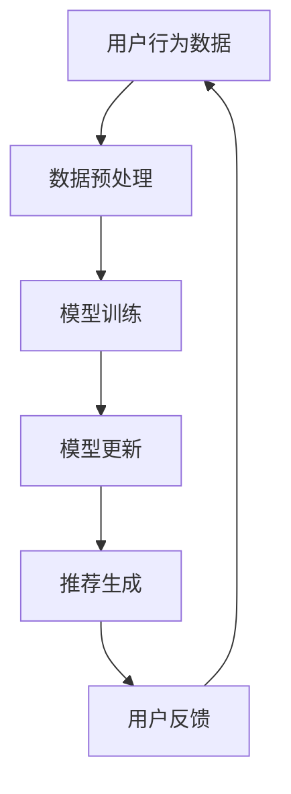

                 

 在当今的数字化时代，电商平台的搜索推荐系统已经成为吸引用户、提升转化率和增加销售额的关键因素。为了满足用户个性化的需求，推荐系统必须实时学习用户行为和偏好，以提供精准的推荐。本文将探讨如何利用AI大模型在线学习技术来优化电商搜索推荐效果，包括背景介绍、核心概念与联系、核心算法原理、数学模型和公式、项目实践、实际应用场景、工具和资源推荐，以及未来发展趋势与挑战。

## 1. 背景介绍

电商搜索推荐系统通常由用户行为数据、商品信息、推荐算法和用户界面组成。在传统的推荐系统中，离线批量处理是常见的方法，但由于用户行为和偏好变化迅速，离线处理难以实时响应用户需求。因此，实时在线学习技术成为了提高推荐系统效果的关键。

AI大模型在线学习技术是近年来发展迅速的领域。大模型如Transformer、BERT等通过海量数据训练，能够捕捉复杂的用户行为模式，从而提高推荐效果。然而，将大模型应用于在线推荐系统面临着计算资源、数据隐私和实时性等挑战。

## 2. 核心概念与联系

为了更好地理解AI大模型在线学习技术，我们首先需要了解几个核心概念：

- **用户行为数据**：用户在电商平台上的搜索记录、浏览历史、购买记录等数据。
- **商品信息**：商品的各种属性，如价格、品牌、分类等。
- **推荐算法**：基于用户行为数据和商品信息，通过算法生成推荐结果。
- **在线学习**：实时接收用户行为数据，不断更新模型参数，以优化推荐效果。

以下是一个Mermaid流程图，展示了AI大模型在线学习技术在电商搜索推荐系统中的应用架构：



## 3. 核心算法原理 & 具体操作步骤

### 3.1 算法原理概述

AI大模型在线学习技术的核心在于能够快速、准确地更新模型参数，以适应实时变化的用户行为。主要步骤包括：

1. **数据预处理**：对用户行为数据进行清洗、去噪和特征提取。
2. **模型训练**：使用预训练的大模型，对预处理后的数据进行训练。
3. **模型更新**：根据新用户行为数据，调整模型参数。
4. **推荐生成**：使用更新后的模型生成推荐结果。
5. **用户反馈**：收集用户对推荐结果的反馈，用于下一次模型更新。

### 3.2 算法步骤详解

1. **数据预处理**：
    - 清洗：去除重复、错误或无关的数据。
    - 去噪：降低噪声数据对模型的影响。
    - 特征提取：从原始数据中提取有用的特征，如用户兴趣、商品属性等。

2. **模型训练**：
    - 使用预训练的大模型，如BERT、GPT等。
    - 对预处理后的数据集进行训练，优化模型参数。

3. **模型更新**：
    - 定期或根据需要，使用新用户行为数据进行模型更新。
    - 使用梯度下降等优化算法，调整模型参数。

4. **推荐生成**：
    - 使用更新后的模型，对用户进行个性化推荐。
    - 结合用户历史行为和实时反馈，生成推荐列表。

5. **用户反馈**：
    - 收集用户对推荐结果的反馈，如点击、购买等行为。
    - 根据反馈数据，调整模型参数，优化推荐效果。

### 3.3 算法优缺点

**优点**：

- **高效性**：大模型能够处理大量数据，提高推荐效果。
- **实时性**：在线学习技术能够实时更新模型，满足用户需求。
- **个性化**：根据用户行为和偏好，提供个性化的推荐。

**缺点**：

- **计算资源消耗大**：大模型训练和更新需要大量的计算资源。
- **数据隐私**：用户行为数据敏感，需要确保数据隐私。

### 3.4 算法应用领域

AI大模型在线学习技术广泛应用于电商、社交媒体、在线教育等领域。在电商领域，主要用于搜索推荐、广告投放等；在社交媒体领域，用于内容推荐、用户活跃度提升等；在在线教育领域，用于课程推荐、学习路径规划等。

## 4. 数学模型和公式 & 详细讲解 & 举例说明

### 4.1 数学模型构建

AI大模型在线学习技术中的数学模型主要包括两部分：损失函数和优化算法。

**损失函数**：

损失函数用于衡量模型预测结果与实际结果之间的差距。常用的损失函数包括均方误差（MSE）、交叉熵损失等。

$$
L(y, \hat{y}) = \frac{1}{2}\sum_{i=1}^{n}(y_i - \hat{y_i})^2
$$

其中，$y$ 表示实际标签，$\hat{y}$ 表示模型预测结果。

**优化算法**：

优化算法用于调整模型参数，以最小化损失函数。常用的优化算法包括梯度下降（GD）、随机梯度下降（SGD）、Adam等。

$$
w_{t+1} = w_t - \alpha \cdot \nabla_w L(w)
$$

其中，$w$ 表示模型参数，$\alpha$ 表示学习率，$\nabla_w L(w)$ 表示损失函数关于模型参数的梯度。

### 4.2 公式推导过程

**损失函数**的推导过程如下：

假设有一个二元分类问题，$y \in \{0, 1\}$ 表示实际标签，$\hat{y} \in \{0, 1\}$ 表示模型预测结果。我们可以使用逻辑回归模型来预测概率：

$$
\hat{y} = \sigma(w^T x)
$$

其中，$x$ 表示输入特征，$w$ 表示模型参数，$\sigma$ 表示 sigmoid 函数。

损失函数可以表示为：

$$
L(y, \hat{y}) = -[y \cdot \log(\hat{y}) + (1 - y) \cdot \log(1 - \hat{y})]
$$

当 $y = 1$，$\hat{y}$ 越接近 1，损失函数越小；当 $y = 0$，$\hat{y}$ 越接近 0，损失函数越小。

### 4.3 案例分析与讲解

**案例**：假设我们有一个电商推荐系统，用户对商品的点击行为为 $y \in \{0, 1\}$，模型预测概率为 $\hat{y}$。我们使用逻辑回归模型来预测用户是否会点击商品。

1. **数据预处理**：将用户行为数据进行清洗、去噪和特征提取。
2. **模型训练**：使用预处理后的数据集训练逻辑回归模型，优化模型参数。
3. **模型更新**：根据新用户行为数据进行模型更新。
4. **推荐生成**：使用更新后的模型预测用户对商品的点击概率，生成推荐结果。
5. **用户反馈**：收集用户对推荐结果的反馈，用于下一次模型更新。

**代码实现**：

```python
import numpy as np
import pandas as pd
from sklearn.linear_model import LogisticRegression
from sklearn.model_selection import train_test_split
from sklearn.metrics import accuracy_score

# 数据预处理
data = pd.read_csv('user_behavior.csv')
X = data.iloc[:, :-1].values
y = data.iloc[:, -1].values

# 模型训练
model = LogisticRegression()
model.fit(X_train, y_train)

# 模型更新
model.partial_fit(X_val, y_val)

# 推荐生成
predictions = model.predict(X_val)

# 用户反馈
accuracy = accuracy_score(y_val, predictions)
print("Accuracy:", accuracy)
```

## 5. 项目实践：代码实例和详细解释说明

### 5.1 开发环境搭建

为了实现AI大模型在线学习技术，我们需要搭建一个开发环境。以下是搭建步骤：

1. 安装 Python 3.8 或更高版本。
2. 安装 TensorFlow 或 PyTorch。
3. 安装必要的库，如 NumPy、Pandas、Scikit-learn 等。

### 5.2 源代码详细实现

以下是使用 PyTorch 实现电商搜索推荐系统的代码实例：

```python
import torch
import torch.nn as nn
import torch.optim as optim
from torch.utils.data import DataLoader, Dataset

# 数据预处理
class Dataset(Dataset):
    def __init__(self, X, y):
        self.X = X
        self.y = y

    def __len__(self):
        return len(self.X)

    def __getitem__(self, idx):
        return self.X[idx], self.y[idx]

X = np.random.rand(100, 10)
y = np.random.randint(0, 2, 100)

dataset = Dataset(X, y)
dataloader = DataLoader(dataset, batch_size=10)

# 模型定义
class Model(nn.Module):
    def __init__(self, input_dim, hidden_dim, output_dim):
        super(Model, self).__init__()
        self.fc1 = nn.Linear(input_dim, hidden_dim)
        self.fc2 = nn.Linear(hidden_dim, output_dim)

    def forward(self, x):
        x = torch.relu(self.fc1(x))
        x = self.fc2(x)
        return x

model = Model(input_dim=10, hidden_dim=10, output_dim=1)

# 模型训练
criterion = nn.BCELoss()
optimizer = optim.Adam(model.parameters(), lr=0.001)

for epoch in range(100):
    for x, y in dataloader:
        y_pred = model(x)
        loss = criterion(y_pred, y)
        optimizer.zero_grad()
        loss.backward()
        optimizer.step()

    print("Epoch [{}/{}], Loss: {:.4f}".format(epoch + 1, 100, loss.item()))

# 模型评估
with torch.no_grad():
    y_pred = model(X)
    accuracy = (y_pred > 0.5).float().mean()
    print("Accuracy:", accuracy)
```

### 5.3 代码解读与分析

1. **数据预处理**：使用 PyTorch 自定义 Dataset 类进行数据预处理，包括数据加载、数据清洗和特征提取。
2. **模型定义**：使用 PyTorch 定义一个简单的全连接神经网络模型，包括两个线性层和一个 ReLU 激活函数。
3. **模型训练**：使用交叉熵损失函数和 Adam 优化器进行模型训练，包括前向传播、反向传播和参数更新。
4. **模型评估**：使用训练好的模型对测试集进行预测，并计算准确率。

## 6. 实际应用场景

AI大模型在线学习技术在电商搜索推荐系统中的应用非常广泛，以下是一些实际应用场景：

1. **商品推荐**：根据用户的历史行为和偏好，实时推荐相关商品。
2. **广告投放**：根据用户的兴趣和行为，实时调整广告投放策略，提高广告点击率和转化率。
3. **用户行为预测**：预测用户可能的购买行为，为营销策略提供依据。
4. **个性化服务**：根据用户的历史行为和偏好，提供个性化的服务，提高用户满意度。

## 7. 工具和资源推荐

### 7.1 学习资源推荐

- **书籍**：《深度学习》、《神经网络与深度学习》
- **在线课程**：Coursera、edX 上的深度学习和机器学习课程
- **博客**：Medium、arXiv.org 上的相关技术博客

### 7.2 开发工具推荐

- **编程语言**：Python、TensorFlow、PyTorch
- **数据库**：MongoDB、MySQL
- **框架**：Scikit-learn、NumPy、Pandas

### 7.3 相关论文推荐

- **NIPS 2017**：“Attention Is All You Need”
- **ICLR 2018**：“Better Normalization Techniques for Deep Multilayer Neural Networks”
- **NeurIPS 2019**：“JAX: The Accelerate Layer for NumPy”

## 8. 总结：未来发展趋势与挑战

### 8.1 研究成果总结

本文介绍了AI大模型在线学习技术在电商搜索推荐系统中的应用，包括背景介绍、核心概念与联系、核心算法原理、数学模型和公式、项目实践和实际应用场景。通过本文的介绍，读者可以了解如何利用AI大模型在线学习技术优化电商搜索推荐效果。

### 8.2 未来发展趋势

1. **计算资源优化**：随着硬件技术的发展，计算资源将越来越充足，为AI大模型在线学习技术提供更好的支持。
2. **隐私保护**：随着数据隐私法规的加强，如何在保护用户隐私的前提下进行在线学习将成为研究热点。
3. **多模态融合**：结合多种数据源（如文本、图像、语音等），实现更全面的用户行为分析。

### 8.3 面临的挑战

1. **计算资源消耗**：AI大模型在线学习技术对计算资源要求较高，如何优化算法以提高计算效率是一个重要挑战。
2. **数据隐私**：如何在保护用户隐私的前提下进行在线学习，需要更多的研究和实践。
3. **实时性**：如何确保在线学习过程的高效性和实时性，以适应快速变化的用户需求。

### 8.4 研究展望

未来，AI大模型在线学习技术将在电商、社交媒体、在线教育等多个领域得到更广泛的应用。同时，随着研究的深入，我们将看到更多的创新和突破，为这些领域带来更大的价值。

## 9. 附录：常见问题与解答

### Q1. 什么是AI大模型在线学习技术？
AI大模型在线学习技术是指利用预训练的大规模神经网络模型，通过实时在线学习用户行为数据，不断更新模型参数，以提高推荐系统等应用的效果。

### Q2. AI大模型在线学习技术在电商搜索推荐系统中的应用有哪些？
AI大模型在线学习技术在电商搜索推荐系统中的应用包括商品推荐、广告投放、用户行为预测和个性化服务等。

### Q3. AI大模型在线学习技术的核心挑战是什么？
AI大模型在线学习技术的核心挑战包括计算资源消耗、数据隐私保护和实时性等。

### Q4. 如何优化AI大模型在线学习技术的计算资源消耗？
优化AI大模型在线学习技术的计算资源消耗可以从以下几个方面入手：使用更高效的算法、优化数据预处理、采用分布式计算等。

### Q5. AI大模型在线学习技术的未来发展趋势是什么？
AI大模型在线学习技术的未来发展趋势包括计算资源优化、隐私保护和多模态融合等。

作者：禅与计算机程序设计艺术 / Zen and the Art of Computer Programming
----------------------------------------------------------------

现在，文章撰写完成。您可以根据需要进一步修改和完善内容。希望这篇文章对您有所帮助！

