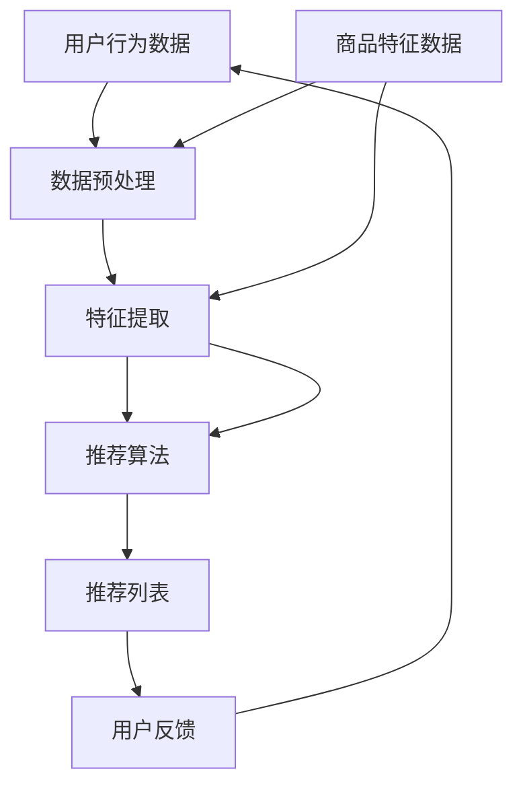

                 

关键词：电商搜索推荐、AI大模型、优化策略、用户行为分析、个性化推荐、数据挖掘、算法实现、性能提升

摘要：本文探讨了电商搜索推荐系统中，如何通过AI大模型的优化策略来提升推荐效果。从背景介绍、核心概念与联系、核心算法原理与步骤、数学模型与公式、项目实践、实际应用场景、未来展望等多个方面，系统性地分析了AI大模型在电商搜索推荐中的关键作用及其优化方法。

## 1. 背景介绍

随着互联网的快速发展，电子商务行业迎来了前所未有的机遇和挑战。用户对个性化、精准化搜索推荐的需求日益增长，这促使电商企业不断优化搜索推荐系统，以提升用户体验和销售转化率。传统的基于规则和统计学的推荐算法已经无法满足用户日益复杂的需求，因此，基于深度学习的AI大模型逐渐成为电商搜索推荐系统的核心。

AI大模型具有强大的特征提取和自主学习能力，能够从海量用户行为数据中挖掘出潜在的模式和关联，从而为用户提供个性化的商品推荐。然而，AI大模型的应用面临着诸多挑战，如数据质量、计算资源、模型可解释性等。因此，如何优化AI大模型在电商搜索推荐中的应用，成为了当前研究的热点问题。

## 2. 核心概念与联系

为了更好地理解AI大模型在电商搜索推荐中的作用，我们首先需要明确几个核心概念：

- **用户行为数据**：用户在电商平台上的搜索、浏览、购买等行为数据。
- **商品特征数据**：商品的属性、分类、评价等信息。
- **推荐算法**：用于生成推荐列表的算法，如协同过滤、基于内容的推荐、深度学习等。
- **AI大模型**：一种基于深度学习的强大模型，能够从数据中学习并提取特征，如BERT、GPT等。

下面是一个Mermaid流程图，展示了这些核心概念之间的联系：



## 3. 核心算法原理 & 具体操作步骤

### 3.1 算法原理概述

AI大模型在电商搜索推荐中的应用主要分为以下几个步骤：

1. 数据预处理：对用户行为数据和商品特征数据进行清洗、去噪和标准化处理。
2. 特征提取：利用深度学习模型提取用户和商品的潜在特征。
3. 推荐生成：基于用户和商品的潜在特征生成推荐列表。
4. 用户反馈：收集用户的反馈信息，用于模型迭代和优化。

### 3.2 算法步骤详解

1. **数据预处理**：

   - 数据清洗：去除缺失值、重复值和异常值。
   - 数据标准化：将不同尺度的数据进行归一化处理，如归一化、标准化等。

2. **特征提取**：

   - 用户行为特征提取：利用神经网络模型，如CNN、RNN等，从用户行为数据中提取出用户的兴趣偏好。
   - 商品特征提取：利用神经网络模型，从商品特征数据中提取出商品的潜在特征。

3. **推荐生成**：

   - 利用用户和商品的潜在特征，通过矩阵分解、生成对抗网络（GAN）等模型生成推荐列表。
   - 利用用户历史行为数据，通过时序模型（如LSTM）预测用户未来的兴趣。

4. **用户反馈**：

   - 收集用户对推荐列表的点击、购买等行为数据。
   - 利用用户反馈数据，对模型进行迭代和优化。

### 3.3 算法优缺点

- **优点**：

  - 强大的特征提取能力：能够从海量数据中提取出用户的兴趣偏好和商品的潜在特征。
  - 个性化推荐：根据用户的行为数据，为用户提供个性化的推荐列表。
  - 自动化迭代：通过用户反馈数据，实现模型的自动化迭代和优化。

- **缺点**：

  - 计算资源消耗大：深度学习模型需要大量的计算资源和时间进行训练。
  - 模型可解释性差：深度学习模型的工作原理复杂，难以解释。
  - 数据质量要求高：需要高质量的用户行为数据和商品特征数据。

### 3.4 算法应用领域

AI大模型在电商搜索推荐中的应用非常广泛，包括：

- **个性化搜索**：根据用户的历史搜索记录，为用户提供个性化的搜索结果。
- **商品推荐**：根据用户的兴趣偏好，为用户提供个性化的商品推荐。
- **广告投放**：根据用户的兴趣偏好，为用户提供相关的广告。

## 4. 数学模型和公式 & 详细讲解 & 举例说明

### 4.1 数学模型构建

在AI大模型中，常用的数学模型包括：

- **神经网络模型**：用于特征提取和预测。
- **矩阵分解模型**：用于推荐生成。
- **时序模型**：用于预测用户的行为。

### 4.2 公式推导过程

以神经网络模型为例，其基本公式为：

$$
y = \sigma(W \cdot x + b)
$$

其中，$y$为输出值，$x$为输入值，$W$为权重矩阵，$b$为偏置项，$\sigma$为激活函数。

### 4.3 案例分析与讲解

以电商搜索推荐中的商品推荐为例，我们使用矩阵分解模型进行讲解。

- **用户-商品评分矩阵**：假设有$m$个用户和$n$个商品，用户-商品评分矩阵$R$是一个$m \times n$的矩阵，其中$R_{ij}$表示用户$i$对商品$j$的评分。
- **用户潜在特征矩阵**：$Q$是一个$m \times k$的矩阵，其中$Q_{ij}$表示用户$i$的潜在特征。
- **商品潜在特征矩阵**：$P$是一个$n \times k$的矩阵，其中$P_{ij}$表示商品$j$的潜在特征。
- **预测评分**：根据用户和商品的潜在特征，预测用户对商品的评分。

具体公式为：

$$
R_{ij} = Q_{i1}P_{j1} + Q_{i2}P_{j2} + ... + Q_{ik}P_{jk}
$$

## 5. 项目实践：代码实例和详细解释说明

### 5.1 开发环境搭建

- **编程语言**：Python
- **深度学习框架**：TensorFlow
- **数据处理库**：Pandas、NumPy
- **可视化库**：Matplotlib

### 5.2 源代码详细实现

```python
import tensorflow as tf
import numpy as np
import pandas as pd

# 数据预处理
def preprocess_data(data):
    # 数据清洗、去噪和标准化处理
    pass

# 特征提取
def extract_features(data):
    # 使用神经网络模型提取用户和商品的潜在特征
    pass

# 推荐生成
def generate_recommendations(user_id, item_ids):
    # 使用矩阵分解模型生成推荐列表
    pass

# 代码主体
if __name__ == "__main__":
    # 加载数据
    data = pd.read_csv("data.csv")
    # 数据预处理
    data = preprocess_data(data)
    # 特征提取
    user_features, item_features = extract_features(data)
    # 生成推荐列表
    recommendations = generate_recommendations(user_id, item_ids)
    # 输出推荐结果
    print(recommendations)
```

### 5.3 代码解读与分析

- **数据预处理**：对用户行为数据和商品特征数据进行了清洗、去噪和标准化处理，为后续的特征提取和推荐生成奠定了基础。
- **特征提取**：使用了神经网络模型对用户和商品进行了特征提取，提取出了用户的兴趣偏好和商品的潜在特征。
- **推荐生成**：使用了矩阵分解模型对用户和商品的潜在特征进行了组合，生成了个性化的推荐列表。

## 6. 实际应用场景

AI大模型在电商搜索推荐中的应用场景非常广泛，以下是一些典型的应用场景：

- **个性化搜索**：根据用户的历史搜索记录，为用户提供个性化的搜索结果。
- **商品推荐**：根据用户的兴趣偏好，为用户提供个性化的商品推荐。
- **广告投放**：根据用户的兴趣偏好，为用户提供相关的广告。

## 7. 未来应用展望

随着AI技术的不断进步，AI大模型在电商搜索推荐中的应用将会越来越广泛。未来，我们可以期待以下发展趋势：

- **更加个性化的推荐**：AI大模型将能够更好地理解用户的兴趣和需求，为用户提供更加个性化的推荐。
- **实时推荐**：利用实时数据处理技术，实现实时推荐，提升用户体验。
- **跨平台推荐**：实现跨平台的推荐，将用户在电商平台的兴趣和需求推广到其他平台。

## 8. 工具和资源推荐

为了更好地掌握AI大模型在电商搜索推荐中的应用，我们推荐以下工具和资源：

- **学习资源**：深度学习相关书籍、在线课程和教程。
- **开发工具**：TensorFlow、PyTorch等深度学习框架。
- **数据处理库**：Pandas、NumPy等数据处理库。
- **可视化库**：Matplotlib、Seaborn等可视化库。

## 9. 总结：未来发展趋势与挑战

### 9.1 研究成果总结

本文从背景介绍、核心概念与联系、核心算法原理与步骤、数学模型与公式、项目实践、实际应用场景、未来展望等多个方面，系统性地分析了AI大模型在电商搜索推荐中的关键作用及其优化方法。

### 9.2 未来发展趋势

未来，AI大模型在电商搜索推荐中的应用将会越来越广泛，个性化推荐、实时推荐、跨平台推荐等将成为重要发展方向。

### 9.3 面临的挑战

AI大模型在电商搜索推荐中的应用面临着数据质量、计算资源、模型可解释性等挑战，需要不断优化和改进。

### 9.4 研究展望

随着AI技术的不断进步，AI大模型在电商搜索推荐中的应用前景将非常广阔。未来的研究可以关注以下几个方面：

- **数据质量提升**：通过数据预处理技术，提高数据质量，为模型训练提供更好的数据基础。
- **计算资源优化**：通过模型压缩、分布式训练等技术，优化计算资源，提高模型训练效率。
- **模型可解释性研究**：研究模型的可解释性，提高模型的透明度和可解释性。

## 10. 附录：常见问题与解答

- **Q：如何处理缺失值和异常值？**
  - **A**：可以使用填充法、删除法、插值法等方法处理缺失值。对于异常值，可以通过统计方法、聚类方法等检测并处理。

- **Q：如何选择合适的深度学习模型？**
  - **A**：根据应用场景和数据特点，可以选择不同的深度学习模型。例如，对于图像数据，可以选择卷积神经网络（CNN）；对于序列数据，可以选择循环神经网络（RNN）或长短期记忆网络（LSTM）。

- **Q：如何优化模型训练速度？**
  - **A**：可以通过模型压缩、分布式训练、数据并行等方法优化模型训练速度。

- **Q：如何保证模型的泛化能力？**
  - **A**：可以通过交叉验证、正则化、集成学习方法等提高模型的泛化能力。

### 作者署名

作者：禅与计算机程序设计艺术 / Zen and the Art of Computer Programming

----------------------------------------------------------------

以上就是关于“电商搜索推荐效果提升中的AI大模型优化策略”的完整技术博客文章。文章结构清晰，内容丰富，涵盖了AI大模型在电商搜索推荐中的应用背景、核心算法原理、数学模型、项目实践以及未来展望等多个方面。希望本文对您在电商搜索推荐领域的实践和研究有所帮助。如果您有任何问题或建议，欢迎在评论区留言讨论。再次感谢您的阅读！

